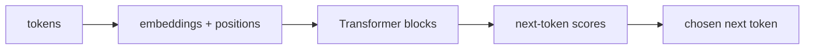

# P5-4.1 Transformer 구조 복습

P5-3장에서는 LLM 발전사의 큰 흐름과 직접 계보를 정리했습니다. 이제 다시 구조로 돌아와야 합니다.

LLM 관점에서 Transformer를 다시 보면, 무엇이 정말 핵심인가?

이 절은 그 질문에 답합니다.

LLM에서 Transformer는 토큰들을 임베딩으로 바꾸고, self-attention으로 서로의 관계를 읽고, feed-forward와 반복 블록으로 표현을 정제하며, 최종적으로 다음 토큰을 예측하는 기본 구조다.

## 이 절의 범위

이 절은 다음 질문에 답합니다.

- Part 4에서 본 Transformer를 LLM 관점으로 다시 보면 무엇이 달라지는가?
- 토큰, 임베딩, self-attention, 다음 토큰 예측은 어떻게 이어지는가?
- 왜 Transformer는 생성형 언어 모델의 기본 구조가 되었는가?

이 절은 다음 내용은 깊게 다루지 않습니다.

- multi-head attention의 세부 수식
- KV cache 구현
- 추론 최적화와 서빙 엔진 구조

이 절의 목적은 Transformer 공식을 다시 쓰는 데 있지 않습니다. Part 5에서 다룰 BERT, GPT, pretraining, RAG, agent 설명을 모두 떠받치는 `LLM 기준의 구조 지도`를 다시 잡는 데 있습니다.

## 이 절의 목표

- Transformer를 LLM 기준으로 다시 설명할 수 있습니다.
- 토큰 -> 임베딩 -> attention 블록 -> 다음 토큰 예측 흐름을 연결할 수 있습니다.
- Part 4의 구조 설명이 Part 5의 생성형 언어 모델 설명으로 어떻게 이어지는지 말할 수 있습니다.
- 다음 절의 context window 설명으로 자연스럽게 넘어갈 수 있습니다.

## Part 4의 Transformer와 Part 5의 Transformer는 무엇이 다른가

Part 4에서는 Transformer를 딥러닝 구조로 설명했습니다. 즉:

- self-attention
- feed-forward
- residual connection
- layer normalization

같은 블록 요소를 중심에 두었습니다.

Part 5에서는 같은 구조를 보되 질문이 달라집니다.

- 이 구조가 텍스트를 어떻게 읽는가?
- 이 구조가 왜 다음 토큰 예측(next-token prediction)에 잘 맞는가?
- 이 구조가 왜 LLM 서비스의 기본 계산 단위가 되었는가?

즉, 구조는 같지만 `읽는 관점`이 달라집니다.

## LLM에서는 토큰이 출발점이다

LLM은 문장을 통째로 계산하지 않습니다. 먼저 토큰(token) 시퀀스로 읽습니다.

예를 들어 다음처럼 생각할 수 있습니다.

```text
raw text
-> tokens
-> token ids
-> embeddings
-> Transformer blocks
-> next-token scores
```

여기서 Transformer는 토큰을 이미 쪼갠 뒤의 계산 구조입니다. 즉, Transformer는 텍스트를 직접 해석하는 첫 단계가 아니라, `토큰 표현을 반복적으로 가공하는 중심 엔진`에 가깝습니다.

## 임베딩은 계산 가능한 출발 표현을 만든다

P5-2장에서 본 것처럼 토큰 ID는 단순 번호입니다. Transformer는 이 번호를 직접 다루지 않고, 먼저 임베딩(embedding) 벡터로 바꿉니다.

이 임베딩 벡터는 이후 모든 계산의 출발점이 됩니다.

다음처럼 이해하면 충분합니다.

`임베딩은 토큰을 Transformer가 계산할 수 있는 숫자 좌표로 바꾸는 단계다.`

즉, Transformer는 텍스트를 문자열로 읽는 것이 아니라, 임베딩된 토큰 표현 위에서 작동합니다.

## self-attention은 왜 LLM에 특히 중요했나

생성형 언어 모델은 현재 위치의 다음 토큰을 예측해야 합니다. 이때 지금까지 등장한 이전 토큰들이 모두 힌트가 될 수 있습니다.

예를 들어:

- 앞에서 등장한 주어
- 코드 블록의 함수 이름
- 문서 초반의 핵심 조건

같은 정보가 뒤쪽 생성에 영향을 줄 수 있습니다.

self-attention은 각 토큰이 다른 토큰들과의 관련도를 계산하게 합니다. 그래서 현재 토큰 표현은 주변과 멀리 있는 이전 토큰들의 정보를 함께 반영할 수 있습니다.

다음처럼 기억하면 좋습니다.

`LLM에서 self-attention은 지금까지 나온 토큰들 중 무엇이 현재 생성에 더 중요한지 계산하는 구조다.`

## feed-forward와 반복 블록은 왜 필요한가

self-attention만으로는 토큰 간 관계를 섞을 수 있지만, 그 정보가 바로 충분히 좋은 표현이 되는 것은 아닙니다.

feed-forward network는 각 위치에서 그 표현을 더 가공합니다. 그리고 이 블록이 여러 층 반복되면 표현은 더 풍부해질 수 있습니다.

즉:

- attention은 관계를 읽고
- feed-forward는 각 위치 표현을 다시 다듬고
- 여러 층 반복은 표현을 점점 더 정제합니다

이 흐름은 Part 4의 표현 학습(representation learning) 설명과 그대로 이어집니다.

## 왜 마지막에는 다음 토큰 점수가 나오는가

LLM 설명에서 중요한 차이는 마지막 출력 해석입니다.

분류 모델은 마지막에 클래스(class) 점수를 내는 경우가 많습니다. 하지만 생성형 언어 모델은 보통 `다음에 올 수 있는 토큰 후보들`에 대한 점수를 냅니다.

즉, Transformer 블록을 지나면 마지막에는 대략 이런 질문이 됩니다.

- 다음 위치에 어떤 토큰이 올 가능성이 큰가?

이 점수는 이후 softmax와 sampling 같은 절차를 거쳐 실제 출력 토큰 선택으로 이어집니다.

따라서 Part 4의 구조 설명은 Part 5에서 다음과 같이 다시 읽힙니다.

> 표현 학습 구조
> -> 다음 토큰 분포 계산 구조

## 아주 단순하게 그리면



이 도식은 Part 5에서 Transformer를 읽을 때 가장 자주 떠올려야 하는 최소 구조입니다.

## 사례로 보기

### 사례 1. 문장 자동완성

`오늘 회의는 오후`

라는 입력 뒤에 어떤 토큰이 올지 예측하려면, Transformer는 앞 토큰들을 보고 다음 후보 분포를 계산합니다.

### 사례 2. 코드 생성

함수 정의와 변수 선언이 앞에 있고, 뒤에서 구현을 이어 쓸 때, Transformer는 앞쪽 토큰들과의 관계를 계속 참조해야 합니다.

### 사례 3. 긴 문서 요약

문서 앞부분의 핵심 개념이 뒤쪽 요약 생성에 영향을 줍니다. Transformer는 이런 문맥 정보를 반복 블록 안에서 계속 반영합니다.

## 작은 Python 예제로 보기

이번 예제의 목표는 실제 Transformer를 구현하는 것이 아니라, `입력 토큰 -> 점수 -> 다음 토큰 선택`이라는 마지막 단계 감각을 확인하는 것입니다.

입력:

- 세 개의 후보 토큰
- 각 후보에 대한 점수

출력:

- 가장 높은 점수 후보

```python
candidates = ["입니다", "였다", "이다"]
scores = [2.4, 1.1, 1.9]

best_index = scores.index(max(scores))

print("candidates =", candidates)
print("scores =", scores)
print("next_token =", candidates[best_index])
```

실행 결과 예시는 다음처럼 읽을 수 있습니다.

```text
candidates = ['입니다', '였다', '이다']
scores = [2.4, 1.1, 1.9]
next_token = 입니다
```

이 예제는 softmax나 sampling을 구현하지 않았습니다. 하지만 다음 점을 보여 줍니다.

- Transformer의 마지막 계산은 보통 다음 토큰 후보 점수로 이어지고
- 실제 출력은 그 점수 해석 규칙에 따라 선택된다는 점입니다

## 역사와 커리큘럼 관점

Transformer가 언어 모델의 중심 구조가 된 이유는 단순히 성능이 좋았기 때문만은 아닙니다.

- 긴 문맥을 더 잘 다룰 수 있었고
- 병렬 처리와 잘 맞았으며
- 같은 기본 구조가 번역, 요약, 질의응답, 코드 생성 같은 여러 언어 작업에 넓게 재사용될 수 있었기 때문입니다

커리큘럼 관점에서 이 절은 중요합니다.

- Part 4의 딥러닝 구조를 Part 5의 생성 모델 구조로 다시 읽게 하고
- BERT와 GPT의 차이를 더 정확히 이해하게 하며
- context window, prompt, RAG 설명의 기반을 마련하기 때문입니다

## 다음 절과의 연결

여기까지 오면 다음 질문이 남습니다.

- Transformer가 모든 이전 토큰을 볼 수 있다고 해도, 실제로는 어디까지 볼 수 있는가?
- 왜 context window가 비용과 성능의 중요한 제약이 되는가?

이 질문은 P5-4.2 attention과 context window로 이어집니다.

## 이 절에서 기억할 관점

- Part 5의 Transformer는 `다음 토큰을 예측하는 언어 모델 구조`로 다시 읽어야 합니다.
- 토큰은 임베딩으로 바뀐 뒤 Transformer 블록을 통과합니다.
- self-attention은 문맥 관계를 읽고, 마지막에는 다음 토큰 점수로 이어집니다.
- 이 구조가 이후 BERT, GPT, pretraining, prompt 설명의 기반입니다.

## 체크리스트

- Transformer를 LLM 기준으로 다시 설명할 수 있는가?
- 토큰 -> 임베딩 -> Transformer 블록 -> 다음 토큰 점수 흐름을 말할 수 있는가?
- Part 4의 구조 설명과 Part 5의 생성 설명이 어떻게 이어지는지 설명할 수 있는가?
- 다음 절의 context window 문제로 왜 이어지는지 설명할 수 있는가?

## 출처와 참고 자료

- Ashish Vaswani et al., `Attention Is All You Need`, NeurIPS 2017, 확인 날짜: 2026-06-29.
- Alec Radford et al., `Language Models are Unsupervised Multitask Learners`, OpenAI, 2019, 확인 날짜: 2026-06-29.
- Tom B. Brown et al., `Language Models are Few-Shot Learners`, arXiv, 2020, 확인 날짜: 2026-06-29.
- Jay Alammar, `The Illustrated Transformer`, 확인 날짜: 2026-06-29. [https://jalammar.github.io/illustrated-transformer/](https://jalammar.github.io/illustrated-transformer/){: target="_blank" rel="noopener noreferrer" }
