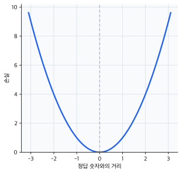
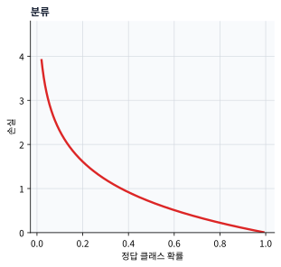
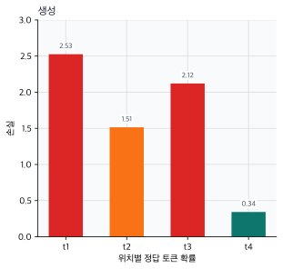
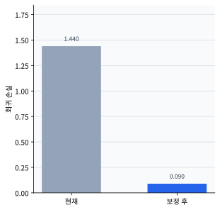
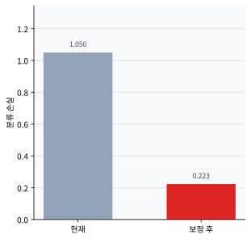
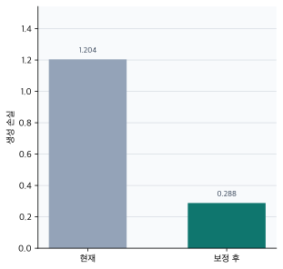

# P5-4.2 문제 유형별 손실

> Section ID: `P5-4.2`
> Version: `v2026.07.26`

P5-4.1에서는 손실 함수(loss function)를 `모델의 현재 출력이 목표와 얼마나 어긋나는지 숫자로 만드는 기준`으로 보았습니다. 이제 자연스럽게 다음 질문이 생깁니다.

모든 문제에서 같은 손실 함수를 쓰는가?

답은 그렇지 않다는 것입니다.

손실 함수는 문제 유형에 따라 달라진다. 왜냐하면 회귀(regression), 분류(classification), 생성(generation)은 틀림의 모양 자체가 다르기 때문이다.

문제 유형에 따라 손실을 다르게 읽는 기준이 다시 섞일 때는 개념사전의 [손실 함수(loss function)](../../../reference/concept-glossary-parts/07-siot.md#loss-function), [평균 제곱 오차(mean squared error, MSE)](../../../reference/concept-glossary-parts/13-pieup.md#mean-squared-error-mse), [교차 엔트로피(cross-entropy)](../../../reference/concept-glossary-parts/01-giyeok.md#cross-entropy) 항목으로 돌아갑니다.

## 문제 유형이 손실을 바꾸는 질문

- 회귀와 분류는 왜 다른 손실 기준을 쓰는가?
- 숫자를 맞히는 문제와 확률을 맞히는 문제는 어떻게 다르게 읽어야 하는가?
- 생성 문제에서는 `다음 토큰을 얼마나 그럴듯하게 맞히는가`가 왜 손실로 연결되는가?
- 손실 함수 선택이 모델 학습 방향에 어떤 차이를 만드는가?

이 절에서는 공식을 많이 보여 주기보다, `왜 문제마다 손실이 달라지는가`를 설명합니다. 손실의 미분과 학습 갱신 흐름은 P5-5.1, P5-5.2에서 다시 연결합니다. 즉, 이번 절은 문제 유형에 따라 `무엇을 틀림으로 읽는가`가 왜 달라지는지 먼저 닫습니다.

## 출력 해석과 손실 선택의 판단 기준

- 회귀, 분류, 생성 문제의 손실 관점을 구분할 수 있습니다.
- 회귀에서는 오차 크기, 분류에서는 정답 클래스 확신도, 생성에서는 다음 토큰 확률이 핵심이 된다는 점을 말할 수 있습니다.
- 손실 함수가 문제의 틀림 방식에 맞게 설계되어야 한다는 점을 이해할 수 있습니다.
- 문제 유형별로 어떤 예측을 더 먼저 크게 고쳐야 하는지 설명할 수 있습니다.

## 왜 문제마다 손실이 달라지나

문제 유형이 다르면 `틀렸다`는 말의 의미도 달라집니다.

예를 들어:

- 배치 에너지 사용량 예측은 `얼마나 벗어났는가`가 중요합니다.
- 검사 상태 분류는 `정답 클래스에 얼마나 확신을 두었는가`가 중요합니다.
- 운영 안내 문구 생성은 `다음 단어를 얼마나 그럴듯하게 예측했는가`가 중요합니다.

즉, 손실 함수는 단순한 수학 공식이 아니라, `이 문제에서 무엇을 틀림으로 볼 것인가`를 정하는 규칙입니다.

이를 큰 흐름으로 줄이면 다음과 같습니다.

```mermaid
--8<-- "assets/part-05/chapter-04/loss-selection-flow-ko.mmd"
```

이 도식의 핵심은 모델보다 먼저 문제 구조를 봐야 한다는 점입니다.

같은 흐름을 `무엇을 틀림으로 읽는가` 기준으로 다시 나누면 다음과 같습니다.

```mermaid
--8<-- "assets/part-05/chapter-04/problem-loss-branches-ko.mmd"
```

이 도식에서 먼저 확인할 결과는, 문제 유형이 바뀌면 손실 공식 이름보다 먼저 `어떤 틀림을 숫자로 만들고 있는가`가 갈라진다는 점입니다.

## 회귀(regression)에서는 무엇이 중요하나

회귀는 보통 연속적인 숫자를 예측하는 문제입니다.

- 배치 에너지 사용량
- 압력 안정화 시간
- 시간대별 냉각수 수요량
- 설비 이송 거리

이런 문제에서는 `정답에서 얼마나 멀리 벗어났는가`가 중심이 됩니다.

즉, 회귀 손실은 오차(error)의 크기를 숫자로 모으는 방향으로 설계됩니다.

다음처럼 이해하면 충분합니다.

- 조금 틀리면 작은 손실
- 많이 틀리면 큰 손실

대표적으로는 평균제곱오차(mean squared error, MSE)나 평균절대오차(mean absolute error, MAE) 같은 관점이 나옵니다.

## 분류(classification)에서는 무엇이 중요하나

분류는 정답 클래스가 정해져 있는 문제입니다.

- 즉시 정지 / 모니터링 유지
- 정상 / 미세 스크래치
- 재측정 필요 / 자동 통과

여기서는 단순히 맞았다/틀렸다도 중요하지만, 학습에서는 그보다 더 미세한 정보가 필요합니다.

예를 들어 모델이:

- 정답 클래스에 0.51 확률을 주었는지
- 정답 클래스에 0.99 확률을 주었는지

는 둘 다 맞았다고 볼 수 있지만, 학습 관점에서는 분명 차이가 있습니다.

즉, 분류 손실은 `정답 클래스에 얼마나 높은 확신을 주었는가`, 또는 `틀린 클래스에 얼마나 자신 있게 갔는가`를 더 민감하게 읽는 방향으로 설계됩니다.

이 때문에 cross-entropy가 대표 손실로 자주 등장합니다.

## 생성(generation)에서는 무엇이 중요하나

생성 문제는 분류와 닮은 듯 다릅니다. 특히 LLM 문맥에서는 한 번에 전체 문장을 맞히는 것이 아니라, 보통 `다음 토큰(next token)`을 예측하는 식으로 학습합니다.

즉, 생성 학습은 매우 자주 다음 구조로 읽을 수 있습니다.

- 현재까지의 문맥(context)을 보고
- 다음 토큰 후보들에 확률을 두고
- 실제 정답 토큰에 높은 확률을 주는 방향으로 학습

이 때문에 생성 문제의 손실도 분류와 가까운 확률적 손실을 쓰는 경우가 많습니다. 실무와 교재에서는 보통 각 위치의 정답 토큰에 대한 cross-entropy 또는 negative log-likelihood(NLL)를 계산하고, 이를 시퀀스 전체와 배치 전체에 걸쳐 합치거나 평균내어 목적함수(objective)로 둡니다. 다만 차이는 이것이 한 번의 이진 판단이 아니라, 긴 시퀀스(sequence) 전체에 걸쳐 반복된다는 점입니다.

다음처럼 이해하면 충분합니다.

`생성 모델의 손실은 문장을 통째로 외우는 손실이 아니라, 매 위치에서 다음 토큰을 얼마나 잘 맞히는지를 쌓아 가는 손실이다.`

## 회귀와 분류를 비교해 보기

같은 `틀림`이라는 말이라도 회귀와 분류는 전혀 다르게 읽힙니다.

| 문제 유형 | 출력 형태 | 틀림을 읽는 핵심 |
| --- | --- | --- |
| 회귀 | 연속값 | 정답 숫자에서 얼마나 멀리 벗어났는가 |
| 분류 | 클래스 확률 | 정답 클래스에 얼마나 확신을 주었는가 |
| 생성 | 다음 토큰 확률 분포 | 정답 토큰을 얼마나 그럴듯하게 예측했는가 |

이 표를 이해하면 손실 함수가 단순한 구현 선택이 아니라, 문제 구조를 반영한다는 점이 선명해집니다.

같은 내용을 `손실을 잘못 고르면 무엇이 흐려지는가`까지 붙여 보면 더 분명해집니다.

| 문제 유형 | 손실이 잘 읽어야 하는 것 | 다른 유형 기준으로 읽으면 흐려지는 것 |
| --- | --- | --- |
| 회귀 | 숫자 오차의 크기 | 클래스 확률처럼 읽으면 실제 거리 감각이 약해집니다. |
| 분류 | 정답 클래스 확신도와 오답 확신도 | 숫자 차이만 보면 `자신 있게 틀림`을 충분히 벌주기 어렵습니다. |
| 생성 | 위치별 다음 토큰 확률 | 한 번의 정오표처럼 읽으면 시퀀스 전체 누적 오차가 흐려집니다. |

즉, 손실 함수 선택은 `공식 이름 고르기`보다 먼저 `이 문제에서 어떤 틀림을 가장 민감하게 읽어야 하는가`를 정하는 일입니다.

이 차이는 그래프의 가로축부터 달라진다고 보면 더 쉽습니다. 회귀는 정답 숫자와의 거리, 분류는 정답 클래스에 준 확률, 생성은 여러 위치에서 정답 토큰에 준 확률을 먼저 봅니다.







따라서 손실 숫자끼리 바로 크기만 비교하기보다, 먼저 같은 문제 유형 안에서 어느 예측이 더 나쁜지를 읽어야 합니다. 이 세 그래프처럼 문제 유형이 바뀌면 손실이 읽는 축도 함께 바뀝니다.

## 사례 및 예시

### 사례 1. 회귀

혼합 배치 하나의 총 에너지 사용량을 추정한다고 생각해 봅시다. 사람은 이 장면에서 먼저 `정답 사용량과 얼마나 떨어져 있는가`를 봅니다.

- 실제 사용량: 5.0kWh
- 예측 1: 4.9kWh
- 예측 2: 3.5kWh

여기서는 예측 1이 훨씬 덜 틀렸습니다. 사람도 `4.9kWh는 꽤 가깝고 3.5kWh는 많이 벗어났다`고 직관적으로 느끼기 쉽습니다. 회귀 문제에서 중요한 기준은 맞혔는가/틀렸는가가 아니라 `얼마나 멀리 벗어났는가`입니다. 그래서 손실은 보통 예측 1에 더 작은 숫자를 주고, 예측 2에는 더 큰 경고 신호를 주는 편이 자연스럽습니다. 이 차이가 있어야 에너지 예측 모델에서 `조금 보정하면 되는 모델`과 `전반적으로 다시 봐야 하는 모델`을 구분할 수 있습니다.

| 사람이 먼저 보기 쉬운 기준 | 회귀 손실 관점으로 다시 읽는 기준 |
| --- | --- |
| 둘 다 정답이 아니니 그냥 오답이라고 본다 | 정답에서 얼마나 멀리 벗어났는지를 먼저 본다 |
| 사용량 범위를 대충 맞혔는지만 본다 | 오차가 0.1kWh인지 1.5kWh인지 차이를 숫자로 더 강하게 남긴다 |
| 예측이 어긋난 정도를 문장으로만 판단한다 | 손실 숫자로 바꿔 여러 샘플을 같은 기준으로 비교한다 |

그래서 이 사례에서 확인해야 할 결과는 정답 여부가 아니라, 더 멀리 벗어난 예측에 실제로 더 큰 손실이 붙는가입니다.

| 사람이 먼저 하기 쉬운 오독 | 왜 덜 좋은가 | 더 나은 읽기 |
| --- | --- | --- |
| `4.9kWh`와 `3.5kWh`를 둘 다 그냥 오답으로 묶는다 | `조금 보정하면 되는 예측`과 `크게 수정해야 하는 예측`이 구분되지 않는다 | 회귀에서는 오차 거리 차이를 먼저 읽어 더 멀리 벗어난 예측을 우선 수정 대상으로 본다 |
| 회귀 손실을 `정답에 속할 확률`처럼 읽는다 | 연속값 문제를 분류 문제처럼 오해하게 된다 | 회귀 손실은 확률이 아니라 거리 기반 오차 신호로 읽는다 |

### 사례 2. 분류

표면 검사 모델이 프레임 하나를 읽는다고 해 봅시다. 사람이 먼저 보는 기준은 보통 `맞혔는가`이지만, 실제 운영에서는 `얼마나 확신 있게 맞혔는가`도 함께 중요합니다. 정답 클래스가 `미세 스크래치`라고 합시다.

- 예측 1: 미세 스크래치 0.55, 정상 0.45
- 예측 2: 미세 스크래치 0.95, 정상 0.05

둘 다 정답을 맞혔지만, 학습 관점에서는 예측 2가 훨씬 더 낫다고 읽는 편이 자연스럽습니다. 사람은 둘 다 1등이 `미세 스크래치`이니 비슷하다고 보기 쉽지만, 분류 문제에서는 `얼마나 확신 있게 정답을 밀었는가`가 매우 중요합니다. 자동 통과 여부를 바로 정하는 검사 시스템에서는 `맞히긴 했지만 거의 헷갈린 상태`와 `확신 있게 맞힌 상태`를 같은 것으로 보면 다음 학습 방향이 흐려집니다. 예를 들어 자동 확정 임계치를 둘 때 0.55는 사람 검토로 보내고 0.95는 바로 재작업 큐로 보내는 식의 차이가 생길 수 있습니다. 그래서 분류 손실은 단순 정오표보다 확률 분포를 더 세밀하게 봐야 합니다.

| 사람이 먼저 보기 쉬운 기준 | 분류 손실 관점으로 다시 읽는 기준 |
| --- | --- |
| 둘 다 1등이 미세 스크래치이니 거의 같다고 본다 | 정답을 얼마나 강하게 1등으로 밀었는지를 함께 본다 |
| 정오표 한 칸으로 충분하다고 느낀다 | 0.55와 0.95는 학습 신호가 크게 다르다고 본다 |
| 확신 차이는 운영 정책에서만 중요하다고 본다 | 손실 단계부터 확신 차이가 업데이트 크기에 영향을 준다고 본다 |

그래서 이 사례에서 확인해야 할 결과는 둘 다 정답이어도, 더 낮은 확신의 예측에 실제로 더 큰 손실이 남는가입니다.

| 출력 장면 | 덜 나쁜 오독 | 더 위험한 오독 | 더 나은 읽기 |
| --- | --- | --- | --- |
| `미세 스크래치 0.55, 정상 0.45` | 겨우 맞혔지만 아직 불안정하다고 본다 | `정답이니 더 볼 것 없다`고 끝낸다 | 정답이더라도 확신이 낮으면 더 큰 손실과 추가 학습 신호가 남는다고 읽는다 |
| `미세 스크래치 0.95, 정상 0.05` | 잘 맞혔다고 본다 | `0.95` 자체를 곧바로 운영 정책으로 착각한다 | 높은 정답 확신은 작은 손실을 뜻하지만, 정책은 여전히 별도 기준으로 정한다고 본다 |

### 사례 3. 생성

운영 안내 문구 생성이나 작업 지침 생성 모델이 다음 토큰을 고르는 장면을 떠올려 보겠습니다. 사람은 보통 `정답 단어를 1등으로 올렸는가`만 보면 충분하다고 느끼기 쉽지만, 실제 학습에서는 정답을 얼마나 강하게 밀었는지가 다음 업데이트를 바꿉니다. 다음 토큰 정답이 `확인`인데:

- 예측 1: 확인 0.40, 재측정 0.35, 보류 0.25
- 예측 2: 확인 0.85, 재측정 0.10, 보류 0.05

이 경우도 생성 손실은 예측 2를 더 좋은 상태로 읽는 편이 자연스럽습니다. 사람은 둘 다 `확인`을 1위로 올렸으니 비슷하다고 보기 쉽지만, 실제 생성에서는 정답 토큰에 얼마나 확신을 줬는지가 다음 업데이트 크기를 바꿉니다. 예를 들어 요약 문장이나 운영 안내 토큰을 만들 때 이런 차이가 위치마다 계속 쌓이면 문장 전체 품질 차이로 이어질 수 있습니다. 즉, 생성 손실은 `맞혔는가`보다 `정답 토큰을 얼마나 강하게 밀어 주었는가`를 더 세밀하게 읽습니다.

| 사람이 먼저 보기 쉬운 기준 | 생성 손실 관점으로 다시 읽는 기준 |
| --- | --- |
| 둘 다 `확인`이 1등이면 비슷하다고 본다 | 정답 토큰에 준 확률 크기를 함께 본다 |
| 한 위치의 정답 여부만 확인하면 충분하다고 느낀다 | 이런 확률 차이가 시퀀스 여러 위치에서 누적된다고 본다 |
| 생성 품질은 최종 문장만 보면 된다고 느끼기 쉽다 | 학습은 위치별 다음 토큰 손실이 쌓여 전체 문장 품질로 이어진다고 본다 |

그래서 이 사례에서 확인해야 할 결과는 같은 정답을 1위에 올렸더라도, 정답 토큰 확률을 더 강하게 준 예측이 실제 학습에서 더 작은 손실과 더 선명한 업데이트로 이어지는가입니다.

즉, 생성 손실은 `다음 토큰 정답에 얼마나 확률을 줬는가`와 밀접하게 연결됩니다.

| 출력 장면 | 덜 나쁜 오독 | 더 위험한 오독 | 더 나은 읽기 |
| --- | --- | --- | --- |
| `확인 0.40, 재측정 0.35, 보류 0.25` | 정답 토큰을 1위에 올렸지만 아직 약하다고 본다 | 1위만 맞았으니 충분하다고 본다 | 생성 손실은 1위 여부보다 정답 토큰 확률이 얼마나 약한지도 크게 본다고 읽는다 |
| `확인 0.85, 재측정 0.10, 보류 0.05` | 더 좋은 예측이라고 본다 | 문장 전체 품질이 이미 완전히 보장됐다고 본다 | 한 위치의 손실은 작지만, 이런 판단이 여러 위치에서 누적돼야 문장 품질이 안정된다고 읽는다 |

세 사례를 나란히 놓고 보면, 문제 유형별 손실 차이는 `공식 이름이 다르다`에서 끝나지 않습니다.

| 문제 유형 | 사람이 먼저 보기 쉬운 판단 | 손실이 더 세밀하게 드러내는 것 | 먼저 더 크게 수정해야 하는 예측 |
| --- | --- | --- | --- |
| 회귀 | 실제 값에서 더 멀리 벗어난 예측이 더 나쁘다 | 오차 거리가 얼마나 더 큰지 손실 숫자로 벌려 보여 준다 | `3.5kWh` 예측 |
| 분류 | 둘 다 정답이면 비슷해 보일 수 있다 | 정답을 얼마나 확신 있게 밀었는지까지 구분한다 | `미세 스크래치 0.55` 예측 |
| 생성 | 둘 다 정답 토큰을 1위에 올리면 비슷해 보일 수 있다 | 정답 토큰 확률 차이가 위치별 손실로 누적된다는 점을 드러낸다 | `확인 0.40` 예측 |

이 표에서 독자가 먼저 붙잡아야 할 결과는, 회귀는 `거리`, 분류는 `정답 클래스 확신도`, 생성은 `위치별 정답 토큰 확률`을 중심으로 더 나쁜 예측을 다시 가려낸다는 점입니다.

머신러닝과 딥러닝 커리큘럼에서 문제 유형별 손실을 따로 설명하는 이유는, 모델 구조만 이해해서는 학습을 이해할 수 없기 때문입니다.

같은 신경망이라도:

- 마지막 출력이 연속값이면 회귀 쪽 손실을,
- 마지막 출력이 클래스 확률이면 분류 쪽 손실을,
- 마지막 출력이 토큰 분포면 생성 쪽 손실을

읽어야 합니다.

즉, 신경망의 내부 구조와 손실 함수는 분리된 주제가 아닙니다. 출력이 어떤 의미를 가지는지에 따라 손실도 함께 달라집니다.

이 흐름은 나중에 LLM을 볼 때 특히 중요합니다. LLM의 학습 손실이 `문장 품질 전체`를 직접 재는 것이 아니라, 많은 위치에서의 다음 토큰 예측 손실을 쌓아 가는 구조라는 점을 이해해야 하기 때문입니다. 이 설명은 외부 문헌에서 자주 나오는 `next-token cross-entropy`, `token-level NLL`, `sequence loss` 같은 표현과도 바로 연결됩니다.

## 연습 및 예제

이번 연습의 목표는 회귀와 분류에서 손실을 읽는 관점이 어떻게 다른지 아주 작은 숫자로 확인하는 것입니다. 이번에는 단일 값 하나만 보는 대신, `회귀에서는 오차 거리`, `분류에서는 정답 확률`을 비교 기준으로 먼저 세워 둡니다.

이번에는 생성까지 함께 넣어, `같은 정답을 1위에 둔 예측` 안에서도 손실이 왜 더 세밀한 차이를 읽는지까지 같이 확인합니다.

입력:

- 회귀 예측 2개와 목표
- 분류 정답 클래스 확률 2개
- 생성 정답 토큰 확률 2개

출력:

- 회귀 오차 기반 손실 2개
- 분류 확률 기반 손실 2개
- 생성 위치별 확률 기반 손실 2개
- 각 문제 안에서 어떤 예측이 더 나쁜지 비교 결과

문제 상황:

- 회귀, 분류, 생성은 모두 손실을 쓰지만, 잘못됨을 숫자로 만드는 방식이 다르기 때문에 같은 `나쁨` 기준으로 읽으면 안 된다

확인할 개념:

- 회귀 손실은 값 차이를, 분류 손실은 정답 확률의 크기를 중심으로 읽는다
- 생성 손실은 각 위치의 정답 토큰 확률을 중심으로 읽는다
- 같은 문제 안에서도 덜 나쁜 예측과 더 나쁜 예측을 다시 가려낼 수 있어야 한다
- 문제 유형이 바뀌면 손실 계산 방식도 같이 바뀐다는 점이 중요하다

입력(input):

위에 정리한 회귀 예측값·목표값, 분류 정답 확률, 생성 정답 토큰 확률을 사용합니다.

표를 보기 전에 먼저 무엇이 더 큰 손실이 될지 예상해 보면 좋습니다.

| 비교 장면 | 먼저 예상해 볼 더 큰 손실 | 예상 이유 |
| --- | --- | --- |
| 회귀: `pred_close=4.7` vs `pred_far=3.8` | `pred_far` | 정답 5.0에서 더 멀리 떨어져 있기 때문입니다. |
| 분류: `scratch_prob=0.80` vs `scratch_prob=0.35` | `0.35` 쪽 | 정답 클래스에 준 확률이 더 낮기 때문입니다. |
| 생성: `confirm_token_prob=0.75` vs `confirm_token_prob=0.30` | `0.30` 쪽 | 같은 정답 토큰이라도 더 낮은 확률을 준 위치가 다음 업데이트에서 더 큰 손실을 만들기 때문입니다. |

이 표의 목적은 회귀, 분류, 생성 손실의 숫자를 서로 직접 비교하는 것이 아니라, `각 문제 안에서 어떤 예측이 더 나쁜가를 먼저 가릴 기준이 서로 다르다`는 점을 붙잡는 데 있습니다.

같은 비교를 손실 결과로 정리하면 다음처럼 읽을 수 있습니다.

| 문제 유형 | 덜 나쁜 예측 | 더 나쁜 예측 | 손실 결과 | 지금 읽어야 할 핵심 |
| --- | --- | --- | --- | --- |
| 회귀 | `pred_close=4.7` | `pred_far=3.8` | `0.09` vs `1.44` | 정답 숫자에서 더 멀리 벗어난 쪽이 더 큰 손실을 받습니다. |
| 분류 | `scratch_prob=0.80` | `scratch_prob=0.35` | `0.223` vs `1.05` | 정답 클래스 확률이 낮은 쪽이 더 큰 손실을 받습니다. |
| 생성 | `confirm_token_prob=0.75` | `confirm_token_prob=0.30` | `0.288` vs `1.204` | 정답 토큰 확률이 약한 쪽이 더 큰 손실을 받습니다. |

여기서 숫자의 크기를 회귀와 분류 사이에서 직접 비교하는 것이 목적은 아닙니다. 중요한 것은 각 문제 안에서 무엇이 더 나쁜 예측으로 읽히느냐입니다.

- 회귀 손실은 숫자 차이를 봅니다.
- 그래서 더 멀리 벗어난 `pred_far`가 더 큰 손실을 받습니다.
- 분류 손실은 정답 클래스 확률을 봅니다.
- 그래서 정답 클래스 확률을 더 적게 준 `scratch_prob=0.35`가 더 큰 손실을 받습니다.
- 생성 손실은 각 위치의 정답 토큰 확률을 봅니다.
- 그래서 같은 정답 토큰을 1위에 올렸더라도 확률을 더 약하게 준 `confirm_token_prob=0.30`이 더 큰 손실을 받습니다.

이 결과를 한 줄로 다시 묶으면 다음과 같습니다.

| 문제 유형 | 더 나쁜 예측을 가르는 핵심 | 이번 예제에서 더 큰 손실을 받은 쪽 |
| --- | --- | --- |
| 회귀 | 정답 숫자와의 거리 | `pred_far=3.8` |
| 분류 | 정답 클래스 확률 | `scratch_prob=0.35` |
| 생성 | 정답 토큰 확률 | `confirm_token_prob=0.30` |

즉, 손실 함수의 숫자는 문제 구조에 따라 의미가 달라집니다.

출력을 읽은 뒤에는 `어떤 예측부터 더 크게 고쳐야 하는가`를 한 번 더 바로 연결해 보는 편이 좋습니다.

| 문제 유형 | 이번 출력에서 먼저 더 크게 고쳐야 하는 예측 | 그렇게 읽는 이유 | 바로 다음 판단 |
| --- | --- | --- | --- |
| 회귀 | `pred_far=3.8` | 정답 5.0에서 더 멀리 떨어져 오차 거리가 훨씬 크기 때문입니다. | 예측값 보정보다 입력 특징과 가중치가 왜 크게 빗나갔는지 먼저 본다 |
| 분류 | `scratch_prob=0.35` | 정답 클래스에 준 확률이 낮아 잘못된 클래스 쪽으로 흔들릴 위험이 더 크기 때문입니다. | 경계 근처 샘플인지, 로짓 차이가 왜 좁은지 먼저 본다 |
| 생성 | `confirm_token_prob=0.30` | 정답 토큰을 1위에 올리더라도 확신이 약해 다음 위치들까지 흔들릴 수 있기 때문입니다. | 앞 문맥이 부족했는지, 경쟁 토큰이 왜 강했는지 먼저 본다 |

이 표까지 읽고 나면, 문제 유형별 손실의 핵심이 `숫자를 계산한다`에서 끝나지 않고 `어떤 예측을 더 먼저 크게 수정해야 하는가`를 다시 가리는 데 있다는 점이 더 분명해집니다.

학습 관점에서 여기서 닫혀야 하는 지점은 `손실 공식 이름`이 아니라 `틀림의 모양`입니다. 회귀에서는 거리, 분류에서는 정답 클래스 확률 부족, 생성에서는 위치별 정답 토큰 확률 부족이 각각 업데이트 우선순위를 만든다고 스스로 말할 수 있어야 합니다. 그래야 뒤에서 역전파와 LLM 학습 손실을 같은 흐름으로 읽을 수 있습니다.

| 바꿔 보며 다시 읽을 축 | 더 선명해지는 손실 차이 | 지금 떠올릴 질문 |
| --- | --- | --- |
| 회귀에서 `pred_far`를 정답에 더 가깝게 옮긴다 | 거리 기반 손실이 얼마나 빨리 줄어드는지 | 회귀에서는 무엇이 핵심 오차 구간인가 |
| 분류에서 `scratch_prob=0.35`를 `0.55`로 올린다 | 정답 클래스 확률 부족이 얼마나 완화되는지 | 경계 근처 확신 부족이 얼마나 학습 신호를 키우는가 |
| 생성에서 `confirm_token_prob=0.30`을 여러 위치에 반복해서 본다 | 위치별 작은 확률 부족이 시퀀스 전체 손실로 누적되는 구조 | LLM 손실이 왜 문장 전체가 아니라 다음 토큰 누적으로 읽히는가 |

같은 비교를 Python으로 실험할 때도 핵심은 절대값을 서로 겨루는 것이 아닙니다. 아래 예제는 회귀, 분류, 생성에서 각각 한 가지 약한 예측만 고쳤을 때 어떤 손실이 줄어드는지를 나눠 봅니다.

```python
# 회귀, 분류, 생성 예측에서 약한 예측 하나를 고쳤을 때 각 손실이 어떻게 줄어드는지 비교하는 예제입니다.
import math


def regression_loss(prediction, target):
    error = prediction - target
    return error * error


def probability_loss(true_probability):
    return -math.log(true_probability)


def summarize(label, *, energy_prediction, scratch_probability, token_probability):
    print(f"[{label}]")
    print(
        "regression_loss=",
        f"{regression_loss(energy_prediction, target=5.0):.3f}",
    )
    print(
        "classification_loss=",
        f"{probability_loss(scratch_probability):.3f}",
    )
    print(
        "generation_loss=",
        f"{probability_loss(token_probability):.3f}",
    )
    print()


summarize(
    "current",
    energy_prediction=3.8,
    scratch_probability=0.35,
    token_probability=0.30,
)

summarize(
    "fix_regression_only",
    energy_prediction=4.7,
    scratch_probability=0.35,
    token_probability=0.30,
)

summarize(
    "fix_classification_only",
    energy_prediction=3.8,
    scratch_probability=0.80,
    token_probability=0.30,
)

summarize(
    "fix_generation_only",
    energy_prediction=3.8,
    scratch_probability=0.35,
    token_probability=0.75,
)
```

실행하면 다음처럼 나옵니다.

```text
[current]
regression_loss= 1.440
classification_loss= 1.050
generation_loss= 1.204

[fix_regression_only]
regression_loss= 0.090
classification_loss= 1.050
generation_loss= 1.204

[fix_classification_only]
regression_loss= 1.440
classification_loss= 0.223
generation_loss= 1.204

[fix_generation_only]
regression_loss= 1.440
classification_loss= 1.050
generation_loss= 0.288
```

이 예제에서 조작할 값은 `energy_prediction`, `scratch_probability`, `token_probability`입니다. 회귀 예측을 정답에 가깝게 옮기면 회귀 손실만 줄고, 정답 클래스 확률을 올리면 분류 손실만 줄고, 정답 토큰 확률을 올리면 생성 손실만 줄어듭니다. 따라서 세 숫자를 한 줄에 놓고 어느 문제가 더 나쁘다고 단정하기보다, 같은 문제 안에서 무엇을 바꿨을 때 손실이 줄었는지 먼저 읽어야 합니다.







세 그래프는 서로 다른 문제를 한 그림에 억지로 섞지 않고, 각 문제 안에서 `현재 -> 보정 후` 손실이 어떻게 줄어드는지만 보여 줍니다. 회귀는 예측값을 정답에 가깝게 옮길 때, 분류는 정답 클래스 확률을 올릴 때, 생성은 정답 토큰 확률을 올릴 때 각각 자기 손실이 줄어듭니다. 따라서 그래프를 읽을 때도 세 손실의 절대 높이를 서로 비교하기보다, 각 그래프 안에서 보정 전후의 변화만 먼저 봐야 합니다.

여기서 한 번 더 조심해야 할 점은, 세 숫자의 절대값을 서로 직접 비교하는 것이 목적이 아니라는 점입니다.

| 문제 유형 | 덜 나쁜 오독 | 더 위험한 오독 | 지금 먼저 확인해야 할 것 |
| --- | --- | --- | --- |
| 회귀 | `0.09`가 작으니 대체로 괜찮다고만 본다 | 회귀 손실 `1.44`와 분류 손실 `1.05`를 직접 비교해 어느 쪽이 더 나쁘다고 단정한다 | 같은 문제 안에서 정답과의 거리 차이를 먼저 본다 |
| 분류 | `scratch_prob=0.35`가 더 나쁘다고만 본다 | 확률 기반 손실 숫자를 회귀 오차 숫자와 같은 단위처럼 읽는다 | 정답 클래스 확률이 얼마나 부족한지 본다 |
| 생성 | `confirm_token_prob=0.30`이 더 나쁘다고만 본다 | 생성 손실 숫자 하나만 보고 문장 전체 품질을 단정한다 | 위치별 정답 토큰 확률 차이가 반복 누적된다고 본다 |

## 생성 모델까지 연결하면 무엇이 보이나

생성 모델에서는 분류와 비슷한 손실을 긴 시퀀스에 걸쳐 반복합니다. 그래서 LLM도 구조적으로는 매우 큰 분류 문제를 다음 토큰마다 반복하는 것처럼 읽을 수 있습니다.

이 연결을 독자가 알면, Part 5에서 토큰(token), 다음 토큰 예측(next-token prediction), cross-entropy, perplexity 같은 말이 갑자기 등장해도 덜 낯설게 느껴집니다.

즉, Part 5의 손실 함수 설명은 다음 Part의 LLM 학습 이해를 위한 준비이기도 합니다.

## 언제 문제 유형별 손실로 나누어 읽는가

손실 함수의 일반 역할을 이해한 뒤에는 `지금 이 문제에서 무엇을 틀림으로 보는가`를 기준으로 손실을 갈라 읽어야 합니다.

| 먼저 보이는 문제 장면 | 먼저 떠올릴 손실 관점 | 이유 |
| --- | --- | --- |
| 연속 숫자를 예측한다 | 회귀 손실 | 정답 숫자에서 얼마나 멀리 벗어났는지가 핵심이기 때문입니다. |
| 정답 클래스를 맞혀야 한다 | 분류 손실 | 정답 클래스에 얼마나 높은 확신을 주는지가 핵심이기 때문입니다. |
| 다음 토큰을 이어서 생성한다 | 생성 손실 | 각 위치에서 정답 토큰 확률을 얼마나 잘 밀어 주는지가 핵심이기 때문입니다. |
| 같은 오답이라도 확신 차이가 중요하다 | 확률 기반 분류/생성 손실 | 단순 정오표보다 분포 차이를 더 세밀하게 읽어야 하기 때문입니다. |

## 체크리스트

- 회귀, 분류, 생성이 왜 서로 다른 손실 기준을 쓰는지 설명할 수 있는가?
- 문제 유형이 달라지면 `틀림`의 모양도 달라진다는 점을 말할 수 있는가?
- 손실 함수는 문제 유형에 따라 달라진다는 점을 설명할 수 있는가?
- 회귀는 숫자 오차를, 분류는 정답 클래스 확률을, 생성은 다음 토큰 확률을 중심으로 읽는다는 점을 설명할 수 있는가?
- 같은 신경망 구조라도 출력 의미가 다르면 손실 기준도 달라진다는 점을 말할 수 있는가?
- 분류나 생성에서 단순 정오표보다 확신 정도가 중요할 때, 확률 기반 손실 해석을 다시 꺼낼 수 있는가?
- 다음 토큰 예측이 왜 손실 구조와 직접 연결되는지 생성 손실을 반복적 분류 관점으로 설명할 수 있는가?
- 이 절 다음에는 손실이 앞쪽 층으로 어떻게 전달되는지 보는 역전파 장으로 넘어간다는 흐름을 이해했는가?

## 출처와 참고 자료

- Ian Goodfellow, Yoshua Bengio, Aaron Courville, `Deep Learning`, MIT Press, 2016, 확인 날짜: 2026-06-29. [https://www.deeplearningbook.org/](https://www.deeplearningbook.org/){: target="_blank" rel="noopener noreferrer" }
- Christopher M. Bishop, `Pattern Recognition and Machine Learning`, Springer, 2006, 확인 날짜: 2026-07-19. [https://link.springer.com/book/9780387310732](https://link.springer.com/book/9780387310732){: target="_blank" rel="noopener noreferrer" }
