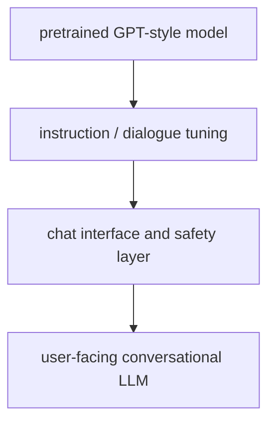

# P5-4.2 대화형 LLM으로의 전환

P5-4.1에서는 GPT 계열을 이전 토큰을 바탕으로 다음 토큰을 이어 생성하는 decoder 중심 흐름으로 설명했습니다. 이제 다음 질문이 생깁니다.

이 구조가 어떻게 오늘날의 챗봇, 코파일럿, 대화형 도우미 같은 사용자 경험으로 바뀌었는가?

이 절은 그 질문에 답합니다.

대화형 LLM은 단순 자동완성 모델 위에 지시 따르기(instruction following), 대화 형식, 안전 조정, 도구 연결 같은 층이 더해지며 만들어진 사용자 경험이다.

## 이 절의 범위

이 절은 다음 질문에 답합니다.

- 자동완성형 생성 모델과 대화형 LLM은 무엇이 다른가?
- 왜 사용자는 LLM을 `답변하는 시스템`처럼 느끼게 되었는가?
- 대화형 경험을 만들기 위해 구조 밖에서 무엇이 더 필요했는가?

이 절에서는 다음 내용을 깊게 다루지 않습니다.

- RLHF 세부 알고리즘
- system prompt 설계의 세부 정책
- agent loop와 tool use의 구현

대화형 전환의 큰 흐름은 여기서 잡고, 지시를 따르도록 조정하는 단계는 P5-8.1 지시 튜닝과 P5-8.2 정렬의 기본 문제에서 다시 설명합니다. 프롬프트 설계는 P5-9.1, 도구 사용은 P5-12.1과 P5-12.2, agent loop는 P5-13.1과 P5-13.2, MCP 연결은 P5-14.1에서 각각 다시 회수합니다.

이 절에서는 사용자 경험의 변화가 단순히 모델 파라미터 증가만으로 생긴 것이 아님을 설명합니다.

## 이 절의 목표

- 자동완성형 GPT와 대화형 LLM의 차이를 설명할 수 있습니다.
- 대화형 경험에 instruction tuning, 안전 조정, 인터페이스 설계가 함께 필요했다는 점을 말할 수 있습니다.
- 챗봇 경험이 모델 구조 하나만으로 완성되지 않는다는 점을 설명할 수 있습니다.
- 이후 pretraining, instruction tuning, prompt, agent 설명으로 자연스럽게 넘어갈 수 있습니다.

## 자동완성에서 대화로 바뀌었다는 말의 뜻

초기 생성 모델 사용자 경험은 대체로 다음과 같았습니다.

- 텍스트 앞부분을 주면
- 그 뒤를 계속 이어 쓰게 한다

이것은 강력했지만, 아직 `질문에 답하는 조수`처럼 느껴지지는 않을 수 있습니다.

대화형 LLM 경험은 여기에 다음 층이 더해지며 생깁니다.

- 질문과 답변의 형식
- 사용자의 의도를 따르는 지시 이해
- 불필요한 반복을 줄이는 응답 조정
- 안전성과 정책 제약
- 대화 상태 유지

즉, 모델은 여전히 다음 토큰을 생성하지만, 사용자는 더 이상 그것을 `자동완성기`로 보지 않고 `대화형 도우미`처럼 느끼게 됩니다.

## 무엇이 경험을 바꿨나

대화형 전환을 한 가지 원인으로만 설명하면 부족합니다. 더 안전한 설명은 다음과 같습니다.

1. 더 큰 사전학습 모델
2. 지시를 따르도록 조정하는 추가 학습
3. 대화형 인터페이스 설계
4. 안전성(safety)과 정책 조정
5. 때로는 도구 사용(tool use)과 검색 연결

즉, 사용자가 만나는 경험은 `모델 구조 + 후속 조정 + 제품 인터페이스`의 결합입니다.

## 왜 자연어 지시가 중요해졌나

GPT-3 시기 이후 사용자는 prompt 안에 설명과 예시를 넣어 모델 행동을 바꾸는 경험을 더 강하게 하게 됩니다.

이것이 중요한 이유는:

- 별도 모델 교체 없이
- 자연어만으로
- 작업을 지정할 수 있다는 점입니다

예를 들어:

- `세 문장으로 요약해줘`
- `표 형태로 정리해줘`
- `초등학생도 이해하게 설명해줘`

같은 지시가 가능해집니다.

이 지점에서 모델은 단순 언어 생성기가 아니라, `자연어 지시를 따르는 인터페이스`처럼 느껴지기 시작합니다.

## 왜 안전 조정이 함께 중요해졌나

대화형 경험은 단순 생성보다 위험도 더 크게 드러냅니다.

- 그럴듯한 오류
- 공격적인 표현
- 민감 정보 처리 문제
- 잘못된 조언

같은 문제가 더 직접적으로 사용자에게 노출되기 때문입니다.

그래서 대화형 LLM은 대개 구조 밖에서도 안전 조정이 필요합니다.

다음처럼 이해하면 충분합니다.

`좋은 대화형 LLM은 많이 아는 모델이기만 한 것이 아니라, 어떻게 답하지 말아야 하는지도 함께 조정된 시스템이다.`

## 왜 인터페이스도 모델 일부처럼 느껴지나

사용자는 보통 다음을 한 덩어리로 경험합니다.

- 입력창
- 대화 기록
- 시스템 지시
- 모델 응답
- 때로는 검색/도구 실행 결과

하지만 구조적으로는 이들이 모두 같은 것이 아닙니다.

예를 들어:

- 모델은 다음 토큰을 생성하고
- 앱은 대화 기록을 유지하며
- 시스템 프롬프트는 응답 방향을 제약하고
- 도구 연결은 외부 계산이나 검색을 수행합니다

이 차이를 구분해야 나중에 agent, MCP, harness를 혼동 없이 설명할 수 있습니다.

## 아주 단순하게 그리면



이 도식에서 확인해야 할 결과는 오늘의 대화형 경험이 한 번에 완성된 기능이 아니라, 자동완성, 지시 수행, 대화 정렬 단계를 거치며 누적된 구조라는 점입니다.

## 사례로 보기

### 사례 1. 일반 자동완성

메일 작성창에 `안녕하세요, 지난 회의에서 논의한 내용은`까지만 적고 다음 문장을 추천받는 상황을 떠올려 보겠습니다. 사람이 이 기능에서 먼저 보는 기준은 보통 `문장이 자연스럽게 이어지는가`입니다. 여기서는 질문 의도 파악이나 역할 구분보다, 앞문장 뒤에 무난한 후속 표현이 붙는지가 더 중요합니다. 그래서 `회의 자료를 첨부드립니다`처럼 그럴듯한 문장이 이어지면 기능이 잘 동작한다고 느낍니다. 이 단계의 경험은 `질문에 답한다`보다 `다음 문장을 이어 쓴다`에 가깝습니다. 그래서 이 사례에서 확인해야 할 결과는 사용자의 질문을 깊게 해석하는가보다, 앞문장 뒤에 자연스러운 후속 문장이 실제로 이어지는가입니다.

### 사례 2. 챗봇

사내 정책 문서를 열어 둔 채 `이 정책을 세 문장으로 설명해 줘`라고 묻는 상황을 생각해 보겠습니다. 사람이 단순 자동완성기에서 기대하는 것은 보통 `다음 문장 후보` 정도이지만, 챗봇에게는 질문 이해, 길이 맞추기, 말투 유지, 위험한 답변 회피까지 함께 기대합니다. 만약 모델이 정책 문장 일부만 길게 이어 쓰면, 사용자는 `질문을 들은 시스템`이 아니라 `문장을 잇는 도구`로 느낄 것입니다. 반대로 시스템 역할, 대화 이력, 요약 길이 제약, 안전 규칙이 함께 작동하면 사용자는 `세 문장 설명`이라는 요청이 실제로 반영됐다고 느낍니다. 이 차이가 자동완성과 대화형 LLM 경험을 가르는 핵심입니다. 그래서 이 사례에서 확인해야 할 결과는 단순 이어쓰기가 아니라, 길이 제약과 질문 의도가 실제 답변 구조에 반영되는가입니다.

### 사례 3. 코파일럿

개발자가 함수 안에 `여기서 사용자 입력을 검증하고 실패하면 에러를 반환`이라고 주석을 적는 상황을 떠올려 보겠습니다. 사람이 단순 자동완성에서 기대하는 것은 보통 `다음 몇 글자`이지만, 코드 도우미에게는 함수 이름, 인자, 반환 형식, 주변 파일 문맥까지 함께 읽어 주길 기대합니다. 만약 모델이 바로 다음 한 줄만 맞추고 예외 처리나 반환 구조를 놓치면, 개발자는 `코드 문맥을 이해했다`고 느끼기 어렵습니다. 반대로 편집기 문맥과 시그니처를 함께 읽어 조건문, 오류 메시지, 반환문까지 한 묶음으로 제안하면 같은 생성 구조도 훨씬 목적에 맞는 도구로 보입니다. 그래서 이 사례에서 확인해야 할 결과는 다음 한 줄 완성보다 함수 문맥 전체를 반영한 제안이 실제로 더 완결된 코드 블록으로 이어지는가입니다.

## 작은 Python 예제로 보기

이번 예제의 목표는 실제 대화형 모델을 구현하는 것이 아니라, 같은 입력에 대해 `자동완성식 응답`과 `지시형 응답`의 차이를 감각적으로 보는 것입니다.

입력:

- 사용자 요청
- 두 가지 응답 스타일

출력:

- 자동완성형 스타일
- 대화형 지시 응답 스타일

```python
user_request = "이 문서를 세 문장으로 요약해줘"

autocomplete_style = "이 문서는 중요한 내용을 다루며..."
instruction_style = [
    "첫째, 이 문서는 핵심 개념을 정리합니다.",
    "둘째, 주요 사례와 한계를 함께 설명합니다.",
    "셋째, 다음 학습 단계로 연결되는 관점을 제공합니다.",
]

print("request =", user_request)
print("autocomplete_style =", autocomplete_style)
print("instruction_style =")
for line in instruction_style:
    print("-", line)
```

실행 결과 예시는 다음처럼 읽을 수 있습니다.

```text
request = 이 문서를 세 문장으로 요약해줘
autocomplete_style = 이 문서는 중요한 내용을 다루며...
instruction_style =
- 첫째, 이 문서는 핵심 개념을 정리합니다.
- 둘째, 주요 사례와 한계를 함께 설명합니다.
- 셋째, 다음 학습 단계로 연결되는 관점을 제공합니다.
```

## 이 예제를 사용자 경험 관점으로 다시 보면

앞의 예제는 대화형 LLM 전체를 구현하는 코드가 아니라, 같은 생성 구조라도 `다음 문장을 이어 쓰는 경험`과 `사용자 지시를 따라 응답 형식을 맞추는 경험`이 다르다는 점을 가장 짧게 보여 주는 장면입니다. 여기서 읽어야 할 핵심은 모델이 더 길게 말하느냐가 아니라, 사용자의 요청 형식을 더 명시적으로 따라가도록 조정된 경험이라는 점입니다.

이 예제에서 읽어야 할 핵심은 다음입니다.

- 둘 다 생성이지만
- 대화형 LLM은 사용자의 지시 형식을 더 명시적으로 따르도록 조정된 경험이라는 점입니다

## 역사와 커리큘럼 관점

대화형 LLM 전환은 단순한 모델 스케일 증가만으로 설명하기 어렵습니다. 실제 사용자 경험이 크게 바뀐 이유는:

- 큰 생성 모델
- 지시 따르기 조정
- 대화형 제품 인터페이스
- 안전성 보정

이 함께 묶였기 때문입니다.

커리큘럼 관점에서 이 절에서 확인해야 할 결과는 대화형 LLM 경험이 단순 자동완성이 아니라, 지시 해석, 대화 이력, 안전성 보정이 함께 묶인 구조로 읽히기 시작하는가입니다.

- 뒤에서 나올 instruction tuning, alignment를 위한 필요성을 만들고
- prompt engineering이 왜 단순 입력 문장이 아닌지 설명하며
- agent, tool use, MCP를 `모델 자체`와 구분할 기반을 만들기 때문입니다

## 다음 장과의 연결

여기까지 오면 다음 질문이 남습니다.

- 대화형 사용자 경험 뒤에 있는 가장 작은 생성 규칙은 무엇인가?
- 모델은 실제로 어떤 방식으로 다음 출력을 한 토큰씩 이어 가는가?

이 질문은 P5-5.1 다음 토큰 예측(next-token prediction)으로 이어집니다.

## 이 절에서 기억할 관점

- 대화형 LLM은 단순 자동완성 모델 위에 여러 조정 층이 더해진 사용자 경험입니다.
- 자연어 지시, 안전 조정, 인터페이스 설계가 함께 중요합니다.
- 사용자가 만나는 챗봇 경험은 모델 구조 하나만으로 설명되지 않습니다.
- 이 절은 이후 instruction tuning, alignment, prompt, agent 설명의 기반입니다.

## 체크리스트

- 자동완성형 생성과 대화형 LLM 경험의 차이를 설명할 수 있는가?
- 왜 지시 따르기와 안전 조정이 중요해졌는지 말할 수 있는가?
- 왜 인터페이스와 시스템 프롬프트를 모델 자체와 구분해야 하는지 설명할 수 있는가?
- 다음 장의 사전학습 설명으로 왜 이어지는지 설명할 수 있는가?

## 출처와 참고 자료

- Alec Radford et al., `Language Models are Unsupervised Multitask Learners`, OpenAI, 2019, 확인 날짜: 2026-06-29.
- Tom B. Brown et al., `Language Models are Few-Shot Learners`, arXiv, 2020, 확인 날짜: 2026-06-29.
- OpenAI API Docs, prompt와 chat 사용 구조 관련 문서, 확인 날짜: 2026-06-29. [https://platform.openai.com/docs](https://platform.openai.com/docs){: target="_blank" rel="noopener noreferrer" }
