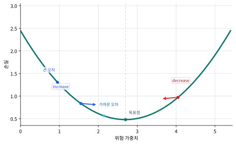

# P5-5.1 역전파(backpropagation)의 직관

Section ID: `P5-5.1`
Version: `v2026.07.13`

P5-4장에서는 손실 함수(loss function)가 현재 출력과 목표 사이의 어긋남을 숫자로 만든다는 점을 보았습니다. 이제 다음 질문이 바로 이어집니다.

손실이 계산되었다면, 그 손실은 앞쪽 층의 가중치를 어떻게 바꾸라고 알려 주는가?

이 질문에 답하는 절차가 역전파(backpropagation)입니다.

역전파는 출력 쪽에서 계산된 손실이 각 가중치에 얼마나 책임이 있는지, 뒤에서 앞으로 효율적으로 계산해 주는 절차이다.

뒤 절에서 gradient나 optimizer와 섞여 보일 때는 개념사전의 [역전파(backpropagation)](../../../reference/concept-glossary.md#backpropagation) 항목으로 돌아가 계산 역할부터 다시 구분합니다.

여기서는 다음 세 문장을 함께 고정하는 편이 더 안전합니다.

- 손실이 계산되었다고 해서 바로 가중치가 바뀌지는 않습니다.
- 먼저 어느 가중치가 손실에 얼마나 영향을 주었는지 알아야 합니다.
- 그 영향도를 뒤에서 앞으로 계산하는 절차가 역전파입니다.

## 이 절의 범위

- 역전파는 무엇을 계산하는가?
- 왜 출력층에서 시작해 앞쪽 층으로 거꾸로 계산하는가?
- 연쇄 법칙(chain rule)은 왜 등장하는가?
- 역전파는 학습 전체와 어떻게 다르고, 어디에 들어가는가?

이 절에서는 다음 내용을 깊게 다루지 않습니다.

- 행렬 미분의 엄밀한 전개
- 다층 네트워크 전체의 상세 기호 유도
- 자동미분(automatic differentiation)의 일반 이론

복잡한 미분 흐름을 계산 그래프로 보는 관점은 P5-5.2에서 이어서 다루고, 실제 파라미터 갱신과 optimizer의 역할은 P5-7.1, P5-7.2에서 다시 연결합니다. 자동미분(automatic differentiation)의 일반 이론은 이 책의 현재 본편 범위 밖에 둡니다.

## 이 절의 목표

- 역전파를 `손실이 각 가중치에 미치는 영향을 뒤에서 앞으로 계산하는 절차`로 설명할 수 있습니다.
- 역전파가 학습 전체가 아니라 gradient 계산 단계라는 점을 말할 수 있습니다.
- 연쇄 법칙(chain rule)이 왜 신경망에 자연스럽게 들어오는지 이해할 수 있습니다.
- 작은 예제로 손실 변화가 가중치 변화와 연결되는 감각을 읽을 수 있습니다.

## 왜 역전파가 필요한가

신경망은 층(layer)이 많아질수록 가중치(parameter)도 많아집니다. 손실(loss)이 하나 줄었다고 해서, 어느 가중치를 얼마나 바꿔야 하는지는 바로 보이지 않습니다.

예를 들어:

- 출력이 틀렸습니다.
- 그런데 그 틀림이 마지막 층 때문인지
- 중간 층 표현 때문인지
- 맨 앞 입력 가중치 때문인지

를 구분해야 합니다.

즉, 역전파는 `누가 얼마나 틀림에 기여했는가`를 계산하는 절차처럼 읽을 수 있습니다.

독자용 한 문장으로 더 줄이면 다음처럼 기억할 수 있습니다.

`역전파는 틀림의 책임을 각 가중치에게 나누어 주는 계산이다.`

## 왜 뒤에서 앞으로 계산하나

출력층은 손실과 가장 직접적으로 연결되어 있습니다.

- 최종 출력이 있고
- 목표값이 있고
- 그 둘을 비교해 손실이 계산됩니다

따라서 `손실이 출력에 어떻게 반응하는가`는 먼저 알기 쉽습니다. 그다음에는 그 출력이 바로 앞 층 값들에 의존했다는 점을 이용해, 영향도를 한 단계씩 거꾸로 전달합니다.

즉, 역전파는 다음 흐름으로 읽으면 좋습니다.

> 최종 출력의 틀림을 본다
> -> 그 틀림이 마지막 층에 얼마나 연결되는지 계산한다
> -> 그 영향을 다시 앞층으로 넘긴다
> -> 처음 층까지 반복한다

이를 아주 단순하게 그리면 다음과 같습니다.

```mermaid
--8<-- "assets/part-05/chapter-05/forward-loss-backward-flow-ko.mmd"
```

이 도식의 핵심은 순전파(forward pass)와 역전파(backward pass)가 방향이 다르다는 점입니다.

여기서 독자가 특히 구분해야 하는 것은 두 흐름의 질문이 다르다는 점입니다.

- 순전파는 `지금 무엇을 예측했는가`를 계산합니다.
- 역전파는 `그 예측의 틀림이 어디에서 왔는가`를 계산합니다.

## 역전파는 학습 전체가 아니다

독자는 자주 `역전파 = 학습`이라고 이해합니다. 하지만 엄밀히 말하면 둘은 같지 않습니다.

이 절에서 먼저 다음처럼 구분하면 충분합니다.

| 단계 | 역할 |
| --- | --- |
| 순전파(forward pass) | 현재 파라미터로 출력을 계산 |
| 손실 계산(loss computation) | 출력과 목표의 차이를 숫자로 계산 |
| 역전파(backpropagation) | 각 파라미터에 대한 gradient를 계산 |
| 옵티마이저(optimizer) | 그 gradient를 이용해 파라미터를 업데이트 |

즉, 역전파는 학습 전체가 아니라, `업데이트에 필요한 기울기(gradient)를 계산하는 단계`입니다.

이 구분을 먼저 잡아야 `기울기를 계산하는 단계`와 `그 기울기로 파라미터를 실제로 바꾸는 단계`를 섞지 않게 됩니다. 많은 독자가 `역전파가 곧 업데이트`라고 오해하지만, 실제 업데이트는 아직 일어나지 않았습니다. 역전파는 `바꿔야 할 방향과 민감도`를 계산할 뿐입니다.

이 구분을 잡아 두면 뒤에서 SGD와 Adam을 볼 때도 `optimizer가 바꾸는 대상`이 무엇인지 더 분명하게 읽을 수 있습니다.

이 연결을 손실과 gradient 역할만 남겨 압축하면 다음과 같습니다.

```mermaid
--8<-- "assets/part-05/chapter-05/loss-to-gradient-role-ko.mmd"
```

이 도식에서 먼저 확인할 결과는, 역전파가 손실을 바로 업데이트로 바꾸는 단계가 아니라 `손실 -> 책임 분해 -> 가중치별 gradient`를 계산해 다음 optimizer 단계로 넘기는 절차라는 점입니다.

## 연쇄 법칙(chain rule)은 왜 등장하나

신경망은 함수가 여러 단계로 겹쳐 있는 구조입니다.

예를 들어 아주 단순하게 쓰면:

\[
x \rightarrow z \rightarrow a \rightarrow y \rightarrow loss
\]

즉, 손실은 직접적으로 처음 입력이나 가중치에 달려 있는 것이 아니라, 여러 중간 값을 거쳐 간접적으로 연결됩니다.

이런 구조에서는 한 단계 변화가 다음 단계에 어떤 영향을 주는지를 이어 붙여야 합니다. 이때 등장하는 것이 연쇄 법칙(chain rule)입니다.

다음처럼 이해하면 충분합니다.

`뒤쪽 결과가 앞쪽 값에 의존하고 있다면, 그 의존 관계를 단계별로 곱해 가며 영향도를 전파한다.`

즉, 역전파는 신경망의 깊은 함수 구조에 연쇄 법칙을 효율적으로 적용한 절차입니다.

수식보다 다음 질문이 더 중요합니다.

`이 층의 출력이 다음 층의 입력이 되었다면, 뒤에서 생긴 틀림은 앞 층에도 책임을 나누어 줄 수밖에 없지 않은가?`

연쇄 법칙은 이 직관을 수학적으로 가능하게 해 주는 규칙입니다.

## 사례 및 예시

### 사례 1. 차단 점수 하나를 맞추려면 어느 쪽으로 움직여야 하나

가장 단순한 경우부터 보겠습니다. `압력 미복귀 정도` 하나를 받아 `재기동 차단 점수` 하나를 내는 아주 작은 예측기를 생각해 봅니다. 입력을 `pressure_unrecovered`, 가중치를 `risk_weight`, 출력 점수를 `predicted_block_score`라고 두면 다음처럼 쓸 수 있습니다.

\[
predicted\_block\_score = risk\_weight \times pressure\_unrecovered
\]

손실은 목표 차단 점수 `target_block_score`와 얼마나 어긋났는지로 읽으면 충분합니다.

\[
L = (predicted\_block\_score - target\_block\_score)^2
\]

이 장면에서는 사람도 먼저 `지금 차단 점수가 목표보다 큰가, 작은가`를 보며 어느 쪽으로 고쳐야 할지 감을 잡을 수 있습니다.

이 사례의 핵심은 역전파를 수식 덩어리로 보기 전에, `오차를 줄이려면 가중치를 어느 방향으로 움직여야 하나`를 붙잡는 데 있습니다.

- 차단 점수가 목표보다 작으면 위험 가중치를 키우는 쪽이 자연스럽습니다.
- 차단 점수가 목표보다 크면 위험 가중치를 줄이는 쪽이 자연스럽습니다.

예를 들어 `pressure_unrecovered`가 2이고 목표 차단 점수가 5인데 현재 예측이 3이라면, 사람은 `차단 점수가 모자라니 risk_weight를 키워야겠다`는 방향 감각을 먼저 가질 수 있습니다. 역전파는 바로 이 감각을 각 가중치별 숫자 신호로 바꾸는 절차입니다. 그래서 이 사례에서 확인해야 할 결과는 손실을 본 뒤 `늘릴지 줄일지` 방향이 먼저 분명해지는가입니다.

| 사람이 먼저 보기 쉬운 기준 | 역전파 관점으로 다시 읽는 기준 |
| --- | --- |
| 차단 점수가 목표보다 작으면 위험 가중치를 키워야 할 것 같다 | gradient 부호가 실제로 `키워야 하는가 / 줄여야 하는가`를 계산해 준다 |
| 차단 점수가 목표보다 크면 위험 가중치를 줄여야 할 것 같다 | gradient 부호가 반대로 바뀌는지 확인해야 한다 |
| 오차가 크면 더 많이 고쳐야 할 것 같다 | gradient 크기가 실제로 `얼마나 강하게 밀어야 하는가`를 함께 담는다 |

이 방향과 강도 감각은 손실 곡선 위에서 보면 더 직접적입니다. 현재 가중치가 목표 점수보다 낮은 예측을 만들면 가중치를 키우는 쪽으로, 너무 높은 예측을 만들면 줄이는 쪽으로 신호가 생깁니다.



이 그래프에서 읽을 점은 역전파가 파라미터를 직접 바꾸는 단계가 아니라는 것입니다. 역전파는 손실 곡선 위 현재 위치에서 `어느 쪽으로 얼마나 강하게 밀어야 하는가`를 gradient로 계산하고, 실제 이동은 뒤의 optimizer가 맡습니다.

같은 `차단 점수가 작다`는 장면 안에서도 차이는 더 있습니다. 목표가 5인데 예측이 4.6인 경우와 3.0인 경우를 비교하면 둘 다 `risk_weight를 키워야 한다`는 방향은 같지만, 후자는 훨씬 더 크게 모자랍니다. 역전파는 이 차이를 `둘 다 increase가 아니라, 누가 더 강한 increase 신호를 받는가`까지 숫자로 남깁니다.

### 사례 2. 마지막 점수만 고치면 왜 부족한가

하지만 실제 신경망은 점수 하나를 바로 만들지 않고, 여러 입력을 중간 표현으로 먼저 묶은 뒤 최종 출력을 냅니다. 예를 들어 `온도 경고`, `압력 경고`, `진동 경고`를 먼저 섞어 `전체 위험 신호`를 만들고, 그다음 최종 정지 점수를 만든다고 생각해 보겠습니다.

이때 최종 점수가 틀렸다고 해서 마지막 층만 보면 충분할 것처럼 느끼기 쉽습니다. 하지만 그 마지막 점수는 이미 앞단이 만든 `전체 위험 신호`에 기대고 있으므로, 앞단이 어떤 입력을 얼마나 강하게 묶었는지도 함께 고쳐야 할 수 있습니다.

역전파의 직관은 바로 여기서 더 중요해집니다.

- 최종 출력이 틀렸다면 마지막 연결만이 아니라
- 그 마지막 연결을 만든 앞단 표현에도 책임이 있고
- 그 앞단 표현을 만든 더 앞 가중치에도 책임이 전달됩니다.

즉, 역전파는 `마지막 점수만 고친다`가 아니라 `출력 오차의 책임을 앞단까지 차례로 나눈다`는 구조입니다. 그래서 이 사례에서 확인해야 할 결과는 마지막 층만이 아니라, 앞단 가중치들에도 서로 다른 크기와 방향의 gradient가 실제로 붙는가입니다.

두 사례를 한 번에 다시 압축하면, 역전파에서 먼저 붙잡아야 할 흐름은 다음과 같습니다.

```mermaid
--8<-- "assets/part-05/chapter-05/backprop-direction-and-responsibility-flow-ko.mmd"
```

이 도식은 사례 1의 `점수가 너무 작다/크다`는 방향 감각과 사례 2의 `책임이 앞단까지 전달된다`는 구조를 한 번에 다시 묶기 위한 것입니다. 사례 내용을 새로 늘리기보다, `손실을 본다 -> 방향이 생긴다 -> 책임이 뒤에서 앞으로 전달된다`는 역전파의 첫 직관만 짧게 다시 읽게 하는 데 목적이 있습니다.

두 사례를 나란히 놓고 보면, 역전파는 `손실이 크다`는 사실만 말하는 절차가 아니라 `누가 얼마나 어떻게 고쳐져야 하는가`를 각 가중치별로 다시 적는 절차입니다.

| 장면 | 사람이 먼저 보기 쉬운 해석 | 역전파가 더 분명하게 남기는 것 | 실제로 다시 배분되는 것 |
| --- | --- | --- | --- |
| 점수 하나 보정 | 예측이 작으니 키우고, 크니 줄이면 된다고 느낀다 | 방향뿐 아니라 수정 강도까지 gradient로 남긴다 | 가중치 하나에 대한 방향과 크기 |
| 여러 입력을 거친 최종 점수 | 마지막 출력만 보고 마지막 층만 고치고 싶어진다 | 중간 층과 앞단 층까지 책임을 나누어 붙인다 | 각 층 가중치별 gradient |

이 표에서 독자가 먼저 붙잡아야 할 결과는, 역전파의 핵심이 `손실을 안다`가 아니라 `손실을 가중치별 책임 신호로 다시 바꾼다`는 점입니다.

## 누가 얼마나 책임이 있는가를 계산한다는 뜻

역전파를 사람식으로 비유하면:

- 최종 결과가 틀렸을 때
- 마지막 단계가 얼마나 책임이 있는지 보고
- 그 마지막 단계가 앞단의 어떤 계산에 기대고 있었는지 다시 따지고
- 그 책임을 앞단까지 나누어 전달하는 과정

처럼 이해할 수 있습니다.

물론 실제 계산은 수학적으로 정확하게 이루어지지만, 여기서는 `책임 분해`라는 감각이 핵심입니다.

## 연습 및 예제

이번 예제의 목표는 역전파 전체를 코드로 재구현하는 것이 아니라, 아주 작은 예에서 `재기동 차단 점수` 손실이 `압력 위험 가중치`에 어떤 방향 신호를 주는지 확인하는 것입니다. 한 사례만 보는 대신 `차단 점수가 작은 경우`와 `차단 점수가 큰 경우`를 같이 돌려, gradient 부호가 어떻게 바뀌는지도 함께 보겠습니다.

입력:

- 압력 미복귀 정도 `pressure_unrecovered`
- 목표 차단 점수 `target_block_score`
- 현재 위험 가중치 `risk_weight`

출력:

- 예측된 차단 점수
- 손실
- 위험 가중치에 대한 gradient
- gradient 부호가 주는 업데이트 방향 해석
- gradient 크기가 주는 수정 강도 비교

문제 상황:

- gradient는 수식으로만 보면 추상적이므로 차단 점수가 작을 때와 클 때 방향이 어떻게 달라지는지 직접 보는 편이 좋다
- 같은 방향이라도 오차가 더 큰 경우 gradient 절댓값이 더 커지는지 같이 볼 필요가 있다

확인할 개념:

- gradient 부호는 위험 가중치를 어느 방향으로 움직여야 하는지 알려 준다
- 같은 식이라도 차단 점수가 부족한지 과한지에 따라 업데이트 방향 해석이 달라진다
- gradient 절댓값은 수정 강도의 차이를 읽게 해 준다

입력(input):

위에 정리한 세 사례의 `pressure_unrecovered`, `target_block_score`, `risk_weight`를 사용합니다.

코드를 보기 전에 먼저 어느 사례가 어떤 신호를 낼지 예상해 보면 좋습니다.

| 사례 | 먼저 예상해 볼 비교 | 예상 이유 |
| --- | --- | --- |
| `slightly_under_block_signal` | `increase_risk_weight`, 하지만 강도는 약할 가능성 | 목표보다 조금만 작기 때문에 방향은 키우기지만 수정량은 크지 않을 수 있습니다. |
| `too_weak_block_signal` | `increase_risk_weight`, 강도는 더 클 가능성 | 같은 방향이라도 목표보다 더 많이 모자라기 때문에 gradient 절댓값이 더 커질 수 있습니다. |
| `too_strong_block_signal` | `decrease_risk_weight` | 목표보다 크므로 반대 방향 신호가 나와야 합니다. |

이 표의 목적은 공식 암기보다 `방향`과 `강도`를 따로 읽는 연습입니다.

```python
cases = [
    {"name": "slightly_under_block_signal", "pressure_unrecovered": 2.0, "target_block_score": 5.0, "risk_weight": 2.3},
    {"name": "too_weak_block_signal", "pressure_unrecovered": 2.0, "target_block_score": 5.0, "risk_weight": 1.5},
    {"name": "too_strong_block_signal", "pressure_unrecovered": 2.0, "target_block_score": 5.0, "risk_weight": 3.2},
]

for case in cases:
    pressure_unrecovered = case["pressure_unrecovered"]
    target_block_score = case["target_block_score"]
    risk_weight = case["risk_weight"]

    prediction = risk_weight * pressure_unrecovered
    loss = (prediction - target_block_score) ** 2
    gradient_w = 2 * (prediction - target_block_score) * pressure_unrecovered
    update_direction = "increase_risk_weight" if gradient_w < 0 else "decrease_risk_weight"

    print(f"[{case['name']}]")
    print("predicted_block_score =", round(prediction, 3))
    print("loss =", round(loss, 3))
    print("gradient_risk_weight =", round(gradient_w, 3))
    print("update_direction =", update_direction)
    print("---")
```

출력에서는 `predicted_block_score`, `loss`, `gradient_risk_weight`를 먼저 보고, 그 결과 `update_direction`이 왜 달라지는지 이어서 보면 됩니다.

```text
[slightly_under_block_signal]
predicted_block_score = 4.6
loss = 0.16
gradient_risk_weight = -1.6
update_direction = increase_risk_weight
---
[too_weak_block_signal]
predicted_block_score = 3.0
loss = 4.0
gradient_risk_weight = -8.0
update_direction = increase_risk_weight
---
[too_strong_block_signal]
predicted_block_score = 6.4
loss = 1.96
gradient_risk_weight = 5.6
update_direction = decrease_risk_weight
---
```

세 사례를 함께 보면 `부호`와 `크기`를 같이 읽어야 합니다.

| 사례 | 지금 읽어야 할 핵심 |
| --- | --- |
| `slightly_under_block_signal` | 목표보다 조금 모자라므로 `increase_risk_weight`가 맞지만, gradient 절댓값은 작아 미세 조정에 가깝습니다. |
| `too_weak_block_signal` | 같은 `increase_risk_weight`라도 훨씬 더 많이 모자라므로 gradient 절댓값이 커집니다. |
| `too_strong_block_signal` | 방향 자체가 반대로 바뀌어 `decrease_risk_weight` 신호가 나옵니다. |

- 차단 점수가 너무 작으면 gradient가 음수가 되어 `risk_weight`를 키우는 방향 신호를 주고
- 차단 점수가 너무 크면 gradient가 양수가 되어 `risk_weight`를 줄이는 방향 신호를 줍니다
- 같은 방향 안에서도 오차가 더 크면 gradient 절댓값이 커져 더 강한 수정 신호가 됩니다

즉, 역전파는 각 파라미터에 대해 `어느 방향으로 바꾸는 것이 손실을 줄이는가`를 알려 줍니다. 운영 판단 관점으로 읽으면, `압력 미복귀 신호를 지금보다 더 위험하게 읽어야 하는가, 덜 위험하게 읽어야 하는가`를 숫자로 다시 적는 단계라고 볼 수 있습니다.

이 예제에서 독자가 꼭 읽어야 할 핵심은 다음입니다.

- 손실 숫자 하나만으로는 업데이트를 할 수 없습니다.
- gradient가 있어야 각 파라미터별 방향 신호가 생깁니다.
- gradient 절댓값을 같이 봐야 `얼마나 세게` 바꿔야 하는지도 읽을 수 있습니다.
- 역전파는 바로 그 파라미터별 신호를 만들어 주는 단계입니다.

이 결과를 `손실 숫자`와 `gradient 신호` 기준으로 다시 묶으면 차이가 더 또렷합니다.

| 실행 결과에서 보인 차이 | 손실만 보면 남기 쉬운 해석 | gradient까지 보면 바뀌는 해석 |
| --- | --- | --- |
| `slightly_under_block_signal`와 `too_weak_block_signal`는 둘 다 차단 점수가 작다 | 둘 다 그냥 위험 가중치를 키우면 된다고만 읽기 쉽다 | 같은 방향이라도 누가 더 강한 증가 신호를 받는지 읽는다 |
| `too_weak_block_signal`와 `too_strong_block_signal`는 둘 다 손실이 있다 | 둘 다 오차가 있으니 비슷한 수정이 필요하다고 느끼기 쉽다 | 하나는 `increase_risk_weight`, 다른 하나는 `decrease_risk_weight`로 방향 자체가 갈린다 |
| 손실 숫자 하나만 먼저 보인다 | 오차 크기만 알면 충분하다고 느끼기 쉽다 | 실제 업데이트에는 가중치별 gradient 신호가 추가로 필요하다고 읽는다 |

이 표까지 읽고 나면, 역전파의 핵심이 `손실을 계산했다`가 아니라 `손실을 가중치별 방향·크기 신호로 다시 풀어 썼다`는 점이 더 분명해집니다.

## 다층 신경망에서는 무엇이 더 어려워지나

방금 예제는 가중치 하나뿐이라 단순했습니다. 하지만 다층 신경망에서는:

- 출력이 여러 층을 거쳐 오고
- 각 층마다 가중치가 많고
- 각 층의 값이 다음 층의 입력이 됩니다

따라서 손실의 영향도를 각 층에 다시 분배해 주는 절차가 필요합니다. 역전파는 바로 그 분배를 효율적으로 처리합니다.

다음처럼 기억하면 충분합니다.

`층이 깊어질수록 gradient를 직접 손으로 쓰기는 어렵지만, 역전파는 그 계산을 체계적으로 뒤에서 앞으로 전달한다.`

역전파의 역사에서는 여러 전조와 기여가 있지만, 신경망 학습 맥락에서 가장 널리 알려진 전환점은 Rumelhart, Hinton, Williams의 1986년 논문입니다. 그 작업은 다층 신경망이 유용한 내부 표현을 학습할 수 있음을 널리 보여 주는 계기가 되었습니다.

더 넓게 보면, Paul Werbos의 1974년 박사 논문 같은 더 이른 작업도 자주 언급됩니다. 다음 정도로 기억하면 충분합니다.

- 더 이른 수학적/최적화적 아이디어가 있었고
- 1980년대 중반에 신경망 학습 절차로 널리 알려지며 큰 전환점이 되었다

커리큘럼 관점에서도 역전파는 매우 중요한 절입니다. 바로 앞의 P5-4.1, P5-4.2에서 손실 함수를 왜 두는지 배웠다면, 이제 그 손실이 각 층 가중치로 어떻게 전달되는지를 이해해야 합니다. 이유는 단순합니다.

- 손실 함수가 있어도
- 그 손실이 각 층에 어떻게 연결되는지 모르면
- 실제 학습 업데이트가 불가능하기 때문입니다

즉, 역전파는 `딥러닝이 실제로 학습된다`는 말을 가능하게 하는 계산 절차입니다.

## 언제 역전파 직관으로 먼저 읽는가

역전파 절을 꺼내야 하는 시점은 `손실이 계산되었다`는 설명만으로는 아직 각 가중치가 무엇을 해야 하는지 닫히지 않을 때입니다.

| 먼저 보이는 문제 장면 | 역전파 직관이 먼저 유용한 이유 | 바로 다음에 넘길 질문 |
| --- | --- | --- |
| 손실은 알겠는데 어느 가중치를 바꿔야 할지 감이 없다 | 손실 책임을 각 파라미터로 나누는 계산이라는 감각을 잡을 수 있습니다. | 이 책임 분해를 복잡한 구조에서 어떻게 정리하는지 봐야 합니다. |
| 순전파와 업데이트가 바로 붙어 보여 중간 단계가 빠져 있다 | gradient 계산 단계가 따로 있다는 점을 분명히 할 수 있습니다. | optimizer가 무엇을 실제로 바꾸는지 뒤 장에서 봐야 합니다. |
| 연쇄 법칙이 왜 등장하는지 추상적으로 느껴진다 | 출력 쪽 영향이 앞단까지 단계별로 이어진다는 구조를 직관으로 먼저 잡을 수 있습니다. | 계산 그래프 위에서 그 연결을 더 체계적으로 봐야 합니다. |
| 작은 예제에서는 방향이 보이지만 다층 구조에서는 흐려진다 | 단순 직관에서 일반 네트워크로 넘어가는 경계가 보입니다. | P5-5.2 계산 그래프로 올려 봐야 합니다. |

## 체크리스트

- 역전파(backpropagation)가 손실을 각 가중치 업데이트 방향과 어떻게 연결하는지 설명할 수 있는가?
- 손실, 그래디언트(gradient), 업데이트(update)의 역할을 구분할 수 있는가?
- 역전파는 손실이 각 가중치에 미치는 영향을 뒤에서 앞으로 계산하는 절차라는 점을 설명할 수 있는가?
- 왜 손실이 계산되었다고 해서 바로 가중치가 바뀌는 것이 아니라, 중간에 gradient 계산 단계가 더 필요하다고 설명할 수 있는가?
- 역전파는 학습 전체가 아니라 gradient 계산 단계라는 점을 말할 수 있는가?
- 연쇄 법칙(chain rule)이 깊은 함수 구조의 영향도를 단계별로 전파하게 해 준다는 점을 설명할 수 있는가?
- 손실이 계산된 뒤 각 가중치가 어떻게 책임을 나눠 가지는지 설명이 막힐 때, 역전파 관점을 먼저 떠올릴 수 있는가?
- 이 절은 역전파의 직관을 닫고, 복잡한 연산 연결은 계산 그래프 절로 넘긴다는 흐름을 알고 있는가?

## 출처와 참고 자료

- David E. Rumelhart, Geoffrey E. Hinton, Ronald J. Williams, `Learning representations by back-propagating errors`, Nature, 1986, 확인 날짜: 2026-06-29.
- Paul J. Werbos, `Beyond Regression: New Tools for Prediction and Analysis in the Behavioral Sciences`, Harvard University doctoral thesis, 1974, 확인 날짜: 2026-06-29.
- Ian Goodfellow, Yoshua Bengio, Aaron Courville, `Deep Learning`, MIT Press, 2016, 확인 날짜: 2026-06-29. [https://www.deeplearningbook.org/](https://www.deeplearningbook.org/){: target="_blank" rel="noopener noreferrer" }
