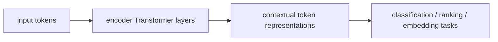

# P5-5.1 BERT 계열의 위치

P5-4.2에서는 attention과 context window를 구분하며, Transformer가 실제로는 입력 길이 제한 안에서 문맥을 읽는 구조라는 점을 보았습니다. 이제 같은 Transformer 계열 안에서도 방향이 갈라집니다.

입력 전체를 읽는 데 강한 모델과, 다음 토큰을 생성하는 데 강한 모델은 어떻게 다른가?

이 절은 그 질문에 답합니다.

BERT 계열은 Transformer의 인코더(encoder)를 중심으로 입력 전체 문맥을 읽어 표현을 만드는 흐름이며, 생성보다 이해와 분류, 검색, 임베딩 과업에 더 잘 맞는 편이다.

## 이 절의 범위

이 절은 다음 질문에 답합니다.

- BERT 계열은 Transformer 안에서 어떤 위치를 가지는가?
- 왜 BERT는 입력 전체를 함께 보는 모델이라고 설명되는가?
- GPT 계열과 비교할 때 어떤 관점에서 다르게 읽어야 하는가?

이 절은 다음 내용은 깊게 다루지 않습니다.

- masked language modeling 수식
- BERT 파생 모델들의 세부 구조 비교
- 최신 encoder-only 모델 벤치마크 경쟁

대신 BERT 계열이 실제로 어디에 쓰이는지는 바로 다음 P5-5.2 이해 중심 태스크에서 회수합니다. 검색과 임베딩 쪽의 실전 연결은 P5-13.1 벡터 데이터베이스와 P5-13.2 인덱스와 검색 품질에서 다시 다루고, 세부 벤치마크 경쟁은 현재 본편 범위 밖으로 둡니다.

이 절의 목적은 BERT를 `LLM 이전의 옛 모델`로 밀어내는 것이 아니라, 지금도 중요한 인코더 기반 흐름으로 정확히 위치시키는 데 있습니다.

## 이 절의 목표

- BERT 계열을 encoder 중심 Transformer 흐름으로 설명할 수 있습니다.
- BERT와 GPT의 차이를 생성 여부보다 `문맥 읽기 방식`과 `주요 과업` 기준으로 설명할 수 있습니다.
- BERT 계열이 왜 분류, 검색, 임베딩 같은 작업과 잘 연결되는지 말할 수 있습니다.
- 다음 절의 이해 중심 태스크 설명으로 자연스럽게 넘어갈 수 있습니다.

## BERT는 무엇의 약자인가

BERT는 `Bidirectional Encoder Representations from Transformers`의 약자입니다. 이름만 풀어도 이 모델의 핵심이 드러납니다.

- bidirectional
- encoder
- representations
- Transformers

즉, BERT는 Transformer 인코더를 사용해 입력 전체 문맥을 반영한 표현(representation)을 만드는 흐름입니다.

## 왜 `입력 전체를 본다`고 설명하나

GPT 계열은 보통 왼쪽 문맥을 바탕으로 다음 토큰을 예측하는 autoregressive 흐름으로 설명합니다. 반면 BERT 계열은 입력 문장 안의 앞뒤 문맥을 함께 사용해 특정 위치의 표현을 만듭니다.

예를 들어 다음 문장을 생각해 볼 수 있습니다.

> 은행에 돈을 맡겼다.

여기서 `은행`의 의미를 읽으려면 뒤쪽의 `돈을 맡겼다`도 중요합니다.

또 다른 문장을 보면:

> 강가의 은행나무를 보았다.

같은 `은행`이지만 뒤쪽 문맥이 달라 의미도 달라집니다.

BERT 계열의 핵심 직관은 다음과 같습니다.

`토큰 하나의 표현은 그 토큰 자체만이 아니라, 앞뒤 전체 문맥을 함께 반영해 만들어진다.`

## BERT는 왜 생성보다 이해 쪽에 가깝다고 하나

여기서 `이해`라는 말을 너무 사람식으로 쓰면 위험합니다. 더 안전한 설명은 다음과 같습니다.

`BERT 계열은 문장 전체를 읽고 각 위치의 문맥적 표현(contextual representation)을 만드는 데 강해서, 그 표현을 기반으로 분류, 검색, 문장쌍 비교 같은 과업에 잘 연결된다.`

즉, BERT는:

- 다음 문장을 길게 생성하는 데 최적화된 구조라기보다
- 입력을 해석 가능한 표현 공간으로 바꾸는 데 강한 구조

로 읽는 편이 좋습니다.

## GPT와 비교하면 무엇이 다르나

독자는 자주 이렇게 묻습니다.

- BERT는 이해 모델이고 GPT는 생성 모델인가?

방향은 맞지만 너무 단순하면 오해가 생깁니다. 더 안전하게 비교하면 다음과 같습니다.

| 구분 | BERT 계열 | GPT 계열 |
| --- | --- | --- |
| 중심 구조 | encoder | decoder |
| 기본 감각 | 입력 전체를 읽어 표현 생성 | 이전 토큰을 보고 다음 토큰 생성 |
| 강한 과업 | 분류, 검색, 문장쌍 판단, 임베딩 | 생성, 대화, 요약, 초안 작성 |
| 읽는 방식 | 양방향 문맥 활용 | 생성 방향에 맞춘 순차 예측 |

이 표의 핵심은 우열 비교가 아니라 `용도 차이`입니다.

## 왜 BERT 계열이 지금도 중요한가

생성형 AI 열풍 때문에 BERT 계열은 과거 기술처럼 보일 수 있습니다. 하지만 실제 서비스에서는 여전히 중요합니다.

예를 들어:

- 문서 분류
- 감성 분석
- 검색 랭킹
- 문장 임베딩
- 질의와 문서의 관련도 판단

같은 작업은 지금도 encoder 계열 표현 모델과 잘 맞습니다.

즉, GPT가 넓은 생성 인터페이스를 열었다고 해서 BERT 계열의 위치가 사라진 것은 아닙니다.

## 아주 단순하게 그리면



이 도식은 BERT 계열의 핵심을 `생성`이 아니라 `표현 생성 후 다운스트림 과업 연결`로 보여 줍니다.

## 사례로 보기

### 사례 1. 문서 분류

고객 문의를 `환불`, `배송`, `계정`, `오류` 같은 라벨로 나누는 작업은 입력 전체를 읽어 대표 표현을 뽑는 흐름과 잘 맞습니다.

### 사례 2. 검색 랭킹

사용자 질문과 문서 제목, 본문을 비교해 관련도를 판단하는 일도 encoder 중심 표현 모델과 잘 맞습니다.

### 사례 3. 문장 유사도

두 문장이 같은 의도를 말하는지, 질문과 답이 맞는지 판단하는 작업 역시 BERT 계열 표현을 활용하기 좋습니다.

## 작은 Python 예제로 보기

이번 예제의 목표는 BERT를 구현하는 것이 아니라, `입력 전체를 읽어 분류로 연결하는 과업`의 감각을 잡는 것입니다.

입력:

- 짧은 문의 문장 목록
- 라벨

출력:

- 문장과 분류 대상 확인

```python
examples = [
    ("배송이 아직 도착하지 않았습니다", "배송"),
    ("비밀번호를 다시 설정하고 싶습니다", "계정"),
    ("결제가 두 번 처리되었습니다", "결제"),
]

for text, label in examples:
    print("text =", text)
    print("label =", label)
    print("---")
```

실행 결과 예시는 다음처럼 읽을 수 있습니다.

```text
text = 배송이 아직 도착하지 않았습니다
label = 배송
---
text = 비밀번호를 다시 설정하고 싶습니다
label = 계정
---
text = 결제가 두 번 처리되었습니다
label = 결제
---
```

이 예제에서 읽어야 할 핵심은 다음입니다.

- 입력 문장을 읽고
- 그 전체 의미를 표현으로 만든 뒤
- 라벨이나 관련도 판단으로 연결하는 흐름이 BERT 계열과 잘 맞는다는 점입니다

## 역사와 커리큘럼 관점

BERT는 Transformer가 번역 구조에만 머물지 않고, 언어 이해(language understanding) 계열 과업으로 넓게 확장될 수 있음을 강하게 보여 준 모델입니다.

역사적으로 중요했던 이유는 다음과 같습니다.

- Transformer encoder 기반 사전학습이 매우 넓은 다운스트림 과업에 잘 전이된다는 점을 보여 주었고
- 문맥적 표현(contextual representation) 품질을 크게 끌어올렸으며
- 분류, 검색, 임베딩 계열 실무 흐름을 빠르게 바꾸었기 때문입니다

커리큘럼 관점에서 이 절은 GPT와의 대비를 만들기 위한 절입니다. 생성형 AI 시대에도 `읽고 구분하고 연결하는 모델`의 역할이 별도로 남아 있다는 점을 보여 줍니다.

## 다음 절과의 연결

여기까지 오면 다음 질문이 자연스럽게 남습니다.

- BERT 계열은 실제로 어떤 과업에 많이 쓰였는가?
- 분류, 검색, 문장쌍 비교, 임베딩은 어떤 흐름으로 이어지는가?

이 질문은 P5-5.2 이해 중심 태스크로 이어집니다.

## 이 절에서 기억할 관점

- BERT 계열은 encoder 중심 Transformer 흐름입니다.
- 입력 전체 문맥을 반영한 표현을 만드는 데 강합니다.
- 생성보다 분류, 검색, 임베딩 같은 이해 중심 과업과 더 잘 맞습니다.
- GPT 계열과의 차이는 우열보다 용도와 구조의 차이로 읽는 편이 안전합니다.

## 체크리스트

- BERT 계열의 위치를 encoder 중심 흐름으로 설명할 수 있는가?
- BERT와 GPT의 차이를 문맥 읽기 방식과 과업 기준으로 설명할 수 있는가?
- BERT 계열이 왜 분류, 검색, 임베딩과 잘 맞는지 말할 수 있는가?
- 다음 절의 이해 중심 태스크로 왜 이어지는지 설명할 수 있는가?

## 출처와 참고 자료

- Jacob Devlin et al., `BERT: Pre-training of Deep Bidirectional Transformers for Language Understanding`, arXiv, 2018, 확인 날짜: 2026-06-29.
- Matthew E. Peters et al., `Deep contextualized word representations`, arXiv, 2018, 확인 날짜: 2026-06-29.
- Daniel Jurafsky, James H. Martin, `Speech and Language Processing` draft materials, 확인 날짜: 2026-06-29.
