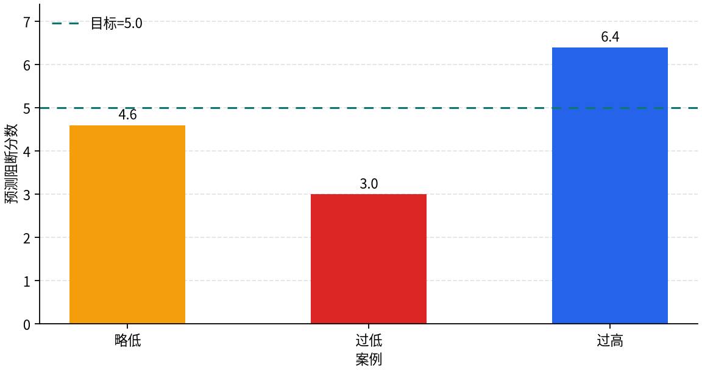
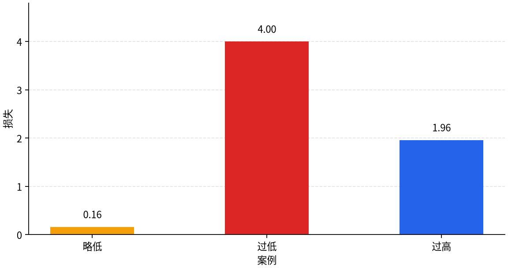
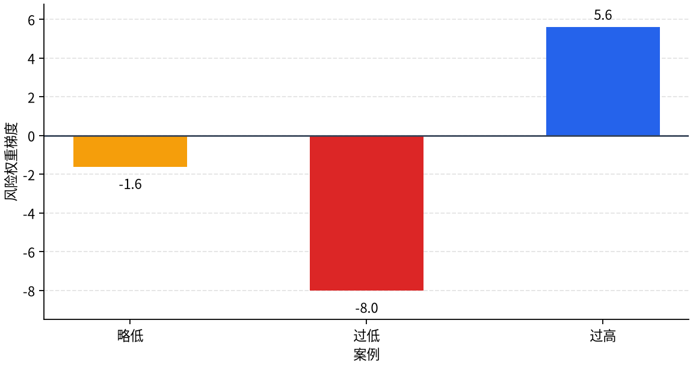

# P5-5.1 损失如何变成梯度（gradient）信号

Section ID: `P5-5.1`
Version: `v2026.07.17`

在 P5-4 章里，我们已经看到：损失函数（loss function）会把当前输出与目标之间的偏差变成一个数字。但只有损失数字本身，还不能直接去修改参数（parameter）。

损失告诉我们的是`到底错了多少`，但`哪个参数应该往哪个方向、改多少`，还需要另外计算。

这时真正需要的信号，就是梯度（gradient）。梯度表示的是：损失对某个具体参数到底有多敏感。从损失出发，把这种敏感度从后面的计算一步步往前面的计算重新算出来的过程，就是反向传播（backpropagation）。

如果在后面的章节里又开始把它和计算图或优化器（optimizer）混在一起，更适合回到[英文概念词汇表里的 backpropagation 条目](/AiBook/en/reference/concept-glossary/#backpropagation)，先重新拆开各自的计算角色。

这一节先固定下面三句话：

- 损失把当前输出到底错了多少变成数字。
- 梯度负责计算：每个参数与损失之间连着什么方向和多大强度。
- 优化器接收这些梯度，再执行真正的参数更新。

## 本节范围

- 为什么只有损失数字，还不能直接更新参数？
- 梯度额外告诉了我们什么？
- 为什么反向传播可以被看成“从损失出发去算梯度”的过程？
- 自动微分（automatic differentiation）怎样让这件事在代码里变得可行？
- 梯度计算与优化器更新到底有什么不同？

把复杂计算关系展开成节点与连接的视角，会在 P5-5.2 继续；而把梯度真正变成参数移动的优化器角色，则会在 P5-7.1、P5-7.2 再重新接回。也就是说，这一节先要闭合的是：只有当`损失数字`被重新改写成`按参数分开的梯度信号`时，学习才会继续下去。

## 本节目标

- 能区分损失、梯度、优化器更新这三件事。
- 能把梯度解释成`损失对某个参数有多敏感的信号`。
- 能把反向传播解释成`从损失出发，沿着前面的计算一路往回算梯度的过程`。
- 能把自动微分解释成`利用顺向计算记录，自动组织梯度计算的技术`。
- 能用一个很小的例子确认：损失大小和梯度方向并不是同一件事。

## 为什么损失还不是更新

损失（loss）只是一个数字。比如某个模型当前的损失是 `4.0`，但这个数字本身还回答不了下面这些问题：

在真实的深度学习实现里，很多时候并不是直接对单个样本损失求导，而是对包含 batch 平均值或总和、再加上正则化项的 `objective/cost` 求导。不过在读者先抓住梯度角色的这一阶段，只需要理解：整个目标函数的核心出发点，仍然是`损失制造出来的偏差信号`。

- 到底哪个参数和这个损失连得更紧？
- 这个参数应该被调大，还是调小？
- 只需要小幅移动，还是必须大幅修改？

因此，学习在损失之后还必须再走一步：把损失重新拆成按参数分开的信号。

| 阶段 | 它在问什么 | 结果 |
| --- | --- | --- |
| 损失计算（loss computation） | 当前输出离目标有多远？ | 损失数字 |
| 梯度计算（gradient computation） | 每个参数与损失之间连着什么方向和多大强度？ | 各参数对应的梯度 |
| 优化器更新（optimizer update） | 利用这些梯度，模型到底要实际移动多少？ | 新的参数值 |

这张表里最重要的一点是：梯度计算和更新并不是一回事。梯度只是`应该怎样移动的信号`，优化器才会利用这个信号决定`真正怎么移动`。

## 梯度到底告诉了什么

梯度会告诉我们：损失对某个参数到底有多敏感。先看下面这个很简单的式子：

\[
predicted\_block\_score = risk\_weight \times pressure\_unrecovered
\]

\[
L = (predicted\_block\_score - target\_block\_score)^2
\]

即使这里的损失 \(L\) 很大，也还不能立刻知道 `risk_weight` 应该调大还是调小。如果预测分数低于目标，可能要把 `risk_weight` 调大；如果预测分数高于目标，可能反而要把它调小。

梯度会把这种差别保留下来，而保留它的方式就是符号与大小。

| 从梯度里读到的东西 | 它表示什么 |
| --- | --- |
| 符号（sign） | 当参数稍微增大一点时，损失会变大还是变小 |
| 绝对值大小（magnitude） | 损失对这个参数有多敏感 |

也就是说，损失讲的是`错得有多厉害`，梯度讲的是`按参数分开的敏感度信号`。而真正的更新，通常不是沿着让损失变大的方向走，而是沿着反方向走。所以，当梯度为正时，往往意味着把参数调小会让损失下降；当梯度为负时，则往往意味着把参数调大会让损失下降。

## 反向传播在这里处于什么位置

神经网络是许多计算串在一起的结构。

```mermaid
--8<-- "assets/part-05/chapter-05/forward-loss-backward-flow-zh.mmd"
```

顺向传播（forward pass）从输入出发，先算出输出与损失。反向传播（backward pass）则从损失出发，再沿着前面的计算一路往回计算梯度。

这张流程图最先要确认的结果是：顺向传播和反向传播并不是在重复同一句话，它们分别在回答不同的问题。先有一条算出输出与损失的流程，之后才有一条从损失出发、把梯度一路传回更前面参数的流程。

## 为什么要从后往前算

输出层（output layer）和损失连得最近。

- 已经有了最终输出；
- 也已经有了目标值；
- 然后通过比较这两者，损失被算出来。

所以我们最容易先知道的是：`损失对最终输出到底怎样反应？` 接下来，利用“最终输出依赖于前一层的值和参数”这一点，把影响一层层继续传回去。

顺向传播和反向传播，并不是同一句话只把箭头倒过来。它们问的问题本来就不同。

| 流程 | 计算方向 | 它在问什么 |
| --- | --- | --- |
| 顺向传播（forward pass） | 从输入走到输出与损失 | 现在预测了什么、错了多少？ |
| 反向传播（backward pass） | 从损失一路回到更前面的参数 | 这个错误在每个参数上留下了什么梯度？ |

换句话说，之所以要从后往前算，是因为损失本来就位于计算的末端。必须先算离损失最近的那一步的梯度，再把这个梯度继续传给更前面的计算，前面各层的参数才会真正收到更新信号。

如果把这件事画得再简单一点，就是下面这样：

```mermaid
--8<-- "assets/part-05/chapter-05/forward-loss-backward-flow-zh.mmd"
```

这张图最核心的顺序是：`先看输出错在哪里 -> 先算最后那一步的梯度 -> 再把这个影响传回更前面的计算 -> 一直重复到最前层。`

## 为什么会出现链式法则（chain rule）

神经网络本质上是很多层函数叠在一起的结构。

如果把它写得非常简单，可以先看成下面这样：

```mermaid
--8<-- "assets/part-05/chapter-05/chain-rule-dependency-flow-zh.mmd"
```

损失并不是直接挂在最早的输入或最前面的参数上，而是通过很多中间值间接相连。在这种结构里，必须把“一步变化会怎样影响下一步”的关系继续串起来。这时就会出现链式法则（chain rule）。

先这样理解就够：

`如果后面的结果依赖于前面的值，那么影响就必须按阶段一个接一个地传下去。`

比公式更应该先抓住的问题是这个：

`如果这一层的输出成了下一层的输入，那么后面产生的错误，难道不会把一部分梯度分回给前一层吗？`

链式法则，就是把这一直觉变成数学上可计算规则的东西。反向传播，则是在神经网络这种层层嵌套的函数结构里，高效地使用链式法则，把损失重新变成按参数分开的梯度信号。

## 为什么自动微分也必须一起理解

在现代深度学习里，使用者通常不会把每一条微分式都手工展开。像 PyTorch、TensorFlow、JAX 这样的框架，会先记录顺向传播时发生了哪些计算，然后从损失出发，自动组织反向的梯度计算。

这种技术就是自动微分（automatic differentiation）。

自动微分并不是像魔法一样“凭空生成梯度”。它会先记下顺向传播里“哪个值由哪个运算产生”，然后在反向阶段按相反顺序套用各个运算的微分规则，把梯度算出来。

这一节需要掌握的深度，大致是下面这样：

| 区分 | 这一节要知道什么 | 这一节不深入什么 |
| --- | --- | --- |
| 反向传播 | 从损失出发，计算更前面参数梯度的过程 | 对整个深层网络进行严格的矩阵微分推导 |
| 自动微分 | 框架会利用顺向传播记录，自动组织梯度计算 | 自动微分引擎内部的内存管理、优化与实现细节 |
| 计算图 | 作为理解“记录了什么、沿着什么跟回去”的表达方式 | 图引擎本身的实现细节 |

所以，自动微分并不是`可以完全不看的主题`。如果要理解反向传播为什么能在真实代码里运行，它就是必须知道的概念。但自动微分的一般理论与框架内部实现，并不是 P5-5.1 的中心范围。

## 案例与示例

### 案例 1. 即使都有损失，更新方向也可能不同

先想象一个很小的模型，它会预测一个再启动阻断分数。输入是 `pressure_unrecovered`，参数是 `risk_weight`，目标是 `target_block_score`。

人最容易先看的是：损失到底大不大。但在真正学习时，只看损失大小并不够。我们还得区分：当预测低于目标时，应当把 `risk_weight` 调大；而当预测高于目标时，则应当把 `risk_weight` 调小。

例如设定 `pressure_unrecovered = 2.0`，`target_block_score = 5.0`。如果 `risk_weight = 1.5`，那么预测分数就是 `3.0`；如果 `risk_weight = 3.2`，预测分数就是 `6.4`。这两个场景里都会出现损失，但学习真正要做的事情却正好相反：前者分数偏低，需要提高 `risk_weight`；后者分数偏高，需要降低 `risk_weight`。

```mermaid
--8<-- "assets/part-05/chapter-05/case1-loss-to-gradient-reading-zh.mmd"
```

这个很小的场景里，最先要抓住的结果只有一个：损失只留下了`它错了`这个事实，而梯度会进一步留下`要往哪个方向修、修得多强。`

| 场景 | 预测和目标的关系 | 如果只看损失 | 如果连梯度一起看 |
| --- | --- | --- | --- |
| 预测略低 | 比目标稍微小一些 | 误差较小 | 会留下较弱的 `increase risk_weight` 信号 |
| 预测明显偏低 | 比目标小很多 | 误差较大 | 会留下更强的 `increase risk_weight` 信号 |
| 预测偏高 | 比目标大 | 有误差 | 会留下 `decrease risk_weight` 信号 |

如果再把同一张表改成“损失在回答什么问题”与“梯度在回答什么问题”，差异会更明显。

| 当前在看的值 | 它立刻回答了什么问题 | 还留下了什么空白 |
| --- | --- | --- |
| 损失（loss） | 偏了多少？ | 到底该让谁往哪个方向动 |
| 梯度（gradient） | 哪个参数该增大或减小？ | 优化器最后到底会移动多远 |

这个案例里必须确认的结果是：如果说损失负责告诉我们“错误有多大”，那么梯度负责的就是把这个错误重新改写成“按参数分开的方向与强度”。

### 案例 2. 为什么不能只修最后那个分数

真实神经网络并不会立刻产出一个分数，而是会先把多个输入组合成中间表征，再从中间表征得到最后输出。比如，可以想象模型先把`温度警报`、`压力警报`、`振动警报`组合成一个`整体风险信号`，然后再根据这个信号给出最后的停机分数。

当最终分数是错的时，很容易觉得“只看最后一层就够了”。但最后分数本来就依赖于前面几层产生的`整体风险信号`，因此还必须一起修正：前面到底是怎样把这些输入组合起来的。

这时，反向传播的直觉就会变得很重要。

- 如果最终输出错了，背责任的不只是最后一条连接；
- 产生最后这条连接的前面表征，也有责任；
- 而更前面那些生成该表征的权重，也会收到梯度。

也就是说，反向传播并不是`只修最后那个分数`，而是`把输出误差的梯度一步步继续分回更前面的层`。所以，这个案例里真正要确认的是：梯度会不会真的不仅落在最后一层，也落在更前面各层的权重上，而且方向与大小还可能不同。

把这两个案例一起压缩后，这一节最先该抓住的流程就是下面这样：

```mermaid
--8<-- "assets/part-05/chapter-05/backprop-direction-and-responsibility-flow-zh.mmd"
```

这张图的作用，是把案例 1 里的`分数太低 / 太高`方向感，以及案例 2 里的`梯度会一路传回更前面的层`这件事，压成一条共同流程。这里的重点是：`先看损失 -> 方向出现 -> 梯度从后往前传回去。`

把两个案例并排放在一起看，就更容易发现：反向传播并不只是一个告诉你`损失很大`的过程，而是一个重新写出`谁该被怎样修、修到什么程度`的过程。

| 场景 | 只看损失时容易留下的解释 | 梯度计算会更明确留下什么 |
| --- | --- | --- |
| 修正一个分数 | 容易只觉得分数小就调大，分数大就调小 | 会把方向和修正强度一起按参数保留下来 |
| 多个输入之后才得到最终分数 | 容易只盯着最后输出，想只修最后一层 | 会把梯度继续分给中间层与更前面的层 |

这张表里读者最先要抓住的结果是：关键不是`知道损失了`，而是`把损失重新改写成按参数分开的梯度信号`。

## 练习与示例

这次示例的目标，并不是把整个反向传播都实现出来，而是在一个非常小的式子里，直接确认`损失数字`和`梯度信号`到底有什么不同。这里会把`阻断分数偏低`与`阻断分数偏高`两种场景放在一起看，这样才能一起看到梯度符号是怎样改变的。

输入：

- 压力未恢复程度 `pressure_unrecovered`
- 目标阻断分数 `target_block_score`
- 当前风险权重 `risk_weight`

输出：

- 预测得到的阻断分数
- 损失
- `risk_weight` 对应的梯度
- 梯度所指向的修正方向

问题场景：

- 如果只看公式，梯度还是很抽象，所以最好直接看看：当阻断分数偏低或偏高时，方向到底怎样改变；
- 即使方向相同，也要一起看：误差更大时，梯度绝对值是否真的更大。

要确认的概念：

- 损失永远是 0 或更大，因此它本身不会直接携带方向信息；
- 通过看梯度符号，可以解释参数为了让损失下降，应该朝哪边移动；
- 梯度绝对值会显示：损失对这个参数到底有多敏感。

在看代码之前，先猜一猜每个案例会产生什么样的信号会更好。

| 案例 | 可以先猜的比较结果 | 这样猜的原因 |
| --- | --- | --- |
| `slightly_under_block_signal` | `increase_risk_weight`，但强度可能较弱 | 因为它只比目标略低一点，方向虽然是调大，但未必需要很大修正。 |
| `too_weak_block_signal` | `increase_risk_weight`，而且强度更强 | 虽然方向相同，但它离目标差得更多，所以梯度绝对值可能更大。 |
| `too_strong_block_signal` | `decrease_risk_weight` | 因为它已经高于目标，所以信号应该指向反方向。 |

这张表的目的不是背公式，而是练习把`方向`和`强度`分开来读。

这里可以直接改动的值是 `risk_weight`。如果把它调到接近 `2.5`，预测会更靠近目标；如果把它调得更小或更大，就能直接看到梯度符号与大小是怎样变化的。

```python
cases = [
    {
        "name": "slightly_under_block_signal",
        "pressure_unrecovered": 2.0,
        "target_block_score": 5.0,
        "risk_weight": 2.3,
    },
    {
        "name": "too_weak_block_signal",
        "pressure_unrecovered": 2.0,
        "target_block_score": 5.0,
        "risk_weight": 1.5,
    },
    {
        "name": "too_strong_block_signal",
        "pressure_unrecovered": 2.0,
        "target_block_score": 5.0,
        "risk_weight": 3.2,
    },
]

for case in cases:
    pressure_unrecovered = case["pressure_unrecovered"]
    target_block_score = case["target_block_score"]
    risk_weight = case["risk_weight"]

    predicted_block_score = risk_weight * pressure_unrecovered
    loss = (predicted_block_score - target_block_score) ** 2
    gradient_risk_weight = 2 * (
        predicted_block_score - target_block_score
    ) * pressure_unrecovered

    direction = (
        "increase_risk_weight"
        if gradient_risk_weight < 0
        else "decrease_risk_weight"
    )

    print(f"[{case['name']}]")
    print("predicted_block_score =", round(predicted_block_score, 3))
    print("loss =", round(loss, 3))
    print("gradient_risk_weight =", round(gradient_risk_weight, 3))
    print("direction_from_gradient =", direction)
    print("---")
```

输出可以这样读：

```text
[slightly_under_block_signal]
predicted_block_score = 4.6
loss = 0.16
gradient_risk_weight = -1.6
direction_from_gradient = increase_risk_weight
---
[too_weak_block_signal]
predicted_block_score = 3.0
loss = 4.0
gradient_risk_weight = -8.0
direction_from_gradient = increase_risk_weight
---
[too_strong_block_signal]
predicted_block_score = 6.4
loss = 1.96
gradient_risk_weight = 5.6
direction_from_gradient = decrease_risk_weight
---
```

读这组输出时，必须按 `预测分数 -> 损失 -> 梯度` 这个顺序拆开来看。



第一张图展示的是各案例的预测阻断分数。目标值是 `5.0`。前两个案例都低于目标，最后一个案例则高于目标。



第二张图展示的是损失。损失会告诉我们误差有多大，但不会直接告诉我们方向。比如，仅凭“有损失”这个事实，还无法判断该把 `risk_weight` 调大还是调小。



到了第三张图，方向才真正出现。负梯度意味着应该沿着增大 `risk_weight` 的方向去读，正梯度则意味着应该沿着减小 `risk_weight` 的方向去读。所以，这个例子里最关键的变化，并不是“得到了一个损失数字”，而是“得到了按参数拆开的梯度信号”。

把三个案例重新收在一起，会更容易看出：符号与大小必须同时阅读。

| 案例 | 从损失里先看到的东西 | 从梯度里进一步看到的东西 | 现在要抓住的核心 |
| --- | --- | --- | --- |
| `slightly_under_block_signal` | 误差较小 | 较弱的增加信号 | 因为略低于目标，所以要调大，但更像微调。 |
| `too_weak_block_signal` | 误差较大 | 更强的增加信号 | 虽然方向相同，但它离目标更远，所以梯度绝对值更大。 |
| `too_strong_block_signal` | 同样有误差 | 减小信号 | 方向本身已经反过来，说明应当降低 `risk_weight`。 |

- 当阻断分数太小，梯度会是负数，对应的读法是要把 `risk_weight` 调大；
- 当阻断分数太大，梯度会是正数，对应的读法是要把 `risk_weight` 调小；
- 即使方向相同，只要误差更大，梯度绝对值也会更大，代表更强的修正信号。

这个示例里必须留下的一句话是：

`损失把错误变成数字，而梯度会把这个错误重新改写成按参数分开的方向与强度信号。`

如果再把结果按“损失视角”和“梯度视角”拆开来读，差别会更明显。

| 输出里看到的差异 | 只看损失时容易留下的解释 | 连梯度一起看时会改写成什么 |
| --- | --- | --- |
| `slightly_under_block_signal` 与 `too_weak_block_signal` 都是分数偏低 | 容易只觉得两者都应该把风险权重调大 | 还要继续区分：谁的增加信号更强 |
| `too_weak_block_signal` 与 `too_strong_block_signal` 都有损失 | 容易觉得它们都只是有误差，因此大致差不多 | 实际上一个要求增加，另一个要求减少，方向已经完全分开 |
| 最先看到的只是损失数字 | 容易觉得只知道误差大小就够了 | 真正更新时，还必须进一步拿到按参数分开的梯度信号 |

把这张表也读完后，就会更清楚：反向传播的关键并不是`已经算出损失了`，而是`已经把损失重新改写成按参数分开的方向与强度信号了。`

## 在多层神经网络里，为什么会更难

刚才那个例子里，参数只有一个，所以看起来很简单。但到了多层神经网络里，情况会立刻变复杂：

- 输出要经过很多层才能走到最后；
- 每一层里参数都很多；
- 每一层的值又会成为下一层的输入。

因此，必须有一个过程，把损失的影响重新分配给各层各参数。反向传播就是从损失出发，沿着前面的计算一路往回，把这些梯度高效地算出来。自动微分则会让框架根据执行记录，把这件事自动组织起来。

先这样记住就足够：

`层越深，越不可能手写全部梯度，但反向传播会把这些计算有组织地从后往前传回去。`

在反向传播的历史里，虽然更早也有许多前导想法与贡献，但在神经网络学习的脉络里，经常被视为关键转折点的是 Rumelhart、Hinton、Williams 在 1986 年的论文。它让人们更广泛地看到：多层神经网络可以学习到有用的内部表征。

如果再把时间线看得更长一点，也常会提到 Paul Werbos 在 1974 年的博士论文。不过这一节只需要记住下面这层程度：

- 更早就已经存在相关的数学与优化思想；
- 到了 1980 年代中期，它才作为神经网络学习过程中的关键步骤被更广泛地理解。

从课程结构来看，这也是很关键的一节。P5-4.1、P5-4.2 已经说明了为什么必须设置损失函数；那接下来就必须理解：这个损失到底怎样一路传回到各层参数。原因很简单：

- 即使已经有了损失函数，
- 如果还不知道这个损失怎样连到各层参数，
- 真正的学习更新就无法发生。

也就是说，反向传播正是让“深度学习真的会学习”这句话成立的梯度计算过程。

下一节 P5-5.2 会继续把这份执行记录展开成计算图（computation graph）。一旦看到计算图，就会更清楚：顺向传播里到底生成了哪些中间值，而反向传播里的梯度又沿着什么路径被送回去。

## 什么时候要切到梯度计算视角

| 先出现的问题场景 | 为什么此时需要梯度计算视角 | 紧接着该转向什么问题 |
| --- | --- | --- |
| 已经知道损失，却还不知道该改哪个参数 | 因为损失必须先被重新拆成按参数分开的方向与强度信号 | 更复杂的计算里，这些信号究竟怎样被追踪？ |
| 容易觉得“损失大就一定要大幅更新” | 因为损失大小与更新方向并不是同一种信息 | 优化器会怎样利用这些梯度决定步幅？ |
| `.backward()` 在框架里看起来像魔法 | 因为必须知道自动微分会利用顺向记录来组织梯度计算 | 计算图到底记录了什么？ |

## 检查清单

- 能说明：即使损失已经算出来了，也还不能直接更新参数吗？
- 能说明梯度就是按参数分开的方向与强度信号吗？
- 能说明反向传播是从损失出发，沿着前面的计算一路往回算梯度的过程吗？
- 能解释自动微分会利用顺向传播记录来自动组织梯度计算吗？
- 能区分梯度计算与优化器更新吗？
- 能理解下一节为什么要展开成计算图，也就是为了追踪更复杂的梯度计算路径吗？

## 出处与参考资料

- David E. Rumelhart, Geoffrey E. Hinton, Ronald J. Williams, `Learning representations by back-propagating errors`, Nature, 1986, 确认日期：2026-06-29.
- Paul J. Werbos, `Beyond Regression: New Tools for Prediction and Analysis in the Behavioral Sciences`, Harvard University doctoral thesis, 1974, 确认日期：2026-06-29.
- Ian Goodfellow, Yoshua Bengio, Aaron Courville, `Deep Learning`, MIT Press, 2016, 确认日期：2026-06-29. [https://www.deeplearningbook.org/](https://www.deeplearningbook.org/){: target="_blank" rel="noopener noreferrer" }
