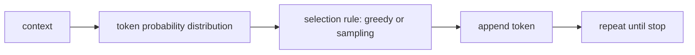

# P5-5.2 생성 과정의 직관

P5-5.1에서는 LLM의 기본 학습 목표가 다음 토큰 예측(next-token prediction)이라는 점을 보았습니다. 하지만 사용자 경험은 단지 `다음 한 조각 예측`이라는 말보다 훨씬 복잡해 보입니다.

질문은 자연스럽게 이어집니다.

그렇다면 실제 생성은 어떤 흐름으로 진행되는가?

이 절은 그 과정을 독자 기준에서 직관적으로 설명합니다.

## 이 절의 범위

이 절은 다음 질문에 답합니다.

- 생성은 한 토큰씩 어떻게 이어지는가?
- 왜 같은 입력에서도 결과가 조금씩 달라질 수 있는가?
- temperature, sampling, greedy 선택은 어떤 차이를 만드는가?

이 절에서는 다음 내용을 깊게 다루지 않습니다.

- beam search 수식
- nucleus sampling(top-p) 세부 공식
- 디코더 내부 attention 계산 과정

이 절은 생성 선택의 감각까지만 다루고, attention 구조 자체는 이미 P5-3.1 Transformer 구조 복습과 P5-3.2 attention과 context window에서 다시 읽을 수 있습니다. beam search와 top-p의 공식 전개는 현재 판의 입문 본편 범위 밖으로 둡니다.

이 절의 목적은 `생성은 확률 분포에서 다음 토큰을 반복 선택하는 과정`이라는 직관을 만드는 것입니다.

## 이 절의 목표

- 생성이 반복 선택 과정임을 설명할 수 있습니다.
- greedy 선택과 sampling의 차이를 구분할 수 있습니다.
- temperature가 `모델 파라미터`가 아니라 `생성 시 선택 성향을 바꾸는 설정값`이라는 점을 설명할 수 있습니다.
- 왜 같은 질문에도 다른 답이 나올 수 있는지 설명할 수 있습니다.

## 생성은 어떻게 이어지나

생성 과정은 매우 단순하게 말하면 다음 순서를 반복합니다.

1. 현재까지의 토큰을 본다
2. 다음 토큰 후보들의 확률 분포를 계산한다
3. 어떤 규칙으로 하나를 고른다
4. 고른 토큰을 뒤에 붙인다
5. 종료 조건까지 반복한다

이 과정을 보면, 생성은 `정답을 미리 다 써 둔 문장을 꺼내는 일`이 아니라 `매 단계에서 다음 선택을 이어 가는 일`에 더 가깝습니다.

## 왜 같은 질문에도 답이 달라질 수 있나

모델은 보통 후보 하나만 절대적으로 정하지 않습니다. 여러 후보가 그럴듯할 수 있습니다.

예를 들어 어떤 문장 뒤에는:

- `좋습니다`
- `가능합니다`
- `검토하겠습니다`

같은 후보가 모두 자연스러울 수 있습니다.

이때 항상 가장 높은 후보만 고르면 결과는 더 안정적일 수 있지만, 표현이 단조로워질 수 있습니다. 반대로 확률 분포에서 샘플링(sampling)하면 더 다양한 결과가 나올 수 있지만, 불안정성도 커질 수 있습니다.

## greedy와 sampling은 어떻게 다른가

가장 간단한 비교는 다음과 같습니다.

| 방식 | 핵심 아이디어 |
| --- | --- |
| greedy | 매 단계에서 가장 높은 확률 후보를 고른다 |
| sampling | 확률 분포를 반영해 후보를 뽑는다 |

greedy는 더 예측 가능하고, sampling은 더 다양합니다.

다음처럼 기억하면 충분합니다.

`greedy는 가장 안전한 한 점을 고르는 방식이고, sampling은 그럴듯한 후보들 사이에서 확률적으로 선택하는 방식이다.`

## temperature는 무엇을 바꾸나

이 표현은 Part 1에서도 한 번 조심해서 다뤘습니다. 많은 사용자가 temperature를 `모델 내부를 바꾸는 학습 파라미터`처럼 오해합니다. 하지만 일반적인 서비스 사용 문맥에서는 다음처럼 설명하는 편이 안전합니다.

`temperature는 생성 시 후보 확률 분포를 얼마나 날카롭거나 퍼지게 읽을지 조정하는 설정값이다.`

즉:

- 낮은 temperature: 상위 후보를 더 강하게 밀어 준다
- 높은 temperature: 낮은 후보도 더 자주 선택될 수 있다

이 값은 보통 `학습된 지식 자체`를 바꾸는 것이 아니라, `생성 시 선택 방식`을 바꿉니다.

## 아주 단순하게 그리면



이 도식의 핵심은 생성이 `확률 분포 계산`과 `선택 규칙`의 결합이라는 점입니다.

## 사례로 보기

### 사례 1. 고객 응답 초안

고객 지원 초안을 자동으로 만들 때를 생각해 볼 수 있습니다. 사람이 원하는 것은 보통 독창적인 표현보다 정책에 맞는 안정적인 문장입니다. 이 경우 생성 설정이 너무 다양하면 같은 질문에도 말투와 안내 순서가 흔들려 운영 품질이 떨어질 수 있습니다. 그래서 낮은 temperature와 더 보수적인 선택 규칙이 더 잘 맞는 경우가 많습니다. 이 사례는 생성 설정이 `재미있는 문장 만들기`가 아니라 `운영 안정성 조절` 문제로도 읽혀야 함을 보여 줍니다.
예를 들어 어떤 답은 먼저 사과하고 어떤 답은 바로 정책을 말하면, 내용이 맞아도 서비스 톤은 일정하지 않게 느껴질 수 있습니다.

### 사례 2. 마케팅 문구 초안

마케팅 문구 초안이나 아이디어 브레인스토밍에서는 상황이 다릅니다. 사람이 이 단계에서 먼저 쓰는 기준은 보통 `틀리지 않는 한 문장`보다 `비교할 만한 여러 후보가 나오는가`입니다. 같은 표현만 반복해서 받으면 오히려 후보 폭이 너무 좁다고 느낄 수 있습니다. 이때는 어느 정도 다양한 어휘와 문장 구성이 나와야 여러 방향을 비교할 수 있습니다. 그래서 sampling 계열 설정이 더 유용해질 수 있습니다. 이 사례는 같은 모델이라도 목적에 따라 `안정성`과 `다양성` 중 어디에 더 무게를 둘지 달라진다는 점을 보여 줍니다.
예를 들어 세 개 시안을 요청했는데 모두 `쉽고 빠른`으로 시작하면, 모델이 틀린 것은 아니어도 브레인스토밍에는 도움이 적을 수 있습니다.

### 사례 3. 코드 생성

코드 생성에서는 문법 안정성과 재현성이 특히 중요합니다. 사람이 원하는 것은 매번 색다른 코드보다, 같은 요구에 대해 비슷한 구조로 안정적으로 동작하는 결과인 경우가 많습니다. 생성 설정이 너무 다양하면 한 번은 예외 처리를 넣고 다음에는 빼는 식으로 결과가 흔들려 디버깅 비용이 커질 수 있습니다. 그래서 코드 생성에서는 높은 다양성보다 더 보수적인 설정이 선호되기 쉽습니다. 이 사례는 생성 과정의 선택 규칙이 결과 품질뿐 아니라 재현성과 유지보수성에도 직접 영향을 준다는 점을 보여 줍니다.
예를 들어 같은 함수 수정 요청인데 한 번은 `try/except`를 넣고 다음에는 생략하면, 비교와 회귀 확인이 훨씬 어려워질 수 있습니다.

## 작은 Python 예제로 보기

이번 예제의 목표는 확률 후보에서 `greedy`와 `sampling`이 어떻게 다르게 동작하는지 감각적으로 보는 것입니다.

입력:

- 같은 후보 확률

출력:

- greedy 선택
- sampling 예시 선택

```python
import random

candidates = {
    "좋습니다": 0.50,
    "가능합니다": 0.30,
    "검토하겠습니다": 0.20,
}

greedy_choice = max(candidates, key=candidates.get)
sample_choice = random.choices(
    population=list(candidates.keys()),
    weights=list(candidates.values()),
    k=1,
)[0]

print("candidates =", candidates)
print("greedy_choice =", greedy_choice)
print("sample_choice =", sample_choice)
```

실행 결과 예시는 다음처럼 읽을 수 있습니다.

```text
candidates = {'좋습니다': 0.5, '가능합니다': 0.3, '검토하겠습니다': 0.2}
greedy_choice = 좋습니다
sample_choice = 가능합니다
```

이 예제에서 핵심은 sample 결과가 항상 같지 않을 수 있다는 점입니다. 다시 실행하면 다른 후보가 나올 수 있습니다. 그 차이가 곧 생성 다양성의 출발점입니다.

## temperature를 아주 단순한 비유로 보면

독자에게는 다음 정도의 비유가 유용합니다.

- 낮은 temperature: `가장 유력한 후보만 거의 고른다`
- 높은 temperature: `덜 유력한 후보도 꽤 자주 검토한다`

다만 이 비유도 전부는 아닙니다. 실제 구현에서는 확률 분포의 모양 자체가 조정됩니다. 그래서 `temperature는 randomness 버튼`이라고만 말하면 부족합니다.

## 역사와 커리큘럼 관점

언어 모델을 실제 사용자 도구로 이해하려면, 학습 목표와 생성 절차를 분리해서 보는 습관이 중요합니다.

- 학습 목표: 다음 토큰 예측
- 생성 절차: 후보 분포에서 실제 토큰을 선택하는 반복 과정

이 구분이 있어야 이후의:

- prompting
- decoding 설정
- hallucination 검토
- 평가

를 서로 다른 문제로 나눠 볼 수 있습니다.

## 다음 장과의 연결

여기까지 오면 이제 다음 질문이 남습니다.

- 이렇게 한 토큰씩 이어 생성하는 구조를 모델은 대규모 데이터에서 먼저 무엇으로 학습하는가?
- 사전학습(pretraining)은 이 생성 감각을 어떤 방식으로 키우는가?

이 질문은 P5-6.1 사전학습(pretraining)으로 이어집니다.

## 이 절에서 기억할 관점

- 생성은 확률 분포에서 다음 토큰을 반복 선택하는 과정입니다.
- greedy와 sampling은 선택 규칙이 다릅니다.
- temperature는 일반적으로 생성 시 선택 성향을 바꾸는 설정값입니다.
- 같은 입력에서도 결과가 달라질 수 있는 이유는 생성 절차의 확률적 선택 구조와 연결됩니다.

## 체크리스트

- 생성이 반복 선택 과정이라는 점을 설명할 수 있는가?
- greedy와 sampling의 차이를 말할 수 있는가?
- temperature를 학습 파라미터와 구분해 설명할 수 있는가?
- 왜 같은 질문에도 결과가 달라질 수 있는지 설명할 수 있는가?

## 출처와 참고 자료

- Tom B. Brown et al., `Language Models are Few-Shot Learners`, arXiv, 2020, 확인 날짜: 2026-06-29.
- OpenAI API Docs, 생성 설정 관련 문서, 확인 날짜: 2026-06-29. [https://platform.openai.com/docs](https://platform.openai.com/docs){: target="_blank" rel="noopener noreferrer" }
- Anthropic Docs, sampling과 temperature 설명 자료, 확인 날짜: 2026-06-29. [https://docs.anthropic.com](https://docs.anthropic.com){: target="_blank" rel="noopener noreferrer" }
