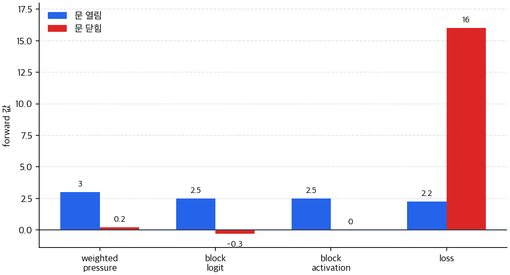
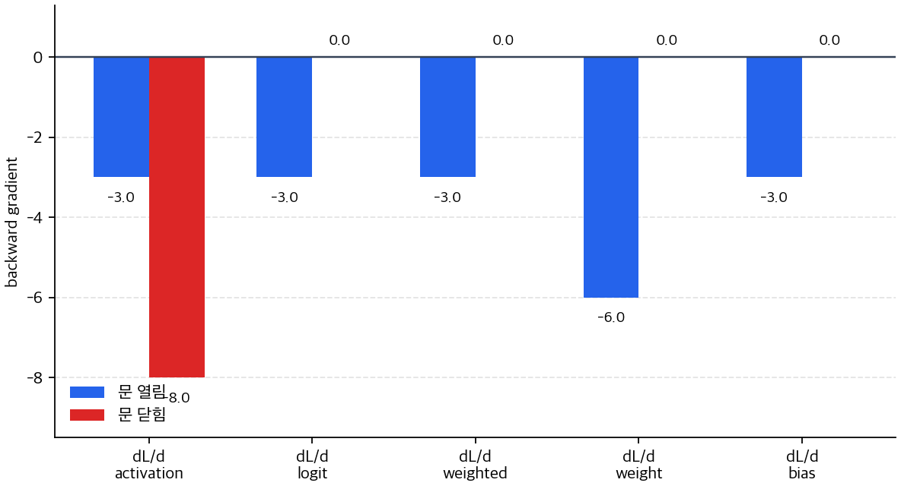

# P5-5.2 계산 그래프(computation graph)와 자동미분(automatic differentiation)

> Section ID: `P5-5.2`
> Version: `v2026.07.31`

P5-5.1에서는 손실(loss)이 바로 업데이트가 아니라, 파라미터별 그래디언트(gradient) 신호로 다시 풀려야 한다고 설명했습니다. 여기까지 이해하면 다음 질문이 남습니다.

층이 많고 연산이 복잡해지면, 프레임워크는 어떤 계산을 기록해 두었다가 gradient를 자동으로 계산하는가?

이 질문에 답하는 관점이 계산 그래프(computation graph)와 자동미분(automatic differentiation)입니다.

계산 그래프는 모델의 연산을 노드(node)와 연결(edge)로 펼쳐 놓아, 순전파에서 값이 어디서 만들어지고 자동미분이 backward에서 어떤 경로로 gradient를 되돌리는지 보이게 하는 표현이다.

연산 관계를 다시 작게 펼쳐 읽어야 할 때는 개념사전의 [계산 그래프(computation graph)](../../../reference/concept-glossary-parts/01-giyeok.md#computation-graph), [자동미분(automatic differentiation)](../../../reference/concept-glossary-parts/09-jieut.md#automatic-differentiation), [연쇄 법칙(chain rule)](../../../reference/concept-glossary-parts/08-ieung.md#chain-rule) 항목을 기준으로 삼습니다.

## 계산 그래프가 미분을 기억하는 질문

- 계산 그래프는 무엇을 표현하는가?
- 왜 딥러닝에서 연산을 그래프로 보는가?
- 순전파(forward pass)와 역전파(backward pass)는 그래프에서 어떻게 읽히는가?
- 자동미분(automatic differentiation)과 어떤 관계가 있는가?

이 절에서는 그래프 이론 자체를 배우기보다, `딥러닝 계산을 그래프처럼 기록해야 자동미분이 가능해지는 이유`를 설명합니다.

Part 5 기준에서는 여기까지면 gradient 계산을 이해하는 데 필요한 본문 책임이 이미 닫힙니다. 별도의 `역전파 수학 보충학습`을 더 두기보다, 현재 절까지에서 `손실에서 gradient로`, `연쇄 법칙`, `계산 그래프`, `자동미분` 감각을 잡고 이후 optimizer 절로 넘어가는 편이 현재 책 흐름에 더 맞습니다. 여기서는 `새 모델 구조`보다 이미 본 구조를 `어떻게 기록하고 어떻게 gradient를 되돌려 보내는가`를 읽습니다.

| 지금 절에서 읽는 것 | 왜 여기서 필요한가 |
| --- | --- |
| 계산 구조의 연결 관계 | 어떤 중간값이 어디서 만들어지고 어디로 전달되는지 보여 주기 때문입니다. |
| 학습 절차의 backward 흐름 | 손실이 각 연산에 얼마나 책임을 나누는지 단계별로 읽게 해 주기 때문입니다. |
| 다음 optimizer 절과의 연결 | gradient가 계산된 뒤 실제 파라미터를 어떻게 바꿀지는 P5-7에서 다시 보기 때문입니다. |

## 의존 관계와 자동미분의 판단 기준

- 계산 그래프를 `연산 의존 관계를 펼쳐 놓은 기록 구조`로 설명할 수 있습니다.
- 순전파는 값 계산, 역전파는 gradient 전달이라는 점을 그래프 위에서 읽을 수 있습니다.
- 계산 그래프가 복잡한 미분을 단계별로 잘게 나누게 해 준다는 점을 이해할 수 있습니다.
- 자동미분이 계산 그래프와 국소 미분 규칙을 이용해 gradient 계산을 자동으로 조직한다는 점을 설명할 수 있습니다.
- 실행 가능한 Python 예제로 중간값 저장과 gradient 계산의 흐름을 확인할 수 있습니다.

## 계산 그래프는 무엇을 그리는가

신경망은 입력을 한 번에 정답으로 바꾸는 마법 상자가 아닙니다. 실제로는 많은 작은 연산이 연결된 구조입니다.

예를 들어:

- 입력 \(x\)를 받습니다
- 가중치 \(w\)를 곱합니다
- 편향 \(b\)를 더합니다
- 활성화 함수를 통과시킵니다
- 손실을 계산합니다

이 흐름을 글로만 읽으면 금방 복잡해집니다. 계산 그래프는 이 연산들을 `작은 단계들로 나누어 연결한 그림`입니다.

즉, 계산 그래프는 다음 두 가지를 동시에 보여 줍니다.

1. 값(value)이 어디서 만들어지는가
2. 의존 관계(dependency)가 어떻게 이어지는가

## 왜 그래프로 보아야 하나

종종 수식이 길어질수록 역전파가 추상적이라고 느낍니다. 그 이유는 전체 식을 한 덩어리로 보기 때문입니다.

하지만 계산 그래프로 바꾸면:

- 큰 식이 작은 연산 단위로 분해되고
- 각 노드가 누구에게 의존하는지 보이고
- gradient도 같은 경로를 거꾸로 따라간다는 점이 드러납니다

즉, 계산 그래프는 복잡한 미분을 새로 만드는 것이 아니라, `이미 있는 계산 흐름을 보이게` 합니다.

다음처럼 이해하면 충분합니다.

`계산 그래프는 큰 수식을 작은 박스로 나누어, forward에서는 값을 계산하고 backward에서는 영향도를 되돌려 보내게 한다.`

## 가장 작은 예로 보기

다음 식을 생각해 봅니다.

\[
z = wx + b
\]

\[
a = ReLU(z)
\]

\[
L = (a - t)^2
\]

이 식을 한 줄로만 보면 복잡하지 않아 보일 수 있습니다. 하지만 신경망에서는 이런 구조가 수천, 수만 번 반복됩니다. 그래서 작은 연산 단위를 노드로 나누는 관점이 중요해집니다.

이를 아주 단순하게 그리면 다음과 같습니다.

```mermaid
--8<-- "assets/part-05/chapter-05/computation-graph-flow-ko.mmd"
```

이 그림은 두 가지를 보여 줍니다.

- 순전파에서는 왼쪽에서 오른쪽으로 값이 계산됩니다
- 역전파에서는 손실에서 시작한 gradient가 오른쪽에서 왼쪽으로 전달됩니다

## 순전파는 그래프 위에서 어떻게 읽나

순전파(forward pass)는 그래프의 각 노드에서 실제 숫자를 계산하는 단계입니다.

예를 들어:

1. `multiply` 노드는 \(w\)와 \(x\)를 받아 \(wx\)를 만듭니다
2. `add` 노드는 그 결과에 \(b\)를 더해 \(z\)를 만듭니다
3. `ReLU` 노드는 \(z\)를 받아 \(a\)를 만듭니다
4. `loss` 노드는 \(a\)와 목표 \(t\)를 비교해 손실을 만듭니다

즉, 순전파는 그래프를 따라가며 중간값(intermediate value)을 채우는 과정입니다.

이 중간값 저장이 중요한 이유는, 역전파에서 바로 이 값들이 다시 필요하기 때문입니다.

## 역전파는 그래프 위에서 어떻게 읽나

역전파(backward pass)는 손실 노드에서 출발해, 각 이전 노드가 손실에 얼마나 기여했는지 gradient를 계산하며 되돌아가는 단계입니다.

예를 들어:

- 손실이 \(a\)에 얼마나 민감한지 먼저 봅니다
- \(a\)가 \(z\)에 얼마나 민감한지 봅니다
- \(z\)가 \(w\), \(x\), \(b\)에 얼마나 민감한지 다시 나눕니다

즉, 그래프는 다음 질문을 단계별로 분해합니다.

`이 값이 조금 바뀌면, 최종 손실은 얼마나 바뀌는가?`

이 분해가 바로 연쇄 법칙(chain rule)을 실제 계산 절차로 바꾸는 방식입니다.

## 계산 그래프는 연쇄 법칙을 어떻게 쉽게 만드나

P5-5.1에서 연쇄 법칙은 `단계별 영향도를 이어 붙이는 규칙`이라고 설명했습니다. 계산 그래프는 그 단계를 눈에 보이게 합니다.

예를 들어 손실 \(L\)이 \(a\)에 의존하고, \(a\)가 \(z\)에 의존하고, \(z\)가 \(w\)에 의존한다면:

\[
\frac{\partial L}{\partial w}
\]

를 한 번에 외우는 대신,

- \(L\)이 \(a\)에 얼마나 민감한지
- \(a\)가 \(z\)에 얼마나 민감한지
- \(z\)가 \(w\)에 얼마나 민감한지

를 차례대로 곱해 읽을 수 있습니다.

다음처럼 기억하면 충분합니다.

`계산 그래프는 미분을 거대한 공식으로 보지 않고, 노드마다 작은 국소 규칙(local rule)로 나누게 한다.`

## 자동미분(automatic differentiation)과의 관계

현대 딥러닝 프레임워크를 사용할 때는 우리가 역전파 공식을 일일이 손으로 쓰지 않는 경우가 많습니다. PyTorch, TensorFlow, JAX 같은 도구는 계산 그래프를 바탕으로 gradient를 자동으로 계산합니다.

여기서 중요한 점은 다음입니다.

`자동미분은 마법처럼 gradient를 만들어 내는 것이 아니라, 계산 그래프를 따라 국소 미분 규칙을 체계적으로 적용하는 절차다.`

즉, 자동미분을 이해하려면 먼저 계산 그래프를 이해하는 편이 자연스럽습니다.

다음 정도로 정리하면 충분합니다.

- 순전파: 값을 계산하고 기억한다
- 역전파: 기억한 흐름을 따라 gradient를 계산한다
- 자동미분: 이 두 단계를 프레임워크가 대신 조직해 준다

```mermaid
--8<-- "assets/part-05/chapter-05/forward-loss-backward-flow-ko.mmd"
```

## 계산 그래프와 자동미분: 확인할 판단 기준

이 사례를 읽을 때는 다음 두 가지를 먼저 확인한다.

- 계산 그래프와 자동미분이 backward를 가능하게 하는 구조라는 점을 설명하는지 확인한다.
- 이어지는 사례에서 입력, 비교 기준, 출력, 한계가 제목의 판단 기준과 어떻게 연결되는지 확인한다.

### 사례 1. 마지막 차단 점수만 보면 계산 경로가 사라진다

압력 미복귀 정도를 읽어 `재기동 차단 점수`를 만드는 아주 작은 계산을 생각해 봅니다. 운영자는 마지막에 나온 차단 점수만 보고 `높다`, `낮다`, `목표와 다르다`를 먼저 판단하기 쉽습니다. 하지만 계산 그래프 관점에서는 마지막 점수보다 먼저, 그 점수가 어떤 중간 계산을 거쳐 만들어졌는지를 펼쳐 봅니다.

예를 들어 입력 신호 `pressure_signal`에 위험 가중치 `risk_weight`를 곱해 `weighted_pressure`를 만들고, 여기에 기준 오프셋 `base_block_bias`를 더해 `block_logit`을 만든 뒤, ReLU를 통과시켜 `block_activation`을 얻는다고 해 봅니다. 마지막 손실(loss)은 이 출력이 목표 차단 점수 `target_block_score`에서 얼마나 떨어졌는지를 계산합니다. 이 흐름을 한 줄 수식으로만 보면 `결국 손실을 계산했다`로 읽히지만, 계산 그래프로 보면 각 노드가 따로 보입니다.

이때 초심자가 가장 먼저 놓치기 쉬운 것은 `마지막 점수 하나`와 `그 점수를 만드는 경로 전체`를 같은 것으로 보는 점입니다. 예를 들어 차단 점수가 0.8이라고 하면, 사람은 곧바로 `위험이 높게 잡혔구나`라고 해석할 수 있습니다. 하지만 계산 그래프는 한 번 더 묻습니다. 그 0.8이 `pressure_signal`이 커서 생긴 것인지, `risk_weight`가 커서 증폭된 것인지, `base_block_bias`가 이미 높은 기준선을 만들고 있었는지, 아니면 ReLU 앞단의 `block_logit`이 양수였기 때문에 그대로 통과된 것인지 먼저 갈라서 봐야 합니다.

즉, 마지막 차단 점수는 `결과`이지만, 계산 그래프에서 더 중요한 것은 그 결과가 지나온 `경로`입니다. `pressure_signal -> weighted_pressure`에서는 입력과 가중치가 만나고, `weighted_pressure -> block_logit`에서는 기준 오프셋이 더해지며, `block_logit -> block_activation`에서는 ReLU가 값을 통과시킬지 막을지가 정해집니다. 이 단계를 분리해서 보면 같은 `차단 점수 0.8`도 전혀 다른 이유에서 나올 수 있다는 점이 드러납니다. 어떤 경우에는 입력 신호 자체가 컸던 것이고, 어떤 경우에는 입력은 크지 않아도 가중치와 바이어스가 점수를 밀어 올렸을 수 있습니다.

이 구분이 필요한 이유는 뒤에서 gradient를 읽을 때 `무엇이 얼마만큼 책임을 갖는가`를 노드별로 되짚어야 하기 때문입니다. 마지막 점수만 보고 있으면 `값이 컸다`는 사실만 남고, 그 값이 어느 연산을 거쳐 커졌는지는 사라집니다. 반대로 계산 그래프로 펼쳐 보면 `어느 중간값이 뒤 계산의 재료가 되었는가`, `어느 지점에서 값의 부호나 크기가 바뀌었는가`, `어느 파라미터가 뒤 출력에 실제 영향을 주었는가`를 따로 읽을 수 있습니다.

```mermaid
--8<-- "assets/part-05/chapter-05/computation-graph-case1-path-vs-score-ko.mmd"
```

그래서 이 사례에서 확인해야 할 결과는 마지막 차단 점수가 아니라, `weighted_pressure -> block_logit -> block_activation -> loss`로 이어지는 중간 산출물이 실제로 나뉘어 보이는가입니다. 계산 그래프는 이 구분을 만들어야 뒤에서 gradient가 어느 노드까지 되돌아가는지도 읽을 수 있습니다.

| 사람이 먼저 보기 쉬운 기준 | 계산 그래프 관점으로 다시 읽는 기준 |
| --- | --- |
| 마지막 차단 점수만 보면 판단할 수 있을 것 같다 | 점수가 어떤 중간값을 거쳐 만들어졌는지 먼저 나누어 읽어야 한다 |
| 손실이 크면 앞단 가중치도 크게 바뀔 것 같다 | 손실 크기와 gradient 전달 경로는 따로 확인해야 한다 |
| ReLU 출력만 보면 충분할 것 같다 | ReLU에 들어가기 전 `block_logit`의 부호가 backward 경로를 바꾼다 |

### 사례 2. 손실은 큰데 gradient가 앞단으로 가지 않는 경우

같은 계산망에서도 `block_logit`이 양수인지 음수인지에 따라 역전파 해석이 달라집니다. `block_logit > 0`이면 ReLU가 값을 통과시키므로 손실에서 출발한 gradient가 `block_activation -> block_logit -> risk_weight, base_block_bias` 쪽으로 이어질 수 있습니다. 반대로 `block_logit <= 0`이면 forward 출력은 0으로 잘리고, backward에서는 ReLU 앞단으로 gradient가 전달되지 않습니다.

여기서 초심자가 특히 헷갈리는 지점은 `손실이 크다`는 사실과 `앞단 파라미터가 많이 고쳐진다`는 기대를 자동으로 연결하는 부분입니다. 예를 들어 목표 차단 점수는 1.0인데 실제 `block_activation`이 0으로 나와 손실이 크게 잡혔다고 해 보겠습니다. 사람은 자연스럽게 `이 정도로 틀렸으면 앞단의 `risk_weight`도 크게 수정돼야 하지 않나?`라고 생각할 수 있습니다. 하지만 계산 그래프는 손실 크기만 보지 않고, 그 손실에서 출발한 gradient가 실제로 어느 노드까지 되돌아갈 수 있는지를 따로 봅니다.

ReLU 문이 닫힌 경우를 단계로 풀어 보면 더 분명합니다. 먼저 forward에서 `block_logit`이 0 이하로 계산되면, ReLU 뒤의 `block_activation`은 0이 됩니다. 이 시점에서 출력은 목표와 멀 수 있으므로 손실은 커질 수 있습니다. 그러나 backward로 돌아올 때 ReLU는 `입력이 0 이하였던 경로`에 대해서는 gradient를 0으로 보냅니다. 그러면 손실에서 출발한 신호는 `block_activation`까지는 존재하지만, `block_logit`을 지나 `risk_weight`와 `base_block_bias` 쪽으로는 더 이상 전달되지 않습니다. 즉 `틀린 정도`는 큰데, 그 틀림이 이 경로를 따라 앞단 파라미터 수정으로 이어지지 않는 상황이 생깁니다.

이 장면을 초심자 눈높이에서 다시 말하면 이렇습니다. `출력은 크게 빗나갔다`는 사실과 `이 경로로 거슬러 올라가며 고칠 수 있다`는 사실은 별개입니다. 손실은 결과 오차를 보여 주지만, gradient는 그 오차가 계산망 안에서 실제로 `되돌아갈 수 있는 길`이 열려 있는지를 보여 줍니다. ReLU 문이 닫혀 있으면 손실이 커도 그 길은 끊길 수 있습니다. 따라서 계산 그래프를 읽을 때는 `얼마나 크게 틀렸는가` 다음에 바로 `그 틀림이 어느 노드까지 책임으로 전파되는가`를 따로 물어야 합니다.

```mermaid
--8<-- "assets/part-05/chapter-05/computation-graph-case2-loss-vs-gradient-ko.mmd"
```

그래서 이 사례에서 중요한 학습 포인트는 `큰 손실 = 큰 업데이트`가 아니라, `큰 손실 + 살아 있는 backward 경로`가 있어야 앞단 파라미터 수정으로 이어진다는 점입니다. 같은 손실 숫자라도 ReLU 앞값의 부호가 다르면 backward 해석이 완전히 달라집니다. `block_logit > 0`인 경우에는 `risk_weight`, `base_block_bias`까지 책임이 되돌아가지만, `block_logit <= 0`인 경우에는 그 앞단에서 gradient가 멈출 수 있습니다. 이 차이를 눈으로 구분하게 해 주는 도구가 바로 계산 그래프입니다.

이 장면에서 사람은 손실 숫자만 보고 `손실이 더 큰 쪽이 더 강하게 고쳐지겠지`라고 생각하기 쉽습니다. 하지만 계산 그래프는 그렇게 읽지 않습니다. 손실이 커도 경로가 끊겨 있으면 앞단 파라미터가 그 경로로는 업데이트되지 않습니다. 따라서 계산 그래프 관점은 `얼마나 틀렸는가`와 `어디까지 책임이 되돌아가는가`를 분리하게 해 줍니다.

그래서 이 사례에서 확인해야 할 결과는 두 가지입니다. 첫째, forward에서는 어떤 노드에서 값이 만들어졌는가를 봅니다. 둘째, backward에서는 손실에서 출발한 gradient가 ReLU 앞단과 파라미터까지 살아서 도착하는가를 봅니다. 이 두 질문을 분리해야 계산 그래프가 단순한 계산 순서 그림이 아니라, 역전파를 읽는 도구가 됩니다.

두 사례를 같이 놓고 보면 계산 그래프가 필요한 이유가 더 선명해집니다.

| 장면 | 사람이 먼저 보기 쉬운 결과 | 계산 그래프가 더 분명하게 남기는 해석 | 바로 다음에 확인할 것 |
| --- | --- | --- | --- |
| 재기동 차단 점수 계산 | 마지막 출력 점수와 손실만 보면 될 것 같습니다. | 중간값이 어떤 노드에서 만들어졌는지 나누어야 backward가 읽힙니다. | `weighted_pressure`, `block_logit`, `block_activation`, `loss`를 따로 봅니다. |
| ReLU 문이 닫힌 계산 경로 | 손실이 크면 앞단 가중치도 크게 바뀔 것 같습니다. | 손실이 커도 ReLU 앞단에서 gradient가 0으로 끊길 수 있습니다. | `d_loss_d_logit`, `d_loss_d_weight`, `d_loss_d_bias`가 실제로 살아 있는지 봅니다. |

```mermaid
--8<-- "assets/part-05/chapter-05/backprop-direction-and-responsibility-flow-ko.mmd"
```

## 연습 및 예제

이번 예제의 목표는 자동미분 라이브러리를 쓰지 않고, 아주 작은 식에서 `forward에서 어떤 중간값이 만들어지고`, `backward에서 어떤 gradient가 계산되는지`를 직접 확인하는 것입니다. 이 예제의 역할은 `모델을 잘 학습시키는 코드`를 만드는 데 있지 않고, 계산 그래프의 각 노드를 손으로 추적하듯 읽는 기준을 만드는 데 있습니다.

즉, 여기서 코드는 세 가지 역할만 맡습니다.

- 같은 계산 그래프를 따라 forward 값과 backward gradient를 나란히 드러냅니다.
- `손실이 크다`와 `gradient 경로가 살아 있다`를 같은 말로 읽지 않게 만듭니다.
- 자동미분 프레임워크가 내부에서 하는 일을 아주 작은 계산망으로 축소해 보여 줍니다.

입력:

- 압력 미복귀 정도 `pressure_signal`
- 압력 위험 가중치 `risk_weight`
- 기준 오프셋 `base_block_bias`
- 목표 차단 점수 `target_block_score`

출력:

- 순전파 중간값 `weighted_pressure`, `block_logit`, `block_activation`, `loss`
- 역전파 gradient `d_loss_d_activation`, `d_loss_d_logit`, `d_loss_d_weighted_pressure`, `d_loss_d_weight`, `d_loss_d_bias`
- 어떤 중간값이 어떤 gradient 계산에 다시 쓰이는지에 대한 연결
- ReLU 문이 열린 경우와 닫힌 경우의 backward 차이

문제 상황:

- 역전파는 최종 손실에서 출발해 중간값을 거꾸로 따라가므로, 순전파와 역전파 값을 한 번에 보는 것이 이해에 도움이 된다
- 같은 식이라도 ReLU 앞값 `block_logit`의 부호가 달라지면 gradient 흐름이 끊길 수 있으므로 비교가 필요하다

확인할 개념:

- 역전파 gradient는 순전파 중간값을 다시 사용해 계산된다
- 각 단계의 중간값과 gradient를 함께 출력하면 계산 연결을 추적하기 쉽다
- ReLU 같은 노드는 forward의 부호 정보에 따라 backward 전달 여부가 달라진다

여기서 특히 확인할 점은 `예제의 정답`이 손실 숫자 하나가 아니라는 것입니다. 이 예제의 정답은 각 노드에서 `무슨 값이 만들어졌고`, `어느 지점에서 gradient가 살아 있거나 끊겼는지`를 node-by-node로 읽어 내는 데 있습니다.

입력(input):

위에 정리한 두 사례의 `pressure_signal`, `risk_weight`, `base_block_bias`, `target_block_score`를 사용합니다.

코드를 보기 전에 먼저 어느 경우에 gradient가 더 멀리 전달될지 예상해 보면 좋습니다.

| 사례 | 먼저 예상해 볼 비교 | 예상 이유 |
| --- | --- | --- |
| `block_gate_open` | `d_loss_d_logit`, `d_loss_d_weight`, `d_loss_d_bias`가 모두 살아 있을 가능성 | `block_logit > 0`이면 ReLU가 입력을 통과시키므로 backward도 이어질 수 있습니다. |
| `block_gate_closed` | `d_loss_d_logit`, `d_loss_d_weight`, `d_loss_d_bias`가 0이 될 가능성 | `block_logit <= 0`이면 ReLU가 출력을 0으로 잘라 backward도 끊길 수 있습니다. |

이 비교가 계산 그래프에서 특히 중요한 이유는, forward에서 보이는 `문이 열렸는가 닫혔는가`가 backward 경로까지 바꾸기 때문입니다.

```mermaid
--8<-- "assets/part-05/chapter-05/computation-graph-relu-gate-comparison-ko.mmd"
```

이 도식은 출력 숫자를 보기 전에 먼저 `손실이 더 큰가`와 `gradient가 실제로 앞단까지 가는가`를 분리해서 읽게 해 줍니다. `block_gate_closed`는 손실이 더 크지만, 계산 그래프에서는 ReLU 앞에서 경로가 끊겨 `risk_weight`와 `base_block_bias`까지 gradient가 전달되지 않습니다.

```python
# ReLU 계산 그래프에서 gate가 열리거나 닫힐 때 gradient가 앞단 가중치와 편향까지 전달되는지 추적하는 예제입니다.
def relu(value):
    return max(0.0, value)

cases = [
    {"name": "block_gate_open", "pressure_signal": 2.0, "risk_weight": 1.5, "base_block_bias": -0.5, "target_block_score": 4.0},
    {"name": "block_gate_closed", "pressure_signal": 2.0, "risk_weight": 0.1, "base_block_bias": -0.5, "target_block_score": 4.0},
]

for case in cases:
    pressure_signal = case["pressure_signal"]
    risk_weight = case["risk_weight"]
    base_block_bias = case["base_block_bias"]
    target_block_score = case["target_block_score"]

    # forward
    weighted_pressure = risk_weight * pressure_signal
    block_logit = weighted_pressure + base_block_bias
    block_activation = relu(block_logit)
    loss = (block_activation - target_block_score) ** 2

    # backward
    d_loss_d_activation = 2 * (block_activation - target_block_score)
    d_activation_d_logit = 1.0 if block_logit > 0 else 0.0
    d_loss_d_logit = d_loss_d_activation * d_activation_d_logit
    d_logit_d_weighted_pressure = 1.0
    d_loss_d_weighted_pressure = d_loss_d_logit * d_logit_d_weighted_pressure
    d_logit_d_weight = pressure_signal
    d_logit_d_bias = 1.0
    d_loss_d_weight = d_loss_d_logit * d_logit_d_weight
    d_loss_d_bias = d_loss_d_logit * d_logit_d_bias

    node_trace = [
        {
            "node": "weighted_pressure = risk_weight * pressure_signal",
            "forward_value": round(weighted_pressure, 3),
            "backward_signal": round(d_loss_d_weighted_pressure, 3),
            "read_as": "weighted_pressure 출력으로 되돌아온 gradient",
        },
        {
            "node": "block_logit = weighted_pressure + base_block_bias",
            "forward_value": round(block_logit, 3),
            "backward_signal": round(d_loss_d_logit, 3),
            "read_as": "ReLU 앞단에서 살아 있거나 끊기는 gradient",
        },
        {
            "node": "block_activation = ReLU(block_logit)",
            "forward_value": round(block_activation, 3),
            "backward_signal": round(d_loss_d_activation, 3),
            "read_as": "loss가 직접 바라보는 출력 노드",
        },
        {
            "node": "loss = (block_activation - target_block_score) ** 2",
            "forward_value": round(loss, 3),
            "backward_signal": "start",
            "read_as": "backward가 출발하는 손실 노드",
        },
    ]

    print(f"[{case['name']}]")
    print("forward:", {
        "weighted_pressure": round(weighted_pressure, 3),
        "block_logit": round(block_logit, 3),
        "block_activation": round(block_activation, 3),
        "loss": round(loss, 3),
    })
    print("backward:", {
        "d_loss_d_activation": round(d_loss_d_activation, 3),
        "d_loss_d_logit": round(d_loss_d_logit, 3),
        "d_loss_d_weighted_pressure": round(d_loss_d_weighted_pressure, 3),
        "d_loss_d_weight": round(d_loss_d_weight, 3),
        "d_loss_d_bias": round(d_loss_d_bias, 3),
    })
    print("node_trace:")
    for row in node_trace:
        print(" ", row)
    print("---")
```

출력에서는 `손실 숫자만` 보지 말고, 반드시 `forward 요약 -> backward 요약 -> node_trace` 순서로 읽습니다. 앞의 두 줄은 값 요약이고, `node_trace`가 이 예제의 핵심입니다. 바로 그 줄에서 계산 그래프의 각 노드를 따라 `어디서 값이 생기고`, `어디서 gradient가 살아 있거나 끊기는지`를 다시 읽을 수 있기 때문입니다.

```text
[block_gate_open]
forward: {'weighted_pressure': 3.0, 'block_logit': 2.5, 'block_activation': 2.5, 'loss': 2.25}
backward: {'d_loss_d_activation': -3.0, 'd_loss_d_logit': -3.0, 'd_loss_d_weighted_pressure': -3.0, 'd_loss_d_weight': -6.0, 'd_loss_d_bias': -3.0}
node_trace:
  {'node': 'weighted_pressure = risk_weight * pressure_signal', 'forward_value': 3.0, 'backward_signal': -3.0, 'read_as': 'weighted_pressure 출력으로 되돌아온 gradient'}
  {'node': 'block_logit = weighted_pressure + base_block_bias', 'forward_value': 2.5, 'backward_signal': -3.0, 'read_as': 'ReLU 앞단에서 살아 있거나 끊기는 gradient'}
  {'node': 'block_activation = ReLU(block_logit)', 'forward_value': 2.5, 'backward_signal': -3.0, 'read_as': 'loss가 직접 바라보는 출력 노드'}
  {'node': 'loss = (block_activation - target_block_score) ** 2', 'forward_value': 2.25, 'backward_signal': 'start', 'read_as': 'backward가 출발하는 손실 노드'}
---
[block_gate_closed]
forward: {'weighted_pressure': 0.2, 'block_logit': -0.3, 'block_activation': 0.0, 'loss': 16.0}
backward: {'d_loss_d_activation': -8.0, 'd_loss_d_logit': -0.0, 'd_loss_d_weighted_pressure': -0.0, 'd_loss_d_weight': -0.0, 'd_loss_d_bias': -0.0}
node_trace:
  {'node': 'weighted_pressure = risk_weight * pressure_signal', 'forward_value': 0.2, 'backward_signal': -0.0, 'read_as': 'weighted_pressure 출력으로 되돌아온 gradient'}
  {'node': 'block_logit = weighted_pressure + base_block_bias', 'forward_value': -0.3, 'backward_signal': -0.0, 'read_as': 'ReLU 앞단에서 살아 있거나 끊기는 gradient'}
  {'node': 'block_activation = ReLU(block_logit)', 'forward_value': 0.0, 'backward_signal': -8.0, 'read_as': 'loss가 직접 바라보는 출력 노드'}
  {'node': 'loss = (block_activation - target_block_score) ** 2', 'forward_value': 16.0, 'backward_signal': 'start', 'read_as': 'backward가 출발하는 손실 노드'}
---
```

이 출력은 표처럼 읽어도 되지만, 그래프로 나누어 보면 `forward 값의 크기`와 `backward gradient의 생존 여부`가 더 선명하게 갈라집니다.



forward 그래프에서는 `block_gate_closed`의 손실이 훨씬 크다는 점이 먼저 보입니다. 하지만 이 그래프만 보면 `손실이 크니 앞단도 크게 업데이트되겠지`라고 오해하기 쉽습니다. 그래서 같은 예제를 backward 그래프로 한 번 더 나누어 봐야 합니다.



backward 그래프에서는 차이가 반대로 드러납니다. `block_gate_open`은 `dL/d_logit`, `dL/d_weight`, `dL/d_bias`가 모두 살아 있지만, `block_gate_closed`는 `dL/d_activation`은 커도 ReLU 앞단 이후의 gradient가 0으로 끊깁니다. 즉, 계산 그래프를 그래프로 읽을 때는 손실 막대와 gradient 막대를 분리해서 보아야 합니다.

이 예제에서 중요한 것은 다음입니다.

- forward에서는 중간값이 단계별로 만들어집니다
- backward에서는 마지막 손실에서 시작한 변화량이 앞단 파라미터까지 분해됩니다
- 각 노드는 자기 앞뒤 관계만 알면 gradient 계산에 참여할 수 있습니다
- `node_trace`를 따라 읽으면 계산 그래프 예제가 `손실 계산 예제`가 아니라 `노드별 판독 예제`라는 점이 더 분명해집니다

즉, 이 Python 예제의 역할은 `역전파 공식을 또 하나 외우게 하는 것`이 아니라, 계산 그래프 절에서 설명한 `노드`, `중간값`, `국소 규칙`, `경로 차단`을 출력 한 묶음 안에서 다시 붙잡게 하는 것입니다.

여기서는 두 사례를 나란히 읽어야 계산 그래프 감각이 더 선명해집니다.

| 사례 | 지금 읽어야 할 핵심 |
| --- | --- |
| `block_gate_open` | `block_logit > 0`이라 ReLU 문이 열려 있고, gradient가 `block_activation -> block_logit -> risk_weight, base_block_bias`로 계속 전달됩니다. |
| `block_gate_closed` | 손실은 더 크지만 `block_logit <= 0`이라 ReLU가 막혀 `d_loss_d_logit`, `d_loss_d_weight`, `d_loss_d_bias`가 0이 됩니다. |

즉, 계산 그래프는 `손실이 큰가`만 보여 주는 것이 아니라, `어느 노드에서 gradient 흐름이 살아 있고 어디서 끊기는가`까지 읽게 해 줍니다.

출력 숫자를 읽을 때도 `손실 크기`와 `gradient 경로`를 분리해서 봐야 합니다.

| 사례 | 출력에서 먼저 보이는 것 | 손실만 보면 남기 쉬운 해석 | 계산 그래프까지 보면 바뀌는 해석 |
| --- | --- | --- | --- |
| `block_gate_open` | 손실이 2.25이고 `d_loss_d_weight`, `d_loss_d_bias`가 모두 0이 아닙니다. | 손실이 아직 남았으니 그냥 조금 더 줄이면 된다고 보기 쉽습니다. | ReLU 문이 열려 있어 gradient가 앞단 파라미터까지 실제로 전달되고 있으므로, 업데이트가 가능한 경로가 살아 있습니다. |
| `block_gate_closed` | 손실은 16.0으로 더 크지만 `d_loss_d_logit`, `d_loss_d_weight`, `d_loss_d_bias`가 0입니다. | 손실이 더 크니 더 강하게 업데이트해야 한다고 보기 쉽습니다. | 손실은 더 커도 ReLU 앞에서 경로가 끊겨 앞단 파라미터는 지금 이 경로로는 바뀌지 않습니다. |

즉, 계산 그래프는 큰 문제를 작은 국소 계산으로 쪼개게 합니다.

계산 그래프 관점은 단지 교육용 그림이 아닙니다. 현대 딥러닝 프레임워크의 자동미분과 학습 시스템을 이해하는 실질적인 입구입니다.

딥러닝이 널리 퍼지면서 신경망 구조는 점점 더 복잡해졌고, 사람 손으로 전체 미분을 전개하는 방식은 실용적이지 않게 되었습니다. 이때 연산을 그래프로 보고, 국소 미분 규칙을 조합하는 관점이 훨씬 더 실용적인 설명이 되었습니다.

커리큘럼 관점에서 이 절에서 확인해야 할 결과는 바로 앞의 P5-5.1 역전파 직관을 단순 공식 암기가 아니라, 연산 블록 연결과 국소 미분 규칙의 조합으로 더 체계적으로 읽게 되는가입니다.

- 역전파의 직관만 있으면 아직 계산 흐름이 흐릿할 수 있고
- 옵티마이저를 배우기 전에 gradient가 어디서 오는지 더 분명히 알아야 하며
- 이후 CNN, RNN, Attention 같은 구조도 사실은 연산 블록의 연결로 읽는 편이 자연스럽기 때문입니다

즉, 계산 그래프는 Part 5 전체의 공통 독해 도구라고 볼 수 있습니다.

## 언제 계산 그래프로 올려서 읽는가

계산 그래프 절을 꺼내야 하는 시점은 역전파 직관은 잡혔지만, 연산 단계가 많아져 `값이 어디서 만들어지고 gradient가 어디로 돌아가는가`가 흐려질 때입니다.

| 먼저 보이는 문제 장면 | 계산 그래프 관점이 먼저 유용한 이유 | 바로 다음에 이어질 곳 |
| --- | --- | --- |
| 수식이 길어져 전체가 한 덩어리처럼 보인다 | 큰 계산을 작은 연산 블록과 의존 관계로 나눌 수 있습니다. | optimizer가 이 gradient를 어떻게 쓰는지 뒤 절에서 봅니다. |
| 중간값이 왜 저장되어야 하는지 잘 안 보인다 | forward 값이 backward 계산에 다시 쓰인다는 점을 드러낼 수 있습니다. | 학습과 추론 구분, optimizer 연결로 넘어갑니다. |
| 자동미분이 마법처럼 느껴진다 | 국소 미분 규칙을 그래프를 따라 조직한 절차라는 점을 보이게 합니다. | 프레임워크 활용 감각과 optimizer 절로 이어집니다. |
| CNN, RNN, Attention도 결국 같은 계산 틀로 읽고 싶다 | 모델별 이름보다 연산 블록 연결이라는 공통 독해 도구를 제공합니다. | 이후 구조 장들에서 같은 읽기 방식을 재사용합니다. |

## 체크리스트

- 계산 그래프(computation graph)가 순전파와 역전파 흐름을 어떻게 펼쳐 보여 주는지 설명할 수 있는가?
- 큰 수식을 작은 연산 블록 관계로 나누어 읽을 수 있는가?
- 계산 그래프는 연산 의존 관계를 펼쳐 놓은 표현이라는 점을 설명할 수 있는가?
- 순전파는 그래프를 따라 값을 계산하는 단계이고, 역전파는 손실에서 시작한 gradient를 그래프를 따라 되돌려 보내는 단계라는 점을 설명할 수 있는가?
- forward에서 만든 중간값이 backward에서 왜 다시 필요한지 말할 수 있는가?
- 계산 그래프를 읽을 때는 복잡한 전체 미분식 대신, 각 연산 블록의 국소 규칙을 연결해 gradient가 어떻게 전달되는지 확인할 수 있는가?
- 자동미분이 마법처럼 느껴질 때, 국소 미분 규칙을 그래프를 따라 조직한 절차라는 관점을 꺼낼 수 있는가?
- 이 절 다음에는 gradient를 실제 업데이트에 쓰는 optimizer와 학습/추론 구분으로 넘어간다는 흐름을 이해했는가?

## 출처와 참고 자료

- Ian Goodfellow, Yoshua Bengio, Aaron Courville, `Deep Learning`, MIT Press, 2016, 확인 날짜: 2026-06-29. [https://www.deeplearningbook.org/](https://www.deeplearningbook.org/){: target="_blank" rel="noopener noreferrer" }
- Christopher M. Bishop, `Pattern Recognition and Machine Learning`, Springer, 2006, 확인 날짜: 2026-07-19. [https://link.springer.com/book/9780387310732](https://link.springer.com/book/9780387310732){: target="_blank" rel="noopener noreferrer" }
- Andrej Karpathy, `micrograd`, GitHub, 확인 날짜: 2026-06-29. [https://github.com/karpathy/micrograd](https://github.com/karpathy/micrograd){: target="_blank" rel="noopener noreferrer" }
