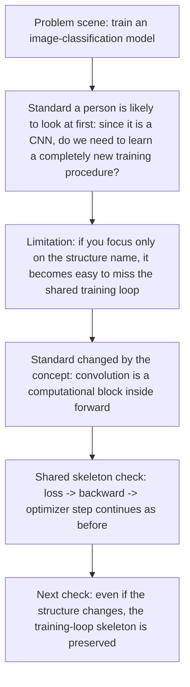
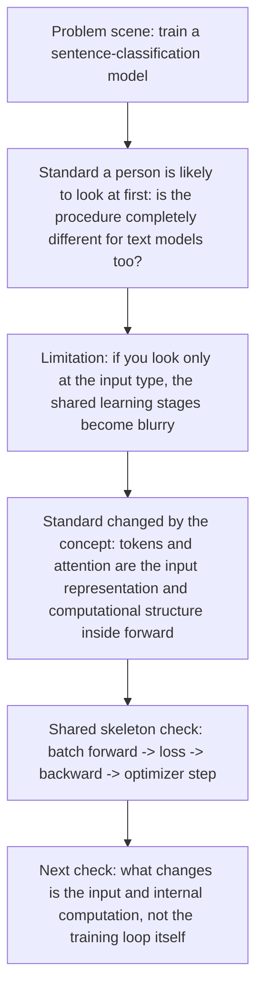

# P5-6.1 The Four Steps of the Training Loop

> Section ID: `P5-6.1`
> Version: `v2026.07.23`

In Chapter P5-5, we saw how deep-learning models compute gradients through loss, backpropagation, and the computation graph. Once we reach this point, the next question remains naturally.

If the gradient has been computed, then in what order does the model actually change during training?

The core four stages of a deep-learning training loop are `forward -> loss -> backward -> optimizer step`. It is safer to hold onto these four stages first as one shared repetition.

If the places of loss, backpropagation, update, and mode switching start to blur together again inside the training loop, go back together to the [training](/AiBook/reference/concept-glossary/#training), [backpropagation](/AiBook/reference/concept-glossary/#backpropagation), and [optimizer](/AiBook/reference/concept-glossary/#optimizer) entries in the concept glossary.

## The Question Of One Turn Through The Training Loop

- How do the loss and backpropagation we have seen so far connect inside one training loop?
- Where does the optimizer step attach after gradient computation?
- How does batch repetition tie these four stages into an actual training procedure?

Here, we first hold only the shared skeleton of a single training loop. The viewpoint that gradients continue into optimizer updates is placed on top of the flow we already saw in P5-5.1 and P5-5.2. In this section, we first close only how `forward -> loss -> backward -> optimizer step` and batch repetition are read as one bundle.

At the same time, it is also clear which questions we will not widen immediately in this section. Why step, batch, and epoch are needed continues in the next section, P5-6.2. The difference between learning and inference is explained again in P5-6.3. The difference between training mode and evaluation mode is explained again in P5-6.4. In other words, this section is the place to hold `the order of the training loop`, and the next sections are the place to separate `in what units that loop is repeated` and `when and in what mode it runs`.

## Standards For Forward-Loss-Backward-Step

- You can explain the deep-learning training loop at once.
- You can state the order of forward, loss, backward, and optimizer step.
- You can explain why batch repetition has to be read together with the `core four stages`.
- You can read the structure explanations in later chapters from the viewpoint of `a structure that can be trained`.

## The Smallest Training Loop

When we train a deep-learning model, the following order is usually repeated.

1. Put in the input and compute the output values.
2. Compute the difference between output and answer as loss.
3. Send backward the effect that the loss had on each weight.
4. Let the optimizer update the weights based on that effect.
5. Repeat this process for many batches.

These five steps are the smallest skeleton that actually connects the contents we had looked at separately in the earlier part of Part 5.

It becomes less confusing if we separate the level of terms once here.

| Category | What to hold first in this section |
| --- | --- |
| Core computational stages | `forward -> loss -> backward -> optimizer step` |
| Repetition unit | The fact that these four stages are performed again for each batch |

In other words, `forward`, `loss`, `backward`, and `optimizer step` are the names of the computational stages that connect directly inside one training step, and `batch` is the operational unit that shows how those four stages are repeated in actual training.

But from a beginner's point of view, merely listing the English names may still not become intuitive at a glance. In this book, it is safer to unpack each stage like this.

| Stage name | Plain expression to hold first in this book | Meaning in this section now |
| --- | --- | --- |
| forward | the stage of putting in the input and computing the model's current output | `make a prediction with the current parameters` |
| loss | the stage of summarizing the difference between output and target as a number | `turn how far it is off into a score` |
| backward | the stage of computing how that difference returns as responsibility to each parameter | `compute the gradients for where to fix and in what direction` |
| optimizer step | the stage of actually changing the parameters based on the computed gradients | `update the numbers inside the model once` |

This connection is needed because all four stages look like `computation`, but the roles they play inside the book are slightly different. `forward` is the computation that makes a result, `loss` is the computation that evaluates that result, `backward` is the computation that sends responsibility back, and `optimizer step` is the computation that actually changes the model. Even inside the same loop, they should be read as the different roles of `making the output`, `reading the error`, `sending responsibility back`, and `updating values`.

So in this section, rather than memorizing the English names themselves, it is safer to hold first onto the following single sentence.

`A training loop is a repetition that makes a prediction, reads the error, sends responsibility back, and changes the model values once.`

## The Boundary To Fix First In This Section

In P5-6.1, we first fix only the core four stages: `make a prediction -> score the error -> send responsibility back -> update the values`. The repetition units of step, batch, and epoch are read again in P5-6.2. The difference between learning and inference is read again in P5-6.3. The difference between training mode and evaluation mode is read again in P5-6.4. Regularization also reconnects in a later chapter.

In other words, the role of this section is to hold first `the skeleton of the training loop`. Rather than widening immediately to the names of more techniques here, it is safer to first fix the common order of repetition that remains no matter what structure arrives later.

## If We Draw It Very Simply

```mermaid
--8<-- "assets/part-05/chapter-06/training-loop-regularization-flow-en.mmd"
```

The key point of this diagram is that it first shows the smallest training skeleton where `the core four computational stages` are repeated for each batch.

One more standard to emphasize here is not mixing up `what connects immediately inside one training step` and `what makes that step repeat many times`.

| Question | Answer to recall first |
| --- | --- |
| What is the order that connects directly inside one step? | `forward -> loss -> backward -> optimizer step` |
| What operational unit makes this order repeat many times? | batch |
| At what moment do the actual model values change? | They change once at `optimizer step` |

If we remember these three sentences separately, then even when phrases like `the loss was computed`, `the gradient was computed`, and `the batch was run` appear together in the same paragraph, it becomes less confusing which is a computational stage and which is a repetition unit.

## Cases And Examples

### Case 1. Image-Classification Training

The flow of putting in images, computing classification scores, computing loss, then updating weights through backpropagation and the optimizer step stays the same in CNNs too. People often feel that if the structure changes to something like a CNN, then the learning method must also change completely. But if the standard a person first used was only `did a new structure name appear?`, then the more important standard is `does that structure enter as a computational block inside forward, while backward and update continue as before?` In other words, what changes is the internal computational block such as convolution, not the skeleton `forward -> loss -> backward -> update` itself. So the result to confirm in this case is not whether you memorized the name CNN, but whether you can explain that the shared skeleton of the training loop is preserved even when convolution appears.



### Case 2. Sentence-Classification Training

Even if the input is changed to text and the structure is changed to an RNN or Transformer, the loop of loss computation, backward, and optimizer step remains the same. People often feel that once it becomes a text model, a completely different procedure will be used. But if the simple distinction a person was making stays only at the level of dividing `image model` and `text model` by input type, then even when token length, embeddings, and attention are added, it becomes easy to miss the shared training skeleton that remains common. What actually changes is the input structure and the internal computation. The flow of sending one batch through forward, computing the loss, and then sending the gradient back for update stays the same. So the result to confirm in this case is whether, even when the model type changes, you can separate `what is the change in input representation` from `what is the common learning stage`.



### Case 3. Reading Structural Change And The Shared Loop Together

| Standard a person is likely to look at first | Standard reread from the viewpoint of the training loop |
| --- | --- |
| When a new structure name appears, such as CNN, RNN, or Transformer, it is easy to feel that the learning procedure also changes completely | What changes is the internal computational block, but the shared repetition `forward -> loss -> backward -> optimizer step` remains as it is |
| It is easy to feel that image models and text models must also learn in completely different ways | Even if the input representation and internal structure change, the skeleton of batch-level forward, loss, backward, and update remains common |

The result to confirm at the end of these cases is clear. The core of the training loop is not `do you know many new structure names?` It is whether you can explain that the common repetition stays the same no matter what structure appears, and how `prediction -> error -> gradient -> update` continues inside that repetition.

## Practice And Example

The goal of this example is not to handle a real deep-learning framework, but to confirm how `forward -> loss -> backward -> optimizer step` repeats one operational batch at a time inside the training loop.

Input:

- two batches, each containing two alarm values
- the target block scores of each batch
- one risk weight `risk_weight`

Output:

- the list of predicted block scores for each batch
- the average loss for each batch
- the average gradient for each batch
- the updated risk weight after the step

Problem scene:

- in batch training, gradients are computed not for a single sample but for a group, so it is important to look at the average batch loss and average batch gradient together

Concepts to confirm:

- a batch-level gradient is the result of collecting the errors of many samples
- the structure of averaging sample-by-sample computation first and then updating once is the basic form of the training loop

Input:

Assume that each batch contains two `alarm_count` values and their corresponding two `target_block_score` values. The training loop first computes all predicted block scores inside the batch using the current `risk_weight`, then collects the average loss and average gradient and updates once.

Before looking at the code, it is helpful to predict what is computed first in each batch and what changes only once at the end. That fixes the order of the training loop more firmly.

| Comparison item | Output to predict first | Why that is the expected result |
| --- | --- | --- |
| `predictions` | They will probably be computed first for each sample inside the batch | In the forward stage, the current `risk_weight` first produces the predicted block score for each input. |
| `batch_loss`, `batch_gradient` | They will probably be collected once as an average after the sample-level computations | Because loss and gradient have to be read by grouping the results of many samples inside the batch. |
| `updated_risk_weight` | It will probably change only once per batch | The optimizer step is applied once after the average batch gradient, not immediately for each sample. |
| `predictions` of the second batch | They will probably reflect the `risk_weight` updated in the first batch | The training loop is a repetition structure where the next batch's forward pass inherits the result of the previous update. |

The purpose of this table is not to memorize the exact numbers in advance. It is to hold before the code `what is a sample-level forward result`, `what is collected as a batch average`, and `what changes once at the end of the step`.

```python
# This example averages per-sample predictions and gradients within each batch before updating risk_weight once.
batches = [
    [
        {"alarm_count": 1.0, "target_block_score": 2.0},
        {"alarm_count": 2.0, "target_block_score": 4.0},
    ],
    [
        {"alarm_count": 3.0, "target_block_score": 6.0},
        {"alarm_count": 4.0, "target_block_score": 8.0},
    ],
]

risk_weight = 0.5
learning_rate = 0.1

for step, batch in enumerate(batches, start=1):
    predictions = []
    losses = []
    gradients = []

    for sample in batch:
        alarm_count = sample["alarm_count"]
        target_block_score = sample["target_block_score"]

        prediction = risk_weight * alarm_count
        loss = (prediction - target_block_score) ** 2
        gradient_risk_weight = 2 * (prediction - target_block_score) * alarm_count

        predictions.append(round(prediction, 3))
        losses.append(loss)
        gradients.append(gradient_risk_weight)

    batch_loss = sum(losses) / len(losses)
    batch_gradient = sum(gradients) / len(gradients)

    risk_weight = risk_weight - learning_rate * batch_gradient

    print(f"[batch {step}]")
    print("predictions =", predictions)
    print("batch_loss =", round(batch_loss, 3))
    print("batch_gradient =", round(batch_gradient, 3))
    print("updated_risk_weight =", round(risk_weight, 3))
    print("---")
```

In the output, look at the order that predictions are computed first for each batch, then the average loss and average gradient are collected, and then `updated_risk_weight` changes once.

```text
[batch 1]
predictions = [0.5, 1.0]
batch_loss = 5.625
batch_gradient = -7.5
updated_risk_weight = 1.25
---
[batch 2]
predictions = [3.75, 5.0]
batch_loss = 7.031
batch_gradient = -18.75
updated_risk_weight = 3.125
---
```

The key points in this example are the following.

- deep-learning training is not one computation, but a loop repeated for each batch
- in each batch, forward, loss, backward, and optimizer step appear again in the same order
- the explanation of structure and the explanation of learning have to meet again inside this loop

If we separate this flow again by the example outputs, the forward result appears first. The first batch makes predictions with `risk_weight=0.5`, so the predictions come out lower than the target. The second batch predicts again with `risk_weight=1.25` after the first update.


The next output is the average batch loss. Because loss is the value that bundles the sample-level errors inside each batch into an average, what the optimizer sees immediately is not one individual sample but the average signal made by the batch.


The next output is the average batch gradient. The fact that both values are negative means that the current `risk_weight` is producing predictions below the target, so the update continues in the direction of increasing `risk_weight`.


The last output is `risk_weight` after the optimizer step. This graph shows that the training loop is not a procedure that computes outputs once and ends. It is a repetition structure that changes the forward condition of the next batch itself through the average batch gradient.


If we fold this example once more briefly, then the roles inside the batch and outside the batch can be separated as follows.

| Section of the loop | What actually happens | Why this section is needed |
| --- | --- | --- |
| Inside the batch | Compute each sample's prediction, loss, and gradient | Because we first have to gather where the sample-level errors arise |
| End of the batch | Bundle the sample-level losses and gradients into averages | Because we need one shared signal to use for one update |
| End of the step | Update `risk_weight` once | Because the next batch's forward pass must inherit the previous result |

In other words, forward and loss first unfold at the sample level, the backward result is then collected into an average batch signal, and at optimizer step the model value changes once. Once this order is fixed, when you look at a training loop you can distinguish between `the sections where computation happens many times` and `the section where the model actually changes`.

Before moving directly to the next section, it is helpful to split one more time the `shared training procedure` and `the structures that will differ later`. That keeps the reading axis from mixing together.

| What to fix in this section now | What will differ in the later structure chapters | Why split them now |
| --- | --- | --- |
| The shared loop `forward -> loss -> backward -> optimizer step` | CNN's reading of local patterns, RNN's sequential state, attention's selective reference, Transformer's parallel blocks | So that even when new names appear later, we can separate `did the learning procedure change?` from `did the internal computational structure change?` |

## When Do We Read The Training Loop Again As One Bundle

The time to bring out this section is when loss, backpropagation, optimizer, mode, and regularization are each understood separately, but they still do not yet look like one repeated structure.

| Problem scene that appears first | Why the training-loop summary is useful first | Where it leads next immediately |
| --- | --- | --- |
| You know the concepts, but the order keeps getting mixed up | It lets us fix again the shared skeleton of forward, loss, backward, and update | It continues to the distinction among step, batch, and epoch in P5-6.2 |
| Before moving to the structure chapters, you want to reconfirm the shared learning skeleton | It lets us organize that CNNs, RNNs, and Transformers are all trained inside the same loop | It continues to P5-6.2, P5-6.3, P5-6.4, and then the later structure chapters |
| You start to blame every problem only on the structure | It lets us reset the baseline that separates learning-procedure issues from internal-structure issues | It continues into later structure comparison and debugging reading |

## Checklist

- Can you explain the training loop `forward -> loss -> backward -> optimizer step` at once?
- Can you explain that a deep-learning training loop is the repetition of forward, loss, backward, and optimizer step?
- When you know the concepts but the order keeps getting mixed up, can you first recall the shared learning loop of forward -> loss -> backward -> update?
- When looking at later CNN, RNN, and Transformer chapters, can you say that `the shared learning procedure` and `the internal structure that changes` should be read separately?
- Do you know that after this section, the flow goes on to reread the distinction between learning and inference, and the difference in modes, in the later sections?

## Sources And Further Reading

- Ian Goodfellow, Yoshua Bengio, Aaron Courville, `Deep Learning`, MIT Press, 2016, accessed 2026-06-29. [https://www.deeplearningbook.org/](https://www.deeplearningbook.org/){: target="_blank" rel="noopener noreferrer" }
- Aurélien Géron, `Hands-On Machine Learning with Scikit-Learn, Keras, and TensorFlow`, 3rd ed., O'Reilly, 2022, accessed 2026-07-19. [https://www.oreilly.com/library/view/hands-on-machine-learning/9781098125967/](https://www.oreilly.com/library/view/hands-on-machine-learning/9781098125967/){: target="_blank" rel="noopener noreferrer" }
