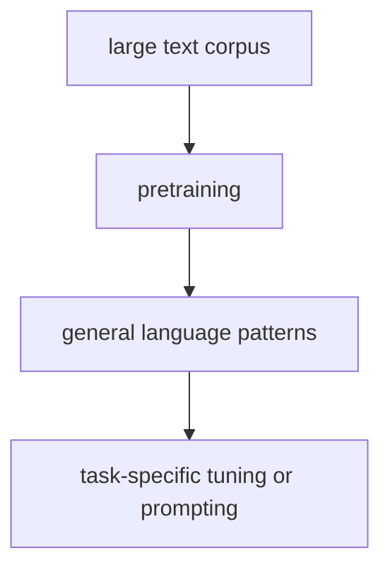

# P5-6.1 사전학습(pretraining)

P5-4.2에서는 대화형 LLM이 단순 자동완성 모델 위에 지시 따르기, 안전 조정, 인터페이스 층이 더해진 사용자 경험이라는 점을 보았습니다. 그러면 이제 더 근본적인 질문으로 돌아가야 합니다.

그렇다면 이런 모델은 도대체 먼저 무엇을 배우는가?

이 절은 그 질문에 답합니다.

사전학습(pretraining)은 모델이 특정 한 과업에 들어가기 전에, 대규모 텍스트에서 일반적인 언어 패턴과 표현을 먼저 배우는 단계다.

같은 말을 더 생활 언어로 바꾸면 다음과 같습니다.

사전학습은 바로 실무 문제를 푸는 단계가 아니라, 먼저 언어의 기본 감각을 넓게 익히는 준비 단계다.

## 이 절의 범위

이 절은 다음 질문에 답합니다.

- 사전학습은 무엇을 배우는 단계인가?
- 왜 먼저 큰 텍스트에서 배우고, 나중에 목적에 맞게 조정하는가?
- 사전학습과 파인튜닝(fine-tuning), 지시 튜닝(instruction tuning)은 어떻게 구분하는가?

이 절에서는 다음 내용을 깊게 다루지 않습니다.

- 손실 함수 수식
- 분산 학습 인프라 세부
- RLHF나 preference optimization의 세부 절차

사전학습 목표 자체는 여기서 잡고, 규모와 계산 제약은 바로 다음 P5-6.2 데이터와 스케일에서 다시 이어집니다. 지시 튜닝과 후속 정렬 조정은 P5-8.1 지시 튜닝과 P5-8.2 정렬의 기본 문제에서 다시 회수하며, 분산 학습 인프라의 구현 세부는 현재 본편 범위 밖으로 둡니다.

이 절의 목적은 사전학습을 `지식을 통째로 저장하는 마법 같은 과정`으로 오해하지 않게 하고, LLM이 왜 먼저 대규모 일반 패턴을 배우는지 설명하는 데 있습니다.

## 이 절의 목표

- 사전학습을 입문 수준에서 설명할 수 있습니다.
- 사전학습과 파인튜닝, 지시 튜닝의 차이를 말할 수 있습니다.
- 사전학습이 왜 다양한 과업 전이(transfer)의 기반이 되는지 설명할 수 있습니다.
- 다음 절의 `데이터와 스케일` 문제로 자연스럽게 넘어갈 수 있습니다.

## 사전학습은 무엇을 배우는 단계인가

사전학습은 모델이 어떤 회사의 내부 업무 하나나, 특정 시험 문제 하나만 먼저 배우는 단계가 아닙니다. 더 넓은 텍스트 패턴을 먼저 배우는 단계입니다.

여기서 먼저 다음 세 질문으로 읽으면 좋습니다.

| 질문 | 짧은 답 |
| --- | --- |
| 모델은 이 단계에서 무엇을 배우는가? | 문장과 표현이 이어지는 일반 패턴 |
| 아직 배우지 않는 것은 무엇인가? | 특정 회사 정책, 특정 과업 규칙 |
| 왜 이 단계를 먼저 거치는가? | 나중에 여러 과업에 공통으로 쓸 기반을 만들기 위해 |

예를 들어 모델은 다음과 같은 것을 간접적으로 익힐 수 있습니다.

- 어떤 단어와 표현이 자주 함께 나타나는가
- 문장이 보통 어떤 구조로 이어지는가
- 질문, 설명, 비교, 요약 같은 형식이 어떻게 나타나는가
- 특정 맥락에서 어떤 토큰이 더 자연스럽게 뒤따르는가

즉, 사전학습은 `언어 사용의 큰 통계적 구조`를 먼저 익히는 과정으로 보는 편이 안전합니다.

## 왜 먼저 크게 배우고 나중에 조정하나

이 질문을 먼저 잡아야 `처음부터 작은 과업 모델을 만드는 일`과 `넓게 배운 뒤 목적에 맞게 좁히는 일`의 차이를 구분할 수 있습니다.

왜 바로 고객센터 분류 모델만 만들지 않고, 왜 먼저 큰 일반 모델을 학습할까요?

이유는 간단합니다.

- 일반 패턴을 먼저 배우면
- 이후 작은 데이터로도
- 여러 과업에 더 잘 적응할 수 있기 때문입니다

다음처럼 이해하면 좋습니다.

`사전학습은 범용 언어 감각을 먼저 만들고, 이후 세부 과업 조정은 그 위에 얹는 방식이다.`

이것은 Part 3에서 배운 전이(transfer)와 일반화(generalization) 관점과도 연결됩니다.

다시 말해, 사전학습은 `문제를 바로 푸는 단계`보다 `문제를 풀 수 있는 바탕을 먼저 만드는 단계`에 가깝습니다.

예를 들어 고객센터 분류를 만들더라도, 모델이 먼저 문장 구조와 표현 차이를 넓게 익혀 두면 이후 `환불`, `교환`, `계정 문제` 같은 더 좁은 분류 규칙에 적응시키기 쉬워집니다.

## 사전학습, 파인튜닝, 지시 튜닝은 어떻게 다른가

이 세 표현은 자주 함께 나오지만 같은 말이 아닙니다.

| 구분 | 핵심 질문 |
| --- | --- |
| 사전학습(pretraining) | 일반적인 언어 패턴을 먼저 배우는가? |
| 파인튜닝(fine-tuning) | 특정 과업 데이터에 맞게 가중치를 더 조정하는가? |
| 지시 튜닝(instruction tuning) | 사용자의 자연어 지시를 더 잘 따르도록 조정하는가? |

이 차이를 구분하지 않으면, 사용자는 `모델이 원래부터 다 알았다`거나 `프롬프트만 잘 쓰면 학습과 같은 효과가 난다`고 오해하기 쉽습니다.

다음 한 줄 비교로 먼저 잡아도 충분합니다.

- 사전학습: 넓게 배운다
- 파인튜닝: 목적에 맞게 좁힌다
- 지시 튜닝: 사람의 요청 형식에 더 잘 반응하게 만든다

## 사전학습은 사실 저장과 같은 말이 아니다

이 지점을 먼저 분리해야 `패턴을 넓게 익히는 일`과 `사실을 완전히 저장해 두는 일`을 같은 것으로 오해하지 않게 됩니다.

사전학습을 다음처럼 설명하면 위험합니다.

> 모델이 세상의 사실을 다 외운다.

더 안전한 설명은 다음입니다.

> 모델은 대규모 텍스트에서 패턴과 표현을 학습한다.
> 그 결과 그럴듯한 문장과 구조를 잘 만들 수 있지만,
> 항상 사실 검증이 끝난 지식을 보장하는 것은 아니다.

즉, 사전학습은:

- 언어 패턴 학습
- 표현 학습
- 다음 토큰 예측 구조 학습

에 가깝고, `진실 보증 시스템`과는 다릅니다.

## 사전학습은 왜 여러 과업에 연결되나

사전학습된 모델은 일반적인 언어 패턴을 이미 알고 있기 때문에, 그 위에 작은 조정을 더하면 다양한 과업으로 연결되기 쉽습니다.

예를 들어:

- 요약
- 분류
- 질의응답
- 정보 추출
- 번역

같은 작업이 완전히 다른 모델로 각각 시작되지 않고, 하나의 큰 기반 모델 위에서 이어질 수 있습니다.

이것이 LLM 시대의 중요한 전환입니다.

## 아주 단순하게 그리면



이 도식은 사전학습이 끝이 아니라, 이후 여러 사용 방식의 출발점이라는 점을 정리한 것입니다. 그래서 이 도식에서 확인해야 할 결과는 큰 텍스트에서 넓은 기반을 만든 뒤, 이후 단계가 그 기반을 목적별로 조정하는 흐름으로 실제로 나뉘어 읽히는가입니다.

이 그림에서 가장 중요한 읽는 법은 다음입니다.

- 큰 텍스트는 `재료`
- 사전학습은 `넓은 기반 만들기`
- 이후 단계는 `그 기반을 목적에 맞게 쓰는 조정`

## 사례로 보기

### 사례 1. 문서 요약

긴 회의록을 요약하는 모델을 처음부터 바로 만들려고 한다고 해 봅시다. 사람이 이 문제를 보면 보통 `요약 예시 몇천 개만 있으면 되지 않을까`라고 먼저 생각할 수 있습니다. 그런데 데이터가 그 정도에 그치면, 모델은 요약 전에 먼저 문장 구조와 정보 배열 방식부터 같이 배워야 해서 출발 자체가 무거워집니다. 사전학습된 모델은 이미 넓은 텍스트에서 문장 패턴과 압축 형태를 어느 정도 익힌 상태로 시작합니다. 그래서 같은 요약 과업이라도 `언어 자체를 새로 배우는 단계`를 줄이고, 요약 목적 조정에 더 빨리 들어갈 수 있습니다. 즉, 사람이 보기에는 둘 다 요약 모델이지만, 사전학습 유무에 따라 실제 출발점이 크게 다릅니다. 그래서 독자가 확인해야 할 결과는 적은 요약 데이터로도 핵심 문장 압축과 문장 연결이 더 빨리 안정되는가입니다.

### 사례 2. 고객 문의 분류

고객 문의를 `환불`, `배송`, `계정`으로 분류한다고 해 봅시다. 사람이 가진 라벨 데이터가 많지 않으면, 처음에는 `라벨만 붙이면 바로 분류기를 만들 수 있지 않을까`라고 생각하기 쉽습니다. 하지만 처음부터 새 모델을 학습할 때는 문장 표현 자체를 배우는 데도 데이터가 부족할 수 있습니다. 예를 들어 `결제 취소했는데 언제 반영되나요`와 `취소 처리 상태를 확인하고 싶어요`는 같은 흐름인데 표면 문장이 다를 수 있습니다. 사전학습된 표현 위에서 파인튜닝을 하면, 모델은 이미 비슷한 문장 구조와 단어 관계를 어느 정도 읽을 수 있는 상태입니다. 그래서 적은 라벨 데이터로도 `이 문장이 어느 업무 흐름에 가까운가`를 더 빨리 맞추기 쉬워집니다. 그래서 확인 가능한 결과는 직접 같은 단어가 없더라도 비슷한 문의가 같은 처리 큐로 더 안정적으로 모이는가입니다.

### 사례 3. 대화형 응답

대화형 LLM이 자연스럽게 답하는 모습을 보면 처음부터 대화만 배우는 것처럼 느껴질 수 있습니다. 하지만 사람이 먼저 생각해야 할 것은, 이런 응답도 문장 연결과 일반 언어 패턴을 배운 기반 위에 올라간다는 점입니다. 예를 들어 `간단히 설명해 줘`, `단계별로 정리해 줘`, `주의점도 붙여 줘` 같은 요구에 반응하려면, 대화 형식 이전에 문장 구조와 설명 방식 자체를 넓게 알고 있어야 합니다. 사전학습이 없다면 모델은 질문과 답변 형식뿐 아니라 언어의 기본 흐름 자체도 동시에 익혀야 합니다. 실제 대화형 조정은 보통 이 넓은 언어 기반 위에 추가 지시 따르기와 응답 형식 조정을 얹는 방식으로 붙습니다. 즉, 사용자가 체감하는 `대화 품질`은 마지막 조정만의 결과가 아니라 그 아래 넓은 언어 기반의 결과이기도 합니다. 그래서 독자가 확인해야 할 결과는 말투 조정 이전에도 설명 문장 연결과 기본 응답 구조가 어느 정도 자연스럽게 유지되는가입니다.

세 사례를 한 줄로 다시 묶으면 다음과 같습니다.

| 상황 | 사전학습이 먼저 필요한 이유 |
| --- | --- |
| 요약 | 문장 압축과 정보 배열의 일반 패턴을 먼저 익히기 위해 |
| 분류 | 입력 문장의 표현 차이를 먼저 넓게 다뤄 보기 위해 |
| 대화 | 질문과 응답의 기본 언어 흐름을 먼저 배우기 위해 |

## 작은 Python 예제로 보기

이번 예제의 목표는 실제 사전학습을 구현하는 것이 아니라, `큰 일반 데이터`와 `작은 목표 데이터`의 단계 차이를 감각적으로 보는 것입니다.

입력:

- 일반 텍스트 데이터 수
- 과업용 라벨 데이터 수

출력:

- 두 단계의 역할 구분

```python
pretraining_tokens = 1_000_000
task_examples = 2_000

print("pretraining_tokens =", pretraining_tokens)
print("task_examples =", task_examples)
print("role_of_pretraining = general pattern learning")
print("role_of_task_tuning = task-specific adjustment")
```

실행 결과 예시는 다음처럼 읽을 수 있습니다.

```text
pretraining_tokens = 1000000
task_examples = 2000
role_of_pretraining = general pattern learning
role_of_task_tuning = task-specific adjustment
```

그래서 이 예제에서 확인해야 할 결과는 숫자 크기 자체보다 사전학습 단계와 과업 조정 단계가 실제로 서로 다른 역할을 가진다는 점입니다.

이 예제에서 여기서 읽어야 할 핵심은 숫자의 크기 자체보다 `두 단계의 역할 차이`입니다.

- `pretraining_tokens`는 넓은 기반을 만드는 쪽을 가리킵니다.
- `task_examples`는 그 기반을 특정 목적에 맞게 다듬는 쪽을 가리킵니다.
- 따라서 사전학습과 이후 조정은 같은 학습이라도 `범위`와 `목적`이 다릅니다.

## 이 예제를 학습 단계 분리 관점으로 다시 보면

이 예제는 `많이 학습했다`는 한 문장으로 사전학습과 후속 조정을 뭉뚱그리면 안 된다는 점을 다시 보여 줍니다. 이후 파인튜닝, instruction tuning, alignment를 읽을 때도 먼저 `기반 능력을 넓게 만든 단계`와 `반응 방식을 목적에 맞춘 단계`를 구분해 보는 습관이 필요합니다.

## 역사와 커리큘럼 관점

사전학습은 LLM 시대를 설명하는 핵심 전환입니다. 이전에도 언어 모델과 표현 학습은 있었지만, 대규모 텍스트에서 먼저 일반 패턴을 학습하고 나중에 다양한 과업으로 연결하는 방식이 중심이 되면서 모델 사용 방식 자체가 바뀌었습니다.

여기서는 이 역사 설명을 다음처럼 읽으면 됩니다.

`예전에는 과업마다 별도 모델을 떠올리기 쉬웠다면, LLM 시대에는 먼저 큰 기반 모델을 만들고 그 위에 여러 과업을 얹는 관점이 더 중요해졌다.`

커리큘럼 관점에서 이 절이 중요한 이유는 다음과 같습니다.

- GPT와 BERT를 단지 구조 차이로만 보지 않고
- 그 공통 기반인 사전학습 관점을 잡게 하며
- 이후 fine-tuning, instruction tuning, prompt, alignment 설명을 한 줄로 묶어 주기 때문입니다

## 다음 절과의 연결

여기까지 오면 다음 질문이 남습니다.

- 사전학습이 중요하다면, 얼마나 큰 데이터와 얼마나 큰 모델이 영향을 주는가?
- `스케일(scale)`이라는 말은 왜 그렇게 자주 등장하는가?

이 질문은 P5-6.2 데이터와 스케일로 이어집니다.

## 이 절에서 기억할 관점

- 사전학습은 대규모 텍스트에서 일반 언어 패턴과 표현을 먼저 배우는 단계입니다.
- 파인튜닝과 지시 튜닝은 그 위에 추가되는 조정 단계입니다.
- 사전학습을 읽을 때는 `사실을 언제나 보장하는 단계`가 아니라, 다양한 문맥 패턴을 먼저 익혀 이후 과업 전이에 필요한 일반화 기반을 만드는 단계로 봐야 합니다.
- 이 절은 다음 절의 스케일 논의와 이후 장의 instruction tuning 설명을 위한 기반입니다.

## 체크리스트

- 사전학습을 입문 수준에서 설명할 수 있는가?
- 사전학습과 파인튜닝, 지시 튜닝의 차이를 말할 수 있는가?
- 사전학습이 왜 다양한 과업 전이의 기반이 되는지 설명할 수 있는가?
- 왜 사전학습을 `사실 저장`으로 바로 읽으면 안 되는지 말할 수 있는가?

## 출처와 참고 자료

- Alec Radford et al., `Improving Language Understanding by Generative Pre-Training`, OpenAI, 2018, 확인 날짜: 2026-06-29.
- Jeremy Howard, Sebastian Ruder, `Universal Language Model Fine-tuning for Text Classification`, arXiv, 2018, 확인 날짜: 2026-06-29.
- Tom B. Brown et al., `Language Models are Few-Shot Learners`, arXiv, 2020, 확인 날짜: 2026-06-29.
- Daniel Jurafsky, James H. Martin, `Speech and Language Processing` draft materials, 확인 날짜: 2026-06-29.
