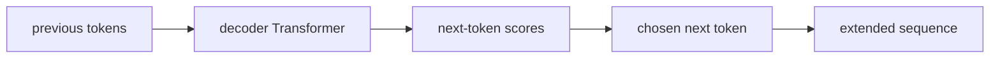

# P5-6.1 GPT 계열의 위치

P5-5장에서는 BERT 계열이 입력 전체를 읽어 표현을 만들고, 분류, 검색, 임베딩 같은 이해 중심 태스크와 잘 맞는 흐름이라는 점을 보았습니다. 그러면 자연스럽게 반대쪽 질문이 생깁니다.

계속 이어서 생성하는 모델은 Transformer 계열 안에서 어디에 놓이는가?

이 절은 그 질문에 답합니다.

GPT 계열은 Transformer의 디코더(decoder)를 중심으로 이전 토큰 문맥을 보고 다음 토큰을 예측하며, 이 반복을 통해 긴 텍스트를 생성하는 흐름이다.

## 이 절의 범위

이 절은 다음 질문에 답합니다.

- GPT 계열은 Transformer 안에서 어떤 위치를 가지는가?
- 왜 GPT는 `계속 이어서 생성하는 모델`처럼 보이는가?
- BERT 계열과 비교하면 무엇이 가장 크게 다른가?

이 절은 다음 내용은 깊게 다루지 않습니다.

- GPT-1, GPT-2, GPT-3, GPT-4 계열의 세부 버전 비교
- RLHF와 instruction tuning의 상세 절차
- 최신 상용 모델별 구현 차이

GPT의 생성 구조는 여기서 잡고, 사전학습의 역할은 P5-7.1, 다음 토큰 예측은 P5-8.1, 지시 튜닝과 정렬 문제는 P5-10.1과 P5-10.2에서 다시 회수합니다. 개별 상용 모델 버전사와 제품별 구현 차이는 현재 본편 범위 밖으로 둡니다.

이 절의 목적은 GPT를 단지 유명한 제품 이름으로 읽지 않고, `디코더 기반 생성 모델`이라는 구조적 위치에서 이해하게 하는 데 있습니다.

## 이 절의 목표

- GPT 계열을 decoder 중심 Transformer 흐름으로 설명할 수 있습니다.
- GPT가 왜 다음 토큰 예측(next-token prediction)과 직접 연결되는지 말할 수 있습니다.
- BERT와 GPT의 차이를 `문장 전체 읽기` 대 `순차 생성` 관점으로 설명할 수 있습니다.
- 다음 절의 대화형 LLM 사용자 경험으로 자연스럽게 넘어갈 수 있습니다.

## GPT는 무엇의 약자인가

GPT는 `Generative Pre-Trained Transformer`의 약자입니다. 이름 안에 이미 세 가지 핵심이 들어 있습니다.

- Generative
- Pre-Trained
- Transformer

즉:

- 생성(generation)을 목표로 하고
- 먼저 큰 데이터에서 사전학습(pretraining)하며
- Transformer 구조를 사용한다

는 뜻입니다.

## 왜 GPT는 `생성 모델`처럼 읽히나

GPT 계열은 보통 이전 토큰들을 보고 다음 토큰을 예측하는 autoregressive language model 흐름으로 설명합니다.

예를 들어 입력이 다음과 같다고 해 봅시다.

> 오늘 회의는 오후

모델은 여기서 다음 후보를 예측합니다.

- `세`
- `두`
- `한`

그리고 하나를 고른 뒤, 그 새 토큰까지 포함해서 다시 다음 토큰을 예측합니다.

즉, GPT 계열의 핵심 감각은 다음과 같습니다.

`한 번에 완성 문장을 꺼내는 것이 아니라, 다음 토큰을 계속 이어서 예측하며 출력을 만든다.`

## 왜 디코더(decoder) 중심이라고 하나

Part 5 앞부분에서 본 것처럼 Transformer는 encoder, decoder, encoder-decoder 구조로 나뉘어 읽을 수 있습니다.

GPT 계열은 이 중 decoder 중심 흐름으로 보는 것이 안전합니다.

이 구조의 핵심은:

- 이전까지의 문맥을 보고
- 현재 위치에서 다음 토큰을 생성할 수 있도록
- 생성 방향에 맞는 attention 제약을 둔다는 점입니다

다음처럼 이해하면 충분합니다.

`GPT는 문장 전체를 한 번에 다 읽고 판단하는 모델이라기보다, 앞에서 쓴 것을 바탕으로 뒤를 계속 이어 쓰는 모델이다.`

## BERT와 비교하면 무엇이 다르나

다시 정리하면:

| 구분 | BERT 계열 | GPT 계열 |
| --- | --- | --- |
| 중심 구조 | encoder | decoder |
| 기본 감각 | 입력 전체 문맥을 읽어 표현 생성 | 이전 토큰을 바탕으로 다음 토큰 생성 |
| 대표 사용 흐름 | 분류, 검색, 임베딩 | 생성, 대화, 요약, 초안 작성 |
| 출력 성격 | 라벨, 점수, 표현 | 새 토큰, 새 문장, 새 문단 |

이 표의 핵심은 다음입니다.

`BERT는 입력을 읽고 판단하는 쪽에, GPT는 출력을 계속 이어 만드는 쪽에 더 자연스럽다.`

## 왜 GPT 계열이 사용자 경험을 크게 바꿨나

GPT 계열은 구조적으로 생성에 잘 맞습니다. 그래서 사용자는 모델에게 자연어로 요구를 적고, 모델이 그 뒤를 이어 긴 응답을 만들어 내는 경험을 하게 됩니다.

예를 들어:

- 질문에 대한 답변 작성
- 이메일 초안 작성
- 문서 요약
- 코드 자동완성
- 역할 기반 대화

이런 경험은 모두 `다음 토큰 생성의 반복`으로 설명할 수 있습니다.

즉, GPT 계열은 기술적으로는 다음 토큰 예측 모델이지만, 사용자 입장에서는 `문장을 계속 써 주는 인터페이스`처럼 느껴집니다.

## 아주 단순하게 그리면



이 도식은 GPT 계열의 핵심을 가장 간단하게 보여 줍니다.

## 사례로 보기

### 사례 1. 자동완성

짧은 문장 시작을 주면, 그 뒤를 자연스럽게 이어 쓰는 기능은 GPT 계열의 가장 직관적인 사용 예입니다.

### 사례 2. 요약 초안 작성

긴 문서를 넣고 `세 문장으로 요약해줘`라고 하면, 모델은 요약을 한 문장씩 이어 생성합니다.

### 사례 3. 코드 생성

함수 시그니처와 설명을 주면, 모델은 구현 코드를 토큰 단위로 이어 씁니다.

## 작은 Python 예제로 보기

이번 예제의 목표는 GPT를 구현하는 것이 아니라, `이전 토큰을 보고 다음 토큰을 하나씩 이어 붙인다`는 감각을 확인하는 것입니다.

입력:

- 시작 토큰 시퀀스
- 단순한 다음 토큰 규칙

출력:

- 한 단계씩 늘어나는 시퀀스

```python
sequence = ["오늘", "회의는"]
next_tokens = ["오후", "세", "시입니다"]

print("start =", sequence)

for token in next_tokens:
    sequence.append(token)
    print("generated =", sequence)
```

실행 결과 예시는 다음처럼 읽을 수 있습니다.

```text
start = ['오늘', '회의는']
generated = ['오늘', '회의는', '오후']
generated = ['오늘', '회의는', '오후', '세']
generated = ['오늘', '회의는', '오후', '세', '시입니다']
```

이 예제는 실제 확률 계산을 하지 않지만, 다음 점을 보여 줍니다.

- 생성은 한 토큰씩 이어집니다
- 현재 출력은 이전 출력 전체를 다음 입력 문맥으로 만듭니다

## 역사와 커리큘럼 관점

GPT 계열은 Transformer decoder 기반 생성 모델이 실제 사용자 인터페이스를 바꾸는 흐름으로 이어졌다는 점에서 중요합니다.

역사적으로 중요한 지점은 다음과 같습니다.

- generative pretraining이 여러 과업으로 전이될 수 있음을 보여 주었고
- 모델 규모가 커질수록 zero-shot, few-shot 사용 경험이 강해졌으며
- 이후 instruction tuning과 대화형 인터페이스로 이어질 기반을 만들었습니다

커리큘럼 관점에서 이 절은 다음 절의 `대화형 LLM으로의 전환`을 위한 구조 설명입니다. 먼저 GPT를 생성 구조로 이해해야, 왜 사용자가 자연어로 요구를 적고 결과를 받는 경험이 가능해졌는지 설명할 수 있습니다.

## 다음 절과의 연결

여기까지 오면 다음 질문이 남습니다.

- GPT 계열의 생성 구조가 어떻게 `챗봇 같은 경험`으로 바뀌었는가?
- 단순 자동완성 모델에서 대화형 LLM 경험으로 넘어갈 때 무엇이 달라졌는가?

이 질문은 P5-6.2 대화형 LLM으로의 전환으로 이어집니다.

## 이 절에서 기억할 관점

- GPT 계열은 decoder 중심 Transformer 흐름입니다.
- 이전 토큰을 바탕으로 다음 토큰을 예측하며 출력을 이어 갑니다.
- BERT 계열과의 차이는 생성 여부보다 구조와 주요 과업 차이로 읽는 편이 안전합니다.
- 이 구조가 대화형 LLM 사용자 경험의 기반이 됩니다.

## 체크리스트

- GPT 계열의 위치를 decoder 중심 흐름으로 설명할 수 있는가?
- 왜 GPT가 다음 토큰 예측 모델과 직접 연결되는지 말할 수 있는가?
- BERT와 GPT의 차이를 구조와 과업 관점에서 설명할 수 있는가?
- 다음 절의 대화형 LLM 설명으로 왜 이어지는지 설명할 수 있는가?

## 출처와 참고 자료

- Alec Radford et al., `Improving Language Understanding by Generative Pre-Training`, OpenAI, 2018, 확인 날짜: 2026-06-29.
- Alec Radford et al., `Language Models are Unsupervised Multitask Learners`, OpenAI, 2019, 확인 날짜: 2026-06-29.
- Tom B. Brown et al., `Language Models are Few-Shot Learners`, arXiv, 2020, 확인 날짜: 2026-06-29.
- Daniel Jurafsky, James H. Martin, `Speech and Language Processing` draft materials, 확인 날짜: 2026-06-29.
