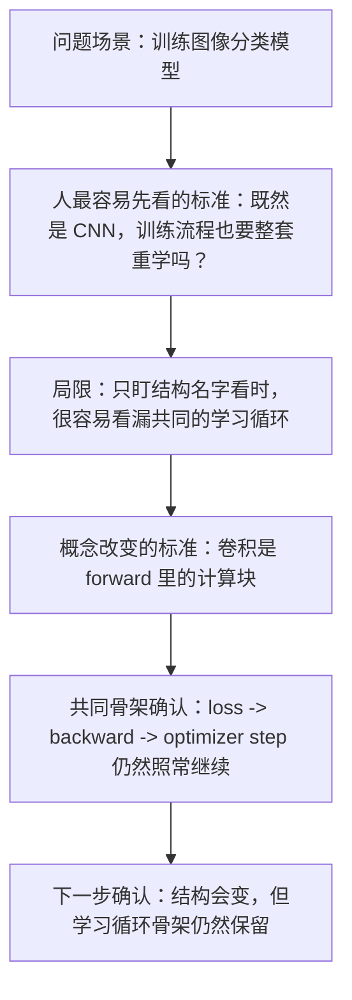
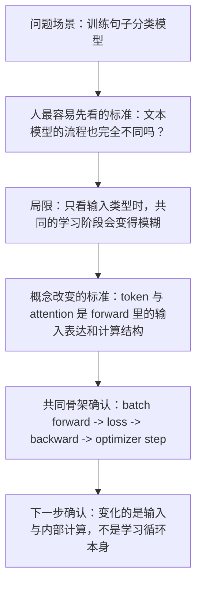

# P5-6.1 学习循环：forward、loss、backward、optimizer step

> Section ID: `P5-6.1`
> Version: `v2026.07.20`

在 P5-5 章里，我们已经看到：深度学习模型会通过损失（loss）、反向传播（backpropagation）和计算图（computation graph）来计算梯度（gradient）。走到这里以后，下一个问题会自然留下来。

如果梯度已经算出来了，那么在真正的训练过程中，模型到底按什么顺序发生变化？

深度学习学习循环的核心四个阶段是 `forward -> loss -> backward -> optimizer step`。先把这四个阶段当成一次共同重复去抓住，会更安全。

如果在学习循环里又开始把损失、反向传播、更新和模式切换混在一起，更适合回到[英文概念词汇表里的 training 条目](/AiBook/en/reference/concept-glossary/#training)、[backpropagation 条目](/AiBook/en/reference/concept-glossary/#backpropagation)、[optimizer 条目](/AiBook/en/reference/concept-glossary/#optimizer)，先重新拆开各自的计算角色。

## 学习循环转一圈的问题

- 到目前为止看到的损失与反向传播，在一个学习循环里是怎样接起来的？
- optimizer step 在梯度计算之后接在什么位置？
- batch 的重复又怎样把这四个阶段绑成真正的训练过程？

这里先只固定单个学习循环的共同骨架。梯度如何继续连到 optimizer update，本身是建立在前面 P5-5.1、P5-5.2 已经看过的流程之上的；而在这一节里，我们先只闭合 `forward -> loss -> backward -> optimizer step` 与 batch 重复怎样被读成一整组。

与此同时，这一节不会立刻扩大的问题也要说清楚。为什么需要 step、batch、epoch，会在下一节 P5-6.2 继续；learning 和 inference 的区别会在 P5-6.3 重新说明；training mode 和 evaluation mode 的区别会在 P5-6.4 再说明。也就是说，这一节是先抓住`学习循环的顺序`的位置，而紧接着的几节是区分`这个循环按什么单位重复`以及`它在什么时候、以什么方式运行`的位置。

## forward-loss-backward-step 的判断标准

- 能一次性说明深度学习的学习循环。
- 能说出 forward、loss、backward、optimizer step 的顺序。
- 能解释为什么 batch 重复必须和`核心四阶段`一起读。
- 能从`可训练的结构`视角继续读后面章节里的结构说明。

## 最小的学习循环

训练深度学习模型时，通常会重复下面这个顺序。

1. 把输入放进去，计算输出值。
2. 把输出与正确答案之间的差距计算成损失。
3. 把损失对各个权重产生的影响向后传回去。
4. 优化器根据这个影响更新权重。
5. 对很多个 batch 重复这一过程。

这五步，就是把 Part 5 前半段分别看过的内容真正接到一起的最小骨架。

如果这里先只把它读成`模型会反复计算`，还是很容易模糊掉：究竟哪一段只是在算结果，哪一段会真正推动模型往下一次学习移动。

所以这一节必须先把`一次循环里发生的顺序`固定下来，而不是先去记更多新结构名字。

如果先把术语所处的层位分开一次，会更不容易混淆。

| 区分 | 这一节先要抓住什么 |
| --- | --- |
| 核心计算阶段 | `forward -> loss -> backward -> optimizer step` |
| 重复单位 | 这四个阶段会对每个 batch 再做一次 |

也就是说，`forward`、`loss`、`backward`、`optimizer step` 是一次训练 step 内直接相连的计算阶段名称，而 `batch` 是展示这四个阶段在真实训练里怎样重复的运行单位。

但从初学者视角看，只把英文名字列出来，往往还是不会马上形成直觉。本书里更安全的做法，是先把每个阶段拆成下面这样的表述。

| 阶段名称 | 本书先抓住的表达 | 这一节里的含义 |
| --- | --- | --- |
| forward | 放入输入并计算当前模型输出的阶段 | `用当前参数做出预测` |
| loss | 把输出和目标之间的差距浓缩成数字的阶段 | `把偏差变成分数` |
| backward | 计算这种差距如何作为责任回传到各参数上的阶段 | `算出该朝哪里、以什么方向去修正的 gradient` |
| optimizer step | 根据算出的 gradient 实际修改参数的阶段 | `把模型内部数字真正更新一次` |

之所以必须这样连起来，是因为四个阶段看上去都像`计算`，但在书里承担的角色并不一样。`forward` 是产出结果的计算，`loss` 是评价结果的计算，`backward` 是把责任往回送的计算，而 `optimizer step` 是真正改变模型的计算。即使它们都在同一个循环里，也要把它们读成`做出输出`、`读取误差`、`送回责任`、`更新数值`这几种不同角色。

所以在这一节里，比起背英文名字本身，更适合先抓住下面这一句话。

`学习循环就是不断重复：做出预测、读取误差、送回责任、再把模型数值改动一次。`

## 本节先固定的边界

在 P5-6.1 里，先只固定`做出预测 -> 给误差打分 -> 把责任送回去 -> 更新数值`这四个核心阶段。step、batch、epoch 这些重复单位会在 P5-6.2 重新读取；learning 和 inference 的区别会在 P5-6.3 重新读取；training mode 与 evaluation mode 的区别会在 P5-6.4 重新读取。regularization 也会在后面章节再重新接回来。

也就是说，这一节的职责，是先抓住`学习循环的骨架`。与其在这里一下子扩展到更多技巧名称，不如先固定：不管后面出现什么结构，共同保留下来的重复顺序是什么。

## 如果非常简单地画出来

```mermaid
--8<-- "assets/part-05/chapter-06/training-loop-regularization-flow-zh.mmd"
```

这张图最重要的点，是先展示出：`核心四个计算阶段`会随着每个 batch 重复的最小学习骨架。

这里还要再确认一次，不要把`一次训练 step 里直接相连的东西`和`让这个 step 重复很多次的东西`混在一起。

| 问题 | 先想到的答案 |
| --- | --- |
| 一次 step 里直接连起来的顺序是什么？ | `forward -> loss -> backward -> optimizer step` |
| 让这个顺序反复出现的运行单位是什么？ | batch |
| 模型里的实际数值在什么时候改变？ | 在 `optimizer step` 里改变一次 |

把这三句话分开记住以后，即使在同一段里同时看到`算了 loss`、`算了 gradient`、`跑了 batch`这类说法，也会更不容易混淆：哪一个是计算阶段，哪一个是重复单位。

## 案例与示例

### 案例 1. 图像分类训练

把图像放进去、计算分类分数、再计算损失，然后通过反向传播和 optimizer step 去更新权重，这条流程在 CNN 里也照样成立。人很容易觉得：既然结构换成 CNN，那学习方式是不是也要整套重学。但如果人先采用的标准只是`是不是出现了一个新结构名字`，那更重要的标准其实是：`这个结构是不是作为 forward 里的计算块进入，而 backward 和 update 仍然照旧继续？` 也就是说，真正变化的是卷积这样的内部计算块，而不是 `forward -> loss -> backward -> update` 这条骨架本身。所以这个案例里需要确认的结果，不是会不会背 CNN 这个名字，而是能不能说明：即使出现卷积，共同的学习循环骨架仍然保持不变。



### 案例 2. 句子分类训练

即使把输入换成文本，把结构换成 RNN 或 Transformer，损失计算、backward、optimizer step 这一整条循环仍然保留下来。人很容易觉得：一旦变成文本模型，过程肯定完全不同。但如果人原先只是按`图像模型`和`文本模型`这样的输入种类在做简单区分，那么即使加上 token 长度、embedding、attention，也很容易看漏共同留下来的学习骨架。真正变化的是输入结构和内部计算；而把一个 batch 送进 forward、算出损失，再把 gradient 送回去完成更新的流程仍然相同。所以这个案例里需要确认的结果，是当模型类型变化时，能不能把`哪里是输入表达变化`和`哪里是共同的学习阶段`拆开来看。



### 案例 3. 把结构变化与共同循环一起读

| 人最容易先看的标准 | 重新用学习循环视角读出来的标准 |
| --- | --- |
| 一旦出现 CNN、RNN、Transformer 这样的新结构名字，就会觉得训练流程也完全变了 | 变化的是内部计算块，而 `forward -> loss -> backward -> optimizer step` 这条共同重复仍然保留 |
| 图像模型和文本模型看起来像是两套完全不同的学习方式 | 输入表达和内部结构可以不同，但 batch 单位的 forward、loss、backward、update 这条骨架仍然共同存在 |

在这些案例里，最终要确认的结果很明确。学习循环的核心并不是`知道多少个新结构名字`，而是：不管来了什么结构，共同重复都保持着，而且能说明`预测 -> 误差 -> gradient -> update`在这个重复里怎样接下去。

## 练习与例子

这一节例子的目标，不是操作真实的深度学习框架，而是确认：在学习循环里，`forward -> loss -> backward -> optimizer step` 怎样按一个一个运行 batch 重复出现。

输入：

- 两个 batch，每个 batch 都装有两条告警数值
- 每个 batch 对应的目标阻断分数
- 一个风险权重 `risk_weight`

输出：

- 每个 batch 的预测阻断分数列表
- 每个 batch 的平均 loss
- 每个 batch 的平均 gradient
- step 之后更新过的风险权重

问题场景：

- batch 学习不是对单个样本立即更新，而是先按一组样本算 gradient，所以需要把 batch 平均损失和 batch 平均 gradient 一起读

需要确认的概念：

- batch 单位的 gradient 是把多个样本的误差信号合在一起后的结果
- 先把样本级计算做成平均，再更新一次，这就是学习循环的基本形态

输入（input）：

假设每个 batch 都装着两条 `alarm_count` 和与之对应的两条 `target_block_score`。学习循环会先用当前 `risk_weight` 计算 batch 内全部预测阻断分数，然后汇总平均 loss 与平均 gradient，只更新一次。

在看代码之前，先预想一下：每个 batch 里什么东西会先算出来，什么东西会只在最后变一次，会更容易把学习循环的顺序固定住。

| 比较项 | 先猜测一下会看到什么输出 | 猜测理由 |
| --- | --- | --- |
| `predictions` | 很可能会先按 batch 内每个样本分别算出来 | 在 forward 阶段，会先用当前 `risk_weight` 对每个输入算出预测阻断分数 |
| `batch_loss`, `batch_gradient` | 很可能会在样本级计算之后，再汇总成平均值 | 因为 loss 和 gradient 需要把 batch 内多个样本的结果合起来读 |
| `updated_risk_weight` | 很可能每个 batch 只改变一次 | optimizer step 不是对每个样本立即改，而是在 batch 平均 gradient 之后才改一次 |
| 第二个 batch 的 `predictions` | 很可能会受到第一个 batch 更新后的 `risk_weight` 影响 | 因为学习循环会把前一个 update 的结果继续带到下一个 batch 的 forward |

这张表的目的，不是提前背精确数字，而是在看代码前先抓住：什么是样本级 forward 结果，什么会汇成 batch 平均，什么会在 step 结尾真正改动一次。

```python
# 这个例子在每个 batch 内平均各样本的预测和 gradient，然后只更新一次 risk_weight。
batches = [
    [
        {"alarm_count": 1.0, "target_block_score": 2.0},
        {"alarm_count": 2.0, "target_block_score": 4.0},
    ],
    [
        {"alarm_count": 3.0, "target_block_score": 6.0},
        {"alarm_count": 4.0, "target_block_score": 8.0},
    ],
]

risk_weight = 0.5
learning_rate = 0.1

for step, batch in enumerate(batches, start=1):
    predictions = []
    losses = []
    gradients = []

    for sample in batch:
        alarm_count = sample["alarm_count"]
        target_block_score = sample["target_block_score"]

        prediction = risk_weight * alarm_count
        loss = (prediction - target_block_score) ** 2
        gradient_risk_weight = 2 * (prediction - target_block_score) * alarm_count

        predictions.append(round(prediction, 3))
        losses.append(loss)
        gradients.append(gradient_risk_weight)

    batch_loss = sum(losses) / len(losses)
    batch_gradient = sum(gradients) / len(gradients)

    risk_weight = risk_weight - learning_rate * batch_gradient

    print(f"[batch {step}]")
    print("predictions =", predictions)
    print("batch_loss =", round(batch_loss, 3))
    print("batch_gradient =", round(batch_gradient, 3))
    print("updated_risk_weight =", round(risk_weight, 3))
    print("---")
```

输出里要看的，是每个 batch 都会先算出 predictions，然后才汇总平均 loss 和平均 gradient，最后 `updated_risk_weight` 只改变一次。

```text
[batch 1]
predictions = [0.5, 1.0]
batch_loss = 5.625
batch_gradient = -7.5
updated_risk_weight = 1.25
---
[batch 2]
predictions = [3.75, 5.0]
batch_loss = 7.031
batch_gradient = -18.75
updated_risk_weight = 3.125
---
```

这个例子里最关键的点如下。

- 深度学习训练不是一次计算，而是对每个 batch 重复的循环
- 在每个 batch 里，forward、loss、backward、optimizer step 都会按同样顺序再次出现
- 结构说明与学习说明，必须在这个循环里重新接起来

如果把这个流程按例子里的可视化结果再拆开看，首先会看到 forward 结果。第一个 batch 用 `risk_weight=0.5` 做预测，所以明显低于目标；第二个 batch 则在第一次更新之后，带着 `risk_weight=1.25` 重新预测。


接着看到的是每个 batch 的平均 loss。loss 是把 batch 内样本级误差先做平均后的值，所以 optimizer 真正读到的，不是某一个单独样本，而是 batch 汇总之后的平均信号。


再下一张图是每个 batch 的平均 gradient。两个值都为负，表示当前 `risk_weight` 做出来的预测都偏低，因此 update 会朝着把 `risk_weight` 提高的方向继续。


最后一张图展示的是 optimizer step 之后的 `risk_weight`。这张图说明：学习循环不是算完一次输出就结束，而是通过 batch 平均 gradient 改变下一个 batch forward 的前提条件。


如果再把这个例子简短地折叠一次，就能把 batch 内与 batch 外的职责分成下面三段。

| 区间 | 实际发生的事 | 为什么需要这个区间 |
| --- | --- | --- |
| batch 内部 | 计算每个样本的 prediction、loss、gradient | 因为必须先把样本级误差从哪里产生的收集起来 |
| batch 结束 | 把样本级 loss 与 gradient 汇成平均值 | 因为要先做成一次 update 所共用的信号 |
| step 结束 | 把 `risk_weight` 更新一次 | 因为下一个 batch 的 forward 要继承前一次更新结果 |

也就是说，forward 和 loss 先在样本级展开，backward 的结果再汇成 batch 平均信号，最后在 optimizer step 里模型数值才真正改变一次。抓住这个顺序以后，再看学习循环时，就能把`发生了很多次计算的区间`和`模型真的被改动的区间`区分开来。

在直接进入下一节之前，最好再把`共同训练过程`和`后面会变化的结构`简短分开一次。这样阅读轴就不容易混在一起。

| 本节要先固定的东西 | 后面结构章节会变化的东西 | 为什么现在先分开 |
| --- | --- | --- |
| `forward -> loss -> backward -> optimizer step` 这条共同循环 | CNN 的局部模式读取、RNN 的顺序状态、attention 的选择性参照、Transformer 的并行块 | 后面出现新名字时，能把`学习过程变了吗`和`内部计算结构变了吗`分开阅读 |

## 什么时候要把学习循环重新合在一起读

需要拿出这一节的时机，是当 loss、backpropagation、optimizer、mode、regularization 各自好像都理解了，但还不能把它们看成一个重复结构的时候。

| 先出现的问题场景 | 为什么先用学习循环摘要有帮助 | 紧接着会连到哪里 |
| --- | --- | --- |
| 概念都知道，但顺序总是混在一起 | 可以重新固定 forward、loss、backward、update 的共同骨架 | P5-6.2 的 step、batch、epoch 区分 |
| 进入结构章节前，想重新确认共同训练骨架 | 可以整理出 CNN、RNN、Transformer 也都是在同一个循环里被训练的 | P5-6.2、P5-6.3、P5-6.4，以及后面的结构章节 |
| 开始把问题原因全都归到结构本身 | 可以重新建立区分学习过程问题和内部结构问题的基准线 | 后面结构比较和调试阅读 |

## 检查清单

- 能一次性说明 `forward -> loss -> backward -> optimizer step` 学习循环吗？
- 能说明深度学习的学习循环就是 forward、loss、backward、optimizer step 的重复吗？
- 当概念都知道但顺序总是混在一起时，能先想起 forward -> loss -> backward -> update 这条共同训练循环吗？
- 后面阅读 CNN、RNN、Transformer 章节时，能说明`共同训练过程`和`会变化的内部结构`应该分开读吗？
- 能理解这一节之后，会在后续小节重新阅读 learning/inference 区分与 mode 差异吗？

## 出处与参考资料

- Ian Goodfellow, Yoshua Bengio, Aaron Courville, `Deep Learning`, MIT Press, 2016, 确认日期：2026-06-29. [https://www.deeplearningbook.org/](https://www.deeplearningbook.org/){: target="_blank" rel="noopener noreferrer" }
- Aurélien Géron, `Hands-On Machine Learning with Scikit-Learn, Keras, and TensorFlow`, 3rd ed., O'Reilly, 2022, 确认日期: 2026-07-19. [https://www.oreilly.com/library/view/hands-on-machine-learning/9781098125967/](https://www.oreilly.com/library/view/hands-on-machine-learning/9781098125967/){: target="_blank" rel="noopener noreferrer" }
