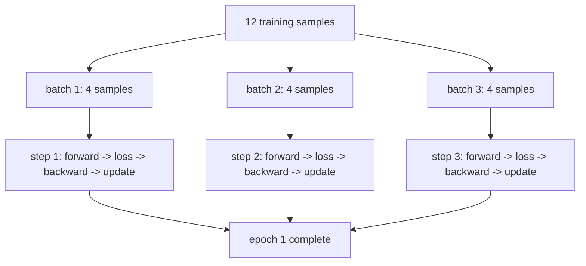
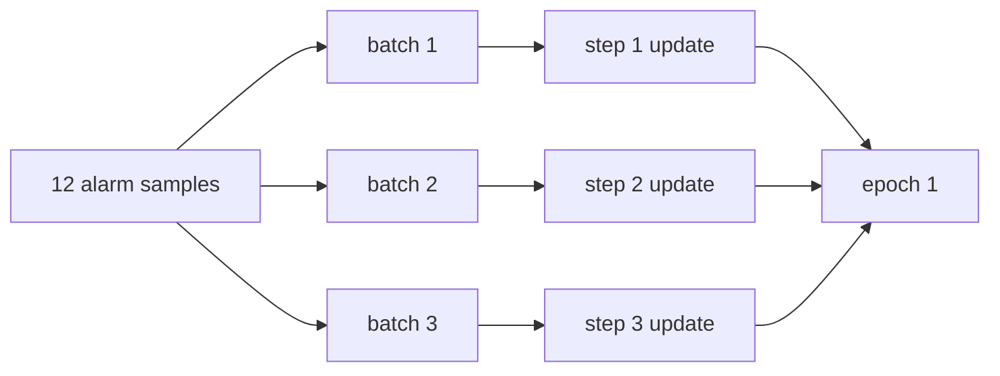

# P5-6.2 Training Step, Batch, Epoch

> Section ID: `P5-6.2`
> Version: `v2026.07.20`

In P5-6.1, we first grouped together the smallest training loop that continues as `forward -> loss -> backward -> optimizer step`. Once we reach that point, the next question appears immediately.

How many times is this one loop repeated in actual training, and what should we call each unit of that repetition?

If we do not sort out this question first, step, batch, and epoch can easily blur together as if they all just mean `run it many times`. But the three terms are names for dividing the same training process by different standards.

A step is the unit where one update happens. A batch is the group of samples processed together in that step, and an epoch is one full pass through the entire training dataset.

This one sentence may still not feel solid yet. Readers usually understand the phrase `the model runs many times`, but get stuck at the point that `what counts as one time` is being measured by different standards. In one sentence, step becomes the standard. In some logs, batch appears first. In other reports, only the number of epochs is written.

So in this section, rather than trying to memorize the three terms separately, it is safer to understand them first as `three different rulers for measuring the same training process`. Batch counts `how much is grouped together at once`, step counts `how many times that group was processed and updated`, and epoch counts `how many full turns through the entire dataset have been made`.

As an analogy, batch is like the bundle of materials placed on the workbench at one time, step is how many times that bundle was processed and reflected once, and epoch is closer to how many full rounds you made through the materials in the storage room. The analogy cannot replace the concept itself, but it helps capture the feeling that `what counts as one` is different in each case.

If this distinction among the three units starts to blur again, it helps to return to the [batch](/AiBook/reference/concept-glossary/#batch), [training](/AiBook/reference/concept-glossary/#training), and [epoch](/AiBook/reference/concept-glossary/#epoch) entries in the concept glossary together.

## The Question Separated By Step, Batch, And Epoch

- What does each of step, batch, and epoch count?
- How is the training loop from P5-6.1 repeated through batch and step?
- Why does epoch mean `one full pass through the whole dataset` rather than `one update`?
- Why do we need to know this unit distinction first in order to confuse learning and inference less?

This section focuses on distinguishing the `units of repetition` in the training loop. In other words, it assumes we already know the order inside one loop, and closes how that order is executed many times on actual groups of data.

That also means that this section is not the place to explain again what forward, loss, backward, and update are. That question was already closed in P5-6.1. Here, we sort out why those same four stages appear in actual logs under different unit names such as `step 1200`, `epoch 4`, and `batch size 32`.

At the same time, it is also clear which question we will not widen immediately in this section. Whether that repetition is training that actually changes the parameters, or execution that uses the current parameters, continues in the next section, P5-6.3. Even inside a region that uses the same parameters, why training mode and evaluation mode split is explained again in P5-6.4.

## Standards For Update Units And Repetition Units

- You can explain step, batch, and epoch as different units of repetition.
- You can say that one training loop from P5-6.1 runs as one step for each batch.
- You can explain an epoch as `one full pass through the entire dataset`.
- You can confirm with a simple Python example how step and epoch accumulate.

## Seeing Step, Batch, And Epoch In One Scene

Suppose there are 12 training samples and the batch size is 4.

- We group 4 samples together and put them into the model at one time.
- Once that one batch is processed and an update happens, step 1 is finished.
- After 3 such batches, all 12 samples have been seen once, so epoch 1 is finished.

The reason readers get confused by this scene is that both `12 training samples` and `3 training actions` are true at the same time. We saw 12 samples, but only 3 updates happened. In other words, `how many samples were seen` and `how many updates happened` do not have to be the same number.

If the batch size changes here, the number of steps changes with it. Even with the same 12 samples, if the batch size is 6, the number of steps becomes 2. If the batch size is 3, the number of steps becomes 4. But the fact that it is still epoch 1 does not change. We still saw the whole dataset once.

To let the reader see this difference more directly, it is safer to separate `what stays fixed` and `what changes`.

| What changes | What stays the same | What changes together |
| --- | --- | --- |
| batch size | the fact that all 12 samples were seen once | the number of steps needed |
| the total number of samples | the definition that `step is an update unit` | the number of batches inside one epoch |
| the number of epochs | the structure that one batch is connected to one step | how many times the whole dataset is repeated |

The first result to confirm in this table is that changing the batch size does not change `the meaning of training`. It changes `into how many groups training will split the data in order to update`.

If we draw it very simply, it looks like this.



The first result to confirm in this diagram is that `step` increases once after each batch is processed, while `epoch` increases only after all batches have been processed.

## Why Do We Need This Distinction First

A common confusion in introductory deep learning is the following.

- You put in the data once, so you think one epoch is finished.
- You processed one batch, so you feel you trained the whole dataset.
- You read both step and epoch only as `the number of training times` and miss the difference.

But if we reread it through the scene we just saw, the three terms actually count different things.

| Term | What it counts first | Shortest explanation |
| --- | --- | --- |
| batch | the group of samples handled together in one step | `input bundle` |
| step | the number of times an update happened | `one execution of the training loop` |
| epoch | the number of times the whole training dataset was seen once | `one full cycle` |

This distinction is needed so that `one loop` and `repeating the whole dataset` do not get mixed together. P5-6.1 explained what happens in order inside one loop. The current section explains how many times that loop repeats in actual training, and in what grouping.

From a beginner's point of view, it helps to unpack this one more time. Training usually does not appear as one single line on the screen. In some places, only `epoch=3` is written. In other places, you only see `step=4800`. In still other explanations, the phrase `we increased the batch size` appears first. If these three terms are read as meaning the same thing, then `we trained three times`, `we updated three times`, and `we put in three samples at a time` all get tangled together.

So the purpose of this section is not just to build a small dictionary of terms. It is to make the reader distinguish first, when reading training, `what exactly is this number counting right now?`

Especially when reading logs, it is safer to use the following order.

1. Look at what the `batch size` is.
2. Check into how many batches one epoch is divided.
3. Check how much step increases every time one batch is processed.
4. Check whether the epoch ends only after all batches are processed.

Once that order is fixed, even when you see a number like `step 2000`, it becomes less confusing that this does not mean `the whole dataset was repeated 2000 times`, but is much closer to `2000 updates happened`.

## What Does Batch Point To

In theory, we could update immediately for every single sample, or put the whole dataset in at once. But in actual training, both can be inconvenient.

- If we see only one sample at a time, the gradient can fluctuate too much.
- If we put the whole dataset in at once, memory and computation can become too heavy.

So batch becomes the operational unit that lets training proceed with a group that is `neither too small nor too large`. In other words, batch is `the group of samples that the model sees together in this step`.

The important point here is that batch is not `the name that counts repetition`, but `the name of the data group processed together in one step`. When understanding batch, the first scene to recall is `into how small groups is the data split before being sent to an update`, not `how many times was training performed`.

For example, if there are 320 images and the batch size is 32, then the model usually sees 32 images at a time. During one full pass through all 320 images, this creates 10 such groups. Here, batch points to the group size `32 images`, while how many times those groups are repeated is counted separately by step or epoch.

What readers especially often miss here is the meaning of the phrase `change the batch size`. This usually means `change how many samples the model sees together in one step`, not directly `change the epoch itself`. Of course, if the batch size changes, the number of steps needed to go through the same full dataset also changes, so the shape of the training log changes indirectly too. But the direct target of the term is still `group size`.

So if someone says `we increased the batch size from 32 to 64`, it is more accurate to read that first as `the number of samples seen together at one time increased`. Only after that do we follow with `then the number of steps needed to go through the same whole dataset will decrease`. If this order is reversed, the roles of batch and step can blur together again.

The final core point to hold when reading batch is simple. Batch counts `how many samples are grouped together at one time`. It does not tell us how many times the whole training was repeated. It tells us the size of the input group placed in front of the model just before one update.

## What Does Step Point To

If we count step simply as `forward happened once`, the core of the training loop becomes blurry. As we saw in P5-6.1, the training loop closes as `forward -> loss -> backward -> optimizer step`.

So in this book, it is safer to read step like this.

`A step is the unit in which one batch is used to compute the loss, compute the gradient, and then update the parameters once.`

In other words, step is closer to `an update happened once` than `we saw the input once`. When understanding step, the first scene to recall is `how many times have the numbers inside the model been corrected so far?`

For example, if the batch size is 32 and there are 320 samples, then one epoch usually contains 10 batches, and the update also happens 10 times. Here, step increases by 1 whenever one batch passes. So `step 7` is much closer to `the seventh update has finished` than to `seven samples were seen`.

This difference also matters later when we distinguish learning from inference. Step is basically a name read together with `updates inside the training loop`, so it is safer not to read it immediately as the same thing as `how many times a service ran on inputs`. We do not widen that distinction deeply in this section yet, but it helps to fix here first why the word `step` is defined around update.

In practical logs, the expression `global step` also appears often, and even there it is usually closer to `the number of accumulated updates so far`. So just because the step number grew larger, we still cannot immediately know how many full passes through the dataset happened. We need to look at the batch size and epoch information together.

The last core point to hold when reading step is also clear. Step means, more precisely than `the training loop ran once`, that `an update happened once`. So it is safest to understand the step count as the number that counts how many times the model has been modified.

## What Does Epoch Point To

Epoch is a larger unit than step. Only after the whole training dataset has been read once does epoch 1 finish.

For example:

- 100 samples
- batch size 10

then one epoch usually contains 10 steps.

In other words, epoch is not one training-loop execution, but `one full cycle through the whole dataset that bundles many steps together`. When understanding epoch, the first scene to recall is `how many full rounds through the whole dataset have been made so far?`

For example, if 1,000 samples are trained with batch size 100, then the model usually goes through 10 steps within one epoch. In that case, saying `epoch 1` is finished means `all 1,000 samples were seen once`, while 10 updates have already happened inside it. So epoch does not count one update. It counts `full-dataset repetition`.

When readers see an expression like `epoch 10`, it is easy to understand it in a lump as `training happened 10 times`. That is not completely wrong, but more precisely it is much closer to `the whole dataset was seen repeatedly 10 times`. Inside that, there are many more steps, one for each batch.

So when reading a training record, it is more accurate to look not only at `how many epochs`, but also at `how many steps are inside one epoch` and `what the batch size is`.

This point also matters later when comparing experiment results. Even if two experiments both say `epoch 5`, if the batch size is different, the number of steps inside one epoch can be different. Conversely, even if the step count is the same, if the data size or batch size is different, the number of epochs can look different. So we first have to separate which number is being used as the comparison standard.

The final core point to hold when reading epoch is that this number does not directly tell us `how strong the training was`. It tells us `how many times the entire dataset was repeated`. So if we look at epoch alone, we still have not read the whole training process. We also need to see how many steps were inside it before the actual repetition structure becomes visible.

## Fixing The Boundary Between 6.2 And 6.3 First

After P5-6.2, P5-6.3 distinguishes learning and inference. Because both often appear together with the phrase `training repeats many times`, they can look attached when read for the first time. So it is safer here to split the questions into two levels.

| Question to answer first | Answer in this section | Answer in the next section |
| --- | --- | --- |
| In what units does the training loop repeat? | We distinguish step, batch, and epoch. | This question is already a finished premise there. |
| Is this repetition a procedure that changes the parameters, or a procedure that uses the current parameters? | We do not handle that yet here. | We distinguish learning and inference. |

In other words, P5-6.2 is the section that separates `units of repetition`, and P5-6.3 is the section that then separates `whether parameters change`.

## Cases And Examples

### Case. Training 12 Alarm Records In Three Parts

Suppose there are 12 equipment alarm records, and we train them in groups of 4 at a time. When people only see the message `training...` on a screen, they often imagine the model reads the whole dataset all at once. But if we look at an actual training log, what usually passes by in sequence is not the whole dataset, but small batches.

| Category | What it actually counts | Value in this case |
| --- | --- | --- |
| batch size | number of samples processed together in one step | 4 |
| number of steps | number of times one batch was processed and updated | 3 |
| number of epochs | number of times all 12 records were seen once | 1 |

The first result to confirm in this scene is that the fact `12 records were seen` does not mean `12 steps happened`. If the batch size is 4, the actual update happens 3 times.

If we change the numbers once more while reading this case, the difference becomes clearer. Even with the same 12 records, if the batch size is 1, the step count becomes 12. If the batch size is 12, the step count becomes 1. In other words, even when the amount of data stays the same, `how many updates happened` can change depending on how the batch is grouped.

| Standard a person is likely to look at first | Standard reread from the viewpoint of step/batch/epoch |
| --- | --- |
| Since 12 records were put in, it feels like training must have happened 12 times | If they were grouped into batches of 4, the update may have happened only 3 times |
| Since one training run was performed, it feels like it should be one step | If the whole dataset was seen once, it may instead mean epoch 1 |
| Batch feels like just a word for part of the data | Batch is the operational unit `group processed together in one step` |

If we compress this case once more, it becomes the following.



This diagram is there not to add more formulas, but to fix the reading order `whole dataset -> batch groups -> accumulated step -> epoch complete`.

## Practice And Example

The goal of this example is to confirm how the same small training dataset is divided into several steps depending on the batch size, and when the epoch finishes. Here, the code is not training a complicated model, but serving the role of making the `units of repetition` visible.

This example intentionally contains almost no model computation. The core of this section is not performance or loss reduction, but `can we read the repetition units without confusing them?` In other words, what the reader should look at here is not accuracy, but `on which line step increases` and `on which line epoch ends`.

Input:

- 6 alarm records
- batch sizes 1, 2, and 4 to compare
- 2 epochs

Output:

- how the number of batches per epoch and total step count change when batch size changes
- what size the final batch has when the data does not divide evenly
- what determines the point where an epoch ends

Problem scene:

- if step, batch, and epoch are all read like `training count`, real log interpretation can become unstable

Concepts to confirm:

- batch is the group processed together in one step
- once one batch is processed and an update happens, step increases by 1
- once the whole dataset has been seen once, epoch increases by 1

```python
# This example changes batch size to see how steps per epoch and the final batch size change.
samples = [
    {"alarm_count": 1, "target": 2},
    {"alarm_count": 2, "target": 4},
    {"alarm_count": 3, "target": 6},
    {"alarm_count": 4, "target": 8},
    {"alarm_count": 5, "target": 10},
    {"alarm_count": 6, "target": 12},
]

epochs = 2

def run_epoch_log(batch_size):
    global_step = 0
    batch_sizes_seen = []

    for _ in range(epochs):
        for batch_start in range(0, len(samples), batch_size):
            batch = samples[batch_start:batch_start + batch_size]
            global_step += 1
            batch_sizes_seen.append(len(batch))

    print(f"[batch_size={batch_size}]")
    print("steps_per_epoch =", len(batch_sizes_seen) // epochs)
    print("total_steps =", global_step)
    print("batch_sizes_seen =", batch_sizes_seen)
    print()

for batch_size in [1, 2, 4]:
    run_epoch_log(batch_size)
```

In this output, first see that a smaller batch size increases the number of steps inside one epoch. When batch size is raised to 4, the 6 samples split as `[4, 2]`, so the final batch can be smaller. The meaning of epoch still does not change. Once the whole dataset has been seen once, one epoch ends; each processed batch increases step by 1.

From here, you can try changing one value yourself. If you set `batch_size` to 3, each epoch will show only 2 steps; if you set `batch_size` to 1, each epoch will show 6 steps. In every case, however, the epoch still ends only after all 6 samples have been seen. Once this intuition is fixed, step, batch, and epoch no longer read as the same kind of number.

The last core point to hold here is simple. Batch is `the grouping unit`, step is `the update unit`, and epoch is `the full-repeat unit`. All three terms explain repetition in training, but they are not different words for the same number. This distinction has to be firm so that in the next section, when we divide learning and inference, we can also read separately `what ran many times` and `what was actually updated`.

## Checklist

- Can you distinguish what each of step, batch, and epoch counts?
- Can you explain step from the standard of `one update`?
- Can you explain epoch as `one repetition that saw the whole dataset once`?
- Can you say that the one training loop from P5-6.1 is repeated as many steps in actual training, one for each batch?
- Can you distinguish that the learning/inference section in P5-6.3 asks not about `units of repetition`, but about `whether parameters change`?

## Sources And Further Reading

- PyTorch, `Optimizing Model Parameters`, PyTorch Tutorials. Used to check the structure in which training repeatedly continues through prediction, loss computation, gradient computation, and parameter optimization, and the training-loop terminology. Accessed 2026-07-19. [https://docs.pytorch.org/tutorials/beginner/basics/optimization_tutorial.html](https://docs.pytorch.org/tutorials/beginner/basics/optimization_tutorial.html){: target="_blank" rel="noopener noreferrer" }
- PyTorch, `Training with PyTorch`, PyTorch Tutorials. Used to check the training-loop structure that takes batches from a DataLoader and repeats through one epoch. Accessed 2026-07-19. [https://docs.pytorch.org/tutorials/beginner/introyt/trainingyt.html](https://docs.pytorch.org/tutorials/beginner/introyt/trainingyt.html){: target="_blank" rel="noopener noreferrer" }
