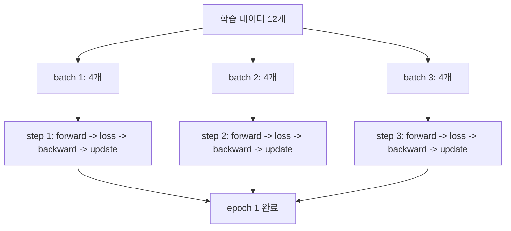
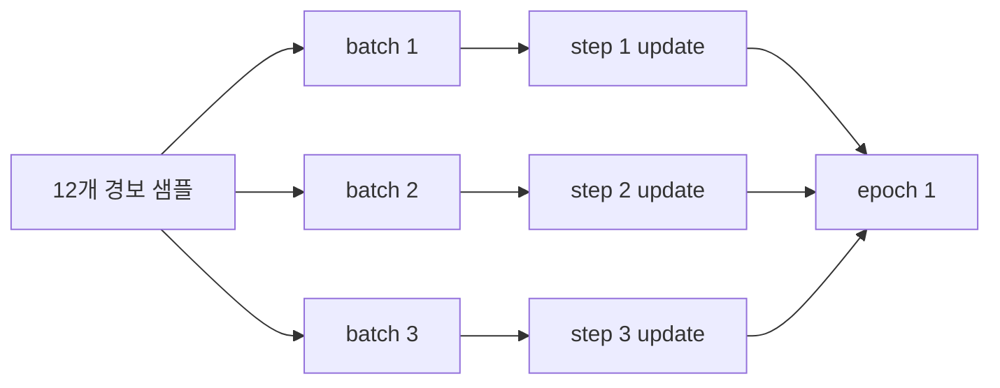

# P5-6.2 학습 step, batch, epoch

Section ID: `P5-6.2`
Version: `v2026.07.17`

P5-6.1에서는 `forward -> loss -> backward -> optimizer step`으로 이어지는 가장 작은 학습 루프를 먼저 묶었습니다. 여기까지 오면 바로 다음 질문이 생깁니다.

이 한 번의 루프는 실제 학습에서 몇 번 반복되며, 그 반복 단위를 무엇이라고 불러야 하는가?

이 질문을 먼저 정리하지 않으면 step, batch, epoch가 모두 `그냥 여러 번 돌린다`는 말처럼 섞여 보이기 쉽습니다. 하지만 세 용어는 같은 반복을 다른 층위에서 가리킵니다.

step은 한 번의 업데이트 단위이고, batch는 그 step에서 함께 처리하는 샘플 묶음이며, epoch는 학습 데이터 전체를 한 번 다 본 반복이다.

이 세 단위의 구분이 다시 흐려지면 개념사전의 [배치(batch)](../../../reference/concept-glossary.md#batch), [학습(training)](../../../reference/concept-glossary.md#training), [에폭(epoch)](../../../reference/concept-glossary.md#epoch) 항목을 함께 다시 보는 편이 좋습니다.

## 이 절의 범위

- step, batch, epoch는 각각 무엇을 세는가?
- P5-6.1의 학습 루프는 batch와 step으로 어떻게 반복되는가?
- epoch는 왜 `업데이트 한 번`이 아니라 `데이터 전체를 한 번 돈 것`을 뜻하는가?
- 왜 이 단위를 먼저 알아야 learning과 inference를 덜 헷갈리는가?

이 절에서는 학습 루프의 `반복 단위`를 구분하는 데 집중합니다. 즉, 여기서는 `한 번의 계산 순서`를 이미 안다는 전제 위에서, 그 순서가 실제 데이터 묶음 위에서 어떻게 여러 번 실행되는지 닫습니다.

대신 이번 절에서 바로 넓히지 않을 질문도 분명합니다. `그 반복이 파라미터를 실제로 바꾸는 학습인가, 아니면 현재 파라미터를 쓰는 실행인가`는 다음 Section인 P5-6.3에서 이어서 설명합니다. 같은 파라미터를 쓰는 구간 안에서도 왜 training mode와 evaluation mode가 갈리는지는 P5-6.4에서 다시 설명합니다.

## 이 절의 목표

- step, batch, epoch를 서로 다른 반복 단위로 설명할 수 있습니다.
- P5-6.1의 한 번의 학습 루프가 batch마다 한 step으로 실행된다는 점을 말할 수 있습니다.
- epoch를 `데이터 전체를 한 번 다 본 횟수`로 설명할 수 있습니다.
- 간단한 Python 예제로 step과 epoch가 어떻게 누적되는지 확인할 수 있습니다.

## 왜 이 구분이 먼저 필요한가

딥러닝 입문에서 흔한 혼동은 다음과 같습니다.

- 데이터를 한 번 넣었으니 epoch 하나가 끝났다고 생각한다
- batch 하나를 처리했으니 데이터 전체를 학습했다고 느낀다
- step과 epoch를 둘 다 `학습 횟수`로만 읽어 차이를 놓친다

하지만 실제로는 서로 세는 대상이 다릅니다.

| 용어 | 먼저 세는 것 | 가장 짧은 설명 |
| --- | --- | --- |
| step | 업데이트가 한 번 일어난 횟수 | `한 번의 학습 루프 실행` |
| batch | 한 step에서 함께 처리한 샘플 묶음 | `입력 묶음` |
| epoch | 학습 데이터 전체를 한 번 다 본 횟수 | `전체 순환 1회` |

이 구분이 필요한 이유는 `한 번의 루프`와 `전체 데이터 반복`을 섞지 않기 위해서입니다. P5-6.1은 한 번의 루프 안에서 무엇이 순서대로 일어나는지를 설명했고, 지금 절은 그 루프가 실제 학습에서 몇 번, 어떤 묶음으로 반복되는지를 설명합니다.

## step, batch, epoch를 한 장면으로 묶어 보기

학습 데이터가 12개 있고, batch size가 4라고 가정해 보겠습니다.

- 한 번에 4개 샘플을 묶어 모델에 넣습니다.
- 그 batch 하나를 처리하고 update가 일어나면 step 1번이 끝납니다.
- 이런 batch가 3개 지나가면 데이터 12개를 모두 한 번 본 것이므로 epoch 1번이 끝납니다.

이를 아주 단순하게 그리면 다음과 같습니다.



이 도식에서 먼저 확인해야 할 결과는, `step`은 각 batch 처리 뒤 한 번씩 늘고, `epoch`는 모든 batch를 다 처리한 뒤에야 한 번 늘어난다는 점입니다.

## batch는 왜 필요한가

이론적으로는 샘플 하나마다 바로 업데이트할 수도 있고, 데이터 전체를 한 번에 넣을 수도 있습니다. 하지만 실제 학습에서는 둘 다 불편할 수 있습니다.

- 샘플 하나씩만 보면 gradient가 지나치게 흔들릴 수 있습니다.
- 데이터 전체를 한 번에 넣으면 메모리와 계산량 부담이 커질 수 있습니다.

그래서 batch는 `너무 작지도, 너무 크지도 않은 묶음`으로 학습을 진행하게 해 주는 운영 단위가 됩니다.

여기서 중요한 점은 batch가 `반복을 세는 이름`이 아니라 `한 step에서 같이 처리할 데이터 묶음 이름`이라는 점입니다.

## step은 왜 update 기준으로 세는가

step을 단순히 `forward를 한 번 했다`로 세면 학습 루프의 핵심이 흐려집니다. P5-6.1에서 본 것처럼 학습 루프는 `forward -> loss -> backward -> optimizer step`으로 닫히기 때문입니다.

따라서 이 책에서는 step을 다음처럼 읽는 편이 안전합니다.

`step은 batch 하나를 사용해 손실을 계산하고 gradient를 구한 뒤, 파라미터를 한 번 업데이트한 단위다.`

즉, step은 `입력을 한 번 봤다`보다 `업데이트를 한 번 했다`에 더 가깝습니다.

## epoch는 왜 전체 순환 단위인가

epoch는 step보다 더 큰 단위입니다. 학습 데이터 전체를 한 번 다 읽고 나서야 epoch 1회가 끝납니다.

예를 들어:

- 데이터 100개
- batch size 10

이라면, epoch 1회 안에는 보통 10개의 step이 들어갑니다.

즉, epoch는 학습 루프 한 번이 아니라 `여러 step을 묶은 데이터 전체 순환`입니다.

## 6.2와 6.3의 경계 먼저 잡기

P5-6.2 다음에는 P5-6.3에서 learning과 inference를 구분합니다. 둘 다 `학습이 여러 번 반복된다`는 말과 함께 자주 등장해 처음 읽으면 붙어 보일 수 있습니다. 그래서 여기서는 질문을 두 층으로 분리해 두는 편이 안전합니다.

| 먼저 답할 질문 | 이 절에서의 답 | 다음 절에서의 답 |
| --- | --- | --- |
| 학습 루프는 어떤 단위로 반복되는가? | step, batch, epoch를 구분합니다. | 이 질문은 이미 끝난 전제입니다. |
| 지금 그 반복이 파라미터를 바꾸는 절차인가, 아니면 현재 파라미터를 쓰는 절차인가? | 여기서는 아직 다루지 않습니다. | learning과 inference를 구분합니다. |

즉, P5-6.2는 `반복 단위`를 가르는 절이고, P5-6.3은 그다음에 `파라미터 변경 여부`를 가르는 절입니다.

## 사례 및 예시

### 사례. 경보 데이터 12건을 세 번에 나누어 학습하기

설비 경보 데이터가 12건 있고, 한 번에 4건씩 묶어 학습한다고 가정해 보겠습니다. 사람은 화면에서 `학습 중...`이라는 문구만 보면 모델이 한 번에 전체 데이터를 다 읽는다고 상상하기 쉽습니다. 하지만 실제 학습 로그를 보면 보통 전체 데이터가 아니라 작은 batch가 차례로 지나갑니다.

| 구분 | 실제로 세는 것 | 이번 사례의 값 |
| --- | --- | --- |
| batch size | 한 step에서 함께 처리하는 샘플 수 | 4 |
| step 수 | batch 하나를 처리하고 update한 횟수 | 3 |
| epoch 수 | 데이터 12건을 모두 한 번 본 횟수 | 1 |

이 장면에서 먼저 확인해야 할 결과는, `데이터 12건을 봤다`는 사실이 곧 step 12번을 뜻하지 않는다는 점입니다. batch size가 4라면 실제 update는 3번 일어납니다.

| 사람이 먼저 보기 쉬운 기준 | step/batch/epoch 관점으로 다시 읽는 기준 |
| --- | --- |
| 데이터 12건을 넣었으니 12번 학습했을 것 같다 | batch 4건씩 묶었다면 update는 3번 일어났을 수 있다 |
| 한 번 학습을 돌렸다고 하니 step 하나일 것 같다 | 전체 데이터를 한 번 다 본 것이라면 epoch 1회일 수 있다 |
| batch는 그냥 데이터 일부를 뜻하는 말 같다 | batch는 `한 step에서 같이 처리하는 묶음`이라는 운영 단위다 |

이 사례를 한 번 더 압축하면 다음과 같습니다.



이 도식은 수학 공식을 늘리기보다, `전체 데이터 -> batch 묶음 -> step 누적 -> epoch 완료`의 읽기 순서를 고정하기 위한 것입니다.

## 연습 및 예제

이번 예제의 목표는 같은 작은 학습 데이터가 batch size에 따라 몇 개의 step으로 나뉘고, epoch가 언제 완료되는지 확인하는 것입니다. 여기서 코드는 복잡한 모델 학습이 아니라 `반복 단위`를 눈으로 확인하는 역할을 맡습니다.

입력:

- 경보 데이터 6건
- batch size 2
- epoch 수 2

출력:

- 각 epoch에서 어떤 batch가 몇 번째 step으로 처리되는지
- 전체 step 수
- epoch 종료 시점

문제 상황:

- step, batch, epoch를 모두 `학습 횟수`처럼 읽으면 실제 로그 해석이 흔들릴 수 있다

확인할 개념:

- batch는 한 step에서 같이 처리하는 묶음이다
- batch 하나를 처리하고 update가 일어나면 step이 1 증가한다
- 전체 데이터를 한 번 다 보면 epoch가 1 증가한다

```python
samples = [
    {"alarm_count": 1, "target": 2},
    {"alarm_count": 2, "target": 4},
    {"alarm_count": 3, "target": 6},
    {"alarm_count": 4, "target": 8},
    {"alarm_count": 5, "target": 10},
    {"alarm_count": 6, "target": 12},
]

batch_size = 2
epochs = 2
global_step = 0

for epoch_index in range(epochs):
    print(f"epoch {epoch_index + 1} start")

    for batch_start in range(0, len(samples), batch_size):
        batch = samples[batch_start:batch_start + batch_size]
        global_step += 1
        batch_alarm_counts = [row["alarm_count"] for row in batch]
        print(
            f"  step {global_step}: "
            f"batch_samples={batch_alarm_counts}"
        )

    print(f"epoch {epoch_index + 1} end")
    print("---")
```

```text
epoch 1 start
  step 1: batch_samples=[1, 2]
  step 2: batch_samples=[3, 4]
  step 3: batch_samples=[5, 6]
epoch 1 end
---
epoch 2 start
  step 4: batch_samples=[1, 2]
  step 5: batch_samples=[3, 4]
  step 6: batch_samples=[5, 6]
epoch 2 end
---
```

이 출력에서는 먼저 batch size가 2이므로 샘플 6건이 epoch마다 3개 batch로 나뉜다는 점을 봅니다. 그다음 각 batch 뒤에 step이 1씩 증가하고, 세 batch가 끝난 뒤에야 epoch가 끝난다는 점을 확인하면 됩니다.

## 체크리스트

- step, batch, epoch가 각각 무엇을 세는지 구분할 수 있는가?
- step을 `업데이트 한 번` 기준으로 설명할 수 있는가?
- epoch를 `데이터 전체를 한 번 본 반복`으로 설명할 수 있는가?
- P5-6.1의 한 번의 학습 루프가 실제 학습에서는 batch마다 여러 step으로 반복된다는 점을 말할 수 있는가?
- 다음 절 P5-6.3에서 다룰 learning/inference 구분이 `반복 단위`가 아니라 `파라미터 변경 여부`를 가르는 질문이라는 점을 구분할 수 있는가?
