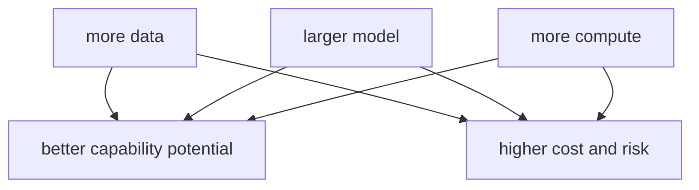

# P5-6.2 데이터와 스케일

P5-6.1에서는 사전학습(pretraining)을 대규모 텍스트에서 일반 언어 패턴과 표현을 먼저 배우는 단계로 설명했습니다. 그러면 다음 질문이 자연스럽게 생깁니다.

그렇다면 왜 LLM 설명에서는 데이터와 스케일(scale)이라는 말이 그렇게 자주 등장하는가?

이 절은 그 질문에 답합니다.

스케일(scale)은 데이터 양, 모델 크기, 계산량이 함께 커지는 현상을 가리키며, LLM 성능 향상과 강하게 연결되지만 비용과 위험도 함께 키운다.

## 이 절의 범위

이 절은 다음 질문에 답합니다.

- 스케일(scale)은 무엇을 뜻하는가?
- 왜 데이터, 파라미터(parameter), 계산량(compute)을 함께 보아야 하는가?
- 규모가 커지면 왜 성능이 좋아지기도 하고, 동시에 비용과 위험도 커지는가?

이 절에서는 다음 내용을 깊게 다루지 않습니다.

- scaling law 수식
- GPU 클러스터 설계
- 최신 상용 모델 파라미터 수 비교

이 절에서는 스케일의 방향만 잡고, 다음 토큰 예측으로 이어지는 학습 목표는 P5-5.1에서 다시 구체화합니다. GPU 인프라와 최신 상용 모델 수치 비교는 빠르게 바뀌는 주제이기도 하므로 현재 본편 범위 밖으로 두고, 운영 제약의 큰 그림만 P5-16.1 서비스 운영 제약에서 다시 연결합니다.

이 절의 목적은 `크면 무조건 좋다`는 식의 단순한 인상을 피하고, 스케일을 기회와 제약이 함께 있는 구조로 이해하게 하는 데 있습니다.

## 이 절의 목표

- 스케일을 데이터, 모델, 계산량의 확대라는 관점으로 설명할 수 있습니다.
- 성능 향상과 비용 증가가 함께 간다는 점을 말할 수 있습니다.
- 데이터 품질과 검증 책임이 규모와 함께 더 중요해진다는 점을 설명할 수 있습니다.
- 다음 장의 다음 토큰 예측 설명으로 자연스럽게 넘어갈 수 있습니다.

## 스케일은 무엇을 함께 키우는가

LLM 문맥에서 스케일은 보통 하나만 커지는 것을 뜻하지 않습니다. 대개 다음이 함께 커집니다.

- 학습 데이터 양
- 모델 파라미터 수
- 학습 계산량(compute)

다음처럼 기억하면 좋습니다.

`모델을 크게 만든다는 말은 대개 더 많은 텍스트를 보고, 더 많은 파라미터를 쓰고, 더 많은 계산 자원을 투입한다는 뜻과 함께 간다.`

## 왜 규모가 커지면 성능이 좋아질 수 있나

이 질문에 대한 직관적 답은 다음과 같습니다.

- 더 많은 데이터는 더 다양한 언어 패턴을 보게 하고
- 더 큰 모델은 더 복잡한 패턴을 담을 표현력을 주며
- 더 많은 계산은 그 구조를 실제로 학습하게 해 줍니다

즉, 스케일은 단순한 크기 경쟁이 아니라 `패턴을 더 넓고 더 세밀하게 담는 조건`과 연결됩니다.

그래서 LLM 발전사에서는 모델 규모와 데이터 규모가 성능 전환과 함께 자주 언급됩니다.

## 왜 비용과 지연 시간도 함께 커지나

하지만 규모가 커질수록 좋은 점만 생기지는 않습니다.

- 학습 비용이 커집니다
- 추론 비용도 커질 수 있습니다
- 응답 지연 시간(latency)이 늘어날 수 있습니다
- 운영 복잡도와 장애 대응 부담이 커집니다

즉, 스케일은 성능 문제이면서 동시에 서비스 운영 문제입니다.

이 점은 Part 5 뒤쪽의 운영, 평가, 제약 설명과도 직접 연결됩니다.

## 데이터가 많다고 항상 좋은가

이 점도 중요합니다.

데이터 양이 늘어나는 것은 중요하지만, 품질 문제가 사라지는 것은 아닙니다.

예를 들어:

- 오래된 정보
- 중복 데이터
- 편향된 표현
- 저작권 문제
- 잘못된 사실

같은 문제는 데이터가 많아져도 그대로 남거나 더 커질 수 있습니다.

따라서 더 안전한 설명은 다음입니다.

`스케일은 성능 가능성을 키우지만, 데이터 품질과 검증 책임을 없애 주지는 않는다.`

## 왜 스케일이 사용자 경험을 바꾸었나

스케일이 커지면서 사용자는 다음과 같은 변화를 더 직접 느끼게 됩니다.

- 긴 문맥을 더 자연스럽게 처리하는 듯한 응답
- 더 다양한 작업 지시에 대한 반응
- zero-shot, few-shot 사용 경험의 향상
- 자연어 질의만으로도 여러 작업을 수행하는 듯한 느낌

하지만 이 역시 곧바로 `이해`나 `사실성`을 보장하는 것은 아닙니다.

즉, 스케일은 사용자 경험을 크게 바꾸지만, 검증 책임을 없애지는 않습니다.

## 아주 단순하게 그리면



이 도식의 핵심은 한 가지입니다.

`스케일은 성능 가능성과 비용/위험을 함께 키운다.`

## 사례로 보기

### 사례 1. 더 큰 모델, 더 넓은 작업 반응

작은 모델에게 문장 요약만 시키면 그럭저럭 동작하지만, 같은 모델에 표 정리, 규칙 변환, 예외 조건 설명까지 한 번에 요구하면 금방 흔들릴 수 있습니다. 사람이 볼 때는 `왜 어떤 요청은 되고 어떤 요청은 안 되지`라는 차이로 먼저 느껴질 수 있습니다. 규모가 커질수록 더 많은 표현과 작업 지시에 반응하는 것처럼 보이는 이유는, 더 큰 모델이 더 넓은 패턴을 다룰 여지를 갖기 때문입니다. 예를 들어 같은 매뉴얼을 넣고 `요약`은 되는데 `예외 조항만 표로 뽑기`는 자주 실패한다면, 사용자는 기능 차이로 느끼지만 내부적으로는 다룰 수 있는 패턴 폭 차이일 수 있습니다. 이때 작은 모델은 핵심은 맞지만 표 열을 빼먹거나 예외 조건을 본문 속에 섞어 버릴 수 있습니다. 하지만 이 변화는 `무조건 다 잘한다`가 아니라 `다룰 수 있는 범위가 넓어질 수 있다`는 방향으로 읽어야 합니다. 그래서 이 사례는 스케일이 작업 반응 폭을 어떻게 바꾸는지 감각적으로 보여 줍니다.

### 사례 2. 더 긴 입력 처리

긴 계약서를 요약하거나 긴 코드 파일을 읽는 장면을 생각해 볼 수 있습니다. 작은 모델이나 짧은 문맥 구조에서는 앞부분과 뒷부분 관계가 잘 끊겨, 중간에 중요한 조항이나 함수 연결을 놓치기 쉽습니다. 예를 들어 계약서 앞쪽의 해지 조건과 뒤쪽의 예외 조항이 함께 읽혀야 하는데, 둘 중 하나가 잘리면 요약은 그럴듯해 보여도 핵심 판단을 놓칠 수 있습니다. 그러면 사용자는 `해지는 가능하다`는 말만 보고 중요한 예외를 못 본 채 결정을 내릴 수 있습니다. 더 큰 모델과 더 넓은 문맥 구조는 이런 긴 입력을 한 번에 더 많이 담아 사용 경험을 개선할 수 있습니다. 하지만 동시에 처리 비용과 지연 시간도 같이 커집니다. 그래서 이 사례는 `긴 입력을 더 잘 본다`는 이점과 `그만큼 더 비싸진다`는 현실이 함께 움직인다는 점을 보여 줍니다.

### 사례 3. 운영 관점

운영팀이 더 큰 모델로 바꾸면 답변 품질은 올라갈 수 있다고 기대한다고 해 봅시다. 하지만 실제 서비스에서는 학습 단계만이 아니라, 매 요청 추론 비용, 캐시 정책, 장애 감시, 안전 점검 범위까지 함께 커집니다. 사람이 처음에는 모델 교체를 `성능 개선` 한 줄로 생각하기 쉽지만, 운영에서는 곧 `이 비용과 복잡도를 감당할 수 있는가`라는 질문으로 바뀝니다. 예를 들어 답변 정확도는 조금 좋아졌는데 응답 시간이 크게 늘면, 고객 지원 시스템에서는 오히려 전체 만족도가 떨어질 수도 있습니다. 심하면 품질 향상보다 비용 폭증이 더 먼저 운영 문제로 보일 수 있습니다. 장애 대응도 더 복잡해져, 같은 시간 안에 처리할 수 있는 요청 수가 줄어들 수 있습니다. 그래서 스케일 사례는 연구실 성능 향상과 서비스 운영 부담이 같은 방향으로 움직이지 않을 수 있다는 점을 보여 줍니다. 이 장면에서 스케일은 능력 이야기이면서 동시에 운영 구조 이야기입니다.

## 작은 Python 예제로 보기

이번 예제의 목표는 스케일을 정밀하게 계산하는 것이 아니라, 규모가 커질 때 성능 가능성과 비용이 함께 움직인다는 감각을 보는 것입니다.

입력:

- 작은 모델과 큰 모델의 단순 비교값

출력:

- 데이터, 파라미터, 비용의 방향성 비교

```python
small = {"data_m": 50, "params_m": 120, "cost": 1}
large = {"data_m": 500, "params_m": 1300, "cost": 8}

print("small =", small)
print("large =", large)
print("observation = larger scale may improve capability, but cost also rises")
```

실행 결과 예시는 다음처럼 읽을 수 있습니다.

```text
small = {'data_m': 50, 'params_m': 120, 'cost': 1}
large = {'data_m': 500, 'params_m': 1300, 'cost': 8}
observation = larger scale may improve capability, but cost also rises
```

이 예제는 실제 모델 수치를 설명하는 것이 아닙니다. 다만 다음 점을 보여 줍니다.

- 스케일은 여러 축이 함께 커지는 문제이고
- 성능 기대와 비용 증가를 함께 읽어야 한다는 점입니다

## 역사와 커리큘럼 관점

LLM 시대를 이해할 때 스케일은 빠질 수 없는 주제입니다. GPT-3 이후 특히 많은 논의가 `모델이 왜 이런 능력을 보이기 시작했는가`를 스케일과 연결해 설명했습니다.

하지만 커리큘럼 관점에서는 두 가지를 함께 기억해야 합니다.

1. 스케일은 중요한 성능 전환 요인이다
2. 스케일은 데이터 품질, 검증, 비용, 정책 문제를 같이 키운다

이 두 가지를 함께 넣어야 Part 5의 이후 장과 Part 6 프로젝트에서 균형 잡힌 판단이 가능합니다.

## 다음 장과의 연결

여기까지 오면 이제 생성형 언어 모델의 가장 핵심 학습 목표를 다시 좁혀 볼 수 있습니다.

- 그렇게 큰 모델은 학습 중 정확히 어떤 목표를 반복하는가?
- `다음 토큰 예측(next-token prediction)`은 왜 그렇게 중요한가?

이 질문은 P5-5.1 다음 토큰 예측(next-token prediction)으로 이어집니다.

## 이 절에서 기억할 관점

- 스케일은 데이터, 모델, 계산량이 함께 커지는 현상을 뜻합니다.
- 규모가 커지면 성능 가능성이 높아질 수 있지만 비용과 위험도 커집니다.
- 데이터 양이 늘어도 품질과 검증 문제가 사라지지는 않습니다.
- 이 절은 다음 장의 다음 토큰 예측과 이후 운영 제약 설명의 기반입니다.

## 체크리스트

- 스케일을 데이터, 모델, 계산량의 확대라는 관점으로 설명할 수 있는가?
- 왜 성능과 비용이 함께 커지는지 말할 수 있는가?
- 왜 데이터 품질 문제가 스케일로 자동 해결되지 않는지 설명할 수 있는가?
- 다음 장의 다음 토큰 예측 설명으로 왜 이어지는지 말할 수 있는가?

## 출처와 참고 자료

- Tom B. Brown et al., `Language Models are Few-Shot Learners`, arXiv, 2020, 확인 날짜: 2026-06-29.
- Jared Kaplan et al., `Scaling Laws for Neural Language Models`, arXiv, 2020, 확인 날짜: 2026-06-29.
- OpenAI API Docs, 모델 비용과 입력 길이 관련 문서, 확인 날짜: 2026-06-29. [https://platform.openai.com/docs](https://platform.openai.com/docs){: target="_blank" rel="noopener noreferrer" }
