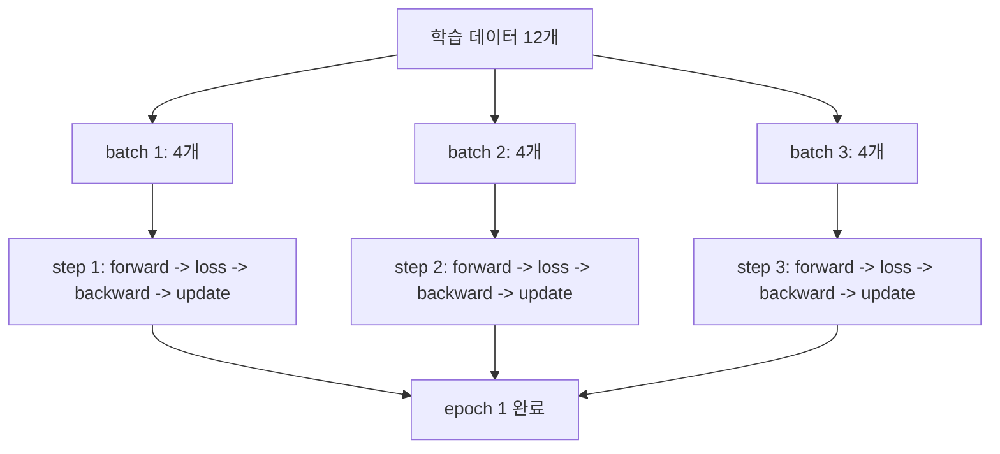
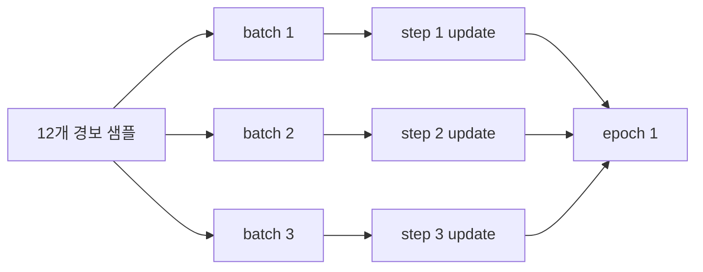

# P5-6.2 학습 step, batch, epoch

> Section ID: `P5-6.2`
> Version: `v2026.07.31`

P5-6.1에서는 `forward -> loss -> backward -> optimizer step`으로 이어지는 가장 작은 학습 루프를 먼저 묶었습니다. 여기까지 오면 바로 다음 질문이 생깁니다.

이 한 번의 루프는 실제 학습에서 몇 번 반복되며, 그 반복 단위를 무엇이라고 불러야 하는가?

이 질문을 먼저 정리하지 않으면 step, batch, epoch가 모두 `그냥 여러 번 돌린다`는 말처럼 섞여 보이기 쉽습니다. 하지만 세 용어는 같은 학습 과정을 서로 다른 기준으로 나누어 보는 이름입니다.

정리하면, step은 한 번의 update가 일어나는 단위입니다. batch는 그 step에서 함께 처리하는 샘플 묶음이고, epoch는 학습 데이터 전체를 한 번 다 본 반복입니다.

이렇게 정리해도 아직 잘 안 잡힐 수 있습니다. 독자는 보통 `모델이 여러 번 돈다`는 말은 이해해도, `무엇이 한 번인가`를 서로 다른 기준으로 세고 있다는 점에서 막힙니다. 어떤 문장에서는 step이 기준이 되고, 어떤 로그에서는 batch가 먼저 보이고, 또 어떤 보고서에서는 epoch 수만 적혀 있기 때문입니다.

그래서 이 절에서는 세 용어를 따로 외우게 하기보다, `같은 학습 과정을 세 개의 다른 자로 재는 방법`으로 먼저 이해하는 편이 더 안전합니다. batch는 `한 번에 얼마나 묶어 넣는가`, step은 `그 묶음을 처리하고 몇 번 업데이트했는가`, epoch는 `전체 데이터를 몇 바퀴 돌았는가`를 세는 이름입니다.

비유하면 batch는 한 번에 작업대 위에 올려놓는 재료 묶음이고, step은 그 묶음을 한 번 처리해 결과를 반영한 횟수이며, epoch는 창고에 있던 재료를 한 바퀴 다 돌며 본 횟수에 가깝습니다. 비유 자체가 개념을 대신할 수는 없지만, `무엇을 한 번으로 세는가`가 서로 다르다는 감각을 잡는 데는 도움이 됩니다.

이 세 단위의 구분이 다시 흐려지면 개념사전의 [학습(training)](../../../reference/concept-glossary-parts/05-mieum.md#model-training) 항목을 기준으로 batch, step, epoch가 학습 반복을 서로 다른 단위로 나누는 이름이라는 점을 다시 봅니다.

## step, batch, epoch가 나누는 질문

- step, batch, epoch는 각각 무엇을 세는가?
- P5-6.1의 학습 루프는 batch와 step으로 어떻게 반복되는가?
- epoch는 왜 `업데이트 한 번`이 아니라 `데이터 전체를 한 번 돈 것`을 뜻하는가?
- 왜 이 단위를 먼저 알아야 learning과 inference를 덜 헷갈리는가?

이 절에서는 학습 루프의 `반복 단위`를 구분하는 데 집중합니다. 즉, 여기서는 `한 번의 계산 순서`를 이미 안다는 전제 위에서, 그 순서가 실제 데이터 묶음 위에서 어떻게 여러 번 실행되는지 닫습니다.

이 말은 곧, 지금 절이 `forward, loss, backward, update가 무엇인가`를 다시 설명하는 자리는 아니라는 뜻이기도 합니다. 그 질문은 이미 P5-6.1에서 닫았고, 여기서는 그 4단계 묶음이 실제 학습 로그에서는 왜 `step 1200`, `epoch 4`, `batch size 32`처럼 다른 단위 이름으로 보이는지를 정리합니다.

대신 이번 절에서 바로 넓히지 않을 질문도 분명합니다. `그 반복이 파라미터를 실제로 바꾸는 학습인가, 아니면 현재 파라미터를 쓰는 실행인가`는 다음 Section인 P5-6.3에서 이어서 설명합니다. 같은 파라미터를 쓰는 구간 안에서도 왜 training mode와 evaluation mode가 갈리는지는 P5-6.4에서 다시 설명합니다.

## 업데이트 단위와 반복 단위의 판단 기준

- step, batch, epoch를 서로 다른 반복 단위로 설명할 수 있습니다.
- P5-6.1의 한 번의 학습 루프가 batch마다 한 step으로 실행된다는 점을 말할 수 있습니다.
- epoch를 `데이터 전체를 한 번 다 본 횟수`로 설명할 수 있습니다.
- 간단한 Python 예제로 step과 epoch가 어떻게 누적되는지 확인할 수 있습니다.

## step, batch, epoch를 한 장면으로 묶어 보기

학습 데이터가 12개 있고, batch size가 4라고 가정해 보겠습니다.

- 한 번에 4개 샘플을 묶어 모델에 넣습니다.
- 그 batch 하나를 처리하고 update가 일어나면 step 1번이 끝납니다.
- 이런 batch가 3개 지나가면 데이터 12개를 모두 한 번 본 것이므로 epoch 1번이 끝납니다.

이 장면을 독자가 헷갈리는 이유는 `학습 데이터 12개`와 `학습 3번`이 동시에 참이기 때문입니다. 샘플은 12개를 봤지만, update는 3번만 일어났습니다. 즉, `샘플을 몇 개 보았는가`와 `업데이트를 몇 번 했는가`는 같은 숫자가 아닐 수 있습니다.

여기서 batch size가 바뀌면 step 수도 함께 바뀝니다. 같은 데이터 12개라도 batch size가 6이면 step은 2번이 되고, batch size가 3이면 step은 4번이 됩니다. 반면 epoch 1회라는 사실은 바뀌지 않습니다. 데이터 전체를 한 번 다 본 것은 여전히 같기 때문입니다.

이 차이를 독자가 더 직접적으로 읽으려면, `무엇이 고정되고 무엇이 변하는가`를 분리해 보는 편이 좋습니다.

| 바꾸는 것 | 그대로 남는 것 | 함께 달라지는 것 |
| --- | --- | --- |
| batch size | 데이터 12개를 한 번 다 본다는 사실 | 필요한 step 수 |
| 데이터 전체 개수 | `step은 update 단위`라는 정의 | 한 epoch 안의 batch 개수 |
| epoch 수 | batch 하나가 step 하나와 연결된다는 구조 | 데이터 전체를 반복해서 보는 횟수 |

이 표에서 먼저 확인해야 할 결과는, batch size를 바꾸면 `학습의 뜻`이 바뀌는 것이 아니라 `학습을 몇 묶음으로 나누어 update할 것인가`가 바뀐다는 점입니다.

이를 아주 단순하게 그리면 다음과 같습니다.



이 도식에서 먼저 확인해야 할 결과는, `step`은 각 batch 처리 뒤 한 번씩 늘고, `epoch`는 모든 batch를 다 처리한 뒤에야 한 번 늘어난다는 점입니다.

## 왜 이 구분이 먼저 필요한가

딥러닝 입문에서 흔한 혼동은 다음과 같습니다.

- 데이터를 한 번 넣었으니 epoch 하나가 끝났다고 생각한다
- batch 하나를 처리했으니 데이터 전체를 학습했다고 느낀다
- step과 epoch를 둘 다 `학습 횟수`로만 읽어 차이를 놓친다

하지만 방금 본 장면을 기준으로 다시 읽으면, 세 용어는 실제로 서로 다른 대상을 셉니다.

| 용어 | 먼저 세는 것 | 가장 짧은 설명 |
| --- | --- | --- |
| batch | 한 step에서 함께 처리한 샘플 묶음 | `입력 묶음` |
| step | 업데이트가 한 번 일어난 횟수 | `한 번의 학습 루프 실행` |
| epoch | 학습 데이터 전체를 한 번 다 본 횟수 | `전체 순환 1회` |

이 구분이 필요한 이유는 `한 번의 루프`와 `전체 데이터 반복`을 섞지 않기 위해서입니다. P5-6.1은 한 번의 루프 안에서 무엇이 순서대로 일어나는지를 설명했고, 지금 절은 그 루프가 실제 학습에서 몇 번, 어떤 묶음으로 반복되는지를 설명합니다.

초심자 기준에서는 여기서 한 번 더 풀어 생각하는 편이 좋습니다. 학습은 보통 화면에 한 줄로 보이지 않습니다. 어떤 곳에는 `epoch=3`만 적혀 있고, 어떤 곳에는 `step=4800`만 보이며, 어떤 설명에서는 `batch size를 늘렸다`는 말만 먼저 나옵니다. 이때 세 용어를 같은 뜻으로 읽으면, `학습을 세 번 했다`, `업데이트를 세 번 했다`, `샘플을 세 개씩 넣었다`가 뒤엉키게 됩니다.

따라서 이 절의 목적은 단순한 용어 사전 만들기가 아니라, 학습 과정을 읽을 때 `지금 이 숫자가 무엇을 세고 있는가`를 먼저 구분하게 만드는 것입니다.

특히 로그를 읽을 때는 순서를 이렇게 잡는 편이 좋습니다.

1. `batch size`가 얼마인가를 본다.
2. 한 epoch 안에 batch가 몇 개로 나뉘는지 본다.
3. batch 하나를 처리할 때마다 step이 얼마나 늘어나는지 본다.
4. 모든 batch를 다 처리했을 때 epoch가 하나 끝나는지 본다.

이 순서가 잡히면 `step 2000` 같은 숫자를 보더라도, 그것이 `데이터를 2000번 전부 돌았다`는 뜻이 아니라 `업데이트가 2000번 일어났다`는 뜻에 더 가깝다는 점을 덜 헷갈리게 됩니다.

## batch는 무엇을 가리키는가

이론적으로는 샘플 하나마다 바로 업데이트할 수도 있고, 데이터 전체를 한 번에 넣을 수도 있습니다. 하지만 실제 학습에서는 둘 다 불편할 수 있습니다.

- 샘플 하나씩만 보면 gradient가 지나치게 흔들릴 수 있습니다.
- 데이터 전체를 한 번에 넣으면 메모리와 계산량 부담이 커질 수 있습니다.

그래서 batch는 `너무 작지도, 너무 크지도 않은 묶음`으로 학습을 진행하게 해 주는 운영 단위가 됩니다. 다시 말해 batch는 `이번 step에서 모델이 한꺼번에 같이 보는 샘플 묶음`입니다.

여기서 중요한 점은 batch가 `반복을 세는 이름`이 아니라 `한 step에서 같이 처리할 데이터 묶음 이름`이라는 점입니다. batch를 이해할 때 먼저 떠올려야 하는 장면은 `데이터를 얼마나 잘게 나누어 update에 올려 보내는가`이지, `학습을 몇 번 했는가`가 아닙니다.

예를 들어 이미지 데이터 320장이 있고 batch size가 32라면, 모델은 보통 한 번에 32장씩 보게 됩니다. 그러면 전체 320장을 한 바퀴 도는 동안 이런 묶음이 10개 생깁니다. 이때 batch는 `32장`이라는 묶음 크기를 가리키고, 그 묶음이 몇 번 반복되었는지는 step이나 epoch가 따로 셉니다.

독자가 여기서 특히 자주 놓치는 것은 `batch size를 바꾼다`는 말의 의미입니다. 이것은 보통 `한 번의 step에서 모델이 몇 개 샘플을 같이 보느냐`를 바꾸는 말이지, epoch 자체를 직접 바꾸는 말이 아닙니다. 물론 batch size가 바뀌면 같은 데이터 전체를 도는 동안 필요한 step 수가 달라지므로 간접적으로 학습 로그 모양도 달라집니다. 하지만 이름이 가리키는 직접 대상은 어디까지나 `묶음 크기`입니다.

그래서 누군가 `batch size를 32에서 64로 올렸다`고 말하면, 먼저 `한 번에 같이 보는 샘플 수를 늘렸구나`라고 읽는 편이 맞습니다. 그다음에야 `그러면 같은 데이터 전체를 도는 동안 step 수는 줄어들겠구나`를 따라갑니다. 이 순서를 뒤집으면 batch와 step의 역할이 다시 섞이기 쉽습니다.

배치(batch)를 읽을 때 마지막으로 붙잡아야 할 핵심은 간단합니다. batch는 `몇 개를 한 번에 묶는가`를 세는 말입니다. 학습 전체를 몇 번 반복했는지를 말해 주지는 않고, 한 번의 update 직전에 모델 앞에 놓이는 입력 묶음의 크기를 말해 줍니다.

## step은 무엇을 가리키는가

step을 단순히 `forward를 한 번 했다`로 세면 학습 루프의 핵심이 흐려집니다. P5-6.1에서 본 것처럼 학습 루프는 `forward -> loss -> backward -> optimizer step`으로 닫히기 때문입니다.

따라서 이 책에서는 step을 다음처럼 읽는 편이 안전합니다.

`step은 batch 하나를 사용해 손실을 계산하고 gradient를 구한 뒤, 파라미터를 한 번 업데이트한 단위다.`

즉, step은 `입력을 한 번 봤다`보다 `업데이트를 한 번 했다`에 더 가깝습니다. step을 이해할 때 먼저 떠올려야 하는 장면은 `지금까지 모델 내부 숫자를 몇 번 고쳤는가`입니다.

예를 들어 batch size가 32이고 데이터가 320개라면, 한 epoch 안에는 보통 10개의 batch가 있고 update도 10번 일어납니다. 이때 step은 batch가 하나 지나갈 때마다 1씩 늘어납니다. 따라서 `step 7`은 보통 `일곱 번째 update까지 끝났다`에 더 가깝지, `샘플 일곱 개를 봤다`는 뜻이 아닙니다.

이 차이는 뒤에서 learning과 inference를 구분할 때도 중요해집니다. step은 기본적으로 `학습 루프 안의 update`와 함께 읽는 이름이기 때문에, 단순히 입력을 여러 번 넣는 서비스 실행 횟수와 바로 같은 뜻으로 읽지 않는 편이 안전합니다. 지금 절에서는 그 차이를 깊게 넓히지 않지만, `step`이라는 말이 왜 update 중심으로 정의되는지는 여기서 먼저 잡아 두는 편이 좋습니다.

실무 로그에서도 `global step`이라는 표현이 자주 보이는데, 이때도 보통은 `지금까지 누적된 update 횟수`에 더 가깝습니다. 따라서 step 숫자가 커졌다고 해서 그것만으로 데이터 전체를 몇 번 돌았는지는 바로 알 수 없고, batch size와 epoch 정보까지 함께 봐야 정확해집니다.

step을 읽을 때 마지막으로 붙잡아야 할 핵심도 분명합니다. step은 `학습 루프가 한 번 실행되었다`는 말보다 더 정확하게는 `update가 한 번 일어났다`는 뜻입니다. 그래서 step 수는 모델이 몇 번 수정되었는가를 세는 숫자라고 이해하는 편이 가장 안전합니다.

## epoch는 무엇을 가리키는가

epoch는 step보다 더 큰 단위입니다. 학습 데이터 전체를 한 번 다 읽고 나서야 epoch 1회가 끝납니다.

예를 들어:

- 데이터 100개
- batch size 10

이라면, epoch 1회 안에는 보통 10개의 step이 들어갑니다.

즉, epoch는 학습 루프 한 번이 아니라 `여러 step을 묶은 데이터 전체 순환`입니다. epoch를 이해할 때 먼저 떠올려야 하는 장면은 `지금 데이터셋 전체를 몇 바퀴 돌았는가`입니다.

예를 들어 데이터 1,000개를 batch size 100으로 학습하면, 모델은 보통 한 epoch 안에서 10번의 step을 거칩니다. 이때 `epoch 1`이 끝났다는 말은 `데이터 1,000개를 한 번 전부 보았다`는 뜻이고, 그 안에서 update는 이미 10번 일어났습니다. 즉, epoch는 update 한 번을 세는 말이 아니라 `데이터 전체 반복`을 세는 말입니다.

독자는 `epoch 10` 같은 표현을 보면 `학습을 10번 했다`처럼 뭉뚱그려 이해하기 쉽습니다. 완전히 틀린 말은 아니지만, 더 정확하게는 `데이터 전체를 10번 반복해서 보았다`에 가깝습니다. 그 안에는 batch 개수만큼 훨씬 더 많은 step이 들어 있습니다.

그래서 학습 기록을 읽을 때는 `epoch가 몇 번인가`만 보지 말고, `한 epoch 안에 step이 몇 번 들어가는가`, `batch size가 얼마인가`를 함께 보는 편이 더 정확합니다.

이 점은 뒤에서 실험 결과를 비교할 때도 중요합니다. 두 실험이 모두 `epoch 5`라고 적혀 있어도, batch size가 다르면 한 epoch 안의 step 수가 달라질 수 있습니다. 반대로 step 수가 같아도 데이터 양이나 batch size가 다르면 epoch 수는 다르게 보일 수 있습니다. 그래서 비교 기준으로 어떤 숫자를 쓰는지 먼저 분리해 읽어야 합니다.

epoch를 읽을 때 마지막으로 붙잡아야 할 핵심은, 이 숫자가 `학습의 세기`를 직접 말해 주는 것이 아니라 `데이터셋 전체를 몇 번 반복해 보았는가`를 말해 준다는 점입니다. 그래서 epoch만 단독으로 보면 학습 과정을 다 읽은 것이 아니고, 그 안에 몇 step이 있었는지까지 함께 봐야 실제 반복 구조가 보입니다.

## 6.2와 6.3의 경계 먼저 잡기

P5-6.2 다음에는 P5-6.3에서 learning과 inference를 구분합니다. 둘 다 `학습이 여러 번 반복된다`는 말과 함께 자주 등장해 처음 읽으면 붙어 보일 수 있습니다. 그래서 여기서는 질문을 두 층으로 분리해 두는 편이 안전합니다.

| 먼저 답할 질문 | 이 절에서의 답 | 다음 절에서의 답 |
| --- | --- | --- |
| 학습 루프는 어떤 단위로 반복되는가? | step, batch, epoch를 구분합니다. | 이 질문은 이미 끝난 전제입니다. |
| 지금 그 반복이 파라미터를 바꾸는 절차인가, 아니면 현재 파라미터를 쓰는 절차인가? | 여기서는 아직 다루지 않습니다. | learning과 inference를 구분합니다. |

즉, P5-6.2는 `반복 단위`를 가르는 절이고, P5-6.3은 그다음에 `파라미터 변경 여부`를 가르는 절입니다.

## 학습 step, batch, epoch: 확인할 판단 기준

이 사례를 읽을 때는 다음 두 가지를 먼저 확인한다.

- step, batch, epoch가 서로 다른 반복 단위라는 점을 구분하는지 확인한다.
- 이어지는 사례에서 입력, 비교 기준, 출력, 한계가 제목의 판단 기준과 어떻게 연결되는지 확인한다.

### 사례. 경보 데이터 12건을 세 번에 나누어 학습하기

설비 경보 데이터가 12건 있고, 한 번에 4건씩 묶어 학습한다고 가정해 보겠습니다. 사람은 화면에서 `학습 중...`이라는 문구만 보면 모델이 한 번에 전체 데이터를 다 읽는다고 상상하기 쉽습니다. 하지만 실제 학습 로그를 보면 보통 전체 데이터가 아니라 작은 batch가 차례로 지나갑니다.

| 구분 | 실제로 세는 것 | 이번 사례의 값 |
| --- | --- | --- |
| batch size | 한 step에서 함께 처리하는 샘플 수 | 4 |
| step 수 | batch 하나를 처리하고 update한 횟수 | 3 |
| epoch 수 | 데이터 12건을 모두 한 번 본 횟수 | 1 |

이 장면에서 먼저 확인해야 할 결과는, `데이터 12건을 봤다`는 사실이 곧 step 12번을 뜻하지 않는다는 점입니다. batch size가 4라면 실제 update는 3번 일어납니다.

이 사례를 읽을 때 숫자를 한 번 더 바꿔 보면 차이가 더 잘 보입니다. 같은 12건이라도 batch size가 1이면 step은 12번이 되고, batch size가 12면 step은 1번이 됩니다. 즉, 데이터 양이 같아도 batch를 어떻게 묶느냐에 따라 `업데이트를 몇 번 했는가`는 달라질 수 있습니다.

| 사람이 먼저 보기 쉬운 기준 | step/batch/epoch 관점으로 다시 읽는 기준 |
| --- | --- |
| 데이터 12건을 넣었으니 12번 학습했을 것 같다 | batch 4건씩 묶었다면 update는 3번 일어났을 수 있다 |
| 한 번 학습을 돌렸다고 하니 step 하나일 것 같다 | 전체 데이터를 한 번 다 본 것이라면 epoch 1회일 수 있다 |
| batch는 그냥 데이터 일부를 뜻하는 말 같다 | batch는 `한 step에서 같이 처리하는 묶음`이라는 운영 단위다 |

이 사례를 한 번 더 압축하면 다음과 같습니다.



이 도식은 수학 공식을 늘리기보다, `전체 데이터 -> batch 묶음 -> step 누적 -> epoch 완료`의 읽기 순서를 고정하기 위한 것입니다.

## 연습 및 예제

이번 예제의 목표는 같은 작은 학습 데이터가 batch size에 따라 몇 개의 step으로 나뉘고, epoch가 언제 완료되는지 확인하는 것입니다. 여기서 코드는 복잡한 모델 학습이 아니라 `반복 단위`를 눈으로 확인하는 역할을 맡습니다.

이 예제는 일부러 모델 계산을 거의 넣지 않았습니다. 지금 절의 핵심은 성능이나 손실 감소가 아니라, `반복 단위를 헷갈리지 않고 읽는가`이기 때문입니다. 즉, 여기서 독자가 봐야 할 것은 정답률이 아니라 `어느 줄에서 step이 늘고, 어느 줄에서 epoch가 끝나는가`입니다.

입력:

- 경보 데이터 6건
- 비교할 batch size 1, 2, 4
- epoch 수 2

출력:

- batch size가 바뀔 때 각 epoch의 batch 개수와 전체 step 수가 어떻게 달라지는지
- 마지막 batch가 나누어떨어지지 않을 때 어떤 크기로 남는지
- epoch 종료 시점은 무엇으로 결정되는지

문제 상황:

- step, batch, epoch를 모두 `학습 횟수`처럼 읽으면 실제 로그 해석이 흔들릴 수 있다

확인할 개념:

- batch는 한 step에서 같이 처리하는 묶음이다
- batch 하나를 처리하고 update가 일어나면 step이 1 증가한다
- 전체 데이터를 한 번 다 보면 epoch가 1 증가한다

```python
# batch size를 바꾸며 epoch당 step 수와 마지막 batch 크기가 어떻게 달라지는지 확인하는 예제입니다.
samples = [
    {"alarm_count": 1, "target": 2},
    {"alarm_count": 2, "target": 4},
    {"alarm_count": 3, "target": 6},
    {"alarm_count": 4, "target": 8},
    {"alarm_count": 5, "target": 10},
    {"alarm_count": 6, "target": 12},
]

epochs = 2

def run_epoch_log(batch_size):
    global_step = 0
    batch_sizes_seen = []

    for _ in range(epochs):
        for batch_start in range(0, len(samples), batch_size):
            batch = samples[batch_start:batch_start + batch_size]
            global_step += 1
            batch_sizes_seen.append(len(batch))

    print(f"[batch_size={batch_size}]")
    print("steps_per_epoch =", len(batch_sizes_seen) // epochs)
    print("total_steps =", global_step)
    print("batch_sizes_seen =", batch_sizes_seen)
    print()

for batch_size in [1, 2, 4]:
    run_epoch_log(batch_size)
```

이 출력에서는 먼저 batch size가 작아질수록 한 epoch 안의 step 수가 늘어난다는 점을 봅니다. 반대로 batch size를 4로 키우면 6개 샘플이 `[4, 2]`처럼 나뉘므로, 마지막 batch가 더 작게 남을 수 있습니다. 그래도 epoch의 의미는 바뀌지 않습니다. 전체 데이터를 한 번 다 보면 epoch 1회가 끝나고, batch 하나를 처리할 때마다 step이 1씩 증가합니다.

이제 여기서 스스로 한 번 바꿔 볼 수 있습니다. `batch_size`를 3으로 바꾸면 epoch마다 step이 2번만 보일 것이고, `batch_size`를 1로 바꾸면 epoch마다 step이 6번 보일 것입니다. 하지만 어느 경우든 샘플 6건 전체를 다 본 뒤에야 epoch가 끝난다는 점은 그대로입니다. 이 감각이 잡히면 step, batch, epoch를 같은 종류의 숫자로 읽지 않게 됩니다.

여기서 마지막으로 붙잡아야 할 핵심은 단순합니다. batch는 `묶는 단위`, step은 `업데이트 단위`, epoch는 `전체 반복 단위`입니다. 세 용어는 모두 학습의 반복을 설명하지만, 서로 같은 숫자를 다른 말로 부르는 것이 아닙니다. 이 구분이 잡혀 있어야 다음 절에서 learning과 inference를 나눌 때도 `무엇이 여러 번 실행되었는가`와 `무엇이 실제로 업데이트되었는가`를 따로 읽을 수 있습니다.

## 체크리스트

- step, batch, epoch가 각각 무엇을 세는지 구분할 수 있는가?
- step을 `업데이트 한 번` 기준으로 설명할 수 있는가?
- epoch를 `데이터 전체를 한 번 본 반복`으로 설명할 수 있는가?
- P5-6.1의 한 번의 학습 루프가 실제 학습에서는 batch마다 여러 step으로 반복된다는 점을 말할 수 있는가?
- 다음 절 P5-6.3에서 다룰 learning/inference 구분이 `반복 단위`가 아니라 `파라미터 변경 여부`를 가르는 질문이라는 점을 구분할 수 있는가?

## 출처와 참고 자료

- PyTorch, `Optimizing Model Parameters`, PyTorch Tutorials. 학습이 반복적으로 예측, 손실 계산, gradient 계산, 파라미터 최적화로 이어지는 구조와 training loop 용어를 확인할 때 참고했다. 확인 날짜: 2026-07-19. [https://docs.pytorch.org/tutorials/beginner/basics/optimization_tutorial.html](https://docs.pytorch.org/tutorials/beginner/basics/optimization_tutorial.html){: target="_blank" rel="noopener noreferrer" }
- PyTorch, `Training with PyTorch`, PyTorch Tutorials. DataLoader에서 batch를 가져와 한 epoch 동안 반복하는 훈련 루프 구조를 확인할 때 참고했다. 확인 날짜: 2026-07-19. [https://docs.pytorch.org/tutorials/beginner/introyt/trainingyt.html](https://docs.pytorch.org/tutorials/beginner/introyt/trainingyt.html){: target="_blank" rel="noopener noreferrer" }
