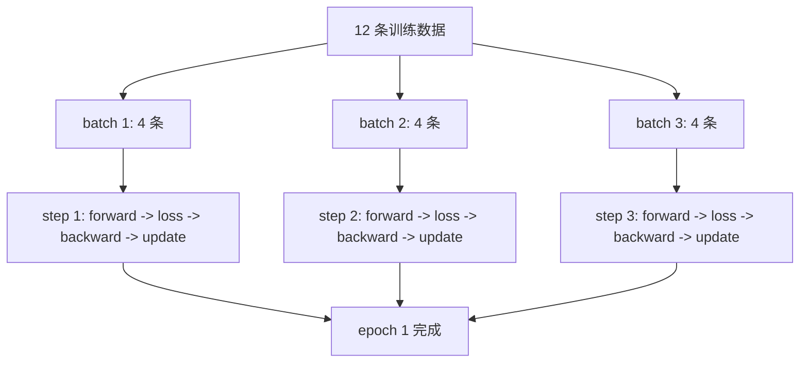
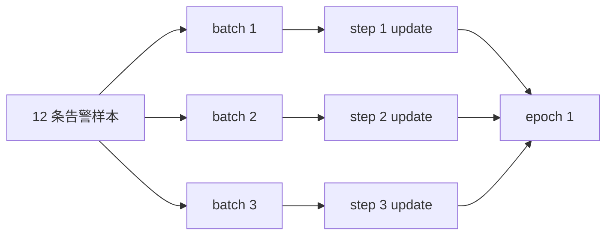

# P5-6.2 学习 step、batch、epoch

Section ID: `P5-6.2`
Version: `v2026.07.17`

在 P5-6.1 里，我们先把 `forward -> loss -> backward -> optimizer step` 这一条最小学习循环绑在一起。走到这里以后，下一个问题会马上出现。

这一次循环在真实训练里会重复多少次，而这些重复单位到底应该分别叫什么？

如果不先理清这个问题，step、batch、epoch 很容易全都混成`只是多跑几次`。但这三个词其实是在用不同层位指向同一个训练过程里的不同重复单位。

step 是一次更新单位，batch 是这个 step 里一起处理的样本束，epoch 则是把整份训练数据完整看过一遍的重复。

光靠这一句话，读者往往还是抓不牢。很多人能理解`模型会反复运行`，但会卡在：这里其实是用不同标准去数`哪一次算一次`。因为有的句子以 step 为标准，有的日志先把 batch 摆出来，有的实验报告又只写 epoch 数。

所以这一节更安全的做法，不是让人死记三个定义，而是先把它们理解成：`用三把不同的尺子去量同一个学习过程`。batch 量的是`一次放进去多少`，step 量的是`处理完这束数据并完成了几次更新`，epoch 量的是`整份数据转了几圈`。

如果打个比方，batch 像一次放到工作台上的一束材料，step 像把这束材料处理完并把结果记入一次的次数，而 epoch 则更接近于把仓库里的整批材料完整看过一轮的次数。比喻本身不能替代概念，但它确实有助于先抓住：这三个词所数的`一次`并不是同一种一次。

如果这几个单位后来又混在一起，更适合回到[英文概念词汇表里的 batch 条目](/AiBook/en/reference/concept-glossary/#batch)、[training 条目](/AiBook/en/reference/concept-glossary/#training)、[epoch 条目](/AiBook/en/reference/concept-glossary/#epoch)，先把它们重新拆开。

## 本节范围

- step、batch、epoch 各自在数什么？
- P5-6.1 里的学习循环，如何按 batch 与 step 重复？
- 为什么 epoch 不是`更新一次`，而是`把整份数据看完一次`？
- 为什么先搞清楚这些单位，后面区分 learning 和 inference 时会更不容易混淆？

这一节专注于区分学习循环的`重复单位`。也就是说，这里默认你已经知道一次循环内部的计算顺序是什么，现在要闭合的是：这个顺序在真实数据束上是怎样被重复执行的。

这也意味着：本节不是重新解释 forward、loss、backward、update 各自是什么的位置。那些问题已经在 P5-6.1 里先闭合过；这一节要整理的是：为什么真实训练日志里会同时出现 `step 1200`、`epoch 4`、`batch size 32` 这种不同名字。

同样，这一节不会立刻扩大的问题也要明确。`这个重复是会真正改变参数的学习过程，还是只是在使用当前参数运行？` 这一点会在下一节 P5-6.3 接着说明。即便都在使用同一组参数，为什么还要再分 training mode 和 evaluation mode，则会在 P5-6.4 再解释。

## 本节目标

- 能把 step、batch、epoch 解释成三个不同的重复单位。
- 能说明 P5-6.1 的一次学习循环会对每个 batch 作为一个 step 执行。
- 能把 epoch 解释成`把整份数据完整看过一次的次数`。
- 能用一个很简单的 Python 例子确认：step 和 epoch 是怎样累积的。

## 把 step、batch、epoch 放进同一个场景里看

假设训练数据一共有 12 条，batch size 是 4。

- 一次会把 4 个样本成束送进模型。
- 处理完这一个 batch 并发生一次 update，就结束了 step 1。
- 这样的 batch 一共经过 3 个以后，就代表 12 条数据都被完整看过一遍，所以 epoch 1 才结束。

读者之所以容易在这个场景里混乱，是因为`看了 12 条训练数据`和`只做了 3 次更新`可以同时成立。样本一共看了 12 个，但 update 只发生了 3 次。也就是说，`看了多少样本`和`更新了几次`并不一定是同一个数字。

这里如果把 batch size 改掉，step 数也会跟着变。还是同样 12 条数据，如果 batch size 是 6，那么 step 只有 2 次；如果 batch size 是 3，那么 step 就会有 4 次。相反，epoch 1 次这一点并不会改变，因为把整份数据完整看过一遍这一事实仍然是一样的。

如果想更直接地读出这个差别，最好把`什么固定不变`与`什么会跟着改变`分开看。

| 改动的东西 | 保持不变的东西 | 会一起变化的东西 |
| --- | --- | --- |
| batch size | 把 12 条数据完整看过一遍这件事 | 需要几个 step |
| 整体数据条数 | `step 是 update 单位`这个定义 | 一个 epoch 里有多少 batch |
| epoch 数 | 一个 batch 对应一个 step 的结构 | 数据集被完整重复几次 |

先要从这张表里确认的结果，是：改 batch size 改变的不是`学习是什么意思`，而是`要把学习切成多少束来做 update`。

如果把这个场景再简单画一下，就是下面这样。



这张图里最先要确认的结果，是：`step` 会在每次处理完一个 batch 之后增加一次，而 `epoch` 只有在所有 batch 都处理完以后才增加一次。

## 为什么必须先有这个区分

深度学习入门里常见的混淆是下面这些。

- 只把数据放进去一次，就觉得一个 epoch 已经结束了
- 只处理完一个 batch，就觉得整份数据都学过了
- 把 step 和 epoch 都粗略地读成`学习次数`，结果错过了差别

但如果回到刚才的场景，这三个词实际数的是不同对象。

| 术语 | 先数的是什么 | 最短的说明 |
| --- | --- | --- |
| batch | 一个 step 里一起处理的样本束 | `输入束` |
| step | 发生一次 update 的次数 | `学习循环执行一次` |
| epoch | 整份训练数据被完整看过的次数 | `完整轮转一次` |

之所以必须这样区分，是为了不把`一次循环`和`整份数据的重复`混成一件事。P5-6.1 讲的是一次循环内部按什么顺序发生；这一节讲的是这个循环在真实训练里会按什么束、重复多少次。

从初学者角度看，这里更适合再放慢一步来想。训练过程通常不会在画面上只以一种数字出现。有的地方只显示 `epoch=3`，有的日志只看到 `step=4800`，有的说明又先说`把 batch size 调大了`。如果把这三个词读成同义词，那么`训练了三次`、`更新了三次`、`每次放三个样本进去`就会缠在一起。

所以这一节的目标，不是做一本简单的术语词典，而是让读者在阅读训练过程时，先能分辨：`眼前这个数字到底在数什么。`

特别是读日志时，更安全的顺序通常是下面这样。

1. 先看 `batch size` 是多少。
2. 再看一个 epoch 里会被切成多少个 batch。
3. 再看每处理完一个 batch，step 会增加多少。
4. 最后确认：是不是所有 batch 都跑完以后，epoch 才结束一次。

抓住这个顺序以后，即使看到 `step 2000` 这样的数字，也不容易误以为它表示`把整份数据完整转了 2000 次`；它更接近于`已经发生了 2000 次 update`。

## batch 指的是什么

理论上，完全可以对每一个样本立刻更新一次，也可以把整份数据一次性全塞进去。但在真实训练里，这两头通常都不太方便。

- 如果每次只看一个样本，gradient 可能会摇摆得太厉害。
- 如果一次把整份数据都放进去，内存和计算量负担又可能太大。

所以 batch 会成为一个运行单位：让训练既不是太碎，也不是太大。换句话说，batch 指的是`这个 step 里模型会一起看的那一束样本`。

这里最重要的一点是：batch 不是`数重复次数`的名字，而是`在一个 step 里一起处理的数据束`的名字。理解 batch 时，先该想到的画面是`这次 update 前到底把数据切成多大一束送上来`，而不是`总共学了几次`。

比如有 320 张图像数据，batch size 是 32，那么模型通常会一次看 32 张。这样整整 320 张数据转完一圈时，就会形成 10 个这样的数据束。这时 batch 指的是`32 张`这束大小，而这些束重复了几次，则是 step 或 epoch 另外去数。

读者在这里最容易忽略的是：`调 batch size` 到底是什么意思。它通常是指`一次 step 里模型同时看多少个样本`，而不是直接改变 epoch 的意思。当然，batch size 一旦变化，同样完整转一遍数据时所需的 step 数也会改变，所以训练日志的形状会间接受到影响。但这个名字直接指向的对象始终是`束的大小`。

所以当有人说`把 batch size 从 32 改成 64`时，更适合先读成：`一次一起看的样本数变多了`。然后再往下推：`那么完整跑一遍数据时，需要的 step 数会减少。` 如果把这个顺序倒过来，batch 和 step 的职责就很容易重新缠在一起。

因此，在读 batch 时最后要抓住的核心很简单。batch 是在说`一次打包多少个`。它本身并不告诉你整场训练完整重复了几次，而是在说明：一次 update 之前摆在模型前面的输入束到底有多大。

## step 指的是什么

如果把 step 简单读成`forward 做了一次`，那学习循环的核心就会变得模糊。正如 P5-6.1 已经看到的，学习循环真正闭合的是 `forward -> loss -> backward -> optimizer step`。

因此，本书里更安全的理解是下面这句话。

`step 是利用一个 batch 计算损失、求出 gradient、再把参数更新一次的单位。`

也就是说，step 与其说是`看了一次输入`，不如说更接近`完成了一次 update`。理解 step 时，首先应该想到的是：`到现在为止，模型内部数字究竟被改过几次。`

例如 batch size 是 32，数据总数是 320，那么一个 epoch 里通常会有 10 个 batch，update 也就会发生 10 次。这时 step 会在每经过一个 batch 时增加 1。所以 `step 7` 更接近于`第七次 update 已经完成`，而不是`只看了七个样本`。

这个差别在后面区分 learning 和 inference 时也非常重要。step 这个词本来就是和`学习循环里的 update`一起读的，因此不适合直接拿来和服务里`输入被处理了几次`画等号。这里还不深入展开那层差异，但为什么 step 要以 update 为中心定义，最好在这里先抓住。

在真实日志里还常会见到 `global step` 这个表达，它通常也更接近于`累计发生了多少次 update`。所以即使 step 数很大，也不能只靠它一个数字就直接知道整份数据已经完整看了几轮，还必须把 batch size 和 epoch 信息一起看。

因此，读 step 时最后要固定的核心也很明确。step 与其说是`学习循环跑了一次`，更精确地说，是`发生了一次 update`。所以 step 数最安全的理解方式，是把它当成`模型被修改了多少次`这个数字。

## epoch 指的是什么

epoch 是比 step 更大的单位。只有把整份训练数据完整读完一次以后，epoch 1 次才算结束。

比如：

- 数据 100 条
- batch size 10

那么一个 epoch 里通常会包含 10 个 step。

也就是说，epoch 不是一次学习循环，而是`由多个 step 组成的一次数据全集轮转`。理解 epoch 时，首先该想到的画面是：`到目前为止，整份数据集被完整转过几圈。`

如果有 1,000 条数据，用 batch size 100 来训练，那么模型通常会在一个 epoch 内经历 10 个 step。这时`epoch 1 结束了`的意思是`1,000 条数据已经完整看过一遍`，而在这过程中 update 已经发生了 10 次。也就是说，epoch 不是在数某一次 update，而是在数`整份数据的完整重复`。

读者看到 `epoch 10` 这样的表达时，很容易把它含糊地理解成`训练了 10 次`。这种说法不能算全错，但更精确的意思是：`把整份数据完整重复看了 10 遍。` 其中其实包含了按 batch 数量累积起来的更多 step。

所以读训练记录时，最好不要只看`epoch 有几次`，而要一起看：`一个 epoch 里有多少个 step`、`batch size 是多少。`

这一点在后面比较实验结果时也很重要。两个实验都写着 `epoch 5`，如果 batch size 不同，那么一个 epoch 里包含的 step 数就可能不同。反过来，即使 step 数相同，只要数据量或 batch size 不同，epoch 数也会不同。所以在比较之前，必须先拆开：你到底在用哪个数字作为基准。

因此，读 epoch 时最后要抓住的核心是：它不是直接告诉你`训练强度有多大`，而是在说`整份数据集被完整重复看了几次`。所以只看 epoch 一个数字，并不能把训练过程全部读完；还需要同时看：在这些 epoch 里到底发生了多少个 step。

## 先抓住 6.2 与 6.3 的边界

P5-6.2 后面会接 P5-6.3 去区分 learning 和 inference。它们都常常和`训练在反复运行`这类说法一起出现，所以第一次读时容易粘在一起。因此，最好先把问题拆成两个层次。

| 先回答的问题 | 本节的答案 | 下一节的答案 |
| --- | --- | --- |
| 学习循环按什么单位重复？ | 区分 step、batch、epoch。 | 这个问题已经先结束了。 |
| 眼前这个重复是在改变参数，还是只是在使用当前参数？ | 这一节暂时还不处理。 | 会去区分 learning 与 inference。 |

也就是说，P5-6.2 是划分`重复单位`的一节，而 P5-6.3 则是在这之后再划分`参数是否变化`的一节。

## 案例与示例

### 案例. 把 12 条告警数据分成三次来训练

假设一共有 12 条设备告警数据，一次按 4 条一束来训练。人如果只看到屏幕上的`训练中...`字样，很容易想象模型会一次把整份数据都读完。但真实训练日志里，通常先看到的不是整份数据，而是一个接一个的小 batch。

| 区分 | 实际在数什么 | 这个案例里的值 |
| --- | --- | --- |
| batch size | 一个 step 里一起处理的样本数 | 4 |
| step 数 | 处理完一个 batch 并完成 update 的次数 | 3 |
| epoch 数 | 把 12 条数据完整看过一次的次数 | 1 |

这个场景里首先要确认的结果，是：`看过了 12 条数据`并不等于 step 发生了 12 次。只要 batch size 是 4，实际 update 就只发生 3 次。

如果把数字再改一改，这个差别会更明显。同样 12 条数据，batch size 如果是 1，step 会变成 12 次；如果 batch size 是 12，step 就只会有 1 次。也就是说，数据量相同，但如果打包方式不同，`更新了几次`就完全可能不同。

| 人最容易先看的标准 | 重新用 step/batch/epoch 视角读出来的标准 |
| --- | --- |
| 放进去了 12 条数据，所以应该训练了 12 次 | 如果每 4 条打成一个 batch，那么 update 可能只发生了 3 次 |
| 说跑了一次训练，所以应该只有一个 step | 如果指的是把整份数据完整看了一遍，那更可能是 epoch 1 次 |
| batch 只是表示一小部分数据 | batch 是`一个 step 里一起处理的一束数据`这个运行单位 |

如果把这个案例再压缩一次，大致可以画成下面这样。



这张图的作用，不是补充更多公式，而是固定`整份数据 -> batch 分束 -> step 累积 -> epoch 完成`的阅读顺序。

## 练习与例子

这一节例子的目标，是确认：同样一小组训练数据，会因为 batch size 不同而被切成多少个 step，以及 epoch 在什么时候才算结束。这里的代码不是为了展示复杂模型训练，而是为了让人直接看到`重复单位`。

这个例子故意几乎不放入模型计算。因为本节核心不是性能，也不是损失下降，而是：能不能不把`step、batch、epoch`混成一个概念。换句话说，这里需要看的不是准确率，而是`哪一行让 step 增加，哪一行让 epoch 结束。`

输入：

- 6 条告警数据
- batch size 2
- epoch 数 2

输出：

- 每个 epoch 里，哪个 batch 以第几个 step 被处理
- 全部累计的 step 数
- epoch 的结束时点

问题场景：

- 如果把 step、batch、epoch 都粗略地读成`训练次数`，真实日志的解释就会摇晃

需要确认的概念：

- batch 是一个 step 里一起处理的一束数据
- 处理完一个 batch 并发生一次 update，step 就增加 1
- 把整份数据完整看过一次，epoch 才增加 1

```python
samples = [
    {"alarm_count": 1, "target": 2},
    {"alarm_count": 2, "target": 4},
    {"alarm_count": 3, "target": 6},
    {"alarm_count": 4, "target": 8},
    {"alarm_count": 5, "target": 10},
    {"alarm_count": 6, "target": 12},
]

batch_size = 2
epochs = 2
global_step = 0

for epoch_index in range(epochs):
    print(f"epoch {epoch_index + 1} start")

    for batch_start in range(0, len(samples), batch_size):
        batch = samples[batch_start:batch_start + batch_size]
        global_step += 1
        batch_alarm_counts = [row["alarm_count"] for row in batch]
        print(
            f"  step {global_step}: "
            f"batch_samples={batch_alarm_counts}"
        )

    print(f"epoch {epoch_index + 1} end")
    print("---")
```

```text
epoch 1 start
  step 1: batch_samples=[1, 2]
  step 2: batch_samples=[3, 4]
  step 3: batch_samples=[5, 6]
epoch 1 end
---
epoch 2 start
  step 4: batch_samples=[1, 2]
  step 5: batch_samples=[3, 4]
  step 6: batch_samples=[5, 6]
epoch 2 end
---
```

在这段输出里，首先要看到的是：因为 batch size 是 2，所以 6 条样本在每个 epoch 里都会被切成 3 个 batch。然后再确认：每处理完一个 batch，step 就加 1；而只有 3 个 batch 全部结束以后，epoch 才结束一次。

现在也可以自己再改几个数字试试看。把 `batch_size` 改成 3，那么每个 epoch 里只会看到 2 个 step；把 `batch_size` 改成 1，那么每个 epoch 里会看到 6 个 step。但无论哪一种情况，只有在 6 条样本全部看完以后，epoch 才会结束，这一点不会变。只要抓住这个感觉，就不容易再把 step、batch、epoch 读成同一种数字。

这里最后还要固定的核心很简单。batch 是`打包单位`，step 是`更新单位`，epoch 是`整轮重复单位`。它们都在描述学习的重复，但并不是拿不同名字去叫同一个数字。

## 检查清单

- 能区分 step、batch、epoch 各自在数什么吗？
- 能把 step 解释成`完成一次 update`吗？
- 能把 epoch 解释成`把整份数据完整看过一次的重复`吗？
- 能说明 P5-6.1 的一次学习循环，在真实训练中会按 batch 变成很多个 step 吗？
- 能区分下一节 P5-6.3 讨论的 learning/inference 问题，不是重复单位，而是参数是否变化的问题吗？
