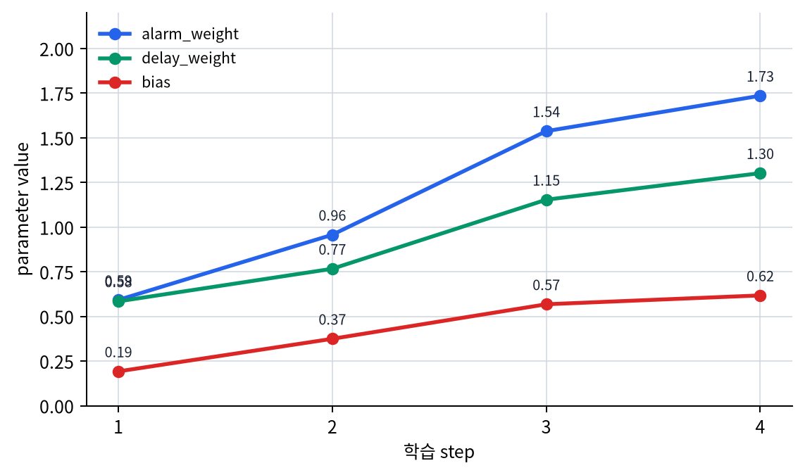
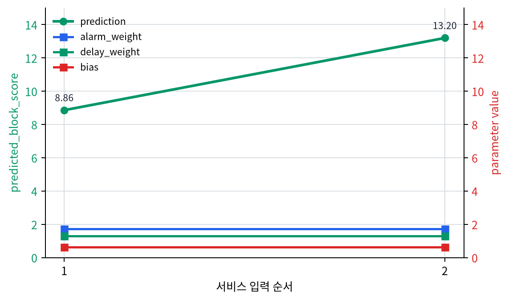

# P5-6.3 학습(learning)과 모델 실행(inference)

Section ID: `P5-6.3`
Version: `v2026.07.17`

P5-6.2에서는 학습 루프가 step, batch, epoch 단위로 어떻게 반복되는지 먼저 묶었습니다. 여기까지 오면 다음 질문이 생깁니다.

gradient까지 계산했다면, 지금 이 모델은 학습 중인가, 아니면 그냥 사용 중인가?

이 질문은 매우 중요합니다. 독자는 모델이 언제나 같은 방식으로 작동한다고 생각하기 쉽지만, 여기서 먼저 갈라야 할 경계는 계산 규칙의 세부 차이가 아니라 `파라미터를 바꾸는 절차인가`와 `이미 배운 파라미터를 쓰는 절차인가`입니다.

학습(learning)은 모델 파라미터를 바꾸는 단계이고, 모델 실행(inference)은 바꾸지 않고 현재 파라미터로 결과를 계산하는 단계이다.

학습과 모델 실행의 구분이 뒤 절에서 다시 흐려지면 개념사전의 [학습(training)](../../../reference/concept-glossary.md#training)과 [추론(inference)](../../../reference/concept-glossary.md#inference) 항목을 함께 다시 보는 편이 좋습니다.

## 이 절의 범위

- 학습과 모델 실행은 왜 구분해야 하는가?
- 딥러닝 문맥에서 학습 단계는 무엇을 포함하는가?
- 모델 실행 단계에서는 무엇이 달라지는가?
- 같은 모델이라도 학습 중과 사용 중에 읽는 관점이 왜 다른가?

이 절에서는 `파라미터를 실제로 바꾸는 시간`과 `바꾸지 않고 현재 모델을 쓰는 시간`을 구분하는 데 집중합니다. 즉, 여기서는 learning과 inference를 `업데이트 경로가 붙는가`를 기준으로 먼저 닫습니다.

대신 이번 절에서 바로 넓히지 않을 질문도 분명합니다. `현재 파라미터를 쓰는 구간 안에서 계산 규칙을 어떻게 둘 것인가`는 아직 다음 질문입니다. 같은 모델이라도 학습 중과 평가 중에 계산 규칙이 왜 달라질 수 있는지는 다음 Section인 P5-6.4에서 이어서 설명합니다. dropout과 regularization의 큰 의미는 P5-8.1, P5-8.2에서 다시 연결합니다.

## 이 절의 목표

- 학습과 모델 실행을 `파라미터 변경 여부`로 구분할 수 있습니다.
- 학습이 순전파만이 아니라 손실 계산, 역전파, 업데이트까지 포함한다는 점을 설명할 수 있습니다.
- 모델 실행은 결과를 계산하지만 파라미터를 바꾸지 않는 단계라는 점을 말할 수 있습니다.
- 실행 가능한 Python 예제로 두 단계의 차이를 확인할 수 있습니다.

## 왜 이 구분이 중요한가

딥러닝 입문에서 흔한 오해는 다음과 같습니다.

- 데이터를 넣고 결과가 나오면 그게 곧 학습이다
- 모델이 한 번 결과를 냈으니 이미 배웠다
- 예측을 여러 번 하면 모델이 점점 더 좋아진다

하지만 실제로는 그렇지 않습니다.

모델이 좋아지려면 다음 단계가 필요합니다.

1. 현재 파라미터로 예측을 만듭니다
2. 정답과 비교해 손실을 계산합니다
3. gradient를 계산합니다
4. optimizer가 파라미터를 업데이트합니다

즉, 단순히 `결과를 낸다`는 사실만으로는 학습이 일어나지 않습니다.

`결과 계산은 inference에서도 할 수 있지만, learning은 그 결과를 이용해 모델 내부 숫자를 실제로 바꾸는 과정까지 포함한다.`

여기서 먼저 고정할 질문은 하나입니다.

`지금 보고 있는 절차가 파라미터 업데이트까지 이어지는가, 아니면 현재 파라미터로 출력만 계산하는가?`

이 질문에 답하면 learning과 inference의 1차 경계는 잡힙니다. 아직 같은 파라미터 사용 구간 안에서 dropout이나 batch normalization이 어떻게 달라지는지는 묻지 않습니다. 그 질문은 `파라미터를 바꾸는가`가 아니라 `같은 파라미터를 어떤 계산 규칙으로 사용할 것인가`에 관한 다음 단계 질문이기 때문입니다.

## 딥러닝에서 학습(learning)은 무엇을 포함하나

여기서는 딥러닝 문맥의 학습을 다음 네 단계 묶음으로 이해하면 충분합니다.

| 단계 | 역할 |
| --- | --- |
| 순전파(forward pass) | 현재 파라미터로 예측을 계산 |
| 손실 계산(loss computation) | 예측과 정답의 차이를 숫자로 계산 |
| 역전파(backpropagation) | 각 파라미터에 대한 gradient를 계산 |
| 업데이트(update) | optimizer가 파라미터를 실제로 바꿈 |

이 네 단계가 모두 있어야 `학습이 한 번 일어났다`고 말할 수 있습니다.

즉, 딥러닝에서 learning은 단순히 데이터를 많이 보는 일이 아니라, `손실을 기준으로 파라미터를 반복적으로 조정하는 일`입니다.

## 모델 실행(inference)은 무엇을 하는가

모델 실행(inference)은 현재 파라미터를 고정한 채 입력에 대한 결과를 계산하는 단계입니다.

예를 들어:

- 사용자가 사진을 올리면 분류 결과를 보여 줍니다
- 설비 점검 메모를 넣으면 위험 요약 결과를 돌려줍니다
- 문서 일부를 넣으면 다음 토큰을 생성합니다

이때 모델은 계산을 합니다. 하지만 그 계산이 곧바로 파라미터 업데이트를 뜻하지는 않습니다.

즉, inference는 `현재 알고 있는 것을 사용해 답을 만드는 단계`입니다.

`learning은 모델을 바꾸는 시간이고, inference는 바꾸지 않고 쓰는 시간이다.`

## 같은 순전파라도 의미가 다르다

여기서 중요한 점이 하나 더 있습니다. 학습과 실행 모두 순전파(forward pass)를 사용합니다. 그래서 독자는 둘이 비슷해 보일 수 있습니다.

하지만 목적이 다릅니다.

- 학습 중의 순전파: 손실 계산과 업데이트를 위한 중간 단계
- 실행 중의 순전파: 최종 결과를 내기 위한 계산

즉, `같은 계산처럼 보여도 왜 계산하는가`가 다릅니다. 이 절에서 묻는 것은 forward의 세부 설정이 아니라, 그 forward가 `loss -> gradient -> update`로 이어지는가입니다.

이를 아주 단순하게 그리면 다음과 같습니다.

```mermaid
--8<-- "assets/part-05/chapter-06/training-vs-inference-flow-ko.mmd"
```

이 도식에서 확인해야 할 결과는 같은 예측값이라도 학습 단계에서는 손실 계산과 업데이트로 이어지고, 실행 단계에서는 바로 사용자 결과로 이어진다는 점입니다.

- 학습에서는 예측 뒤에 `얼마나 틀렸는지`를 계산하고 파라미터를 바꾸는 단계가 붙습니다.
- 실행에서는 예측이 곧바로 사용자에게 보여 줄 결과나 다음 시스템 단계 입력이 됩니다.

## 왜 inference를 번역어 하나로만 옮기면 혼동이 생기나

Part 1에서도 보았듯이 문제의 핵심은 특정 언어의 번역어 하나가 여러 개념 자리를 한꺼번에 덮는 데 있습니다. 한국어에서는 `추론`이 reasoning, inference, prediction을 한데 섞어 들리게 만들 수 있고, 다른 언어에서도 지역어 표현 하나가 여러 표준 용어를 동시에 덮으면 같은 문제가 생깁니다. 그래서 이 절에서는 `어떤 사고를 하는가`, `학습된 모델을 실행하는가`, `무엇을 출력했는가`를 번역어 하나로 눌러 부르지 않는 편이 안전합니다.

딥러닝 문맥에서 inference는 보통 `학습된 모델을 실행해 현재 파라미터로 출력값을 계산하는 단계`를 가리킵니다. 즉, 이 절에서 inference는 `깊은 사고`, `논리 전개`, `미래 결과 예측`과 바로 같은 말이 아니라, 모델 실행 절차에 더 가깝습니다.

| 표현 | 먼저 물을 질문 | P5-6.1에서 다른 점 | 이 절에서 안전한 표현 |
| --- | --- | --- | --- |
| `reasoning` | 근거를 따라 결론에 이르는 사고 과정을 말하는가? | 모델 파라미터를 사용하는 실행 단계 자체가 아니라 설명·논리 전개 쪽입니다. | `reasoning`, `논리적 추론`, `사고 과정` |
| `inference` | 학습된 모델을 새 입력에 적용하는가? | 현재 파라미터로 forward를 수행해 출력을 계산하지만 update는 붙지 않습니다. | `모델 실행(inference)`, `모델 적용` |
| `prediction` | 모델이 낸 출력값은 무엇인가? | inference로 만들어진 결과값입니다. 과정이 아니라 출력 쪽 표현입니다. | `prediction`, `예측`, `모델 출력` |
| `generation` | 텍스트나 토큰 같은 산출물을 만들어 내는가? | LLM 실행에서는 inference 결과가 생성 텍스트처럼 보일 수 있지만, 생성 행위와 모델 실행 단계를 같은 말로 묶지는 않습니다. | `generation`, `생성` |

이 절에서 말하는 inference의 기본 뜻은 다음 세 단계입니다.

- 입력을 넣고
- 현재 파라미터로 계산하고
- 출력을 만든다

즉, 여기서 핵심은 `얼마나 깊게 생각했는가`가 아니라 `현재 모델을 실행해 출력이 계산되었는가`입니다.

따라서 이 절에서는 지역어 번역만 단독으로 쓰기보다 `모델 실행(inference)`이라는 병기를 유지해 두는 편이 더 안전합니다. 이후 다른 언어판에서도 같은 자리에 `reasoning`, `inference`, `prediction`, `generation`을 다시 섞지 않고, `학습된 모델 실행 단계`라는 역할을 중심으로 옮겨야 합니다.

## 6.3과 6.4의 경계 먼저 잡기

P5-6.3과 다음 절 P5-6.4는 모두 `학습 중`과 `사용 중`이라는 말을 다루기 때문에 처음 읽으면 붙어 보일 수 있습니다. 그래서 여기서는 질문을 두 층으로 분리해 두는 편이 안전합니다.

| 먼저 답할 질문 | 이 절에서의 답 | 다음 절에서의 답 |
| --- | --- | --- |
| 지금 이 절차가 모델 파라미터를 바꾸는가? | learning이면 바꾸고, inference면 바꾸지 않습니다. | 이 질문은 이미 끝난 전제입니다. |
| 파라미터를 안 바꾸는 구간에서도 계산 규칙이 항상 같아야 하는가? | 여기서는 아직 다루지 않습니다. | training mode와 evaluation mode가 왜 갈리는지 다룹니다. |

즉, P5-6.3은 `업데이트 경로 유무`를 가르는 절이고, P5-6.4는 그다음에 `같은 모델 실행이라도 어떤 계산 상태로 써야 하는가`를 가르는 절입니다.

## 사례 및 예시

### 사례. 같은 경보를 두 실행 로그로 나누어 보기

운영자가 새 설비 경보 로그 한 건을 넣어 `즉시 정지`, `현장 확인`, `기록만` 같은 분류 결과를 보는 장면을 떠올려 볼 수 있습니다. 사람은 화면에 판정 결과가 바로 나오면 모델이 그 로그를 보고 곧바로 더 배웠다고 느끼기 쉽습니다. 하지만 이 장면을 learning과 inference로 구분하려면 `새 입력을 보았는가`보다 `update 경로가 붙었는가`를 먼저 봐야 합니다.

같은 경보 입력도 두 실행 로그로 나누면 차이가 분명해집니다.

| 실행 로그 | 실제로 이어지는 단계 | 파라미터 변화 |
| --- | --- | --- |
| 서비스 실행 로그 | `alarm_count -> forward -> predicted_block_score -> 운영 화면 출력` | 없음 |
| 학습 로그 | `alarm_count -> forward -> target_block_score와 비교 -> loss -> gradient -> update` | 있음 |

서비스 실행 로그에서는 현재 파라미터들로 위험 점수를 계산해 운영 화면에 보여 줍니다. 입력이 달라지면 `predicted_block_score`도 달라질 수 있지만, 그 자체가 파라미터 변경을 뜻하지는 않습니다. 반대로 학습 로그에서는 같은 종류의 입력이라도 정답 역할을 하는 `target_block_score`와 비교하고, 손실과 gradient를 계산한 뒤 update가 붙어야 파라미터가 실제로 바뀝니다. 그래서 이 사례에서 확인해야 할 결과는 결과 화면이 바뀌었는가가 아니라, `loss -> gradient -> update`가 실제로 붙어 파라미터가 바뀌었는가입니다.

| 사람이 먼저 보기 쉬운 기준 | learning/inference 관점으로 다시 읽는 기준 |
| --- | --- |
| 새 입력을 처리했으니 모델도 바로 더 배웠을 것 같다 | 출력 계산만 했고 파라미터 업데이트는 없을 수 있다 |
| 결과가 달라졌으니 모델 내부 숫자도 바뀌었을 것 같다 | 입력이 달라져 출력이 달라진 것과 파라미터 변경은 별개다 |
| 많이 쓰면 저절로 학습될 것 같다 | 손실, gradient, update 절차가 실제로 있어야 learning이다 |

이 장면은 검사 이미지 데모나 LLM 채팅에도 그대로 옮겨 갈 수 있습니다. 검사 화면에 이미지를 올리거나, 채팅창에 질문을 다시 쓰거나, 경보 로그를 새로 넣는 일은 모두 inference일 수 있습니다. 출력이 매번 달라져도 update 경로가 붙지 않으면 파라미터는 그대로입니다.

이 사례를 learning과 inference로 다시 묶으면 차이는 `결과가 나왔는가`가 아니라 `그 결과가 파라미터를 실제로 바꾸는 계산으로 이어졌는가`에 있습니다.

| 장면 | 사람이 먼저 보기 쉬운 결과 | learning/inference 관점에서 실제로 구분해야 할 것 | 파라미터가 바뀌는가 |
| --- | --- | --- | --- |
| 서비스 실행 로그 | 새 경보 결과가 바로 나왔다 | 현재 파라미터로 forward만 했는지 본다 | 바뀌지 않음 |
| 학습 로그 | 경보 샘플과 목표값을 비교했다 | loss, gradient, update가 실제로 이어졌는지 본다 | 바뀜 |
| 검사 이미지·LLM 채팅 같은 서비스 입력 | 입력을 바꾸자 출력도 달라졌다 | 입력 변화에 따른 출력 변화와 실시간 재학습을 구분한다 | 일반 서비스 사용에서는 바뀌지 않음 |

이 표에서 독자가 먼저 붙잡아야 할 결과는, learning과 inference를 가르는 핵심이 `출력 변화 유무`가 아니라 `손실과 업데이트가 실제로 붙어 파라미터가 바뀌었는가`라는 점입니다.

이 사례를 한 번 더 압축하면, learning과 inference를 읽는 첫 흐름은 다음과 같습니다.

```mermaid
--8<-- "assets/part-05/chapter-06/learning-inference-parameter-bridge-ko.mmd"
```

이 도식은 서비스 실행 로그와 학습 로그를 다시 설명하려는 것이 아니라, `새 입력을 처리해 출력이 달라지는 것`과 `손실-업데이트가 붙어 파라미터가 바뀌는 것`을 한 번에 다시 구분하기 위한 것입니다.

## 연습 및 예제

이번 예제의 목표는 같은 작은 위험 점수 모델이 `학습 배치`를 볼 때는 여러 파라미터를 바꾸고, `서비스 입력`을 볼 때는 그 파라미터들을 바꾸지 않는다는 점을 여러 step으로 확인하는 것입니다. 여기서 코드는 단순히 숫자 한 번을 출력하는 역할이 아니라, `같은 종류의 입력이라도 update 경로가 붙었는가`에 따라 파라미터가 실제로 달라지는지 실험하는 역할을 맡습니다.

입력:

- 학습용 경보 샘플 4개
- 초기 파라미터 `alarm_weight`, `delay_weight`, `bias`
- 학습률 `learning_rate`

출력:

- step별 위험 점수 예측값, 손실, 파라미터 변화
- 학습 완료 뒤 inference 결과
- inference 전후 파라미터 비교
- 같은 위험 가중치로 여러 서비스 입력을 처리했을 때 출력만 달라지는지 확인

문제 상황:

- 학습과 추론은 같은 수식을 써도 목적이 다르므로, 가중치가 업데이트되는 구간과 고정된 구간을 나눠 볼 필요가 있다
- 서비스 입력이 여러 번 들어와도 update가 없으면 파라미터는 그대로인지 직접 봐야 한다

확인할 개념:

- 학습 단계에서는 손실을 줄이기 위해 가중치가 계속 바뀐다
- 추론 단계에서는 학습된 가중치를 고정한 채 결과만 계산한다
- 입력이 달라져 출력이 달라져도 파라미터가 바뀌었다는 뜻은 아니다

입력(input):

학습 배치에서는 `alarm_count`와 `restart_delay_hours`를 받아 `predicted_block_score`를 만들고, 목표값 `target_block_score`와 비교해 `alarm_weight`, `delay_weight`, `bias`를 갱신한다고 가정합니다. 이후 서비스 구간에서는 새 입력이 들어와도 같은 파라미터들을 그대로 사용하는지만 확인합니다.

코드를 보기 전에 먼저 어느 구간에서만 `weight`가 바뀔지 예상해 보면 좋습니다.

| 구간 | 먼저 예상해 볼 비교 | 예상 이유 |
| --- | --- | --- |
| `train step 1~4` | `alarm_weight`, `delay_weight`, `bias`가 달라질 가능성 | 손실과 gradient를 이용해 실제 업데이트를 수행하기 때문입니다. |
| `service input 1` | 출력은 계산되지만 파라미터는 유지될 가능성 | inference는 현재 파라미터를 사용만 하기 때문입니다. |
| `service input 2` | 출력은 달라질 수 있어도 파라미터는 여전히 같을 가능성 | 입력 변화와 파라미터 변화는 별개이기 때문입니다. |

이 표의 목적은 `출력 변화`와 `파라미터 변화`를 분리해서 읽는 것입니다.

이 예제는 아래 세 값을 직접 바꿔 보며 읽어야 실험 역할이 더 분명해집니다.

| 바꿔 볼 값 | 먼저 관찰할 출력 | 해석할 질문 |
| --- | --- | --- |
| `learning_rate`를 0.03에서 0.01, 0.08로 바꾼다 | 세 파라미터가 step마다 얼마나 크게 움직이는가 | 학습은 같은 배치를 보더라도 update 보폭에 따라 파라미터 변화량이 달라지는가 |
| `service_inputs`에 새 입력을 추가한다 | prediction은 달라도 `parameters_used`가 계속 같은가 | 서비스 입력 변화와 파라미터 변화는 별개라는 점이 유지되는가 |
| `service_shadow_sample`의 `target_block_score`를 10.0, 13.0으로 바꾼다 | 같은 서비스 입력에 update를 붙였을 때 `shadow_parameters_after`가 어떻게 달라지는가 | 입력이 아니라 `손실-업데이트 경로`가 붙을 때만 파라미터가 바뀌는가 |

```python
train_alarm_data = [
    {"alarm_count": 1.0, "restart_delay_hours": 2.0, "target_block_score": 4.0},
    {"alarm_count": 2.0, "restart_delay_hours": 1.0, "target_block_score": 5.0},
    {"alarm_count": 3.0, "restart_delay_hours": 2.0, "target_block_score": 8.0},
    {"alarm_count": 4.0, "restart_delay_hours": 3.0, "target_block_score": 11.0},
]

parameters = {
    "alarm_weight": 0.4,
    "delay_weight": 0.2,
    "bias": 0.0,
}
learning_rate = 0.03
service_inputs = [
    {"alarm_count": 4.0, "restart_delay_hours": 1.0},
    {"alarm_count": 5.0, "restart_delay_hours": 3.0},
]
service_shadow_sample = {
    "alarm_count": 4.0,
    "restart_delay_hours": 1.0,
    "target_block_score": 10.0,
}

def predict_block_score(alarm_count, restart_delay_hours, parameters):
    return (
        alarm_count * parameters["alarm_weight"]
        + restart_delay_hours * parameters["delay_weight"]
        + parameters["bias"]
    )

def run_train_step(sample, parameters, learning_rate):
    prediction = predict_block_score(
        sample["alarm_count"],
        sample["restart_delay_hours"],
        parameters,
    )
    target_block_score = sample["target_block_score"]
    loss = (prediction - target_block_score) ** 2
    error = prediction - target_block_score
    gradients = {
        "alarm_weight": 2 * error * sample["alarm_count"],
        "delay_weight": 2 * error * sample["restart_delay_hours"],
        "bias": 2 * error,
    }
    new_parameters = {
        name: value - learning_rate * gradients[name]
        for name, value in parameters.items()
    }
    return {
        "prediction": prediction,
        "loss": loss,
        "gradients": gradients,
        "parameters_after": new_parameters,
    }

print("initial_parameters =", {name: round(value, 3) for name, value in parameters.items()})

for step, sample in enumerate(train_alarm_data, start=1):
    step_result = run_train_step(sample, parameters, learning_rate)
    print(
        f"train step {step}: "
        f"alarm_count={sample['alarm_count']}, "
        f"restart_delay_hours={sample['restart_delay_hours']}, "
        f"target_block_score={sample['target_block_score']}, "
        f"prediction={step_result['prediction']:.3f}, loss={step_result['loss']:.3f}, "
        f"parameters_before={ {name: round(value, 3) for name, value in parameters.items()} }, "
        f"parameters_after={ {name: round(value, 3) for name, value in step_result['parameters_after'].items()} }"
    )
    parameters = step_result["parameters_after"]

parameters_before_inference = parameters.copy()
for service_input in service_inputs:
    print(
        f"inference: alarm_count={service_input['alarm_count']}, "
        f"restart_delay_hours={service_input['restart_delay_hours']}, "
        f"prediction={predict_block_score(service_input['alarm_count'], service_input['restart_delay_hours'], parameters):.3f}, "
        f"parameters_used={ {name: round(value, 3) for name, value in parameters.items()} }"
    )
print("parameters_before_inference =", {name: round(value, 3) for name, value in parameters_before_inference.items()})
print("parameters_after_inference =", {name: round(value, 3) for name, value in parameters.items()})

shadow_result = run_train_step(
    sample=service_shadow_sample,
    parameters=parameters,
    learning_rate=learning_rate,
)
print(
    "same_input_with_update: "
    f"alarm_count={service_shadow_sample['alarm_count']}, "
    f"restart_delay_hours={service_shadow_sample['restart_delay_hours']}, "
    f"target_block_score={service_shadow_sample['target_block_score']}, "
    f"prediction={shadow_result['prediction']:.3f}, loss={shadow_result['loss']:.3f}, "
    f"shadow_parameters_after={ {name: round(value, 3) for name, value in shadow_result['parameters_after'].items()} }"
)
```

출력에서는 학습 단계의 `parameters_before`/`parameters_after` 변화와 inference 단계의 `parameters_used` 불변을 먼저 비교하면 됩니다.

```text
initial_parameters = {'alarm_weight': 0.4, 'delay_weight': 0.2, 'bias': 0.0}
train step 1: alarm_count=1.0, restart_delay_hours=2.0, target_block_score=4.0, prediction=0.800, loss=10.240, parameters_before={'alarm_weight': 0.4, 'delay_weight': 0.2, 'bias': 0.0}, parameters_after={'alarm_weight': 0.592, 'delay_weight': 0.584, 'bias': 0.192}
train step 2: alarm_count=2.0, restart_delay_hours=1.0, target_block_score=5.0, prediction=1.960, loss=9.242, parameters_before={'alarm_weight': 0.592, 'delay_weight': 0.584, 'bias': 0.192}, parameters_after={'alarm_weight': 0.957, 'delay_weight': 0.766, 'bias': 0.374}
train step 3: alarm_count=3.0, restart_delay_hours=2.0, target_block_score=8.0, prediction=4.778, loss=10.384, parameters_before={'alarm_weight': 0.957, 'delay_weight': 0.766, 'bias': 0.374}, parameters_after={'alarm_weight': 1.537, 'delay_weight': 1.153, 'bias': 0.568}
train step 4: alarm_count=4.0, restart_delay_hours=3.0, target_block_score=11.0, prediction=10.174, loss=0.682, parameters_before={'alarm_weight': 1.537, 'delay_weight': 1.153, 'bias': 0.568}, parameters_after={'alarm_weight': 1.735, 'delay_weight': 1.302, 'bias': 0.617}
inference: alarm_count=4.0, restart_delay_hours=1.0, prediction=8.859, parameters_used={'alarm_weight': 1.735, 'delay_weight': 1.302, 'bias': 0.617}
inference: alarm_count=5.0, restart_delay_hours=3.0, prediction=13.197, parameters_used={'alarm_weight': 1.735, 'delay_weight': 1.302, 'bias': 0.617}
parameters_before_inference = {'alarm_weight': 1.735, 'delay_weight': 1.302, 'bias': 0.617}
parameters_after_inference = {'alarm_weight': 1.735, 'delay_weight': 1.302, 'bias': 0.617}
same_input_with_update: alarm_count=4.0, restart_delay_hours=1.0, target_block_score=10.0, prediction=8.859, loss=1.302, shadow_parameters_after={'alarm_weight': 2.009, 'delay_weight': 1.37, 'bias': 0.686}
```

여기서는 학습 step에서 `alarm_weight`, `delay_weight`, `bias`가 실제로 바뀌고, inference에서는 새 입력이 들어와도 같은 파라미터들이 유지된다는 점을 먼저 확인하면 됩니다. 마지막 `same_input_with_update` 줄은 일부러 같은 종류의 입력에도 update를 붙였을 때만 파라미터가 바뀐다는 대비 장면입니다.

- 학습 step에서는 `parameters_before`와 `parameters_after`가 다르므로 파라미터가 실제로 바뀝니다
- inference에서는 서로 다른 입력을 넣어도 `parameters_used`가 계속 같고, `parameters_before_inference`와 `parameters_after_inference`도 같습니다
- `same_input_with_update`에서는 입력 종류가 같아도 손실과 gradient를 붙이면 `shadow_parameters_after`가 실제로 달라집니다
- 즉, 서비스 입력을 많이 넣는다고 자동으로 재학습이 일어나는 것은 아니고, update 경로가 붙을 때만 파라미터가 바뀝니다

그래프로 다시 읽으면 절차 차이가 더 분명합니다. 학습 절차에서는 각 step마다 `alarm_weight`, `delay_weight`, `bias`가 update 뒤에 달라지고, update 후 값이 다음 step의 기준이 됩니다.



모델 실행 절차에서는 서비스 입력이 바뀌면서 `predicted_block_score`는 달라지지만, 같은 구간의 파라미터들은 수평선처럼 고정됩니다. 이 그래프에서 확인할 것은 출력선이 달라진다는 사실보다, 파라미터선이 움직이지 않는다는 사실입니다.



| 구간 | 지금 읽어야 할 핵심 |
| --- | --- |
| `train step 1~4` | 출력과 손실을 본 뒤 실제 update가 붙으므로 파라미터들이 계속 달라집니다. |
| `inference input 1` | 새 입력을 처리해도 현재 파라미터들을 그대로 사용합니다. |
| `inference input 2` | 출력은 달라지지만, 바뀐 것은 입력이지 파라미터가 아닙니다. |

이 결과를 `출력 변화`와 `파라미터 변화` 기준으로 다시 묶으면 차이가 더 또렷합니다.

| 실행 결과에서 보인 차이 | 결과만 보면 남기 쉬운 해석 | learning/inference 관점에서 다시 읽는 해석 |
| --- | --- | --- |
| `train step 1~4`에서 prediction이 계속 달라진다 | 그냥 경보 샘플을 여러 번 본 결과라고 느끼기 쉽다 | 손실과 update가 붙어 파라미터 자체가 바뀌었기 때문이라고 읽는다 |
| 두 inference 입력에서 prediction이 달라진다 | 출력이 달라졌으니 모델도 같이 변했다고 느끼기 쉽다 | 입력만 달라졌고 `parameters_used`는 그대로라고 읽는다 |
| `parameters_before_inference`와 `parameters_after_inference`가 같다 | 출력도 나왔으니 뭔가 학습이 있었을 수 있다고 느끼기 쉽다 | inference는 계산만 했고 파라미터는 고정됐다고 읽는다 |
| `same_input_with_update`에서 `shadow_parameters_after`가 달라진다 | 같은 입력이면 같은 결과만 나올 일이라고 느끼기 쉽다 | 입력 종류보다 `손실-업데이트 경로가 붙었는가`가 파라미터 변화 여부를 결정한다고 읽는다 |

이 표까지 읽고 나면, learning과 inference의 핵심이 `둘 다 forward를 쓴다`가 아니라 `언제 update가 실제로 붙는가`를 구분하는 일이라는 점이 더 분명해집니다.

전통적인 통계 모델과 머신러닝 교육에서도 `학습용 데이터(training data)`와 `예측 단계(prediction stage)`를 구분하는 관점은 오래전부터 중요했습니다. 딥러닝에서는 여기에 역전파, optimizer, 모드 전환 같은 요소가 더해지면서 이 구분이 더 중요해졌습니다.

커리큘럼 관점에서 이 절이 필요한 이유도 분명합니다. 바로 앞의 P5-5.1, P5-5.2에서 gradient가 어떻게 계산되는지 보았다면, 이제 `계산이 되었을 때 언제 실제 업데이트가 일어나고 언제 단순 실행만 하는가`를 구분해야 합니다.

- 역전파를 배운 직후에는 모든 계산이 곧 학습처럼 느껴질 수 있고
- 모델 실행은 단지 `forward만 하는 단순한 단계`처럼 과소평가되기 쉽고
- 뒤에서 나올 dropout, batch normalization, evaluation mode를 이해하려면 먼저 `언제 업데이트가 일어나고 언제 안 일어나는가`를 분명히 알아야 합니다

즉, 이 절은 딥러닝 학습 절차를 운영 관점으로 읽기 시작하는 첫 절입니다.

## 언제 learning과 inference를 먼저 분리해서 읽는가

이 절을 꺼내야 하는 시점은 `모델이 결과를 낸다`는 설명만으로는 파라미터가 실제로 언제 바뀌는지, 언제 고정되는지가 흐려질 때입니다.

| 먼저 보이는 문제 장면 | learning/inference 구분이 먼저 유용한 이유 | 바로 다음에 넘길 질문 |
| --- | --- | --- |
| 결과가 나오면 곧바로 학습이 일어났다고 느껴진다 | 파라미터 변경 여부를 기준으로 학습과 실행을 분명히 가를 수 있습니다. | 같은 모델인데도 모드가 왜 달라지는지 봐야 합니다. |
| 순전파만 보이고 손실·역전파·업데이트가 하나로 섞여 있다 | learning이 update까지 포함하는 절차라는 점을 닫을 수 있습니다. | training/eval mode에서 계산 규칙이 어떻게 달라지는지 이어서 봐야 합니다. |
| 채팅, 분류 데모, 서비스 응답이 실시간 재학습처럼 보인다 | inference는 현재 파라미터를 사용하는 단계라는 점을 분명히 할 수 있습니다. | optimizer가 실제 업데이트를 언제 맡는지 뒤 장에서 봐야 합니다. |
| 학습 데이터 처리와 사용자 요청 처리가 같은 것으로 보인다 | 학습용 계산과 서비스 실행 계산의 목적 차이를 분리할 수 있습니다. | 모드 차이에 민감한 층을 다음 절에서 봐야 합니다. |

## 체크리스트

- 학습(learning)과 모델 실행(inference)이 무엇을 기준으로 나뉘는지 설명할 수 있는가?
- 파라미터를 바꾸는 단계와 고정된 파라미터를 쓰는 단계를 구분할 수 있는가?
- learning은 파라미터를 바꾸는 단계이고, inference는 바꾸지 않고 사용하는 단계라는 점을 설명할 수 있는가?
- 딥러닝 학습은 순전파, 손실 계산, 역전파, 업데이트를 포함한다는 점을 말할 수 있는가?
- inference에서도 forward는 수행되지만 목적과 후속 단계가 다르다는 점을 설명할 수 있는가?
- 결과가 나왔다는 사실만으로 학습이 일어난 것은 아니라는 점을 말할 수 있는가?
- 같은 모델 실행이라도 학습과 서비스 처리를 같은 것으로 말하고 있을 때, learning/inference 구분을 먼저 떠올릴 수 있는가?
- 이 절 다음에는 학습 모드와 평가 모드의 계산 차이를 따로 봐야 한다는 흐름을 알고 있는가?

## 출처와 참고 자료

- Ian Goodfellow, Yoshua Bengio, Aaron Courville, `Deep Learning`, MIT Press, 2016, 확인 날짜: 2026-06-29. [https://www.deeplearningbook.org/](https://www.deeplearningbook.org/){: target="_blank" rel="noopener noreferrer" }
- Christopher M. Bishop, `Pattern Recognition and Machine Learning`, Springer, 2006, 확인 날짜: 2026-06-29.
- Aurélien Géron, `Hands-On Machine Learning with Scikit-Learn, Keras, and TensorFlow`, 3rd ed., O'Reilly, 2022, 확인 날짜: 2026-06-29.
