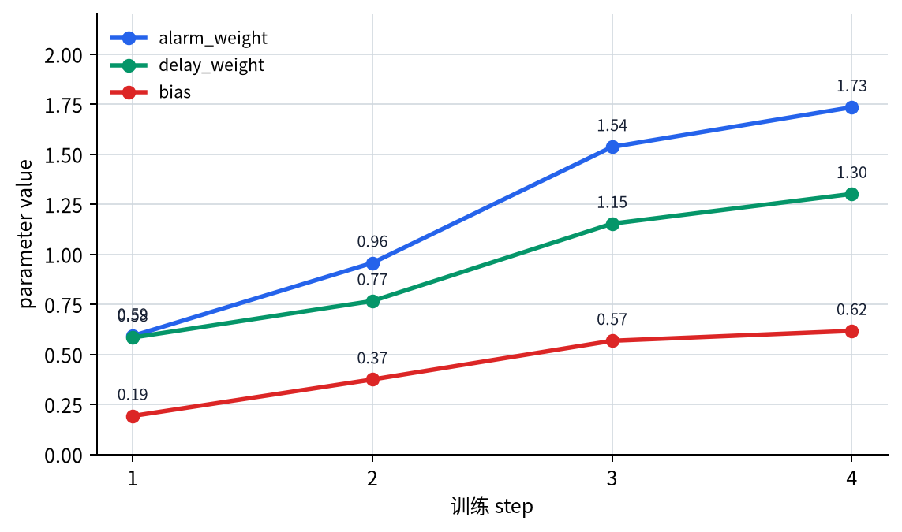
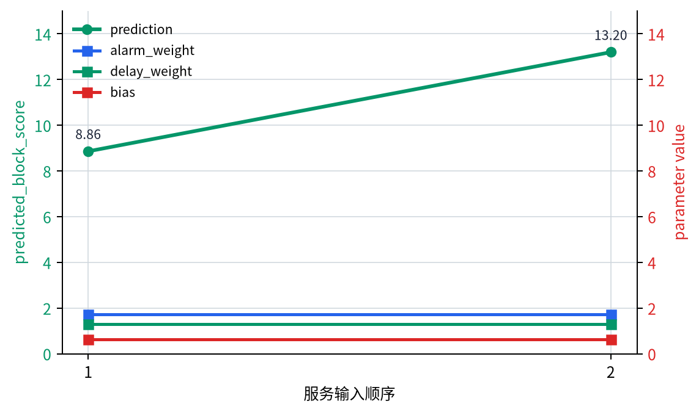

# P5-6.3 学习（learning）与模型执行（inference）

Section ID: `P5-6.3`
Version: `v2026.07.17`

在 P5-6.2 里，我们先把学习循环会按 step、batch、epoch 重复这件事绑在一起。走到这里之后，下一个问题就会冒出来。

如果梯度已经算出来了，那么现在这个模型是在学习，还是只是在被使用？

这个问题非常重要。读者很容易觉得模型总是以同一种方式工作，但这里先要划开的边界，并不是某条具体计算规则的小差异，而是：`这是不是一个会改变参数的过程`，还是`这只是一个使用模型已经学到参数的过程`。

学习（learning）是改变模型参数的阶段，而模型执行（inference）是在不改变参数的前提下，用当前参数计算结果的阶段。

如果后面几节里又开始把学习和模型执行混在一起，更适合回到[英文概念词汇表里的 training 条目](/AiBook/en/reference/concept-glossary/#training)和[inference 条目](/AiBook/en/reference/concept-glossary/#inference)，先重新确认它们的边界。

## 本节范围

- 为什么要区分学习和模型执行？
- 在深度学习语境里，学习阶段包含哪些东西？
- 模型执行阶段有什么不同？
- 为什么同一个模型在学习中和在使用中，需要用不同视角去读？

这一节专注于区分`真正改变参数的时间`和`不改变参数、只是使用当前模型的时间`。也就是说，这里先用`有没有接上 update 路径`这个标准，来闭合 learning 和 inference 的差别。

同时，这一节不会马上扩大的问题也很明确。`在使用当前参数的区间里，到底该采用什么计算规则？` 仍然是下一步问题。即便是同一个模型，为什么训练中和评估中会采用不同计算规则，会在下一节 P5-6.4 继续说明。dropout 和 regularization 的更大意义，则会在 P5-8.1、P5-8.2 里再重新接回。

## 本节目标

- 能用`参数是否变化`来区分学习和模型执行。
- 能解释学习不只是 forward，还包含 loss 计算、backpropagation 和 update。
- 能说明模型执行会计算结果，但不会改动参数。
- 能用一个可运行的 Python 例子确认两种阶段的差别。

## 为什么这个区分重要

深度学习入门里常见的误解包括下面这些。

- 只要把数据放进去、结果出来了，那就算学习
- 模型只要输出过一次结果，就已经学会了
- 只要不断重复预测，模型就会自己越来越好

但现实并不是这样。

要让模型真的变好，至少还需要下面这些阶段。

1. 用当前参数做出预测。
2. 和正确答案比较，算出损失。
3. 计算梯度。
4. 让 optimizer 更新参数。

也就是说，仅仅`产生了一个结果`这件事，本身还不能说明学习已经发生。

`算出结果这件事在 inference 里也会发生，但 learning 还包含：利用这个结果把模型内部数字真正改动起来。`

这里首先要固定的只有一个问题。

`我们眼前看到的流程，会不会继续接到参数更新？还是它只是在用当前参数算输出？`

只要这个问题先答出来，learning 和 inference 的第一层边界就抓住了。这里还不会去问：在同一组参数被使用的区间里，dropout 或 batch normalization 的计算规则如何变化。因为那已经不是`参数会不会变`的问题，而是下一层：`同样的参数要按什么规则来使用`的问题。

## 深度学习里的学习（learning）到底包含什么

这里把深度学习语境里的 learning 先理解成下面四个阶段的组合，就足够了。

| 阶段 | 角色 |
| --- | --- |
| forward pass | 用当前参数计算预测 |
| loss computation | 把预测与答案之间的差距算成数字 |
| backpropagation | 计算各参数对应的 gradient |
| update | optimizer 真实地改动参数 |

只有这四个阶段都出现时，我们才更适合说：`学习发生了一次。`

也就是说，在深度学习里，learning 并不只是`看了很多数据`，而是`根据损失反复调节参数`。

## 模型执行（inference）在做什么

模型执行（inference）是在固定当前参数的前提下，对输入计算结果的阶段。

例如：

- 用户上传一张照片，系统返回分类结果
- 输入设备巡检记录，系统返回风险摘要
- 给模型一段文档，系统生成下一个 token

这时模型当然在计算。但这种计算并不自动意味着参数被更新。

换句话说，inference 是`把模型当前已经会的东西拿来产出答案`的阶段。

`learning 是模型改变自己的时间，inference 是模型不改变自己、只是被拿来使用的时间。`

## 即使都是 forward，意义也不同

这里还有一点必须单独强调。learning 和 inference 都会使用 forward pass，所以读者很容易觉得它们看起来差不多。

但目的不同。

- 学习中的 forward：为了接上 loss 计算和 update 的中间阶段
- 执行中的 forward：为了直接得到最终结果的计算

也就是说，看起来好像是同一种计算，但`为什么要做这个计算`并不一样。本节关心的不是 forward 的细节设置，而是：这个 forward 是否继续接到了 `loss -> gradient -> update`。

如果把它非常简单地画出来，就是下面这样。

```mermaid
--8<-- "assets/part-05/chapter-06/training-vs-inference-flow-zh.mmd"
```

这张图要确认的结果是：即使预测值看起来都只是`算出了结果`，在学习阶段里它会继续连到损失与 update；而在执行阶段里，它会直接变成给用户或系统下一步使用的结果。

- 在 learning 里，预测之后还会接上`错了多少`的计算，以及真正改变参数的步骤。
- 在 inference 里，预测会直接成为给用户看的结果，或者下一系统阶段的输入。

## 为什么只用一个本地化译词去翻 inference 会产生混淆

正如 Part 1 已经看过的，核心问题在于：某一个本地化译词，往往会把多个不同概念位置一起覆盖掉。在韩语里，某个通常被译成`推论/推断`的词就可能同时和 reasoning、inference、prediction 混在一起听起来；其他语言里，只要一个地方化说法同时覆盖多个标准术语，也会出现同样的问题。所以在这一节里，最好不要把`发生了什么思考`、`是不是在执行已学好的模型`、`最终输出了什么`这几件事，统统压成一个词来叫。

在深度学习语境里，inference 通常指的是`执行已经学好的模型，并用当前参数计算输出值的阶段`。也就是说，在这一节里，inference 并不直接等同于`深度思考`、`逻辑推理`、`对未来的预测`，而是更接近于模型执行过程。

| 表达 | 先问的问题 | 和 P5-6.1 不同的点 | 本节里更安全的表达 |
| --- | --- | --- | --- |
| `reasoning` | 是不是在说沿着依据走到结论的思考过程？ | 它不是模型参数被执行的操作流程本身，而更偏向解释和逻辑展开 | `reasoning`、`推理过程`、`思考过程` |
| `inference` | 是不是把学好的模型应用到新输入上？ | 它会用当前参数做 forward，但不会接上 update | `模型执行（inference）`、`模型应用` |
| `prediction` | 模型产出的那个输出值到底是什么？ | 它是 inference 产生的结果，偏向输出本身，而不是整个过程 | `prediction`、`预测`、`模型输出` |
| `generation` | 是不是在生成文本、token 这类产物？ | 在 LLM 里 inference 的结果可能看起来像生成文本，但不能把`生成行为`和`模型执行阶段`混成一个词 | `generation`、`生成` |

在这一节里，inference 的基本含义可以先固定成下面三步。

- 放入输入
- 用当前参数计算
- 产出输出

也就是说，这里的关键不是`思考得有多深`，而是`有没有执行当前模型，并算出输出`。

因此，本节里比起只放一个地方化译词，更安全的做法是保留`模型执行（inference）`这样的并写。以后即便扩展到其他语言版本，也更容易保持：不要把 `reasoning`、`inference`、`prediction`、`generation` 重新混成一团，而是按`已学模型的执行阶段`这个角色来翻译。

## 先抓住 6.3 与 6.4 的边界

P5-6.3 和下一节 P5-6.4 都会谈到`训练中`和`使用中`这样的说法，所以第一次读时很容易黏在一起。因此，这里更适合先把问题拆成两层。

| 先回答的问题 | 本节的答案 | 下一节的答案 |
| --- | --- | --- |
| 眼前这个流程会不会改动模型参数？ | learning 会改，inference 不会改。 | 这个问题已经先结束了。 |
| 即使参数不变，计算规则也总该完全一样吗？ | 这一节暂时还不处理。 | 会说明 training mode 和 evaluation mode 为什么要分开。 |

也就是说，P5-6.3 是划分`有没有 update 路径`的一节，而 P5-6.4 则是在这之后，再去区分`同样执行模型时，应该处在什么计算状态`的一节。

## 案例与示例

### 案例. 把同一条告警分成两种执行日志来看

可以想象这样一个场景：操作员输入一条新的设备告警日志，系统给出`立即停机`、`现场确认`、`仅记录`之类的分类结果。人看到屏幕上立刻出现结果时，很容易觉得：模型是不是已经根据这条日志又学到了一点新东西。但如果要用 learning 和 inference 把这个场景分开读，首先要看的不是`是不是处理了新输入`，而是`有没有接上 update 路径`。

同样一条告警输入，如果拆成两种执行日志，差异就会变得很清楚。

| 执行日志 | 实际接上的阶段 | 参数变化 |
| --- | --- | --- |
| 服务执行日志 | `alarm_count -> forward -> predicted_block_score -> 运营界面输出` | 没有 |
| 训练日志 | `alarm_count -> forward -> 与 target_block_score 比较 -> loss -> gradient -> update` | 有 |

在服务执行日志里，系统只是用当前参数算出风险分数并展示给运营界面。输入变了，`predicted_block_score` 当然也可能变，但这本身并不代表参数变化。相反，在训练日志里，即使输入形式看起来是同一类告警，也必须继续连到与 `target_block_score` 的比较、损失、gradient、再到 update，参数才会真的改变。所以这个案例里真正要确认的结果，不是屏幕上的结果有没有变，而是`loss -> gradient -> update` 有没有真正接上并改动参数。

| 人最容易先看的标准 | 重新用 learning/inference 视角读出来的标准 |
| --- | --- |
| 既然处理了新输入，模型应该也同时学到了东西 | 可能只是做了输出计算，并没有任何参数更新 |
| 结果看起来不同，所以模型内部数字应该也跟着变了 | 输入变化导致输出变化，和参数是否变化是两回事 |
| 只要使用得足够多，模型就会自己学会更多 | 只有损失、gradient、update 这些步骤真的存在时，才叫 learning |

这个场景同样可以迁移到缺陷检测演示页、LLM 聊天界面或风险分析系统里。上传一张图片、改写一句问题、再次输入一条告警日志，都可能只是 inference。即使输出每次都变，只要没有接上 update 路径，参数就仍然保持不变。

如果重新把这个案例压缩成 learning 和 inference 两条线，差别不在于`有没有出现结果`，而在于`这个结果有没有继续接到会真正改变参数的计算里去`。

| 场景 | 人最先看到的结果 | learning/inference 视角下真正要区分的东西 | 参数会改变吗 |
| --- | --- | --- | --- |
| 服务执行日志 | 新告警结果立刻出现了 | 先看是不是只做了当前参数下的 forward | 不改变 |
| 训练日志 | 比较了告警样本和目标值 | 先看 loss、gradient、update 是否真的接上 | 会改变 |
| 检测图像、LLM 聊天等服务输入 | 输入一变，输出也跟着变了 | 要把输入变化导致的输出变化和实时再训练区分开 | 一般服务使用中不会改变 |

这张表里最先要抓住的结果是：区分 learning 和 inference 的核心，不是`输出有没有变化`，而是`损失和更新有没有真正接上并改变参数`。

如果把这个案例再压缩一次，最先该读的流程就是下面这样。

```mermaid
--8<-- "assets/part-05/chapter-06/learning-inference-parameter-bridge-zh.mmd"
```

这张图不是为了把服务日志和训练日志重新讲一遍，而是为了把`处理新输入、导致输出改变`和`因为损失-更新路径接上而导致参数改变`这两件事，再次一口气分开。

## 练习与例子

这一节例子的目标，是用同一个小型风险分数模型确认：它在看`训练 batch`时会改动多个参数，而在看`服务输入`时不会改动这些参数。这里的代码不是只打印一组数字，而是让我们直接实验：同样是输入进模型，是否接上 update 路径，会不会真的让参数发生变化。

输入：

- 4 条训练用告警样本
- 初始参数 `alarm_weight`、`delay_weight`、`bias`
- 学习率 `learning_rate`

输出：

- 每个 step 的风险分数预测、损失、参数变化
- 学习完成后的 inference 结果
- inference 前后的参数比较
- 用同一组风险权重处理多条服务输入时，确认是否只有输出变化

问题场景：

- learning 和 inference 即使使用同一套公式，目的也不同，所以必须分开看：哪一段会更新权重，哪一段只是固定权重
- 即使连续输入很多次服务请求，只要没有 update，参数也应该保持不变

需要确认的概念：

- 学习阶段会为了减小损失不断改动权重
- 推理阶段会固定这些学好的权重，只负责算结果
- 输入变化导致的输出变化，并不等于参数发生了变化

输入（input）：

训练 batch 里，我们会把 `alarm_count` 和 `restart_delay_hours` 变成 `predicted_block_score`，再与目标值 `target_block_score` 比较，从而更新 `alarm_weight`、`delay_weight`、`bias`。而在服务阶段，我们只确认：新输入进来时，这组参数是不是仍然保持不变。

在看代码之前，先预想一下：哪些区间里权重会变化，会更容易读出差别。

| 区间 | 先猜测一下会看到什么比较 | 猜测理由 |
| --- | --- | --- |
| `train step 1~4` | `alarm_weight`、`delay_weight`、`bias` 很可能会逐步改变 | 因为这里会利用损失和 gradient 做真实更新 |
| `service input 1` | 输出会算出来，但参数很可能保持不变 | 因为 inference 只是使用当前参数 |
| `service input 2` | 输出可能和前一个不同，但参数仍然很可能一样 | 因为输入变化与参数变化本来就是两回事 |

这张表的目的，是在看代码前，先把`输出变化`和`参数变化`分开读。

这个例子尤其适合自己动手去改下面三组值，看差别会不会变得更明显。

| 可以改动的值 | 先观察什么输出 | 想回答的问题 |
| --- | --- | --- |
| 把 `learning_rate` 从 0.03 改成 0.01 或 0.08 | 三个参数每个 step 改动的幅度会如何变化 | 同样的训练 batch，update 步幅不同，会不会改变参数移动速度？ |
| 往 `service_inputs` 再添加新输入 | prediction 会变化，但 `parameters_used` 是否始终相同 | 服务输入变化和参数变化，是否真的能被区分开？ |
| 把 `service_shadow_sample` 的 `target_block_score` 改成 10.0 或 13.0 | 对同一个服务输入接上 update 后，`shadow_parameters_after` 会怎样变化 | 让参数改变的关键，是输入内容，还是损失-更新路径本身？ |

```python
train_alarm_data = [
    {"alarm_count": 1.0, "restart_delay_hours": 2.0, "target_block_score": 4.0},
    {"alarm_count": 2.0, "restart_delay_hours": 1.0, "target_block_score": 5.0},
    {"alarm_count": 3.0, "restart_delay_hours": 2.0, "target_block_score": 8.0},
    {"alarm_count": 4.0, "restart_delay_hours": 3.0, "target_block_score": 11.0},
]

parameters = {
    "alarm_weight": 0.4,
    "delay_weight": 0.2,
    "bias": 0.0,
}
learning_rate = 0.03
service_inputs = [
    {"alarm_count": 4.0, "restart_delay_hours": 1.0},
    {"alarm_count": 5.0, "restart_delay_hours": 3.0},
]
service_shadow_sample = {
    "alarm_count": 4.0,
    "restart_delay_hours": 1.0,
    "target_block_score": 10.0,
}

def predict_block_score(alarm_count, restart_delay_hours, parameters):
    return (
        alarm_count * parameters["alarm_weight"]
        + restart_delay_hours * parameters["delay_weight"]
        + parameters["bias"]
    )

def run_train_step(sample, parameters, learning_rate):
    prediction = predict_block_score(
        sample["alarm_count"],
        sample["restart_delay_hours"],
        parameters,
    )
    target_block_score = sample["target_block_score"]
    loss = (prediction - target_block_score) ** 2
    error = prediction - target_block_score
    gradients = {
        "alarm_weight": 2 * error * sample["alarm_count"],
        "delay_weight": 2 * error * sample["restart_delay_hours"],
        "bias": 2 * error,
    }
    new_parameters = {
        name: value - learning_rate * gradients[name]
        for name, value in parameters.items()
    }
    return {
        "prediction": prediction,
        "loss": loss,
        "gradients": gradients,
        "parameters_after": new_parameters,
    }

print("initial_parameters =", {name: round(value, 3) for name, value in parameters.items()})

for step, sample in enumerate(train_alarm_data, start=1):
    step_result = run_train_step(sample, parameters, learning_rate)
    print(
        f"train step {step}: "
        f"alarm_count={sample['alarm_count']}, "
        f"restart_delay_hours={sample['restart_delay_hours']}, "
        f"target_block_score={sample['target_block_score']}, "
        f"prediction={step_result['prediction']:.3f}, loss={step_result['loss']:.3f}, "
        f"parameters_before={ {name: round(value, 3) for name, value in parameters.items()} }, "
        f"parameters_after={ {name: round(value, 3) for name, value in step_result['parameters_after'].items()} }"
    )
    parameters = step_result["parameters_after"]

parameters_before_inference = parameters.copy()
for service_input in service_inputs:
    print(
        f"inference: alarm_count={service_input['alarm_count']}, "
        f"restart_delay_hours={service_input['restart_delay_hours']}, "
        f"prediction={predict_block_score(service_input['alarm_count'], service_input['restart_delay_hours'], parameters):.3f}, "
        f"parameters_used={ {name: round(value, 3) for name, value in parameters.items()} }"
    )
print("parameters_before_inference =", {name: round(value, 3) for name, value in parameters_before_inference.items()})
print("parameters_after_inference =", {name: round(value, 3) for name, value in parameters.items()})

shadow_result = run_train_step(
    sample=service_shadow_sample,
    parameters=parameters,
    learning_rate=learning_rate,
)
print(
    "same_input_with_update: "
    f"alarm_count={service_shadow_sample['alarm_count']}, "
    f"restart_delay_hours={service_shadow_sample['restart_delay_hours']}, "
    f"target_block_score={service_shadow_sample['target_block_score']}, "
    f"prediction={shadow_result['prediction']:.3f}, loss={shadow_result['loss']:.3f}, "
    f"shadow_parameters_after={ {name: round(value, 3) for name, value in shadow_result['parameters_after'].items()} }"
)
```

在输出里，首先要比较的是：学习阶段里 `parameters_before` / `parameters_after` 的变化，以及 inference 阶段里 `parameters_used` 的不变。

```text
initial_parameters = {'alarm_weight': 0.4, 'delay_weight': 0.2, 'bias': 0.0}
train step 1: alarm_count=1.0, restart_delay_hours=2.0, target_block_score=4.0, prediction=0.800, loss=10.240, parameters_before={'alarm_weight': 0.4, 'delay_weight': 0.2, 'bias': 0.0}, parameters_after={'alarm_weight': 0.592, 'delay_weight': 0.584, 'bias': 0.192}
train step 2: alarm_count=2.0, restart_delay_hours=1.0, target_block_score=5.0, prediction=1.960, loss=9.242, parameters_before={'alarm_weight': 0.592, 'delay_weight': 0.584, 'bias': 0.192}, parameters_after={'alarm_weight': 0.957, 'delay_weight': 0.766, 'bias': 0.374}
train step 3: alarm_count=3.0, restart_delay_hours=2.0, target_block_score=8.0, prediction=4.778, loss=10.384, parameters_before={'alarm_weight': 0.957, 'delay_weight': 0.766, 'bias': 0.374}, parameters_after={'alarm_weight': 1.537, 'delay_weight': 1.153, 'bias': 0.568}
train step 4: alarm_count=4.0, restart_delay_hours=3.0, target_block_score=11.0, prediction=10.174, loss=0.682, parameters_before={'alarm_weight': 1.537, 'delay_weight': 1.153, 'bias': 0.568}, parameters_after={'alarm_weight': 1.735, 'delay_weight': 1.302, 'bias': 0.617}
inference: alarm_count=4.0, restart_delay_hours=1.0, prediction=8.859, parameters_used={'alarm_weight': 1.735, 'delay_weight': 1.302, 'bias': 0.617}
inference: alarm_count=5.0, restart_delay_hours=3.0, prediction=13.197, parameters_used={'alarm_weight': 1.735, 'delay_weight': 1.302, 'bias': 0.617}
parameters_before_inference = {'alarm_weight': 1.735, 'delay_weight': 1.302, 'bias': 0.617}
parameters_after_inference = {'alarm_weight': 1.735, 'delay_weight': 1.302, 'bias': 0.617}
same_input_with_update: alarm_count=4.0, restart_delay_hours=1.0, target_block_score=10.0, prediction=8.859, loss=1.302, shadow_parameters_after={'alarm_weight': 2.009, 'delay_weight': 1.37, 'bias': 0.686}
```

这里首先要确认的是：在学习 step 里，`alarm_weight`、`delay_weight`、`bias` 会真的变化；而在 inference 里，即使来了新输入，同一组参数仍然保持不变。最后那一行 `same_input_with_update` 则是故意做出的对比：即使是同一类输入，只要接上了 update，参数仍然会真正改变。

- 学习 step 里 `parameters_before` 与 `parameters_after` 不同，所以参数真实地改变了
- inference 里即使处理不同输入，`parameters_used` 也一直相同，`parameters_before_inference` 和 `parameters_after_inference` 也一样
- `same_input_with_update` 说明：即便输入类型相似，只要接上损失和 gradient，`shadow_parameters_after` 还是会改变
- 也就是说，不是服务输入用得多了就会自动再训练，只有 update 路径真正接上时，参数才会变

如果再用图来看，流程差异会更明显。在学习流程里，每个 step 之后 `alarm_weight`、`delay_weight`、`bias` 都会发生变化，而 update 后的值会继续成为下一个 step 的起点。



在模型执行流程里，虽然服务输入变化会让 `predicted_block_score` 跟着变化，但同一段时间里的参数线会像水平线一样保持不动。这里真正要看的，不是输出线发生了变化，而是参数线没有动。



| 区间 | 现在要读出的核心 |
| --- | --- |
| `train step 1~4` | 因为预测之后接上了损失与 update，所以参数会持续改变 |
| `inference input 1` | 即使处理新输入，使用的仍然是当前固定好的参数 |
| `inference input 2` | 输出虽然会变，但变化的是输入，不是参数 |

如果再把这些结果按`输出变化`和`参数变化`重新绑一遍，差别会更清楚。

| 执行结果里看到的差别 | 只看结果时容易留下的解读 | 重新用 learning/inference 视角读出来的解读 |
| --- | --- | --- |
| `train step 1~4` 里的 prediction 一直在变 | 好像只是不断看了更多告警样本 | 因为损失和 update 接上了，所以参数本身正在变化 |
| 两个 inference 输入的 prediction 不同 | 输出不同，好像模型内部也同时变了 | 只是输入不同，而 `parameters_used` 并没有变化 |
| `parameters_before_inference` 和 `parameters_after_inference` 相同 | 因为也有结果，所以似乎也可能发生了学习 | inference 只是计算了结果，参数仍然固定 |
| `same_input_with_update` 里的 `shadow_parameters_after` 变化了 | 同样的输入本来应该只得到相同输出 | 真正决定参数是否变化的，不是输入种类，而是有没有接上损失-更新路径 |

把这张表也读完以后，就会更明确：learning 和 inference 的核心，不是`两边都会用 forward`，而是`什么时候真的接上 update`。

在传统统计模型和机器学习教育里，区分`训练用数据（training data）`与`预测阶段（prediction stage）`本来就很重要。到了深度学习里，又多了 backpropagation、optimizer、mode 切换等因素，所以这条边界只会变得更重要。

从课程结构看，这一节之所以必须放在这里，也很明确。刚在 P5-5.1、P5-5.2 看过 gradient 是怎样算出来的，现在就必须继续分清：`算出来了`之后，什么时候会真的触发更新，什么时候只是单纯执行模型。

- 刚学完反向传播时，很容易把所有计算都感觉成学习
- 模型执行又很容易被低估成`只是做个简单 forward`
- 而如果后面要理解 dropout、batch normalization、evaluation mode，就必须先弄清：什么时候会更新，什么时候不会更新

也就是说，这一节是开始从运行视角去读深度学习学习过程的第一节。

## 什么时候需要先把 learning 和 inference 分开读

当`模型会给出结果`这类说法已经不足以说明参数什么时候会变、什么时候不会变时，就需要把这一节重新拿出来看。

| 先出现的问题场景 | 为什么 learning/inference 区分会先有用 | 紧接着该去看的问题 |
| --- | --- | --- |
| 只要出现结果，就觉得模型已经学习了 | 可以先按参数是否变化，把学习与执行明确分开 | 接下来还要看：同一个模型为什么 mode 还会不同 |
| 眼前只看到 forward，损失、反向传播、update 全都糊成一团 | 能先闭合：learning 是包含 update 的整条流程 | 下一步要接着看 training/eval mode 下计算规则如何变化 |
| 聊天、分类演示、服务返回看起来像实时再训练 | 可以先确认：inference 是使用当前参数，而不是自动再训练 | 后面还要再看 optimizer 究竟什么时候负责真实更新 |
| 训练数据处理和用户请求处理看起来像同一件事 | 能分开：学习计算和服务执行计算的目标本来不同 | 下一节会继续看哪些层对 mode 差异特别敏感 |

## 检查清单

- 能解释学习（learning）和模型执行（inference）是按什么标准分开的吗？
- 能区分改变参数的阶段与使用固定参数的阶段吗？
- 能说明 learning 是改变参数的阶段，而 inference 是不改变参数、只是使用参数的阶段吗？
- 能说明深度学习中的学习包含 forward、loss 计算、backpropagation、update 吗？
- 能解释 inference 里也会做 forward，但目的和后续步骤不同吗？
- 能指出：仅仅有结果产出，并不等于学习已经发生了吗？
- 当别人把服务处理和学习过程混成一件事时，能先想到 learning/inference 这条边界吗？
- 能知道：这一节之后还要继续单独看 training mode 和 evaluation mode 的计算差异吗？

## 出处与参考资料

- Ian Goodfellow, Yoshua Bengio, Aaron Courville, `Deep Learning`, MIT Press, 2016, 确认日期: 2026-06-29. [https://www.deeplearningbook.org/](https://www.deeplearningbook.org/){: target="_blank" rel="noopener noreferrer" }
- Christopher M. Bishop, `Pattern Recognition and Machine Learning`, Springer, 2006, 确认日期: 2026-06-29.
- Aurélien Géron, `Hands-On Machine Learning with Scikit-Learn, Keras, and TensorFlow`, 3rd ed., O'Reilly, 2022, 确认日期: 2026-06-29.
