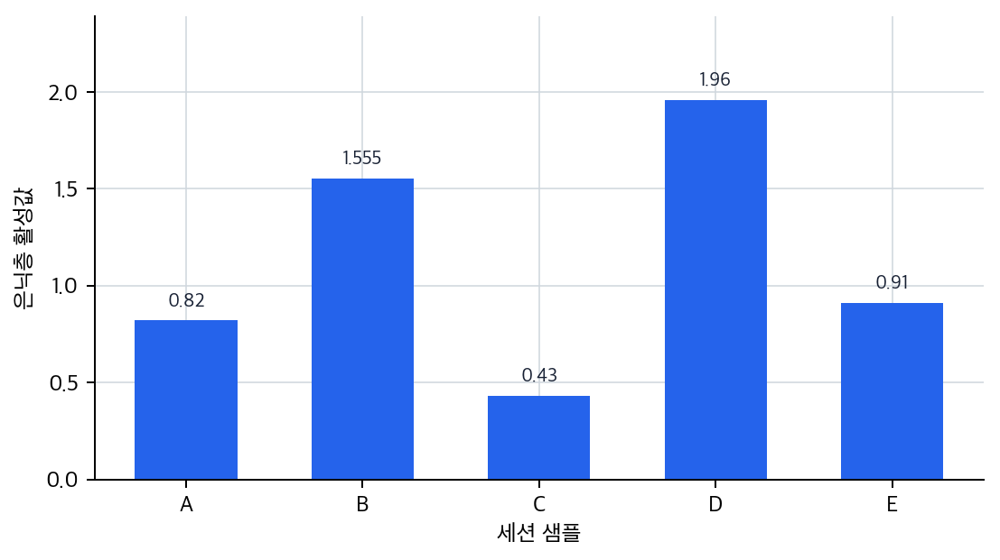
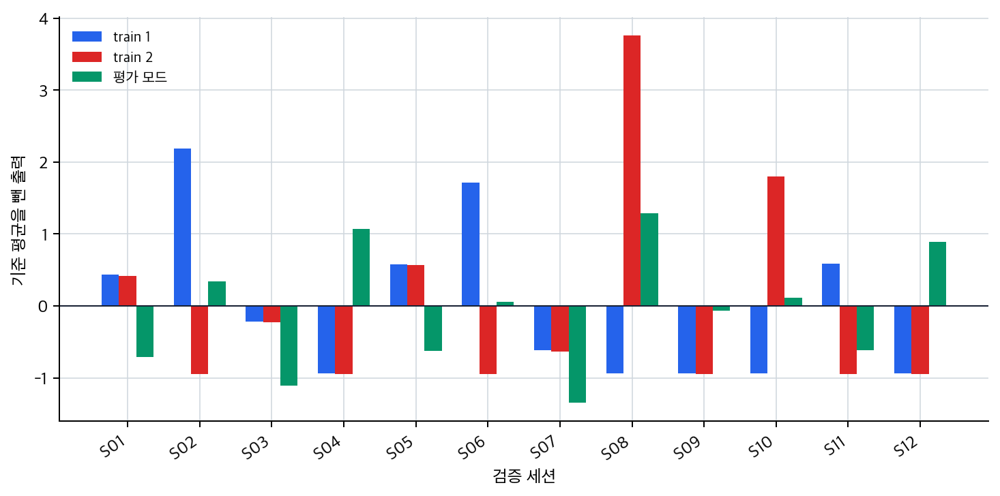
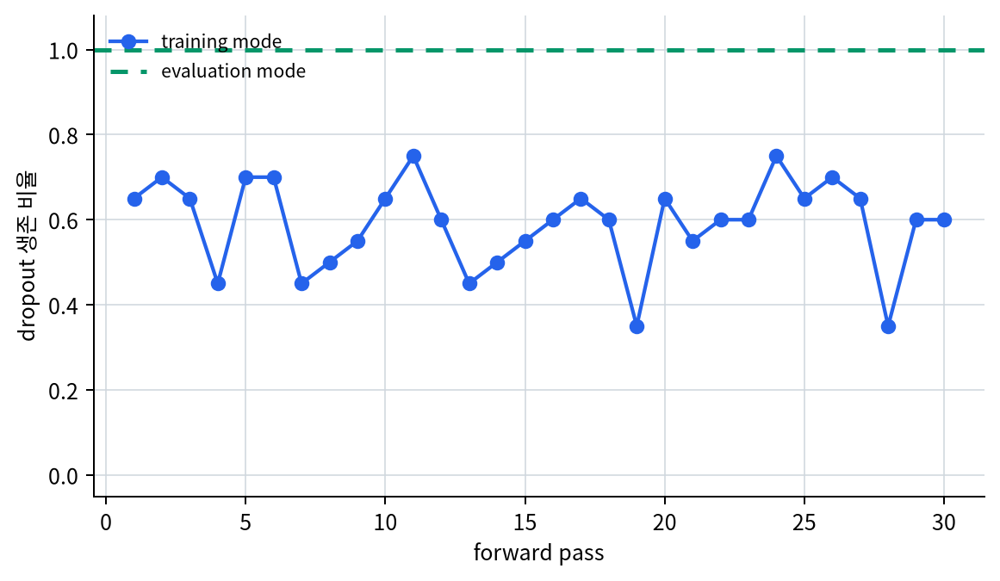
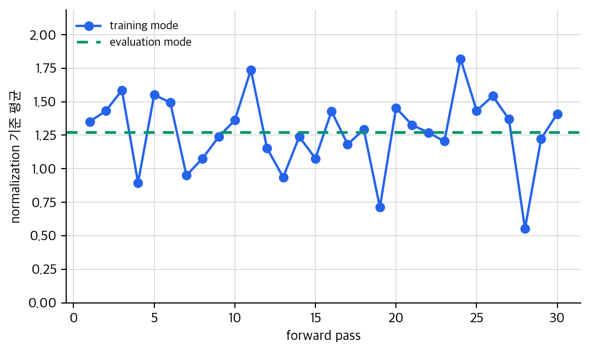

# P5-6.4 학습 모드(training mode)와 평가 모드(evaluation mode)

> Section ID: `P5-6.4`
> Version: `v2026.07.20`

P5-6.3에서는 학습(learning)과 모델 실행(inference)을 `파라미터를 바꾸는 시간`과 `바꾸지 않고 쓰는 시간`으로 구분했습니다. 여기서 한 걸음 더 들어가면 다음 질문이 생깁니다.

파라미터를 바꾸지 않는다고 해서 계산 규칙도 언제나 완전히 같아야 하는가?

답은 항상 그렇지는 않다는 것입니다. 일부 층(layer)은 같은 파라미터를 쓰더라도 학습용 계산 상태와 평가용 계산 상태에서 다르게 동작합니다. 이 차이를 분명히 이해해야 dropout, batch normalization, 검증(validation), 테스트(test), 배포(inference serving)를 헷갈리지 않게 됩니다.

학습 모드(training mode)는 파라미터 업데이트를 준비하는 계산 환경이고, 평가 모드(evaluation mode)는 현재 모델을 안정적으로 측정하거나 사용하는 계산 환경이다.

mode 구분이 dropout이나 batch normalization 설명과 다시 섞일 때는 개념사전의 [학습 모드(training mode)](../../../reference/concept-glossary-parts/14-hieut.md#training-mode)와 [평가 모드(evaluation mode)](../../../reference/concept-glossary-parts/13-pieup.md#evaluation-mode) 항목으로 돌아갑니다.

## 학습 모드와 평가 모드가 필요한 질문

- 학습 모드와 평가 모드는 왜 나뉘는가?
- 모든 층이 아니라 어떤 층들이 모드 차이에 민감한가?
- dropout과 batch normalization은 왜 모드에 따라 다르게 동작하는가?
- 검증(validation)과 테스트(test)에서 왜 평가 모드가 중요한가?

이 절에서는 같은 모델이라도 어떤 계산 규칙은 학습 중에, 어떤 계산 규칙은 평가 중에 더 적합한지 구분하는 데 집중합니다. 즉, 여기서는 `learning과 inference를 나눈 뒤`, 그 안에서 다시 `같은 파라미터 사용 구간에도 training mode와 evaluation mode가 왜 필요한가`를 닫습니다.

대신 이번 절에서 바로 넓히지 않을 질문도 분명합니다. dropout과 regularization 자체의 큰 의미는 P5-8.1, P5-8.2에서 다시 자세히 다루고, optimizer가 이 학습 흐름 안에서 어디에 들어오는지는 P5-7.1, P5-7.2에서 다시 연결합니다.

## 훈련 전용 동작과 실행 동작의 판단 기준

- 학습 모드와 평가 모드를 `계산 규칙이 달라지는 두 상태`로 설명할 수 있습니다.
- dropout과 batch normalization이 왜 모드 차이에 민감한지 말할 수 있습니다.
- 검증과 배포에서는 왜 평가 모드가 필요할 수 있는지 설명할 수 있습니다.
- 실행 가능한 Python 예제로 모드 차이를 직관적으로 확인할 수 있습니다.

## 왜 같은 모델인데 모드가 필요한가

독자는 모델을 하나의 고정된 함수처럼 상상하기 쉽습니다. 입력이 같으면 언제나 같은 계산을 하고 같은 결과를 낼 것이라고 기대하는 것입니다.

하지만 딥러닝에서는 일부 층이 학습을 더 잘 되게 하기 위해 `의도적으로 흔들리거나`, `배치(batch) 통계에 의존`하기도 합니다. 이런 층들은 학습 중에는 도움이 되지만, 평가나 서비스 실행에서는 오히려 불안정성을 만들 수 있습니다.

즉, 모드 분리는 단순한 라이브러리 문법이 아니라 다음 목적을 가집니다.

- 학습 중에는 일반화(generalization)를 돕는 계산을 허용하고
- 평가 중에는 결과를 안정적으로 비교하고 재현하게 만드는 것

## 학습 모드(training mode)는 무엇을 뜻하나

학습 모드는 보통 다음과 같이 읽으면 충분합니다.

- 손실을 줄이기 위한 학습 절차 안에 있다
- 순전파 후 손실 계산과 역전파가 이어질 수 있다
- 일부 층은 학습을 돕기 위해 특별한 방식으로 동작한다

즉, training mode는 단순히 `optimizer.step()`을 호출하는 시점만이 아니라, `모델이 학습용 계산 규칙을 쓰고 있는 상태`를 뜻합니다.

## 평가 모드(evaluation mode)는 무엇을 뜻하나

평가 모드는 보통 다음 상황에서 필요합니다.

- 검증 데이터(validation set)로 성능을 측정할 때
- 테스트 데이터(test set)로 최종 성능을 확인할 때
- 배포된 서비스에서 실제 사용자 입력을 처리할 때

이때는 모델이 `현재 상태를 얼마나 잘하는지`를 흔들림 적게 드러내는 것이 핵심입니다. 따라서 학습 중의 확률적 흔들림이나 배치 의존성을 줄이고, 보다 고정된 방식으로 계산해야 합니다.

다음처럼 이해하면 충분합니다.

`평가 모드는 지금 모델이 얼마나 잘하는지 재는 시간이고, 학습 모드는 더 잘하게 바꾸는 시간이다.`

이 차이를 계산 규칙만 남겨 압축하면 다음과 같습니다.

```mermaid
--8<-- "assets/part-05/chapter-06/training-eval-mode-flow-ko.mmd"
```

이 도식에서 먼저 확인할 결과는, 같은 모델 입력이라도 학습 모드는 `업데이트 준비를 위한 흔들림 허용` 쪽으로, 평가 모드는 `안정적인 측정과 서비스 출력` 쪽으로 계산 규칙이 갈라진다는 점입니다.

## 어떤 층이 모드 차이에 민감한가

모든 층이 모드 차이에 민감한 것은 아닙니다. 예를 들어 일반적인 선형층(linear layer)이나 합성곱층(convolution layer)은 같은 입력과 같은 파라미터라면 큰 틀에서 같은 계산을 합니다.

하지만 다음 층들은 학습 중 동작과 평가 중 동작을 먼저 구분해서 읽어야 합니다.

| 층 또는 기법 | 학습 모드에서의 특징 | 평가 모드에서의 특징 |
| --- | --- | --- |
| dropout | 일부 활성값을 무작위로 끔 | 무작위 제거 없이 안정적으로 사용 |
| batch normalization | 현재 배치 통계를 사용 | 학습 중 누적한 통계를 사용 |

즉, 모드 차이는 `학습을 돕기 위해 일부러 다르게 동작하는 층` 때문에 필요합니다.

## dropout은 왜 학습 중과 평가 중이 다른가

dropout은 학습 중 일부 노드 출력을 무작위로 끊어, 특정 경로에 과하게 의존하지 않도록 돕는 기법입니다.

다음처럼 이해하면 충분합니다.

`학습 중에는 일부 연결을 일부러 쉬게 만들어, 모델이 한두 신호에만 의존하지 않게 한다.`

하지만 평가 중에도 매번 무작위로 노드를 끊어 버리면 결과가 들쭉날쭉해집니다. 그러면 현재 모델이 실제로 얼마나 잘하는지 안정적으로 재기 어렵습니다.

따라서 평가 모드에서는 dropout의 무작위 제거를 멈추고, 학습된 네트워크를 고정된 형태로 사용합니다.

## batch normalization은 왜 모드 차이가 필요한가

batch normalization은 각 배치의 평균(mean)과 분산(variance)을 이용해 활성값 분포를 조정하는 층입니다. 학습 중에는 현재 배치 통계를 쓰는 것이 자연스럽지만, 평가 중에는 상황이 달라집니다.

평가 데이터는:

- 배치 크기가 작을 수 있고
- 한 개 샘플만 들어올 수도 있고
- 측정할 때마다 배치 구성이 달라질 수 있습니다

이 경우 매번 현재 배치 통계만 쓰면 결과가 불안정해질 수 있습니다. 그래서 평가 모드에서는 보통 학습 중 누적한 running statistics를 사용합니다.

다음처럼 기억하면 충분합니다.

`batch normalization은 학습 중에는 현재 배치를 참고하고, 평가 중에는 학습 동안 쌓아 둔 평균적 기준을 더 많이 참고한다.`

## 검증(validation)과 테스트(test)는 왜 평가 모드여야 하나

검증 데이터와 테스트 데이터는 `현재 모델이 얼마나 잘 일반화되는지`를 보기 위한 데이터입니다. 여기서 학습 모드가 켜져 있으면 dropout이 무작위로 흔들리고, batch normalization도 배치 구성에 민감하게 반응할 수 있습니다.

그 결과:

- 같은 모델인데도 측정값이 덜 안정적이거나
- 배치 구성에 따라 점수가 달라지거나
- 서비스 배포 시 체감 성능과 비교가 어려워질 수 있습니다

즉, 검증과 테스트는 `현재 모델을 공정하게 재는 시간`이므로 평가 모드가 중요합니다.

## 연습 및 예제

mode 구분은 검증, 배포, 작은 배치 평가처럼 계산 규칙이 결과 해석을 흔들 수 있는 순간에 먼저 확인합니다. 같은 입력 배치도 `training mode`와 `evaluation mode`에서 서로 다른 계산 규칙으로 갈라질 수 있으므로, 아래 예제는 그 차이를 단계별 산출물로 확인합니다. 숫자 몇 개를 직접 대입하는 장면처럼 보이지 않도록, 여기서는 검증용 세션 로그 12건에서 은닉층(hidden layer) 활성값을 먼저 계산한 뒤 그 값에 dropout과 batch normalization의 모드 차이를 적용합니다.

입력:

- 세션별 최근 클릭 수, 머문 시간, 오류 횟수
- 은닉층 하나의 단순 가중치와 bias
- dropout 비율
- 두 번의 학습 모드 실행을 재현하기 위한 난수 seed
- evaluation mode에서 사용할 이전 학습 세션 배치들

출력:

- 입력 특성에서 계산된 은닉층 활성값
- dropout 뒤 활성값
- normalization에 사용할 기준 평균
- 기준 평균을 뺀 단순화된 출력

문제 상황:

- 같은 입력이라도 학습 모드는 흔들림을 허용하고, 평가 모드는 안정된 기준으로 계산해야 한다

확인할 개념:

- 학습 모드에서는 일부 활성값이 무작위로 꺼진다
- 학습 모드의 batch normalization은 현재 batch 기준을 쓸 수 있다
- 평가 모드에서는 dropout을 멈추고 학습 중 쌓아 둔 running statistics를 기준으로 쓴다

입력(input):

위에 정리한 현재 검증 세션 배치와 이전 학습 세션 배치들을 사용합니다. 여기서 은닉층 계산은 최근 클릭 수, 머문 시간, 오류 횟수에 가중치를 곱한 뒤 bias를 더하고, 음수는 0으로 자르는 ReLU(rectified linear unit)만 적용합니다. batch normalization은 설명을 단순하게 하기 위해 `값 - 기준 평균`만 계산합니다. 실제 batch normalization은 분산, 학습 가능한 scale과 shift까지 함께 쓰지만, 이 예제에서는 `어떤 평균을 기준으로 삼는가`만 봅니다.

코드를 보기 전에 먼저 어떤 단계가 데이터에서 계산되고, 어떤 단계가 모드 때문에 흔들리거나 고정될지 예상해 보면 차이가 더 잘 보입니다.

| 비교 항목 | 먼저 예상해 볼 출력 | 예상 이유 |
| --- | --- | --- |
| `hidden_activation` | 세션마다 다른 은닉층 값이 나옴 | 클릭 수, 머문 시간, 오류 횟수가 샘플마다 다르기 때문입니다. |
| `train_run_1`과 `train_run_2`의 dropout 뒤 값 | 같은 은닉층 값이어도 서로 다른 활성값 패턴이 나올 가능성이 큼 | 학습 모드에서는 실행마다 dropout mask가 달라질 수 있기 때문입니다. |
| `train_run_1 batch_mean`과 `train_run_2 batch_mean` | 서로 차이가 날 가능성이 큼 | 살아남은 활성값이 달라지면 현재 batch 기준도 함께 달라지기 때문입니다. |
| `eval_run` | 은닉층 활성값을 그대로 유지할 가능성이 큼 | 평가 모드에서는 dropout을 적용하지 않기 때문입니다. |
| `eval reference_mean` | 이전 학습 세션 배치에서 계산된 고정 기준값으로 남음 | 평가 모드에서는 현재 batch보다 학습 중 쌓아 둔 running mean을 사용하기 때문입니다. |

이 표의 목적은 정확한 숫자를 맞히는 데 있지 않습니다. 학습 모드에서는 같은 입력도 두 번 실행하면 dropout 결과와 batch 기준이 흔들릴 수 있고, 평가 모드에서는 그 흔들림을 멈춰 기준선을 만든다는 점을 코드 전에 붙잡는 데 있습니다.

```python
# train 모드와 eval 모드에서 dropout과 batch 기준 평균이 어떻게 흔들리거나 고정되는지 비교하는 예제입니다.
from random import Random

validation_sessions = [
    {"id": "S01", "clicks_5m": 3, "dwell_seconds": 42, "error_count": 0},
    {"id": "S02", "clicks_5m": 6, "dwell_seconds": 55, "error_count": 1},
    {"id": "S03", "clicks_5m": 2, "dwell_seconds": 28, "error_count": 0},
    {"id": "S04", "clicks_5m": 7, "dwell_seconds": 70, "error_count": 2},
    {"id": "S05", "clicks_5m": 4, "dwell_seconds": 36, "error_count": 0},
    {"id": "S06", "clicks_5m": 5, "dwell_seconds": 48, "error_count": 1},
    {"id": "S07", "clicks_5m": 1, "dwell_seconds": 24, "error_count": 0},
    {"id": "S08", "clicks_5m": 8, "dwell_seconds": 73, "error_count": 2},
    {"id": "S09", "clicks_5m": 4, "dwell_seconds": 52, "error_count": 1},
    {"id": "S10", "clicks_5m": 6, "dwell_seconds": 61, "error_count": 0},
    {"id": "S11", "clicks_5m": 2, "dwell_seconds": 39, "error_count": 1},
    {"id": "S12", "clicks_5m": 7, "dwell_seconds": 58, "error_count": 2},
]
weights = {"clicks_5m": 0.18, "dwell_seconds": 0.015, "error_count": 0.32}
bias = -0.35
drop_rate = 0.4

def make_prior_batch(rows, dwell_shift, error_shift):
    batch = []
    for row in rows:
        batch.append({
            "clicks_5m": row["clicks_5m"],
            "dwell_seconds": max(12, row["dwell_seconds"] + dwell_shift),
            "error_count": max(0, row["error_count"] + error_shift),
        })
    return batch

prior_session_batches = [
    make_prior_batch(validation_sessions, dwell_shift=-4, error_shift=0),
    make_prior_batch(validation_sessions, dwell_shift=2, error_shift=1),
    make_prior_batch(validation_sessions, dwell_shift=5, error_shift=-1),
]

def hidden_activation(row):
    raw = (
        row["clicks_5m"] * weights["clicks_5m"]
        + row["dwell_seconds"] * weights["dwell_seconds"]
        + row["error_count"] * weights["error_count"]
        + bias
    )
    return round(max(0.0, raw), 3)

def make_dropout_mask(count, seed):
    rng = Random(seed)
    return [1 if rng.random() >= drop_rate else 0 for _ in range(count)]

def apply_dropout(values, mask, drop_rate):
    scale = 1 / (1 - drop_rate)
    result = []
    for value, keep in zip(values, mask):
        if keep == 0:
            result.append(0.0)
        else:
            result.append(round(value * scale, 3))
    return result

def mean(values):
    return round(sum(values) / len(values), 3)

def flatten(rows):
    return [value for row in rows for value in row]

def hidden_batch(batch):
    return [hidden_activation(row) for row in batch]

def center_by_mean(values, reference_mean):
    return [round(value - reference_mean, 3) for value in values]

def summarize(values):
    return {
        "count": len(values),
        "min": round(min(values), 3),
        "max": round(max(values), 3),
        "mean": mean(values),
        "preview": values[:5],
    }

def run_training_mode(name, seed):
    mask = make_dropout_mask(len(activations), seed)
    after_dropout = apply_dropout(activations, mask, drop_rate)
    batch_mean = mean(after_dropout)
    centered_output = center_by_mean(after_dropout, batch_mean)
    return {
        "mode": name,
        "kept": sum(mask),
        "dropped": len(mask) - sum(mask),
        "after_dropout_summary": summarize(after_dropout),
        "reference_mean": batch_mean,
        "centered_preview": centered_output[:5],
    }

def run_evaluation_mode():
    after_dropout = activations[:]
    centered_output = center_by_mean(after_dropout, running_mean)
    return {
        "mode": "eval_run",
        "kept": len(after_dropout),
        "dropped": 0,
        "after_dropout_summary": summarize(after_dropout),
        "reference_mean": running_mean,
        "centered_preview": centered_output[:5],
    }

activations = [hidden_activation(row) for row in validation_sessions]
prior_hidden_batches = [hidden_batch(batch) for batch in prior_session_batches]
running_mean = mean(flatten(prior_hidden_batches))

train_run_1 = run_training_mode("train_run_1", seed=17)
train_run_2 = run_training_mode("train_run_2", seed=29)
eval_run = run_evaluation_mode()

print("validation_session_count =", len(validation_sessions))
print("hidden_activation_summary =", summarize(activations))
print("running_mean_from_prior_batches =", running_mean)
for result in [train_run_1, train_run_2, eval_run]:
    print(result["mode"])
    print("kept/dropped =", result["kept"], "/", result["dropped"])
    print("after_dropout_summary =", result["after_dropout_summary"])
    print("reference_mean =", result["reference_mean"])
    print("centered_preview =", result["centered_preview"])
```

출력에서는 먼저 `hidden_activation_summary`가 입력 특성에서 계산된 은닉층 값의 요약이라는 점을 확인하고, 그다음 `kept/dropped`, `after_dropout_summary`, `reference_mean`, `centered_preview`를 순서대로 비교하면 됩니다.

```text
validation_session_count = 12
hidden_activation_summary = {'count': 12, 'min': 0.19, 'max': 2.825, 'mean': 1.474, 'preview': [0.82, 1.875, 0.43, 2.6, 0.91]}
running_mean_from_prior_batches = 1.534
train_run_1
kept/dropped = 7 / 5
after_dropout_summary = {'count': 12, 'min': 0.0, 'max': 3.125, 'mean': 0.935, 'preview': [1.367, 3.125, 0.717, 0.0, 1.517]}
reference_mean = 0.935
centered_preview = [0.432, 2.19, -0.218, -0.935, 0.582]
train_run_2
kept/dropped = 6 / 6
after_dropout_summary = {'count': 12, 'min': 0.0, 'max': 4.708, 'mean': 0.947, 'preview': [1.367, 0.0, 0.717, 0.0, 1.517]}
reference_mean = 0.947
centered_preview = [0.42, -0.947, -0.23, -0.947, 0.57]
eval_run
kept/dropped = 12 / 0
after_dropout_summary = {'count': 12, 'min': 0.19, 'max': 2.825, 'mean': 1.474, 'preview': [0.82, 1.875, 0.43, 2.6, 0.91]}
reference_mean = 1.534
centered_preview = [-0.714, 0.341, -1.104, 1.066, -0.624]
```

이 예제는 실제 프레임워크 전체를 재현한 것은 아니지만, 여기서 읽어야 할 핵심은 분명합니다.

- 은닉층 활성값은 입력 특성에서 계산된 중간 산출물입니다
- 학습 모드에서는 같은 은닉층 활성값을 두 번 넣어도 dropout 뒤 살아남은 활성값 수와 값 구성이 달라질 수 있습니다
- dropout 뒤 값이 달라지면 현재 batch에서 계산한 기준 평균도 달라질 수 있습니다
- 평가 모드에서는 dropout을 멈추고 이전 학습 세션 배치에서 계산해 누적한 running mean 같은 고정 기준을 사용해 더 안정적인 계산 경로를 만듭니다
- 검증, 테스트, 배포에서 평가 모드가 중요한 이유가 바로 이런 흔들림 제어에 있습니다

먼저 같은 계산 규칙을 그래프로 읽어 봅니다. 첫 그래프는 검증 세션 입력의 최근 클릭 수, 머문 시간, 오류 횟수가 은닉층 활성값으로 바뀐 결과만 보여 줍니다. 이 단계는 아직 mode 차이가 아니라, 입력 데이터가 모델 안의 중간 표현으로 바뀐 지점입니다.



다음 그래프는 같은 은닉층 활성값이 mode에 따라 마지막 출력 해석에서 어떻게 달라지는지 보여 줍니다. `train 1`과 `train 2`는 dropout mask가 달라진 두 학습 실행이고, `eval`은 dropout을 끄고 running mean을 기준으로 계산한 실행입니다. 0보다 크면 해당 기준 평균보다 큰 출력이고, 0보다 작으면 기준 평균보다 작은 출력입니다.



위 두 그래프가 예제 코드의 직접 해설이라면, 아래 두 그래프는 같은 현상이 반복 실행에서 어떻게 보이는지 확인하는 요약입니다. `train_run_1`과 `train_run_2` 두 개의 샘플별 막대만 그대로 보면 사람이 고른 mask 두 개를 억지로 비교하는 그림처럼 보일 수 있으므로, 같은 검증 배치에 같은 계산 규칙을 적용한 30번 forward pass에서 dropout 뒤 살아남은 비율만 요약합니다. training mode에서는 pass마다 살아남는 비율이 흔들리고, evaluation mode에서는 dropout을 끄므로 생존 비율이 1.0 기준선으로 고정됩니다.



normalization 기준도 같은 방식으로 읽습니다. training mode에서는 pass마다 dropout 뒤 값으로 계산한 현재 batch 평균이 기준이 되므로 기준 평균이 흔들립니다. evaluation mode에서는 현재 pass의 우연한 mask가 아니라 학습 중 쌓아 둔 running mean이 기준선으로 쓰입니다.



여기서도 `출력이 다르다`는 사실만 보는 것과 `mode 때문에 어떤 계산 규칙이 달라졌는가`를 읽는 것은 다릅니다.

| 비교 장면 | 덜 나쁜 오해 | 더 위험한 오해 | 지금 먼저 확인해야 할 것 |
| --- | --- | --- | --- |
| `train_run_1`과 `train_run_2`의 `after_dropout`이 다르다 | 학습 중에는 원래 조금 흔들린다고 본다 | 같은 입력인데 결과가 다르니 모델 자체를 못 믿겠다고 단정한다 | 학습 모드의 dropout이 허용된 상태인지 본다 |
| `reference_mean`이 실행마다 다르다 | 현재 batch 기준이 달라질 수 있다고 본다 | 평균이 다르니 평가 결과가 모두 잘못됐다고 본다 | training mode의 batch 기준인지, eval mode의 running 기준인지 먼저 본다 |
| `eval_run`이 고정돼 있다 | 평가 모드는 더 안정적이라고 본다 | 평가 출력도 train처럼 일부러 흔들어 보는 것이 더 현실적이라고 본다 | 검증·테스트·배포의 목적이 안정적 기준선인지 본다 |

이 예제의 다음 확인 지점은 `차이가 있다`가 아니라, 잘못된 mode 해석이 무엇을 흔드는가입니다.

| 일부러 만들어 볼 실패 장면 | 무엇이 흔들리는지 보게 되는가 | 이 절에서 먼저 확인할 결과 |
| --- | --- | --- |
| 검증 단계에서도 `run_training_mode(...)` 같은 학습 모드 출력을 그대로 쓴다 | 같은 입력을 다시 넣을 때 dropout과 batch 기준이 불필요하게 흔들린다 | 성능 측정이 모델 품질보다 무작위성과 batch 구성에 더 민감해지는가 |
| `drop_rate`를 0.4에서 0.7로 높인다 | 학습 모드 출력이 더 많이 꺼지고 평균 활성값도 더 불안정해질 수 있다 | 과한 dropout이 학습 도움보다 정보 손실로 더 크게 느껴지는가 |
| 평가 출력도 train run처럼 여러 번 흔들어 비교하려 한다 | 원래 고정되어야 할 평가 기준선이 흔들린다 | `평가`와 `학습 중 흔들림 허용`이 서로 다른 목적이라는 점이 더 분명해지는가 |

즉, 이 절의 실험은 `training/eval mode가 다르다`는 정의 확인에서 끝나지 않습니다. `평가에서도 학습 모드처럼 흔들리게 두면 무엇이 해석을 망치는가`까지 확인해야 mode 구분의 필요성이 분명해집니다.

딥러닝이 깊어지고 모델 규모가 커지면서, 단순히 `가중치를 학습한다`는 설명만으로는 실제 학습 시스템을 설명하기 어려워졌습니다. regularization, normalization, batch-based training이 널리 쓰이면서, 학습 중과 평가 중의 동작 차이를 커리큘럼에 명시할 필요가 커졌습니다.

특히 dropout은 과적합(overfitting)을 줄이기 위한 실용적 기법으로 널리 알려졌고, batch normalization도 깊은 네트워크 학습 안정성과 속도 논의에서 자주 등장했습니다. 이런 흐름 때문에 modern deep learning 교육에서는 `training/eval mode`를 별도 개념으로 소개하는 것이 자연스러워졌습니다.

즉, 이 절은 단순한 라이브러리 팁이 아니라, `딥러닝이 왜 단순 함수보다 운영 상태를 가진 시스템처럼 보이는가`를 설명하는 절입니다.

## 언제 training/eval mode 차이를 따로 읽는가

learning과 inference를 구분한 뒤에는 `같은 모델이라도 계산 규칙이 일부 달라질 수 있는가`를 따로 확인해야 합니다. 그 경계가 바로 training/eval mode입니다.

| 먼저 보이는 문제 장면 | mode 차이를 따로 읽어야 하는 이유 | 바로 다음에 이어질 곳 |
| --- | --- | --- |
| 같은 입력인데 학습 중과 검증 중 결과 느낌이 다르다 | dropout과 batch normalization이 모드에 따라 다르게 동작할 수 있기 때문입니다. | optimizer가 어떤 상태에서 업데이트를 하는지 뒤 장에서 봅니다. |
| 검증 점수가 들쭉날쭉해 보인다 | 평가 모드가 공정하고 안정적인 측정을 위해 필요하다는 점을 분명히 할 수 있습니다. | regularization과 normalization 의미를 뒤 절에서 더 봅니다. |
| 배포 서비스에서 출력 흔들림이 커 보인다 | 학습용 확률적 동작을 서비스 실행에 그대로 두면 불안정해질 수 있기 때문입니다. | inference serving과 optimizer 분리를 이어서 읽습니다. |
| dropout, batch normalization이 왜 특별 취급되는지 감이 없다 | 모드 차이에 민감한 층을 따로 구분해 읽을 수 있습니다. | 정규화·옵티마이저 장과 연결됩니다. |

## 체크리스트

- 학습 모드(training mode)와 평가 모드(evaluation mode)가 왜 다른 계산 규칙을 가질 수 있는지 설명할 수 있는가?
- dropout이나 batch normalization에서 mode 구분이 왜 중요한지 말할 수 있는가?
- 학습 모드와 평가 모드는 같은 모델의 서로 다른 계산 상태라는 점을 설명할 수 있는가?
- dropout과 batch normalization이 모드 차이에 특히 민감한 대표 예라는 점을 말할 수 있는가?
- 검증, 테스트, 배포에서는 같은 입력을 넣었을 때 흔들림이 줄어든 안정적 출력이 나오는지 확인하기 위해 평가 모드가 중요하다는 점을 설명할 수 있는가?
- 같은 입력인데 학습 중과 검증 중 결과 느낌이 다를 때, training/evaluation mode 차이를 먼저 떠올릴 수 있는가?
- 검증과 배포에서 출력 흔들림을 줄여야 할 때, 평가 모드가 안정적 기준을 제공한다는 관점을 꺼낼 수 있는가?
- 이 절 다음에는 gradient를 실제 업데이트 규칙으로 바꾸는 optimizer 장으로 넘어간다는 흐름을 이해했는가?

## 출처와 참고 자료

- Ian Goodfellow, Yoshua Bengio, Aaron Courville, `Deep Learning`, MIT Press, 2016, 확인 날짜: 2026-06-29. [https://www.deeplearningbook.org/](https://www.deeplearningbook.org/){: target="_blank" rel="noopener noreferrer" }
- Nitish Srivastava et al., `Dropout: A Simple Way to Prevent Neural Networks from Overfitting`, JMLR, 2014, 확인 날짜: 2026-07-19. [https://jmlr.org/papers/v15/srivastava14a.html](https://jmlr.org/papers/v15/srivastava14a.html){: target="_blank" rel="noopener noreferrer" }
- Sergey Ioffe, Christian Szegedy, `Batch Normalization: Accelerating Deep Network Training by Reducing Internal Covariate Shift`, ICML, 2015, 확인 날짜: 2026-07-19. [https://arxiv.org/abs/1502.03167](https://arxiv.org/abs/1502.03167){: target="_blank" rel="noopener noreferrer" }
