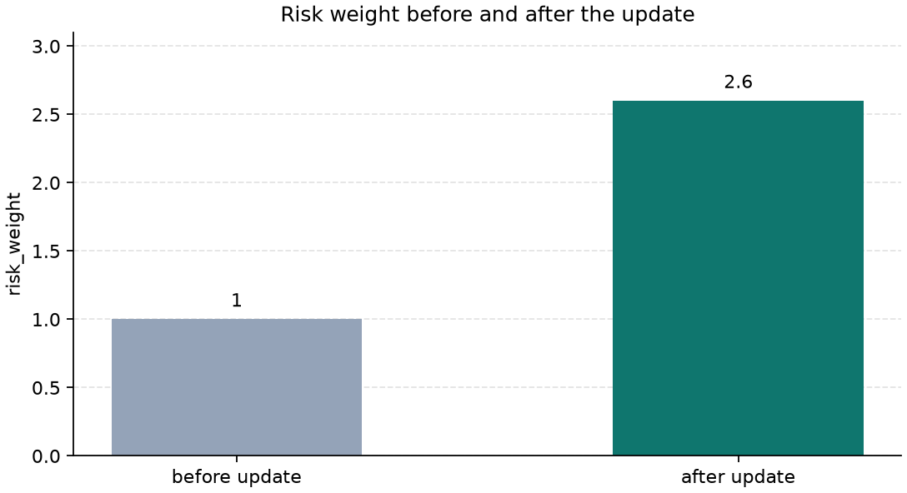
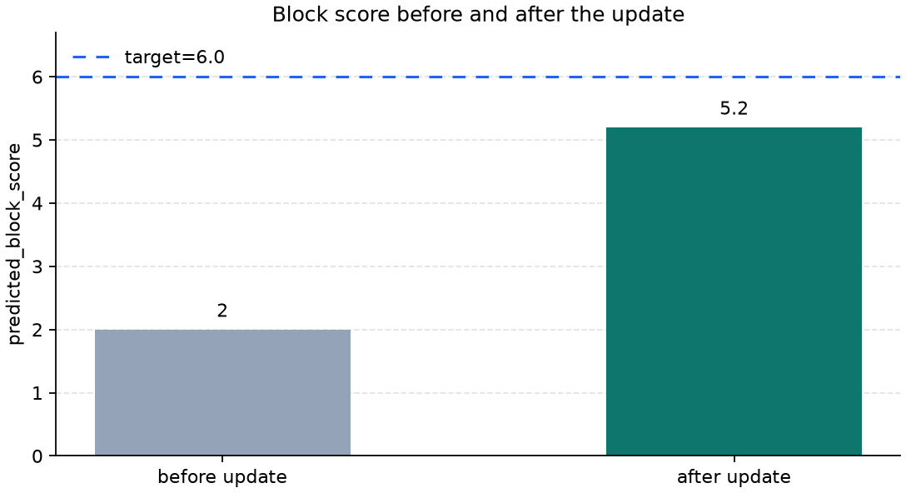
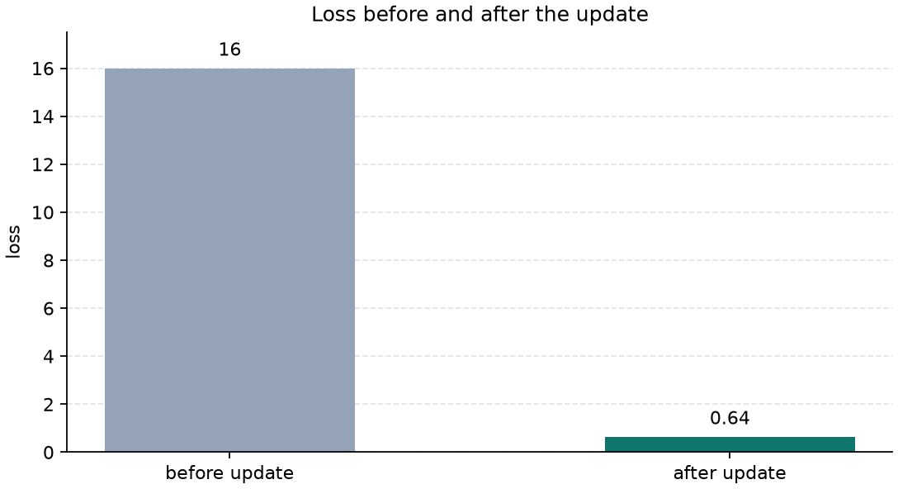

# P5-7.1 The Role Of The Optimizer

Section ID: `P5-7.1`
Version: `v2026.07.17`

In Chapter P5-6, we separated the training loop, step/batch/epoch, learning and model execution (inference), and training mode and evaluation mode. Once we reach this point, one very direct question remains. After the model has computed in number form that it is wrong, where do the actual numbers inside the model change next?

We computed the loss, and we also computed the gradient, but who actually changes the weights?

The component that takes on that role is the optimizer.

An optimizer is the rule that receives the gradient computed by backpropagation and actually updates parameters in the direction that reduces the loss. In other words, it takes the computed result `if we change it this way, the loss may decrease` and passes it into the actual adjustment `so in this step, let us change the weights like this`.

If the roles of loss, gradient, and update start to blur together again, go back to the [optimizer](../../../reference/concept-glossary.md#optimizer) entry in the concept glossary and separate the roles again from there.

If we describe one learning step very roughly, the model first makes a prediction, then computes how wrong that prediction is, then computes which weights that wrongness is connected to, and finally changes the actual weight values. The optimizer is what takes charge of that last stage.

When reading this flow, it is safer to hold onto the following three sentences first.

- Loss turns the wrongness into a number.
- Backpropagation computes the direction signal of each weight.
- The optimizer turns that signal into an actual update.

## Scope Of This Section

- Where does the optimizer sit in the learning procedure?
- What role differences do the loss function, backpropagation, and the optimizer have?
- Why is `a good gradient` alone not enough, and why do we still need a separate `update rule`?
- If we want to read the optimizer not as a simple implementation function but as the role that actually changes parameters, what should we look at?

This section focuses on closing `who actually changes the parameters`. In other words, here we first establish the standard for reading separately `the stage that computes the wrongness`, `the stage that computes the gradient`, and `the stage that turns that gradient into an actual update`. This distinction has to be fixed first so that when we look at learning rate or Adam in the next sections, the question `what exactly is being adjusted here` does not blur.

At the same time, it is also clear which question we will not widen immediately in this section. How the update step size changes even with the same gradient depending on the learning rate continues in the next section, P5-7.2. What adaptive optimizers such as Adam try to additionally compensate beyond a simple reference update is explained again in P5-7.3. The convergence analysis of adaptive optimization is separated into the supplementary study of P5-7.4.

## Goals Of This Section

- You can explain the optimizer as `the rule that turns gradients into actual updates`.
- You can distinguish what stage the loss function, backpropagation, and the optimizer each finish.
- You can explain why `the gradient was computed` and `the parameters actually changed` are different statements.
- You can read a small Python example and confirm that gradient, update, and parameter application are different stages.

## Where Is The Optimizer In The Learning Procedure

If we gather the early flow of Part 5 again, deep-learning training proceeds in the following order.

1. Compute the prediction through the forward pass.
2. Turn the wrongness into a number through the loss function.
3. Compute the gradient through backpropagation.
4. Update the parameters through the optimizer.

In other words, the optimizer is not the device that computes gradients. It is `the device that looks at the computed gradient and decides the next parameters`. In even more direct terms, the loss function and backpropagation compute `how would it be better to change this`, and the optimizer takes that computed result and passes it into the execution side as `how much should we actually change it now`.

If we draw it very simply, it looks like this.

```mermaid
--8<-- "assets/part-05/chapter-07/optimizer-loop-flow-en.mmd"
```

We first have to fix this distinction so that when we read learning code, we do not lump different questions into one stage. At the stage of looking at the loss function, we check `what is wrong and by how much`. At the stage of looking at backpropagation, we see `what direction signal does that wrongness send to each parameter`. At the stage of looking at the optimizer, we check `did that signal actually get applied as an update so that the parameters changed`.

If we read these three stages mixed together, then phrases such as `the loss was computed`, `the gradient came out`, and `the model was actually updated` become easy to accept as if they all mean the same thing. But in real learning, the three play different roles. So it is safer first to establish a reading standard that separates `the stage that measures wrongness`, `the stage that computes responsibility`, and `the stage that actually moves the parameters`.

- loss function: tells us in numbers what is wrong
- backpropagation: computes who contributed how much to that wrongness
- optimizer: decides by how much we should actually change it

These three sentences are the smallest map for reading the flow of learning computation in Part 5. Rather than memorizing the three terms separately, it is much safer for the reader to remember them grouped as `wrongness -> responsibility -> actual correction`. Once this order is fixed in the mind, it becomes easier to read in code what stage `loss`, `backward`, and `step` have each finished.

## Why Is The Gradient Alone Not Enough

The gradient is information about direction. Usually, it tells us `in which direction will the loss decrease if we move`. Even with that signal alone, it is clear that learning is not completely random. But for an actual update, the mere fact that `we know a good direction` is still not enough.

The reason is simple. Actually changing parameters does not end at seeing an arrow. It also means deciding how far to move and in what way to move along that arrow. If you see on a map a sign that says `go down this way`, that does not immediately mean you will walk with the same speed and same stride every time. Even with the same gradient, you may barely move in one step, move with an appropriate stride, or move too far and overshoot a good point. In other words, the gradient gives `the direction signal for going down`, but real learning proceeds only when there is also a rule that turns that signal into `actual movement`.

For example, these questions remain.

- How large should one move be at a time?
- How much should the direction from the previous step be taken into account?
- Should the model move at different speeds for different coordinates?

All of these questions mean that there is still one more stage between `knowing the direction` and `actually updating`. In other words, the gradient is closer to a map, and the optimizer is closer to the rule of movement.

It is enough to understand it like this.

`If the gradient is the signpost for the direction of the path, the optimizer is the rule that decides how fast and in what manner to walk.`

If we rewrite this analogy back into actual statements, it becomes the following.

- the gradient tells us `which direction goes downward`
- the optimizer decides `how should we turn that direction into an actual update`, and `how much should we change it in one step`
- so even with the same gradient, the actual learning behavior can differ if the optimizer rule differs

## What Should We Read As The Update That The Optimizer Produces

A misunderstanding that often appears for beginners is reading `the gradient was computed` and `the model has already changed` as if they mean the same thing. But in reality there is one more stage.

1. Compute the gradient at the current parameters.
2. The optimizer looks at that gradient and makes an update value.
3. Reflect that update in the parameters.

If we read this order slowly, it becomes visible that what the optimizer does is not `just pass along the gradient`, but `turn the gradient into a movement amount that can actually be applied to the parameters`. The gradient is still only the computed result that tells us `which direction goes down`. The update is the value that turns that computed result into the actual movement amount `so how far will we really move in this step`. And parameter application is the stage where that movement amount is added to or subtracted from the actual weight values so that the numbers inside the model change. If we group the three into one sentence, they are `direction signal`, `movement-amount computation`, and `actual number change`.

In other words, the gradient is still only `the signal about the direction and size in which things should change`, while the update is `the movement amount actually applied to the parameters`. Even if the gradient comes out as `-16.0`, that does not yet mean `the current weight changes immediately by -16.0`. That value still has to be reinterpreted through the optimizer rule into `the actual movement amount of this step`.

If we miss this distinction, then the stages also mix together when reading a training log or code. The sentence `the gradient was computed well` means the direction signal came out. The sentence `the update was applied` means that signal actually continued into a real parameter change. So when reading the optimizer, we should not stop at `was there a gradient`. We also have to check `into what update value was that gradient turned, and was that update actually reflected?`

If we do not distinguish this difference, it becomes hard to read what the bottleneck is when learning is slow. The gradient may have been computed well, but the update may be too conservative. Or conversely, the direction may be right, but the update may be too aggressive. This problem of step size is read more directly with the learning rate in the next section, P5-7.2.

## Cases And Examples

### Case. Loss And Gradient Were Computed, But The Update Has Not Yet Been Applied

When reading learning code, we can encounter a moment where the model has computed in number form how wrong it is, and has also computed in what direction that wrongness should be passed to each weight, but the actual weight numbers themselves are still unchanged. In code, this often corresponds to the point where `loss.backward()` has finished, but `optimizer.step()` has not yet been called. When people see this scene, they easily feel that learning has almost already happened, but in reality the computation has only reached `how should we change it`, and it is not yet the stage where we can say `it actually changed`.

From the optimizer viewpoint, this scene changes the question. Instead of stopping at `was the gradient computed`, it checks `was that gradient actually applied as an update`. Loss and gradient are computed results. The optimizer step is the final procedure that turns those computed results into changes in the numbers inside the model. So what matters in this section is the habit of reading `the computation finished` and `the weights changed` as different statements.

So the result to confirm in this case is not `backward was done`, but `did we reach optimizer step so that the parameters actually became different?`

If we separate this scene more directly, it becomes the following.

| What has already been computed now | What has not happened yet |
| --- | --- |
| a prediction value came out | the weight numbers changed |
| the loss was computed | the starting parameters for the next step were decided |
| the gradient was computed | the update was actually reflected |

In other words, `there is a loss and a gradient` means we are in the state where the direction of learning has been computed, while `optimizer.step()` has finished means that computation continued into an actual change in the model numbers. The core of this section is exactly this boundary.

| Standard a person is likely to look at first | Standard reread from the optimizer viewpoint |
| --- | --- |
| It is easy to feel that once the gradient is computed, learning is already finished | gradient computation and update application are separate stages |
| It is easy to think that once the loss was printed, the model immediately became better | loss is a number showing the state, while the optimizer creates the actual parameter change |
| It is easy to feel that looking only at backward is enough | for the parameters to change, optimizer step has to actually be executed |

If we compress this case once more, the first flow for reading the optimizer is the following.

```mermaid
--8<-- "assets/part-05/chapter-07/optimizer-step-bridge-en.mmd"
```

This diagram is not there to explain the case all over again, but to separate once more, at a glance, `gradient computation` from `actual update application`. How the same gradient turns into different stride lengths depending on the learning rate continues in the next section, P5-7.2. How Adam-like methods additionally reflect recent flow and coordinate-by-coordinate differences continues in P5-7.3.

## Practice And Example

The goal of this example is to separate gradient computation from actual update application. Here, rather than comparing the size of the learning rate itself, it is more important to check with our eyes the sequence `compute the gradient -> the optimizer makes an update -> only then do the parameters change`. In other words, this example is not for choosing `which learning rate is best`, but for reading how `gradient`, `update`, and `parameter change` appear in different places in the code and output.

Input:

- current risk weight `risk_weight`
- pressure unrecovered level `pressure_unrecovered`
- target block score `target_block_score`
- fixed learning rate `learning_rate`

Output:

- predicted block score
- loss
- gradient
- update value made by the optimizer
- the risk weight and loss before and after the update

Problem scene:

- the parameters do not change automatically just because the gradient was computed
- the numbers inside the model change only when the update made by the optimizer is actually applied

Concepts to confirm:

- the gradient is a direction signal
- the optimizer turns that signal into an update value
- parameter change appears only after the update is applied

Before looking at the code, it is helpful to decide that we will read this example by dividing it into `the state before the update` and `the state after the update`.

| Interval | What to confirm here |
| --- | --- |
| state before update | how wrong the prediction value and loss are right now |
| gradient computation | in which direction should it be changed |
| optimizer update | by how much should it actually move |
| state after update | how the weight, prediction value, and loss actually changed |

```python
pressure_unrecovered = 2.0
target_block_score = 6.0
risk_weight_before = 1.0
learning_rate = 0.1

predicted_block_score_before = pressure_unrecovered * risk_weight_before
loss_before = (predicted_block_score_before - target_block_score) ** 2
gradient_risk_weight = 2 * (predicted_block_score_before - target_block_score) * pressure_unrecovered

optimizer_delta = -learning_rate * gradient_risk_weight
risk_weight_after = risk_weight_before + optimizer_delta
predicted_block_score_after = pressure_unrecovered * risk_weight_after
loss_after = (predicted_block_score_after - target_block_score) ** 2

print("[before update]")
print("predicted_block_score_before =", round(predicted_block_score_before, 3))
print("loss_before =", round(loss_before, 3))

print("[gradient and update]")
print("gradient_risk_weight =", round(gradient_risk_weight, 3))
print("optimizer_delta =", round(optimizer_delta, 3))

print("[after update]")
print("risk_weight_after =", round(risk_weight_after, 3))
print("predicted_block_score_after =", round(predicted_block_score_after, 3))
print("loss_after =", round(loss_after, 3))
```

```text
[before update]
predicted_block_score_before = 2.0
loss_before = 16.0

[gradient and update]
gradient_risk_weight = -16.0
optimizer_delta = 1.6

[after update]
risk_weight_after = 2.6
predicted_block_score_after = 5.2
loss_after = 0.64
```

It is best to read this output in order. First, if we look at `predicted_block_score_before` and `loss_before` in the `[before update]` section, we can see how wrong the model still is before the update. Then, if we look at `gradient_risk_weight` in the `[gradient and update]` section, it becomes visible that a signal was computed for in which direction the weight should be adjusted from this state. But up to this point, we still only have the state `how should we change it`.

Then `optimizer_delta` appears for the first time. This value is the actual movement amount made by the optimizer. In other words, if `gradient_risk_weight` is the direction signal, then `optimizer_delta` is the number that expresses how far the weight will actually move in this step. Finally, if we look at `risk_weight_after`, `predicted_block_score_after`, and `loss_after` in the `[after update]` section, we can confirm how the numbers inside the model and the loss actually changed after that movement amount was reflected.

So in this output, it is important to develop the habit of reading `loss_before`, `gradient_risk_weight`, `optimizer_delta`, and `risk_weight_after` as one connected line. What this order shows is `computing wrongness -> computing the direction signal -> generating the actual movement amount -> reflecting it in the parameter`.



This chart shows that the value starting from `risk_weight_before = 1.0` actually changed to `risk_weight_after = 2.6` after reflecting the movement amount made by the optimizer. The important point here is not only the fact that `the gradient was computed`, but that the computed result continued into a change in the weight number.



This chart shows that the same update immediately affects the prediction value too. Before the update, the block score is `2.0`, but after the update it changes to `5.2`, which is closer to the target `6.0`. In other words, the optimizer does not merely change the internal weights. It changes the very starting point from which the next prediction will be made.



In the last chart, we can confirm that as a result, the loss also decreases from `16.0` to `0.64`. If we reread this order with our eyes, it becomes clearer that there is definitely a middle stage between `gradient computation` and `loss reduction`: `applying the actual update made by the optimizer`.

In other words, what the reader absolutely has to read in this example is the following.

- `gradient_risk_weight` is not yet the parameter itself.
- `optimizer_delta` is the value that turned the gradient into an actual movement amount.
- The parameter change becomes visible only in `risk_weight_after`.
- So `we computed the gradient` and `we actually updated the model` are not the same statement.

The key the reader should gain here is that a real intermediate stage made by the optimizer exists between `the gradient came out` and `the model changed`. How the results differ more depending on how the update step size is chosen, even with the same gradient, continues in the next section, P5-7.2.

## When Do We Read From The Optimizer Viewpoint First

The time to bring out this section is when the explanation `the gradient was computed` is still not enough to close how the parameters actually move.

| Problem scene that appears first | Why the optimizer viewpoint is useful first | The next question to hand off immediately |
| --- | --- | --- |
| We know the gradient, but we still cannot see the actual movement amount or rule | It makes us read update as a separate rule | We then need to see how the learning rate changes the step size even for the same gradient |
| Loss, backpropagation, and update look mixed together as one bundle | It can clearly separate the roles of `wrongness -> gradient -> actual correction` | The update step size and adaptive correction should then be seen in the later sections |
| It is not intuitive that even with the same gradient, the result can differ | It fixes the point that the optimizer changes the learning dynamics themselves | In P5-7.2 and P5-7.3, we then need to look at the difference between step size and adaptive updates |

## Checklist

- Can you explain that the optimizer is not `the stage that computes the gradient`, but `the stage that turns the computed gradient into an actual parameter update`?
- Can you separately state the loss function, backpropagation, and the optimizer as `computing wrongness`, `computing the direction signal`, and `applying the actual correction`?
- Can you distinguish why `the gradient was computed` and `the parameters actually changed` are different statements?
- Can you explain that only after the update value made by the optimizer is actually reflected do parameter and loss changes appear?
- Do you know that in the next section, P5-7.2, the learning rate changes the update step size, and in P5-7.3 Adam-like methods add further compensation?

## Sources And Further Reading

- Ian Goodfellow, Yoshua Bengio, Aaron Courville, `Deep Learning`, MIT Press, 2016, accessed 2026-06-29. [https://www.deeplearningbook.org/](https://www.deeplearningbook.org/){: target="_blank" rel="noopener noreferrer" }
- Léon Bottou, `Large-Scale Machine Learning with Stochastic Gradient Descent`, COMPSTAT, 2010, accessed 2026-06-29.
- Sebastian Ruder, `An overview of gradient descent optimization algorithms`, arXiv, 2016, accessed 2026-06-29.
