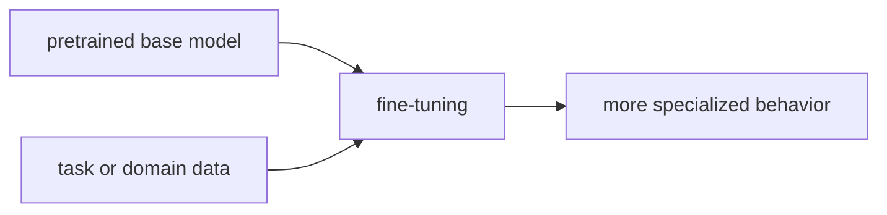

# P5-7.1 파인튜닝(fine-tuning)

P5-5.2에서는 생성이 확률 분포에서 다음 토큰을 반복 선택하는 과정이라는 점을 보았습니다. 하지만 실제 서비스에서는 여기서 질문이 하나 더 생깁니다.

사전학습된 큰 모델을 우리 목적에 더 잘 맞게 바꾸려면 어떻게 해야 하는가?

이 절은 그 질문에 답합니다.

파인튜닝(fine-tuning)은 이미 사전학습된 모델을 특정 과업이나 도메인에 더 잘 맞도록 추가로 조정하는 과정이다.

같은 말을 더 쉽게 바꾸면 다음과 같습니다.

파인튜닝은 이미 언어를 넓게 배운 큰 모델을, 우리 일에 더 맞게 다시 다듬는 단계다.

## 이 절의 범위

이 절은 다음 질문에 답합니다.

- 파인튜닝은 무엇을 조정하는가?
- 프롬프트만 바꾸는 것과 파인튜닝은 어떻게 다른가?
- 어떤 상황에서 파인튜닝이 필요한가?

이 절은 다음 내용은 깊게 다루지 않습니다.

- optimizer 설정 세부
- 전체 가중치 업데이트 수식
- 분산 학습 인프라

전체 모델을 다시 조정할 때의 비용 문제는 바로 다음 P5-7.2 LoRA와 효율적 조정에서 다시 회수합니다. 프롬프트, RAG, 도구 사용과의 선택 문제는 뒤의 P5-9.2 프롬프트의 한계와 P5-10.1 RAG의 필요성에서 이어지며, optimizer와 분산 학습 구현 세부는 현재 본편 범위 밖으로 둡니다.

이 절의 목적은 파인튜닝을 `모델을 새로 처음부터 만드는 일`로 오해하지 않게 하고, 사전학습 이후의 조정 단계로 정확히 놓는 데 있습니다.

## 이 절의 목표

- 파인튜닝을 사전학습 이후의 추가 조정으로 설명할 수 있습니다.
- 프롬프트 조정과 파인튜닝의 차이를 말할 수 있습니다.
- 언제 파인튜닝이 유리하고, 언제 프롬프트나 RAG가 먼저일 수 있는지 구분할 수 있습니다.
- 다음 절의 LoRA 같은 효율적 조정 기법으로 자연스럽게 넘어갈 수 있습니다.

## 파인튜닝은 무엇을 조정하나

사전학습된 모델은 이미 넓은 일반 언어 패턴을 배운 상태입니다. 하지만 실제 업무는 더 구체적입니다.

먼저 다음 세 질문으로 읽으면 이해가 빨라집니다.

| 질문 | 짧은 답 |
| --- | --- |
| 이미 있는 모델을 왜 또 조정하는가? | 일반 능력만으로는 우리 목적에 덜 맞을 수 있어서 |
| 무엇을 더 맞추려는가? | 형식, 도메인 용어, 분류 기준, 반응 성향 |
| 새로 처음부터 다시 만드는가? | 보통은 아니다. 기존 기반 모델 위에서 조정한다 |

예를 들어:

- 법률 문서 요약
- 내부 고객 문의 분류
- 의료 상담 초안 작성
- 회사 내부 형식에 맞는 답변 생성

이런 경우에는 일반 모델만으로는 표현 방식, 판단 기준, 도메인 용어가 충분히 맞지 않을 수 있습니다. 파인튜닝은 이런 간극을 줄이기 위해 모델의 가중치(weights)를 추가로 조정합니다.

즉, 파인튜닝은 `기반 모델(base model)` 위에 `특정 목적에 맞는 추가 적응`을 얹는 과정입니다.

따라서 파인튜닝의 핵심 질문은 `이 모델이 똑똑한가?`보다 `이 모델이 우리 문제의 기준과 형식에 더 맞는가?`에 가깝습니다.

## 프롬프트와 무엇이 다른가

이 차이는 매우 중요합니다.

| 방식 | 무엇을 바꾸는가 |
| --- | --- |
| 프롬프트(prompt) | 입력 지시와 맥락 |
| 파인튜닝(fine-tuning) | 모델 내부 가중치의 일부 또는 전체 |

프롬프트는 모델 바깥에서 입력을 설계하는 방법입니다. 반면 파인튜닝은 모델 내부 동작 자체를 조금 더 특정 목적에 맞게 조정합니다.

다음처럼 기억하면 좋습니다.

`프롬프트는 모델에게 어떻게 말할지를 바꾸고, 파인튜닝은 모델이 반응하는 습관 자체를 더 목적에 맞게 조정한다.`

독자는 이 둘을 다음처럼 나눠 기억하면 좋습니다.

- 프롬프트: 모델 바깥에서 지시를 더 잘 적는 방법
- 파인튜닝: 모델 안쪽 반응 경향을 더 목적에 맞게 조정하는 방법

## 언제 파인튜닝이 필요한가

모든 문제를 파인튜닝으로 풀 필요는 없습니다. 오히려 다음처럼 먼저 질문해야 합니다.

- 프롬프트만으로 충분한가?
- 최신 외부 지식이 필요해서 RAG가 더 적합한가?
- 결과 형식과 말투, 분류 기준이 매우 일관되게 유지되어야 하는가?

파인튜닝이 특히 고려되는 상황은 다음과 같습니다.

- 특정 형식의 출력이 자주 반복될 때
- 도메인 용어와 표현 방식이 강하게 중요할 때
- 분류나 추출 기준이 내부 정책과 강하게 연결될 때
- 프롬프트만으로는 안정적 재현성이 부족할 때

이 목록을 더 짧게 줄이면 다음 두 경우가 핵심입니다.

1. 결과의 `형식 일관성`이 중요할 때
2. 결과의 `판단 기준`이 내부 규칙과 강하게 연결될 때

## 파인튜닝이 만능은 아니다

이 점도 같이 기억해야 합니다.

파인튜닝이 있다고 해서:

- 최신 사실 자동 반영
- 환각 자동 제거
- 보안 자동 해결

이 되는 것은 아닙니다.

예를 들어 최신 회사 공지나 실시간 정책 변경은 파인튜닝보다 RAG나 별도 데이터 연결이 더 적절할 수 있습니다.

따라서 더 안전한 설명은 다음입니다.

`파인튜닝은 특정 반응 성향과 과업 적합성을 높이는 방법이지, 최신성·사실성·안전성 전체를 한 번에 해결하는 방법은 아니다.`

이 문장은 실무에서 중요합니다. 많은 독자가 `우리 데이터로 조금 더 학습시키면 다 해결되겠지`라고 생각하기 쉽기 때문입니다. 실제로는 최신 정보 연결, 근거 제시, 권한 통제는 별도 설계가 필요합니다.

## 아주 단순하게 그리면



이 도식은 파인튜닝이 `새 모델 처음부터 만들기`가 아니라 `기반 모델을 목적에 맞게 조정하기`라는 점을 보여 줍니다.

이 그림의 읽는 법은 다음처럼 단순합니다.

- 왼쪽의 기반 모델은 `이미 넓게 배운 상태`
- 과업 데이터는 `우리 문제의 기준`
- 결과는 `더 목적에 맞는 반응`

## 사례로 보기

### 사례 1. 내부 고객센터 분류

일반 모델은 문의를 대략 분류할 수 있어도, 회사 내부 정책 기준으로 `환불`, `교환`, `배송`, `계정 문제`를 안정적으로 구분하지 못할 수 있습니다. 이런 경우 파인튜닝이 검토될 수 있습니다.

### 사례 2. 의료 문서 요약

일반 요약은 가능해도, 특정 의학 용어를 어떤 방식으로 줄이고 어떤 표현을 유지할지에 대해 더 강한 일관성이 필요할 수 있습니다.

### 사례 3. 법률 초안 형식

단순 정보 생성이 아니라 문서 형식과 표현 규칙이 중요할 때는 프롬프트만으로는 흔들릴 수 있습니다. 이런 경우도 파인튜닝 논의가 나옵니다.

세 사례를 한 줄로 묶으면 다음과 같습니다.

| 상황 | 파인튜닝이 검토되는 이유 |
| --- | --- |
| 문의 분류 | 내부 분류 기준을 더 안정적으로 반영하기 위해 |
| 의료 요약 | 도메인 표현과 요약 형식을 더 일정하게 맞추기 위해 |
| 법률 초안 | 문체와 출력 구조를 더 일관되게 유지하기 위해 |

## 작은 Python 예제로 보기

이번 예제의 목표는 실제 학습을 돌리는 것이 아니라, `일반 모델 출력`과 `목적 맞춤 출력`의 차이를 감각적으로 보는 것입니다.

입력:

- 같은 질문
- 일반 응답 스타일과 도메인 맞춤 스타일

출력:

- 조정 전후의 차이

```python
question = "환불 요청을 어떻게 분류해야 하나요?"

base_model_style = "환불과 관련된 고객 문의로 보입니다."
fine_tuned_style = "label=refund_request, confidence=high"

print("question =", question)
print("base_model_style =", base_model_style)
print("fine_tuned_style =", fine_tuned_style)
```

실행 결과 예시는 다음처럼 읽을 수 있습니다.

```text
question = 환불 요청을 어떻게 분류해야 하나요?
base_model_style = 환불과 관련된 고객 문의로 보입니다.
fine_tuned_style = label=refund_request, confidence=high
```

이 예제는 파인튜닝이 `더 똑똑해진다`는 뜻보다, `출력 형식과 과업 적합성이 더 맞춰질 수 있다`는 점을 보여 줍니다.

이 예제에서 여기서 읽어야 할 핵심은 다음입니다.

- 질문은 같아도
- 일반 모델은 `설명형 문장`을 줄 수 있고
- 파인튜닝된 모델은 `업무용 형식`에 더 가깝게 반응할 수 있습니다

즉, 파인튜닝은 종종 `정답을 새로 만들어 내는 힘`보다 `반응 방식을 업무 형태에 더 맞추는 힘`으로 이해하는 편이 안전합니다.

## 역사와 커리큘럼 관점

파인튜닝은 LLM 이전에도 널리 쓰이던 전이 학습(transfer learning) 흐름과 연결됩니다. 큰 기반 모델을 먼저 만들고, 이후 더 작은 과업 데이터로 목적 적합성을 높이는 방식은 현대 NLP와 비전에서 반복되어 왔습니다.

따라서 파인튜닝은 LLM 시대에 갑자기 생긴 낯선 발명이라기보다, `큰 기반을 만들고 나중에 목적별로 적응시키는 흐름`이 더 널리 보이게 된 결과로 이해하면 좋습니다.

커리큘럼 관점에서 이 절이 중요한 이유는 다음과 같습니다.

- 사전학습 이후의 실무 연결점을 보여 주고
- 프롬프트, RAG, 파인튜닝을 서로 다른 선택지로 분리하게 하며
- 다음 절의 PEFT(parameter-efficient fine-tuning)와 LoRA 설명의 기반을 만들기 때문입니다

## 다음 절과의 연결

여기서 바로 현실 문제가 나옵니다.

- 거대한 모델 전체를 늘 다시 조정해야 하는가?
- 더 적은 비용으로 일부만 효율적으로 조정할 수는 없는가?

이 질문은 P5-7.2 LoRA와 효율적 조정으로 이어집니다.

## 이 절에서 기억할 관점

- 파인튜닝은 사전학습된 모델을 특정 과업이나 도메인에 맞게 추가 조정하는 과정입니다.
- 프롬프트는 입력을 바꾸고, 파인튜닝은 모델 내부 가중치 조정을 포함합니다.
- 파인튜닝은 형식 일관성과 과업 적합성에 유리할 수 있지만 만능 해결책은 아닙니다.
- 최신성이나 외부 근거 문제는 RAG가 더 적합한 경우가 많습니다.

## 체크리스트

- 파인튜닝을 사전학습 이후 조정 단계로 설명할 수 있는가?
- 프롬프트와 파인튜닝의 차이를 말할 수 있는가?
- 파인튜닝이 유리한 상황과 RAG가 더 적합한 상황을 구분할 수 있는가?
- 왜 다음 절에서 효율적 조정 기법이 필요한지 설명할 수 있는가?

## 출처와 참고 자료

- Jeremy Howard, Sebastian Ruder, `Universal Language Model Fine-tuning for Text Classification`, arXiv, 2018, 확인 날짜: 2026-06-29.
- Neil Houlsby et al., `Parameter-Efficient Transfer Learning for NLP`, ICML, 2019, 확인 날짜: 2026-06-29.
- Tom B. Brown et al., `Language Models are Few-Shot Learners`, arXiv, 2020, 확인 날짜: 2026-06-29.
