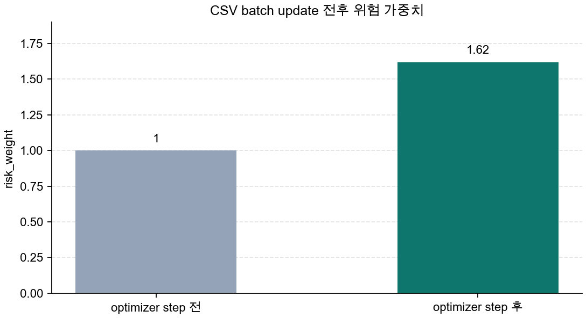
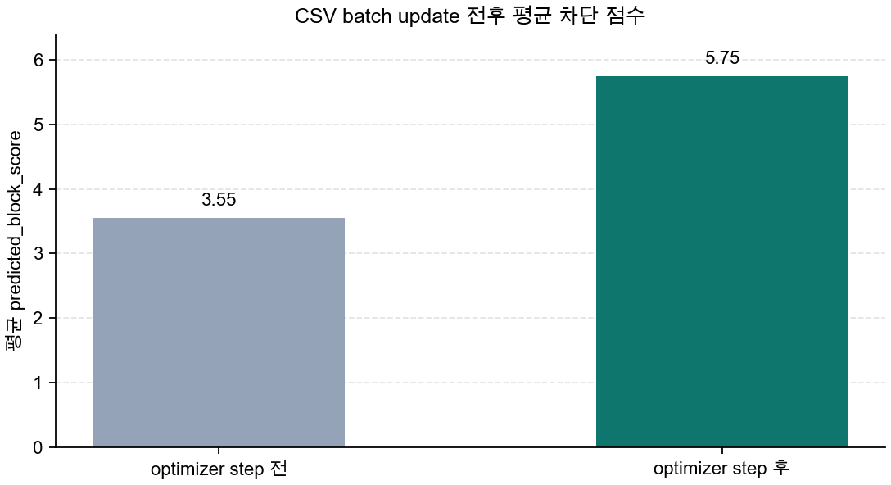
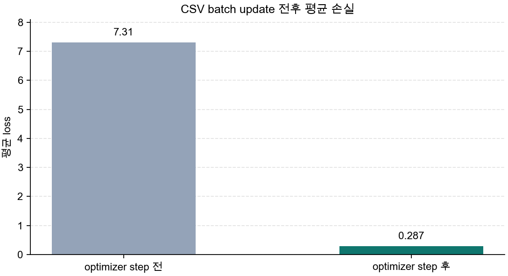

# P5-7.1 옵티마이저(optimizer)의 역할

> Section ID: `P5-7.1`
> Version: `v2026.07.31`

P5-6장에서는 학습 루프, step/batch/epoch, 학습(learning)과 모델 실행(inference), 그리고 학습 모드(training mode)와 평가 모드(evaluation mode)를 구분했습니다. 여기까지 오면 이제 아주 직접적인 질문이 남습니다. 모델이 틀렸다는 사실을 숫자로 계산한 뒤, 그다음 실제 모델 내부 숫자는 어디에서 바뀌는가 하는 질문입니다.

손실도 계산했고, gradient도 구했는데, 실제로 가중치는 누가 바꾸는가?

그 역할을 맡는 것이 옵티마이저(optimizer)입니다.

옵티마이저는 역전파가 계산한 gradient를 받아, 손실을 줄이는 방향으로 파라미터를 실제로 업데이트하는 규칙이다. 다시 말해, `이쪽으로 바꾸면 손실이 줄어들 수 있다`는 계산 결과를 받아 `그래서 이번 step에서 가중치를 이렇게 바꾸자`는 실제 조정으로 넘기는 단계가 옵티마이저입니다.

손실, gradient, update의 역할이 다시 섞이면 개념사전의 [옵티마이저(optimizer)](../../../reference/concept-glossary-parts/08-ieung.md#optimizer) 항목을 기준으로 역할을 다시 나눕니다.

한 번의 학습 step을 아주 거칠게 말하면, 모델은 먼저 예측을 내고, 그 예측이 얼마나 틀렸는지 계산하고, 그 틀림이 어느 가중치와 연결되는지 계산한 뒤, 마지막에 실제 가중치 숫자를 바꿉니다. 여기서 마지막 단계를 맡는 것이 옵티마이저입니다.

이 흐름을 읽을 때는 다음 세 문장을 먼저 붙잡는 편이 좋습니다.

- 손실은 틀림을 숫자로 만듭니다.
- 역전파는 각 가중치의 방향 신호를 계산합니다.
- 옵티마이저는 그 신호를 실제 업데이트로 바꿉니다.

## optimizer가 update를 맡는 질문

- 옵티마이저는 학습 절차에서 어떤 자리에 있는가?
- 손실 함수, 역전파, 옵티마이저는 어떤 역할 차이를 가지는가?
- 왜 `좋은 gradient`만으로는 충분하지 않고 `업데이트 규칙`이 따로 필요한가?
- optimizer를 단순한 구현 함수가 아니라 파라미터를 실제로 바꾸는 역할로 읽으려면 무엇을 보아야 하는가?

이 절에서는 `누가 파라미터를 실제로 바꾸는가`를 닫는 데 집중합니다. 즉, 여기서는 `틀림을 계산하는 단계`, `gradient를 계산하는 단계`, `gradient를 실제 update로 바꾸는 단계`를 분리해 읽는 기준을 먼저 세웁니다. 이 구분이 먼저 잡혀야 다음 절에서 learning rate나 Adam을 볼 때도 `무엇을 조절하는 이야기인가`가 흐려지지 않습니다.

대신 이번 절에서 바로 넓히지 않을 질문도 분명합니다. 같은 gradient라도 learning rate에 따라 update 보폭이 어떻게 달라지는지는 다음 Section인 P5-7.2에서 이어서 설명합니다. Adam 같은 적응형 optimizer가 단순 기준 update에 무엇을 더 보완하려 하는지는 P5-7.3에서 다시 설명합니다. adaptive optimization의 수렴 분석은 P5-7.4 보충학습으로 분리합니다.

## gradient와 update 규칙의 판단 기준

- 옵티마이저를 `gradient를 실제 업데이트로 바꾸는 규칙`이라고 설명할 수 있습니다.
- 손실 함수, 역전파, 옵티마이저가 각각 무엇을 끝내는 단계인지 구분할 수 있습니다.
- `gradient를 계산했다`와 `파라미터가 실제로 바뀌었다`가 왜 다른 문장인지 설명할 수 있습니다.
- 작은 Python 예제를 읽으며 gradient, update, 파라미터 반영이 서로 다른 단계라는 점을 확인할 수 있습니다.

## 옵티마이저는 학습 절차의 어디에 있는가

Part 5 초반 흐름을 다시 묶어 보면 딥러닝 학습은 다음 순서로 진행됩니다.

1. 순전파(forward pass)로 예측을 계산합니다
2. 손실 함수(loss function)로 틀림을 숫자로 만듭니다
3. 역전파(backpropagation)로 gradient를 계산합니다
4. 옵티마이저(optimizer)가 파라미터를 업데이트합니다

즉, 옵티마이저는 gradient를 계산하는 장치가 아니라, `계산된 gradient를 보고 다음 파라미터를 정하는 장치`입니다. 더 직설적으로 말하면, 손실 함수와 역전파는 `어떻게 바꾸면 좋을까`를 계산하고, 옵티마이저는 그 계산 결과를 받아 `실제로 얼마를 바꿀까`를 실행 쪽으로 넘깁니다.

이를 아주 단순하게 그리면 다음과 같습니다.

```mermaid
--8<-- "assets/part-05/chapter-07/optimizer-loop-flow-ko.mmd"
```

이 구분을 먼저 잡아야 학습 코드를 읽을 때 서로 다른 질문을 한 단계로 뭉뚱그리지 않게 됩니다. 손실 함수(loss function)를 보는 단계에서는 `무엇이 얼마나 틀렸는가`를 확인합니다. 역전파(backpropagation)를 보는 단계에서는 `그 틀림이 각 파라미터에 어떤 방향 신호로 전달되는가`를 봅니다. 옵티마이저(optimizer)를 보는 단계에서는 `그 신호가 실제 update로 적용돼 파라미터가 바뀌었는가`를 확인합니다.

이 세 단계를 섞어 읽으면 `loss가 계산됐다`, `gradient가 나왔다`, `모델이 실제로 업데이트됐다`를 같은 뜻처럼 받아들이기 쉽습니다. 하지만 실제 학습에서는 이 셋이 서로 다른 역할을 맡습니다. 따라서 먼저 `틀림을 재는 단계`, `책임을 계산하는 단계`, `실제로 파라미터를 움직이는 단계`를 나누어 읽는 기준을 세워 두는 편이 안전합니다.

- 손실 함수: 무엇이 틀렸는지 숫자로 말해 준다
- 역전파: 누가 얼마나 틀림에 기여했는지 계산해 준다
- 옵티마이저: 그래서 실제로 얼마만큼 바꿀지 결정한다

이 세 문장이 Part 5의 학습 계산 흐름을 읽는 가장 작은 지도입니다. 독자는 세 용어를 따로 외우기보다, `틀림 -> 책임 -> 실제 수정`의 순서로 묶어 기억하는 편이 훨씬 안전합니다. 이 순서가 머릿속에 잡혀 있으면 코드에서 `loss`, `backward`, `step`이 나올 때도 각각이 무엇을 끝낸 줄인지 더 쉽게 읽을 수 있습니다.

## 왜 gradient만으로는 충분하지 않은가

gradient는 방향(direction)에 대한 정보입니다. 보통은 `어느 쪽으로 움직이면 손실이 줄어드는가`를 알려 줍니다. 이 신호만으로도 학습이 전혀 무작위가 아니라는 점은 분명해집니다. 하지만 실제 업데이트(update)에는 `좋은 방향을 안다`는 사실만으로는 아직 부족합니다.

이유는 간단합니다. 파라미터를 실제로 바꾼다는 것은 화살표를 보는 일에서 끝나지 않고, 그 화살표를 따라 얼마만큼, 어떤 방식으로 이동할지까지 정하는 일이기 때문입니다. 지도에서 `이쪽으로 내려가면 된다`는 표시를 봤다고 해서 곧바로 같은 속도로 같은 폭을 걷는 것은 아닙니다. 같은 gradient를 받아도 한 번에 거의 움직이지 않을 수도 있고, 적절한 폭으로 움직일 수도 있고, 너무 크게 움직여 좋은 지점을 지나칠 수도 있습니다. 즉, gradient는 `내려가는 방향 신호`를 주지만, 실제 학습은 그 신호를 `실제 이동`으로 바꾸는 규칙이 함께 있어야 진행됩니다.

예를 들어 다음 질문이 남습니다.

- 한 번에 얼마나 크게 움직일 것인가?
- 이전 단계에서 움직이던 방향을 얼마나 참고할 것인가?
- 좌표마다 다른 속도로 움직일 것인가?

이 질문들은 모두 `방향을 안다`와 `실제로 업데이트한다` 사이에 아직 한 단계가 더 있다는 뜻입니다. 즉, gradient는 지도(map)에 가깝고, optimizer는 이동 규칙(rule of movement)에 가깝습니다.

다음처럼 이해하면 충분합니다.

`gradient가 길의 방향표지라면, optimizer는 얼마나 빠르게 어떤 방식으로 걸을지를 정하는 규칙이다.`

이 비유를 실제 문장으로 다시 쓰면 다음과 같습니다.

- gradient는 `어느 쪽이 내려가는가`를 알려 줍니다.
- optimizer는 `그 방향을 실제 update로 어떻게 바꿀까`, `한 번에 얼마나 바꿀까`를 정합니다.
- 그래서 같은 gradient라도 optimizer 규칙이 다르면 실제 학습 모습이 달라질 수 있습니다.

## 옵티마이저는 무엇을 update로 만든다고 읽어야 하는가

초심자에게 자주 생기는 오해는 `gradient를 계산했다`는 말과 `모델이 이미 바뀌었다`는 말을 같은 뜻으로 읽는 것입니다. 하지만 실제로는 단계가 하나 더 있습니다.

1. 현재 파라미터에서 gradient를 계산합니다.
2. optimizer가 그 gradient를 보고 update 값을 만듭니다.
3. 파라미터에 그 update를 반영합니다.

이 순서를 천천히 읽으면, optimizer가 하는 일은 `gradient를 그냥 전달하는 것`이 아니라 `gradient를 파라미터에 적용 가능한 이동량으로 바꾸는 것`이라는 점이 보입니다. gradient는 아직 `어느 쪽이 내려가는가`를 알려 주는 계산 결과입니다. update는 그 계산 결과를 바탕으로 `그래서 이번 step에서 실제로 얼마만큼 이동할 것인가`를 숫자로 만든 값입니다. 그리고 파라미터 반영은 그 이동량이 실제 가중치 값에 더해지거나 빠지면서 모델 내부 숫자가 바뀌는 단계입니다. 이 셋을 한 문장으로 묶으면 `방향 신호`, `이동량 계산`, `실제 숫자 변경`입니다.

즉, gradient는 아직 `바뀌어야 할 방향과 크기에 대한 신호`이고, update는 `실제로 파라미터에 적용되는 이동량`입니다. 같은 `-16.0`이라는 gradient가 나와도, 그것은 아직 `지금 가중치가 바로 -16.0만큼 바뀐다`는 뜻이 아닙니다. 그 값은 optimizer 규칙을 거쳐 `이번 step의 실제 이동량`으로 다시 해석되어야 합니다.

이 구분을 놓치면 학습 로그나 코드를 읽을 때도 단계가 섞입니다. `gradient가 잘 계산됐다`는 말은 방향 신호가 나왔다는 뜻이고, `update가 적용됐다`는 말은 그 신호가 실제 파라미터 변화로 이어졌다는 뜻입니다. 따라서 optimizer를 읽을 때는 `gradient가 있었는가`에서 멈추지 말고, `그 gradient가 어떤 update 값으로 바뀌었고, 그 update가 실제로 반영됐는가`까지 함께 확인해야 합니다.

이 차이를 구분하지 않으면, 학습이 느릴 때 무엇이 병목인지 읽기 어려워집니다. gradient 계산은 잘 됐는데 update가 지나치게 보수적일 수도 있고, 반대로 방향은 맞지만 update가 과격할 수도 있기 때문입니다. 이런 보폭 문제는 다음 절 P5-7.2에서 learning rate와 함께 더 직접적으로 읽습니다.

## 옵티마이저의 역할: 확인할 판단 기준

이 사례에서는 옵티마이저가 gradient를 실제 update 규칙으로 바꾸는 장치라는 점이 드러나는지 확인한다.

### 사례. 손실과 gradient는 계산됐지만 update는 아직 적용되지 않은 경우

학습 코드를 읽다 보면, 모델이 얼마나 틀렸는지 숫자로 계산했고 그 틀림이 각 가중치에 어떤 방향으로 전달되어야 하는지도 계산했지만, 정작 가중치 숫자 자체는 아직 그대로인 순간을 만날 수 있습니다. 코드로는 흔히 `loss.backward()`까지는 끝났는데, 아직 `optimizer.step()`이 호출되지 않은 지점이 여기에 해당합니다. 사람은 이 장면을 보면 이미 학습이 거의 다 진행됐다고 느끼기 쉽지만, 실제로는 `어떻게 바꿔야 하는가`까지만 계산됐을 뿐 `실제로 바뀌었다`고 말할 단계는 아닙니다.

이 장면에서 optimizer 관점은 질문을 바꿉니다. `gradient가 계산됐는가`에서 멈추지 않고, `그 gradient가 실제 update로 적용됐는가`를 확인합니다. 손실과 gradient는 계산 결과이고, optimizer step은 그 계산 결과를 모델 내부 숫자 변화로 바꾸는 마지막 절차입니다. 따라서 이 절에서 중요한 것은 `계산을 끝냈다`와 `가중치를 바꿨다`를 다른 문장으로 읽는 습관입니다.

그래서 이 사례에서 확인해야 할 결과는 `backward를 했다`가 아니라, `optimizer step까지 가서 파라미터가 실제로 달라졌는가`입니다.

이 장면을 더 직접적으로 나누어 보면 다음과 같습니다.

| 지금 이미 계산된 것 | 아직 일어나지 않은 것 |
| --- | --- |
| 예측값이 나왔다 | 가중치 숫자가 바뀌었다 |
| 손실이 계산됐다 | 다음 step의 출발 파라미터가 정해졌다 |
| gradient가 계산됐다 | update가 실제로 반영됐다 |

즉, `loss와 gradient가 있다`는 것은 학습이 어디로 가야 하는지 계산한 상태이고, `optimizer.step()`까지 끝났다는 것은 그 계산이 실제 모델 숫자 변화로 이어졌다는 뜻입니다. 현재 절의 핵심은 바로 이 경계입니다.

| 사람이 먼저 보기 쉬운 기준 | optimizer 관점으로 다시 읽는 기준 |
| --- | --- |
| gradient까지 구했으니 학습이 이미 끝났다고 느끼기 쉽다 | gradient 계산과 update 적용은 별도 단계다 |
| loss가 찍혔으니 모델도 바로 더 좋아졌다고 생각하기 쉽다 | loss는 상태를 보여 주는 숫자이고, 실제 파라미터 변화는 optimizer가 만든다 |
| backward만 보면 충분하다고 느끼기 쉽다 | 파라미터가 바뀌려면 optimizer step이 실제로 실행돼야 한다 |

이 사례를 한 번 더 압축하면, optimizer의 역할을 읽는 첫 흐름은 다음과 같습니다.

```mermaid
--8<-- "assets/part-05/chapter-07/optimizer-step-bridge-ko.mmd"
```

이 도식은 사례를 다시 설명하려는 것이 아니라, `gradient 계산`과 `실제 update 적용`을 한 번에 다시 분리해 붙잡기 위한 것입니다. 같은 gradient가 learning rate에 따라 어떻게 다른 보폭으로 바뀌는지는 다음 절 P5-7.2에서, Adam류가 최근 흐름과 좌표별 차이를 어떻게 더 반영하는지는 P5-7.3에서 이어집니다.

## 연습 및 예제

이번 예제의 목표는 gradient 계산과 실제 update 적용을 분리해서 보는 것입니다. 여기서는 learning rate의 크기 비교 자체보다, `gradient를 구한 뒤 optimizer가 update를 만들고, 그 다음에야 파라미터가 바뀐다`는 순서를 눈으로 확인하는 쪽이 더 중요합니다. 다시 말해, 이 예제는 `어떤 learning rate가 가장 좋다`를 고르는 예제가 아니라, `gradient`, `update`, `파라미터 변화`가 코드와 출력에서 서로 어떻게 다른 자리에 나타나는가를 읽는 예제입니다.

입력:

- CSV 파일의 여러 관측 행
- 각 행의 압력 미복귀 정도 `pressure_unrecovered`
- 각 행의 목표 차단 점수 `target_block_score`
- 현재 위험 가중치 `risk_weight`
- 고정된 학습률 `learning_rate`

출력:

- 예측된 차단 점수
- 손실
- gradient
- optimizer가 만든 update 값
- 업데이트 전후 위험 가중치와 손실

문제 상황:

- gradient를 계산했다고 해서 파라미터가 자동으로 바뀌는 것은 아니다
- optimizer가 만든 update가 실제로 적용돼야 모델 내부 숫자가 변한다

확인할 개념:

- gradient는 방향 신호다
- optimizer는 그 신호를 update 값으로 바꾼다
- 파라미터 변화는 update 적용 뒤에야 생긴다

코드를 보기 전에 먼저 이번 예제를 `CSV에서 읽은 batch`, `gradient 계산 후`, `optimizer step 후`로 나누어 읽겠다고 생각하는 편이 좋습니다. 예제 데이터는 [optimizer-step-role-log.csv](../../../assets/part-05/chapter-07/optimizer-step-role-log.csv)에 있습니다.

| 구간 | 여기서 확인할 것 |
| --- | --- |
| CSV batch | 여러 샘플에서 현재 파라미터가 평균적으로 얼마나 틀렸는가 |
| gradient 계산 후 | 어느 방향으로 바꿔야 하는지 신호는 나왔지만 파라미터는 아직 그대로인가 |
| optimizer step 후 | optimizer가 만든 이동량이 실제 파라미터에 반영됐는가 |
| 업데이트 후 상태 | 같은 CSV batch를 다시 보았을 때 평균 손실이 어떻게 달라졌는가 |

```python
# CSV batch에서 평균 손실과 평균 gradient를 계산한 뒤 optimizer step 전후의 risk_weight 변화를 확인하는 예제입니다.
from csv import DictReader
from pathlib import Path

DATA_PATH = Path("docs/assets/part-05/chapter-07/optimizer-step-role-log.csv")


def load_rows(path):
    with path.open(newline="", encoding="utf-8") as f:
        return [
            {
                "case_id": row["case_id"],
                "equipment_group": row["equipment_group"],
                "pressure_unrecovered": float(row["pressure_unrecovered"]),
                "target_block_score": float(row["target_block_score"]),
            }
            for row in DictReader(f)
        ]


def predict(row, risk_weight):
    return row["pressure_unrecovered"] * risk_weight


def mean_loss(rows, risk_weight):
    losses = [
        (predict(row, risk_weight) - row["target_block_score"]) ** 2
        for row in rows
    ]
    return sum(losses) / len(losses)


def mean_gradient(rows, risk_weight):
    gradients = [
        2
        * (predict(row, risk_weight) - row["target_block_score"])
        * row["pressure_unrecovered"]
        for row in rows
    ]
    return sum(gradients) / len(gradients)


rows = load_rows(DATA_PATH)
risk_weight_before = 1.0
learning_rate = 0.03

loss_before = mean_loss(rows, risk_weight_before)
gradient_risk_weight = mean_gradient(rows, risk_weight_before)
risk_weight_after_backward = risk_weight_before

optimizer_delta = -learning_rate * gradient_risk_weight
risk_weight_after_step = risk_weight_after_backward + optimizer_delta
loss_after = mean_loss(rows, risk_weight_after_step)

print("[batch]")
print("sample_count =", len(rows))
print("loss_before =", round(loss_before, 3))

print("\n[after gradient calculation]")
print("gradient_risk_weight =", round(gradient_risk_weight, 3))
print("parameters_changed =", risk_weight_after_backward != risk_weight_before)

print("\n[after optimizer step]")
print("optimizer_delta =", round(optimizer_delta, 3))
print("risk_weight_after_step =", round(risk_weight_after_step, 3))
print("loss_after =", round(loss_after, 3))
print("parameters_changed =", risk_weight_after_step != risk_weight_before)

print("\n[preview]")
for row in rows[:3]:
    before = predict(row, risk_weight_before)
    after = predict(row, risk_weight_after_step)
    target = row["target_block_score"]
    print(
        f"{row['case_id']}: "
        f"before={before:.3g}, after={after:.3g}, target={target:.3g}"
    )
```

```text
[batch]
sample_count = 36
loss_before = 7.308

[after gradient calculation]
gradient_risk_weight = -20.648
parameters_changed = False

[after optimizer step]
optimizer_delta = 0.619
risk_weight_after_step = 1.619
loss_after = 0.287
parameters_changed = True

[preview]
pump-01: before=1.1, after=1.78, target=2.46
pump-02: before=1.4, after=2.27, target=2.97
pump-03: before=1.7, after=2.75, target=3.58
```

이 출력은 순서대로 읽는 편이 좋습니다. 먼저 `[batch]` 구간에서는 CSV에서 읽은 36개 샘플을 현재 `risk_weight_before = 1.0`으로 보았을 때 평균 손실이 `7.308`이라는 점을 확인합니다. 이 숫자는 한 행의 우연한 결과가 아니라, 이번 step에서 함께 처리하는 샘플 묶음 전체의 현재 상태입니다.

그다음 `[after gradient calculation]` 구간의 `gradient_risk_weight`를 보면, 이 batch에서 가중치를 어느 방향으로 조정해야 하는지 신호가 계산됐다는 점이 드러납니다. 하지만 바로 아래의 `parameters_changed = False`가 중요합니다. gradient가 계산됐어도 optimizer step이 아직 적용되지 않았으므로, 파라미터 값은 그대로입니다.

처음으로 실제 파라미터 변화가 생기는 곳은 `[after optimizer step]`입니다. 여기서 `optimizer_delta = 0.619`가 만들어지고, 그 이동량이 반영되어 `risk_weight_after_step = 1.619`가 됩니다. 같은 CSV batch를 다시 보았을 때 평균 손실도 `0.287`로 줄어듭니다. 따라서 이 출력에서는 `loss_before`, `gradient_risk_weight`, `parameters_changed = False`, `optimizer_delta`, `risk_weight_after_step`을 한 줄로 이어 읽는 습관이 중요합니다. 이 순서가 보여 주는 것은 `틀림 계산 -> 방향 신호 계산 -> 아직 미반영 -> 실제 이동량 생성 -> 파라미터 반영`입니다.



이 차트는 `risk_weight_before = 1.0`에서 시작한 값이 optimizer가 만든 이동량을 반영한 뒤 실제로 바뀌었다는 점을 보여 줍니다. 여기서 중요한 것은 `gradient를 계산했다`는 사실만이 아니라, 그 계산 결과가 가중치 숫자 변화로 이어졌다는 점입니다.



이 차트는 같은 update가 CSV batch의 평균 예측값에도 바로 영향을 준다는 점을 보여 줍니다. 즉, optimizer는 내부 가중치만 바꾸는 것이 아니라, 다음 예측이 달라질 수 있는 출발점 자체를 바꿉니다.



마지막 차트에서는 그 결과 CSV batch의 평균 손실도 줄어든다는 점을 확인할 수 있습니다. 이 순서를 눈으로 다시 읽으면, `gradient 계산`과 `loss 감소` 사이에 `optimizer가 만든 실제 update 적용`이라는 중간 단계가 분명히 존재한다는 점이 더 잘 보입니다.

즉, 이 예제에서 독자가 꼭 읽어야 할 것은 다음입니다.

- `gradient_risk_weight`는 아직 파라미터 자체가 아닙니다.
- `optimizer_delta`는 gradient를 실제 이동량으로 바꾼 값입니다.
- 파라미터 변화는 `risk_weight_after_step`에서 비로소 보입니다.
- 따라서 `gradient를 구했다`와 `모델을 실제로 업데이트했다`는 같은 말이 아닙니다.

여기서 독자가 얻어야 할 핵심은 `gradient가 나왔다`와 `모델이 바뀌었다` 사이에 optimizer가 만든 중간 단계가 실제로 존재한다는 점입니다. 같은 gradient라도 update 보폭을 어떻게 정하느냐에 따라 결과가 더 달라지는지는 다음 절 P5-7.2에서 이어집니다.

## 언제 optimizer 관점으로 먼저 읽는가

이 절을 꺼내야 하는 시점은 `gradient를 계산했다`는 설명만으로는 아직 파라미터가 실제로 어떻게 움직이는지 닫히지 않을 때입니다.

| 먼저 보이는 문제 장면 | optimizer 관점이 먼저 유용한 이유 | 바로 다음에 넘길 질문 |
| --- | --- | --- |
| gradient는 알겠는데 실제 이동 폭과 규칙이 안 보인다 | update를 별도 규칙으로 읽게 해 줍니다. | 같은 gradient라도 learning rate가 보폭을 어떻게 바꾸는지 봐야 합니다. |
| 손실, 역전파, 업데이트가 한 묶음으로 섞여 보인다 | `틀림 -> gradient -> 실제 수정`의 역할 차이를 분명히 할 수 있습니다. | update 보폭과 적응형 보정은 뒤 절에서 봐야 합니다. |
| 같은 gradient여도 결과가 다를 수 있다는 점이 직관적이지 않다 | optimizer가 학습 동역학 자체를 바꾼다는 점을 고정할 수 있습니다. | P5-7.2, P5-7.3에서 보폭과 적응형 update 차이를 봐야 합니다. |

## 체크리스트

- 옵티마이저(optimizer)가 `gradient를 계산하는 단계`가 아니라 `계산된 gradient를 실제 파라미터 업데이트로 바꾸는 단계`라는 점을 설명할 수 있는가?
- 손실 함수, 역전파, 옵티마이저를 각각 `틀림 계산`, `방향 신호 계산`, `실제 수정 적용`으로 나누어 말할 수 있는가?
- `gradient를 계산했다`와 `파라미터가 실제로 바뀌었다`가 왜 다른 문장인지 구분할 수 있는가?
- optimizer가 만든 update 값이 실제로 반영된 뒤에야 파라미터와 손실 변화가 나타난다는 점을 설명할 수 있는가?
- 다음 절 P5-7.2에서는 learning rate가 update 보폭을 어떻게 바꾸는지, P5-7.3에서는 Adam류가 무엇을 더 보완하는지 이어진다는 흐름을 알고 있는가?

## 출처와 참고 자료

- Ian Goodfellow, Yoshua Bengio, Aaron Courville, `Deep Learning`, MIT Press, 2016, 확인 날짜: 2026-06-29. [https://www.deeplearningbook.org/](https://www.deeplearningbook.org/){: target="_blank" rel="noopener noreferrer" }
- Léon Bottou, `Large-Scale Machine Learning with Stochastic Gradient Descent`, COMPSTAT, 2010, 확인 날짜: 2026-07-19. [https://doi.org/10.1007/978-3-7908-2604-3_16](https://doi.org/10.1007/978-3-7908-2604-3_16){: target="_blank" rel="noopener noreferrer" }
- Sebastian Ruder, `An overview of gradient descent optimization algorithms`, arXiv, 2016, 확인 날짜: 2026-07-19. [https://arxiv.org/abs/1609.04747](https://arxiv.org/abs/1609.04747){: target="_blank" rel="noopener noreferrer" }
