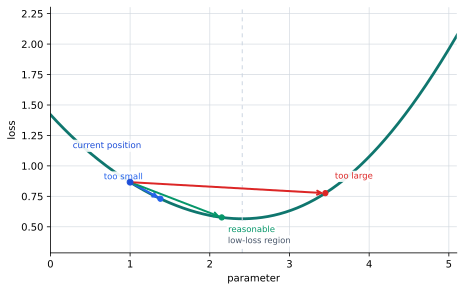
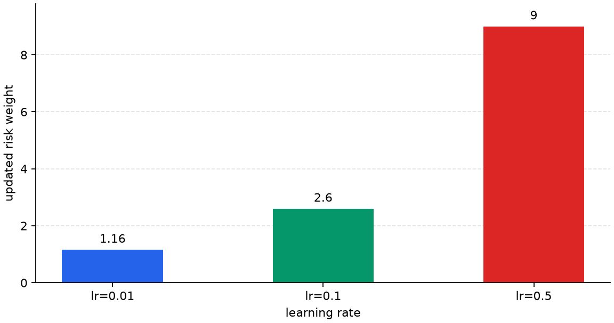
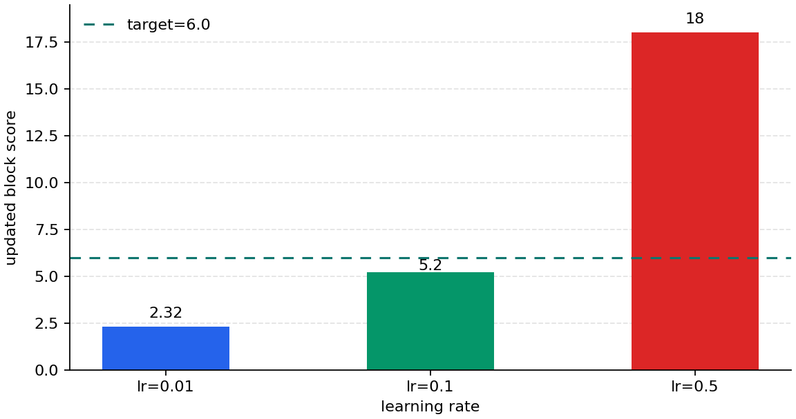
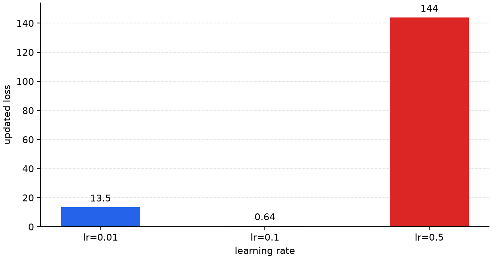

# P5-7.2 Learning Rate And Update Step Size

Section ID: `P5-7.2`
Version: `v2026.07.17`

In P5-7.1, we saw that the optimizer is `the rule that turns gradients into actual parameter updates`. Once we reach this point, the next question appears immediately.

Then why, even with the same gradient, can one update become too small or too large?

The setting that appears first when answering this question is the learning rate.

The learning rate is the stride length that decides how far the optimizer moves at one time when it turns a gradient into an actual update. In other words, if the gradient tells us `in which direction should we change it`, then the learning rate decides `how far should we move in that direction in this step`.

If the relationship among learning rate, gradient, and update starts to blur again, it helps to return together to the [learning rate](../../../reference/concept-glossary.md#learning-rate) and [optimizer](../../../reference/concept-glossary.md#optimizer) entries in the concept glossary.

## Scope Of This Section

- Where does the learning rate attach in the optimizer update?
- Why, even with the same gradient, does the actual update result differ when the learning rate differs?
- What happens when the learning rate is too small or too large?
- Why are `the gradient direction is correct` and `the update result is appropriate` different statements?

This section focuses on closing `how far should we actually move with the same gradient`. In other words, assuming we already understand the role of the optimizer, here we first explain how the learning rate changes the update step size. This distinction has to be clear so that when we later look at adaptive optimizers such as Adam, the question `what exactly are they adjusting further` does not blur.

At the same time, it is also clear which questions we will not widen immediately in this section. Adaptive updates that additionally reflect recent gradient flow and coordinate-by-coordinate differences continue in the next section, P5-7.3. Ways of not keeping the learning rate fixed throughout training but operating it through warmup or decay are explained again in the supplementary study of P5-7.6. The convergence analysis of adaptive optimization is separated into the supplementary study of P5-7.4.

## Goals Of This Section

- You can explain the learning rate as `the stride length of the optimizer update`.
- You can say that even with the same gradient, the actual update result can differ depending on the learning rate.
- You can explain why too small a stride and too large a stride create different problems.
- You can confirm the difference between the gradient and the update stride with an executable Python example.

## Where Does The Learning Rate Attach When The Optimizer Makes An Update

The reason the learning rate appears together when explaining the optimizer is that the learning rate attaches as the stride length at the exact moment when the optimizer turns the gradient into an actual update. The learning rate itself does not change the weight directly, but it is used as the key scale factor when the optimizer decides `how much should we change it`.

So the learning rate is not the value that tells the model `which direction should it go`. It is the setting that decides `how strongly should the already-computed direction signal be reflected in practice`.

In the simplest form, the update can usually be read as follows.

$$
\text{update} = - \text{learning rate} \times \text{gradient}
$$

$$
\text{new parameter} = \text{old parameter} + \text{update}
$$

In these expressions, what this section has to hold is not memorizing the formula itself, but the role of each term.

- `gradient` tells us in which direction the loss decreases
- `learning rate` decides how strongly to reflect that direction signal
- `update` is the movement amount actually applied to the parameter after the two are combined

When these two lines are read together, it also becomes clear where the learning rate works. In the first line, the learning rate decides how large an update the gradient becomes. In the second line, that update is reflected in the actual parameter value. In other words, the learning rate is not a value that changes the loss directly. It decides how far the parameter moves, and that result continues into the next prediction and the next loss.

So if we skip the explanation of the learning rate, the reader can easily miss what determined the size of the movement amount between `the gradient came out` and `the parameter changed`. P5-7.2 is exactly the section that explains that middle link.

If it is too small:

- learning can become very slow
- and it can take a long time for the loss to decrease

If it is too large:

- even while knowing the right direction, it can overshoot
- and the loss can fluctuate unstably

In other words, the learning rate is the `update step size` used when the optimizer makes an update. Even when the same gradient comes out, if the learning rate differs, the actual movement amount made by the optimizer changes, and as a result the starting parameter position in the next step changes too.

As we discussed hyperparameters in Part 4, the learning rate is not a parameter generated automatically by learning. It is a setting value chosen or searched by people.

Here, it is safer to hold the following distinction together.

| Value | Role |
| --- | --- |
| gradient | signal that tells us which direction goes downward from the current position |
| learning rate | stride length that decides how far to move in that direction at one time |
| optimizer | procedure that applies that stride length and rule to create an actual movement |

If we bundle this table back into one sentence, it becomes `gradient is the direction`, `learning rate is the distance`, and `optimizer is the execution of the actual movement`. From this point on, all the cases and examples should be read through the same question: `how does the learning rate turn the same gradient into different actual movement amounts?`

## Why Do The Results Differ Even With The Same Gradient

Even if we know from the same position which direction goes downward, if the stride is too small we can barely move, if it is appropriate we can approach the low-loss region, and if it is too large we can overshoot a good point and make the loss large again. The important point here is that `knowing the direction` and `arriving at a good next position` are not the same thing.



What matters in this graph is that `the gradient direction is correct` and `the update made by the optimizer is appropriate` are not the same statement. When reading the role of the optimizer, we have to look not only at the direction signal but also at how far that signal actually moved the parameter. Even when following the same arrow, if one step is too short there is almost no progress, and if it is too long it can overshoot a good point. The learning rate is exactly the value that decides `the length of that one step`.

It is enough to understand it like this.

- the gradient tells us `which way should we go`
- the learning rate decides `how far should we go`
- so even with the same gradient, the result can differ if the learning rate differs

## Cases And Examples

The cases in this section are not about choosing an optimizer. They are about reading `a scene where the same gradient turns into different update step sizes`. So when looking at a case here, always confirm it in the following order. The core is to go beyond `was there a gradient` and read `what happened after that gradient turned into an actual movement amount`.

1. Is the gradient direction correct?
2. How large an optimizer update did the learning rate make?
3. How did the parameter and the loss actually change after the update?

### Case. The Gradient Is The Same, But Only The Learning Rate Differs

Suppose the same gradient was computed from the same current state. For example, let the current risk weight be `1.0`, and the computed `gradient_risk_weight` be the same `-16.0`. Now the only thing that changes is the learning rate. What the reader should want to see here is not `which optimizer is more famous`, but `how does the same direction signal turn into very different actual movement amounts`.

People reading this scene for the first time often think, `If the gradient is the same, won't it eventually learn in a similar way anyway?` This interpretation is natural as long as we look only at the direction. All three cases are trying to move to the same side. But from the learning-rate viewpoint, the question changes. We have to look beyond `which way does it move` and ask `how far did it actually move in that direction`.

Now let us divide the learning rate into `0.01`, `0.1`, and `0.5`.

- with `0.01`, the update is very small. The direction is correct, but in one step it barely makes progress. On the surface, the loss may still go down a little, but the actual learning can feel frustratingly slow.
- with `0.1`, the same gradient turns into a relatively appropriate-sized movement. It can move closer to the target without being too short or too long.
- with `0.5`, the update becomes too large. Even with the right direction, it can overshoot a good point, so the loss can grow again or training can become unstable.

In other words, the difference among the three cases is not `the direction`, but `the stride`. The learning rate does not create a new gradient. It decides how strongly to reflect the already-computed same gradient as an actual update. That is why a small learning rate can create `a state where the direction is correct but it barely moves`, and a large learning rate can create `a state where the direction is correct but it overshoots`.

If we restate this case in a table, it becomes the following.

| Given the same gradient | learning rate too small | learning rate relatively appropriate | learning rate too large |
| --- | --- | --- | --- |
| actual update size | so small that it barely moves | large enough to get closer to the target | so large that it overshoots a good point |
| scene visible on the surface | the loss decreases very slowly | the loss decreases noticeably | the loss can grow again or fluctuate |
| more accurate interpretation | the direction is right, but the stride is insufficient | the direction and the stride match well together | the direction is right, but the stride is too aggressive |

The reason this case supports the current section is clear. The learning rate is not `an extra number for explanation`. It is the value that decides how much of the same gradient is actually reflected. So the central sentence the reader needs to hold in P5-7.2 is `even with the same gradient, the actual update result differs when the learning rate differs`. The example and charts in this section are exactly devices for checking that sentence again through numbers and pictures.

## Practice And Example

The goal of this example is to see a scene where the same gradient result turns into different updates depending on the learning rate. So rather than the learning rate value itself, we read the output centered on how much `optimizer_delta` changes. In this example, the `current state` and the `gradient` are fixed, while the `learning rate` and the resulting actual movement amount change.

Before looking at the code, it is helpful to hold the following distinction first.

| What stays fixed | What changes |
| --- | --- |
| current risk weight `risk_weight` | learning rate `learning_rate` |
| current prediction and loss | `optimizer_delta` |
| computed `gradient_risk_weight` | updated weight, score, and loss |

Input:

- current risk weight `risk_weight`
- pressure unrecovered level `pressure_unrecovered`
- target block score `target_block_score`
- learning rate `learning_rate`

Output:

- predicted block score
- loss
- gradient
- update value made by the optimizer
- updated weight for each learning rate
- comparison of how much the model gets closer to the target after the update

Problem scene:

- the learning rate does not change the gradient itself, but it greatly changes the size of the risk-weight update made by the optimizer
- because a too-large learning rate can overshoot even while knowing the right direction, we have to compare the results together

Concepts to confirm:

- even with the same gradient, the update step size can differ
- when the update step size differs, the new weight, new prediction, and new loss differ
- so `the gradient was computed` and `the model learns well` are not the same statement

```python
pressure_unrecovered = 2.0
target_block_score = 6.0
risk_weight = 1.0
prediction = pressure_unrecovered * risk_weight
loss = (prediction - target_block_score) ** 2
gradient_risk_weight = 2 * (prediction - target_block_score) * pressure_unrecovered

print("[shared state]")
print("predicted_block_score =", round(prediction, 3))
print("loss =", round(loss, 3))
print("gradient_risk_weight =", round(gradient_risk_weight, 3))
for lr in [0.01, 0.1, 0.5]:
    print(f"[lr={lr}]")
    optimizer_delta = -lr * gradient_risk_weight
    updated_risk_weight = risk_weight + optimizer_delta
    updated_prediction = pressure_unrecovered * updated_risk_weight
    updated_loss = (updated_prediction - target_block_score) ** 2
    print(
        "optimizer_delta =", round(optimizer_delta, 3),
        "-> updated_risk_weight =", round(updated_risk_weight, 3),
        ", updated_block_score =", round(updated_prediction, 3),
        ", updated_loss =", round(updated_loss, 3),
    )
```

```text
[shared state]
predicted_block_score = 2.0
loss = 16.0
gradient_risk_weight = -16.0
[lr=0.01]
optimizer_delta = 0.16 -> updated_risk_weight = 1.16 , updated_block_score = 2.32 , updated_loss = 13.542
[lr=0.1]
optimizer_delta = 1.6 -> updated_risk_weight = 2.6 , updated_block_score = 5.2 , updated_loss = 0.64
[lr=0.5]
optimizer_delta = 8.0 -> updated_risk_weight = 9.0 , updated_block_score = 18.0 , updated_loss = 144.0
```

This output is the scene where the same gradient passes through the optimizer's update rule and turns into different `optimizer_delta` values. So do not stop at `what is the gradient`. Instead, read step by step the update value made by the optimizer, the updated weight, the updated score, and the updated loss. What matters here is not that the three lines show three unrelated problems. It is that, from `the same starting point`, the results split when `only the learning rate differs`.

The output format itself now also shows that comparison structure directly. The `[shared state]` section shows the current state and gradient shared by all three cases. The lines `[lr=0.01]`, `[lr=0.1]`, and `[lr=0.5]` then show side by side how the result differs when only the learning rate is changed for that same starting point. So what the reader has to compare in this example is not `three different gradients`, but `how one same gradient is turned into different updates by the learning rate`.







When reading these three charts together, the safest order is the following. First, in `optimizer-example-updated-weight`, look at how differently the actual movement amount changes the weight number by learning rate. Then, in `optimizer-example-updated-score`, check where that difference moved the prediction value. Finally, in `optimizer-example-updated-loss`, see whether the result of that movement reduced the loss, barely moved, or overshot.

What the reader absolutely has to read in this example is the following.

- `gradient_risk_weight` stays the same, but the result can still differ.
- The reason is that the `optimizer_delta` made by the learning rate differs.
- `0.1` got closer to the target, but `0.5`, even with the right direction, moved too far and instead increased the loss.
- So `the gradient was computed` and `the model learns well` are not the same statement.

## When Do We Read From The Learning-Rate Viewpoint First

The time to bring out this section is when `we know the gradient, but we still cannot see why the actual movement speed is too slow or too rough`.

| Problem scene that appears first | Why the learning-rate viewpoint is useful first | The next question to hand off immediately |
| --- | --- | --- |
| the gradient seems right, but the parameters barely move | it lets us check whether the update stride is too small | we then need to see what adaptive updates such as Adam compensate further |
| the loss keeps jumping and fluctuating | it lets us check whether the update stride is too aggressive rather than the direction being wrong | we then need to see optimizers that also consider recent flow and coordinate-wise adjustment |
| it is not intuitive why the results differ even with the same gradient | it fixes the point that the learning rate changes the update step size | in P5-7.3, we then need to see the difference in adaptive updates too |

## Checklist

- Can you explain the learning rate as `the stride length of the optimizer update`?
- Can you say that even with the same gradient, the actual update result can differ depending on the learning rate?
- Can you explain what different problems are created by a too-small learning rate and a too-large learning rate?
- Can you distinguish `the gradient direction is correct` from `the update result is appropriate`?
- Do you know that the next section, P5-7.3, continues by explaining that Adam-like methods additionally reflect recent flow and coordinate-wise differences?
