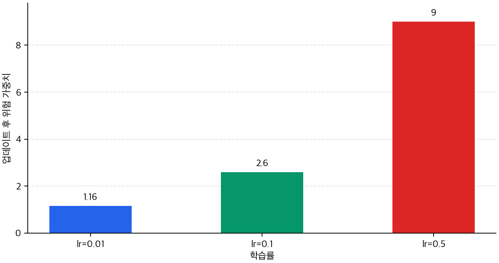
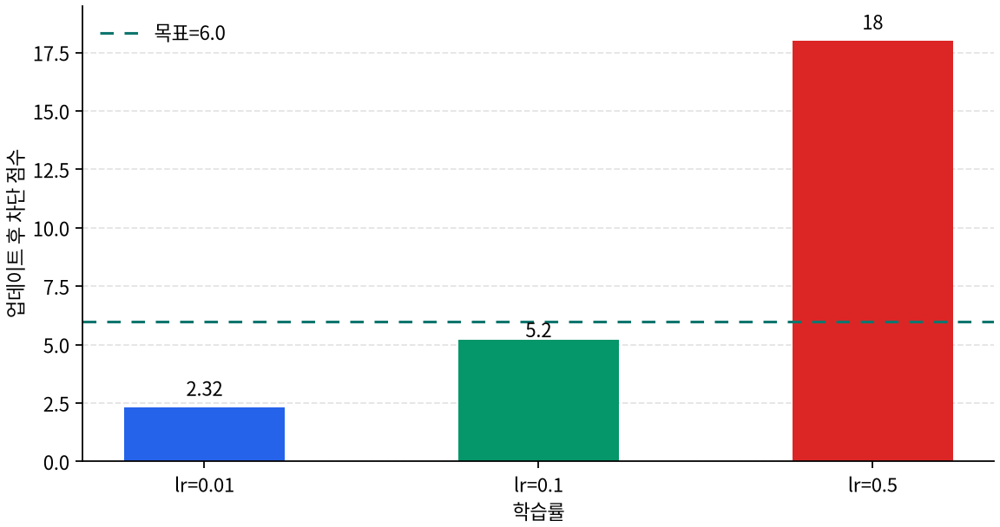
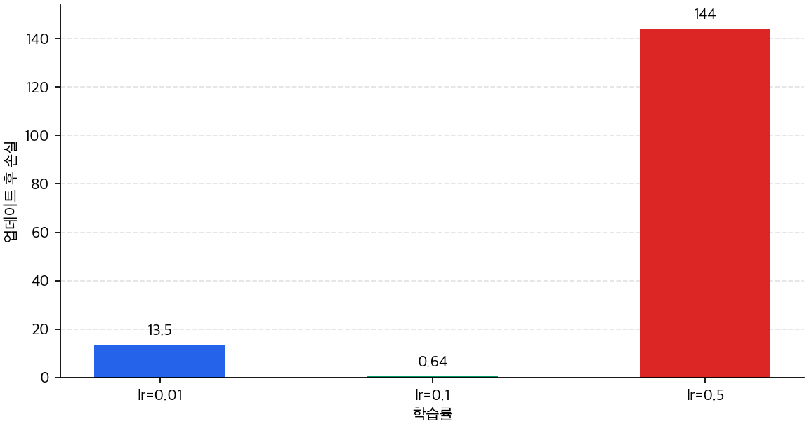

# P5-7.2 학습률(learning rate)과 update 보폭

Section ID: `P5-7.2`
Version: `v2026.07.17`

P5-7.1에서는 옵티마이저(optimizer)가 `gradient를 실제 파라미터 업데이트로 바꾸는 규칙`이라는 점을 보았습니다. 여기까지 오면 바로 다음 질문이 생깁니다.

그렇다면 같은 gradient라도, 한 번의 update는 왜 너무 작거나 너무 커질 수 있는가?

이 질문에 답할 때 가장 먼저 등장하는 설정이 학습률(learning rate)입니다.

학습률은 optimizer가 gradient를 실제 update로 바꿀 때, 한 번에 얼마나 크게 움직일지를 정하는 보폭이다.

학습률, gradient, update의 관계가 다시 섞이면 개념사전의 [학습률(learning rate)](../../../reference/concept-glossary.md#learning-rate)와 [옵티마이저(optimizer)](../../../reference/concept-glossary.md#optimizer) 항목을 함께 다시 보는 편이 좋습니다.

## 이 절의 범위

- 학습률은 optimizer update에 어디에 붙는가?
- 같은 gradient라도 학습률이 다르면 왜 실제 update 결과가 달라지는가?
- 학습률이 너무 작거나 너무 클 때 어떤 일이 생기는가?
- 왜 gradient 방향이 맞다는 사실과 update 결과가 적절하다는 사실은 다른가?

이 절에서는 `같은 gradient를 실제로 얼마만큼 움직일 것인가`를 닫는 데 집중합니다. 즉, 여기서는 optimizer의 역할을 이미 안다는 전제 위에서, learning rate가 update 보폭을 어떻게 바꾸는지 먼저 설명합니다.

대신 이번 절에서 바로 넓히지 않을 질문도 분명합니다. 최근 gradient 흐름과 좌표별 차이를 함께 반영하는 적응형 update는 다음 Section인 P5-7.3에서 이어서 설명합니다. adaptive optimization의 수렴 분석은 P5-7.4 보충학습으로 분리합니다.

## 이 절의 목표

- 학습률을 `optimizer update의 보폭`으로 설명할 수 있습니다.
- 같은 gradient라도 learning rate에 따라 실제 update 결과가 달라진다는 점을 말할 수 있습니다.
- 너무 작은 보폭과 너무 큰 보폭이 왜 서로 다른 문제를 만드는지 설명할 수 있습니다.
- 실행 가능한 Python 예제로 gradient와 update 보폭의 차이를 확인할 수 있습니다.

## optimizer가 update를 만들 때 learning rate는 어디에 붙는가

옵티마이저의 역할을 설명할 때 학습률이 함께 나오는 이유는, optimizer가 gradient를 실제 update로 바꾸는 순간에 학습률이 보폭으로 붙기 때문입니다. 학습률 자체가 가중치를 바꾸는 것은 아니지만, optimizer가 `얼마나 크게 바꿀지`를 정할 때 핵심 배율로 쓰입니다.

너무 작으면:

- 학습이 매우 느려질 수 있고
- 손실이 줄어드는 데 오래 걸릴 수 있습니다

너무 크면:

- 좋은 방향을 알고도 지나쳐 버릴 수 있고
- 손실이 불안정하게 흔들릴 수 있습니다

즉, 학습률은 optimizer가 update를 만들 때 사용하는 `업데이트의 보폭(step size)`입니다.

Part 4에서 하이퍼파라미터(hyperparameter)를 다루었듯, 학습률은 학습으로 자동 생성되는 파라미터가 아니라 사람이 정하거나 탐색하는 설정값입니다.

여기서는 다음 구분을 함께 잡는 편이 안전합니다.

| 값 | 역할 |
| --- | --- |
| gradient | 현재 위치에서 어느 방향이 내려가는지 알려 주는 신호 |
| learning rate | 그 방향으로 한 번에 얼마나 움직일지 정하는 보폭 |
| optimizer | 그 보폭과 규칙을 적용해 실제 이동을 만드는 절차 |

## 왜 같은 gradient라도 결과가 달라지는가

같은 위치에서 내려갈 방향을 알아도, 보폭이 너무 작으면 거의 움직이지 못하고, 적절하면 낮은 손실 근처로 가며, 너무 크면 좋은 지점을 지나쳐 손실이 다시 커질 수 있습니다.


이 그래프에서 중요한 것은 `gradient 방향이 맞다`와 `optimizer가 만든 update가 적절하다`가 같은 말이 아니라는 점입니다. optimizer의 역할을 읽을 때는 방향 신호뿐 아니라 그 신호가 실제로 어느 위치까지 파라미터를 움직였는지를 함께 봐야 합니다.

다음처럼 이해하면 충분합니다.

- gradient는 `어느 쪽으로 가야 하는가`를 알려 줍니다.
- learning rate는 `얼마나 크게 갈 것인가`를 정합니다.
- 그래서 같은 gradient라도 learning rate가 다르면 결과가 달라질 수 있습니다.

## 사례 및 예시

이 절의 사례는 optimizer를 고르는 사례가 아니라, `같은 gradient가 서로 다른 update 보폭으로 바뀌는 장면`을 읽는 사례입니다. 따라서 사례를 볼 때는 항상 다음 순서로 확인합니다.

1. gradient 방향은 맞는가
2. learning rate가 optimizer update를 얼마나 크게 만들었는가
3. update 뒤 파라미터와 손실이 실제로 어떻게 달라졌는가

### 사례 1. gradient는 계산됐지만 파라미터가 거의 움직이지 않는 경우

학습 로그에서 손실이 조금씩 내려가고 있다고 해 보겠습니다. 사람은 보통 `방향은 맞으니 더 오래 돌리면 되겠다`고 판단하기 쉽습니다. 하지만 몇 시간 동안 검증 성능이 거의 움직이지 않는다면, 실제 문제는 gradient의 방향보다 업데이트 보폭이 지나치게 작은 데 있을 수 있습니다.

이 장면에서 learning rate 관점은 질문을 바꿉니다. `gradient가 계산됐는가`에서 멈추지 않고, `optimizer가 그 gradient를 실제 파라미터 변화로 충분히 바꿨는가`를 봅니다. 학습률이 너무 작으면 방향 신호는 맞아도 한 step의 이동량이 작아, 손실 곡선은 내려가지만 실용적인 속도로는 거의 전진하지 못합니다.

그래서 이 사례에서 확인해야 할 결과는 손실이 줄고 있다는 사실만이 아닙니다. 같은 학습 시간 안에 검증 성능이 실제로 따라 올라오는지, update 뒤 파라미터 변화량이 너무 작게 묶여 있지는 않은지를 함께 봐야 합니다.

### 사례 2. gradient 방향은 맞지만 update가 너무 큰 경우

반대로 손실이 내려가다가 다시 튀고, 한 배치에서는 좋아졌다가 다음 배치에서는 다시 나빠지는 경우도 있습니다. 사람은 이 장면을 보면 `모델이 전혀 못 배우는 것 아닌가`라고 느끼기 쉽습니다. 하지만 실제로는 내려가는 방향은 잡았는데 한 번에 너무 크게 움직여 좋은 지점을 계속 지나치는 경우가 많습니다.

이때는 gradient가 쓸모없어서가 아니라, 학습률이 너무 커서 update가 과격해진 것일 수 있습니다. 표면 현상은 `불안정한 손실`이지만, 구조적으로는 `optimizer가 방향 신호를 너무 큰 파라미터 이동으로 바꾼 상황`입니다.

그래서 이 사례에서 확인해야 할 결과는 학습이 아예 안 되는지보다, update 보폭이 커서 좋은 지점을 반복해서 지나치고 있는가입니다.

| 사람이 먼저 보기 쉬운 기준 | learning rate 관점으로 다시 읽는 기준 |
| --- | --- |
| gradient가 있으니 오래 돌리기만 하면 된다고 보기 쉽다 | 같은 gradient라도 update 보폭이 너무 작을 수 있다 |
| 손실이 흔들리면 gradient가 틀렸다고 보기 쉽다 | 방향은 맞아도 update 보폭이 너무 클 수 있다 |
| 손실 하나만 보면 충분하다고 느끼기 쉽다 | update 뒤 파라미터 변화량과 손실 변화를 같이 봐야 한다 |

두 사례를 같이 놓고 보면 학습률을 `숫자 하나`보다 `update 보폭을 조절하는 기준`으로 읽는 이유가 더 분명해집니다.

## 연습 및 예제

이번 예제의 목표는 같은 gradient 계산 결과가 learning rate에 따라 서로 다른 update로 바뀌는 장면을 보는 것입니다. 따라서 출력도 learning rate 자체보다 `optimizer_delta`가 얼마나 달라지는지를 중심으로 읽습니다.

입력:

- 현재 위험 가중치 `risk_weight`
- 압력 미복귀 정도 `pressure_unrecovered`
- 목표 차단 점수 `target_block_score`
- 학습률 `learning_rate`

출력:

- 예측된 차단 점수
- 손실
- gradient
- optimizer가 만든 update 값
- learning rate별 업데이트 후 가중치
- 업데이트 뒤 목표값에 더 가까워지는 정도 비교

문제 상황:

- learning rate는 gradient 자체를 바꾸지 않지만, optimizer가 만드는 위험 가중치 update 폭을 크게 바꾼다
- 너무 큰 learning rate는 좋은 방향을 알고도 지나칠 수 있으므로 결과를 함께 비교해야 한다

확인할 개념:

- 같은 gradient라도 update 보폭은 달라질 수 있다
- update 보폭이 달라지면 새 가중치, 새 예측, 새 손실이 달라진다
- 따라서 `gradient를 구했다`와 `학습이 잘 된다`는 같은 말이 아니다

```python
pressure_unrecovered = 2.0
target_block_score = 6.0
risk_weight = 1.0
prediction = pressure_unrecovered * risk_weight
loss = (prediction - target_block_score) ** 2
gradient_risk_weight = 2 * (prediction - target_block_score) * pressure_unrecovered

print("predicted_block_score =", round(prediction, 3))
print("loss =", round(loss, 3))
print("gradient_risk_weight =", round(gradient_risk_weight, 3))
for lr in [0.01, 0.1, 0.5]:
    optimizer_delta = -lr * gradient_risk_weight
    updated_risk_weight = risk_weight + optimizer_delta
    updated_prediction = pressure_unrecovered * updated_risk_weight
    updated_loss = (updated_prediction - target_block_score) ** 2
    print(
        "lr =", lr,
        "-> optimizer_delta =", round(optimizer_delta, 3),
        "-> updated_risk_weight =", round(updated_risk_weight, 3),
        ", updated_block_score =", round(updated_prediction, 3),
        ", updated_loss =", round(updated_loss, 3),
    )
```

```text
predicted_block_score = 2.0
loss = 16.0
gradient_risk_weight = -16.0
lr = 0.01 -> optimizer_delta = 0.16 -> updated_risk_weight = 1.16 , updated_block_score = 2.32 , updated_loss = 13.542
lr = 0.1 -> optimizer_delta = 1.6 -> updated_risk_weight = 2.6 , updated_block_score = 5.2 , updated_loss = 0.64
lr = 0.5 -> optimizer_delta = 8.0 -> updated_risk_weight = 9.0 , updated_block_score = 18.0 , updated_loss = 144.0
```

이 출력은 같은 gradient가 optimizer의 update 규칙을 거치며 서로 다른 `optimizer_delta`로 바뀌는 장면입니다. 따라서 `gradient가 얼마인가`에서 멈추지 말고, optimizer가 만든 update 값, 업데이트된 가중치, 업데이트 후 점수, 업데이트 후 손실을 단계별로 나누어 읽습니다.







이 예제에서 독자가 꼭 읽어야 할 것은 다음입니다.

- `gradient_risk_weight`는 그대로인데 결과는 달라질 수 있습니다.
- 달라지는 이유는 learning rate가 만든 `optimizer_delta`가 다르기 때문입니다.
- `0.1`은 목표에 가까워졌지만 `0.5`는 방향은 맞아도 너무 크게 움직여 오히려 손실을 키웠습니다.
- 따라서 `gradient를 구했다`와 `학습이 잘 된다`는 같은 말이 아닙니다.

## 언제 learning rate 관점으로 먼저 읽는가

이 절을 꺼내야 하는 시점은 `gradient는 알겠는데 왜 실제 이동 속도가 너무 느리거나 너무 거친지`가 안 보일 때입니다.

| 먼저 보이는 문제 장면 | learning rate 관점이 먼저 유용한 이유 | 바로 다음에 넘길 질문 |
| --- | --- | --- |
| gradient는 맞는 것 같은데 파라미터가 거의 안 움직인다 | update 보폭이 너무 작은지 확인하게 해 줍니다. | Adam 같은 적응형 update가 무엇을 더 보완하는지 봐야 합니다. |
| 손실이 계속 튀고 흔들린다 | 방향보다 update 보폭이 과한지 확인하게 해 줍니다. | 최근 흐름과 좌표별 조절을 더 보는 optimizer를 봐야 합니다. |
| 같은 gradient인데 결과가 왜 다른지 직관이 없다 | learning rate가 update 보폭을 바꾼다는 점을 고정할 수 있습니다. | P5-7.3에서 적응형 update 차이까지 봐야 합니다. |

## 체크리스트

- 학습률(learning rate)을 `optimizer update의 보폭`으로 설명할 수 있는가?
- 같은 gradient라도 learning rate에 따라 실제 update 결과가 달라질 수 있다는 점을 말할 수 있는가?
- 너무 작은 learning rate와 너무 큰 learning rate가 어떤 다른 문제를 만드는지 설명할 수 있는가?
- `gradient 방향이 맞다`와 `update 결과가 적절하다`를 구분할 수 있는가?
- 다음 절 P5-7.3에서 Adam류가 최근 흐름과 좌표별 차이를 더 반영한다는 식으로 연결된다는 점을 알고 있는가?
