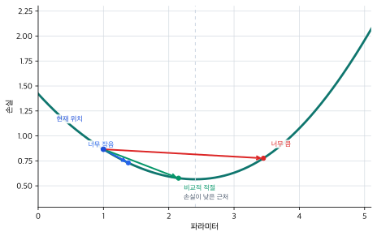
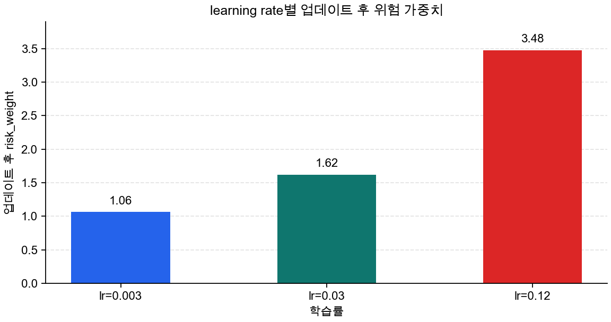
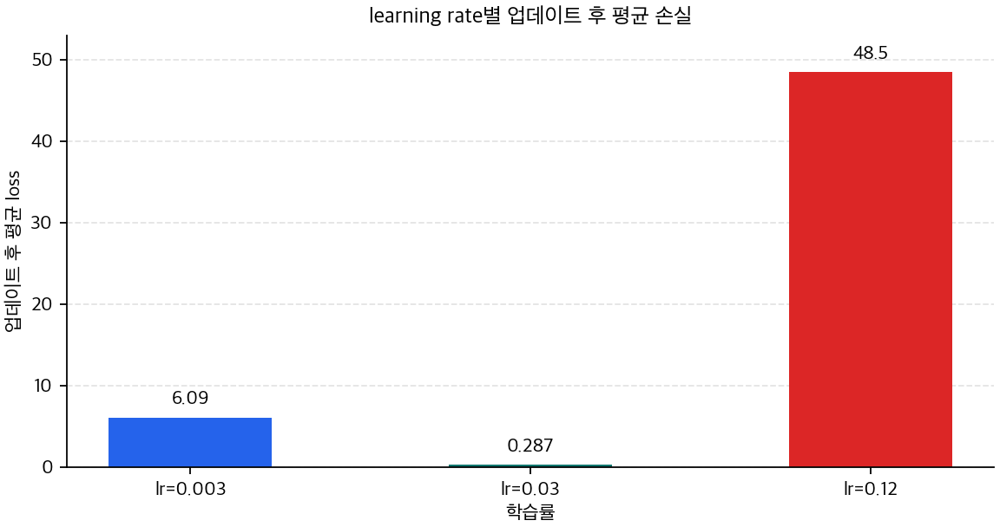

# P5-7.2 학습률(learning rate)과 update 보폭

> Section ID: `P5-7.2`
> Version: `v2026.07.20`

P5-7.1에서는 옵티마이저(optimizer)가 `gradient를 실제 파라미터 업데이트로 바꾸는 규칙`이라는 점을 보았습니다. 여기까지 오면 바로 다음 질문이 생깁니다.

그렇다면 같은 gradient라도, 한 번의 update는 왜 너무 작거나 너무 커질 수 있는가?

이 질문에 답할 때 가장 먼저 등장하는 설정이 학습률(learning rate)입니다.

학습률은 optimizer가 gradient를 실제 update로 바꿀 때, 한 번에 얼마나 크게 움직일지를 정하는 보폭이다. 다시 말해, gradient가 `어느 방향으로 바꿔야 하는가`를 알려 준다면, 학습률은 `그 방향으로 이번 step에서 얼마나 멀리 움직일 것인가`를 정합니다.

학습률, gradient, update의 관계가 다시 섞이면 개념사전의 [학습률(learning rate)](../../../reference/concept-glossary.md#learning-rate)와 [옵티마이저(optimizer)](../../../reference/concept-glossary.md#optimizer) 항목을 함께 다시 보는 편이 좋습니다.

## 이 절의 범위

- 학습률은 optimizer update에 어디에 붙는가?
- 같은 gradient라도 학습률이 다르면 왜 실제 update 결과가 달라지는가?
- 학습률이 너무 작거나 너무 클 때 어떤 일이 생기는가?
- 왜 gradient 방향이 맞다는 사실과 update 결과가 적절하다는 사실은 다른가?

이 절에서는 `같은 gradient를 실제로 얼마만큼 움직일 것인가`를 닫는 데 집중합니다. 즉, 여기서는 optimizer의 역할을 이미 안다는 전제 위에서, learning rate가 update 보폭을 어떻게 바꾸는지 먼저 설명합니다. 이 구분이 선명해야 뒤에서 Adam 같은 적응형 optimizer를 볼 때도 `무엇을 더 조절하는가`가 흐려지지 않습니다.

대신 이번 절에서 바로 넓히지 않을 질문도 분명합니다. 최근 gradient 흐름과 좌표별 차이를 함께 반영하는 적응형 update는 다음 Section인 P5-7.3에서 이어서 설명합니다. learning rate를 학습 내내 같은 값으로 두지 않고 warmup이나 decay로 운영하는 방식은 P5-7.6 보충학습에서 다시 설명합니다. adaptive optimization의 수렴 분석은 P5-7.4 보충학습으로 분리합니다.

## 이 절의 목표

- 학습률을 `optimizer update의 보폭`으로 설명할 수 있습니다.
- 같은 gradient라도 learning rate에 따라 실제 update 결과가 달라진다는 점을 말할 수 있습니다.
- 너무 작은 보폭과 너무 큰 보폭이 왜 서로 다른 문제를 만드는지 설명할 수 있습니다.
- 실행 가능한 Python 예제로 gradient와 update 보폭의 차이를 확인할 수 있습니다.

## optimizer가 update를 만들 때 learning rate는 어디에 붙는가

옵티마이저의 역할을 설명할 때 학습률이 함께 나오는 이유는, optimizer가 gradient를 실제 update로 바꾸는 순간에 학습률이 보폭으로 붙기 때문입니다. 학습률 자체가 가중치를 바꾸는 것은 아니지만, optimizer가 `얼마나 크게 바꿀지`를 정할 때 핵심 배율로 쓰입니다. 따라서 학습률은 모델이 `어느 쪽으로 가야 하는가`를 알려 주는 값이 아니라, 이미 계산된 방향 신호를 `실제로 얼마나 크게 반영할까`를 정하는 설정값입니다.

가장 단순한 형태로 쓰면 update는 보통 다음처럼 읽을 수 있습니다.

$$
\text{update} = - \text{learning rate} \times \text{gradient}
$$

$$
\text{new parameter} = \text{old parameter} + \text{update}
$$

이 식에서 지금 절이 붙잡아야 할 것은 수식 자체를 외우는 일이 아니라 각 항의 역할입니다.

- `gradient`는 어느 방향으로 바꾸어야 손실이 줄어드는지 알려 줍니다.
- `learning rate`는 그 방향 신호를 얼마나 크게 반영할지 정합니다.
- `update`는 그 둘이 합쳐져 실제 파라미터에 적용되는 이동량이 됩니다.

이 두 줄을 함께 읽으면 학습률이 어디에서 작동하는지도 분명해집니다. 첫 줄에서는 learning rate가 gradient를 얼마나 큰 update로 바꿀지 결정합니다. 둘째 줄에서는 그렇게 만들어진 update가 실제 파라미터 값에 반영됩니다. 즉, learning rate는 손실을 직접 바꾸는 값이 아니라, 파라미터를 얼마나 크게 움직일지 정하고, 그 결과가 다음 예측과 다음 손실에 이어집니다.

즉, 학습률 설명을 건너뛰면 독자는 `gradient가 나왔다`와 `파라미터가 바뀌었다` 사이에서 무엇이 이동량의 크기를 정했는지 놓치기 쉽습니다. P5-7.2는 바로 그 중간 고리를 설명하는 절입니다.

너무 작으면:

- 학습이 매우 느려질 수 있고
- 손실이 줄어드는 데 오래 걸릴 수 있습니다

너무 크면:

- 좋은 방향을 알고도 지나쳐 버릴 수 있고
- 손실이 불안정하게 흔들릴 수 있습니다

즉, 학습률은 optimizer가 update를 만들 때 사용하는 `업데이트의 보폭(step size)`입니다. 같은 gradient가 나와도 학습률이 다르면 optimizer가 만드는 실제 이동량은 달라지고, 그 결과 다음 step에서 시작하는 파라미터 위치도 달라집니다.

Part 4에서 하이퍼파라미터(hyperparameter)를 다루었듯, 학습률은 학습으로 자동 생성되는 파라미터가 아니라 사람이 정하거나 탐색하는 설정값입니다.

여기서는 다음 구분을 함께 잡는 편이 안전합니다.

| 값 | 역할 |
| --- | --- |
| gradient | 현재 위치에서 어느 방향이 내려가는지 알려 주는 신호 |
| learning rate | 그 방향으로 한 번에 얼마나 움직일지 정하는 보폭 |
| optimizer | 그 보폭과 규칙을 적용해 실제 이동을 만드는 절차 |

이 표를 한 문장으로 다시 묶으면 `gradient는 방향`, `learning rate는 거리`, `optimizer는 실제 이동 실행`입니다. 이제부터 사례와 예제도 모두 이 질문으로 읽으면 됩니다. `같은 gradient를 learning rate가 얼마나 다른 실제 이동으로 바꾸는가?`

## 왜 같은 gradient라도 결과가 달라지는가

같은 위치에서 내려갈 방향을 알아도, 보폭이 너무 작으면 거의 움직이지 못하고, 적절하면 낮은 손실 근처로 가며, 너무 크면 좋은 지점을 지나쳐 손실이 다시 커질 수 있습니다. 여기서 중요한 것은 `방향을 아는 것`과 `좋은 다음 위치에 도착하는 것`이 같은 일이 아니라는 점입니다.



이 그래프에서 중요한 것은 `gradient 방향이 맞다`와 `optimizer가 만든 update가 적절하다`가 같은 말이 아니라는 점입니다. optimizer의 역할을 읽을 때는 방향 신호뿐 아니라 그 신호가 실제로 어느 위치까지 파라미터를 움직였는지를 함께 봐야 합니다. 같은 화살표를 따라가더라도 한 걸음이 너무 짧으면 거의 진전이 없고, 너무 길면 좋은 지점을 지나칠 수 있습니다. 학습률은 바로 그 `한 걸음의 길이`를 정하는 값입니다.

다음처럼 이해하면 충분합니다.

- gradient는 `어느 쪽으로 가야 하는가`를 알려 줍니다.
- learning rate는 `얼마나 크게 갈 것인가`를 정합니다.
- 그래서 같은 gradient라도 learning rate가 다르면 결과가 달라질 수 있습니다.

## 사례 및 예시

이 절의 사례는 optimizer를 고르는 사례가 아니라, `같은 gradient가 서로 다른 update 보폭으로 바뀌는 장면`을 읽는 사례입니다. 따라서 사례를 볼 때는 항상 다음 순서로 확인합니다. 핵심은 `gradient가 있었는가`를 넘어서 `그 gradient가 실제 이동량으로 바뀐 뒤 무슨 일이 생겼는가`를 읽는 것입니다.

1. gradient 방향은 맞는가
2. learning rate가 optimizer update를 얼마나 크게 만들었는가
3. update 뒤 파라미터와 손실이 실제로 어떻게 달라졌는가

### 사례. 같은 gradient인데 learning rate만 다른 경우

같은 CSV batch에서 같은 gradient를 계산했다고 해 보겠습니다. 예를 들어 현재 위험 가중치가 `1.0`이고, 36개 샘플에서 계산된 평균 `gradient_risk_weight`가 `-20.648`로 같다고 두겠습니다. 이제 바뀌는 것은 learning rate뿐입니다. 이때 독자가 보고 싶은 것은 `어느 optimizer가 더 유명한가`가 아니라, `같은 방향 신호가 얼마나 다른 실제 이동량으로 바뀌는가`입니다.

이 장면을 처음 읽는 사람은 보통 `gradient가 같다면 결국 비슷하게 배우지 않겠는가`라고 생각하기 쉽습니다. 이 해석은 방향만 볼 때는 자연스럽습니다. 세 경우 모두 같은 쪽으로 움직이려 하기 때문입니다. 하지만 learning rate 관점에서는 질문이 달라집니다. `어느 쪽으로 움직이는가`를 넘어서 `그 방향으로 실제로 얼마나 멀리 움직였는가`를 봐야 합니다.

이제 learning rate를 `0.003`, `0.03`, `0.12`로 나누어 생각해 보겠습니다.

- `0.003`이면 update가 아주 작습니다. 방향은 맞지만 한 step에서 거의 전진하지 못합니다. 겉으로는 손실이 조금 줄더라도, 실제 학습은 답답할 만큼 느릴 수 있습니다.
- `0.03`이면 같은 gradient가 비교적 적절한 크기의 이동으로 바뀝니다. 너무 짧지도, 너무 길지도 않게 움직이며 batch 평균 목표에 가까워질 가능성이 큽니다.
- `0.12`이면 update가 너무 커집니다. 방향은 맞아도 좋은 지점을 지나쳐 버려, 손실이 다시 커지거나 학습이 흔들릴 수 있습니다.

즉, 세 경우의 차이는 `방향`이 아니라 `보폭`입니다. learning rate는 gradient를 새로 만드는 값이 아니라, 이미 계산된 같은 gradient를 얼마나 크게 실제 update로 반영할지를 정합니다. 그래서 작은 learning rate는 `방향은 맞지만 거의 못 움직이는 상태`, 큰 learning rate는 `방향은 맞지만 지나쳐 버리는 상태`를 만들 수 있습니다.

이 사례를 표로 다시 보면 다음과 같습니다.

| 같은 gradient를 받았을 때 | learning rate가 너무 작음 | learning rate가 비교적 적절함 | learning rate가 너무 큼 |
| --- | --- | --- | --- |
| 실제 update 크기 | 거의 움직이지 않을 만큼 작다 | 목표에 가까워질 만큼 움직인다 | 좋은 지점을 지나칠 만큼 크다 |
| 겉으로 보이는 장면 | 손실이 매우 천천히 줄어든다 | 손실이 눈에 띄게 줄어든다 | 손실이 다시 커지거나 흔들릴 수 있다 |
| 더 정확한 해석 | 방향은 맞지만 전진 폭이 부족하다 | 방향과 보폭이 함께 맞아떨어진다 | 방향은 맞지만 이동 폭이 과격하다 |

이 사례가 현재 절을 지지하는 이유는 분명합니다. learning rate는 `추가 설명용 숫자`가 아니라, 같은 gradient를 실제로 얼마만큼 반영할지 결정하는 값입니다. 따라서 P5-7.2에서 독자가 붙잡아야 할 중심 문장은 `같은 gradient라도 learning rate가 다르면 실제 update 결과는 달라진다`입니다. 이 절의 예제와 차트는 바로 이 문장을 숫자와 그림으로 다시 확인하는 장치입니다.

## 연습 및 예제

이번 예제의 목표는 같은 gradient 계산 결과가 learning rate에 따라 서로 다른 update로 바뀌는 장면을 보는 것입니다. 따라서 출력도 learning rate 자체보다 `optimizer_delta`가 얼마나 달라지는지를 중심으로 읽습니다. 이 예제에서 고정되는 것은 `현재 상태`와 `gradient`이고, 바뀌는 것은 `learning rate`와 그에 따라 만들어지는 실제 이동량입니다.

코드를 보기 전에 먼저 다음 구분을 붙잡는 편이 좋습니다.

| 고정되는 것 | 바뀌는 것 |
| --- | --- |
| CSV batch와 현재 위험 가중치 `risk_weight` | 학습률 `learning_rate` |
| batch의 현재 평균 예측값과 평균 손실 | `optimizer_delta` |
| batch에서 계산된 평균 `gradient_risk_weight` | 업데이트 후 가중치, 평균 점수, 평균 손실 |

입력:

- CSV 파일의 여러 관측 행
- 각 행의 압력 미복귀 정도 `pressure_unrecovered`
- 각 행의 목표 차단 점수 `target_block_score`
- 현재 위험 가중치 `risk_weight`
- 학습률 `learning_rate`

출력:

- 예측된 차단 점수
- 손실
- gradient
- optimizer가 만든 update 값
- learning rate별 업데이트 후 가중치
- 업데이트 뒤 batch 평균 목표값에 더 가까워지는 정도 비교

문제 상황:

- learning rate는 gradient 자체를 바꾸지 않지만, optimizer가 만드는 batch update 폭을 크게 바꾼다
- 너무 큰 learning rate는 좋은 방향을 알고도 지나칠 수 있으므로 결과를 함께 비교해야 한다

확인할 개념:

- 같은 gradient라도 update 보폭은 달라질 수 있다
- update 보폭이 달라지면 새 가중치, 새 예측, 새 손실이 달라진다
- 따라서 `gradient를 구했다`와 `학습이 잘 된다`는 같은 말이 아니다

```python
# 같은 CSV batch와 gradient에서 learning rate만 바꾸어 update 폭, 평균 예측, 평균 손실 변화를 비교하는 예제입니다.
from csv import DictReader
from pathlib import Path

DATA_PATH = Path("docs/assets/part-05/chapter-07/optimizer-step-role-log.csv")


def load_rows(path):
    with path.open(newline="", encoding="utf-8") as f:
        return [
            {
                "case_id": row["case_id"],
                "equipment_group": row["equipment_group"],
                "pressure_unrecovered": float(row["pressure_unrecovered"]),
                "target_block_score": float(row["target_block_score"]),
            }
            for row in DictReader(f)
        ]


def predict(row, risk_weight):
    return row["pressure_unrecovered"] * risk_weight


def mean_loss(rows, risk_weight):
    losses = [
        (predict(row, risk_weight) - row["target_block_score"]) ** 2
        for row in rows
    ]
    return sum(losses) / len(losses)


def mean_gradient(rows, risk_weight):
    gradients = [
        2
        * (predict(row, risk_weight) - row["target_block_score"])
        * row["pressure_unrecovered"]
        for row in rows
    ]
    return sum(gradients) / len(gradients)


def mean_prediction(rows, risk_weight):
    predictions = [predict(row, risk_weight) for row in rows]
    return sum(predictions) / len(predictions)


rows = load_rows(DATA_PATH)
risk_weight = 1.0
loss = mean_loss(rows, risk_weight)
gradient_risk_weight = mean_gradient(rows, risk_weight)
mean_target = sum(row["target_block_score"] for row in rows) / len(rows)

print("[shared state]")
print("sample_count =", len(rows))
print("mean_target_block_score =", round(mean_target, 3))
print("mean_loss_before =", round(loss, 3))
print("gradient_risk_weight =", round(gradient_risk_weight, 3))
for lr in [0.003, 0.03, 0.12]:
    print(f"[lr={lr}]")
    optimizer_delta = -lr * gradient_risk_weight
    updated_risk_weight = risk_weight + optimizer_delta
    updated_prediction = mean_prediction(rows, updated_risk_weight)
    updated_loss = mean_loss(rows, updated_risk_weight)
    print(
        "optimizer_delta =", round(optimizer_delta, 3),
        "-> updated_risk_weight =", round(updated_risk_weight, 3),
        ", mean_block_score =", round(updated_prediction, 3),
        ", mean_loss =", round(updated_loss, 3),
    )
```

```text
[shared state]
sample_count = 36
mean_target_block_score = 6.139
mean_loss_before = 7.308
gradient_risk_weight = -20.648
[lr=0.003]
optimizer_delta = 0.062 -> updated_risk_weight = 1.062 , mean_block_score = 3.77 , mean_loss = 6.087
[lr=0.03]
optimizer_delta = 0.619 -> updated_risk_weight = 1.619 , mean_block_score = 5.749 , mean_loss = 0.287
[lr=0.12]
optimizer_delta = 2.478 -> updated_risk_weight = 3.478 , mean_block_score = 12.346 , mean_loss = 48.454
```

이 출력은 같은 gradient가 optimizer의 update 규칙을 거치며 서로 다른 `optimizer_delta`로 바뀌는 장면입니다. 따라서 `gradient가 얼마인가`에서 멈추지 말고, optimizer가 만든 update 값, 업데이트된 가중치, 업데이트 후 점수, 업데이트 후 손실을 단계별로 나누어 읽습니다. 여기서 중요한 것은 세 줄이 서로 다른 문제를 보여 주는 것이 아니라, `같은 출발점`에서 `learning rate만 다르게 두었을 때` 결과가 어떻게 갈라지는지를 비교하는 것이라는 점입니다.

이제 출력 형식도 그 비교 구조를 직접 보여 줍니다. `[shared state]` 구간은 세 경우가 모두 공유하는 CSV batch, 현재 평균 손실, gradient를 나타냅니다. 그 아래 `[lr=0.003]`, `[lr=0.03]`, `[lr=0.12]`는 같은 출발점에 대해 learning rate만 다르게 두었을 때 결과가 어떻게 달라지는지를 나란히 보여 줍니다. 따라서 이 예제에서 독자가 비교해야 할 것은 `세 개의 서로 다른 gradient`가 아니라 `하나의 같은 batch gradient를 learning rate가 어떻게 다르게 update로 바꾸는가`입니다.






세 차트를 함께 읽을 때는 다음 순서가 가장 안전합니다. 먼저 `learning-rate-batch-updated-weight`에서 learning rate별 실제 이동량이 가중치 숫자를 얼마나 다르게 바꾸었는지 봅니다. 그다음 `learning-rate-batch-updated-score`에서 그 차이가 batch 평균 예측값을 어디로 옮겼는지 확인합니다. 마지막으로 `learning-rate-batch-updated-loss`에서 그 이동 결과가 평균 손실을 줄였는지, 거의 못 움직였는지, 지나쳐 버렸는지를 봅니다.

이 예제에서 독자가 꼭 읽어야 할 것은 다음입니다.

- `gradient_risk_weight`는 그대로인데 결과는 달라질 수 있습니다.
- 달라지는 이유는 learning rate가 만든 `optimizer_delta`가 다르기 때문입니다.
- `0.03`은 평균 목표에 가까워졌지만 `0.12`는 방향은 맞아도 너무 크게 움직여 오히려 평균 손실을 키웠습니다.
- 따라서 `gradient를 구했다`와 `학습이 잘 된다`는 같은 말이 아닙니다.

## 언제 learning rate 관점으로 먼저 읽는가

이 절을 꺼내야 하는 시점은 `gradient는 알겠는데 왜 실제 이동 속도가 너무 느리거나 너무 거친지`가 안 보일 때입니다.

| 먼저 보이는 문제 장면 | learning rate 관점이 먼저 유용한 이유 | 바로 다음에 넘길 질문 |
| --- | --- | --- |
| gradient는 맞는 것 같은데 파라미터가 거의 안 움직인다 | update 보폭이 너무 작은지 확인하게 해 줍니다. | Adam 같은 적응형 update가 무엇을 더 보완하는지 봐야 합니다. |
| 손실이 계속 튀고 흔들린다 | 방향보다 update 보폭이 과한지 확인하게 해 줍니다. | 최근 흐름과 좌표별 조절을 더 보는 optimizer를 봐야 합니다. |
| 같은 gradient인데 결과가 왜 다른지 직관이 없다 | learning rate가 update 보폭을 바꾼다는 점을 고정할 수 있습니다. | P5-7.3에서 적응형 update 차이까지 봐야 합니다. |

## 체크리스트

- 학습률(learning rate)을 `optimizer update의 보폭`으로 설명할 수 있는가?
- 같은 gradient라도 learning rate에 따라 실제 update 결과가 달라질 수 있다는 점을 말할 수 있는가?
- 너무 작은 learning rate와 너무 큰 learning rate가 어떤 다른 문제를 만드는지 설명할 수 있는가?
- `gradient 방향이 맞다`와 `update 결과가 적절하다`를 구분할 수 있는가?
- 다음 절 P5-7.3에서 Adam류가 최근 흐름과 좌표별 차이를 더 반영한다는 식으로 연결된다는 점을 알고 있는가?

## 출처와 참고 자료

- PyTorch, `Optimizing Model Parameters`, PyTorch Tutorials. optimizer가 gradient를 사용해 파라미터를 조정하고 learning rate를 하이퍼파라미터로 받는 구조를 확인할 때 참고했다. 확인 날짜: 2026-07-19. [https://docs.pytorch.org/tutorials/beginner/basics/optimization_tutorial.html](https://docs.pytorch.org/tutorials/beginner/basics/optimization_tutorial.html){: target="_blank" rel="noopener noreferrer" }
- PyTorch, `torch.optim.SGD`, PyTorch API Reference. SGD update에서 `lr`와 momentum이 어떻게 파라미터 업데이트에 들어가는지 확인할 때 참고했다. 확인 날짜: 2026-07-19. [https://docs.pytorch.org/docs/stable/generated/torch.optim.SGD.html](https://docs.pytorch.org/docs/stable/generated/torch.optim.SGD.html){: target="_blank" rel="noopener noreferrer" }
