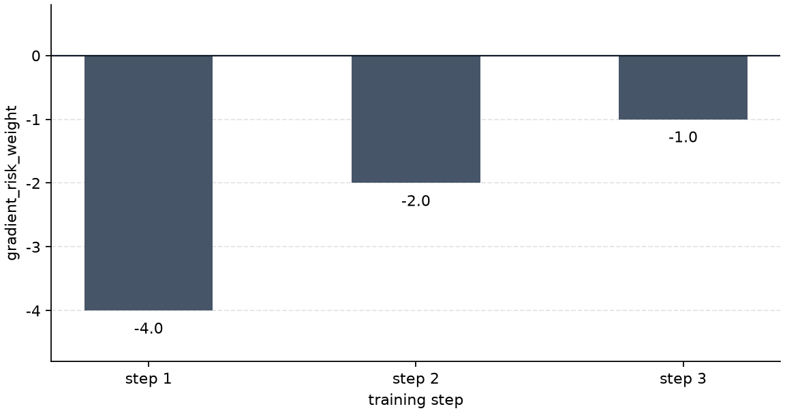
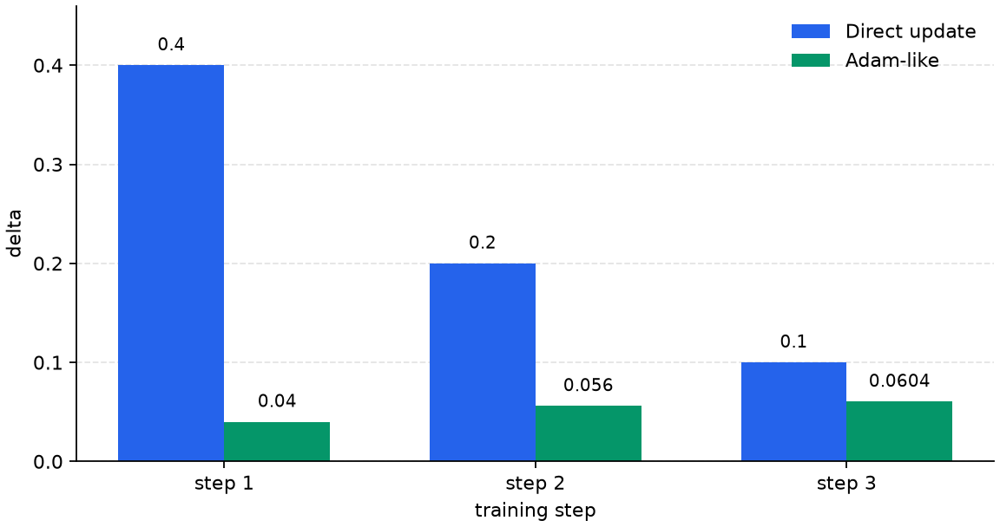
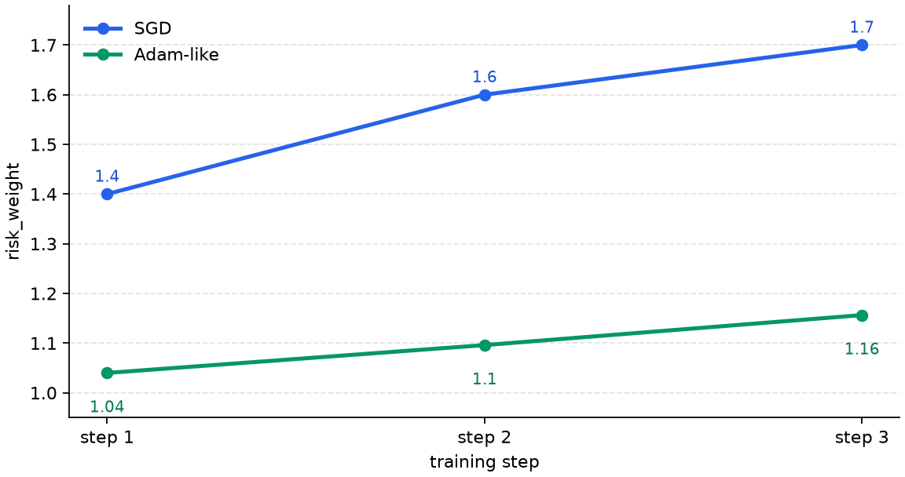

# P5-7.3 Intuition For Adaptive Updates: Adam As An Example

Section ID: `P5-7.3`
Version: `v2026.07.17`

In P5-7.2, we saw how the actual update step size can differ depending on the learning rate even with the same gradient. From here, the next question appears immediately. Is it enough to apply that step size to every parameter in exactly the same way all the time?

Adaptive update appears exactly at this point. If the basic direct update is `a way of moving once based on the current gradient and learning rate`, then adaptive update tries to adjust the actual movement amount while also looking at recent gradient flow and parameter-by-parameter differences.

In this section, we use Adam (Adaptive Moment Estimation) as a representative example to read that intuition. The center is not the name Adam itself, but `why do recent flow and coordinate-wise adjustment enter the update rule?`

If the difference between basic updates and adaptive updates starts to blur together again, return together to the [gradient descent](../../../reference/concept-glossary.md#gradient-descent) and [optimizer](../../../reference/concept-glossary.md#optimizer) entries in the concept glossary.

## Scope Of This Section

- What does adaptive update try to additionally compensate beyond a basic gradient update?
- What is the core intuition of adaptive update in terms of recent gradient flow and coordinate-wise adjustment?
- In explaining that adaptive-update intuition, how does Adam become a representative example?
- Even though Adam is often mentioned in practice, why should we not memorize it as an absolute winner?

This section explains the problem awareness from which adaptive update comes, rather than increasing the list of optimizer names. What we need to read here is `by what rule is the already-computed gradient turned into the actual update`, and why recent flow and coordinate-wise differences enter that rule. Adam is used as a representative example for holding onto this intuition. A comparison that first distinguishes optimizer family names continues in the supplementary study of P5-7.5, and optimizer state and parameter-wise update reconnect again in the supplementary study of P5-7.7. The viewpoints of regularization and generalization reconnect in P5-8.1 and P5-8.2, and the convergence analysis of adaptive optimization continues in the supplementary study of P5-7.4.

| What to distinguish in this section now | Why it matters |
| --- | --- |
| model structure | because it is the question of how to represent the input structure, such as CNN, RNN, or Transformer |
| optimizer procedure | because it is the question of by what stride length and accumulation rule the parameters are actually moved even for the same structure |
| difference from regularization | because the optimizer deals with `how should we move`, while regularization deals with `what kinds of solutions should we prefer less` |

## Goals Of This Section

- You can explain adaptive update as `an update method that reflects recent gradient flow and coordinate-wise adjustment`.
- You can understand the difference between a basic direct update and an adaptive update.
- You can say why Adam is often mentioned as a representative example of adaptive update.
- You can confirm the difference in update intuition with an executable Python example.

## The Baseline Needed First To Understand Adaptive Update

If we start adaptive update immediately from formulas, beginners can easily miss `what exactly was added`. So we first place the simplest possible baseline. What we have to hold first here is not a specific optimizer name, but the basic feeling that `we move once directly based on the current gradient and the learning rate`.

It is enough to understand it like this.

`Move one step in the direction pointed to by the current gradient, with the amount set by the chosen learning rate.`

This intuition continues directly from the explanation in P5-7.2 that `the learning rate decides the update stride length`. If P5-7.2 explained the stride itself, here we take as the baseline `a basic update that applies that stride directly to all parameters in the same way`.

The reason we do not place a specific optimizer name first here is also clear. What we need now is not name classification, but the thinnest possible baseline for reading what adaptive update additionally tries to compensate.

- the intuition is clear
- the core idea of gradient descent becomes visible
- and the update rule can be seen most directly

In other words, the baseline of this section is not an introduction to a specific optimizer, but `the simplest direct-update intuition` used to explain adaptive update.

## What Does Adaptive Update Try To Compensate Further

Adaptive update uses more information than a simple current-gradient-based update. If we take Adam as the representative example, it is enough to understand the following.

- it looks at recent gradient directions in accumulated form
- it tries to adjust the amount of change differently by coordinate
- and it has the practical purpose of making early learning faster and more stable

In other words, adaptive update tries to reflect information that can easily be missed by only `moving every parameter with the same reference stride`.

If we reduce it to one sentence, it becomes the following.

`Adam is an optimizer that tries to move each parameter more adaptively by referring together to the recent flow of the gradient and to coordinate-wise magnitude differences.`

If we make it a little more intuitive, it becomes:

- basic update baseline: `take a step with the same reference stride in the direction of the slope visible right now`
- Adam: `also look at the wobble of the last few steps, and adjust the stride differently by coordinate`

For example, suppose one parameter keeps fluctuating with a large gradient, while another parameter moves very slightly and stably. A basic direct update pushes both using the same learning-rate reference. An adaptive update like Adam, on the other hand, tries to also reflect `is this coordinate fluctuating too strongly right now?` and `is this coordinate moving too slowly?` So adaptive update feels closer to `a different stride for each coordinate` than to `the same single step everywhere`.

## What Do We See About Adaptive Update When We Use Adam As The Example

At the introductory stage, the following table matters more than a complicated formula.

| Item | Basic direct-update baseline | Adam |
| --- | --- | --- |
| basic feeling | one simple one-step update | an adaptive update reflecting more accumulated information |
| advantage | the intuition is simple and the reference point is clear | the early part of learning is often fast and practically convenient |
| caution | can be sensitive to learning-rate setting | even if it looks convenient, we still cannot conclude that final generalization is always better |

The key in this table is not `which one is absolutely superior`. Rather, it is safer to understand it like this.

`Adam is a representative example that adds recent flow and coordinate-wise adjustment to a simple gradient-update baseline in order to make a more adaptive update.`

## Why Is Adam So Often Mentioned As The Representative Example

Adam is often mentioned in practice. What the reader should hold onto for a long time here is not `it is used a lot`, but `why is it often chosen as the representative example of adaptive update`.

- it often works reasonably well even from initial settings
- it can easily give the experience that the loss decreases quickly in the early part of training
- and with large models or complex data it can feel like the barrier to entry is lower

But there is an important caution here.

`Just because Adam is often used, that does not guarantee that it always gives a better final result on every problem.`

In other words, Adam's popularity comes in large part from practicality and convenience, and different problems still require different judgment.

If we compress everything up to this point once, adaptive update is `a method that adds recent flow and coordinate-wise adjustment on top of a basic direct update`, and Adam is a representative example that makes that intuition easy to read.

If we compress this difference down to only the update rules, it becomes the following.

```mermaid
--8<-- "assets/part-05/chapter-07/sgd-vs-adam-flow-en.mmd"
```

The first result to confirm in this diagram is that the basic direct update is closer to the feeling of `reacting to the current gradient with the same reference stride`, while Adam is closer to the feeling of `adjusting the stride by reflecting recent flow and coordinate-wise differences more strongly`.

## Practice And Example

We can move directly to the examples now. The two examples in this section are both simplified intuition examples, not full implementations of real Adam. The first example shows `the axis of accumulating recent gradient flow`, and the second example shows `the axis of adjusting stride differently by coordinate`. It is enough to read Adam as a representative example that contains both axes together.

Input:

- the current risk weight `risk_weight`
- the list of risk-weight gradients across several steps

Output:

- the continuous risk-weight update result of a simple direct-update method
- the intuitive update result of a simplified Adam-like accumulated average
- step-by-step `direct_delta` and `adam_like_delta`
- in the second mini experiment, how coordinate-wise stride adjustment appears when two parameters have different gradient magnitudes

Problem scene:

- the difference in adaptive update is easier to see through how the same gradient flow turns into step-by-step updates than through formula names

Concepts to confirm:

- a simple direct update reacts immediately to the current gradient
- an Adam-like method adjusts the movement amount by accumulating recent gradient information
- an Adam-like method also tries to reflect coordinate-wise gradient magnitude differences in the size of the update

Input:

Assume that there is one `risk_weight` that reads the pressure-unrecovered signal, and that `gradient_risk_weight` enters in the order `-4.0`, `-2.0`, and `-1.0` at each learning step. Even with the same gradient flow, we compare how a simple direct update and an Adam-like method move `risk_weight` more directly or with more accumulated averaging.

Before looking at the code, it helps to predict which side's movement amount will be more direct and which side will be smoother. That makes the difference between `current-gradient response` and `accumulated-average response` easier to see.

| Comparison item | Update to predict first | Why that is the expected result |
| --- | --- | --- |
| first `direct_delta` | it will probably move the most | because the first `gradient_risk_weight` `-4.0` is reflected directly by being multiplied immediately by the learning rate |
| first `adam_like_delta` | it will probably be much smaller than `direct_delta` | because at the beginning, the moving average only partially reflects the whole gradient |
| `direct_delta` as the steps pass | it will probably shrink immediately as the gradient magnitude shrinks | because a simple direct update reacts directly to the size of the current `gradient_risk_weight` |
| `adam_like_delta` as the steps pass | it will probably change more slowly or connect more smoothly | because the gradients of previous steps remain inside the moving average |

The purpose of this table is not to memorize the exact numbers in advance. It is to hold before the code that even with the same `gradient_risk_weight` flow, a simple direct update reflects `the current slope` immediately, while an Adam-like method can move more smoothly while keeping the `recent flow`.

```python
gradient_risk_weight_history = [-4.0, -2.0, -1.0]
risk_weight_direct = 1.0
risk_weight_adam_like = 1.0
learning_rate = 0.1
moving_avg = 0.0
beta = 0.9

print("Direct updates")
for gradient_risk_weight in gradient_risk_weight_history:
    direct_delta = -learning_rate * gradient_risk_weight
    risk_weight_direct = risk_weight_direct + direct_delta
    print(
        " gradient_risk_weight =", gradient_risk_weight,
        "direct_delta =", round(direct_delta, 3),
        "-> risk_weight =", round(risk_weight_direct, 3)
    )

print()
print("Adam-like updates (simplified intuition)")
for gradient_risk_weight in gradient_risk_weight_history:
    moving_avg = beta * moving_avg + (1 - beta) * gradient_risk_weight
    adam_like_delta = -learning_rate * moving_avg
    risk_weight_adam_like = risk_weight_adam_like + adam_like_delta
    print(
        " gradient_risk_weight =", gradient_risk_weight,
        "moving_avg =", round(moving_avg, 3),
        "adam_like_delta =", round(adam_like_delta, 3),
        "-> risk_weight =", round(risk_weight_adam_like, 3)
    )
```

In the output, first compare how the step-by-step updates differ between the simple direct update and the Adam-like method even under the same `gradient_risk_weight` flow.

```text
Direct updates
 gradient_risk_weight = -4.0 direct_delta = 0.4 -> risk_weight = 1.4
 gradient_risk_weight = -2.0 direct_delta = 0.2 -> risk_weight = 1.6
 gradient_risk_weight = -1.0 direct_delta = 0.1 -> risk_weight = 1.7

Adam-like updates (simplified intuition)
 gradient_risk_weight = -4.0 moving_avg = -0.4 adam_like_delta = 0.04 -> risk_weight = 1.04
 gradient_risk_weight = -2.0 moving_avg = -0.56 adam_like_delta = 0.056 -> risk_weight = 1.096
 gradient_risk_weight = -1.0 moving_avg = -0.604 adam_like_delta = 0.06 -> risk_weight = 1.156
```

If we separate even the same output into `input gradient -> step-by-step update -> accumulated risk_weight`, it becomes clearer what the Adam-like method is trying to compensate further.



The input of the first stage is the gradient flow before the optimizer changes anything. Here, as steps pass, the magnitude of `gradient_risk_weight` becomes smaller, and both the simple direct update and the Adam-like method receive the same input.



The difference appears at the delta stage. The simple direct update moves greatly in the first step because it immediately multiplies the current gradient by the learning rate, while the Adam-like method converts the same input into a smaller movement amount because it passes through the moving average.



If we look at the final risk-weight path, this difference accumulates. The simple direct update quickly moves to 1.7, while the Adam-like method accumulates recent flow and moves more slowly to 1.156. What changes at this stage is not `they received the same gradient`, but that the optimizer rule creates a different actual parameter path.

This example is neither a full implementation of real Adam, nor an experiment that judges the performance superiority of a simple direct update versus Adam. The core point to read here is the following.

- the simple direct update reflects the current `gradient_risk_weight` relatively directly
- the idea of Adam-like methods is to accumulate recent directions and thereby make the step-by-step update different
- an optimizer does not merely `decrease something`, but decides `through what update path should the same gradient be turned`

### Mini Experiment On Coordinate-Wise Adjustment

The example above shows the first axis of adaptive update: the feeling of keeping `recent gradient flow`. But to understand adaptive update, we need to see one more thing. In large models, there is not just one parameter, and the gradient magnitudes of each parameter are also different. In this situation, Adam-like optimizers try not just to `push all coordinates with the same reference stride`, but to adjust the update by referring to the gradient magnitude of each coordinate.

The following mini experiment is not a full implementation of Adam either. It isolates only the intuition of Adam's coordinate-wise adjustment, the part where `the second moment compensates gradient magnitude differences`. Here, we compare two parameters.

| Parameter | Incoming gradient flow | What we first expect in the simple direct update | What we first expect in Adam-like coordinate-wise adjustment |
| --- | --- | --- | --- |
| `risk_weight` | `[-8.0, -4.0]` | the update also becomes very large because the gradient is large | the coordinate with the large gradient is relatively suppressed |
| `recovery_weight` | `[-0.5, -0.25]` | the update becomes very small because the gradient is small | even the coordinate with the small gradient is not buried completely |

```python
gradient_by_parameter = {
    "risk_weight": [-8.0, -4.0],
    "recovery_weight": [-0.5, -0.25],
}

learning_rate = 0.1
beta2 = 0.9
second_moment = {
    "risk_weight": 0.0,
    "recovery_weight": 0.0,
}

for step in range(2):
    print("step", step + 1)
    for parameter_name, gradient_history in gradient_by_parameter.items():
        gradient = gradient_history[step]
        direct_delta = -learning_rate * gradient

        second_moment[parameter_name] = (
            beta2 * second_moment[parameter_name]
            + (1 - beta2) * gradient * gradient
        )
        adam_like_delta = -learning_rate * gradient / (second_moment[parameter_name] ** 0.5)

        print(
            parameter_name,
            "gradient =", gradient,
            "direct_delta =", round(direct_delta, 3),
            "second_moment =", round(second_moment[parameter_name], 3),
            "adam_like_delta =", round(adam_like_delta, 3),
        )
```

The output is read not by rereading numbers one by one, but by checking `through what update rule does the same gradient flow become a different movement path`.

```text
step 1
risk_weight gradient = -8.0 direct_delta = 0.8 second_moment = 6.4 adam_like_delta = 0.316
recovery_weight gradient = -0.5 direct_delta = 0.05 second_moment = 0.025 adam_like_delta = 0.316
step 2
risk_weight gradient = -4.0 direct_delta = 0.4 second_moment = 7.36 adam_like_delta = 0.147
recovery_weight gradient = -0.25 direct_delta = 0.025 second_moment = 0.029 adam_like_delta = 0.147
```

In the simple direct update, the first update of `risk_weight` is `0.8`, while `recovery_weight` is `0.05`. The difference in gradient magnitude is transferred almost directly into the difference in update size. In Adam-like coordinate-wise adjustment, on the other hand, each coordinate separately accumulates its own gradient-magnitude history in `second_moment`, and divides the update by that value. So the coordinate with a large gradient is relatively suppressed, while the coordinate with a small gradient is not buried completely.

There is no need to memorize these numbers as the full Adam formula. There is only one learning point to hold here. The word `adaptive` in Adam does not mean only that it remembers recent flow. It also means that it looks separately at the gradient-magnitude history of each parameter coordinate and tries to adjust the update stride accordingly.

But this mini experiment must not be read as `Adam always makes the updates of different parameters the same`. The reason the two `adam_like_delta` values look the same here is that we intentionally used a simple example where the ratio of the two gradient flows is the same. Real Adam also includes first moments, second moments, bias correction, and a small stabilization constant. Here, we are not trying to reproduce the whole formula. We are isolating only the coordinate-wise-adjustment feeling that `a large gradient is divided by its own magnitude history, and a small gradient is also divided by its own magnitude history`.

When the two examples are read together, the compensations of adaptive update divide into two axes.

| Example | Axis being observed | Change to check directly | Sentence to leave from this section |
| --- | --- | --- | --- |
| several steps for one `risk_weight` | time axis | recent gradients remain in the moving average, so the step-by-step update becomes smoother | adaptive update can look at recent flow rather than only at the current gradient |
| comparison of `risk_weight` and `recovery_weight` | coordinate axis | each parameter separately accumulates its own gradient magnitude history and adjusts the stride | adaptive update does not push all parameters only with the same reference stride |

Once this table is read, the core of adaptive update should be explainable as `a method that puts both time-axis accumulation and coordinate-axis adjustment into the update rule`. It is enough to summarize Adam as a representative example that shows that method.

## When Do We First Bring Out The Adaptive-Update Viewpoint

After understanding the general role of the optimizer, it is helpful to read separately `is the basic update intuition enough here, or is the adaptive-update intuition needed?`

| Problem scene that appears first | Optimizer viewpoint to recall first | Reason |
| --- | --- | --- |
| we need to explain the most basic structure of gradient direction and step size | simple update baseline | it shows most clearly the basic update intuition that reacts directly to the current gradient |
| early learning is too rough, or coordinate-wise scale differences are large | adaptive update | the intuition of updates that reflect accumulated information and coordinate-wise adaptation becomes more important |
| we need to explain why Adam is often used in practice | recall adaptive update first, and see Adam as a representative example | convenience and practicality are important, but if the representative example is immediately confused with the general principle, the intuition blurs |
| there is a tendency to memorize optimizers as an absolute ranking | place the simple baseline and adaptive update side by side | because speed, stability, and generalization have to be read separately |

## Checklist

- Can you explain what adaptive update is trying to additionally compensate beyond the basic update?
- Can you explain that adaptive update is a method that reflects accumulated information and coordinate-wise adjustment more strongly?
- Can you explain the difference between a simple update baseline and an adaptive update as the difference between `reacting directly to the current gradient` and `reflecting accumulated information and coordinate-wise differences more strongly`?
- Can you distinguish that the first example should be read as time-axis accumulation, and the second example as coordinate-axis adjustment?
- Can you say that Adam is only a representative example of adaptive update, and cannot be concluded to be an absolutely better optimizer?

## Sources And Further Reading

- Léon Bottou, `Large-Scale Machine Learning with Stochastic Gradient Descent`, COMPSTAT, 2010, accessed 2026-06-29.
- Diederik P. Kingma, Jimmy Ba, `Adam: A Method for Stochastic Optimization`, arXiv, 2014, accessed 2026-06-29.
- Sebastian Ruder, `An overview of gradient descent optimization algorithms`, arXiv, 2016, accessed 2026-06-29.
