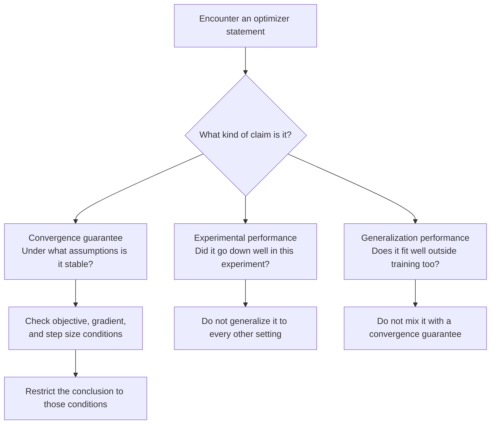
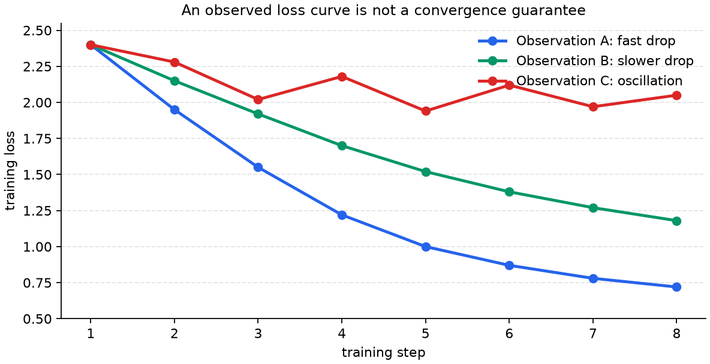

# P5-7.4 Supplementary Reading: Convergence Guarantees And Claim Types In Adaptive Optimization

Section ID: `P5-7.4`
Version: `v2026.07.17`

In P5-7.3, we saw what adaptive update is trying to additionally compensate beyond a basic update, and we looked at Adam as a representative example. If we go deeper from there, the next question remains.

Adaptive optimizers such as Adam are often used in practice, but can we also say that their update rules always converge well in theory?

Convergence analysis is the language of verification that examines, separately from the impression that an optimizer looked fast in an actual experiment, under what assumptions repeated updates can be said to approach the target condition. This section is not a proof-tracing section. It is a supplementary reading that distinguishes how experimental performance, convergence guarantees, and generalization performance are different kinds of claims when we explain adaptive optimization.
This distinction is a standard that can be reused as it is when we later meet optimizer comparison articles, experiment reports, and paper summaries.

## Scope Of This Section

- We look at what convergence-guarantee discussion is checking in adaptive optimization.
- We look at why the intuition of adaptive update and the discussion of convergence guarantees are different questions.
- We look at what conditions such as `convex`, `non-convex`, `regret`, `step size`, and `bounded gradient` are restricting.
- At an introductory level, we distinguish what kind of problem awareness a variant such as AMSGrad tried to compensate.

Here, the goal is not `can we do the proof`, but `can we distinguish what kind of guarantee each explanation is actually making`.

## Goals Of This Section

- You can distinguish an experimental-performance claim from a convergence-guarantee claim.
- You can explain why assumptions matter in convergence analysis of adaptive optimizers.
- You can say that the practical usability of Adam and the theoretical convergence guarantee of Adam are not the same question.
- You can make a checklist of conditions to confirm first when reading texts or presentations that explain optimizers.

## Practical Performance And Convergence Guarantees Are Different Questions

In practice, when we use Adam, we often encounter the experience that the loss decreases quickly. But from that fact alone, we still cannot say `Adam converges under all conditions`.

Experimental performance looks at whether the result was good under a specific dataset, model, initialization, learning rate, and batch size. Convergence analysis is a more restricted statement. Under fixed mathematical assumptions, it asks whether the repeated update does not diverge and whether it approaches an optimum or a stationary point.

The reason this difference feels unfamiliar to beginners is that, in actual learning experience, the first thing they usually see is one scene of `the loss went down well`. In front of their eyes, there is only one loss curve, but in the explanatory sentence, different words such as `convergence`, `generalization`, and `regret` suddenly appear. So it is easy for the reader to feel as if the same result is simply being restated in more difficult language.

But here, the opposite viewpoint is easier. Even after seeing one learning experiment, we can still ask different questions. `Did it go down quickly in this experiment?`, `Under what assumptions can we say it does not diverge?`, and `Does it also fit well on data outside the training set?` are not longer rewrites of the same sentence. They are questions on different levels.

| Question | What it looks at first | Caution |
| --- | --- | --- |
| experimental performance | did the loss or metric improve on this dataset and model? | that does not mean it is guaranteed under every other dataset or setting |
| convergence analysis | under what assumptions do the updates approach the target condition? | the assumptions may not be completely identical to actual deep-learning training |
| generalization performance | does it fit well outside the training data too? | convergence does not automatically mean good generalization |

This distinction matters because, in optimizer explanations, phrases such as `goes down quickly`, `works well`, `converges`, and `generalizes well` can easily get mixed together even though they are different claims.

### One Very Small Scene. Why Are These Three Sentences Different

Even for the same Adam experiment, the following three sentences mean different things.

| Sentence | What it is actually asking | What it still has not said |
| --- | --- | --- |
| When Adam was used, the early loss decreased quickly | did it go down quickly in this experiment? | convergence guarantees under all conditions |
| The convergence properties of Adam-like methods are analyzed | under what assumptions does it not diverge? | actual test performance |
| Adam generalized better on this task | did it fit well outside the training data too? | the theoretical guarantee of why that happened |

Once we look at this table first, even when unfamiliar theoretical terms appear later, the misunderstanding `are they just repeating the same thing in a harder way?` becomes smaller. The purpose of this section is exactly to separate these three levels.

If we draw this judgment order very simply, it becomes the following.

If we reread it through a graph, it becomes more direct why one well-decreasing loss curve and a convergence-guarantee claim are different.

This graph compresses the point that, even within the same optimizer family, the observed loss curve can look very different depending on initialization, step size, and noise conditions. A one-time experiment like the blue curve that went down quickly is certainly evidence that `it went down well in this experiment`. But that alone does not guarantee stability under every condition represented by the green or red curves. So the loss curve should first be read as an `experimental-performance observation`, and the convergence guarantee should be checked separately through `under what conditions can such a conclusion be stated`.

## What Becomes More Complex In Adaptive Optimizers

If we look at SGD very simply, it moves one step by multiplying the current gradient by the learning rate. The target of analysis is also relatively direct.

Adaptive optimizers in the Adam or AdaGrad family additionally use coordinate-wise accumulated information. They look at which coordinates have often had large gradients, what the recent gradient flow looks like, and how the accumulated squared-gradient values change, then adjust the update size for each coordinate. So in the analysis, we have to track not only the current gradient, but also the optimizer state accumulated over time.

| Optimizer intuition | Standard for reading the update | Point that becomes more complex in convergence analysis |
| --- | --- | --- |
| SGD | current gradient and a shared learning rate | we look at step-size conditions and gradient-noise conditions |
| AdaGrad family | coordinate-wise accumulated gradient magnitude | we look at the accumulated difference between rare features and frequently appearing features |
| Adam family | first and second moving averages of the gradient | we look at problems that arise when the exponential moving average behaves like a short memory |

So convergence analysis of adaptive optimization is not the section that asks `is Adam smarter?` It asks `for update rules that differ by coordinate, under what conditions are they stable, and under what conditions can problems arise?`

## Conditions To Check First When Someone Talks About Convergence Guarantees

In explanations that claim convergence guarantees, we should look at the assumptions before the conclusion sentence. If the assumptions change, even the same word `convergence` changes its meaning.

| Expression | Meaning to hold at the introductory level | Question to check first |
| --- | --- | --- |
| convex objective | a problem where the loss surface is assumed to be convex | is this the same claim as the non-convex situation of actual deep neural networks? |
| non-convex objective | a general loss surface that is not convex | is the guarantee about approaching a stationary point rather than an optimum? |
| regret bound | a guarantee in online learning that compares cumulative loss with a reference solution | does this guarantee mean ordinary test performance? |
| bounded gradient | an assumption that gradient magnitude stays within a certain range | is this a condition where there is no gradient explosion or numerical instability in actual learning? |
| step size schedule | a condition on how the learning rate decreases or stays over time | is this the same condition as the fixed learning rate or scheduler I am using? |
| exponential moving average | a method of exponentially accumulating recent gradient information | under some patterns, does this short memory fail to preserve old information sufficiently? |

If we use this table as the standard, convergence analysis is not the task of reading only the conclusion sentence. It is the task of reading together `what type of problem`, `what gradient condition`, `what learning-rate condition`, and `what optimizer-state condition` the conclusion is talking about.

## What We Should Learn From The Convergence Discussion Around Adam

The original Adam paper proposed Adam as a first-order optimizer for stochastic objectives, and together presented both why Adam is attractive in practice and what form convergence-related analysis can take in an online convex optimization frame. This paper is the starting point that shows both why Adam can be appealing in practice and how convergence analysis is presented.

Later analysis by Reddi, Kale, and Kumar shows that it is risky to oversimplify Adam-like algorithms into `they always converge stably`. The core problem awareness is that the way of accumulating squared gradients by exponential moving average may fail to preserve sufficiently long memory in some situations. In that discussion, AMSGrad can be understood as a variant that tried to compensate that point by retaining past large squared-gradient information more conservatively.

The conclusion the reader should take here is not `do not use Adam`. The safer conclusion is the following.

`Adam can be a strong practical default choice, but that does not mean adaptive updates are always theoretically safe, and convergence guarantees have to be read together with their conditions and variants.`

If we restate this from a beginner's viewpoint, it becomes this. The phrase `it is used a lot in practice` usually means many people experienced that it worked well. The phrase `it is guaranteed to converge`, by contrast, means whether the conclusion still holds when mathematical conditions are attached. The two are related, but one does not automatically replace the other.

## Cases And Examples

The cases in this section are not optimizer-selection cases. They are cases for distinguishing more accurately the sentences that explain optimizers. Every case is organized in the same order.

1. First label whether the sentence is an experimental-performance claim or a convergence-analysis claim.
2. If it is a convergence-analysis claim, find the objective condition, gradient condition, and step-size condition.
3. Restrict how far the conclusion is actually speaking.
4. Do not swap practical usability, convergence guarantees, and generalization performance into one another.

### Case 1. Treating An Experimental Sentence As If It Were A Convergence Guarantee

Suppose we are training a sentence-classification model for the first time, and when we use Adam the loss goes down quickly. People easily jump immediately from here to `Adam is the better optimizer`. But from the viewpoint of convergence analysis, we divide this sentence into smaller parts.

First, this is an observation from a specific experiment. Second, a fast early decrease does not mean a final convergence guarantee or a generalization-performance guarantee. Third, if we want to talk about convergence, we also need the condition of the loss function, the gradient condition, the learning-rate condition, and the way the optimizer state is accumulated.

So the result to confirm in this case is not `Adam is good`, but `we have to record experimental-performance claims and theoretical-guarantee claims separately`.

| Sentence we read | Label to attach first | Question to check next |
| --- | --- | --- |
| When Adam was used, the early loss decreased quickly | experimental-performance claim | under what data, model, learning rate, and seed was this observed? |
| Adam is described as being suitable for problems with noisy gradients and sparse gradients | algorithm-motivation claim | what update state is trying to compensate that scene? |
| The convergence properties of Adam are analyzed | convergence-analysis claim | under what objective condition and step-size condition is this being stated? |

### Case 2. Treating A Convergence-Analysis Sentence As If It Were A Ban On Practice

When we read a paper that deals with convergence issues of Adam, we can meet a sentence whose point is `Adam may fail to converge in certain situations`. If we jump immediately from that sentence to `then Adam must not be used`, we have made the conclusion larger than the paper's actual scope.

Convergence-analysis sentences usually come with conditions. We have to read together what objective was assumed, what gradient sequence was used as the example, what optimizer-state accumulation created the problem, and what proposed variant changes what part. In the discussion by Reddi, Kale, and Kumar, the important point is not `the whole name Adam fails`, but that the exponential-moving-average accumulation of squared gradients may fail to keep enough long memory in some conditions, and that AMSGrad tried to compensate that point.

So the result to confirm in this case is not `ban Adam`. It is that we need to read the paper sentence by dividing it into `problem condition`, `cause of failure`, `proposed modification`, and `scope of the guarantee`.

| Overly large interpretation | Rereading it from the viewpoint of convergence analysis |
| --- | --- |
| Adam does not converge, so it should not be used | first confirm under what conditions and through what counterexample or failure possibility this was shown |
| Since AMSGrad exists, Adam is obsolete | confirm what accumulation rule of optimizer state AMSGrad changes |
| If there is a convergence issue, practical performance is always bad too | record theoretical guarantees and particular experimental performance separately |
| Reading only the paper conclusion is enough | read the theorem's assumptions, step-size conditions, and objective conditions together |

## Practice And Example

Look at the following sentences and fill in the `claim-type distinction table`. Even without doing any formula proof, just separating which sentence is an experimental claim and which is a convergence-analysis claim, and writing down the conclusion that must not be overextended, already lets us interpret explanations about adaptive optimization more accurately.

| Sentence we read | Claim type | Condition that must be found | Conclusion that must not be overextended |
| --- | --- | --- | --- |
| Adam reduced the early loss faster than the basic direct-update baseline in this sentence-classification experiment. | experimental-performance claim | data, model, seed, learning rate, training length | Adam theoretically converges under all conditions |
| A regret bound is presented under bounded gradient and convex objective conditions. | convergence-analysis claim | convexity, gradient bound, step-size condition, comparison baseline | the whole of actual non-convex deep-learning training receives the same guarantee |
| AMSGrad is a variant that tries to compensate some convergence problems of Adam-like methods. | algorithm-compensation claim | what second-moment accumulation rule is changed | the whole of Adam becomes practically invalid |

What matters in this exercise is not memorizing many paper titles or optimizer names. It is the habit of checking `what is being guaranteed`, `under what conditions is it being said`, and `how far can that conclusion be extended`. If we close it in one sentence, the central axis for dealing with convergence guarantees in adaptive optimization is the following.

`Attach the claim type, find the assumptions, and read while restricting how far the guarantee is actually speaking.`

## Checklist

- Can you distinguish the practical performance of an adaptive optimizer from its theoretical convergence guarantee?
- When you see the phrase `it converges`, do you first look for the objective condition, gradient condition, and step-size condition?
- Do you avoid concluding convergence under all conditions just from the fact that Adam is used often in practice?
- Can you read a variant such as AMSGrad not as `a new name`, but as `an optimizer-state modification that tries to compensate convergence issues in Adam-like methods`?
- When reading optimizer explanations, can you label experimental performance, convergence analysis, and generalization performance separately?

## Sources And Further Reading

- Diederik P. Kingma, Jimmy Ba, [Adam: A Method for Stochastic Optimization](https://arxiv.org/abs/1412.6980){: target="_blank" rel="noopener noreferrer" }, arXiv, 2014, accessed 2026-07-16.
- Sashank J. Reddi, Satyen Kale, Sanjiv Kumar, [On the Convergence of Adam and Beyond](https://arxiv.org/abs/1904.09237){: target="_blank" rel="noopener noreferrer" }, arXiv, ICLR 2018 paper, accessed 2026-07-16.
- John Duchi, Elad Hazan, Yoram Singer, [Adaptive Subgradient Methods for Online Learning and Stochastic Optimization](https://jmlr.org/papers/v12/duchi11a.html){: target="_blank" rel="noopener noreferrer" }, Journal of Machine Learning Research, 2011, accessed 2026-07-16.
- Ilya Loshchilov, Frank Hutter, [Decoupled Weight Decay Regularization](https://arxiv.org/abs/1711.05101){: target="_blank" rel="noopener noreferrer" }, arXiv, 2017, accessed 2026-07-16.
