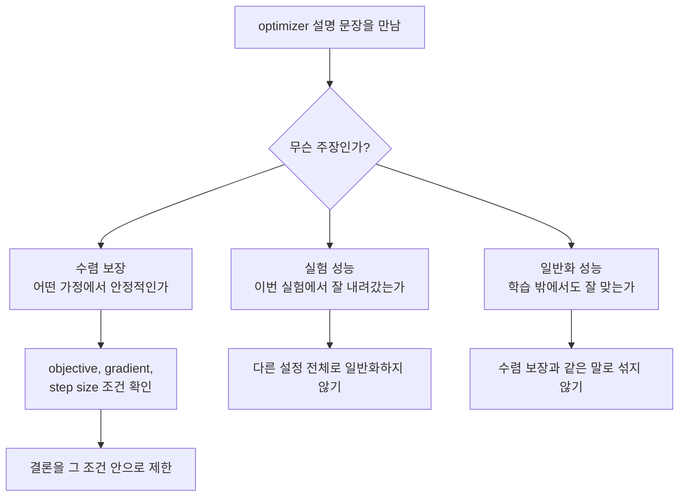
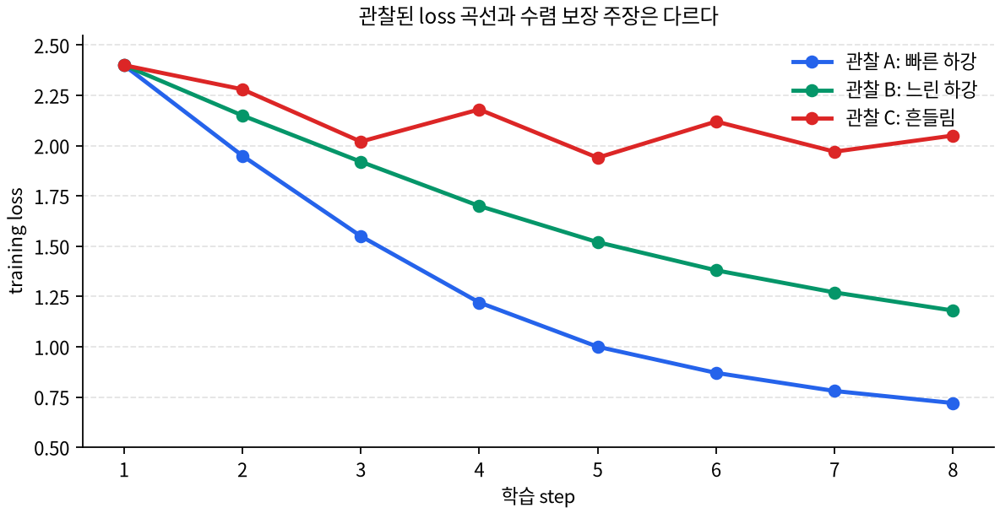

# P5-7.4 보충학습: adaptive optimization 주장 구분

> Section ID: `P5-7.4`
> Version: `v2026.07.31`

P5-7.3에서는 적응형 업데이트가 기본 update에 무엇을 더 보완하려 하는지 보고, Adam을 그 대표 예로 살펴보았습니다. 여기서 더 깊게 들어가면 다음 질문이 남습니다.

Adam 같은 adaptive optimizer는 실무에서 자주 쓰이는데, 그 update 규칙을 이론적으로도 항상 잘 수렴한다고 말할 수 있는가?

수렴 분석(convergence analysis)은 optimizer가 실제 실험에서 빠르게 보인다는 인상과 별개로, 어떤 가정 아래에서 반복 update가 목표 조건에 가까워진다고 말할 수 있는지를 따지는 검증 언어입니다. 이 절은 증명을 따라가는 절이 아니라, adaptive optimization을 설명할 때 실험 성능, 수렴 보장, 일반화 성능이 어떻게 다른 주장인지 구분하는 보충학습입니다.
이 구분은 뒤에서 optimizer 비교 글, 실험 보고, 논문 요약을 만날 때도 그대로 재사용할 수 있는 기준입니다.

## 수렴 보장과 실험 성능을 가르는 질문

- adaptive optimization에서 수렴 보장 논의가 무엇을 확인하는지 봅니다.
- 적응형 업데이트의 직관과 수렴 보장 논의가 왜 다른 질문인지 봅니다.
- `convex`, `non-convex`, `regret`, `step size`, `bounded gradient` 같은 조건이 무엇을 제한하는지 봅니다.
- AMSGrad 같은 변형이 어떤 문제의식을 보완하려 했는지 입문 수준에서 구분합니다.

여기서는 `증명을 할 수 있는가`보다 `어떤 설명이 어떤 종류의 보장을 말하는지 구분할 수 있는가`를 목표로 둡니다.

## 보장 주장과 조건의 판단 기준

- 실험 성능 주장과 수렴 보장 주장을 구분할 수 있습니다.
- adaptive optimizer의 수렴 분석에서 왜 가정이 중요한지 설명할 수 있습니다.
- Adam의 실무 사용성과 Adam의 이론적 수렴 보장이 같은 질문이 아니라는 점을 말할 수 있습니다.
- optimizer를 설명하는 글이나 발표에서 먼저 확인할 조건 목록을 만들 수 있습니다.

## 실무 성능과 수렴 보장은 다른 질문이다

실무에서 Adam을 쓰면 손실이 빠르게 줄어드는 경험을 자주 만납니다. 하지만 이것만으로 `모든 조건에서 Adam은 수렴한다`고 말할 수는 없습니다.

실험 성능은 특정 데이터, 모델, 초기값, 학습률, 배치 크기에서 결과가 좋았는지를 봅니다. 수렴 분석은 더 제한된 문장입니다. 정해진 수학적 가정 아래에서 update가 발산하지 않고, 최적해나 정지점(stationary point)에 가까워지는지 따집니다.

이 차이가 초심자에게 낯선 이유는, 실제 학습 경험에서는 보통 `loss가 잘 내려갔다`는 한 장면이 가장 먼저 보이기 때문입니다. 눈앞에서는 손실 곡선 하나만 보이는데, 설명 문장에서는 갑자기 `수렴`, `generalization`, `regret` 같은 다른 단어가 붙습니다. 그래서 독자는 같은 결과를 더 어렵게 다시 말하는 것처럼 느끼기 쉽습니다.

하지만 여기서는 오히려 반대로 잡는 편이 더 쉽습니다. 하나의 학습 실험을 보고도 우리는 서로 다른 질문을 던질 수 있습니다. `이번 실험에서 빨리 내려갔는가`, `어떤 조건 아래에서 발산하지 않는다고 말할 수 있는가`, `학습에 쓰지 않은 데이터에도 잘 맞는가`는 같은 문장을 길게 바꿔 쓴 것이 아니라, 서로 다른 층위의 질문입니다.

| 질문 | 먼저 보는 것 | 주의할 점 |
| --- | --- | --- |
| 실험 성능 | 이 데이터와 모델에서 loss나 metric이 좋아졌는가 | 다른 데이터, 다른 설정에서도 항상 보장된다는 뜻은 아닙니다. |
| 수렴 분석 | 어떤 가정 아래에서 update가 목표 조건에 가까워지는가 | 가정이 실제 딥러닝 학습 상황과 완전히 같지 않을 수 있습니다. |
| 일반화 성능 | 학습 데이터 밖에서도 잘 맞는가 | 수렴했다고 해서 자동으로 일반화가 좋다는 뜻은 아닙니다. |

이 구분이 중요한 이유는 optimizer 설명에서 `빨리 내려간다`, `잘 쓴다`, `수렴한다`, `일반화가 좋다`가 서로 다른 주장인데도 한 문장처럼 섞이기 쉽기 때문입니다.

### 아주 작은 장면. 세 문장은 왜 서로 다른가

같은 Adam 실험을 두고도 다음 세 문장은 서로 다른 뜻을 가집니다.

| 문장 | 실제로 묻는 질문 | 아직 말하지 않은 것 |
| --- | --- | --- |
| Adam을 쓰자 초반 loss가 빨리 줄었다 | 이번 실험에서 빨리 내려갔는가 | 모든 조건의 수렴 보장 |
| Adam류 방법의 수렴 성질을 분석한다 | 어떤 가정 아래에서 발산하지 않는가 | 실제 테스트 성능 |
| Adam이 이 작업에서 일반화가 더 좋았다 | 학습 데이터 밖에서도 잘 맞는가 | 왜 그런지에 대한 이론 보장 |

이 표를 먼저 보면, 뒤에서 낯선 이론 용어가 나와도 `같은 말을 어렵게 반복하는 중인가`라는 오해가 줄어듭니다. 지금 절의 목적은 바로 이 세 층위를 분리하는 데 있습니다.

이 판단 순서를 아주 단순하게 그리면 다음과 같습니다.

그래프로 다시 보면, 손실 곡선 하나가 잘 내려갔다는 사실과 수렴 보장 주장이 왜 다른지 더 직접 보입니다.

이 그래프는 같은 optimizer 계열을 보더라도 초기값, step size, 잡음 조건이 달라지면 관찰되는 loss 곡선이 얼마든지 다르게 보일 수 있음을 압축해 보여 줍니다. 파란 곡선처럼 빠르게 내려간 한 번의 실험은 분명 `이번 실험에서는 잘 내려갔다`는 근거가 됩니다. 하지만 그것만으로 초록 곡선이나 빨간 곡선까지 포함한 모든 조건의 안정성을 보장하지는 않습니다. 그래서 손실 곡선은 먼저 `실험 성능 관찰`로 읽고, 수렴 보장은 그와 별도로 `어떤 조건에서 그런 결론을 말하는가`를 확인해야 합니다.

## adaptive optimizer에서 무엇이 더 복잡해지는가

SGD를 아주 단순하게 보면 현재 gradient에 learning rate를 곱해 한 걸음 움직입니다. 분석할 대상도 비교적 직접적입니다.

Adam이나 AdaGrad 계열 adaptive optimizer는 좌표별 누적 정보를 함께 사용합니다. 어떤 좌표의 gradient가 자주 크게 나왔는지, 최근 gradient 흐름이 어떤지, 제곱 gradient의 누적값이 어떻게 변하는지를 보고 좌표별 update 크기를 조절합니다. 그래서 분석할 때는 현재 gradient 하나만 보는 것이 아니라, 시간에 따라 쌓이는 optimizer state까지 함께 추적해야 합니다.

| optimizer 감각 | update를 읽는 기준 | 수렴 분석에서 복잡해지는 지점 |
| --- | --- | --- |
| SGD | 현재 gradient와 공통 learning rate | step size 조건과 gradient 잡음 조건을 봅니다. |
| AdaGrad 계열 | 좌표별 누적 gradient 크기 | 드문 feature와 자주 등장하는 feature의 누적 차이를 봅니다. |
| Adam 계열 | gradient의 1차·2차 이동 평균 | 지수 이동 평균이 짧은 기억처럼 작동할 때 생기는 문제를 봅니다. |

따라서 adaptive optimization의 수렴 분석은 `Adam이 더 똑똑한가`를 묻는 절이 아닙니다. `좌표별로 달라지는 update 규칙이 어떤 조건에서는 안정적이고, 어떤 조건에서는 문제가 될 수 있는가`를 묻는 절입니다.

## 수렴 보장을 말할 때 먼저 확인할 조건

수렴 보장을 말하는 설명에서는 결론 문장보다 가정을 먼저 봐야 합니다. 가정이 바뀌면 같은 `수렴`이라는 단어도 뜻이 달라집니다.

| 표현 | 입문 수준에서 붙잡을 뜻 | 먼저 확인할 질문 |
| --- | --- | --- |
| convex objective | 손실 표면이 볼록하다고 가정한 문제 | 실제 딥러닝 네트워크의 non-convex 상황과 같은 주장인가? |
| non-convex objective | 볼록하지 않은 일반적인 손실 표면 | 최적해가 아니라 stationary point에 가까워지는 보장인가? |
| regret bound | 온라인 학습에서 누적 손실을 기준 해와 비교한 보장 | 이 보장이 일반적인 테스트 성능을 뜻하는 것은 아닌가? |
| bounded gradient | gradient 크기가 일정 범위 안에 있다고 둔 가정 | 실제 학습에서 gradient 폭주나 수치 불안정이 없는 조건인가? |
| step size schedule | learning rate가 시간에 따라 어떻게 줄거나 유지되는지에 대한 조건 | 내가 쓰는 고정 learning rate나 scheduler와 같은 조건인가? |
| exponential moving average | 최근 gradient 정보를 지수적으로 누적하는 방식 | 짧은 기억이 특정 패턴에서 오래된 정보를 충분히 보존하지 못하는가? |

이 표를 기준으로 보면, 수렴 분석은 결론 문장만 읽는 작업이 아닙니다. `어떤 문제 종류`, `어떤 gradient 조건`, `어떤 learning rate 조건`, `어떤 optimizer state 조건`에서 말하는 결론인지를 함께 읽는 작업입니다.

## Adam 수렴 논의에서 배울 점

Adam 원 논문은 stochastic objective를 위한 first-order optimizer로 Adam을 제안하고, 적응적 moment 추정과 online convex optimization 틀에서의 수렴 관련 분석을 함께 제시했습니다. 이 논문은 Adam이 왜 실무에서 매력적인지와, 수렴 분석이 어떤 형태로 제시되는지를 함께 보여 주는 출발점입니다.

이후 Reddi, Kale, Kumar의 분석은 Adam류 알고리즘이 항상 안정적으로 수렴한다고 단순화하면 위험하다는 점을 보여 줍니다. 핵심 문제의식은 지수 이동 평균으로 제곱 gradient를 누적하는 방식이 일부 상황에서 충분한 장기 기억을 유지하지 못할 수 있다는 데 있습니다. 이 논의에서 AMSGrad는 과거의 큰 제곱 gradient 정보를 더 보수적으로 남기는 방향으로 문제를 보완하려는 변형으로 이해할 수 있습니다.

여기서 독자가 가져가야 할 결론은 `Adam을 쓰면 안 된다`가 아닙니다. 더 안전한 결론은 다음입니다.

`Adam은 실무적으로 강력한 기본 선택지일 수 있지만, adaptive update가 항상 이론적으로 안전하다는 뜻은 아니며, 수렴 보장은 조건과 변형까지 함께 읽어야 한다.`

이 문장을 초심자 기준으로 다시 풀면 이렇습니다. `실무에서 많이 쓴다`는 말은 보통 많은 사람이 잘 작동한다고 경험했다는 뜻입니다. 반면 `수렴이 보장된다`는 말은 수학적 조건을 붙여도 여전히 성립하는가를 따지는 말입니다. 둘은 서로 관련은 있지만, 한쪽이 자동으로 다른 쪽을 대신하지는 않습니다.

## adaptive optimization 주장 구분: 확인할 판단 기준

이 사례에서는 adaptive optimization의 수렴 보장과 경험적 성능 주장을 구분해 읽는 법을 보충하는지 확인한다.

이 절의 사례는 optimizer 선택 사례가 아니라, optimizer를 설명하는 문장을 더 정확하게 구분하는 사례입니다. 모든 사례는 같은 순서로 정리합니다.

1. 이 문장이 실험 성능 주장인지, 수렴 분석 주장인지 먼저 붙입니다
2. 수렴 분석 주장이라면 objective 조건, gradient 조건, step size 조건을 찾습니다
3. 결론이 어디까지 말하는지 제한합니다
4. 실무 사용성, 수렴 보장, 일반화 성능을 서로 바꿔 말하지 않습니다

### 사례 1. 실험 문장을 수렴 보장처럼 받아들이는 경우

문장 분류 모델을 처음 학습하는데 Adam을 쓰자 손실이 빠르게 내려갔다고 해 보겠습니다. 사람은 여기서 `Adam이 더 좋은 optimizer`라고 바로 결론 내리기 쉽습니다. 하지만 수렴 분석 관점에서는 이 문장을 더 작게 나눕니다.

첫째, 이것은 특정 실험에서의 관찰입니다. 둘째, 빠른 초반 감소가 최종 수렴 보장이나 일반화 성능 보장을 뜻하지는 않습니다. 셋째, 수렴을 말하려면 손실 함수의 조건, gradient 조건, learning rate 조건, optimizer state의 누적 방식이 함께 제시되어야 합니다.

그래서 이 사례에서 확인해야 할 결과는 `Adam이 좋다`가 아니라, `실험 성능 주장과 이론 보장 주장을 분리해서 기록해야 한다`입니다.

| 읽은 문장 | 먼저 붙일 표지 | 다음에 확인할 질문 |
| --- | --- | --- |
| Adam을 쓰자 초반 loss가 빨리 줄었다 | 실험 성능 주장 | 어떤 데이터, 모델, learning rate, seed에서 본 결과인가? |
| Adam은 noisy gradient와 sparse gradient가 있는 문제에 적합하다고 설명한다 | 알고리즘 동기 주장 | 어떤 update state가 그 장면을 보완하려는가? |
| Adam의 수렴 성질을 분석한다 | 수렴 분석 주장 | 어떤 objective 조건과 step size 조건에서 말하는가? |

### 사례 2. 수렴 분석 문장을 실무 금지처럼 받아들이는 경우

Adam 수렴 문제를 다룬 논문을 보면 `Adam이 특정 상황에서 수렴하지 않을 수 있다`는 취지의 문장을 만날 수 있습니다. 이 문장을 읽고 바로 `Adam은 쓰면 안 된다`로 넘어가면, 논문이 실제로 말하는 범위보다 결론을 크게 만든 것입니다.

수렴 분석 문장은 보통 조건을 함께 가집니다. 어떤 objective를 가정했는지, 어떤 gradient sequence를 예로 들었는지, 어떤 optimizer state 누적 방식이 문제를 만들었는지, 제안한 변형이 무엇을 바꾸는지를 함께 읽어야 합니다. Reddi, Kale, Kumar의 논의에서 중요한 점도 `Adam이라는 이름 전체가 실패한다`가 아니라, 지수 이동 평균 기반의 제곱 gradient 누적이 일부 조건에서 충분한 장기 기억을 남기지 못할 수 있고, AMSGrad가 그 지점을 보완하려 했다는 구조입니다.

그래서 이 사례에서 확인해야 할 결과는 `Adam 사용 금지`가 아닙니다. 논문 문장을 `문제 조건`, `실패 원인`, `제안된 수정`, `보장 범위`로 나누어 읽어야 한다는 점입니다.

| 너무 큰 해석 | 수렴 분석 관점으로 다시 읽기 |
| --- | --- |
| Adam은 수렴하지 않으니 쓰면 안 된다 | 어떤 조건에서 어떤 반례나 실패 가능성을 보였는지 먼저 확인합니다. |
| AMSGrad가 있으니 Adam은 낡았다 | AMSGrad가 optimizer state의 어떤 누적 방식을 바꾸는지 확인합니다. |
| 수렴 문제가 있으면 실무 성능도 항상 나쁘다 | 이론 보장과 특정 실험 성능은 분리해서 기록합니다. |
| 논문 결론만 읽으면 충분하다 | theorem의 가정, step size 조건, objective 조건을 함께 읽습니다. |

## 연습 및 예제

다음 문장을 보고 `주장 유형 구분표`를 채워 봅니다. 수식 증명을 하지 않아도, 어떤 문장이 실험 주장이고 어떤 문장이 수렴 분석 주장인지 나누고, 그 주장이 넘어가면 안 되는 결론을 적는 것만으로도 adaptive optimization 관련 설명을 더 정확하게 해석할 수 있습니다.

| 읽은 문장 | 주장 유형 | 반드시 찾을 조건 | 넘어가면 안 되는 결론 |
| --- | --- | --- | --- |
| Adam은 이 문장 분류 실험에서 기본 직접 update 기준보다 초반 loss를 빨리 줄였다. | 실험 성능 주장 | 데이터, 모델, seed, learning rate, 학습 길이 | Adam이 모든 조건에서 이론적으로 수렴한다 |
| bounded gradient와 convex objective 조건에서 regret bound를 제시한다. | 수렴 분석 주장 | convex 여부, gradient bound, step size 조건, 비교 기준 | 실제 non-convex 딥러닝 학습 전체가 같은 보장을 받는다 |
| AMSGrad는 Adam류 방법의 일부 수렴 문제를 보완하려는 변형이다. | 알고리즘 보완 주장 | 어떤 second-moment 누적 방식을 바꾸는가 | Adam 전체가 실무적으로 무효가 된다 |

이 연습에서 중요한 것은 논문 제목이나 optimizer 이름을 많이 외우는 것이 아닙니다. `무엇을 보장하는가`, `어떤 조건에서 말하는가`, `그 결론을 어디까지 확장해도 되는가`를 확인하는 습관입니다. 한 문장으로 닫으면, adaptive optimization 수렴 보장을 다룰 때의 중심축은 다음입니다.

`주장 유형을 붙이고, 가정을 찾고, 그 보장이 어디까지 말하는지 제한해서 읽는다.`

## 체크리스트

- adaptive optimizer의 실무 성능과 이론적 수렴 보장을 구분할 수 있는가?
- `수렴한다`는 말을 볼 때 objective 조건, gradient 조건, step size 조건을 먼저 찾는가?
- Adam이 실무에서 많이 쓰인다는 사실만으로 모든 조건의 수렴을 단정하지 않는가?
- AMSGrad 같은 변형을 `새 이름`이 아니라 `Adam류 수렴 문제를 보완하려는 update state 변형`으로 읽을 수 있는가?
- optimizer 설명을 볼 때 실험 성능, 수렴 분석, 일반화 성능을 따로 표시할 수 있는가?

## 출처와 참고 자료

- Diederik P. Kingma, Jimmy Ba, [Adam: A Method for Stochastic Optimization](https://arxiv.org/abs/1412.6980){: target="_blank" rel="noopener noreferrer" }, arXiv, 2014, 확인일: 2026-07-16.
- Sashank J. Reddi, Satyen Kale, Sanjiv Kumar, [On the Convergence of Adam and Beyond](https://arxiv.org/abs/1904.09237){: target="_blank" rel="noopener noreferrer" }, arXiv, ICLR 2018 논문, 확인일: 2026-07-16.
- John Duchi, Elad Hazan, Yoram Singer, [Adaptive Subgradient Methods for Online Learning and Stochastic Optimization](https://jmlr.org/papers/v12/duchi11a.html){: target="_blank" rel="noopener noreferrer" }, Journal of Machine Learning Research, 2011, 확인일: 2026-07-16.
- Ilya Loshchilov, Frank Hutter, [Decoupled Weight Decay Regularization](https://arxiv.org/abs/1711.05101){: target="_blank" rel="noopener noreferrer" }, arXiv, 2017, 확인일: 2026-07-16.
