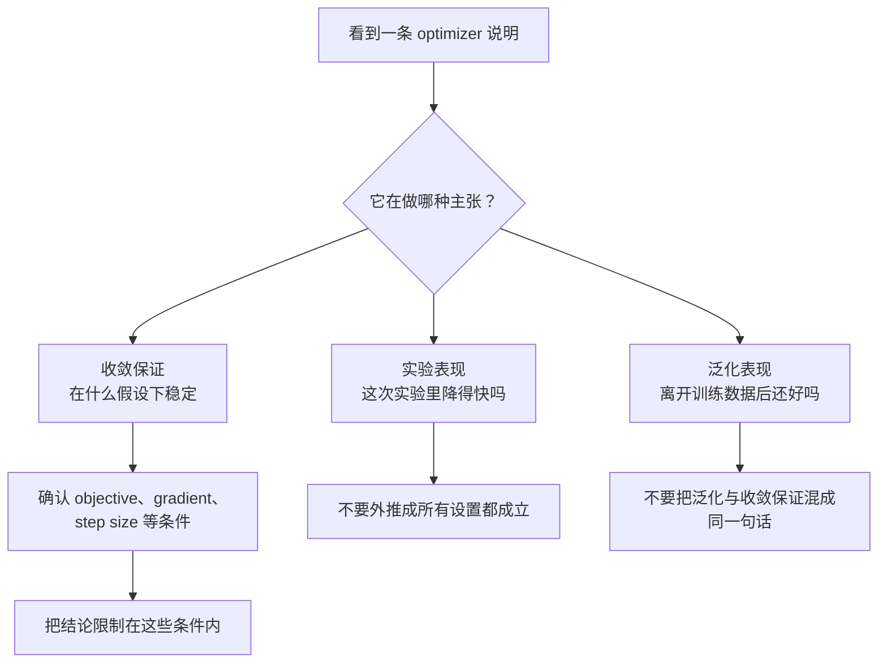

# P5-7.4 补充学习：adaptive optimization 的收敛保证与主张区分

Section ID: `P5-7.4`
Version: `v2026.07.17`

在 P5-7.3 里，我们已经把自适应 update 想补的是什么，以及 Adam 为何常被拿来当代表例子看过一遍。继续往里走，就会留下一个更深的问题。

像 Adam 这样的 adaptive optimizer 在实务里经常被使用，但它的 update 规则是否也能被说成：在理论上总是会良好收敛？

收敛分析（convergence analysis）并不是在重复说一次`实验里看起来下降得很快`，而是在问：在某些明确假设之下，这些重复 update 能否被说成会逐步接近目标条件。这一节不是让读者去追证明，而是把`实验表现`、`收敛保证`、`泛化表现`这几种不同层位的主张分开来读。

这条区分并不只对 Chapter 7 有用。以后读 optimizer 比较文章、实验报告、论文摘要时，这套判断标准都还会继续重复使用。

## 本节范围

- adaptive optimization 里的收敛保证讨论，到底是在确认什么？
- 为什么自适应 update 的直觉，与收敛保证讨论其实是在回答不同问题？
- `convex`、`non-convex`、`regret`、`step size`、`bounded gradient` 这些条件，分别在限制什么？
- 像 AMSGrad 这样的变体，到底是在回应什么问题意识？

这里的目标不是`会不会证明`，而是`能不能看懂：不同说明到底在做哪一种保证。`

## 本节目标

- 能区分实验性能主张与收敛保证主张。
- 能说明为什么 adaptive optimizer 的收敛分析总要连着前提条件一起读。
- 能指出：Adam 的实务好用，与 Adam 的理论收敛保证不是同一个问题。
- 能在看 optimizer 相关文章或说明时，先列出自己要确认的条件清单。

## 实务表现与收敛保证不是同一个问题

在实务里，人们经常会看到：Adam 让损失下降得很快。但这件事本身，并不能直接推出：`Adam 在所有条件下都收敛。`

实验表现是在看：在这个数据、这个模型、这个初始值、这个学习率、这个 batch 大小之下，结果有没有变好。收敛分析则是更受限制的问题。它在问：在明确给定的数学假设下，这些反复 update 会不会发散，以及能不能说它们会接近最优解或某种停驻点（stationary point）。

初学者会觉得这件事拧巴，往往是因为眼前最先看到的只有一条 loss 曲线。实验里看到的是`loss 降下来了`，而说明文里突然又冒出`收敛`、`generalization`、`regret`这些词，看起来像是在把同一件事换个复杂说法重复一遍。

但更容易理解的方式，其实是反过来看：同一个学习实验，我们可以问完全不同的问题。`这次实验有没有降得快`、`在什么条件下能说它不会发散`、`它离开训练数据后是否仍然做得好`，这三件事不是同一句话的不同版本，而是三个不同层位的问题。

| 问题 | 先看的是什么 | 要小心的地方 |
| --- | --- | --- |
| 实验表现 | 在这个数据与模型上，loss 或 metric 是否变好了 | 这并不自动等于在其他设置下也始终成立 |
| 收敛分析 | 在什么假设下，update 会逐步接近目标条件 | 这些假设未必和真实深度学习训练一模一样 |
| 泛化表现 | 离开训练数据后是否仍然表现好 | 即使收敛，也不代表泛化一定好 |

这条区分很重要，因为 optimizer 说明里很容易把`下降得快`、`常用`、`会收敛`、`泛化好`揉成一团，好像它们是同一种评价。

### 一个很小的场景：为什么三句话其实不一样

面对同一个 Adam 实验，也可能同时出现下面三种句子。

| 句子 | 它实际在问什么 | 还没有说到的东西 |
| --- | --- | --- |
| 换成 Adam 后，初期 loss 下降更快了 | 这次实验里是否降得更快 | 所有条件下的理论收敛保证 |
| 正在分析 Adam 类方法的收敛性质 | 在什么假设下不会发散 | 真实测试表现如何 |
| Adam 在这个任务里的泛化更好 | 它在训练数据之外是否仍然做得好 | 为什么会这样、以及有没有理论担保 |

只要先看懂这张表，后面碰到论文里的理论术语时，就不容易再误以为：这只是把同一句话说得更复杂了而已。本节要做的，正是先把这三个层位分开。

如果把这条判断顺序画成最简单的流程，大致会像下面这样。

再用图来读一次，会更直观看出：同样是一条看起来不错的损失曲线，为什么不能直接拿来当收敛保证。

这张图压缩地展示了：即使是同一个 optimizer 家族，只要初始值、step size、噪声条件不同，观测到的 loss 曲线也可以很不一样。像蓝色曲线那样，一次实验里看起来下降得很快，这当然能支持`这次实验里它下降得快`这个主张；但它并不能自动把绿色曲线、红色曲线包含进去，也不能替代对全部条件的稳定性说明。也正因为这样，损失曲线先该被读成`实验观察`，而收敛保证则要另外问：`它到底在什么条件下成立？`

## 为什么 adaptive optimizer 的收敛问题更复杂

如果把最简单的 SGD 理解成：用当前 gradient 与 learning rate 直接走一步，那么分析对象相对直接。

但 Adam、AdaGrad 这类 adaptive optimizer 会把按坐标累积起来的信息也一起写进 update 规则。某个坐标是否经常出现大 gradient，最近几步的 gradient 流向怎样，平方 gradient 的累积又怎样变化，这些都会影响坐标级 update。于是理论分析时，就不再只是看`当前 gradient`，而必须连着 optimizer state 一起追踪。

| optimizer 直觉 | update 在看什么 | 收敛分析里为什么更复杂 |
| --- | --- | --- |
| SGD | 当前 gradient 与共同 learning rate | 主要看 step size 与 gradient 噪声条件 |
| AdaGrad 家族 | 按坐标累积的 gradient 尺度 | 需要分析稀疏特征与频繁特征在累积上的差异 |
| Adam 家族 | gradient 的一阶、二阶移动平均 | 需要分析这些指数移动平均在时间上怎样保留或遗忘信息 |

所以，adaptive optimization 的收敛分析，并不是在问`Adam 是否更聪明`，而是在问：`当 update 规则开始按坐标、按时间累积信息时，它在什么条件下稳定，在什么条件下可能出现问题？`

## 说到收敛保证时，应该先确认哪些条件

任何收敛保证都不该只看结论句，而应该先看假设。因为只要假设换了，哪怕都写着`收敛`，意思也可能完全不同。

| 表达 | 入门阶段先抓住的意思 | 先问什么 |
| --- | --- | --- |
| convex objective | 假设损失面是凸的 | 这和真实深度网络里的 non-convex 场景是同一种主张吗？ |
| non-convex objective | 假设损失面不是凸的 | 这里说的是靠近最优解，还是靠近 stationary point？ |
| regret bound | 在线学习里，把累计损失与某个基准解比较 | 这是不是被误读成了测试表现保证？ |
| bounded gradient | 假设 gradient 大小被控制在一定范围里 | 真实训练里是否有梯度爆炸或数值不稳定？ |
| step size schedule | 假设 learning rate 随时间如何变化 | 这和我当前用的固定 learning rate 或 scheduler 一样吗？ |
| exponential moving average | 用指数方式累积最近 gradient 信息 | 这种较短记忆会不会在某些模式下忘掉太多过去信息？ |

只要抓住这张表，就会知道：收敛分析不是只读结论句，而是要连着`问题类型`、`gradient 条件`、`learning rate 条件`、`optimizer state 条件`一起读。

## 从 Adam 的收敛争论里，应该学到什么

Adam 的原始论文把它作为 stochastic objective 上的一阶 optimizer 提出来，同时也给出了与 adaptive moment estimation 及 online convex optimization 相关的分析框架。它既展示了 Adam 为什么在实务里很有吸引力，也展示了收敛分析会怎样和算法说明一起出现。

之后像 Reddi、Kale、Kumar 这样的分析则提醒我们：如果把 Adam 类方法简单地压成`总会稳定收敛`，就会过于粗糙。核心问题意识在于：用指数移动平均去累积平方 gradient 时，在某些条件下可能无法保留足够长的历史信息。也正是在这种问题意识下，AMSGrad 这样的变体出现了，它试图更保守地保留过去较大的平方 gradient 记录。

读者真正要带走的结论，不应该是`因此 Adam 不能用`。更安全的结论是：

`Adam 可以是很强的实务默认选择，但 adaptive update 并不因此自动等于在所有条件下理论安全；收敛保证必须连着条件与变体一起读。`

如果把这句话再用初学者语言展开，它的意思其实很简单。`很多人实务里会用 Adam`，通常意味着：在很多任务上，人们经验上觉得它好用；但`它有收敛保证`则是在说：在明确定义过的数学条件下，能不能证明它不会乱掉。两者有关，却不是自动互相替代。

## 案例与示例

这一节的案例，不是在帮你选 optimizer，而是在帮你更精确地区分`不同类型的主张。` 读每个案例时，都先按同一个顺序来。

1. 先给句子贴上：它是实验表现主张，还是收敛分析主张
2. 如果是收敛分析主张，就去找 objective 条件、gradient 条件、step size 条件
3. 再限制：这个结论到底只说到哪里
4. 不把实务好用、理论收敛、泛化表现混成一句话

### 案例 1. 把实验句子误读成收敛保证

假设你训练一个句子分类模型，换成 Adam 后，loss 一开始下降得很快。人很容易马上得出`Adam 是更好的 optimizer`这样的结论。但从收敛分析视角看，这句话需要拆得更细。

第一，这仍然只是某次实验里的观察。第二，前期下降得快，不等于已经给出了最终的收敛保证，更不等于泛化一定更好。第三，如果要说`收敛`，就必须继续说明 objective 条件、gradient 条件、learning rate 条件、optimizer state 累积方式。

所以这个案例里要确认的结果，不是`Adam 更好`，而是`实验表现主张与理论保证主张必须分开写。`

| 读到的句子 | 先贴的标签 | 下一步该确认什么 |
| --- | --- | --- |
| 用 Adam 后，初期 loss 下降更快 | 实验表现主张 | 这是在什么数据、模型、learning rate、seed 下得到的？ |
| 文章说 Adam 对 noisy gradient 或 sparse gradient 情况很合适 | 算法动机主张 | 是 update 里的哪种 state 在试图补这类场景？ |
| 文章分析 Adam 的收敛性质 | 收敛分析主张 | 它到底是在什么 objective 与 step size 条件下说这件事？ |

### 案例 2. 把收敛分析误读成实务禁令

如果读到讨论 Adam 收敛问题的论文，里面会写`在某些情况下 Adam 可能不会收敛`。如果把这句话立刻理解成`Adam 不能用`，那就把论文真正说的范围夸大了。

收敛分析句子几乎总是带着条件。要一起看：它假设的 objective 是什么，构造的 gradient sequence 是什么，问题出在什么样的 optimizer state 累积方式上，以及提出的变体到底改了哪里。像 Reddi、Kale、Kumar 这类讨论里，重点也不是`Adam 这个名字整体失败`，而是指出：某种指数移动平均式平方 gradient 累积，在部分条件下可能记不住足够长的历史；而 AMSGrad 则是对这一点的修补。

所以，这个案例里真正要确认的结果，也不是`禁止使用 Adam`，而是：一旦读到这类论文，必须把它拆成`问题条件`、`失败原因`、`提出的修改`、`保证范围`。

| 过大的解读 | 重新用收敛分析视角来读 |
| --- | --- |
| Adam 不收敛，所以不能用 | 先看它到底在什么条件下构造了反例或失败情形 |
| 既然有 AMSGrad，Adam 就已经过时 | 先看 AMSGrad 改的到底是 optimizer state 的哪一部分 |
| 有收敛问题，就说明实务表现一定差 | 实验表现与理论保证仍然要分开记录 |
| 只读论文结论就够了 | theorem 的假设、step size 条件、objective 条件都要一起看 |

## 练习与例子

看下面这些句子，练习给它们填上`主张类型区分表`。即使不做任何证明，只要能把`实验句子`与`收敛分析句子`区分开，并指出不能把结论扩展到哪里，就已经能更准确地阅读 adaptive optimization 相关说明。

| 读到的句子 | 主张类型 | 必须找出的条件 | 不能直接跨过去的结论 |
| --- | --- | --- | --- |
| 在这个句子分类实验里，Adam 比直接 update 基准更快降低了初期 loss | 实验表现主张 | 数据、模型、seed、learning rate、训练长度 | 因而 Adam 在所有条件下都有理论收敛保证 |
| 在 bounded gradient 与 convex objective 条件下给出 regret bound | 收敛分析主张 | convex 与否、gradient bound、step size 条件、比较基准 | 真实的 non-convex 深度学习训练全部都享受同样保证 |
| AMSGrad 是为了修补 Adam 类方法中的某些收敛问题而提出的变体 | 算法修补主张 | 它改的是哪一段 second-moment 累积方式 | 因此 Adam 在实务里整体无效 |

这个练习最重要的，不是多记几个论文名或 optimizer 名，而是养成一套阅读习惯：先问`它保证的是什么`，再问`它在什么条件下这么说`，最后问`这个结论最多能扩展到哪里。`

如果用一句话收尾，自适应 optimization 的收敛保证最核心的阅读轴，就是：

`先给主张贴标签，再找假设，再把结论限制在它真正说到的范围里。`

## 检查清单

- 能区分 adaptive optimizer 的实务表现与理论收敛保证吗？
- 一看到`会收敛`这种说法时，能先去找 objective 条件、gradient 条件、step size 条件吗？
- 能避免把`Adam 很常用`直接读成`Adam 在所有条件下都收敛`吗？
- 能把 AMSGrad 这类名字读成`对 Adam 类 state 累积问题的修补`而不是单纯的新品牌吗？
- 读 optimizer 相关文章时，能把实验表现、收敛分析、泛化表现分别贴上不同标签吗？

## 出处与参考资料

- Diederik P. Kingma, Jimmy Ba, [Adam: A Method for Stochastic Optimization](https://arxiv.org/abs/1412.6980){: target="_blank" rel="noopener noreferrer" }, arXiv, 2014, 确认日期: 2026-07-16.
- Sashank J. Reddi, Satyen Kale, Sanjiv Kumar, [On the Convergence of Adam and Beyond](https://arxiv.org/abs/1904.09237){: target="_blank" rel="noopener noreferrer" }, arXiv, ICLR 2018 论文, 确认日期: 2026-07-16.
- John Duchi, Elad Hazan, Yoram Singer, [Adaptive Subgradient Methods for Online Learning and Stochastic Optimization](https://jmlr.org/papers/v12/duchi11a.html){: target="_blank" rel="noopener noreferrer" }, Journal of Machine Learning Research, 2011, 确认日期: 2026-07-16.
- Ilya Loshchilov, Frank Hutter, [Decoupled Weight Decay Regularization](https://arxiv.org/abs/1711.05101){: target="_blank" rel="noopener noreferrer" }, arXiv, 2017, 确认日期: 2026-07-16.
