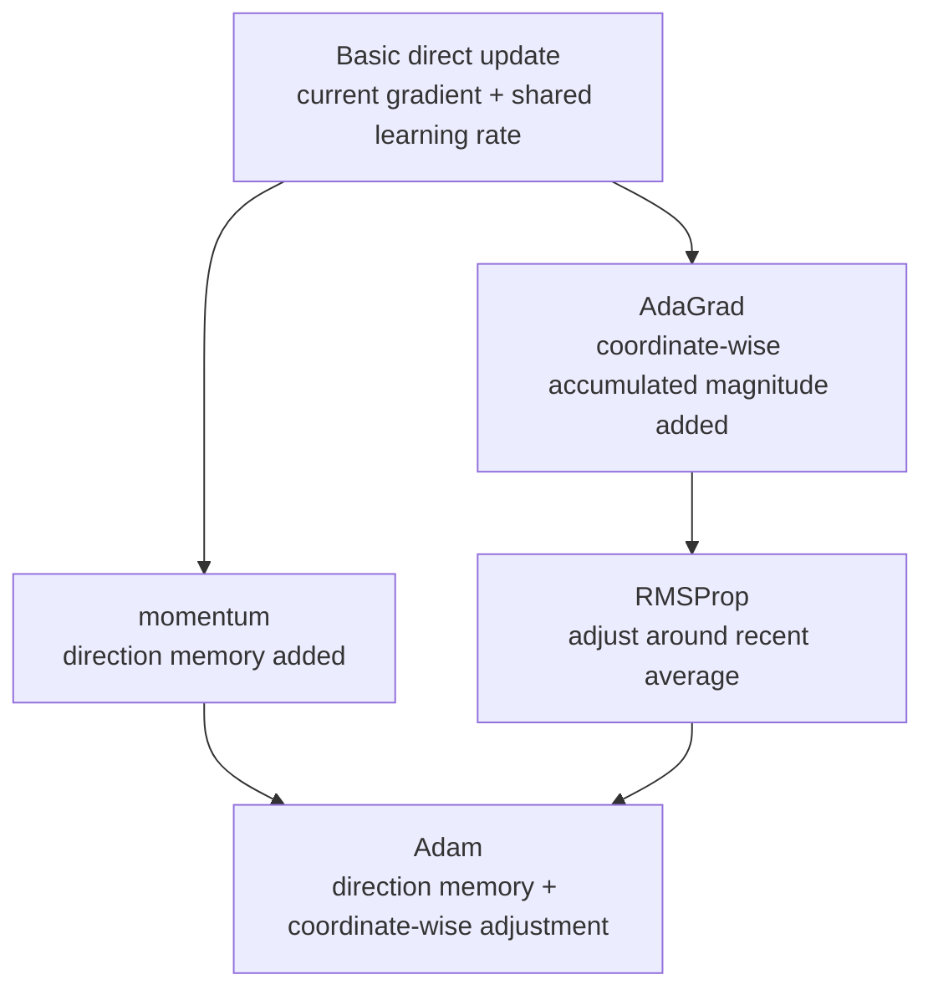

# P5-7.5 Supplementary Reading: Momentum, AdaGrad, RMSProp, Adam

> Section ID: `P5-7.5`
> Version: `v2026.07.19`

In P5-7.3, we looked at the intuition of adaptive update using Adam (Adaptive Moment Estimation) as an example. If we go one step further from there, the reader meets many optimizer families such as momentum, AdaGrad, RMSProp, and Adam. If these names start to be memorized like different brands, the real core becomes blurry instead.
The distinction standard in this section helps the reader, even when different optimizer names appear again later, to organize them with the same question every time rather than memorizing them as entirely new algorithms.

The question we have to hold first in this section is not `which optimizer is more famous`, but `besides the current gradient, what is each optimizer trying to remember more, and what is it trying to adjust more?`

The reason this section feels unfamiliar to beginners is not that there are many names, but that the comparison standard is not visible at once. So instead of trying to memorize the four algorithms separately, it is better to read the explanation below in a way that makes us repeat the same question four times.

## Scope Of This Section

- What is momentum trying to preserve beyond the current gradient?
- In what intuition should we read the coordinate-wise adjustment of AdaGrad and RMSProp?
- Why is Adam often described as `momentum + adaptive scale` together?
- Can we turn optimizer-family comparison from an absolute ranking chart into a structure-comparison table?

This section focuses on explaining the structure of optimizer families. The goal here is not to memorize the full formulas of each algorithm, but to understand the family differences through three questions: `what does it remember more`, `what does it adjust more`, and `what problem was it trying to solve?`

## Goals Of This Section

- You can compare momentum, AdaGrad, RMSProp, and Adam at the same level.
- You can explain in which optimizer `time-axis accumulation` and `coordinate-axis adjustment` are more central.
- You can see Adam as `a representative example of adaptive optimizers`, while still saying on top of what earlier families it is connected.
- You can explain in what order of questions optimizer families should be distinguished.

## The Axes We Have To Look At Before The Names

The reason optimizer names look numerous is that, while they are all `rules that turn gradients into actual updates`, they differ in the kinds of additional memory and adjustment they add to that rule. In this section, it is enough to read them through the following three axes.

| Axis to look at first | Question | Example |
| --- | --- | --- |
| what is remembered more | does it look only at the current gradient, or does it also keep recent movement direction, or the magnitude of squared gradients? | momentum, Adam |
| what is adjusted more | does it move every coordinate by the same standard, or adjust the stride differently by coordinate? | AdaGrad, RMSProp, Adam |
| what problem was it trying to alleviate first | among oscillation, slow progress, sparse features, and coordinate-wise scale difference, what was it trying to reduce first? | momentum, AdaGrad |

Once these three axes are fixed, optimizer names can look long without becoming blurry. As more names appear, we simply repeat the question `what does it remember more and what does it adjust more?`

This point matters because, when beginners first meet optimizer names, the easiest misunderstanding is to feel `if the names differ, does that mean the learning principle itself is completely different?` But in reality, most of them still stand on the same larger frame. They are all rules that turn gradients into updates, and the difference lies in what supporting memory they added to that rule, what coordinate-wise adjustment they allow, and what inconvenience they tried to reduce first.

In other words, what we need now is not memorizing the genealogy of the names, but reading `what gets added one by one on top of the baseline`. Once this viewpoint is fixed, even if optimizer names increase, the reader feels less like learning everything from the beginning again each time. It becomes possible to read them progressively, like `if direction memory is added to the basic direct update, that is momentum`, `if coordinate-wise accumulated magnitude adjustment is added, that is the AdaGrad family`, and `if the two come together, that is the Adam family`.

### First Hold Each Of The Four Optimizers In One Line

If the main text still feels long, it is enough to start by holding only the four lines below.

| Name | One shortest line to hold first |
| --- | --- |
| momentum | mixes a little of the recent movement direction into the current gradient |
| AdaGrad | looks at how often each coordinate has reacted strongly |
| RMSProp | still looks at coordinate-wise accumulation, but does not keep old records with equal weight forever |
| Adam | uses direction memory and coordinate-wise adjustment together |

Once these four lines are in mind, the longer paragraphs later are read not as totally new content, but as unpacking each one-line summary in more detail.

If we redraw the structure above as the flow `what is added on top of the baseline`, it becomes the following.

## Why Is Momentum Given A Separate Name

Momentum adds the idea of preserving `the previous movement direction` a little on top of the simplest direct update. Instead of looking only at the current gradient and taking one step, it also partly reflects in what direction the model had been moving over recent steps.

This intuition works in the direction of making the model advance more steadily when the slope keeps continuing one way, and of suppressing some of the immediate left-right oscillation when the direction keeps wobbling.

If this still feels abstract, imagine a scene where you are descending a long valley but the floor itself is bumpy. If we reflect only the current gradient immediately, each footstep can wobble a little left and right. But if we keep some memory of the direction we had been moving just before, then instead of deciding the direction from scratch every time, the path continues the flow `we were generally going this way`. It is enough to read momentum as the device that turns exactly this feeling into a formula.

So it is more accurate to understand momentum not as `a more complicated optimizer`, but as `a method that adds a short inertia to the current gradient`. Once this single sentence is fixed, momentum stops looking like a completely new world and starts to look like a very natural extension of the basic direct update.

If we make it one very small scene, it becomes even more intuitive. Suppose in one step the gradient points left, in the next step it points right with almost the same magnitude, and in the next step it points left again. If we reflect only the current gradient immediately, the update also wobbles left, right, left immediately. But momentum keeps a little of the direction from the previous steps, so instead of writing down all the wobble as it is, it also looks at `overall, which way had we been going?` Just holding this one small scene makes the question `why does the phrase direction memory appear?` much less abstract.

If we reduce it to one sentence, it becomes the following.

`Momentum is the method that mixes a little of the previous movement inertia into the current gradient to create smoother progress.`

### One Very Small Numeric Example. The Difference Between Direct Update And Momentum

The numbers below are not a full optimizer implementation. They are only a small example for seeing `what changes when direction memory is attached`.

| step | current gradient | movement that direct update would reflect immediately | change expected from the momentum viewpoint |
| --- | --- | --- | --- |
| 1 | `-2.0` | move strongly to the left | recent flow is also still to the left, so it starts almost similarly |
| 2 | `+1.8` | reverse strongly to the right immediately | the previous leftward flow remains, so the full reversal is softened a little |
| 3 | `-1.9` | reverse sharply to the left again | because of the recent direction memory, some of the wobble is suppressed |

The important thing in this table is not the exact formula value, but the reading intuition. Direct update translates `the current gradient` immediately, so if the direction changes often, the movement also wobbles immediately. Momentum, by contrast, keeps some memory of `which way it had been going just before`, so it reads the same number flow as something less jagged.

## What Are AdaGrad And RMSProp Trying To Change

AdaGrad looks separately at how much gradient has accumulated for each coordinate. Some coordinates receive large gradients frequently, while others react only rarely and weakly. AdaGrad tries to adjust the update size differently for each coordinate by looking at this difference.

It is enough to hold onto the following feeling.

- coordinates that have reacted strongly many times gradually move more conservatively
- coordinates that appear rarely are prevented from being buried too much

But because the accumulation in AdaGrad keeps growing, over a long time the stride can shrink too much.

The feeling the reader should actually hold here is that `not every parameter always suffers from the same kind of problem`. Some coordinates may already have been updated a great deal, while others may hardly have received learning signal yet. AdaGrad is closer to the viewpoint that recognizes exactly this difference and asks whether different coordinates might need different strides.

So when understanding AdaGrad, it is better not to oversimplify it as `it automatically decides the learning rate`, but to hold it as `it looks at how often each coordinate has reacted strongly so far`. This sentence is needed so that when we continue later to RMSProp and Adam, the reason `why is coordinate-wise record needed` keeps connecting.

If we replay this through a small scene, suppose there are `risk_weight` and `rare_signal_weight` inside one model. `risk_weight` receives a large gradient in almost every batch and moves often, while `rare_signal_weight` receives signal only in rare cases. If we move every coordinate only with the same stride, the frequently appearing coordinate may keep wobbling strongly, while the rare coordinate may fail to learn enough. AdaGrad can be read as the method that asks exactly in this scene, `do these really have to move by the same standard?`

RMSProp comes out exactly at this point. Like AdaGrad, it looks at coordinate-wise gradient magnitude, but instead of accumulating the entire past forever, it changes that accumulation into a recent-flow-centered average to ease the problem that the stride becomes too small too quickly.

In other words, both AdaGrad and RMSProp stand on the axis of `coordinate-wise adjustment`, but RMSProp can be read as trying to refine that adjustment with a more practical sense of time.

If we unpack the expression `a more practical sense of time` a little more, it becomes this. AdaGrad keeps remembering the whole past, so even a large reaction from the very beginning remains strongly all the way to the end. RMSProp, on the other hand, is closer to treating recent reactions as more important rather than carrying old records forward forever with the same weight. So it keeps the idea of `coordinate-wise adjustment`, but tries to reduce the problem that learning shrinks too quickly.

### One Very Small Numeric Example. How Should We Read AdaGrad And RMSProp Differently

Suppose the gradient magnitude of one coordinate keeps entering as `4.0 -> 4.0 -> 4.0`.

| step | feeling if we read it in an AdaGrad-like way | feeling if we read it in an RMSProp-like way |
| --- | --- | --- |
| 1 | accumulation begins, so the stride starts shrinking | the recent average grows, so the stride starts shrinking |
| 2 | accumulation grows further, so it is read more conservatively than before | it is still adjusted by the recent average, but old values are not accumulated forever with equal weight |
| 3 | because it keeps accumulating, the stride may shrink even more | it is still adjusted, but `the whole past accumulated forever` is reflected less than in AdaGrad |

This table is not trying to replace the exact computation of the two optimizers. For an introductory reader, it is enough that `AdaGrad is the side that keeps accumulating`, while `RMSProp is the side that adjusts around a recent average`.

## Why Is Adam Described As Bringing Two Axes Together

Adam often appears at the end of optimizer-family comparisons. The reason is not simply that it is a newer name, but that the two axes we saw earlier come together inside it.

- it keeps the `recent gradient flow` that we were seeing from the momentum side
- it also uses the `coordinate-wise adjustment of gradient magnitude` that we were seeing from the AdaGrad/RMSProp side

So when understanding Adam, rather than memorizing it as one isolated new name, it is much safer to group it in the following sentence.

`Adam is a representative adaptive optimizer that uses recent direction accumulation and coordinate-wise adaptive adjustment together.`

If we use this sentence as the standard, Adam no longer looks like a strange name dropped from nowhere, but like a representative example where the ideas of the earlier families meet.

This explanation matters because, since Adam appears often in practice, beginners can easily accept it as `something people just use because it is the default`. But what we have to hold in this section is not fashion, but structure. Adam is often mentioned not because the name is famous, but because it is a representative example that carries both `direction accumulation` and `coordinate-wise adjustment`.

In other words, to understand Adam, it is better not to memorize only Adam by itself, but to see how `what we saw in momentum` and `what we saw in RMSProp/AdaGrad` meet in one place. If that connection becomes visible, Adam is no longer a new brand to memorize, but the point where the questions we have been accumulating from earlier meet.

If we turn this into an actual order of distinction, it becomes easier. When you meet Adam, do not summarize it immediately as `a famous optimizer`. First ask `does it include direction memory?`, and then ask `does it include coordinate-wise adjustment?` If both questions get a `yes`, then Adam is seen not as a completely new name, but as an example where the two earlier lines of ideas enter together.

If we look at the graphs below together, it becomes more direct why, even with `the same gradient flow`, direct update and Adam-like update create different movement amounts and different paths.

This first graph shows the gradient input itself across three steps. The key point is that the input signal gradually shrinks as `-4.0 -> -2.0 -> -1.0`. In other words, the difference between the two methods does not come from different input, but from different update rules that interpret the same input.

In this second graph, even when receiving the same input gradient, the direct update creates a large movement amount by immediately multiplying by the learning rate, while the Adam-like method begins to create a smaller movement amount by reflecting recent flow and coordinate-wise adjustment. For a beginner, it is enough to read this graph as a device for confirming that `even when the input is the same, the step size does not have to be the same`.

The third graph shows how that difference accumulates in the actual parameter path. The direct update moves more quickly as `1.4 -> 1.6 -> 1.7`, while the Adam-like method moves more gently as `1.04 -> 1.10 -> 1.16`. What the reader has to hold here is not `which one is absolutely better`, but that the optimizer rule turns the same gradient history into different parameter paths.

## A Table Of Standards For Distinguishing Optimizer Families

| optimizer | what it remembers more | what it adjusts more | what it first tried to alleviate |
| --- | --- | --- | --- |
| basic direct update | current gradient | shared learning rate | the simplest baseline |
| momentum | previous movement direction | shared learning rate | zigzag oscillation, more steady progress |
| AdaGrad | coordinate-wise accumulated gradient magnitude | coordinate-wise stride | sparse features, coordinate-wise frequency difference |
| RMSProp | recent average of squared gradients | coordinate-wise stride | easing AdaGrad's excessive stride shrinkage |
| Adam | recent gradient flow + recent squared-gradient flow | coordinate-wise stride + time-axis accumulation | fast adaptation, practical stability |

This table does not tell a performance ranking. Its purpose is to make the reader immediately ask, when reading an optimizer name, `what does it remember more and what does it adjust more?`

## Cases And Examples

### Case. Even When Optimizer Names Appear In A Row, Three Questions Are Enough

When reading papers, lectures, or library documents, we can meet scenes where `SGD with momentum`, `AdaGrad`, `RMSProp`, and `Adam` are listed in one line. If we try to memorize the names in order, the reader quickly slides into the question `so which one is better?`

But at the introductory stage, it is better to break the question into smaller ones.

1. Beyond the current gradient, what does this optimizer remember more?
2. Does it move all coordinates by the same standard, or adjust them differently by coordinate?
3. What problem was it trying to alleviate first?

If we reread it through these three questions, it becomes organized as follows.

| When you see the name | Easy misunderstanding to memorize immediately | Standard for looking again |
| --- | --- | --- |
| momentum | is it just the name of a stronger optimizer? | does it preserve the previous movement direction? |
| AdaGrad | does it automatically replace the learning rate? | does it split the stride by looking at coordinate-wise accumulated magnitude? |
| RMSProp | is it just another name for AdaGrad? | does it change the accumulation into a recent-average-centered one? |
| Adam | is it simply the best default? | does it use time-axis accumulation and coordinate-wise adjustment together? |

What this section has to close is not `who is best`, but `why did the optimizer names split into several lines?` They split because, inside the same rule of turning gradients into updates, the additional way of remembering and adjusting is different.

If we unpack this case a little more, the confusion a beginner feels when seeing the names actually comes not from the number of algorithms, but from the lack of a comparison standard. Without a comparison standard, questions like `is this more recent than that`, `does this completely replace that`, and `is this for practice while that is for theory` all get mixed together at once. But if we read with the three questions made in this section, then even when the names are many, the thinking order becomes much simpler.

For example, when we see momentum, we first ask `does it keep the previous direction?` When we see AdaGrad, we ask `does it separately look at the coordinate-wise accumulated magnitude?` When we see Adam, we ask `do the two come together here?` In other words, if the places of the questions are fixed instead of memorizing the names, the burden of reading tables and sentences becomes much smaller.

## Practice And Example

Read the following sentences and attach which optimizer-family question is needed first.

| Sentence | Question to recall first | Optimizer family to connect first |
| --- | --- | --- |
| The slope is mostly in the same direction, but the left-right oscillation is severe | what if we preserve a little of the previous movement direction? | momentum |
| Some features appear only rarely, and that coordinate moves too weakly | what if we look separately at coordinate-wise accumulated magnitude? | AdaGrad |
| Coordinate-wise adjustment is good, but the stride becomes too small as time goes on | what if we change the accumulation to one centered on the recent average? | RMSProp |
| We want to see the recent flow and use coordinate-wise adjustment together | is this an adaptive update that uses both axes together? | Adam |

The purpose of this exercise is not name-matching, but practicing what question to ask first when an optimizer name appears.

## Checklist

- Can you explain momentum as `the method that preserves some of the previous movement direction`?
- Can you distinguish AdaGrad and RMSProp on the axis of `coordinate-wise adjustment`?
- Can you explain Adam as a representative example where `momentum + adaptive scale` come together?
- Can you read optimizer-family comparison not as a `ranking table`, but as a comparison of `memory style and adjustment style`?
- When looking at optimizer families, can you first ask `what does it remember more`, `what does it adjust more`, and `what problem was it trying to solve`?

## Sources And References

- PyTorch, `torch.optim`, PyTorch documentation. Referenced to confirm that PyTorch provides optimizers such as SGD, Adagrad, RMSprop, and Adam, and that optimizers perform updates while carrying parameters and state. Checked: 2026-07-19. [https://docs.pytorch.org/docs/stable/optim.html](https://docs.pytorch.org/docs/stable/optim.html){: target="_blank" rel="noopener noreferrer" }
- Diederik P. Kingma, Jimmy Ba, `Adam: A Method for Stochastic Optimization`, arXiv, 2014. Referenced to confirm the original paper's description of Adam as an adaptive optimizer based on first-moment and second-moment estimates. Checked: 2026-07-19. [https://arxiv.org/abs/1412.6980](https://arxiv.org/abs/1412.6980){: target="_blank" rel="noopener noreferrer" }
- Sebastian Ruder, `An overview of gradient descent optimization algorithms`, arXiv, 2016. Referenced to confirm comparison viewpoints across momentum, Adagrad, RMSProp, and Adam families. Checked: 2026-07-19. [https://arxiv.org/abs/1609.04747](https://arxiv.org/abs/1609.04747){: target="_blank" rel="noopener noreferrer" }
