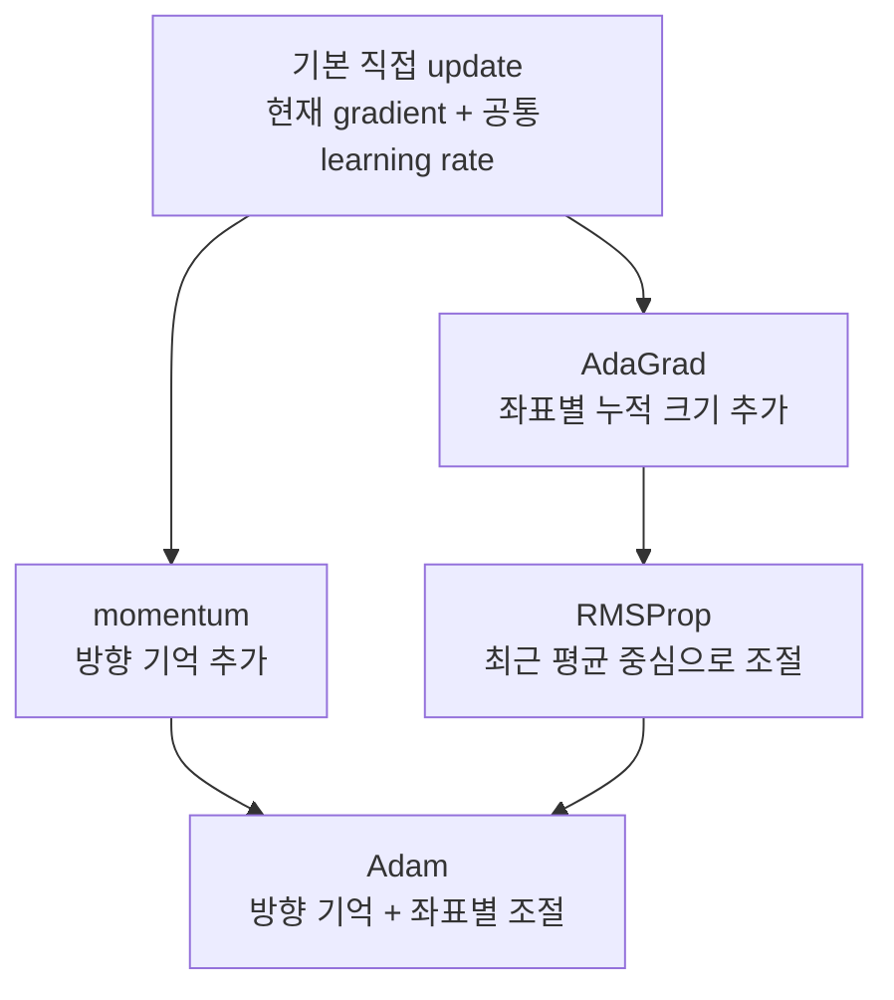
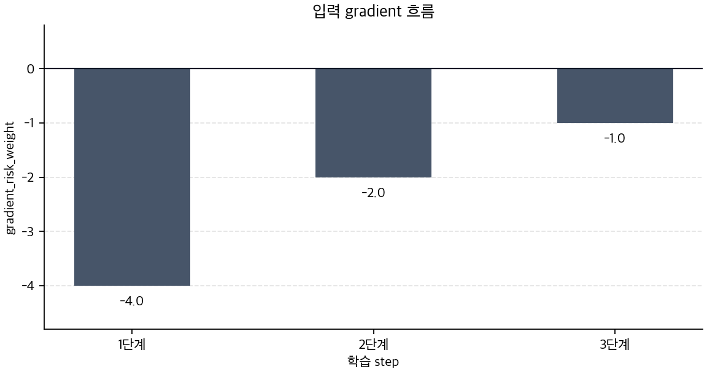
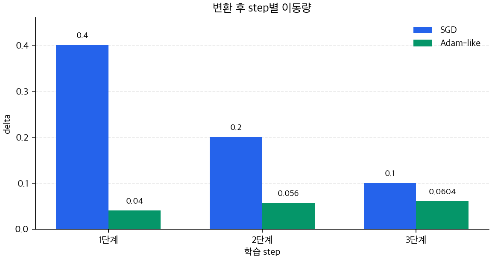
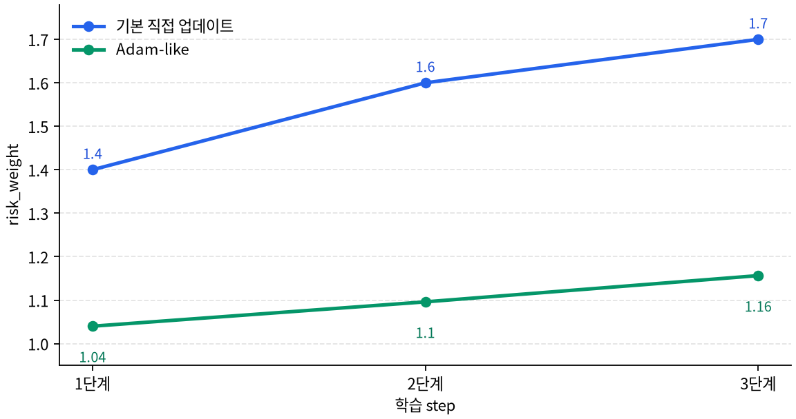

# P5-7.5 보충학습: 대표 optimizer 계열

> Section ID: `P5-7.5`
> Version: `v2026.07.31`

P5-7.3에서는 적응형 업데이트(adaptive update)의 직관을 Adam(Adaptive Moment Estimation)을 예로 보았습니다. 여기서 한 걸음 더 가면 독자는 momentum, AdaGrad, RMSProp, Adam처럼 여러 optimizer 계열을 만나게 됩니다. 이 이름들을 서로 다른 브랜드처럼 외우기 시작하면 오히려 핵심이 흐려집니다.
이 절의 구분 기준은 뒤에서 다른 optimizer 이름이 다시 나오더라도, 매번 새 알고리즘처럼 외우지 않고 같은 질문으로 정리하게 도와줍니다.

이 절에서 먼저 잡아야 할 질문은 `어느 optimizer가 더 유명한가`가 아니라, `각 optimizer가 현재 gradient 외에 무엇을 더 기억하고 무엇을 더 조절하려 하는가`입니다.

초심자에게 이 절이 낯선 이유는 이름이 많아서가 아니라, 비교 기준이 한 번에 보이지 않기 때문입니다. 그래서 아래 설명은 네 알고리즘을 따로 외우게 하기보다, 같은 질문을 네 번 반복하게 만드는 방향으로 읽는 편이 낫습니다.

## optimizer 이름을 비교하는 질문

- momentum은 현재 gradient 외에 무엇을 더 남기려 하는가?
- AdaGrad와 RMSProp은 좌표별 조절을 어떤 감각으로 읽어야 하는가?
- Adam은 왜 `momentum + adaptive scale`이 함께 언급되는가?
- optimizer 계열 비교를 절대 우열표가 아니라 구조 비교표로 바꿀 수 있는가?

이 절에서는 optimizer 계열의 구조를 설명하는 데 집중합니다. 여기서의 목표는 각 알고리즘의 전체 수식을 외우는 것이 아니라, `무엇을 더 기억하는가`, `무엇을 더 조절하는가`, `무엇을 해결하려 했는가`라는 세 질문으로 계열 차이를 이해하는 것입니다.

## momentum과 적응형 축의 판단 기준

- momentum, AdaGrad, RMSProp, Adam을 같은 층위에서 비교할 수 있습니다.
- `시간축 누적`과 `좌표축 조절`이 어떤 optimizer에서 더 중심적인지 설명할 수 있습니다.
- Adam을 `adaptive optimizer의 대표 예`로 보되, 앞 계열과 어떤 연결 위에 있는지 말할 수 있습니다.
- optimizer 계열을 어떤 질문 순서로 구분해야 하는지 설명할 수 있습니다.

## 이름보다 먼저 봐야 하는 축

optimizer 이름이 많아 보이는 이유는, 모두 `gradient를 실제 update로 바꾸는 규칙`이지만 그 규칙에 추가하는 기억과 조절 방식이 다르기 때문입니다. 이 절에서는 다음 세 축으로 읽으면 충분합니다.

| 먼저 볼 축 | 질문 | 예시 |
| --- | --- | --- |
| 무엇을 더 기억하는가 | 현재 gradient만 보는가, 최근 이동 방향도 남기는가, 제곱 gradient 크기도 남기는가 | momentum, Adam |
| 무엇을 더 조절하는가 | 모든 좌표를 같은 기준으로 움직이는가, 좌표마다 보폭을 다르게 조절하는가 | AdaGrad, RMSProp, Adam |
| 무엇을 해결하려 했는가 | 진동, 느린 진행, 희소 feature, 좌표별 스케일 차이 중 무엇을 먼저 완화하려 했는가 | momentum, AdaGrad |

이 세 축이 먼저 잡히면 optimizer 이름은 길어 보여도 흐릿하지 않습니다. 이름이 늘어날수록 오히려 `무엇을 더 기억하고 무엇을 더 조절하는가`를 반복해서 물으면 됩니다.

이 지점이 중요한 이유는, 초심자가 optimizer 이름을 처음 접할 때 가장 쉬운 오해가 `이름이 다르면 전혀 다른 학습 원리인가`라고 느끼는 것이기 때문입니다. 하지만 실제로는 대부분이 같은 큰 틀 위에 서 있습니다. 모두 gradient를 update로 바꾸는 규칙이고, 차이는 그 규칙에 어떤 보조 기억을 추가했는지, 어떤 좌표별 조절을 허용했는지, 어떤 불편을 먼저 줄이려 했는지에 있습니다.

즉, 지금 필요한 것은 이름의 계보를 외우는 일이 아니라 `기준선에서 무엇이 하나씩 추가되는가`를 읽는 일입니다. 이 관점이 잡히면 optimizer 이름이 늘어도 독자는 매번 처음부터 다시 배우는 느낌을 덜 받게 됩니다. `기본 직접 update에 방향 기억이 추가되면 momentum`, `좌표별 누적 크기 조절이 추가되면 AdaGrad류`, `그 둘이 함께 들어오면 Adam류`처럼 점진적으로 읽을 수 있기 때문입니다.

### 네 optimizer를 한 줄씩 먼저 잡기

아직 본문이 길게 느껴진다면, 먼저 아래 네 줄만 붙잡고 시작해도 됩니다.

| 이름 | 가장 짧게 잡은 한 줄 |
| --- | --- |
| momentum | 현재 gradient에 최근 이동 방향을 조금 섞는다 |
| AdaGrad | 좌표별로 얼마나 자주 크게 반응했는지를 누적해 본다 |
| RMSProp | 좌표별 누적은 보되, 오래된 기록을 무한히 같은 무게로 두지 않는다 |
| Adam | 방향 기억과 좌표별 조절을 함께 쓴다 |

이 네 줄이 머릿속에 들어오면, 뒤의 긴 문단은 전혀 새로운 내용을 추가한다기보다 각 한 줄을 더 풀어 설명하는 것으로 읽히게 됩니다.

위 구조를 `기준선에서 무엇이 추가되는가`의 흐름으로 다시 그리면 다음과 같습니다.

## momentum은 왜 따로 불리는가

momentum은 가장 단순한 직접 update 위에 `이전 이동 방향`을 조금 남기려는 생각을 더한 것입니다. 지금 gradient만 보고 한 걸음 내딛는 대신, 최근 step에서 어느 방향으로 계속 움직이고 있었는지도 일부 반영합니다.

이 직관은 경사가 한쪽으로 계속 이어질 때는 더 꾸준히 전진하게 만들고, 방향이 좌우로 흔들릴 때는 매 step의 즉각적 진동을 조금 눌러 주는 쪽으로 작동합니다.

이 설명이 추상적으로 느껴지면, 경사가 긴 골짜기를 따라 내려가는데 바닥이 울퉁불퉁한 장면을 떠올리면 됩니다. 현재 gradient만 바로 반영하면 발을 디딜 때마다 왼쪽, 오른쪽으로 조금씩 흔들리며 움직일 수 있습니다. 하지만 직전까지 어느 방향으로 이동하고 있었는지를 조금 남기면, 매번 새로 방향을 정하는 대신 `대체로 이쪽으로 가고 있었다`는 흐름을 이어 가게 됩니다. momentum은 바로 이 감각을 수식으로 만든 장치라고 읽으면 됩니다.

그래서 momentum을 이해할 때는 `더 복잡한 optimizer`라고 생각하기보다, `현재 gradient에 짧은 관성을 더한 방식`이라고 보는 편이 더 정확합니다. 이 한 문장이 잡히면 momentum은 갑자기 새로운 세계가 아니라, 기본 직접 update의 아주 자연스러운 확장처럼 보입니다.

아주 작은 장면으로 바꾸면 더 직관적입니다. 어떤 step에서는 gradient가 왼쪽을 가리키고, 다음 step에서는 거의 같은 크기로 오른쪽을 가리키며, 그다음 step에서는 다시 왼쪽을 가리킨다고 해 보겠습니다. 현재 gradient만 바로 반영하면 update도 왼쪽, 오른쪽, 왼쪽으로 바로 흔들립니다. 하지만 momentum은 직전까지의 이동 방향을 조금 남기므로, 이 흔들림을 그대로 다 받아 적지 않고 `전체적으로는 어느 쪽으로 가고 있었는가`를 함께 봅니다. 이 작은 장면 하나만 떠올려도 `왜 방향 기억이 필요하다는 말이 나오는가`가 훨씬 덜 추상적으로 읽힙니다.

한 문장으로 줄이면 다음과 같습니다.

`momentum은 현재 gradient에 이전 이동 관성을 조금 섞어, 더 매끈한 진행을 만들려는 방식이다.`

### 아주 작은 수치 예시. direct update와 momentum의 차이

아래 숫자는 진짜 전체 optimizer 구현이 아니라, `방향 기억이 붙으면 무엇이 달라지는가`만 보기 위한 작은 예시입니다.

| step | 현재 gradient | direct update라면 바로 반응한 이동 | momentum 관점에서 기대할 변화 |
| --- | --- | --- | --- |
| 1 | `-2.0` | 왼쪽으로 크게 이동 | 최근 흐름도 아직 왼쪽이라 거의 비슷하게 시작 |
| 2 | `+1.8` | 바로 오른쪽으로 크게 반전 | 직전 왼쪽 흐름이 남아 완전한 급반전이 조금 완화됨 |
| 3 | `-1.9` | 다시 왼쪽으로 급반전 | 최근 방향 기억 때문에 흔들림이 일부 눌림 |

이 표에서 중요한 것은 정확한 공식값이 아니라 읽는 감각입니다. direct update는 `지금 gradient`를 바로 옮기기 때문에 방향이 자주 바뀌면 이동도 즉시 흔들립니다. 반면 momentum은 `직전까지 어디로 가고 있었는가`를 조금 남기기 때문에, 같은 숫자 흐름을 봐도 덜 들쭉날쭉하게 읽힙니다.

## AdaGrad와 RMSProp은 무엇을 바꾸려 하는가

AdaGrad는 좌표별로 gradient가 얼마나 많이 누적됐는지를 따로 봅니다. 어떤 좌표는 자주 큰 gradient를 받고, 어떤 좌표는 드물게 작게 반응할 수 있습니다. AdaGrad는 이런 차이를 보고 좌표마다 update 크기를 다르게 조절하려 합니다.

이 감각만 붙잡으면 충분합니다.

- 자주 크게 반응한 좌표는 점점 더 보수적으로 움직입니다.
- 드물게 나타나는 좌표는 상대적으로 덜 묻히게 하려 합니다.

다만 AdaGrad는 누적값이 계속 커지기 때문에, 시간이 길어질수록 보폭이 지나치게 줄어드는 문제가 생길 수 있습니다.

이 대목에서 독자가 실제로 붙잡아야 할 감각은 `모든 파라미터가 항상 같은 종류의 문제를 겪는 것은 아니다`라는 점입니다. 어떤 좌표는 이미 충분히 많이 업데이트되었고, 어떤 좌표는 아직 거의 학습 신호를 받지 못했을 수 있습니다. AdaGrad는 바로 이런 차이를 인정하고, 좌표마다 서로 다른 보폭이 필요할 수 있다고 보는 쪽에 가깝습니다.

따라서 AdaGrad를 이해할 때는 `학습률을 자동으로 정해 준다`고 단순화하기보다, `좌표별로 지금까지 얼마나 자주 크게 반응했는지를 본다`는 문장으로 잡는 편이 더 낫습니다. 이 문장이 있어야 뒤에서 RMSProp과 Adam으로 이어질 때도 `왜 좌표별 기록이 필요한가`가 계속 이어집니다.

이 점을 작은 장면으로 다시 보면 다음과 같습니다. 한 모델 안에 `risk_weight`와 `rare_signal_weight`가 있다고 하겠습니다. `risk_weight`는 거의 모든 batch에서 큰 gradient를 받아 자주 움직이고, `rare_signal_weight`는 드문 경우에만 신호를 받습니다. 모든 좌표를 같은 보폭으로만 움직이면, 자주 등장하는 좌표는 계속 크게 흔들리고 드물게 등장하는 좌표는 충분히 배우지 못할 수 있습니다. AdaGrad는 바로 이런 장면에서 `둘을 정말 같은 기준으로 움직여야 하는가`라는 질문을 꺼내는 방식이라고 읽으면 됩니다.

RMSProp은 바로 이 지점에서 나옵니다. AdaGrad처럼 좌표별 gradient 크기를 보되, 과거 전체를 끝없이 누적하기보다 최근 흐름 중심의 평균으로 바꾸어, 보폭이 너무 빨리 작아지는 문제를 완화하려 합니다.

즉, AdaGrad와 RMSProp은 모두 `좌표별 조절` 축에 서 있지만, RMSProp은 그 조절을 더 실용적인 시간 감각으로 다듬으려는 방식이라고 읽으면 됩니다.

여기서 `더 실용적인 시간 감각`이라는 표현을 조금 더 풀면 다음과 같습니다. AdaGrad는 과거 전체를 계속 기억하기 때문에, 아주 초반에 크게 반응한 기록도 끝까지 강하게 남습니다. 반면 RMSProp은 오래된 기록을 영구히 같은 무게로 들고 가기보다, 최근의 반응을 더 중요하게 보는 쪽에 가깝습니다. 그래서 `좌표별 조절`이라는 아이디어는 유지하면서도, 학습이 너무 빨리 움츠러드는 문제를 덜어 내려 합니다.

### 아주 작은 수치 예시. AdaGrad와 RMSProp을 어떻게 다르게 읽는가

한 좌표의 gradient 크기가 `4.0 -> 4.0 -> 4.0`처럼 계속 크게 들어온다고 해 보겠습니다.

| step | AdaGrad 식으로 읽는 감각 | RMSProp 식으로 읽는 감각 |
| --- | --- | --- |
| 1 | 누적이 시작되어 보폭이 줄기 시작함 | 최근 평균이 커져 보폭이 줄기 시작함 |
| 2 | 누적이 더 커져 이전보다 더 보수적으로 읽힘 | 최근 평균 기준으로 조절되지만 오래된 값이 무한히 쌓이지는 않음 |
| 3 | 계속 누적되어 보폭이 더 작아질 수 있음 | 여전히 조절하지만 `과거 전체 영구 누적`보다는 최근 흐름을 더 반영함 |

이 표는 두 optimizer의 정확한 계산을 대신하려는 것이 아닙니다. 초심자 기준에서는 `AdaGrad는 계속 누적하는 쪽`, `RMSProp은 최근 평균 중심으로 조절하는 쪽`이라는 차이만 눈에 들어오면 충분합니다.

## Adam은 왜 두 축이 함께 언급되는가

Adam은 optimizer 계열 비교에서 자주 마지막에 등장합니다. 이유는 단순히 최신 이름이어서가 아니라, 앞에서 본 두 축이 함께 들어가기 때문입니다.

- momentum 쪽에서 보던 `최근 gradient 흐름`을 남깁니다.
- AdaGrad/RMSProp 쪽에서 보던 `좌표별 gradient 크기 조절`도 함께 사용합니다.

그래서 Adam을 이해할 때는 새 이름 하나로 외우기보다, 다음 문장으로 묶는 편이 훨씬 안전합니다.

`Adam은 최근 방향 누적과 좌표별 적응 조절을 함께 쓰는 대표적 adaptive optimizer이다.`

이 문장을 기준으로 보면 Adam은 갑자기 떨어진 낯선 이름이 아니라, 앞 계열의 아이디어가 한데 모인 대표 예처럼 읽힙니다.

이 설명이 중요한 이유는, Adam이 실무에서 자주 보인다는 사실 때문에 초심자가 Adam을 `기본값이라서 그냥 쓰는 것`처럼 받아들이기 쉽기 때문입니다. 하지만 지금 절에서 붙잡아야 할 것은 유행이 아니라 구조입니다. Adam이 자주 언급되는 까닭은 이름이 유명해서가 아니라, `방향 누적`과 `좌표별 조절`을 함께 갖춘 대표 예이기 때문입니다.

즉, Adam을 이해하려면 Adam만 따로 떼어 외우기보다 `momentum에서 본 것`, `RMSProp/AdaGrad에서 본 것`이 어떻게 한 자리에서 만나는지를 보는 편이 더 낫습니다. 이 연결이 보이면 Adam은 외워야 할 새 브랜드가 아니라, 앞에서 쌓아 온 질문들이 만나는 지점으로 읽힙니다.

이 문장을 실제 구분 순서로 바꾸면 더 쉽습니다. Adam을 만났을 때 바로 `유명한 optimizer다`로 정리하지 말고, 먼저 `방향 기억이 들어가 있는가`, 그다음 `좌표별 조절이 들어가 있는가`를 차례로 확인합니다. 두 질문에 모두 `그렇다`가 붙으면, Adam은 완전히 새로운 이름이라기보다 앞에서 본 두 줄기의 아이디어가 함께 들어간 예로 보입니다.

아래 그래프들을 함께 보면, `같은 gradient 흐름`이 있어도 직접 update와 Adam-like update가 왜 다른 이동량과 다른 경로를 만드는지 더 직접 보입니다.

이 첫 그래프는 세 step 동안 들어온 gradient 입력 자체를 보여 줍니다. 핵심은 입력 신호가 `-4.0 -> -2.0 -> -1.0`처럼 점점 작아진다는 점입니다. 즉, 두 방법의 차이는 입력이 달라서가 아니라, 이 입력을 해석하는 update 규칙이 다르기 때문에 생깁니다.

이 두 번째 그래프에서는 같은 입력 gradient를 받아도 직접 update는 learning rate를 곧바로 곱한 큰 이동량을 만들고, Adam-like는 최근 흐름과 좌표별 조절을 반영해 더 작은 이동량을 만들기 시작하는 장면이 보입니다. 초심자는 이 그래프를 `입력은 같아도 step 크기는 같지 않을 수 있다`는 확인 장치로 읽으면 충분합니다.

세 번째 그래프는 그 차이가 실제 파라미터 경로에서 어떻게 누적되는지 보여 줍니다. 직접 update는 `1.4 -> 1.6 -> 1.7`로 더 빠르게 움직이고, Adam-like는 `1.04 -> 1.10 -> 1.16`처럼 더 완만하게 이동합니다. 여기서 독자가 붙잡아야 할 핵심은 `어느 쪽이 절대적으로 더 좋다`가 아니라, optimizer 규칙이 같은 gradient history를 서로 다른 parameter path로 바꾼다는 점입니다.

## optimizer 계열을 구분하는 기준표

| optimizer | 무엇을 더 기억하는가 | 무엇을 더 조절하는가 | 무엇을 먼저 완화하려 했는가 |
| --- | --- | --- | --- |
| 기본 직접 update | 현재 gradient | 공통 learning rate | 가장 단순한 기준선 |
| momentum | 이전 이동 방향 | 공통 learning rate | 지그재그 진동 완화, 더 꾸준한 진행 |
| AdaGrad | 좌표별 gradient 누적 크기 | 좌표별 보폭 | 희소 feature, 좌표별 빈도 차이 |
| RMSProp | 최근 제곱 gradient 평균 | 좌표별 보폭 | AdaGrad의 과도한 보폭 축소 완화 |
| Adam | 최근 gradient 흐름 + 최근 제곱 gradient 흐름 | 좌표별 보폭 + 시간축 누적 | 빠른 적응, 실용적 안정성 |

이 표는 성능 순위를 말하지 않습니다. 이 표의 목적은 optimizer 이름을 읽을 때 `무엇을 더 기억하고 무엇을 더 조절하는가`를 바로 되묻도록 만드는 것입니다.

## 대표 optimizer 계열: 확인할 판단 기준

이 사례 절은 다음 질문으로 중심축을 확인한다.

- 오픈체크리스트의 중심축 문장인 "momentum, AdaGrad, RMSProp, Adam의 차이를 큰 그림에서 보충해야 합니다."를 본문 사례에서 어느 대목으로 확인할 수 있는가?
- 표, 코드, 도식, 체크리스트 중 어떤 장치가 이 판단을 다시 검토하게 만드는가?

### 사례. optimizer 이름이 연달아 나와도 질문은 세 개면 충분하다

논문, 강의, 라이브러리 문서를 보다 보면 `SGD with momentum`, `AdaGrad`, `RMSProp`, `Adam`이 한 줄에 나열되는 장면을 만납니다. 이때 이름을 순서대로 외우려 하면, 독자는 금방 `그래서 뭐가 더 좋다는 뜻인가`라는 질문으로 미끄러집니다.

하지만 입문 단계에서는 질문을 더 작게 나누는 편이 낫습니다.

1. 이 optimizer는 현재 gradient 외에 무엇을 더 기억하는가?
2. 모든 좌표를 같은 기준으로 움직이는가, 좌표마다 다르게 조절하는가?
3. 어떤 문제를 먼저 완화하려는가?

이 세 질문으로 다시 읽으면 다음처럼 정리됩니다.

| 이름을 봤을 때 | 바로 외우기 쉬운 오해 | 다시 보는 기준 |
| --- | --- | --- |
| momentum | 더 강한 optimizer 이름인가? | 이전 이동 방향을 남기는가? |
| AdaGrad | learning rate를 자동으로 대신해 주는가? | 좌표별 누적 크기를 보며 보폭을 나누는가? |
| RMSProp | AdaGrad의 다른 이름인가? | 누적을 최근 평균 중심으로 바꾸는가? |
| Adam | 그냥 가장 좋은 기본값인가? | 시간축 누적과 좌표축 조절을 함께 쓰는가? |

현재 절이 닫아야 하는 것은 `누가 제일 좋은가`가 아니라, `왜 optimizer 이름이 여러 개로 갈라졌는가`입니다. 갈라지는 이유는 모두 같은 gradient update 규칙 안에서, 추가로 기억하고 조절하는 방식이 다르기 때문입니다.

이 사례를 조금 더 풀어 보면, 초심자가 이름을 볼 때 생기는 혼란은 사실 알고리즘 개수가 많아서가 아니라 비교 기준이 없어서 생깁니다. 비교 기준이 없으면 `이건 저것보다 더 최신인가`, `이건 저것을 완전히 대체하는가`, `이건 실무용이고 저건 이론용인가` 같은 질문이 한꺼번에 섞입니다. 하지만 지금 절에서 만든 세 질문을 기준으로 읽으면, 이름이 많아도 사고 순서는 훨씬 단순해집니다.

예를 들어 momentum을 보면 먼저 `이전 방향을 남기는가`를 묻고, AdaGrad를 보면 `좌표별 누적 크기를 따로 보는가`를 묻고, Adam을 보면 `둘이 함께 들어오는가`를 묻습니다. 즉, 이름을 외우는 대신 질문의 자리를 고정하면 표와 문장을 읽는 부담이 크게 줄어듭니다.

## 연습 및 예제

다음 문장을 읽고 어떤 optimizer 계열 질문이 먼저 필요한지 붙여 봅니다.

| 문장 | 먼저 떠올릴 질문 | 우선 연결할 optimizer 계열 |
| --- | --- | --- |
| 경사는 대체로 같은 방향인데 좌우 진동이 심하다 | 이전 이동 방향을 조금 남기면 어떤가? | momentum |
| 어떤 feature는 거의 드물게 나타나는데, 그 좌표가 너무 약하게만 움직인다 | 좌표별 누적 크기를 따로 보면 어떤가? | AdaGrad |
| 좌표별 조절은 좋은데, 시간이 갈수록 보폭이 너무 작아진다 | 최근 평균 중심으로 누적을 바꾸면 어떤가? | RMSProp |
| 최근 흐름도 보고 좌표별 조절도 함께 하고 싶다 | 두 축을 함께 쓰는 adaptive update인가? | Adam |

이 연습의 목적은 이름 맞히기보다, optimizer 이름이 등장했을 때 먼저 어떤 질문을 던질지 익히는 것입니다.

## 체크리스트

- momentum을 `이전 이동 방향을 일부 남기는 방식`으로 설명할 수 있는가?
- AdaGrad와 RMSProp을 `좌표별 조절` 축에서 구분할 수 있는가?
- Adam을 `momentum + adaptive scale`이 함께 들어가는 대표 예로 설명할 수 있는가?
- optimizer 계열 비교를 `우열표`가 아니라 `기억 방식과 조절 방식`의 비교로 읽을 수 있는가?
- optimizer 계열을 볼 때 `무엇을 더 기억하는가`, `무엇을 더 조절하는가`, `무엇을 해결하려 했는가`를 먼저 물을 수 있는가?

## 출처와 참고 자료

- PyTorch, `torch.optim`, PyTorch documentation. PyTorch가 SGD, Adagrad, RMSprop, Adam 등 여러 optimizer를 제공하며 optimizer가 parameter와 state를 들고 업데이트를 수행하는 구조를 확인할 때 참고했다. 확인 날짜: 2026-07-19. [https://docs.pytorch.org/docs/stable/optim.html](https://docs.pytorch.org/docs/stable/optim.html){: target="_blank" rel="noopener noreferrer" }
- Diederik P. Kingma, Jimmy Ba, `Adam: A Method for Stochastic Optimization`, arXiv, 2014. Adam을 first moment와 second moment 추정에 기반한 adaptive optimizer로 설명하는 원 논문을 확인할 때 참고했다. 확인 날짜: 2026-07-19. [https://arxiv.org/abs/1412.6980](https://arxiv.org/abs/1412.6980){: target="_blank" rel="noopener noreferrer" }
- Sebastian Ruder, `An overview of gradient descent optimization algorithms`, arXiv, 2016. momentum, Adagrad, RMSProp, Adam 계열의 비교 관점을 확인할 때 참고했다. 확인 날짜: 2026-07-19. [https://arxiv.org/abs/1609.04747](https://arxiv.org/abs/1609.04747){: target="_blank" rel="noopener noreferrer" }
