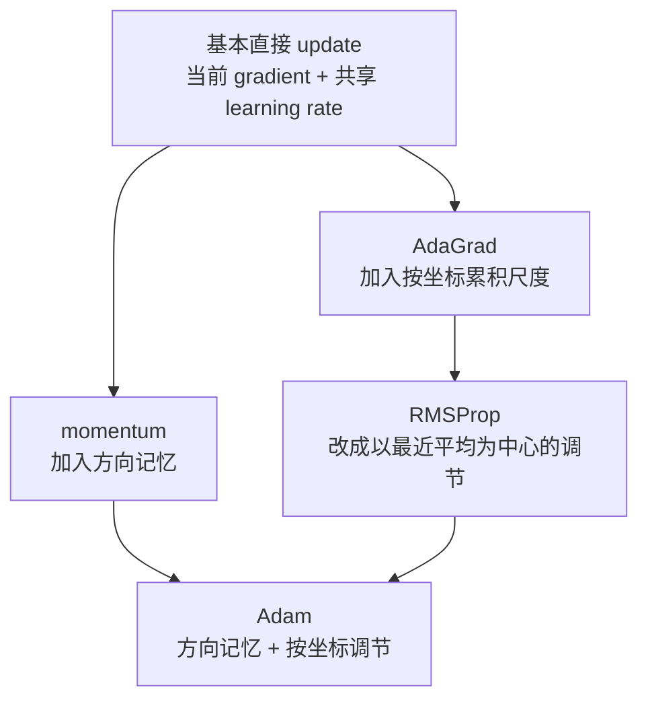

# P5-7.5 补充学习：代表性 optimizer 系列

> Section ID: `P5-7.5`
> Version: `v2026.07.26`

在 P5-7.3 里，我们已经用 Adam（Adaptive Moment Estimation）看过自适应 update 的直觉。再往前走一步，读者就会陆续遇到 momentum、AdaGrad、RMSProp、Adam 这些 optimizer 家族。若把这些名字当成不同品牌去背，反而会把真正的核心弄得模糊。
这一节的区分标准，是为了让读者以后即使再次遇到别的 optimizer 名字，也能继续用同一组问题去整理，而不是每次都把它们背成全新的算法。

这一节首先要抓住的问题，不是`哪个 optimizer 更有名`，而是`除了当前 gradient 之外，各 optimizer 还想多记住什么，又想多调什么。`

初学者会觉得这一节陌生，并不是因为名字多，而是因为比较标准一下子看不出来。所以更好的读法，不是把四个算法各自死记，而是让同一组问题重复问四遍。

## 比较 optimizer 名称的问题

- momentum 想在当前 gradient 之外额外保留什么？
- AdaGrad 与 RMSProp 的按坐标调节，应该用什么直觉来读？
- 为什么 Adam 常常会被说成 `momentum + adaptive scale`？
- 能不能把 optimizer 家族比较从绝对排名表，改成结构比较表？

这一节的重点，是解释 optimizer 家族的结构。这里的目标不是背完整公式，而是用三个问题去理解差异：`它多记了什么`、`它多调了什么`、`它最先想缓解什么问题。`

## momentum 与自适应轴的判断标准

- 能在同一层位比较 momentum、AdaGrad、RMSProp、Adam。
- 能说明：哪些 optimizer 更偏向`时间轴累积`，哪些更偏向`坐标轴调节`。
- 能把 Adam 看成`自适应 optimizer 的代表例子`，同时说明它建立在前面哪些想法之上。
- 能说出：阅读 optimizer 家族时，应该按什么问题顺序去区分。

## 在名字之前，先看三条轴

optimizer 名字看起来很多，是因为它们虽然都在做`把 gradient 变成真实 update 的规则`，但加进去的记忆和调节方式不一样。这一节里，先按下面三个轴去读就够了。

| 先看的轴 | 要问的问题 | 例子 |
| --- | --- | --- |
| 多记了什么 | 只看当前 gradient，还是也保留最近移动方向，或平方 gradient 的大小？ | momentum、Adam |
| 多调了什么 | 所有坐标都按同一标准走，还是会按坐标分别调步幅？ | AdaGrad、RMSProp、Adam |
| 最先想缓解什么 | 它首先想减弱的是振荡、慢速推进、稀疏特征，还是坐标尺度差异？ | momentum、AdaGrad |

只要这三条轴先固定住，optimizer 名字再多，也不容易变糊。名字越多，越是重复追问：`它多记了什么，又多调了什么？`

这一点很重要，因为初学者第一次看到 optimizer 名字时，最容易滑向一种误解：`名字不同，是不是学习原理也完全不同？` 但实际上，它们大多仍然站在同一个大框架上。它们都还是在把 gradient 变成 update，差别只在于：多加了什么辅助记忆，允许了什么按坐标调节，想先缓解什么不方便。

也就是说，现在需要的不是背名字谱系，而是读出：`在基准线之上，究竟是哪个东西被一项项加进去。` 只要这个视角先固定，optimizer 名字即使继续增加，读者也不会每次都像在重学一套完全新的东西。可以按渐进方式去读：`基本直接 update 上加方向记忆就是 momentum`，`再加按坐标累积尺度调节就是 AdaGrad 家族`，`两条线合在一起就形成 Adam 家族。`

### 先用一句话抓住四个 optimizer

如果正文仍然觉得长，先只抓住下面四行也够了。

| 名字 | 最短的一句话 |
| --- | --- |
| momentum | 在当前 gradient 里混入一点最近移动方向 |
| AdaGrad | 看每个坐标到现在为止有多频繁地强烈反应过 |
| RMSProp | 仍然看按坐标累积，但不会把很久以前的记录永远等权留下 |
| Adam | 同时使用方向记忆与按坐标调节 |

只要这四行先入脑，后面的长段落就不再像是在增加全新的内容，而更像是在把这四句一条条展开。

如果把上面的结构重新画成`在基准线上逐项增加什么`，大致会像下面这样。

## 为什么 momentum 会被单独叫出来

momentum 是在最简单的直接 update 之上，再加上一点`保留前一次移动方向`的想法。它不再只盯着当前 gradient 当场走一步，而会部分反映模型最近几步总体在朝哪个方向移动。

这个直觉的作用，一方面是在坡面大体同向时，让推进更持续；另一方面是在方向左右摇晃时，压下一部分逐步的即刻振荡。

如果这仍然抽象，可以想象自己正在沿着一条很长的谷底往下走，但地面本身坑坑洼洼。如果只看当前 gradient，每一步都可能稍微向左又向右晃。可如果保留一点之前的行进方向，就不会每次都从零决定，而是会延续一种`总体上一直在往这边走`的流向。momentum 就是把这种感觉写进 update 规则里。

所以更合适的理解，不是把 momentum 看成`更复杂的 optimizer`，而是看成`在当前 gradient 上加入一点短期惯性的方法。` 只要这句话先固定，momentum 就不再像突然出现的新世界，而更像是基本直接 update 的自然扩展。

如果把它压成一个很小的场景，会更直观。假设第 1 步 gradient 指向左边，第 2 步几乎同样大小地指向右边，第 3 步又重新指向左边。如果只立刻反映当前 gradient，那么 update 也会马上左、右、左地摇摆。但 momentum 会留下一点前面几步的方向，于是不会把这些晃动全盘照抄，而会一起看：`我们整体上最近一直在往哪边走？`

一句话压缩就是：

`momentum 是把前面的移动惯性少量混入当前 gradient，从而让推进更平滑的方法。`

### 一个很小的数字例子：direct update 与 momentum 的差别

下面这些数字，不是在重现完整 optimizer，只是为了看清：`只要方向记忆附着进来，什么会变。`

| step | 当前 gradient | 如果是 direct update，会立刻反映出的移动 | 从 momentum 视角期待看到的变化 |
| --- | --- | --- | --- |
| 1 | `-2.0` | 明显往左移动 | 最近流向也还是左，因此起步看起来几乎一样 |
| 2 | `+1.8` | 马上大幅反向往右 | 前一步的左向流还留着，所以完全反转会被稍微缓和 |
| 3 | `-1.9` | 再次猛地反向往左 | 因为保留了最近方向记忆，一部分摆动会被压下 |

这张表最重要的不是精确公式值，而是阅读直觉。direct update 会立刻翻译`当前 gradient`，所以只要方向常变，移动就会立刻跟着抖动。momentum 则会留下一点`刚才一直往哪边走`的记忆，所以同一串数字会被读成更不锯齿的运动。

## AdaGrad 与 RMSProp 想改变什么

AdaGrad 会分别去看每个坐标到目前为止积累了多少 gradient。有些坐标经常收到很大的 gradient，有些则只是偶尔小幅反应。AdaGrad 想根据这些差别，让各坐标得到不同大小的 update。

先抓住下面这个感觉就够了。

- 经常大幅反应过的坐标，会逐渐变得更保守
- 很少出现的坐标，则尽量不要让它一直被淹没

不过 AdaGrad 的累积会一直长大，所以随着时间拉长，步幅可能会缩得太快、太小。

读者真正要留下来的直觉，是：`不是所有参数都在面对同一种问题。` 有些坐标可能已经被改过很多次，有些坐标则几乎还没真正收到足够学习信号。AdaGrad 更接近于承认这种差异，并由此发问：不同坐标是不是应该允许不同步幅？

所以理解 AdaGrad 时，与其把它简化成`会自动帮你决定 learning rate`，不如抓成一句更准确的话：`它会看每个坐标到目前为止有多频繁地强烈反应过。` 正是这句，能把后面的 RMSProp 与 Adam 继续自然接上。

如果换成一个小场景来想，假设模型里有 `risk_weight` 和 `rare_signal_weight` 两个坐标。`risk_weight` 几乎每个 batch 都会收到大 gradient，经常被更新；而 `rare_signal_weight` 则只有在少数稀有情况里才会收到信号。如果把所有坐标都只按同一标准步幅去推，那么前者可能一直大幅晃动，而后者则可能永远学得不够。AdaGrad 就是在这种场景里开始问：`这两个坐标真的该被同一把尺子量吗？`

RMSProp 则正是在这一点上长出来的。它和 AdaGrad 一样，会看按坐标的 gradient 尺度，但不会把整个历史永远等权地往后累加，而是更偏向用最近平均来调节，以减轻步幅过快收缩的问题。

所以 AdaGrad 与 RMSProp 都站在`按坐标调节`这条轴上，只不过 RMSProp 会把这种调节改写成更强调近期时间感的形式。

如果把`更强调近期时间感`这句话再展开一点，就会更清楚。AdaGrad 会一直记住整个过去，因此很早以前的一次大反应，也会一直强烈地留到最后。而 RMSProp 更像是在说：不要永远用同样的重量扛着整个过去，最近的反应更重要。它保留了`按坐标调节`这条主意，但试图避免学习太快缩成小步不动。

### 一个很小的数字例子：怎样区分 AdaGrad 与 RMSProp

假设某个坐标的 gradient 规模连续以 `4.0 -> 4.0 -> 4.0` 的形式进入。

| step | 用 AdaGrad 的方式来读的感觉 | 用 RMSProp 的方式来读的感觉 |
| --- | --- | --- |
| 1 | 累积刚开始，步幅开始变小 | 最近平均增大，步幅开始变小 |
| 2 | 累积继续变大，因此比刚才更保守 | 仍会按最近平均调节，但不会把旧值永远等权累加 |
| 3 | 因为一直累积，步幅还可能进一步缩小 | 仍会调节，但不会像 AdaGrad 那样把整个过去永久累积 |

这张表不是要替代精确计算。对于入门读者来说，能抓住`AdaGrad 更偏向一直累积`，而 `RMSProp 更偏向围绕最近平均来调节`，就已经足够。

## 为什么 Adam 会被说成把两条轴放在了一起

Adam 经常出现在 optimizer 家族比较的最后。原因并不只是它更新，而是因为前面讲过的两条轴，会在它这里同时出现。

- 它保留了 momentum 那边在看的`最近 gradient 流向`
- 它也保留了 AdaGrad / RMSProp 那边在看的`按坐标调节 gradient 尺度`

所以理解 Adam 时，比起把它背成一个孤立的新名字，更安全的做法是先用下面这句话绑起来。

`Adam 是一个代表性的 adaptive optimizer，它会同时使用最近方向累积与按坐标自适应调节。`

只要用这句话作为标准，Adam 就不再像是从天而降的奇怪名字，而更像是前面几条思路在一处汇合的代表例子。

这个解释之所以重要，是因为 Adam 在实务里太常出现，以至于初学者很容易直接把它读成`大家默认就用这个。` 但本节真正要留下来的不是流行，而是结构。Adam 常被提起，不是因为它名字响，而是因为它正好把`方向累积`和`按坐标调节`两条线同时装进了一个代表例子里。

也就是说，要理解 Adam，更好的方法不是只背 Adam 自己，而是看：`在 momentum 里看到的东西`与`在 AdaGrad / RMSProp 里看到的东西`怎样在它身上重新相遇。只要这个连接被看见，Adam 就会从一个需要死记的品牌，变成前面几个问题自然相交的位置。

如果把这句话改成真正的阅读顺序，就更简单了。遇到 Adam 时，不要一开始就总结成`著名 optimizer`，而要先问：`它有没有方向记忆？` 再问：`它有没有按坐标调节？` 如果两个答案都是否定不了，那么 Adam 就更像是前面两条思路共同进入的例子，而不是一套完全割裂的新名字。

下面几张图会更直接地展示：为什么即使是`同一条 gradient 流`，direct update 与 Adam-like 也会做出不同移动量、不同参数路径。

第一张图展示的，还只是输入本身。关键在于，这条信号会随着 step 推进变成 `-4.0 -> -2.0 -> -1.0`，绝对值越来越小。也就是说，两个方法的差别并不是来自输入不同，而是来自：它们用不同的 update 规则去解释同样的输入。

第二张图里差别开始显现。direct update 会立刻把当前 gradient 与 learning rate 相乘，所以第一步就移动得比较大；Adam-like 则会把最近流向与按坐标调节都考虑进去，因此同样的输入会被翻译成更小、更平滑的移动量。对初学者来说，这张图最大的作用，就是确认：`输入相同，step 大小也不一定相同。`

第三张图说明：这种差异最终会累积成不同参数路径。direct update 会更快地移动到 `1.7`，而 Adam-like 则会更缓地到达 `1.156`。这里真正要固定的，不是`哪边绝对更好`，而是：optimizer 规则会把同一条 gradient history 改写成不同 parameter path。

## 区分 optimizer 家族的基准表

| optimizer | 多记了什么 | 多调了什么 | 最先想缓解什么 |
| --- | --- | --- | --- |
| 基本 direct update | 当前 gradient | 共享 learning rate | 最简单的基准线 |
| momentum | 前一步移动方向 | 共享 learning rate | 左右来回振荡、推进不连续 |
| AdaGrad | 按坐标累积的 gradient 大小 | 按坐标步幅 | 稀疏特征、坐标出现频率差异 |
| RMSProp | 最近平方 gradient 的平均 | 按坐标步幅 | 缓解 AdaGrad 步幅缩得太快 |
| Adam | 最近 gradient 流 + 最近平方 gradient 流 | 按坐标步幅 + 时间轴累积 | 快速适应、实务上的稳定性 |

这张表并不是性能排名表。它的目的，是让读者看到 optimizer 名字时，能立刻反问：`它多记了什么、多调了什么？`

## 案例与示例

### 案例. 就算 optimizer 名字连续出现，问题也只需要三条

在论文、课程、库文档里，经常会看到 `SGD with momentum`、`AdaGrad`、`RMSProp`、`Adam` 在一行里连着出现。若试图把它们按名字顺序背下来，读者很快就会滑向一个问题：`所以到底哪个更强？`

但在入门阶段，更好的方法是把问题拆小。

1. 除了当前 gradient，这个 optimizer 还多记了什么？
2. 所有坐标都按同一标准走，还是按坐标分别调？
3. 它最先想缓解的麻烦是什么？

只要用这三条问题重新读，就会变成下面这样。

| 看到这个名字时 | 最容易马上背出的误解 | 重新看的基准 |
| --- | --- | --- |
| momentum | 这是更强的 optimizer 名字吗？ | 它有没有保留前一步移动方向？ |
| AdaGrad | 它是不是自动代替了 learning rate？ | 它有没有按坐标累积大小去拆步幅？ |
| RMSProp | 它只是 AdaGrad 的另一个名字吗？ | 它有没有把累积改成最近平均为中心？ |
| Adam | 它只是最好的默认值吗？ | 它有没有同时带着时间轴累积与按坐标调节？ |

本节真正要闭合的，不是`谁最好`，而是`为什么 optimizer 的名字会分成这么多家族。` 它们之所以分开，是因为在同样把 gradient 变成 update 的规则里，额外记住与调节的方式不一样。

如果再把这个案例展开一点，初学者感到混乱，并不是因为算法真的太多，而是因为缺少比较标准。没有标准时，就会把`是不是更新`、`是不是替代谁`、`是不是实务用而不是理论用`这些问题全部混成一团。但只要按本节做出的三条问题来读，即使名字增多，思考顺序也还是简单的。

## 练习与例子

读下面这些句子，先给它们贴上：此时最需要哪一类 optimizer 问题。

| 句子 | 先想到的问题 | 先连接到的 optimizer 家族 |
| --- | --- | --- |
| 坡度大体都朝同一边，但左右振荡很强 | 如果保留一点前面的移动方向，会不会更稳？ | momentum |
| 某些特征几乎只偶尔出现，这些坐标动得太弱 | 如果分别看按坐标累积大小，会怎样？ | AdaGrad |
| 按坐标调节是好的，但时间越久步幅越缩得太厉害 | 如果改成围绕最近平均来累积，会怎样？ | RMSProp |
| 想同时看最近流向，也想按坐标分别调节 | 这是不是把两条轴一起用上的 adaptive update？ | Adam |

这个练习的目的，不是做名字配对题，而是训练自己在看到 optimizer 名字时，先提出什么问题。

## 检查清单

- 能把 momentum 解释成`保留一部分前面移动方向的方法`吗？
- 能在`按坐标调节`这条轴上区分 AdaGrad 与 RMSProp 吗？
- 能把 Adam 解释成`momentum + adaptive scale`合在一起的代表例子吗？
- 能把 optimizer 家族比较读成`记忆方式与调节方式的比较`，而不是优劣排名吗？
- 当再看到别的 optimizer 家族时，能先问：`它多记了什么、多调了什么、最先想缓解什么？`

## 来源与参考资料

- PyTorch, `torch.optim`, PyTorch documentation. 用于确认 PyTorch 提供 SGD、Adagrad、RMSprop、Adam 等多个 optimizer，并确认 optimizer 持有 parameter 与 state 来执行 update 的结构。确认日期：2026-07-19. [https://docs.pytorch.org/docs/stable/optim.html](https://docs.pytorch.org/docs/stable/optim.html){: target="_blank" rel="noopener noreferrer" }
- Diederik P. Kingma, Jimmy Ba, `Adam: A Method for Stochastic Optimization`, arXiv, 2014. 用于确认 Adam 原论文中把 Adam 说明为基于 first moment 与 second moment 估计的 adaptive optimizer。确认日期：2026-07-19. [https://arxiv.org/abs/1412.6980](https://arxiv.org/abs/1412.6980){: target="_blank" rel="noopener noreferrer" }
- Sebastian Ruder, `An overview of gradient descent optimization algorithms`, arXiv, 2016. 用于确认 momentum、Adagrad、RMSProp、Adam 系列的比较视角。确认日期：2026-07-19. [https://arxiv.org/abs/1609.04747](https://arxiv.org/abs/1609.04747){: target="_blank" rel="noopener noreferrer" }
