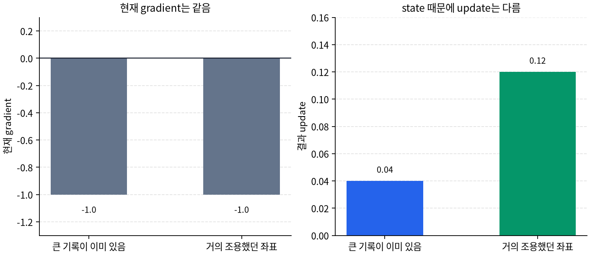

# P5-7.7 보충학습: optimizer state와 개별 update

> Section ID: `P5-7.7`
> Version: `v2026.07.31`

P5-7.3에서 적응형 업데이트를 볼 때 `최근 gradient 흐름`, `좌표별 조절`이라는 표현이 반복해서 나왔습니다. 여기서 자연스럽게 남는 질문은 이것입니다. 그런 정보는 어디에 남고, 왜 같은 gradient라도 다음 step의 update가 달라질 수 있는가?

이 질문에 답하려면 parameter, gradient, update, optimizer state를 서로 다른 것으로 구분해야 합니다.
이 구분은 뒤에서 checkpoint 저장, 학습 재시작, optimizer 교체, fine-tuning 설정을 볼 때도 계속 쓰이게 됩니다.

초심자에게 이 절이 압축적으로 느껴지는 이유는, 네 단어가 모두 비슷한 숫자처럼 보이기 때문입니다. 실제 코드에서도 이 값들이 비슷한 줄 안에서 함께 등장하므로, 처음에는 거의 같은 것을 다른 이름으로 부르는 것처럼 느끼기 쉽습니다.

## optimizer state가 update를 바꾸는 질문

- parameter, gradient, update, optimizer state는 각각 무엇인가?
- optimizer state는 왜 모델 파라미터와 다른가?
- parameter-wise update라는 말은 무엇이 좌표별로 따로 유지된다는 뜻인가?
- adaptive optimizer가 왜 `현재 gradient 하나`보다 `누적된 내부 상태`를 더 함께 보게 되는가?

이 절에서는 라이브러리 구현 세부보다 `optimizer가 무엇을 따로 기억하고 있는가`를 설명하는 데 집중합니다.

## parameter-wise 상태와 적용 단위의 판단 기준

- parameter, gradient, update, optimizer state를 구분할 수 있습니다.
- optimizer state가 좌표별로 따로 유지될 수 있다는 점을 설명할 수 있습니다.
- 같은 gradient라도 state가 다르면 다음 update가 달라질 수 있다는 점을 말할 수 있습니다.
- adaptive optimizer의 `adaptive`가 내부 상태 누적과 연결된다는 점을 설명할 수 있습니다.

## 네 가지를 먼저 분리해야 한다

| 항목 | 무엇인가 | 언제 바뀌는가 |
| --- | --- | --- |
| parameter | 모델이 실제로 들고 있는 가중치 값 | optimizer가 update를 반영할 때 |
| gradient | 현재 parameter에서 계산된 방향 신호 | backward를 수행할 때 |
| update | 이번 step에 parameter에 적용할 이동량 | optimizer가 gradient와 state를 읽을 때 |
| optimizer state | optimizer가 다음 step을 위해 들고 있는 내부 기억 | 각 step 뒤에 함께 갱신될 수 있음 |

이 표를 한 문장으로 묶으면 다음과 같습니다.

`gradient는 신호이고, update는 이동량이며, parameter는 실제 값이고, optimizer state는 다음 이동을 위해 남겨 두는 기억이다.`

이 한 문장이 중요한 이유는, 초심자가 학습 코드나 설명 문장을 볼 때 이 네 가지를 거의 같은 대상으로 느끼기 쉽기 때문입니다. 특히 `gradient가 계산됐다`, `optimizer가 돌았다`, `모델이 업데이트됐다` 같은 표현을 연달아 보면, 모두 비슷한 말처럼 보이기도 합니다. 하지만 실제로는 서로 다른 층위입니다. gradient는 지금 위치에서의 신호이고, update는 그 신호를 받아 이번 step에서 실제로 적용할 이동량이며, parameter는 그 이동량이 반영된 결과이고, optimizer state는 다음 step을 위해 따로 남겨 두는 내부 기억입니다.

이 구분이 머릿속에 자리 잡아야 adaptive optimizer를 읽을 때도 혼동이 줄어듭니다. 그래야 `Adam은 state를 더 많이 갖는다`, `parameter-wise update를 한다`, `같은 gradient라도 update가 달라진다` 같은 문장이 서로 자연스럽게 이어집니다.

### 학습 코드 세 줄을 어떻게 나누어 읽는가

초심자는 아래 세 문장을 거의 같은 사건처럼 읽기 쉽습니다.

| 코드나 설명에서 보이는 말 | 실제로 일어난 일 |
| --- | --- |
| gradient를 계산했다 | 현재 위치에서 어느 방향이 좋은지 신호를 구했다 |
| optimizer가 step했다 | 그 신호와 state를 이용해 이번 이동량을 만들고 반영했다 |
| 모델이 업데이트됐다 | parameter 값 자체가 바뀌었다 |

이 표를 먼저 두면 `gradient가 계산됐다`와 `parameter가 바뀌었다` 사이에 optimizer와 update가 끼어 있다는 사실이 더 선명해집니다.

도식으로 압축하면, 같은 학습 루프 안에서도 네 항목은 다음처럼 서로 다른 자리를 차지합니다.

```mermaid
--8<-- "assets/part-05/chapter-07/optimizer-loop-flow-ko.mmd"
```

이 도식에서 현재 절에 특히 중요한 구간은 `gradient 계산 -> optimizer -> 파라미터 반영`입니다. optimizer state는 바로 이 가운데에서 `이번 신호를 어떤 이동량으로 바꿀까`를 돕는 내부 기억으로 읽으면 됩니다.

## optimizer state는 왜 따로 필요한가

기본 직접 update라면 현재 gradient와 learning rate만으로도 update를 만들 수 있습니다. 하지만 momentum, RMSProp, Adam처럼 최근 흐름이나 좌표별 크기를 반영하려면, 이전 step의 정보를 어딘가에 남겨 두어야 합니다. 그 역할을 하는 것이 optimizer state입니다.

예를 들어 다음과 같은 값들이 state에 해당합니다.

- 이전 이동 방향의 누적값
- 좌표별 제곱 gradient 평균
- step 수나 bias correction에 필요한 보조 정보

즉, optimizer state는 모델이 세상을 표현하는 지식이 아니라, optimizer가 `다음 이동을 어떻게 만들지`를 위해 들고 있는 작업 메모에 가깝습니다.

이 비유를 조금 더 풀면, 모델 파라미터는 `현재 모델이 세상을 어떻게 표현하고 있는가`에 해당하고, optimizer state는 `그 표현을 다음에 어떻게 손볼 것인가`를 위한 보조 기록에 가깝습니다. 둘 다 숫자라는 점 때문에 저장 형식은 비슷해 보여도 역할은 다릅니다. parameter는 모델의 내용이고, state는 이동 규칙의 문맥입니다.

그래서 optimizer state를 이해할 때 가장 중요한 태도는 `state도 모델이 배운 내용인가`라고 섞어 보지 않는 것입니다. 모델이 학습한 것은 parameter에 담기고, optimizer가 학습 과정을 더 안정적으로 이어 가기 위해 잠시 들고 있는 정보는 state에 담깁니다. 이 분리가 선명해야 checkpoint, optimizer 재시작, 미세조정 같은 장면도 나중에 덜 헷갈리게 됩니다.

작은 장면으로 바꾸면 이 차이가 더 분명해집니다. 모델 파일을 저장할 때는 보통 `지금 모델이 어떤 값을 들고 있는가`가 중요합니다. 하지만 학습을 중간부터 다시 이어 가려면, 모델 값만이 아니라 optimizer가 지금까지 어떤 흐름을 기억하고 있었는지도 함께 필요할 수 있습니다. 바로 이때 `parameter는 모델 내용`, `state는 학습 진행 문맥`이라는 구분이 실제 의미를 갖습니다.

### 아주 작은 수치 예시. parameter와 state를 같이 볼 때

두 좌표 `risk_weight`, `recovery_weight`가 있다고 가정하겠습니다.

| 항목 | risk_weight | recovery_weight |
| --- | --- | --- |
| 현재 parameter | `1.4` | `0.8` |
| 현재 gradient | `-1.0` | `-1.0` |
| 누적 state 예시 | 최근 큰 gradient가 여러 번 있었음 | 최근에는 거의 조용했음 |

겉으로는 현재 gradient가 둘 다 `-1.0`으로 같아 보입니다. 하지만 state 줄까지 함께 읽으면 둘은 같은 위치에 서 있지 않습니다. 바로 이 차이 때문에 adaptive optimizer에서는 `현재 gradient가 같다`와 `다음 update도 같다`를 같은 말로 읽지 않는 편이 안전합니다.

## parameter-wise update라는 말은 무엇을 뜻하는가

parameter-wise update는 모든 파라미터를 하나의 공통 숫자로만 움직이지 않고, 각 좌표가 자기 정보에 따라 다른 update를 받을 수 있다는 뜻입니다.

이때 중요한 것은 `파라미터마다 다른 state`가 있을 수 있다는 점입니다. 어떤 좌표는 최근에 큰 gradient를 여러 번 받았고, 어떤 좌표는 거의 움직이지 않았을 수 있습니다. adaptive optimizer는 이런 차이를 반영하려고 좌표별 state를 따로 유지합니다.

따라서 parameter-wise update를 보면 다음 질문을 먼저 던지는 편이 좋습니다.

1. 좌표마다 무엇이 따로 저장되는가?
2. 그 저장값이 다음 update 크기에 어떻게 들어가는가?
3. 모든 좌표가 같은 learning rate를 공유하더라도 실제 이동량은 왜 달라지는가?

이 질문들이 중요한 이유는, `같은 모델 안의 모든 파라미터가 항상 같은 방식으로 움직인다`는 직관이 실제 adaptive optimizer와는 어긋나기 때문입니다. 파라미터가 많아질수록 어떤 좌표는 자주 큰 gradient를 보고, 어떤 좌표는 거의 신호를 받지 못하며, 어떤 좌표는 최근에만 갑자기 크게 반응할 수 있습니다. parameter-wise update는 바로 이 차이를 인정하는 표현입니다. 모든 좌표를 같은 자로 재지 않고, 각 좌표가 들고 있는 상태를 함께 본다는 뜻입니다.

이 문장을 더 실제적으로 읽으면, parameter-wise update는 `모든 가중치를 똑같이 대우하지 않는다`는 말에 가깝습니다. 이것은 차별이라는 뜻이 아니라, 좌표마다 지금까지의 반응 이력이 다르다는 사실을 update 규칙이 인정한다는 뜻입니다. 어떤 좌표는 이미 많이 움직였고, 어떤 좌표는 거의 안 움직였고, 어떤 좌표는 최근에만 크게 반응했을 수 있습니다. adaptive optimizer는 이런 차이를 무시하지 않으려는 쪽에 서 있습니다.

이 부분이 낯설다면, `같은 반 전체에 같은 숙제를 내는가`와 `학생마다 부족한 부분에 따라 다른 보충을 주는가`의 차이로 떠올려도 됩니다. parameter-wise update는 후자에 더 가깝습니다. 모든 좌표를 똑같은 상황으로 취급하지 않고, 좌표마다 다른 문맥을 읽습니다.

## 시간축 state와 좌표축 state를 나누어 보기

| 구분 | 무슨 뜻인가 | 예시 |
| --- | --- | --- |
| 시간축 state | 이전 step들의 정보를 현재 step까지 끌고 오는 기억 | momentum의 이동 방향 누적 |
| 좌표축 state | 파라미터마다 따로 쌓이는 기억 | Adam의 좌표별 second moment |

실제 adaptive optimizer는 이 두 축을 함께 가질 수 있습니다. 그래서 `state가 있다`는 말은 단순히 저장공간이 더 필요하다는 뜻만이 아니라, update 규칙이 시간과 좌표를 함께 읽기 시작했다는 뜻이기도 합니다.

## 같은 gradient라도 왜 다음 update가 달라질 수 있는가

같은 gradient가 다시 들어와도, 이전 step에서 어떤 state가 쌓였는지에 따라 update는 달라질 수 있습니다. 예를 들어 어떤 좌표는 직전까지 큰 gradient가 반복되어 조심스럽게 움직이도록 state가 형성돼 있을 수 있고, 다른 좌표는 거의 움직이지 않아 아직 더 크게 반응할 수 있습니다.

즉, adaptive optimizer에서는 `지금 gradient가 무엇인가`만으로 다음 update가 완전히 정해지지 않습니다. `지금 gradient`와 `지금까지 남아 있는 state`가 함께 다음 이동량을 만듭니다.

이 문장을 붙잡으면 다음 구분이 선명해집니다.

- gradient는 이번 step의 입력 신호입니다.
- optimizer state는 이전 step들에서 남은 문맥입니다.
- update는 둘을 합쳐 나온 이번 step의 실제 이동량입니다.

이 구조를 이해하면 `같은 gradient라도 왜 Adam에서 다르게 움직이는가`라는 질문이 훨씬 쉬워집니다. 답은 신비로운 알고리즘 이름에 있는 것이 아니라, 지금의 gradient 앞에 이미 누적된 문맥이 붙어 있기 때문입니다. 즉, adaptive optimizer는 현재 신호만 즉시 반영하는 것이 아니라, 지금까지의 이동 역사와 좌표별 반응 기록을 함께 읽습니다.

## optimizer state와 개별 update: 확인할 판단 기준

이 사례에서는 optimizer state와 parameter-wise update를 처음 읽는 법을 보충하는지 확인한다.

### 사례. 같은 gradient인데 update가 다르게 보이는 이유

두 파라미터가 지금 모두 `gradient = -1.0`을 받았다고 해 보겠습니다. 겉으로 보면 둘 다 같은 방향으로 같은 크기만큼 움직일 것 같지만, adaptive optimizer에서는 꼭 그렇지 않습니다. 한 파라미터는 직전 step들에서 이미 큰 gradient를 여러 번 받았고, 다른 파라미터는 거의 처음 큰 신호를 받는 중일 수 있기 때문입니다.

이 장면을 state 관점으로 다시 읽으면 다음과 같습니다.

| 지금 보이는 것 | state를 모르고 읽으면 | state까지 포함해 다시 읽으면 |
| --- | --- | --- |
| 두 좌표의 현재 gradient가 같다 | 다음 update도 같아야 할 것처럼 느낀다 | 이전 누적값이 다르면 update도 달라질 수 있다 |
| 어떤 좌표는 덜 움직인다 | optimizer가 그 좌표를 무시하는 것처럼 느낀다 | 이미 큰 누적 state 때문에 보수적으로 조절되는 것일 수 있다 |
| 어떤 좌표는 더 크게 움직인다 | 불안정해 보일 수 있다 | 아직 누적이 적어 더 크게 반응하는 상태일 수 있다 |

현재 절이 닫아야 하는 핵심은 `같은 gradient = 같은 update`가 adaptive optimizer에서는 자동으로 성립하지 않는다는 점입니다.

이 문장을 독자가 실제로 받아들일 수 있으려면 한 단계 더 풀어 써야 합니다. 초심자의 직관에서는 `입력이 같으면 출력도 같아야 한다`가 자연스럽습니다. 하지만 adaptive optimizer에서는 현재 gradient만이 입력이 아닙니다. 현재 gradient와 함께 이전 step에서 남은 state도 입력입니다. 그러니 현재 gradient가 같아도, 그 앞에 붙은 state가 다르면 update가 달라질 수 있습니다. 이 점이 보이면 adaptive optimizer를 읽는 문장이 갑자기 덜 추상적으로 느껴집니다.

아주 작은 숫자 장면을 붙이면 더 쉽습니다. 두 좌표가 모두 현재 gradient `-1.0`을 받았다고 하겠습니다. 그런데 첫 번째 좌표는 직전 다섯 step 동안 `-3.0`, `-2.0`, `-2.5`처럼 계속 큰 신호를 받았고, 두 번째 좌표는 거의 `0.0` 근처에 있다가 이번에 처음 `-1.0`을 받았을 수 있습니다. 지금 한 줄의 gradient만 보면 둘은 같아 보이지만, state까지 포함하면 첫 번째 좌표는 이미 조심스럽게 움직일 문맥이 쌓여 있고 두 번째 좌표는 아직 더 크게 반응할 여지가 있을 수 있습니다. 이런 장면을 떠올리면 `같은 gradient인데 update가 왜 다르지`라는 질문이 훨씬 덜 이상하게 느껴집니다.

이 예시를 표로 다시 쓰면 다음과 같습니다.

| 좌표 | 현재 gradient | 이전 문맥 | 더 자연스러운 해석 |
| --- | --- | --- | --- |
| 첫 번째 좌표 | `-1.0` | 직전 여러 step에서 계속 큰 신호 | 이미 조심스럽게 움직일 상태가 쌓였을 수 있음 |
| 두 번째 좌표 | `-1.0` | 오랫동안 거의 조용했음 | 이번 신호에 더 크게 반응할 여지가 있을 수 있음 |

즉, 현재 입력 숫자가 같아도 `이 숫자가 어떤 문맥 뒤에 붙어 있는가`까지 함께 읽어야 adaptive optimizer의 update를 덜 오해하게 됩니다.

이 차이를 그래프로 다시 보면 더 직접적입니다.



왼쪽 패널은 두 좌표가 모두 같은 현재 gradient `-1.0`을 받는 장면을 보여 줍니다. 오른쪽 패널은 그럼에도 update가 `0.04`와 `0.12`로 갈라질 수 있음을 보여 줍니다. 여기서 바뀐 것은 현재 gradient가 아니라, 그 앞에 붙어 있던 state입니다. 이 그래프는 `같은 입력이라도 문맥이 다르면 출력이 달라질 수 있다`는 점을 눈으로 다시 확인하게 해 줍니다.

## 연습 및 예제

다음 문장을 읽고 어떤 구분이 빠져 있는지 적어 봅니다.

| 문장 | 빠진 구분 | 다시 읽는 기준 |
| --- | --- | --- |
| gradient를 계산했으니 이제 파라미터가 바뀌었다 | gradient와 update의 구분 | optimizer가 만든 이동량이 실제 반영됐는가 |
| Adam은 그냥 learning rate를 자동으로 정해 준다 | state와 parameter-wise update의 구분 | 좌표별 누적 상태를 보고 보폭을 조절하는가 |
| 두 좌표가 같은 gradient를 받았으니 같은 update여야 한다 | current gradient와 stored state의 구분 | 이전 누적 상태가 서로 같은가 |
| optimizer state는 모델이 배운 지식이다 | parameter와 optimizer state의 구분 | 모델 내용과 이동 규칙용 기억을 분리했는가 |

이 연습의 목적은 구현 API를 외우는 것이 아니라, optimizer가 `무엇을 실제 파라미터로 저장하고 무엇을 작업 메모로 저장하는가`를 구분하는 데 있습니다.

## 체크리스트

- parameter, gradient, update, optimizer state를 서로 다른 것으로 설명할 수 있는가?
- optimizer state가 `다음 이동을 만들기 위한 내부 기억`이라는 점을 설명할 수 있는가?
- parameter-wise update가 `좌표마다 state가 다를 수 있다`는 뜻과 연결된다는 점을 말할 수 있는가?
- 같은 gradient라도 state가 다르면 다음 update가 달라질 수 있다는 점을 설명할 수 있는가?
- adaptive optimizer의 `adaptive`를 시간축 누적과 좌표축 조절의 state로 연결할 수 있는가?

## 출처와 참고 자료

- PyTorch, `torch.optim`, PyTorch documentation. optimizer 객체가 parameter, per-parameter options, optimizer state를 들고 `step()`으로 업데이트를 수행하는 구조를 확인할 때 참고했다. 확인 날짜: 2026-07-19. [https://docs.pytorch.org/docs/stable/optim.html](https://docs.pytorch.org/docs/stable/optim.html){: target="_blank" rel="noopener noreferrer" }
- PyTorch, `torch.optim.Adam`, PyTorch API Reference. Adam이 first moment와 second moment 상태를 유지하며 parameter별 update를 계산하는 구조를 확인할 때 참고했다. 확인 날짜: 2026-07-19. [https://docs.pytorch.org/docs/stable/generated/torch.optim.Adam.html](https://docs.pytorch.org/docs/stable/generated/torch.optim.Adam.html){: target="_blank" rel="noopener noreferrer" }
