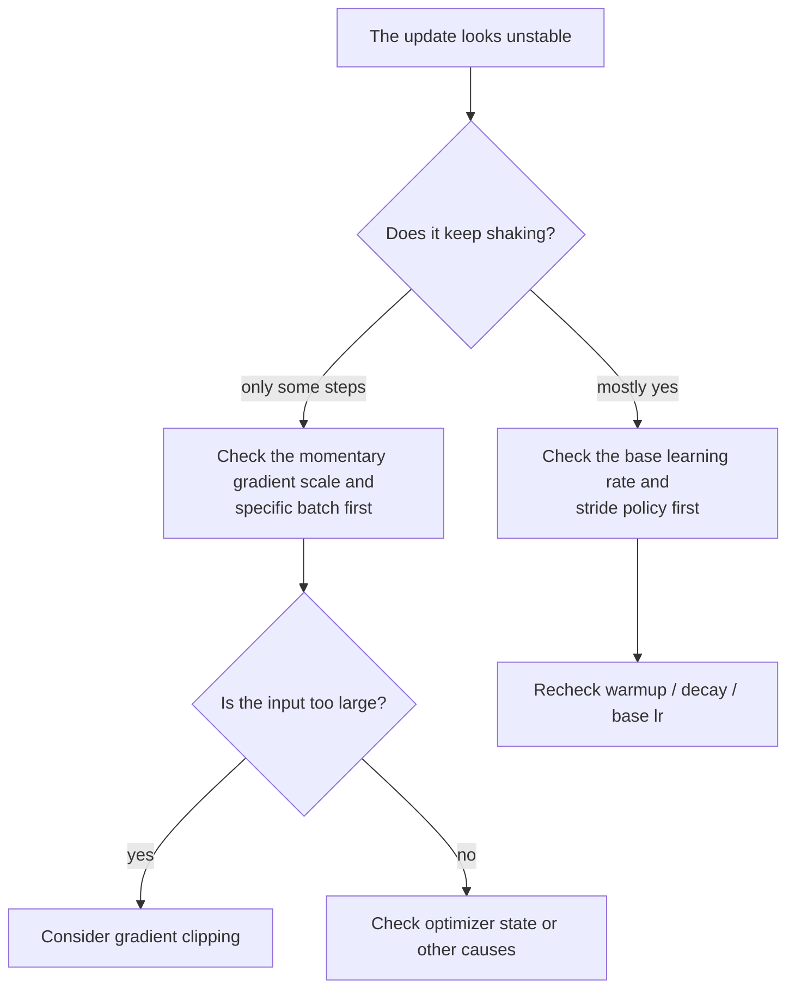
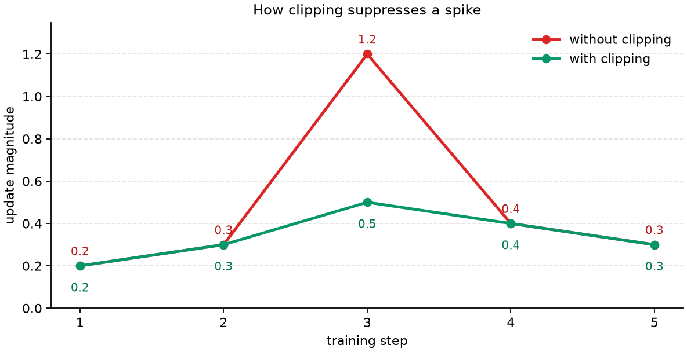

# P5-7.8 Supplementary Reading: Gradient Clipping And Unstable Updates

Section ID: `P5-7.8`
Version: `v2026.07.17`

Once we understand the structure in which the optimizer turns gradients into updates, another question appears in actual training logs. We know the direction, but in some steps the update seems to jump too aggressively. At that point, should we read the problem as a learning-rate issue, as a gradient-scale issue, or as a case where another safety device is needed?

Gradient clipping appears exactly at this point.
The diagnostic standard of this section can be reused as it is later too when we look at deep-model training, fine-tuning logs, and unstable loss curves.

## Scope Of This Section

- What is gradient clipping a device for limiting?
- How do we distinguish a too-large learning-rate problem from a problem where the gradient itself is too large?
- At the introductory level, how should we read norm clipping and value clipping differently?
- Does clipping replace the optimizer, or is it a safety device that attaches before the update?

This section does not widen into advanced distributed learning or mixed precision. It focuses on `how do we make unstable movement smaller by imposing a limit`.

## Goals Of This Section

- You can explain gradient clipping as `a safety device that limits overly large movement`.
- You can distinguish a learning-rate problem from a gradient-scale problem.
- You can explain the difference between norm clipping and value clipping at the introductory level.
- You can explain that clipping is a device on a different layer from the optimizer itself.

## What Does Clipping Do

Gradient clipping, exactly as its name says, is the device that limits the size of the gradient when it becomes too large. At the introductory stage, the following sentence is enough.

`Gradient clipping is not the device that finds a new direction. It is the device that limits the size so that an overly large movement does not happen all at once.`

In other words, clipping does not replace the optimizer. It is closer to the role of pressing the scale of the incoming gradient into a safer range before the optimizer makes the update.

If we unpack this explanation more, clipping is closer to deciding not `where shall we go`, but `let us not go too far in one move`. So clipping should not be seen as a concept competing with the optimizer. If the optimizer is the movement rule, then clipping is more accurately seen as the cushioning device that attaches when the input entering that rule is too aggressive.

If we turn it into a small scene, it becomes clearer. Imagine a driver who already knows which direction to go, but the road suddenly becomes slippery so that the steering wheel might turn too sharply at once. What is needed then is not to decide the destination again, but a device that keeps one action from becoming too violent. Clipping plays exactly this role for the optimizer.

## Why Are A Learning-Rate Problem And A Gradient Problem Different

Both can look similar because in the end the update can appear overly aggressive. But the causes can be different.

| Problem scene | Cause to suspect first | Core question |
| --- | --- | --- |
| the stride looks too large overall in every step | the learning rate may be too large | is the stride policy itself too aggressive? |
| only some steps suddenly produce large jumps | the gradient scale may have become very large in a moment | is the gradient exploding in a specific batch or interval? |
| even in an adaptive optimizer, a certain coordinate is unstable | the state and gradient scale may both be involved | did we look at the coordinate-wise accumulated state and the current gradient together? |

This table matters because if we push every `the update is jumping` observation only into the learning rate, the diagnosis becomes too coarse.

In practice, this is exactly the misunderstanding many beginners make. When learning looks unstable, they immediately try only to lower the learning rate. Of course the learning rate can be the cause. But in some cases, the problem is not the whole stride policy, but the fact that the gradient itself became abnormally large in a specific batch. In other cases, the result may have been created together by the state of an adaptive optimizer and the current gradient. So the clipping section plays the role of splitting the single sentence `it looks unstable` into smaller diagnostic questions.

If we replay this difference through a small scene, it becomes the following. If every step keeps wobbling, then it is natural to recall first `is the base stride too large?` By contrast, if most steps look fine but only a few out of one hundred jump suddenly, it is more natural to suspect `the gradient scale of a specific moment` than the overall learning rate. If we do not distinguish the two, then even when the causes differ, the treatment is lumped together into one answer.

### Diagnostic Order When We See An Unstable Update

When a training log is shaky, it is safer to divide the problem into smaller questions before choosing a solution immediately.

1. Is it shaking continuously, or do only some steps spike?
2. Is it a problem of the overall stride being large, or a problem of momentary input being too aggressive?
3. Should we first look at the optimizer rule, the learning rate, or clipping?

Once these three questions are fixed first, the clipping section is read not as `an introduction of one more technical name`, but as `an organization of diagnostic order`.

If we compress this diagnostic order back into a diagram, it becomes the following.

## How Are Norm Clipping And Value Clipping Different

At the introductory stage, it is enough to distinguish only the intuition of the two methods.

| Method | Feeling to read first | When it is easy to recall |
| --- | --- | --- |
| norm clipping | if the whole gradient vector is too large, reduce it all at once | when the whole movement amount becomes excessively large |
| value clipping | clip each gradient element into a fixed range | when a few specific coordinates create unusually large spikes |

In many explanations, it is enough to recall norm clipping first. What matters is that both are not `devices that learn a new direction`, but `devices that limit the size`.

The reason we distinguish these two at the early stage is also here. More than memorizing clipping types, beginners have to first understand `what kind of thing is this a limiting device for?` Norm clipping is closer to the feeling of dealing with the whole movement scale at once, while value clipping is closer to directly cutting each element. Even if the reader does not know every implementation difference in detail, it must still be possible to read both under the shared theme `limiting the magnitude`.

Said very briefly again, norm clipping is closer to `slowing down the whole team together`, while value clipping is closer to `cutting down the speed of a few members who spike too much`. Even this one analogy makes the difference between the two far less abstract.

## On What Different Layer Is Clipping Compared With The Optimizer

The optimizer receives the gradient and applies the update rule. Clipping is the device that checks before that `is this gradient too large to use as it is right now?`

So the two do not play the same role.

- the optimizer decides how to move
- clipping limits the scale of movement when overly aggressive input enters

If we miss this difference, misunderstandings such as `if we use Adam, clipping is unnecessary` or `if clipping exists, the learning rate is not important` arise easily.

But in reality, the three occupy different places. The optimizer is the update rule, the learning rate is the stride length of that rule, and clipping is the safety device that limits an overly large input. All three may be needed together, and even changing only one of the three can change the result. Once this separation becomes visible, even when many options appear side by side in a training settings file, the confusion `why are we adjusting similar numbers in three different places?` becomes smaller.

This distinction is especially important for beginners because in practical settings files, these values often appear together on one screen. When lines such as `optimizer=Adam`, `lr=1e-3`, and `clip_norm=1.0` appear, they can all look like similar adjustment values. But in reality they are separately adjusting `by what rule should we move`, `how far should we move`, and `how should we limit an excessively large momentary input`. Only when these three questions are visibly separated does the reader gain the feel of how to read the settings.

## One Very Small Numeric Example

Even when using the same learning rate `0.1`, the scale of the input the optimizer receives is completely different when the gradient is `-2.0` and when it is `-200.0`.

| gradient | without clipping | after example-style norm clipping |
| --- | --- | --- |
| `-2.0` | can lead to a relatively small update | may stay almost unchanged |
| `-200.0` | can lead to a very large update | can be reduced to a limited magnitude |

This example is not trying to explain exact implementation numbers. The feeling that has to remain in the current section is that `even with the same learning rate, if the gradient scale is too large, the update can explode, and clipping is the safety device that limits that scale`.

If we write it very simply, without clipping, something like `update = 0.1 x 200 = 20` can produce an overly large movement at once. But if clipping limits the gradient magnitude, then even with the same learning rate the actual update can be pressed into a much smaller range. Through this calculation, a beginner can more easily confirm the point that `clipping does not change the direction, but reduces the input magnitude`.

In other words, the center of this section is not the exact formula by which clipping works, but `what should the reader suspect when an update is unstable?` If the update jumps too largely, that does not always mean the optimizer itself is wrong, and the learning rate is not the only possible cause either. Clipping is the diagnostic tool and safety device that sits exactly in this middle place.

If we look at it through a graph, it becomes more direct why clipping is called `the device that presses down one spike`.

In this graph, only the 3rd step receives an aggressive input, so without clipping the update size jumps up to `1.2`, whereas once clipping is applied it is pressed near `0.5`. The important point is not that every step is made equally small, but that only the spiking moment is made less aggressive. So it is more accurate to read clipping not as `a device that slows down the whole learning process`, but as `the safety device that stops a particular spike from shaking learning`.

## Cases And Examples

### Case. When The Loss Jumps Greatly Only Occasionally, What Should We Distinguish First

When reading a training log, we may find a scene where most steps look fine, but only in a specific interval the loss suddenly shoots up. At that point, beginners often first think `should I just lower the learning rate no matter what?` That could be true, but it is not always the same answer.

It is safer to divide this scene as follows.

| Scene we see | Conclusion it is easy to jump to too quickly | Safer reinterpretation |
| --- | --- | --- |
| a large jump appears only at a specific step | the overall learning rate is always too large | did the gradient scale explode in a few batches or intervals? |
| the wobble is large in every interval | clipping alone will solve it | is the base learning-rate policy itself too aggressive? |
| even in an adaptive optimizer, it suddenly spikes | adaptive optimizers are useless | do we need to look at state accumulation and the current gradient scale together? |

The core shown by this case is one thing. Do not conclude one single cause only from the surface observation `the update looks unstable`.

If we say this more realistically, what the reader has to do while reading the training log is not `pick one fix immediately`, but `separate the layers of the problem first`. Does the whole interval keep being unstable, do only some steps spike, or is only a particular coordinate unusually sensitive? Once these are separated, the answer about whether to look at the learning rate, clipping, or optimizer state changes. This section exists exactly to build that habit of separation.

## Practice And Example

Read the following sentences and choose the question to check first.

| Sentence | Question to check first | Device to recall first |
| --- | --- | --- |
| It fluctuates too largely overall from beginning to end | is the learning rate itself too large? | learning-rate adjustment |
| Most of it looks fine, but in a few steps it explodes | is the gradient magnitude momentarily too large? | consider gradient clipping |
| Only a specific coordinate is unusually unstable | are the coordinate-wise state and gradient scale the problem? | check adaptive-optimizer state + consider clipping |
| Even after applying clipping, later oscillation still continues | is the stride policy still too large? | check decay or the scheduler |

The purpose of this exercise is not to memorize clipping as a universal device, but to distinguish that `optimizer`, `learning rate`, `gradient scale`, and `state` can make problems on different layers.

## Checklist

- Can you explain gradient clipping as `a device that limits overly large movement`?
- Can you read an excessively large learning rate and gradient explosion as different problems?
- Can you explain the difference between norm clipping and value clipping at the introductory level?
- Can you say that clipping does not replace the optimizer itself, but is a safety device attached before the update?
- Can you explain that when an update is unstable, the learning rate, gradient scale, and optimizer state have to be checked separately?
