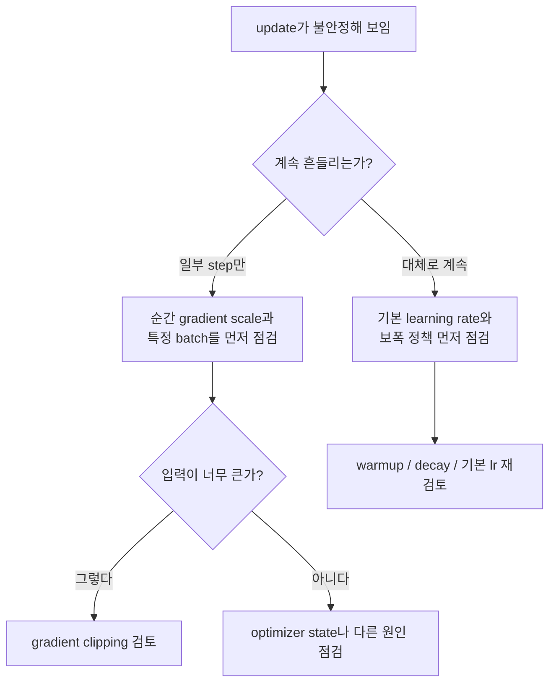

# P5-7.8 보충학습: gradient clipping과 불안정한 update

Section ID: `P5-7.8`
Version: `v2026.07.17`

optimizer가 gradient를 update로 바꾸는 구조를 이해하고 나면, 실제 학습 로그에서 또 다른 질문이 생깁니다. 방향은 알겠는데, 어떤 step에서는 update가 너무 과격하게 튀는 것처럼 보일 때가 있습니다. 이때 문제를 learning rate로 읽어야 하는가, gradient scale로 읽어야 하는가, 아니면 다른 안전장치가 필요한가?

gradient clipping은 바로 이 지점에서 등장합니다.
이 절의 진단 기준은 뒤에서 깊은 모델 학습, fine-tuning 로그, 불안정한 loss 곡선을 볼 때도 그대로 재사용할 수 있습니다.

## 이 절의 범위

- gradient clipping은 무엇을 제한하는 장치인가?
- learning rate가 너무 큰 문제와 gradient 자체가 너무 큰 문제를 어떻게 구분하는가?
- norm clipping과 value clipping은 입문 수준에서 어떻게 다르게 읽는가?
- clipping은 optimizer를 대체하는가, 아니면 update 전에 붙는 안전장치인가?

이 절에서는 고급 분산 학습이나 mixed precision까지 넓히지 않고, `불안정한 이동을 어떻게 작게 제한하는가`에 집중합니다.

## 이 절의 목표

- gradient clipping을 `너무 큰 이동을 제한하는 안전장치`로 설명할 수 있습니다.
- learning rate 문제와 gradient scale 문제를 구분할 수 있습니다.
- norm clipping과 value clipping의 차이를 입문 수준에서 말할 수 있습니다.
- clipping이 optimizer 자체와 다른 층위의 장치라는 점을 설명할 수 있습니다.

## clipping은 무엇을 하는가

gradient clipping은 이름 그대로 gradient가 너무 커졌을 때 그 크기를 제한하는 장치입니다. 입문 단계에서는 다음 문장으로 충분합니다.

`gradient clipping은 방향을 새로 정하는 장치가 아니라, 너무 큰 이동이 한 번에 발생하지 않도록 크기를 제한하는 장치이다.`

즉, clipping은 optimizer를 대신하는 것이 아니라, optimizer가 update를 만들기 전에 들어오는 gradient의 규모를 안전 범위 안으로 눌러 주는 역할에 가깝습니다.

이 설명을 더 풀면, clipping은 `어디로 갈까`를 정하는 장치가 아니라 `한 번에 너무 멀리 가지 않게 하자`를 정하는 장치에 가깝습니다. 그래서 clipping을 이해할 때는 optimizer와 경쟁하는 개념으로 보면 안 됩니다. optimizer가 이동 규칙이라면, clipping은 그 규칙에 들어오는 입력이 너무 과격할 때 붙는 완충 장치처럼 보는 편이 정확합니다.

작은 장면으로 보면 더 분명합니다. 운전자가 어느 방향으로 가야 하는지는 이미 알고 있는데, 갑자기 도로가 미끄러워져 한 번에 너무 크게 핸들이 꺾일 수 있는 상황이라고 생각하면 됩니다. 이때 필요한 것은 목적지를 다시 정하는 일이 아니라, 한 번의 조작이 너무 과격해지지 않도록 제한하는 장치입니다. clipping은 optimizer에게 바로 이런 역할을 합니다.

## learning rate 문제와 gradient 문제는 왜 다른가

두 문제 모두 결과적으로 update가 과격해 보일 수 있어 헷갈리기 쉽습니다. 하지만 원인은 다를 수 있습니다.

| 문제 장면 | 먼저 의심할 원인 | 핵심 질문 |
| --- | --- | --- |
| 모든 step에서 전반적으로 보폭이 너무 크다 | learning rate가 과대할 수 있음 | 보폭 정책 자체가 공격적인가 |
| 일부 step에서만 갑자기 큰 튐이 나온다 | gradient scale이 순간적으로 커질 수 있음 | 특정 batch나 구간에서 gradient가 폭주하는가 |
| adaptive optimizer에서도 특정 좌표가 불안정하다 | state와 gradient scale이 함께 문제일 수 있음 | 좌표별 누적 상태와 현재 gradient를 같이 봤는가 |

이 표가 중요한 이유는, `업데이트가 튄다`는 관찰 하나만으로 모든 문제를 learning rate로 몰아가면 진단이 거칠어지기 때문입니다.

실제로 초심자가 많이 하는 오해가 바로 이것입니다. 학습이 불안정해 보이면 곧바로 learning rate만 낮추려는 것입니다. 물론 learning rate가 원인일 수도 있습니다. 하지만 어떤 경우에는 전체 보폭 정책이 아니라, 특정 batch에서 들어온 gradient 자체가 비정상적으로 큰 것이 문제일 수 있습니다. 또 어떤 경우에는 adaptive optimizer의 state와 현재 gradient가 함께 만들어 낸 결과일 수도 있습니다. 그래서 clipping 절은 `불안정하다`는 한 문장을 더 작은 진단 질문으로 나누는 역할을 합니다.

이 차이를 작은 장면으로 다시 보면 다음과 같습니다. 모든 step에서 계속 요동친다면, 보통은 `기본 보폭이 너무 큰가`를 먼저 떠올리는 편이 자연스럽습니다. 반대로 대부분은 괜찮은데 100 step 중 몇 step만 갑자기 크게 튄다면, `전체 learning rate`보다 `특정 순간의 gradient scale`을 의심하는 편이 더 자연스럽습니다. 이 둘을 구분하지 않으면, 원인이 다르더라도 처방을 하나로 뭉뚱그리게 됩니다.

### 불안정한 update를 볼 때의 진단 순서

학습 로그가 흔들릴 때는 바로 해결책부터 고르기보다, 먼저 문제를 더 작은 질문으로 나누는 편이 안전합니다.

1. 모든 step이 계속 흔들리는가, 일부 step만 튀는가?
2. 전체 보폭이 큰 문제인가, 순간 입력이 과격한 문제인가?
3. optimizer 규칙을 봐야 하는가, learning rate를 봐야 하는가, clipping을 봐야 하는가?

이 세 질문이 먼저 잡히면, clipping 절은 `기술 이름 소개`가 아니라 `진단 순서 정리`로 읽히게 됩니다.

이 진단 순서를 도식으로 다시 압축하면 다음과 같습니다.

## norm clipping과 value clipping은 어떻게 다른가

입문 단계에서는 두 방식의 직관만 구분하면 충분합니다.

| 방식 | 먼저 읽을 감각 | 언제 떠올리기 쉬운가 |
| --- | --- | --- |
| norm clipping | 전체 gradient 벡터의 크기가 너무 크면 한 번에 줄인다 | 전체 이동량이 과도하게 커질 때 |
| value clipping | gradient 각 원소 값을 일정 범위 안으로 자른다 | 특정 좌표 값이 유난히 큰 스파이크를 만들 때 |

많은 설명에서는 norm clipping을 먼저 떠올리면 충분합니다. 중요한 것은 둘 다 `방향 자체를 새로 배우는 장치`가 아니라 `크기를 제한하는 장치`라는 점입니다.

이 차이를 굳이 early stage에서 구분하는 이유도 여기에 있습니다. 초심자는 clipping 종류를 외우는 것보다, `무엇을 제한하는 장치인가`를 먼저 이해해야 합니다. norm clipping은 전체 이동 규모를 한 번에 다루는 감각에 가깝고, value clipping은 각 원소를 직접 자르는 감각에 가깝습니다. 둘의 구현 차이를 자세히 몰라도, 둘 다 `크기 제한`이라는 공통점 아래에서 읽을 수 있어야 뒤에서 문서를 봐도 덜 흔들립니다.

아주 짧게 다시 말하면, norm clipping은 `팀 전체 속도를 줄이는 것`에 가깝고, value clipping은 `너무 튀는 몇 명의 속도를 잘라 내는 것`에 가깝습니다. 이 비유 하나만 있어도 두 방식의 차이는 훨씬 덜 추상적으로 느껴집니다.

## clipping은 optimizer와 어떻게 다른 층위에 있는가

optimizer는 gradient를 받아 update 규칙을 적용합니다. clipping은 그보다 앞에서 `이 gradient를 지금 그대로 쓰기에는 너무 크지 않은가`를 점검하는 장치입니다.

따라서 둘은 같은 역할이 아닙니다.

- optimizer는 어떻게 움직일지 정합니다.
- clipping은 너무 과격한 입력이 들어올 때 이동 규모를 제한합니다.

이 차이를 놓치면 `Adam을 쓰면 clipping이 필요 없다`거나 `clipping이 있으면 learning rate는 중요하지 않다` 같은 오해가 생기기 쉽습니다.

하지만 실제로는 이 셋이 서로 다른 자리를 차지합니다. optimizer는 update 규칙이고, learning rate는 그 규칙의 보폭이며, clipping은 너무 큰 입력을 제한하는 안전장치입니다. 셋이 모두 함께 필요할 수 있고, 셋 중 하나만 바꿔도 결과가 달라질 수 있습니다. 이 분리가 먼저 보이면, 학습 설정 파일에 여러 옵션이 나란히 있어도 `왜 비슷한 숫자를 세 군데나 만지는가`라는 혼란이 줄어듭니다.

초심자에게 이 구분이 특히 중요한 이유는, 실무 설정 파일에서는 이 값들이 자주 한 화면에 함께 나오기 때문입니다. `optimizer=Adam`, `lr=1e-3`, `clip_norm=1.0` 같은 줄을 보면 모두 비슷한 조정값처럼 보일 수 있습니다. 하지만 실제로는 `어떤 규칙으로 움직일까`, `얼마나 크게 움직일까`, `너무 큰 순간 입력을 어떻게 제한할까`를 각각 따로 만지는 것입니다. 이 세 질문이 분해되어 보여야 설정을 읽는 감각이 생깁니다.

## 아주 작은 숫자 예시

같은 learning rate `0.1`을 쓰더라도 gradient가 `-2.0`일 때와 `-200.0`일 때 optimizer가 받는 입력 규모는 전혀 다릅니다.

| gradient | clipping 없음 | 예시적 norm clipping 뒤 |
| --- | --- | --- |
| `-2.0` | 비교적 작은 update | 거의 그대로 유지될 수 있음 |
| `-200.0` | 매우 큰 update로 이어질 수 있음 | 제한된 크기로 줄어들 수 있음 |

이 예시는 정확한 구현 수치를 설명하려는 것이 아닙니다. 현재 절에서 남겨야 할 감각은 `같은 learning rate라도 gradient 규모가 너무 크면 update가 폭주할 수 있고, clipping은 그 규모를 제한하는 안전장치`라는 점입니다.

아주 단순하게 적어 보면, clipping이 없으면 `update = 0.1 x 200 = 20`처럼 한 번에 너무 큰 이동이 생길 수 있습니다. 반면 clipping으로 gradient 크기를 제한하면, 같은 learning rate여도 실제 update는 훨씬 더 작은 범위로 눌릴 수 있습니다. 초심자는 이 계산을 통해 `clipping은 방향을 바꾸는 것이 아니라 입력 크기를 줄이는 것`이라는 점을 더 쉽게 확인할 수 있습니다.

즉, 지금 절의 중심은 clipping이 정확히 어떤 수식으로 작동하는가보다, `불안정한 update`를 볼 때 독자가 무엇을 의심해야 하는가입니다. update가 너무 크게 튄다고 해서 언제나 optimizer가 틀린 것은 아니고, learning rate만이 유일한 원인도 아닙니다. clipping은 바로 이 중간 자리에 있는 진단 도구이자 안전장치입니다.

## 사례 및 예시

### 사례. loss가 가끔만 크게 튈 때 무엇을 먼저 구분할 것인가

학습 로그를 읽는데, 대부분의 step에서는 괜찮다가 특정 구간에서만 loss가 갑자기 치솟는 장면을 만날 수 있습니다. 이때 초심자는 흔히 `learning rate를 무조건 낮춰야 하나`부터 떠올립니다. 물론 그럴 수도 있지만, 매번 같은 답은 아닙니다.

이 장면은 다음처럼 나누어 읽는 편이 더 안전합니다.

| 보이는 장면 | 너무 빨리 내리기 쉬운 결론 | 더 안전한 재해석 |
| --- | --- | --- |
| 특정 step에서만 갑자기 큰 튐이 나온다 | learning rate 전체가 항상 너무 크다 | 일부 batch나 구간에서 gradient scale이 폭주했는가 |
| 모든 구간에서 흔들림이 크다 | clipping만 넣으면 해결된다 | 기본 learning rate 정책이 과격한가 |
| adaptive optimizer에서도 갑자기 튄다 | adaptive optimizer는 소용없다 | state 누적과 현재 gradient 규모를 함께 봐야 하는가 |

이 사례가 보여 주는 핵심은 하나입니다. `불안정한 update`라는 겉모습 하나만 보고 원인을 한 가지로 단정하지 않는 것입니다.

이 문장을 더 현실적으로 말하면, 독자가 학습 로그를 읽으며 해야 할 일은 `한 번의 해결책을 바로 고르는 것`이 아니라 `문제의 층위를 먼저 구분하는 것`입니다. 전체 구간이 계속 불안정한가, 일부 step만 튀는가, 특정 좌표만 유난히 예민한가를 나누어 보면, learning rate를 볼지, clipping을 볼지, optimizer state를 볼지가 달라집니다. 이 절은 바로 그 구분 습관을 만들기 위한 절입니다.

## 연습 및 예제

다음 문장을 읽고 먼저 점검할 질문을 고릅니다.

| 문장 | 먼저 점검할 질문 | 우선 떠올릴 장치 |
| --- | --- | --- |
| 초반부터 끝까지 전반적으로 너무 크게 흔들린다 | learning rate 자체가 큰가 | learning rate 조정 |
| 대부분 괜찮은데 몇 step에서만 폭발적으로 튄다 | gradient 크기가 순간적으로 너무 큰가 | gradient clipping 검토 |
| 특정 좌표만 유난히 불안정하다 | 좌표별 state와 gradient scale이 문제인가 | adaptive optimizer state 점검 + clipping 검토 |
| clipping을 넣었는데도 후반 진동이 계속된다 | 보폭 정책이 여전히 큰가 | decay나 scheduler 점검 |

이 연습의 목적은 clipping을 만능 장치로 외우는 것이 아니라, `optimizer`, `learning rate`, `gradient scale`, `state`가 서로 다른 층위에서 문제를 만들 수 있다는 점을 구분하는 데 있습니다.

## 체크리스트

- gradient clipping을 `너무 큰 이동을 제한하는 장치`로 설명할 수 있는가?
- learning rate 과대와 gradient 폭주를 다른 문제로 읽을 수 있는가?
- norm clipping과 value clipping의 차이를 입문 수준에서 설명할 수 있는가?
- clipping이 optimizer 자체를 대체하는 것이 아니라, update 전에 붙는 안전장치라는 점을 말할 수 있는가?
- 불안정한 update를 볼 때 learning rate, gradient scale, optimizer state를 따로 점검해야 한다는 점을 설명할 수 있는가?
