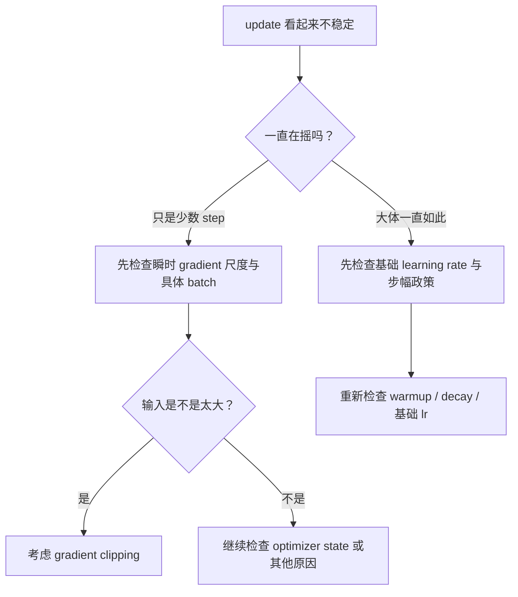
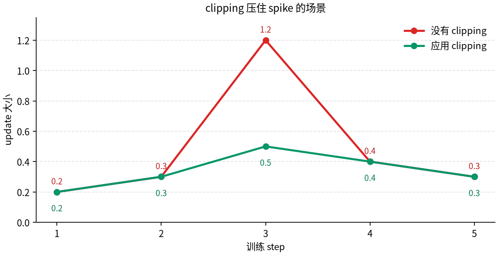

# P5-7.8 补充学习：gradient clipping 与不稳定的 update

Section ID: `P5-7.8`
Version: `v2026.07.17`

一旦理解了 optimizer 把 gradient 变成 update 的结构，在真实训练日志里就会冒出另一个问题。方向已经知道了，但某些 step 的 update 看起来会突然变得过于猛烈。此时，问题应该先被读成 learning rate 问题，还是 gradient 尺度问题，还是说需要另外一种安全装置？

gradient clipping 正是从这个位置出现的。
这一节的诊断标准，以后也能原样复用在深层模型训练、fine-tuning 日志与不稳定的 loss 曲线里。

## 本节范围

- gradient clipping 到底是在限制什么？
- 怎样区分：是 learning rate 太大，还是 gradient 本身突然太大？
- norm clipping 与 value clipping，在入门阶段应该怎样分开读？
- clipping 会取代 optimizer 吗，还是它只是挂在 update 前面的安全装置？

这一节不会立刻扩展到高级分布式训练或 mixed precision，而是专注于：`怎样把不稳定的移动限制得更小。`

## 本节目标

- 能把 gradient clipping 解释成`限制过大移动的安全装置`。
- 能区分 learning rate 问题与 gradient 尺度问题。
- 能在入门阶段说明 norm clipping 与 value clipping 的差别。
- 能说明 clipping 与 optimizer 自身并不处在同一层位。

## clipping 在做什么

gradient clipping 顾名思义，就是当 gradient 变得过大时，用来限制它大小的装置。入门阶段，先抓住下面这句话就够了。

`gradient clipping 不是重新找方向的装置，而是防止一次移动过大、因而把规模压住的装置。`

也就是说，clipping 并不会取代 optimizer。它更接近于：在 optimizer 生成 update 之前，先把流进来的 gradient 尺度压回一个更安全的范围。

如果把这段话再展开，clipping 更像是在决定`不要一次走得太远`，而不是`到底该往哪边去。` 所以不能把 clipping 当成跟 optimizer 竞争的概念来看。如果说 optimizer 是移动规则，那么 clipping 就更像是在这个规则之前加上的缓冲装置：一旦输入过于猛烈，就先把规模按住。

换成一个小场景会更清楚。可以想象：司机其实已经知道目的地方向了，但路突然变得很滑，一次转向可能会过猛。这时需要的，不是重新决定终点，而是一个装置，防止单次动作太激烈。clipping 对 optimizer 来说，就扮演类似角色。

## 为什么 learning rate 问题与 gradient 问题不是一回事

两者最后都可能表现成`update 太激烈`，所以很容易混淆。但原因可能完全不同。

| 问题场景 | 先怀疑什么原因 | 核心问题 |
| --- | --- | --- |
| 每一步整体看起来都太大 | learning rate 可能过大 | 是步幅政策本身太激进吗？ |
| 只有某些 step 突然跳很大 | gradient 尺度可能瞬间过大 | 是不是某个 batch 或区间里发生了 gradient 爆发？ |
| 即使在 adaptive optimizer 里，某个坐标仍然很不稳定 | state 与 gradient 尺度可能一起有问题 | 有没有把按坐标累积 state 与当前 gradient 一起看？ |

这张表重要，是因为如果看到`update 在跳`就一股脑全推给 learning rate，诊断就会太粗。

初学者常见的误解正是这样。只要训练看起来不稳，就先一味降低 learning rate。当然，有时候 learning rate 的确是原因。但也可能问题根本不在整体步幅政策，而在于某些 batch 里输入进来的 gradient 本身异常大。还有些场景，则可能是 adaptive optimizer 的 state 与当前 gradient 一起制造了这种结果。所以 clipping 这一节的作用，就是把一句笼统的`它看起来不稳定`拆成几条更具体的诊断问题。

如果换成一个小场景再想，会更容易。若每一步都在抖，那么更自然的是先想到：`基础步幅会不会太大？` 反过来，若 100 个 step 里只有个别几个突然爆冲，那么比起整体 learning rate，更自然的怀疑对象就应该是：`某个瞬间的 gradient 尺度是不是太大？` 如果这两种情况不先分开，就会把不同原因套用成同一种处方。

### 看到不稳定 update 时的诊断顺序

当训练日志显得摇晃时，与其马上选补救办法，不如先把问题拆成更小的诊断顺序。

1. 是一直都在摇，还是只有少数 step 在爆冲？
2. 是整体步幅过大的问题，还是瞬时输入过猛的问题？
3. 现在该先看 optimizer 规则、learning rate，还是 clipping？

只要这三问先固定，clipping 这一节就不再像`又多介绍了一个技术名字`，而更像是在整理诊断顺序。

如果把这条诊断顺序再压成图，大致会像下面这样。

## norm clipping 与 value clipping 有什么不同

入门阶段，先只分开它们的直觉就足够。

| 方式 | 先抓住的感觉 | 什么时候最容易想到它 |
| --- | --- | --- |
| norm clipping | 如果整个 gradient 向量太大，就整体一起压小 | 当整体移动量过于庞大时 |
| value clipping | 把每个 gradient 元素裁到固定范围里 | 当少数坐标制造出特别尖的 spike 时 |

在很多说明里，先想到 norm clipping 通常就够了。最重要的是：两者都不是`重新学习新方向`的装置，而是`限制大小`的装置。

之所以在早期就把这两种分开，是因为初学者比起背 clipping 名字，更需要先理解：`它们到底在限制什么。` norm clipping 更像是在一次性处理整体移动规模，value clipping 更像是在直接裁掉单个元素的极端值。就算一开始不掌握全部实现细节，也必须先能把两者都读到`限制规模`这个共同主题下。

再说得短一点，norm clipping 更像是`整支队伍一起降速`，而 value clipping 更像是`把个别冲得太猛的人单独压下来。` 只要有这个比喻，它们的差别就会少很多抽象感。

## clipping 与 optimizer 不在同一层位

optimizer 会接收 gradient，并应用自己的 update 规则。clipping 则是在那之前先检查：`这个 gradient 现在是不是大到不适合原样使用？`

所以，两者根本不是同一种角色。

- optimizer 决定怎么动
- clipping 则在输入太猛时，限制移动规模

如果忽略这条差异，就很容易出现类似`用了 Adam 就不需要 clipping`或`既然有 clipping，learning rate 就不重要`这样的误解。

但实际上，这三者各自站在不同位置。optimizer 是 update 规则，learning rate 是那条规则的步幅，而 clipping 是当输入太大时负责限幅的安全装置。三者可以同时都需要，也可能只改其中一个，结果就已经不同。只要这条分离先看见，训练设置文件里很多选项即使挤在同一页，也不至于再让人困惑：`为什么好像在三个地方都在改相似的数字？`

这条区分对初学者特别重要，因为在实务配置文件里，`optimizer=Adam`、`lr=1e-3`、`clip_norm=1.0` 这样的值常常一起出现。它们看起来都像调参数字，但其实分别在调：`用什么规则移动`、`一次移动多远`、`瞬间过大的输入该怎样压住。` 只有把这三种问题分开，才会形成真正的设置阅读感。

## 一个很小的数字例子

即使使用相同的 learning rate `0.1`，当 gradient 是 `-2.0` 和 `-200.0` 时，optimizer 收到的输入规模完全不同。

| gradient | 没有 clipping | 经过示意性的 norm clipping 之后 |
| --- | --- | --- |
| `-2.0` | 可能只产生比较小的 update | 很可能几乎保持原样 |
| `-200.0` | 可能产生非常大的 update | 会被压到较受限的范围内 |

这个例子不是为了给出精确实现数值。当前这一节真正要留下来的感觉，是：`即使 learning rate 一样，只要 gradient 规模过大，update 就可能爆冲；而 clipping 正是用来压这个尺度的安全装置。`

如果把它写得再简单一点，不加 clipping 时，像 `update = 0.1 x 200 = 20` 这样的乘法，就可能让一次移动大得离谱。相反，如果 clipping 先把 gradient 尺度压下来，那么即使 learning rate 完全不变，真实 update 也会被压到更小范围。通过这种简单计算，初学者更容易确认：`clipping 改的不是方向，而是输入规模。`

换句话说，这一节的中心并不是 clipping 的精确公式，而是：`一旦看到不稳定的 update，读者应该先怀疑什么。` update 太大，并不总说明 optimizer 自己有错，也不总说明 learning rate 就一定是唯一原因。clipping 正好位在这个中间位置，既是诊断工具，也是安全装置。

如果用图再看一次，就会更直接理解为什么 clipping 会被叫成`把单次 spike 压住的装置。`

这张图里，只有第 3 个 step 的输入特别猛，因此在没有 clipping 时，update 会一下跳到 `1.2`；加上 clipping 后，则会被压到接近 `0.5`。关键点不是让每一步都同样变小，而是只在那种突然爆冲的瞬间减少过激性。所以更准确的读法不是`让整个训练都变慢的装置`，而是`防止某个 spike 把学习过程打乱的安全装置。`

## 案例与示例

### 案例. 当 loss 只是偶尔大跳时，先该区分什么

读训练日志时，常会遇到这样一种场景：大多数 step 看起来都正常，但某些特定区间里，loss 会突然暴冲。初学者看到这里，往往会立刻先想到：`是不是应该先把 learning rate 一律调低？` 当然，有时确实如此；但这并不是永远都对的第一个答案。

更安全的读法，是把这个场景拆成下面这样。

| 看到的场景 | 很容易太快得出的结论 | 更安全的重读方式 |
| --- | --- | --- |
| 只有特定 step 会突然跳得很大 | 整体 learning rate 一直都太大 | 会不会只是某几个 batch 或区间里的 gradient 尺度爆冲？ |
| 所有区间都在强烈摇摆 | 只要加 clipping 就一定能解决 | 基础 learning rate 政策本身是不是太激进？ |
| 即使是 adaptive optimizer，也会突然爆一下 | adaptive optimizer 没有用 | 要不要把 state 累积和当前 gradient 尺度一起看？ |

这个案例要留下来的核心只有一个：不要只根据表面上的`update 看起来不稳定`，就立刻压成单一原因。

更实际地说，读者在看训练日志时真正要做的，不是立刻挑一个修复办法，而是先把问题所在的层位分开。是整个区间一直都不稳定，还是只有少数 step 爆冲？是某个坐标特别敏感，还是整体都在晃？只要这些先被拆开，才知道该先看 learning rate、clipping，还是 optimizer state。这一节正是为了训练这种分层习惯。

## 练习与例子

读下面这些句子，选出应该先检查哪一个问题。

| 句子 | 先要检查的问题 | 优先想到的装置 |
| --- | --- | --- |
| 从头到尾整体都摇得太厉害 | learning rate 本身是不是太大？ | 调整 learning rate |
| 大部分都正常，但少数几个 step 会爆冲 | gradient 规模是不是瞬间过大？ | 优先考虑 gradient clipping |
| 只有某个坐标特别不稳定 | 按坐标 state 与 gradient 尺度是不是一起有问题？ | 检查 adaptive optimizer state + 考虑 clipping |
| 即使用了 clipping，后期振荡还是没停 | 步幅政策是不是仍然太大？ | 检查 decay 或 scheduler |

这个练习的目的，不是把 clipping 背成万能装置，而是让读者区分：optimizer、learning rate、gradient scale、state 这些问题，本来就处在不同层位。

## 检查清单

- 能把 gradient clipping 解释成`限制过大移动的装置`吗？
- 能把 learning rate 过大与 gradient 爆炸读成两种不同问题吗？
- 能在入门阶段解释 norm clipping 与 value clipping 的差别吗？
- 能说明 clipping 不是代替 optimizer，而是挂在 update 前面的安全装置吗？
- 一旦看到不稳定 update，能说明为什么要把 learning rate、gradient scale、optimizer state 分开检查吗？
