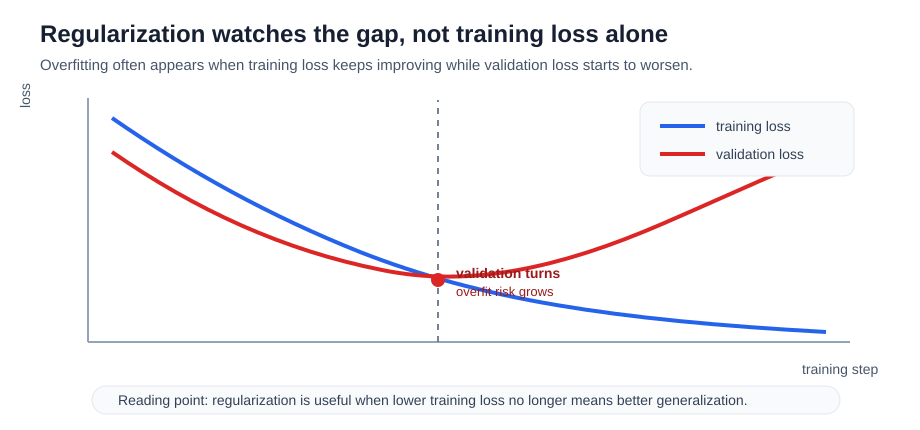

# P5-8.1 How To Add Constraints To The Objective Function: Regularization

Section ID: `P5-8.1`
Version: `v2026.07.17`

In Chapter P5-7, we saw that the optimizer is the rule that turns gradients into actual updates. But even if the training loop runs smoothly, that does not immediately mean the model will also hold up on new data. The next question appears right away.

What should we do if a model fits the training data very well, but does not perform well on new data?

One of the core concepts that answers this question is regularization. Chapter 8 is the chapter where we read what kinds of control devices are added to make the learning loop more stable. This section first deals with `what kind of constraint should we place on the objective function`.

Regularization is the idea of adding constraints or costs to the learning process so that the model does not fit the training data too aggressively.

When you need to distinguish overfitting control from normalization again, return to the glossary entry on [regularization](../../../reference/concept-glossary.md#regularization).

## Scope Of This Section

- Why does regularization enter the learning loop?
- How is it related to overfitting?
- How does regularization change the objective function?
- Why does it become more important when we look at model size and data size together?

It is safer to read this section not merely as `one more option added after the optimizer`, but as the section that separates `the update rule` from `the preference condition that shapes where updates are allowed to go`. Dropout is covered next in P5-8.2 as structure-level control, and the computational difference between training mode and evaluation mode reconnects in P5-6.4.

| What to distinguish in this section | Why it matters |
| --- | --- |
| optimizer | Because it is the procedure that looks at gradients and decides the actual stride of the update. |
| regularization | Because it is the viewpoint that constrains movement so it does not go toward an overly complex solution. |
| normalization | Because unlike overfitting control, it is the question of making value scales and distributions easier to handle. |

## Goals Of This Section

- You can explain regularization as `a constraint for reducing overfitting`.
- You can distinguish the roles of the optimizer and regularization.
- You can explain why regularization and normalization answer different questions.
- You can describe how regularization relates to the loss function, model size, and data size.
- You can explain that regularization plays the role of an `objective-function control device` inside Chapter 8.
- You can confirm through an executable Python example how a penalty affects update size.

## Why Are Regularization And Normalization Different

The regularization discussed in this section is regularization in the narrow sense. But in practice the words `normalize` and `normalization` also appear often, so they are easy to mix up at first.

The names are similar, but the questions they target are different.

| Item | regularization | normalization |
| --- | --- | --- |
| First question it tries to answer | How do we keep the model from memorizing too aggressively? | How do we make the scale of inputs or intermediate values easier to handle? |
| Main concern | generalization, overfitting control | value range, distribution, learning stability |
| Typical examples | L2 penalty, dropout, early stopping | input normalization, batch normalization, layer normalization |

In other words, regularization is closer to `what kind of solution should we like less`, while normalization is closer to `what value range and distribution make the computation easier to handle`.

Of course, in real deep learning the two are not completely separate. For example, batch normalization is more directly connected to computational stability and training speed, but in the end effects similar to regularization are sometimes observed as well. Even so, at the introductory stage it is safer to divide them like this first.

- regularization: `a device that keeps the model from memorizing too aggressively`
- normalization: `a device that makes value scales and distributions easier to handle`

## Why Is Regularization Needed

Deep learning models have high expressive power. That is a strength, but at the same time it also means they can end up following accidental patterns or noise in the training data.

For example:

- the loss on the training data keeps decreasing
- but on the validation data, performance stops improving at some point or even gets worse

This situation connects directly to the overfitting we saw in Part 4.

Regularization appears exactly here. It imposes the constraint: `fit the training data, but do not fit it in an overly complex way`.

This is easier to see with a curve. If the training loss keeps going down while the validation loss starts rising again at some point, the model may be moving toward memorizing the detailed patterns of the training data better and better.



In this graph, regularization is not trying to look only at the minimum training loss. The key is to see together whether the loss on new data improves as well, or whether the gap is widening in the direction of fitting only the training data better.

From a beginner's point of view, it is useful to pin this scene down one more time in a shorter form.

| The number we see first | The question we should ask right after | Why regularization appears |
| --- | --- | --- |
| training loss keeps going down | is the validation loss improving too? | Because we do not want to leave the model at a solution that fits only the training data. |
| training accuracy is high | does the same decision hold up when the input changes a little? | Because we want to make overly sensitive solutions less preferred. |
| the model became more complex | is that complexity also needed on new data? | Because large weights and complex rules can lead to overfitting. |

## What Is Regularization Trying To Prevent

Here it is enough to understand the purpose of regularization in the following three lines.

- It keeps the model from depending too heavily on excessively large parameters.
- It keeps the model from memorizing only accidental patterns from specific samples.
- It helps the model work more stably on new data as well.

In other words, regularization is not just about lowering the loss. It is the idea of constraining `how the loss is allowed to be lowered`.

## Does Regularization Only Mean A Penalty

Introductory textbooks often present regularization as `adding a penalty term to the loss function`. That explanation is important, but by itself it is somewhat narrow.

In deep learning, it is better to see regularization more broadly.

For example, the following can also be read as regularization in a broad sense.

- penalties that control weight size
- methods like dropout that randomly cut some connections
- strategies like early stopping that avoid training too long
- methods like data augmentation that increase input diversity

So regularization is closer to `a design philosophy for reducing overfitting` than to `a single formula`.

## How Is It Related To The Loss Function

Regularization often appears together with the loss function.

\[
total\ loss = data\ loss + regularization\ term
\]

It is enough to read this expression as follows.

- `data loss`: how different the prediction is from the answer
- `regularization term`: whether the model is going in an overly complex direction

In other words, regularization adds not only `the cost of matching the answer`, but also `the cost of using too much complexity`.

Because of this, the optimizer no longer reduces only the original loss. It reduces the whole objective after regularization has been reflected.

Compressed very briefly, the connection looks like this.

```mermaid
--8<-- "assets/part-05/chapter-08/regularization-role-flow-en.mmd"
```

The first result to confirm in this diagram is that regularization is not `another loss that calculates the error instead`, but a device attached beside the data loss that changes the total objective function and thereby makes the model prefer less aggressive solutions.

## How Is It Related To Model Size And Data Amount

The scenes where regularization is needed more often can usually be read as follows.

- the model size is large and expressive power is high
- the amount of data is relatively small, or
- the data contains a nontrivial amount of accidental patterns and noise

In that case, the model may easily find a solution that fits the training data very well, but there is weaker reason to believe that solution will hold up on new data too. So it is not that `a large model always needs regularization no matter what`, but rather that we must look together at `how sufficient the data is compared with the freedom the model has`.

By contrast, when there is more data and the patterns are distributed more evenly, the chance that the model gains performance mainly by memorizing accidental combinations from specific samples is relatively lower. So regularization is more accurately read not just as a penalty term beside the loss function, but as a judgment standard that considers `model size`, `data amount`, and `how well the model holds up on new data` together.

## What Is Different Between The Optimizer And Regularization

Readers may feel that both the optimizer and regularization are things that `adjust learning`. But their roles are different.

| Item | Role |
| --- | --- |
| optimizer | decides how to update parameters based on the gradient |
| regularization | imposes constraints on which kinds of solutions are preferred and which kinds of complexity are avoided |

That is:

- the optimizer deals with `how should we move`
- regularization deals with `which directions should we like less`

This distinction has to be fixed first so that later weight decay, dropout, and early stopping can be grouped under one viewpoint more easily.

Looking at it one more time more slowly, the optimizer and regularization are inside the same learning loop, but the reader is looking at them from different positions.

| What we look at first in the learning loop | What we look at next |
| --- | --- |
| how the optimizer receives the gradient and moves the parameters | how regularization limits the kind of solution that movement is allowed to approach |
| `is it descending well?` | `is it descending toward an overly aggressive solution?` |

## Cases And Examples

### Reading The Same Training Performance Back Through Different Standards

Suppose we build a model that predicts customer churn from a small tabular dataset. On the training data, two models fit almost equally well. But model A changes its prediction dramatically when the value of a particular column moves only a little, while model B gives similar training performance yet reacts less aggressively to changes in the input.

At first it may seem enough to choose the model with the lower training loss. But if we want a model that holds up on new data, the question has to change. We should not look only at `how well did it fit`, but also at `how large were the weights and how sensitive were the rules it used to achieve that result`. Regularization works exactly here as the standard that makes more aggressive solutions less preferred even within the same learning direction.

The result to check in this case is not the best training score. When there are two solutions that fit similarly well, the question is whether we choose the one that is more likely to wobble less on new data rather than the one that uses larger weights and higher sensitivity.

```mermaid
--8<-- "assets/part-05/chapter-08/regularization-case-reading-flow-en.mmd"
```

If we read the case through this flow, the difference between regularization and normalization also becomes less confusing. Matching the units of input columns and putting value ranges into a form that is easier to handle is closer to normalization. By contrast, what regularization looks at in this case is not `what range should we convert the values into`, but whether the model uses excessively large weights or overly sensitive rules in order to fit the training data.

If we compress the core comparison of regularization into one scene, it becomes `both fit the training data similarly, but one side uses larger weights and a more complex path`.

| Comparison question | More aggressive solution | Less aggressive solution |
| --- | --- | --- |
| Degree of fit on the training data | fits similarly well | fits similarly well |
| Weight size and complexity | larger | smaller |
| Sensitivity to input changes | higher | lower |
| Which side regularization prefers | no | yes |

```mermaid
--8<-- "assets/part-05/chapter-08/regularization-fit-complexity-compare-en.mmd"
```

The first points to fix from this comparison diagram are the following.

- Regularization does not mean `do not match the answer`. It means that, between two solutions that fit similarly, the more aggressive one is made less preferred.
- So the comparison standard cannot be only `which error is closer to 0`. It also has to include `how large the weights were and how complex the solution was in order to produce that error`.
- Only when this viewpoint is fixed can we read the example below not as `a term that interferes with loss reduction`, but as `a term that makes the model prefer a less aggressive solution`.

## Practice And Example

The goal of this example is to confirm that when a regularization term is added, updates can become a bit more conservative instead of moving only in the direction of matching the answer. Rather than looking at only one update, we compare how quickly the weight grows over several steps.

Input:

- current weight `w`
- the gradient produced by the data loss
- regularization strength `lambda_value`

Output:

- the update result without regularization
- the update result after adding regularization
- a comparison of how the difference in weight size grows as steps repeat
- a comparison of how much the prediction wobbles for the same input change

Problem situation:

- If we look at regularization only as a definition, it stays vague, so we need to see directly how weight size changes when an extra term is attached to the same gradient.
- We also need to see whether the weight-size difference leads to an actual difference in prediction sensitivity.

Concepts to confirm:

- regularization adds, besides the data gradient, a direction that tries to reduce weight size
- as steps repeat, the regulated side can tend to keep a smaller weight
- the side that keeps a smaller weight can react less aggressively to input changes

Input:

We use the initial weight, data gradient, learning rate, and regularization strength summarized above.

Before reading the code, it helps to predict which side will produce the larger weight and the larger prediction wobble.

| Comparison item | Comparison to predict first | Reason for the prediction |
| --- | --- | --- |
| weight size of `without_reg` vs `with_reg` | `without_reg` is more likely to grow faster | Because if it follows only the data gradient, there is no term that directly controls large weights. |
| prediction sensitivity to input change | `without_reg` is more likely to wobble more | Because when the weight is larger, the output change is also larger for the same input change. |

The purpose of this table is to read `weight size` and `prediction wobble` together.

```python
initial_w = 2.5
data_gradient = -4.0
learning_rate = 0.1
lambda_value = 0.2
steps = 3

w_without_reg = initial_w
w_with_reg = initial_w
base_x = 1.0
shifted_x = 1.2

for step in range(1, steps + 1):
    w_without_reg = w_without_reg - learning_rate * data_gradient

    reg_gradient = 2 * lambda_value * w_with_reg
    total_gradient = data_gradient + reg_gradient
    w_with_reg = w_with_reg - learning_rate * total_gradient

    print(f"[step {step}]")
    print("without_reg =", round(w_without_reg, 3))
    print("reg_gradient =", round(reg_gradient, 3))
    print("total_gradient =", round(total_gradient, 3))
    print("with_reg =", round(w_with_reg, 3))
    print("---")

without_base = round(base_x * w_without_reg, 3)
without_shifted = round(shifted_x * w_without_reg, 3)
with_base = round(base_x * w_with_reg, 3)
with_shifted = round(shifted_x * w_with_reg, 3)

print("prediction_without_reg =", [without_base, without_shifted])
print("prediction_with_reg =", [with_base, with_shifted])
print("sensitivity_without_reg =", round(without_shifted - without_base, 3))
print("sensitivity_with_reg =", round(with_shifted - with_base, 3))
```

In the output, first look at how far `without_reg` and `with_reg` separate at each step, and how `reg_gradient` is added between them.

```text
[step 1]
without_reg = 2.9
reg_gradient = 1.0
total_gradient = -3.0
with_reg = 2.8
---
[step 2]
without_reg = 3.3
reg_gradient = 1.12
total_gradient = -2.88
with_reg = 3.088
---
[step 3]
without_reg = 3.7
reg_gradient = 1.235
total_gradient = -2.765
with_reg = 3.365
---
prediction_without_reg = [3.7, 4.44]
prediction_with_reg = [3.365, 4.038]
sensitivity_without_reg = 0.74
sensitivity_with_reg = 0.673
```

- without regularization, the weight grows larger
- once the regularization term is added, the growth per step gets slightly smaller as steps repeat
- in other words, regularization does not simply reduce performance, but makes the model prefer `a less aggressive solution`

| Comparison | The key to read here |
| --- | --- |
| `without_reg` | The weight grows faster, so the output also wobbles more for the same input change. |
| `with_reg` | It presses weight growth down a little more, so prediction sensitivity is also relatively milder. |

Even when reading the output numbers, we need to separate `error reduction` from `preference for a less aggressive solution`.

| Comparison | What appears first in the output | Interpretation that is easy to leave if we look only at error | Interpretation that changes once we include regularization |
| --- | --- | --- | --- |
| `without_reg` | As steps continue, the weight grows faster and sensitivity rises to `0.74`. | It is easy to think this is better learning because it moved faster. | It allows large weights and high sensitivity as they are, so it is moving toward a solution that reacts more aggressively to input changes. |
| `with_reg` | As steps continue, the growth becomes slightly smaller and sensitivity is also lower at `0.673`. | It is easy to think this is worse learning because it reduces the loss less aggressively. | Even within the same direction, it prefers smaller weights and milder reactions, so it keeps a less aggressive solution. |

In other words, the question readers should hold onto in this example is not `does regularization stop the loss from going down`, but `does it make the model prefer a less aggressive solution instead of a more aggressive one within the same learning direction`.

Regularization is also deeply connected to statistical learning theory from before deep learning. The problem that a model can fit the training data well while generalizing poorly if it becomes too complex has long been a central theme.

The reason regularization became even more important in the deep-learning era is clear.

- model capacity became very large
- bias and noise problems in data distributions remained
- high training performance alone cannot guarantee a good model

From the curriculum point of view, it is natural for this section to come after the optimizer sections.

- the previous P5-7.1 and P5-7.2 dealt with `how should we descend`
- the optimizer deals with how to descend well
- regularization deals with how far we should allow the descent to go, and which solutions should be preferred more

That is, both sections adjust learning, but they answer different questions.

## Where Should We Place Regularization In The Learning Loop

The point where this section becomes necessary is when the phrase `training is going well` starts getting mixed up with `it fits only the training data well`. Regularization is not a decoration outside the learning loop. It should be placed beside the optimizer, while their roles are read separately.

| Problem scene that appears first | Why the regularization viewpoint helps first | Where it leads next |
| --- | --- | --- |
| training performance is high but validation performance is unstable | It lets us read the generalization problem separately from `does it fit better`. | It leads to dropout in P5-8.2, which shakes the structure itself. |
| the optimizer and normalization both look like similar adjustment devices | It lets us separate the questions of update rule, value-scale adjustment, and generalization constraint. | We need to look further at the difference in control location in P5-8.2 and P5-8.3. |
| a large model seems to depend too heavily on one feature | It helps fix the regularization intuition of deciding which kinds of solutions should be less preferred. | We then need to look at structural regularization beyond penalties as well. |
| it is unclear why we need to be more careful when data is scarce | It explains why overfitting-control devices become more important when the dataset is small. | We need to look at practical forms such as dropout and early stopping next. |

## Checklist

- Can you explain that regularization is a viewpoint for reducing overfitting?
- Can you distinguish that the optimizer and regularization answer different questions?
- Can you explain that regularization is the idea of adding constraints or costs to reduce overfitting?
- Can you explain why generalization does not automatically improve just because the optimizer works well?
- Can you distinguish regularization from normalization as `overfitting control` versus `organizing value scales and distributions`?
- Can you say that regularization can be seen not only as a penalty formula but also as a broader design philosophy?
- When the optimizer works well but validation performance is unstable, can you think first of the generalization problem from the regularization viewpoint?
- Do you understand that this section plays the role of `objective-function control` in Chapter 8, and that the next section moves on to dropout, which shakes the structure?

## Sources And References

- Trevor Hastie, Robert Tibshirani, Jerome Friedman, `The Elements of Statistical Learning`, 2nd ed., Springer, 2009, checked on 2026-06-29.
- Ian Goodfellow, Yoshua Bengio, Aaron Courville, `Deep Learning`, MIT Press, 2016, checked on 2026-06-29. [https://www.deeplearningbook.org/](https://www.deeplearningbook.org/){: target="_blank" rel="noopener noreferrer" }
- Christopher M. Bishop, `Pattern Recognition and Machine Learning`, Springer, 2006, checked on 2026-06-29.
