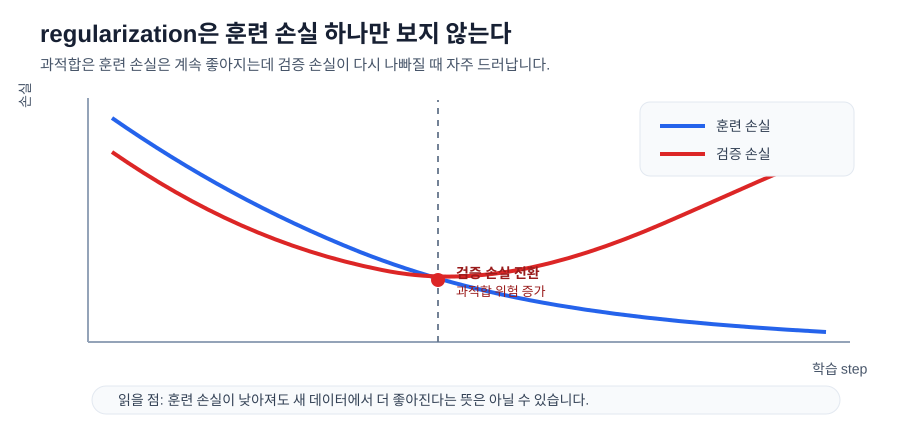

# P5-8.1 정규화(regularization)

Section ID: `P5-8.1`
Version: `v2026.07.16`

P5-7장에서는 optimizer가 gradient를 실제 업데이트로 바꾸는 규칙이라는 점을 보았습니다. 하지만 optimizer가 잘 작동한다고 해서 항상 좋은 모델이 되는 것은 아닙니다. 여기서 바로 다음 질문이 생깁니다.

모델이 학습 데이터에는 아주 잘 맞는데, 새로운 데이터에서는 잘 안 맞는다면 무엇을 해야 하는가?

이 질문에 답하는 핵심 개념 중 하나가 정규화(regularization)입니다.

정규화는 모델이 학습 데이터에만 과하게 맞추지 않도록, 학습 과정에 제약이나 비용을 추가하는 생각이다.

과적합 억제와 normalization을 다시 구분해야 할 때는 개념사전의 [정규화(regularization)](../../../reference/concept-glossary.md#regularization) 항목으로 돌아갑니다.

## 이 절의 범위

- 정규화는 왜 필요한가?
- 과적합(overfitting)과 어떤 관계가 있는가?
- 정규화는 단순한 벌점(penalty)만 뜻하는가?
- 딥러닝에서 정규화를 어떤 넓은 관점으로 읽으면 좋은가?

이 절에서는 다음 내용을 깊게 다루지 않습니다.

- L1, L2의 상세 수식 유도
- weight decay의 프레임워크 구현 차이
- data augmentation, early stopping의 세부 튜닝

드롭아웃(dropout)은 P5-8.2에서 별도 절로 이어서 다루고, 학습 모드와 평가 모드의 계산 차이는 P5-6.4에서 다시 연결합니다. weight decay의 프레임워크 구현 차이와 data augmentation, early stopping의 세부 튜닝은 이 책의 현재 본편 범위 밖에 둡니다.

이 절은 `optimizer 다음에 붙는 또 하나의 설정`으로만 보지 말고, `업데이트 규칙`과 `선호하는 해의 성질`을 갈라 읽는 절로 보는 편이 더 안전합니다.

| 지금 절에서 구분할 것 | 왜 중요한가 |
| --- | --- |
| optimizer | gradient를 보고 실제로 어떤 보폭으로 움직일지 정하는 절차이기 때문입니다. |
| regularization | 그 움직임이 너무 복잡한 해법으로 가지 않게 제약을 주는 관점이기 때문입니다. |
| normalization | 과적합 억제와 달리 값의 스케일과 분포를 다루기 쉽게 맞추는 질문이기 때문입니다. |

## 이 절의 목표

- 정규화를 `과적합을 줄이기 위한 제약`으로 설명할 수 있습니다.
- optimizer와 regularization의 역할 차이를 구분할 수 있습니다.
- regularization과 normalization이 왜 다른 질문에 답하는지 설명할 수 있습니다.
- 정규화가 손실 함수, 모델 크기, 데이터 양과 어떤 관계가 있는지 말할 수 있습니다.
- 실행 가능한 Python 예제로 벌점이 업데이트 크기에 어떤 영향을 주는지 확인할 수 있습니다.

## regularization과 normalization은 왜 다른가

이 절에서 말하는 정규화는 regularization입니다. 그런데 실무에서는 `normalize`, `normalization`이라는 말도 자주 나와서 처음 읽을 때 쉽게 섞입니다.

두 말은 이름이 비슷하지만, 겨냥하는 질문이 다릅니다.

| 항목 | regularization | normalization |
| --- | --- | --- |
| 먼저 답하려는 질문 | 모델이 너무 과하게 외우지 않게 하려면? | 입력값이나 중간값의 스케일을 더 다루기 쉽게 맞추려면? |
| 주된 관심 | 일반화(generalization), 과적합 억제 | 값의 범위, 분포, 학습 안정성 |
| 대표 예 | L2 penalty, dropout, early stopping | 입력 정규화, batch normalization, layer normalization |

즉, regularization은 `어떤 해를 덜 좋아하게 만들 것인가`에 가깝고, normalization은 `값을 어떤 범위와 분포로 다루기 쉽게 만들 것인가`에 더 가깝습니다.

물론 실제 딥러닝에서는 둘이 완전히 떨어져 있지 않습니다. 예를 들어 batch normalization은 계산 안정성과 학습 속도에 더 직접 연결되지만, 결과적으로 regularization 비슷한 효과가 함께 관찰되기도 합니다. 그래도 입문 단계에서는 먼저 다음처럼 나누는 편이 안전합니다.

- regularization: `과하게 외우지 않게 묶는 장치`
- normalization: `값의 스케일과 분포를 다루기 쉽게 맞추는 장치`

## 왜 정규화가 필요한가

딥러닝 모델은 표현력이 큽니다. 이 말은 강력하다는 뜻이기도 하지만, 동시에 학습 데이터의 우연한 패턴이나 잡음(noise)까지 따라가 버릴 위험이 있다는 뜻이기도 합니다.

예를 들어:

- 훈련 데이터(training data)에서는 손실이 계속 줄어듭니다
- 그런데 검증 데이터(validation data)에서는 어느 순간부터 성능이 더 좋아지지 않거나 오히려 나빠집니다

이런 상황은 Part 4에서 본 과적합(overfitting)과 연결됩니다.

정규화는 바로 이 지점에서 등장합니다. 모델에게 `훈련 데이터에 맞추되, 너무 복잡하게 맞추지는 말라`는 제약을 거는 것입니다.

이 상황은 곡선으로 보면 더 쉽습니다. 훈련 손실은 계속 내려가는데 검증 손실이 어느 순간부터 다시 올라가면, 모델이 훈련 데이터의 세부 패턴을 더 잘 외우는 쪽으로 가고 있을 수 있습니다.



이 그래프에서 regularization이 보려는 것은 훈련 손실 최저점 하나가 아닙니다. 새 데이터에서의 손실이 함께 좋아지는지, 아니면 훈련 데이터에만 더 잘 맞는 방향으로 간극이 벌어지는지를 같이 보는 것이 핵심입니다.

## 정규화는 무엇을 막으려 하나

여기서는 정규화의 목적을 다음 세 줄로 이해하면 됩니다.

- 너무 큰 파라미터에 과하게 의존하지 않게 한다
- 특정 샘플의 우연한 패턴만 외우지 않게 한다
- 새로운 데이터에서도 더 안정적으로 작동하게 돕는다

즉, 정규화는 단순히 손실을 낮추는 것이 아니라, `어떤 방식으로 낮출 것인가`까지 제한하는 생각입니다.

## 정규화는 벌점만 뜻하는가

입문 교과서에서는 정규화를 자주 `손실 함수에 벌점(penalty) 항을 더하는 방식`으로 소개합니다. 이 설명은 중요하지만, 그 자체로는 다소 좁습니다.

딥러닝에서는 regularization을 더 넓게 보는 편이 좋습니다.

예를 들어 다음도 넓은 의미의 regularization으로 읽을 수 있습니다.

- 가중치 크기를 제어하는 penalty
- dropout처럼 일부 연결을 무작위로 끊는 방식
- early stopping처럼 너무 오래 학습하지 않는 전략
- data augmentation처럼 입력 다양성을 늘리는 방식

즉, regularization은 `하나의 공식`보다 `과적합을 줄이려는 설계 철학`에 가깝습니다.

## 손실 함수와 어떤 관계가 있는가

정규화는 종종 손실 함수와 함께 나타납니다.

\[
total\ loss = data\ loss + regularization\ term
\]

이 식을 다음처럼 읽으면 충분합니다.

- `data loss`: 예측이 정답과 얼마나 다른가
- `regularization term`: 모델이 너무 복잡한 방향으로 가지 않는가

즉, regularization은 `정답을 맞추는 비용` 외에 `너무 과한 복잡성을 쓰는 비용`을 더 붙이는 생각입니다.

이 때문에 optimizer는 이제 단순한 원래 손실이 아니라, regularization이 반영된 전체 목적을 줄이게 됩니다.

이 연결을 아주 짧게 압축하면 다음과 같습니다.

```mermaid
--8<-- "assets/part-05/chapter-08/regularization-role-flow-ko.mmd"
```

이 도식에서 먼저 확인할 결과는, regularization이 `오차를 대신 계산하는 다른 손실`이 아니라, data loss 옆에 붙어 전체 목적 함수를 바꾸고 그 결과 모델이 덜 과격한 해를 선호하게 만드는 장치라는 점입니다.

## optimizer와 regularization은 무엇이 다른가

독자는 optimizer와 regularization을 둘 다 `학습을 조정하는 것`으로 느낄 수 있습니다. 하지만 역할은 다릅니다.

| 항목 | 역할 |
| --- | --- |
| optimizer | gradient를 바탕으로 파라미터를 어떻게 업데이트할지 정함 |
| regularization | 어떤 해를 선호하고 어떤 복잡성을 피할지 제약을 줌 |

즉:

- optimizer는 `어떻게 움직일까`
- regularization은 `어떤 방향을 덜 좋아할까`

를 다룹니다.

이 구분이 잡혀야 이후 weight decay, dropout, early stopping을 하나의 관점으로 묶기 쉽습니다.

## 사례 및 예시

### 같은 훈련 성능을 다른 기준으로 다시 읽는 경우

작은 표 데이터로 고객 이탈을 예측하는 모델을 만든다고 해 보겠습니다. 훈련 데이터에서는 두 모델이 모두 비슷하게 잘 맞습니다. 그런데 모델 A는 특정 열 하나의 값이 조금만 바뀌어도 예측이 크게 흔들리고, 모델 B는 비슷한 훈련 성능을 내면서도 입력 변화에 덜 과격하게 반응합니다.

처음에는 훈련 손실이 더 낮은 쪽만 고르면 될 것처럼 보입니다. 하지만 새 데이터에서 버티는 모델을 고르려면 질문이 달라져야 합니다. `얼마나 잘 맞췄는가`만 볼 것이 아니라, `그 결과를 만들기 위해 얼마나 큰 가중치와 민감한 규칙을 썼는가`까지 봐야 합니다. regularization은 바로 이 지점에서 같은 학습 방향 안에서도 더 과격한 해를 덜 선호하게 만드는 기준으로 작동합니다.

이 사례에서 확인해야 할 결과는 훈련 점수 최고치가 아닙니다. 비슷하게 맞추는 두 해가 있을 때, 큰 가중치와 높은 민감도를 쓰는 해보다 새 데이터에서 덜 흔들릴 가능성이 큰 해를 고르는지입니다.

```mermaid
--8<-- "assets/part-05/chapter-08/regularization-case-reading-flow-ko.mmd"
```

사례를 이 흐름으로 읽으면 regularization과 normalization의 차이도 덜 헷갈립니다. 입력 열의 단위를 맞추고 값 범위를 다루기 쉽게 정리하는 일은 normalization에 가깝습니다. 반면 지금 사례에서 regularization이 보는 것은 `값을 어떤 범위로 바꿀 것인가`가 아니라, 모델이 훈련 데이터를 맞추기 위해 지나치게 큰 가중치나 민감한 규칙을 쓰는지를 제한하는 일입니다.

여기서 regularization의 핵심 비교를 한 장면으로 더 압축하면, `둘 다 훈련 데이터에는 비슷하게 맞지만 한쪽이 더 큰 가중치와 더 복잡한 경로를 쓰는 경우`입니다.

| 비교 질문 | 더 과격한 해 | 덜 과격한 해 |
| --- | --- | --- |
| 훈련 데이터에 맞는 정도 | 비슷하게 맞음 | 비슷하게 맞음 |
| 가중치 크기와 복잡도 | 더 큼 | 더 작음 |
| 입력 변화에 대한 민감도 | 더 큼 | 더 작음 |
| regularization이 선호하는 쪽 | 아님 | 맞음 |

```mermaid
--8<-- "assets/part-05/chapter-08/regularization-fit-complexity-compare-ko.mmd"
```

이 비교 도식에서 먼저 고정해야 할 점은 다음과 같습니다.

- regularization은 `정답을 맞추지 말라`가 아니라, 비슷하게 맞추는 두 해 사이에서 더 과격한 쪽을 덜 선호하게 만드는 장치입니다.
- 그래서 비교 기준은 `오차가 0에 더 가까운가` 하나가 아니라, `그 오차를 만들기 위해 얼마나 큰 가중치와 복잡한 해를 썼는가`까지 포함해야 합니다.
- 이 관점이 잡혀야 아래 예제를 `손실을 방해하는 항`이 아니라 `덜 과격한 해를 선호하게 만드는 항`으로 읽을 수 있습니다.

## 연습 및 예제

이번 예제의 목표는 regularization 항이 들어가면 업데이트가 `정답만 맞추는 방향`에서 조금 더 보수적으로 바뀔 수 있음을 확인하는 것입니다. 한 번의 업데이트만 보는 대신, 여러 step에서 가중치가 얼마나 빨리 커지는지 비교해 보겠습니다.

입력:

- 현재 가중치 `w`
- 데이터 손실에서 나온 gradient
- regularization 강도 `lambda_value`

출력:

- regularization 없이 업데이트한 결과
- regularization을 더한 뒤 업데이트한 결과
- step이 반복될수록 가중치 크기 차이가 어떻게 벌어지는지에 대한 비교
- 같은 입력 변화에 대해 예측이 얼마나 민감하게 흔들릴지도 비교

문제 상황:

- regularization은 정의만 보면 막연하므로, 같은 gradient에 추가 항이 붙을 때 가중치 크기가 어떻게 달라지는지 직접 볼 필요가 있다
- 가중치 크기 차이가 실제 예측 민감도 차이로 이어지는지도 같이 봐야 한다

확인할 개념:

- regularization은 데이터 gradient 외에 가중치 크기를 줄이려는 방향을 더한다
- step이 반복될수록 규제가 있는 쪽이 더 작은 가중치를 유지하는 경향을 보일 수 있다
- 더 작은 가중치를 유지하는 쪽이 입력 변화에 덜 과격하게 반응할 수 있다

입력(input):

위에 정리한 초기 가중치, 데이터 gradient, 학습률, regularization 강도를 사용합니다.

코드를 보기 전에 먼저 어느 쪽이 더 큰 가중치와 더 큰 예측 흔들림을 만들지 예상해 보면 좋습니다.

| 비교 항목 | 먼저 예상해 볼 비교 | 예상 이유 |
| --- | --- | --- |
| `without_reg` vs `with_reg` 가중치 크기 | `without_reg`가 더 빨리 커질 가능성 | 데이터 gradient만 따라가면 큰 가중치를 직접 제어하는 항이 없기 때문입니다. |
| 입력 변화에 대한 예측 민감도 | `without_reg`가 더 크게 흔들릴 가능성 | 가중치가 더 크면 같은 입력 변화에도 출력 변화가 더 커집니다. |

이 표의 목적은 `가중치 크기`와 `예측 흔들림`을 함께 읽는 것입니다.

```python
initial_w = 2.5
data_gradient = -4.0
learning_rate = 0.1
lambda_value = 0.2
steps = 3

w_without_reg = initial_w
w_with_reg = initial_w
base_x = 1.0
shifted_x = 1.2

for step in range(1, steps + 1):
    w_without_reg = w_without_reg - learning_rate * data_gradient

    reg_gradient = 2 * lambda_value * w_with_reg
    total_gradient = data_gradient + reg_gradient
    w_with_reg = w_with_reg - learning_rate * total_gradient

    print(f"[step {step}]")
    print("without_reg =", round(w_without_reg, 3))
    print("reg_gradient =", round(reg_gradient, 3))
    print("total_gradient =", round(total_gradient, 3))
    print("with_reg =", round(w_with_reg, 3))
    print("---")

without_base = round(base_x * w_without_reg, 3)
without_shifted = round(shifted_x * w_without_reg, 3)
with_base = round(base_x * w_with_reg, 3)
with_shifted = round(shifted_x * w_with_reg, 3)

print("prediction_without_reg =", [without_base, without_shifted])
print("prediction_with_reg =", [with_base, with_shifted])
print("sensitivity_without_reg =", round(without_shifted - without_base, 3))
print("sensitivity_with_reg =", round(with_shifted - with_base, 3))
```

출력에서는 각 step에서 without_reg와 with_reg가 얼마나 벌어지는지, 그 사이에 reg_gradient가 어떻게 더해지는지부터 보면 됩니다.

```text
[step 1]
without_reg = 2.9
reg_gradient = 1.0
total_gradient = -3.0
with_reg = 2.8
---
[step 2]
without_reg = 3.3
reg_gradient = 1.12
total_gradient = -2.88
with_reg = 3.088
---
[step 3]
without_reg = 3.7
reg_gradient = 1.235
total_gradient = -2.765
with_reg = 3.365
---
prediction_without_reg = [3.7, 4.44]
prediction_with_reg = [3.365, 4.038]
sensitivity_without_reg = 0.74
sensitivity_with_reg = 0.673
```

- regularization이 없으면 가중치는 더 크게 증가합니다
- regularization 항이 들어오면 step이 반복될수록 증가 폭이 조금씩 더 줄어듭니다
- 즉, regularization은 단순히 성능을 깎는 것이 아니라 `덜 과격한 해`를 선호하게 만듭니다

| 비교 | 지금 읽어야 할 핵심 |
| --- | --- |
| `without_reg` | 가중치가 더 빠르게 커져 같은 입력 변화에도 출력이 더 크게 흔들립니다. |
| `with_reg` | 가중치 증가를 조금 더 눌러 예측 민감도도 상대적으로 완만해집니다. |

출력 숫자를 읽을 때도 `오차 감소`와 `덜 과격한 해 선호`를 분리해서 봐야 합니다.

| 비교 | 출력에서 먼저 보이는 것 | 오차만 보면 남기 쉬운 해석 | regularization까지 보면 바뀌는 해석 |
| --- | --- | --- | --- |
| `without_reg` | step이 갈수록 가중치가 더 빨리 커지고 민감도도 `0.74`까지 올라갑니다. | 더 빨리 움직였으니 더 좋은 학습처럼 보기 쉽습니다. | 큰 가중치와 높은 민감도를 그대로 허용해, 특정 입력 변화에 더 과격하게 반응하는 해로 가고 있습니다. |
| `with_reg` | step이 갈수록 증가 폭이 조금씩 줄고 민감도도 `0.673`으로 더 낮습니다. | 손실을 덜 공격적으로 줄이니 덜 좋은 학습처럼 보기 쉽습니다. | 같은 방향 안에서도 더 작은 가중치와 더 완만한 반응을 선호해, 덜 과격한 해를 유지하고 있습니다. |

즉, 이 예제에서 독자가 붙잡아야 할 질문은 `정규화가 손실을 못 줄이게 하는가`가 아니라, `같은 학습 방향 안에서 더 과격한 해 대신 덜 과격한 해를 선호하게 만드는가`입니다.

정규화는 딥러닝 이전의 통계적 학습 이론(statistical learning theory)와도 깊게 연결됩니다. 모델이 너무 복잡해지면 훈련 데이터에는 잘 맞지만 일반화가 나빠질 수 있다는 문제는 오래전부터 핵심 주제였습니다.

딥러닝 시대에 regularization이 더 중요해진 이유는 분명합니다.

- 모델 용량(capacity)이 매우 커졌고
- 데이터 분포의 편향과 잡음 문제도 여전하며
- 높은 훈련 성능만으로는 좋은 모델을 보장할 수 없기 때문입니다

커리큘럼 관점에서 이 절은 optimizer 다음에 오는 것이 자연스럽습니다.

- 바로 앞의 P5-7.1, P5-7.2가 `어떻게 내려갈 것인가`를 다루었다면
- optimizer는 잘 내려가는 방법을 다루고
- regularization은 어디까지 내려가게 허용할지, 어떤 해를 더 선호할지를 다룹니다

즉, 두 절은 모두 학습을 조정하지만 질문이 다릅니다.

## 언제 regularization 관점으로 먼저 읽는가

이 절을 꺼내야 하는 시점은 `학습이 잘된다`는 말이 `훈련 데이터에만 잘 맞는다`와 섞여 보이기 시작할 때입니다.

| 먼저 보이는 문제 장면 | regularization 관점이 먼저 유용한 이유 | 바로 다음에 넘길 질문 |
| --- | --- | --- |
| 훈련 성능은 높은데 검증 성능이 흔들린다 | 일반화 문제를 `더 잘 맞추는가`와 분리해 읽을 수 있습니다. | 어떤 regularization 기법이 구체적으로 이 문제를 건드리는지 봐야 합니다. |
| optimizer와 normalization이 모두 비슷한 조정 장치처럼 보인다 | update 규칙, 값 스케일 조정, 일반화 제약의 질문을 분리할 수 있습니다. | dropout 같은 대표 regularization 기법으로 넘어가야 합니다. |
| 큰 모델이 특정 특징 하나에 과하게 기대는 것처럼 보인다 | 어떤 해를 덜 선호하게 만들지라는 regularization 감각을 고정할 수 있습니다. | 벌점 외의 구조적 regularization도 이어서 봐야 합니다. |
| 데이터가 적을수록 왜 더 조심해야 하는지 흐리다 | 과적합 억제 장치가 왜 작은 데이터에서 더 중요해지는지 설명할 수 있습니다. | dropout, early stopping 같은 실천 형태를 더 봐야 합니다. |

## 체크리스트

- 정규화(regularization)가 과적합(overfitting)을 줄이는 관점이라는 점을 설명할 수 있는가?
- 옵티마이저와 정규화가 서로 다른 질문에 답한다는 점을 구분할 수 있는가?
- regularization은 과적합을 줄이기 위한 제약이나 비용을 추가하는 생각이라는 점을 설명할 수 있는가?
- 왜 optimizer가 잘 작동한다고 해서 일반화가 자동으로 좋아지는 것은 아니라는 점을 설명할 수 있는가?
- regularization과 normalization의 차이를 `과적합 억제`와 `값 스케일/분포 정리`로 구분할 수 있는가?
- regularization은 벌점 공식만이 아니라 더 넓은 설계 철학으로 볼 수 있다는 점을 말할 수 있는가?
- optimizer는 업데이트 방법을, regularization은 선호하는 해의 성질을 조정한다는 점을 설명할 수 있는가?
- optimizer가 잘 돌아가도 검증 성능이 흔들릴 때, 일반화 문제를 regularization 관점에서 먼저 떠올릴 수 있는가?
- 이 절 다음에는 regularization의 대표 사례로 dropout을 봐야 한다는 흐름을 알고 있는가?

## 출처와 참고 자료

- Trevor Hastie, Robert Tibshirani, Jerome Friedman, `The Elements of Statistical Learning`, 2nd ed., Springer, 2009, 확인 날짜: 2026-06-29.
- Ian Goodfellow, Yoshua Bengio, Aaron Courville, `Deep Learning`, MIT Press, 2016, 확인 날짜: 2026-06-29. [https://www.deeplearningbook.org/](https://www.deeplearningbook.org/){: target="_blank" rel="noopener noreferrer" }
- Christopher M. Bishop, `Pattern Recognition and Machine Learning`, Springer, 2006, 확인 날짜: 2026-06-29.
