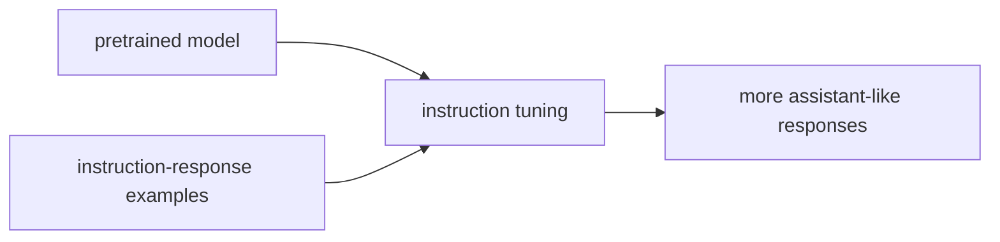

# P5-8.1 지시 튜닝(instruction tuning)

P5-7.2에서는 LoRA 같은 효율적 조정 방식이 왜 실무에서 중요한지 보았습니다. 그러면 이제 다음 질문이 자연스럽게 이어집니다.

모델이 단순히 문장을 이어 쓰는 수준을 넘어, 사용자의 지시를 더 잘 따르도록 만드는 과정은 무엇인가?

이 절은 그 질문에 답합니다.

지시 튜닝(instruction tuning)은 모델이 자연어 지시를 더 잘 이해하고, 그 형식에 맞게 응답하도록 추가로 조정하는 과정이다.

같은 말을 더 쉽게 바꾸면 다음과 같습니다.

지시 튜닝은 모델이 단순히 이어 쓰는 것을 넘어서, 사람의 요청 방식에 맞춰 답하는 습관을 더 강하게 만드는 단계다.

## 이 절의 범위

이 절은 다음 질문에 답합니다.

- 지시 튜닝은 무엇을 바꾸려는가?
- 사전학습, 파인튜닝, 지시 튜닝은 어떻게 이어지는가?
- 왜 대화형 LLM 경험에서 지시 튜닝이 중요하게 느껴지는가?

이 절에서는 다음 내용을 깊게 다루지 않습니다.

- RLHF 세부 절차
- preference dataset 구축 방법
- reward model 학습 수식

지시를 따르도록 조정하는 큰 흐름은 여기서 잡고, 왜 그 다음에 정렬 문제가 남는지는 바로 다음 P5-8.2 정렬의 기본 문제에서 다시 회수합니다. RLHF와 reward model의 구체 절차는 이 책의 현재 입문 본편 범위를 넘어가므로, 여기서는 `지시 따르기 조정층`이라는 역할까지만 다룹니다.

이 절의 목적은 대화형 LLM의 사용자 경험을 `지시 따르기 능력`이라는 관점에서 설명하고, 이것이 사전학습과는 다른 추가 조정 층이라는 점을 분명히 하는 데 있습니다.

## 이 절의 목표

- 지시 튜닝을 입문 수준에서 설명할 수 있습니다.
- 사전학습과 파인튜닝, 지시 튜닝의 차이를 다시 정리할 수 있습니다.
- 왜 대화형 LLM이 일반 언어 모델과 다르게 느껴지는지 설명할 수 있습니다.
- 다음 절의 정렬(alignment) 문제로 자연스럽게 넘어갈 수 있습니다.

## 지시 튜닝은 무엇을 바꾸려 하나

사전학습된 모델은 넓은 언어 패턴을 학습합니다. 하지만 그것만으로는 사용자가 기대하는 방식으로 항상 반응하지는 않습니다.

먼저 다음 세 질문으로 읽으면 좋습니다.

| 질문 | 짧은 답 |
| --- | --- |
| 왜 이런 조정이 또 필요한가? | 언어를 아는 것과 지시를 잘 따르는 것은 같지 않아서 |
| 무엇을 더 잘하게 만들려는가? | 요청 형식 이해, 답변 구조, 한계 고지 |
| 어디가 달라지는가? | 다음 토큰 예측 자체보다 응답 습관과 형식 적합성 |

예를 들어 사용자는 다음처럼 기대합니다.

- 질문에는 답을 해 주기
- 표를 요청하면 표 형식으로 정리하기
- 단계별 설명을 요청하면 순서대로 풀기
- 불가능한 요청에는 한계를 분명히 말하기

이런 기대는 단순히 다음 토큰을 잘 예측하는 것만으로는 충분히 보장되지 않습니다. 지시 튜닝은 바로 이런 `사용자 지시 형식`에 맞는 반응 습관을 더 강하게 만드는 과정으로 볼 수 있습니다.

즉, 이 절의 핵심은 `말을 이어 쓰는 능력`과 `요청에 맞게 답하는 능력`을 분리해 보는 데 있습니다.

## 사전학습과 어떻게 다른가

이 차이는 다시 분리해 두는 것이 좋습니다.

| 단계 | 핵심 질문 |
| --- | --- |
| 사전학습(pretraining) | 일반 언어 패턴을 먼저 배우는가? |
| 파인튜닝(fine-tuning) | 특정 과업이나 도메인에 맞게 조정하는가? |
| 지시 튜닝(instruction tuning) | 자연어 지시를 더 잘 따르도록 조정하는가? |

지시 튜닝은 보통 `사용자의 요청 형식`과 `바람직한 답변 형식`을 더 잘 맞추는 방향으로 설명할 수 있습니다.

즉, 다음처럼 정리하면 충분합니다.

`사전학습은 언어를 넓게 배우는 단계이고, 지시 튜닝은 사람의 요청 방식에 더 잘 반응하도록 답변 습관을 조정하는 단계다.`

여기에 파인튜닝까지 함께 놓으면 다음처럼 읽을 수 있습니다.

- 사전학습: 언어의 넓은 기반
- 파인튜닝: 특정 과업과 도메인 적응
- 지시 튜닝: 사용자 요청 형식에 맞는 응답 적응

## 왜 대화형 LLM에서 중요하게 느껴지나

대화형 LLM은 사용자가 자연어로 바로 요청합니다. 따라서 사용자는 모델이 다음과 같은 것을 기대합니다.

- 내 질문을 이해한 듯한 반응
- 요청 형식에 맞춘 답변
- 장황하지 않거나, 반대로 충분히 자세한 답변
- 단계, 요약, 예시, 경고의 구조화

이 경험은 단순한 언어 모델보다 `assistant-like behavior`에 더 가깝습니다. 지시 튜닝은 바로 이 변화를 설명하는 중요한 층입니다.

독자 입장에서는 이 지점이 가장 체감됩니다. 같은 모델 계열이라도 어떤 것은 `그럴듯한 문장을 이어 가는 느낌`이 강하고, 어떤 것은 `내 요청을 구조적으로 따라오는 느낌`이 강합니다. 이 차이를 설명할 때 지시 튜닝이 필요합니다.

## 지시 튜닝이 만능은 아니다

하지만 이 절에서도 과장해서는 안 됩니다.

지시 튜닝이 된다고 해서:

- 사실성이 자동 보장되거나
- 편향이 자동 제거되거나
- 위험한 요청을 완전히 스스로 해결하거나
- 외부 최신 정보를 자동으로 반영하는 것

은 아닙니다.

더 안전한 설명은 다음입니다.

`지시 튜닝은 사용자 요청 형식에 맞는 반응을 강화하지만, 사실 검증·최신성·안전성 전체를 단독으로 해결하지는 않는다.`

이 경계는 중요합니다. 사용자가 정중하고 구조적인 답을 받았다고 해서, 그 답이 자동으로 더 사실적이거나 더 안전해진 것은 아니기 때문입니다.

## 아주 단순하게 그리면



이 도식은 지시 튜닝이 `언어 모델 본체` 위에 `응답 형식 조정`이 더해지는 흐름임을 보여 줍니다.

이 그림에서 읽어야 할 핵심은 다음입니다.

- 기반 모델은 이미 언어를 알고 있고
- 추가 예시는 `어떻게 답해야 하는가`를 보여 주며
- 결과는 `assistant처럼 보이는 응답`에 더 가까워집니다

## 사례로 보기

### 사례 1. 요약 요청

팀 문서를 요약할 때 사용자가 `핵심만 세 줄로 정리해 달라`고 요청했다고 가정해 보겠습니다. 사람은 이런 요청을 들으면 보통 `내용만 맞으면 되겠지`라고 생각할 수 있지만, 실제 사용자는 길이와 형식도 함께 기대합니다. 지시 조정이 약한 모델은 문서를 설명하는 긴 문단을 이어 쓰기만 하고, 세 줄이라는 형식을 맞추지 못할 수 있습니다. 지시 튜닝은 `무엇을 말할지`뿐 아니라 `어떤 길이와 구조로 답할지`를 함께 맞추도록 도와, 같은 내용이라도 사용자가 바로 가져다 쓸 수 있는 응답으로 바꾸는 데 기여합니다.

### 사례 2. 단계별 설명

사내 교육 자료를 만들면서 `신입 직원이 따라 할 수 있게 3단계로 설명해 달라`고 요청할 수 있습니다. 사람도 정보를 알고 있다고 해서 항상 `3단계`, `따라 하기 쉬운 순서`를 자동으로 맞추는 것은 아닙니다. 사람은 모델이 내용을 알고 있으면 구조도 자연스럽게 맞출 것이라고 느끼기 쉽지만, 일반 언어 모델은 설명 순서를 임의로 섞거나 단계 수를 맞추지 못할 수 있습니다. 지시 튜닝된 모델은 `단계 수`, `설명 순서`, `독자 수준에 맞춘 전개` 같은 요구를 더 자연스럽게 반영하는 쪽으로 조정됩니다.

### 사례 3. 거절과 한계 고지

사용자가 내부 권한이 없는 문서를 보여 달라고 하거나, 확인할 근거 없이 단정적 답을 요구할 수 있습니다. 사람은 모델이 친절하게 잘 답해 주는 것이 항상 좋은 응답이라고 느끼기 쉽지만, 이때 무조건 답을 이어 쓰기만 하면 잘못된 정보나 권한 위반으로 이어질 수 있습니다. 지시 튜닝은 `할 수 없는 이유`, `확인 가능한 대안`, `다음에 필요한 정보`를 구조적으로 말하는 응답 습관을 강화하는 데에도 쓰입니다.

세 사례를 한 줄로 다시 묶으면 다음과 같습니다.

| 상황 | 지시 튜닝이 기여하는 지점 |
| --- | --- |
| 요약 요청 | 요청 형식에 맞춘 길이와 구조 |
| 단계별 설명 | 독자가 원하는 전개 순서 반영 |
| 거절과 한계 고지 | 불가 사유와 대안을 구조적으로 제시 |

## 작은 Python 예제로 보기

이번 예제의 목표는 실제 지시 튜닝 학습이 아니라, 같은 질문을 두고 `일반 응답`과 `지시 형식에 맞춘 응답`의 차이를 감각적으로 보는 것입니다.

입력:

- 같은 질문
- 일반 응답 형태
- 지시 형식이 반영된 응답 형태

출력:

- 두 응답의 구조 차이

```python
question = "이 문서를 세 줄로 요약해 주세요."

base_style = "이 문서는 여러 내용을 다루고 있으며 전반적으로 중요합니다."
instruction_tuned_style = [
    "1. 문서의 핵심 주제를 짧게 정리합니다.",
    "2. 중요한 근거와 결론을 남깁니다.",
    "3. 불필요한 세부는 줄여 읽기 쉽게 만듭니다.",
]

print("question =", question)
print("base_style =", base_style)
print("instruction_tuned_style =", instruction_tuned_style)
```

실행 결과 예시는 다음처럼 읽을 수 있습니다.

```text
question = 이 문서를 세 줄로 요약해 주세요.
base_style = 이 문서는 여러 내용을 다루고 있으며 전반적으로 중요합니다.
instruction_tuned_style = ['1. 문서의 핵심 주제를 짧게 정리합니다.', '2. 중요한 근거와 결론을 남깁니다.', '3. 불필요한 세부는 줄여 읽기 쉽게 만듭니다.']
```

이 예제는 실제 성능을 보여 주는 것이 아니라, 지시 튜닝이 `답의 구조와 반응 방식`을 바꾸는 층이라는 점을 보여 줍니다.

이 예제에서 여기서 읽어야 할 핵심은 다음입니다.

- 질문은 같아도
- 일반 응답은 `그럴듯한 한 문장`에 머물 수 있고
- 지시 튜닝된 응답은 `요청한 형식`에 맞춰 더 구조화될 수 있습니다

즉, 지시 튜닝은 종종 `무엇을 아는가`보다 `어떻게 답하는가`를 바꾸는 층으로 이해하는 편이 좋습니다.

## 역사와 커리큘럼 관점

LLM이 널리 대중에게 인식되기 시작한 중요한 이유 중 하나는 `지시를 따르는 경험`이 훨씬 자연스러워졌기 때문입니다. 이는 단순히 모델 크기만 커졌기 때문이 아니라, 사람이 기대하는 응답 형식에 더 맞도록 조정하는 연구와 제품화 흐름이 함께 있었기 때문입니다.

이 역사 설명을 다음처럼 받아들이면 충분합니다.

`사람들이 LLM을 단순 자동완성이 아니라 대화 도구처럼 느끼기 시작한 데에는, 모델 크기뿐 아니라 지시를 따르게 만드는 조정 단계도 함께 작용했다.`

커리큘럼 관점에서 이 절이 중요한 이유는 다음과 같습니다.

- 생성형 AI를 단순 자동완성으로만 이해하는 시각을 넘어서게 하고
- assistant behavior를 별도 층으로 분리하게 하며
- 다음 절의 alignment 문제를 `왜 필요한가`라는 질문과 연결해 주기 때문입니다

## 다음 절과의 연결

여기까지 오면 다음 질문이 남습니다.

- 사용자의 지시를 잘 따르는 것과, 안전하고 책임 있는 응답을 하는 것은 같은 문제인가?
- 모델을 유용하게 만드는 것과 위험을 줄이는 것을 어떻게 함께 다루는가?

이 질문은 P5-8.2 정렬(alignment)의 기본 문제로 이어집니다.

## 이 절에서 기억할 관점

- 지시 튜닝은 자연어 지시를 더 잘 따르는 응답 형식을 강화하는 조정 단계입니다.
- 사전학습은 언어 패턴 학습이고, 지시 튜닝은 assistant-like response 조정에 가깝습니다.
- 지시 튜닝은 사용자 경험을 크게 바꾸지만, 사실성·최신성·안전성 전체를 혼자 해결하지는 않습니다.
- 이 절은 다음 절의 alignment 논의를 이해하기 위한 직접 기반입니다.

## 체크리스트

- 지시 튜닝을 입문 수준에서 설명할 수 있는가?
- 사전학습, 파인튜닝, 지시 튜닝의 차이를 다시 말할 수 있는가?
- 왜 대화형 LLM이 일반 언어 모델과 다르게 느껴지는지 설명할 수 있는가?
- 왜 다음 절에서 alignment 문제가 등장하는지 설명할 수 있는가?

## 출처와 참고 자료

- Long Ouyang et al., `Training language models to follow instructions with human feedback`, arXiv, 2022, 확인 날짜: 2026-06-29.
- Tom B. Brown et al., `Language Models are Few-Shot Learners`, arXiv, 2020, 확인 날짜: 2026-06-29.
- OpenAI, 공식 문서와 연구 소개 자료, 확인 날짜: 2026-06-29.
