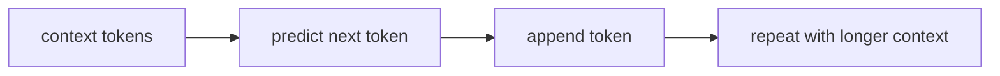

# P5-8.1 다음 토큰 예측(next-token prediction)

P5-7.2에서는 LLM 설명에서 왜 `스케일(scale)`이라는 말이 자주 등장하는지 보았습니다. 이제 질문을 더 좁힐 차례입니다.

그렇게 큰 모델은 학습할 때 정확히 무엇을 반복하는가?

LLM을 처음 접할 때 가장 많이 듣는 답은 다음입니다.

LLM은 다음 토큰을 예측하도록 학습된다.

이 문장은 맞지만, 너무 짧으면 오해를 부릅니다. 많은 초심자는 이 말을 듣고 `그럼 단순 자동완성 아닌가?`라고 생각합니다. 이 절의 목적은 바로 그 질문을 더 정확한 수준으로 정리하는 데 있습니다.

## 이 절의 범위

이 절은 다음 질문에 답합니다.

- 다음 토큰 예측은 정확히 무엇을 예측하는가?
- 왜 이 단순해 보이는 목표가 긴 문장, 요약, 질의응답, 코드 생성으로 이어질 수 있는가?
- 다음 토큰 예측만으로 무엇을 설명할 수 있고, 무엇은 설명하지 못하는가?

이 절은 다음 내용은 깊게 다루지 않습니다.

- cross-entropy 손실 수식
- beam search나 sampling 세부 전략
- RLHF, preference optimization 같은 후속 정렬 단계

이 절의 목적은 `LLM의 기본 학습 목표`를 초심자도 설명할 수 있게 만드는 것입니다.

## 이 절의 목표

- 다음 토큰 예측을 토큰 단위로 설명할 수 있습니다.
- 문장 생성이 한 번에 완성되는 것이 아니라 순차적으로 이어진다는 점을 설명할 수 있습니다.
- 왜 단순한 예측 목표가 복잡한 언어 행동으로 이어질 수 있는지 말할 수 있습니다.
- 이 절만으로 LLM 전체를 다 설명할 수 없다는 점을 구분할 수 있습니다.

## 다음 토큰 예측은 무엇을 뜻하나

LLM은 학습 중에 긴 텍스트를 보고, 현재까지 주어진 토큰 뒤에 어떤 토큰이 올 가능성이 높은지를 반복해서 맞추도록 조정됩니다.

예를 들어 다음처럼 볼 수 있습니다.

- 입력 맥락(context): `오늘 날씨가 매우`
- 다음 후보 토큰: `좋다`, `춥다`, `맑다`, ...

이때 모델은 `현재까지의 토큰들`을 바탕으로 `바로 다음 토큰`의 확률 분포를 계산합니다.

중요한 점은 모델이 처음부터 문장 전체를 통째로 꺼내는 것이 아니라는 점입니다.

`현재까지의 맥락을 보고, 다음 한 조각을 예측하고, 그 조각을 다시 맥락에 붙이는 과정`이 반복됩니다.

## 왜 토큰(token) 단위인가

LLM은 보통 글자를 그대로 다루지 않고 토큰(token) 단위로 다룹니다. 이 책의 앞 절에서 보았듯, 토큰은 단어 전체일 수도 있고, 단어 일부일 수도 있고, 기호 조각일 수도 있습니다.

그래서 `다음 단어 예측`이라고 하면 엄밀하지 않은 경우가 많습니다. 더 안전한 표현은 다음입니다.

`LLM은 다음 토큰(next token)을 예측하도록 학습된다.`

이 차이를 구분해야 나중에 토큰화(tokenization), 문맥 길이(context window), 비용 계산을 함께 이해할 수 있습니다.

## 왜 단순한 목표가 복잡한 기능으로 이어지나

여기서 초심자가 가장 많이 멈춥니다.

`다음 한 조각 맞히기`만 반복하는데, 왜 요약도 하고 번역도 하고 코드도 작성할 수 있을까요?

핵심은 다음과 같습니다.

- 언어는 순차 구조를 갖고
- 문맥에 따라 다음 표현이 크게 달라지며
- 긴 문서와 다양한 장르를 많이 보면
- 다음 토큰을 잘 맞히기 위해 문법, 표현, 관계, 형식, 일부 세계 지식을 함께 반영해야 하기 때문입니다

즉, 학습 목표 자체는 국소적(local)으로 보이지만, 그 목표를 잘 수행하려면 넓은 패턴을 내부적으로 다뤄야 합니다.

이 점이 LLM을 단순 자동완성과 완전히 같은 것으로만 보기 어려운 이유입니다.

## 자동완성과 같고, 또 다르다

초심자 설명에서는 자동완성 비유가 유용합니다. 다만 거기서 멈추면 부족합니다.

같은 점:

- 지금까지 입력된 맥락을 보고 다음 출력을 예측합니다.
- 한 조각씩 이어 붙이며 결과를 만듭니다.

다른 점:

- 훨씬 긴 문맥을 다룹니다.
- 다양한 문서 형식과 작업 지시를 함께 반영합니다.
- 단순 문장 이어쓰기처럼 보여도 요약, 분류, 설명, 변환 패턴이 같은 구조 안에 들어옵니다.

따라서 더 안전한 정리는 다음과 같습니다.

`LLM은 다음 토큰 예측 구조를 기반으로 하지만, 대규모 사전학습과 추가 조정을 거치며 매우 다양한 언어 작업 형태를 수행하게 된다.`

## 아주 단순하게 그리면



이 도식의 핵심은 생성이 `한 번에 끝나는 계산`이 아니라 `반복되는 순차 계산`이라는 점입니다.

## 사례로 보기

### 사례 1. 이메일 문장 이어쓰기

입력이 `안녕하세요, 문의하신 내용에 대해`라면 다음에는 설명, 사과, 안내 같은 표현이 뒤따를 가능성이 커집니다. 모델은 이런 패턴을 학습 중 반복적으로 봅니다.

### 사례 2. 요약

요약도 결국은 `지금까지의 요약 맥락 뒤에 어떤 표현이 자연스러운가`를 반복해서 생성하는 과정으로 볼 수 있습니다. 단, 그 전에 입력 문서의 핵심을 내부적으로 반영해야 더 나은 다음 토큰을 고를 수 있습니다.

### 사례 3. 코드 생성

코드도 토큰의 순차 구조를 가집니다. 함수 이름 뒤에는 괄호가 오고, 들여쓰기 맥락 뒤에는 특정 문장 패턴이 이어질 수 있습니다. LLM은 이런 코드 토큰 패턴도 다음 토큰 예측 구조 안에서 다룹니다.

## 작은 Python 예제로 보기

이번 예제의 목표는 실제 LLM을 구현하는 것이 아니라, `현재 맥락에서 다음 후보를 고르는 구조`를 아주 작은 수준에서 흉내 내 보는 것입니다.

입력:

- 현재 토큰 시퀀스
- 가능한 다음 토큰 후보

출력:

- 후보 점수와 선택 결과

```python
context = ["오늘", "날씨가", "매우"]
candidates = {
    "좋다": 0.45,
    "춥다": 0.20,
    "맑다": 0.25,
    "이상하다": 0.10,
}

best_token = max(candidates, key=candidates.get)
generated = context + [best_token]

print("context =", context)
print("candidates =", candidates)
print("best_token =", best_token)
print("generated =", generated)
```

실행 결과 예시는 다음처럼 읽을 수 있습니다.

```text
context = ['오늘', '날씨가', '매우']
candidates = {'좋다': 0.45, '춥다': 0.2, '맑다': 0.25, '이상하다': 0.1}
best_token = 좋다
generated = ['오늘', '날씨가', '매우', '좋다']
```

이 예제는 실제 신경망 계산이 아닙니다. 다만 독자가 다음 흐름을 눈으로 확인하게 해 줍니다.

- 현재 맥락이 있다
- 다음 후보가 있다
- 하나를 고른다
- 그 결과가 다시 더 긴 맥락이 된다

## 역사와 커리큘럼 관점

통계적 언어 모델(statistical language model) 시절부터 `앞선 맥락으로 다음 표현을 예측한다`는 생각은 오래된 흐름이었습니다. LLM은 이 생각을 버린 것이 아니라, 더 큰 모델과 더 긴 문맥, 더 강한 표현 학습으로 확장한 결과로 보는 편이 안전합니다.

커리큘럼 관점에서 이 절이 중요한 이유는 다음과 같습니다.

- 토큰, 임베딩, Transformer를 하나의 학습 목표로 다시 묶어 주고
- 생성형 AI의 기본 동작을 과장 없이 설명하게 하며
- 이후 sampling, temperature, prompting, alignment를 모두 이 기반 위에 놓을 수 있게 하기 때문입니다

## 다음 절과의 연결

여기까지 이해하면 다음 질문이 남습니다.

- 실제 생성은 한 토큰씩 어떤 흐름으로 이어지는가?
- 확률이 있다고 해서 항상 같은 답이 나오지 않는 이유는 무엇인가?

이 질문은 P5-8.2 생성 과정의 직관으로 이어집니다.

## 이 절에서 기억할 관점

- LLM의 기본 학습 목표는 다음 토큰 예측입니다.
- 생성은 문장 전체를 한 번에 꺼내는 것이 아니라 순차적으로 이어집니다.
- 단순해 보이는 목표이지만, 잘 수행하려면 넓은 언어 패턴을 반영해야 합니다.
- 다음 토큰 예측만으로 LLM 전체를 다 설명할 수는 없지만, 가장 중요한 출발점입니다.

## 체크리스트

- 다음 토큰 예측을 토큰 단위로 설명할 수 있는가?
- 생성이 순차적 반복이라는 점을 설명할 수 있는가?
- 왜 이 목표가 요약, 번역, 코드 생성으로 이어질 수 있는지 말할 수 있는가?
- 자동완성 비유가 어디까지는 맞고 어디부터는 부족한지 설명할 수 있는가?

## 출처와 참고 자료

- Yoshua Bengio et al., `A Neural Probabilistic Language Model`, JMLR, 2003, 확인 날짜: 2026-06-29.
- Tomas Mikolov et al., `Recurrent Neural Network Based Language Model`, Interspeech, 2010, 확인 날짜: 2026-06-29.
- Alec Radford et al., `Improving Language Understanding by Generative Pre-Training`, OpenAI, 2018, 확인 날짜: 2026-06-29.
- Tom B. Brown et al., `Language Models are Few-Shot Learners`, arXiv, 2020, 확인 날짜: 2026-06-29.
