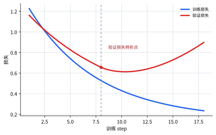

# P5-8.1 如何给目标函数加约束：正则化（regularization）

Section ID: `P5-8.1`
Version: `v2026.07.17`

在 P5-7 章里，我们已经看到 optimizer 是把 gradient 变成实际 update 的规则。但即使训练循环运转顺畅，也不意味着模型立刻就能在新数据上同样站得住。接下来的问题会马上出现。

如果模型在训练数据上拟合得很好，但在新数据上表现不好，该怎么办？

回答这个问题的核心概念之一，就是正则化（regularization）。第 8 章是在阅读：为了让学习循环更稳定，会额外加上哪些控制装置。而这一节先处理的是：`应该给目标函数加上什么样的约束。`

正则化，是在学习过程中加入约束或额外代价，好让模型不要只对训练数据过度贴合的想法。

如果之后又把过拟合抑制和 normalization 混在一起，更适合回到[英文概念词汇表里的 regularization 条目](/AiBook/en/reference/concept-glossary/#regularization)，重新对齐边界。

## 本节范围

- 为什么 regularization 会进入学习循环？
- 它和过拟合（overfitting）有什么关系？
- regularization 会怎样改变目标函数？
- 为什么当模型规模和数据量一起看时，它会更重要？

更安全的读法，不是把这一节只看成`optimizer 后面又多了一个设置项`，而是把它看成：把`update 规则`和`让 update 更倾向哪类解的偏好条件`分开阅读的一节。dropout 会在下一节 P5-8.2 作为结构层面的控制继续说明，而 training mode 与 evaluation mode 的计算差异，会在 P5-6.4 再次接回。

| 这一节要区分什么 | 为什么重要 |
| --- | --- |
| optimizer | 因为它负责看 gradient，并决定 update 实际用什么步幅移动。 |
| regularization | 因为它负责给移动加上限制，不让模型一路走向过于复杂的解。 |
| normalization | 因为它回答的不是过拟合抑制，而是怎样让数值尺度和分布更容易处理。 |

## 本节目标

- 能把 regularization 解释为`为了降低过拟合而加入的约束`。
- 能区分 optimizer 和 regularization 的角色。
- 能说明为什么 regularization 和 normalization 回答的是不同问题。
- 能说明 regularization 与 loss function、模型规模、数据量之间的关系。
- 能说明 regularization 在第 8 章中承担的是`目标函数控制装置`的角色。
- 能通过可执行的 Python 例子确认 penalty 会怎样影响 update 的大小。

## 为什么 regularization 和 normalization 不一样

这一节说的正则化，是 regularization。但在实际语境里，`normalize`、`normalization` 这些词也会经常出现，所以初次阅读时很容易混在一起。

两个名字相近，但要回答的问题不同。

| 项目 | regularization | normalization |
| --- | --- | --- |
| 首先要回答的问题 | 怎样避免模型过度死记训练数据？ | 怎样让输入值或中间值的尺度更容易处理？ |
| 主要关注点 | 泛化（generalization）、过拟合抑制 | 数值范围、分布、学习稳定性 |
| 代表例子 | L2 penalty、dropout、early stopping | 输入归一化、batch normalization、layer normalization |

也就是说，regularization 更接近`让哪类解变得不那么受偏好`，而 normalization 更接近`什么样的数值范围和分布更方便计算处理`。

当然，在真实的深度学习里，两者并不是完全分开的。例如 batch normalization 更直接连到计算稳定性和学习速度，但结果上也可能观察到一些类似 regularization 的效果。即便如此，在入门阶段仍然更适合先这样拆开。

- regularization：`把模型从过度死记里拽回来的一类装置`
- normalization：`让数值尺度和分布更容易处理的一类装置`

## 为什么需要 regularization

深度学习模型的表达能力很强。这意味着它很有力量，但也意味着它可能把训练数据里的偶然模式和噪声（noise）也一起学进去。

例如：

- 训练数据（training data）上的 loss 一直下降
- 但验证数据（validation data）上的表现，到某个时刻开始不再变好，甚至反而变差

这个场景，直接连回 Part 4 里已经看到的过拟合（overfitting）。

regularization 正是在这里出现。它给模型加上一句约束：`可以去拟合训练数据，但不要用过于复杂的方式去拟合。`

如果把这个场景画成曲线会更容易读。训练损失持续下降，而验证损失从某个点开始重新上升时，模型可能正在越来越偏向于把训练数据的细节模式背得更牢。



在这张图里，regularization 并不是只盯着训练损失的最低点。真正要一起看的，是新数据上的损失是否也在改善，还是训练数据与新数据之间的差距正在进一步扩大。

从入门读者的角度，更适合把这个场景再压成更短的三行。

| 先看到的数字 | 接着该追问的问题 | regularization 出现的原因 |
| --- | --- | --- |
| 训练损失一直下降 | 验证损失也一起变好吗？ | 因为不能把模型停留在只适合训练数据的解上。 |
| 训练准确率很高 | 输入稍微变化后，这个判断还站得住吗？ | 因为要让过度敏感的解变得不那么受偏好。 |
| 模型变得更复杂了 | 这种复杂度在新数据上也真的需要吗？ | 因为更大的权重和更复杂的规则可能通向过拟合。 |

## regularization 想阻止什么

这里先用下面三行抓住 regularization 的目标就够了。

- 不让模型过度依赖特别大的 parameter
- 不让模型只去记住某些样本里的偶然模式
- 帮助模型在新数据上也更稳定地工作

也就是说，regularization 不只是要把 loss 降下来，而是在限制：`loss 应该以什么样的方式被降下来。`

## regularization 只意味着 penalty 吗

入门教材经常把 regularization 介绍成`在 loss function 里再加一个 penalty 项`。这个解释很重要，但单独拿出来又有些偏窄。

在深度学习里，把 regularization 看得更宽一些会更安全。

例如，下面这些也都可以作为广义的 regularization 来阅读。

- 控制权重大小的 penalty
- 像 dropout 这样随机切断部分连接的方式
- 像 early stopping 这样避免训练过久的策略
- 像 data augmentation 这样增加输入多样性的方式

所以 regularization 与其说是`一个单独公式`，不如说更接近`为了减少过拟合而采用的一种设计哲学`。

## 它和损失函数有什么关系

regularization 经常和 loss function 一起出现。

\[
total\ loss = data\ loss + regularization\ term
\]

这条式子读到下面这个程度就足够了。

- `data loss`：预测和正确答案相差多少
- `regularization term`：模型是不是正在走向过于复杂的方向

也就是说，regularization 不只是在加入`答对题目的代价`，还会再附加`使用过多复杂度的代价`。

因此，optimizer 现在要减少的，就不再只是原始 loss，而是已经把 regularization 算进去之后的整个目标。

把这个连接再压短一点，大致就是下面这个流程。

```mermaid
--8<-- "assets/part-05/chapter-08/regularization-role-flow-zh.mmd"
```

这张图里首先要确认的是：regularization 并不是`代替误差计算的另一种 loss`，而是贴在 data loss 旁边、改变整个目标函数，并因此让模型更倾向于较不激进解的一种装置。

## 它和模型规模、数据量有什么关系

regularization 更常需要出现的场景，大致可以读成下面这样。

- 模型规模（model size）很大，表达能力很强
- 数据量（data size）相对较少，或者
- 数据里本来就混有不少偶然模式和噪声

这时模型很容易找到一个在训练数据上拟合得很好的解，但这个解能否在新数据上继续站得住，理由就没那么充分了。所以更准确的说法不是`模型一大就一定要加 regularization`，而是要一起看：`相对于模型拥有的自由度，数据到底够不够。`

反过来，如果数据更多，模式分布也更均匀，那么模型只靠记住某些样本里的偶然组合来拿到成绩的可能性就相对更低。因此 regularization 不该只被看成 loss function 旁边的 penalty 项，而更像是一起考虑`模型规模`、`数据量`、`在新数据上的站得住程度`的判断标准。

## optimizer 和 regularization 有什么不同

读者会感觉 optimizer 和 regularization 都像是在`调整学习`。但两者角色并不一样。

| 项目 | 角色 |
| --- | --- |
| optimizer | 根据 gradient 决定怎样更新 parameter |
| regularization | 给哪类解更受偏好、哪类复杂性要避开，加入约束 |

也就是说：

- optimizer 处理的是`该怎么移动`
- regularization 处理的是`哪些方向应该少喜欢一点`

先把这个区分固定住，后面再读 weight decay、dropout、early stopping 时，就更容易把它们放到同一个视角里。

如果再慢半步看，optimizer 和 regularization 虽然都在同一个学习循环里，但读者注视的位置并不一样。

| 在学习循环里先看什么 | 接着看什么 |
| --- | --- |
| optimizer 如何接收 gradient 并移动 parameter | regularization 如何限制这种移动靠近的解的性质 |
| `有没有顺利下降` | `是不是正在朝过于激进的解下降` |

## 案例与示例

### 案例. 用不同标准重新阅读相同的训练性能

假设我们用一份小型表格数据来训练客户流失预测模型。两种模型在训练数据上都拟合得差不多好。但模型 A 只要某一列数值稍微变化，预测就会大幅波动；模型 B 在训练性能相近的同时，对输入变化的反应没有那么激烈。

一开始看起来，好像只要选择训练损失更低的那一个就够了。但如果我们想要的是在新数据上也站得住的模型，问题就必须变掉。不能只看`它拟合得有多好`，还得看`为了得到这个结果，它用了多大的权重，以及多敏感的规则`。regularization 就是在这里发挥作用：即使沿着相同的学习方向，也让更激进的解变得不那么受偏好。

这个案例里真正要确认的结果，并不是训练分数的最高点，而是：当有两个拟合程度相近的解时，是否会选择那个更可能在新数据上少一点摇晃、而不是更依赖大权重和高敏感度的解。

```mermaid
--8<-- "assets/part-05/chapter-08/regularization-case-reading-flow-zh.mmd"
```

如果按这个流程来读，regularization 和 normalization 的差别也会更不容易混淆。把输入列的单位对齐、把数值范围整理得更容易处理，更接近 normalization。相反，在当前这个案例里，regularization 看的不是`把值变到什么范围`，而是模型为了拟合训练数据，是否用上了过大的权重和过度敏感的规则。

如果把 regularization 的核心比较压成一个场景，就是：`两边都在训练数据上拟合得差不多，但其中一边用了更大的权重和更复杂的路径。`

| 比较问题 | 更激进的解 | 较不激进的解 |
| --- | --- | --- |
| 对训练数据的拟合程度 | 拟合得差不多 | 拟合得差不多 |
| 权重大小与复杂度 | 更大 | 更小 |
| 对输入变化的敏感度 | 更高 | 更低 |
| regularization 更偏好的那一边 | 不是 | 是 |

```mermaid
--8<-- "assets/part-05/chapter-08/regularization-fit-complexity-compare-zh.mmd"
```

从这张比较图里，先要固定住下面几点。

- regularization 不是在说`不要去拟合正确答案`，而是在两个拟合程度相近的解之间，让更激进的一边变得没那么受偏好。
- 所以比较标准不能只剩下`谁的误差更接近 0`，还必须把`为了制造这个误差，使用了多大的权重和多复杂的解`也一起纳入。
- 只有这个视角先固定住，下面的例子才不会被读成`干扰 loss 下降的一项`，而会被读成`让模型更偏向较不激进解的一项`。

## 练习与例子

这个例子的目标，是确认当 regularization term 被加进去之后，update 可能会比`只朝着答对题目`的方向更保守一点。我们不只看一次 update，而是比较在多个 step 里，权重会多快变大。

输入：

- 当前权重 `w`
- 由 data loss 产生的 gradient
- regularization 强度 `lambda_value`

输出：

- 没有 regularization 时的 update 结果
- 把 regularization 加进去之后的 update 结果
- 随着 step 重复，权重大小差距如何拉开
- 对相同输入变化，预测会摇晃到什么程度的比较

问题场景：

- 如果只把 regularization 当定义来看，会比较模糊，所以需要直接看到：同样的 gradient 上额外再挂一项时，权重大小会怎样变化
- 也需要一起看：权重大小的差异，是否真的会带来预测敏感度上的差异

要确认的概念：

- regularization 会在 data gradient 之外，再加上一股试图减小权重大小的方向
- step 重复之后，带约束的一边会更倾向于保持较小的权重
- 更能保持较小权重的一边，对输入变化也可能反应得没那么激烈

输入（input）：

我们使用上面整理好的初始权重、data gradient、学习率、regularization 强度。

在看代码之前，可以先预测哪一边会产生更大的权重，以及更大的预测摇晃。

| 比较项目 | 可以先预测的比较 | 预测理由 |
| --- | --- | --- |
| `without_reg` vs `with_reg` 的权重大小 | `without_reg` 更可能更快变大 | 因为如果只跟着 data gradient 走，就没有一项会直接约束大权重。 |
| 对输入变化的预测敏感度 | `without_reg` 更可能摇晃得更大 | 因为权重越大，对同样输入变化造成的输出变化也会越大。 |

这张表的目的，是把`权重大小`和`预测摇晃`一起读出来。

```python
initial_w = 2.5
data_gradient = -4.0
learning_rate = 0.1
lambda_value = 0.2
steps = 3

w_without_reg = initial_w
w_with_reg = initial_w
base_x = 1.0
shifted_x = 1.2

for step in range(1, steps + 1):
    w_without_reg = w_without_reg - learning_rate * data_gradient

    reg_gradient = 2 * lambda_value * w_with_reg
    total_gradient = data_gradient + reg_gradient
    w_with_reg = w_with_reg - learning_rate * total_gradient

    print(f"[step {step}]")
    print("without_reg =", round(w_without_reg, 3))
    print("reg_gradient =", round(reg_gradient, 3))
    print("total_gradient =", round(total_gradient, 3))
    print("with_reg =", round(w_with_reg, 3))
    print("---")

without_base = round(base_x * w_without_reg, 3)
without_shifted = round(shifted_x * w_without_reg, 3)
with_base = round(base_x * w_with_reg, 3)
with_shifted = round(shifted_x * w_with_reg, 3)

print("prediction_without_reg =", [without_base, without_shifted])
print("prediction_with_reg =", [with_base, with_shifted])
print("sensitivity_without_reg =", round(without_shifted - without_base, 3))
print("sensitivity_with_reg =", round(with_shifted - with_base, 3))
```

读输出时，先看每个 step 里 `without_reg` 和 `with_reg` 拉开了多少距离，以及中间 `reg_gradient` 是怎样被加进去的。

```text
[step 1]
without_reg = 2.9
reg_gradient = 1.0
total_gradient = -3.0
with_reg = 2.8
---
[step 2]
without_reg = 3.3
reg_gradient = 1.12
total_gradient = -2.88
with_reg = 3.088
---
[step 3]
without_reg = 3.7
reg_gradient = 1.235
total_gradient = -2.765
with_reg = 3.365
---
prediction_without_reg = [3.7, 4.44]
prediction_with_reg = [3.365, 4.038]
sensitivity_without_reg = 0.74
sensitivity_with_reg = 0.673
```

- 没有 regularization 时，权重会变得更大
- 一旦把 regularization term 加进来，随着 step 重复，每次增长幅度会稍微变小
- 也就是说，regularization 不是单纯让性能变差，而是在让模型更偏向`较不激进的解`

| 比较 | 现在要读的核心 |
| --- | --- |
| `without_reg` | 权重增长更快，所以对同样输入变化造成的输出摇晃也更大。 |
| `with_reg` | 它会把权重增长再往下压一点，因此预测敏感度也相对更温和。 |

即使在读输出数字时，也需要把`误差下降`和`更偏好较不激进的解`分开来看。

| 比较 | 输出里首先看到的 | 只看误差时容易留下的解读 | 把 regularization 一起算进去之后会改变的解读 |
| --- | --- | --- | --- |
| `without_reg` | step 越往后，权重长得越快，敏感度也上升到 `0.74` | 容易觉得它移动得更快，所以学习更好 | 它放任大权重和高敏感度继续增长，因此正在走向一个对输入变化更激进的解 |
| `with_reg` | step 越往后，增长会稍微变小，敏感度也更低，为 `0.673` | 容易觉得它没有那么猛烈地降 loss，所以学习更差 | 即使沿着同一方向，它也更偏向小一些的权重和更温和的反应，因此保留的是较不激进的解 |

也就是说，在这个例子里，读者真正要抓住的问题不是`regularization 会不会阻止 loss 下降`，而是`在同样的学习方向里，它会不会让模型更偏向较不激进的解，而不是更激进的解。`

regularization 也和深度学习之前的统计学习理论（statistical learning theory）紧密相连。模型一旦过于复杂，就可能在训练数据上拟合得很好，却在泛化上表现更差，这个问题本来就是长期以来的核心主题。

到了深度学习时代，regularization 变得更重要的理由也很清楚。

- 模型容量（capacity）变得非常大
- 数据分布里的偏差和噪声问题并没有消失
- 训练性能高，本身并不能保证模型就一定好

从课程结构上看，这一节放在 optimizer 后面也很自然。

- 紧前面的 P5-7.1、P5-7.2 讨论的是`应该怎样往下降`
- optimizer 负责的是怎样更好地下降
- regularization 负责的是应该允许下降到什么程度，以及更偏好哪类解

也就是说，这两节都在调整学习，但回答的问题并不一样。

## 在学习循环里应该把 regularization 放在哪里读

当`学习进行得很好`开始和`只是对训练数据拟合得很好`混在一起时，就该把这一节拿出来。regularization 不是学习循环外的一种装饰，而是应该和 optimizer 并排放着，但按不同角色来读的一种控制装置。

| 首先出现的问题场景 | 为什么此时 regularization 视角更有用 | 接着会连到哪里 |
| --- | --- | --- |
| 训练性能很高，但验证性能在摇晃 | 它让我们可以把泛化问题和`是不是拟合得更好`分开来读 | 会继续连到 P5-8.2 里通过摇动结构本身的 dropout |
| optimizer 和 normalization 看起来都像某种调整装置 | 它能把 update 规则、数值尺度调整、泛化约束这几类问题拆开 | 之后还要在 P5-8.2、P5-8.3 里进一步看控制位置的差异 |
| 大模型似乎过度依赖某一个特征 | 它能先固定住：应该让哪类解变得不那么受偏好，这种 regularization 直觉 | 接下来还需要看 penalty 之外的结构型 regularization |
| 数据越少为什么越要小心，看起来不够清楚 | 它能说明：为什么在小数据场景里，过拟合抑制装置会变得更重要 | 后面还要继续看 dropout、early stopping 等实践形式 |

## 检查清单

- 能说明 regularization 是一种降低过拟合的视角吗？
- 能区分 optimizer 和 regularization 回答的是不同问题吗？
- 能说明 regularization 是通过增加约束或代价来减少过拟合的想法吗？
- 能说明为什么 optimizer 工作得好，并不意味着泛化会自动变好吗？
- 能把 regularization 和 normalization 区分成`过拟合抑制`与`整理数值尺度和分布`吗？
- 能说明 regularization 不只可以看成 penalty 公式，也可以看成更广的设计哲学吗？
- 当 optimizer 运转正常但验证性能摇晃时，能先从 regularization 视角想到这是泛化问题吗？
- 能理解这一节在第 8 章里承担的是`目标函数控制`，下一节则会转向通过摇动结构的 dropout 吗？

## 出处与参考资料

- Trevor Hastie, Robert Tibshirani, Jerome Friedman, `The Elements of Statistical Learning`, 2nd ed., Springer, 2009, 确认日期：2026-06-29。
- Ian Goodfellow, Yoshua Bengio, Aaron Courville, `Deep Learning`, MIT Press, 2016, 确认日期：2026-06-29。 [https://www.deeplearningbook.org/](https://www.deeplearningbook.org/){: target="_blank" rel="noopener noreferrer" }
- Christopher M. Bishop, `Pattern Recognition and Machine Learning`, Springer, 2006, 确认日期：2026-06-29。
