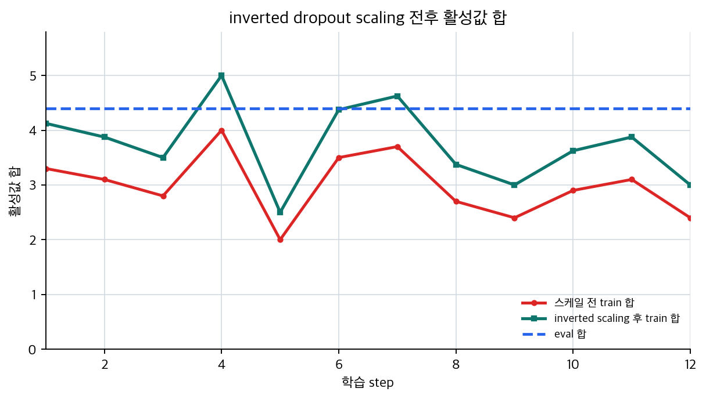

# P5-8.2 경로 의존을 줄이는 방법: 드롭아웃(dropout)

> Section ID: `P5-8.2`
> Version: `v2026.07.26`

P5-8.1에서는 목적 함수 옆에 regularization 항을 두어 학습 루프의 목표 자체를 조정하는 방법을 보았습니다. 이제 같은 챕터 흐름을 한 단계 더 옮겨, 손실 옆의 벌점이 아니라 신경망 내부 경로를 흔드는 방식으로도 제어가 가능한지 봅니다. 여기서 다음 질문이 자연스럽게 이어집니다.

가중치에 벌점을 주는 것 말고, 신경망 구조 자체를 흔들어 과적합을 줄이는 방법도 있는가?

이 질문에 답하는 대표적 방법이 드롭아웃(dropout)입니다. 즉, 이 절은 챕터 8에서 `목적 함수 제어` 다음에 오는 `구조 수준 제어`를 맡는 자리입니다.

드롭아웃은 학습 중 일부 노드 출력이나 연결을 무작위로 끄면서, 모델이 특정 경로에 과하게 의존하지 않도록 만드는 정규화 기법이다.

구조를 흔드는 regularization 사례라는 감각을 다시 짚어야 할 때는 개념사전의 [드롭아웃(dropout)](../../../reference/concept-glossary-parts/03-digeut.md#dropout) 항목을 기준으로 다시 읽습니다.

## dropout이 경로 의존을 줄이는 질문

- 드롭아웃은 왜 과적합 억제와 연결되는가?
- 학습 중 일부 연결을 끊는다는 말은 무엇을 뜻하는가?
- 왜 학습 모드와 평가 모드에서 동작이 달라지는가?
- 드롭아웃은 학습 루프 어디에서 작동한다고 읽어야 하는가?

학습 모드와 평가 모드의 차이는 P5-6.4에서 다시 연결하고, regularization의 큰 관점은 P5-8.1 위에서 읽습니다. 여기서는 공식을 암기하기보다 `왜 무작위 경로 제거가 일반화를 돕고, 왜 이 기법이 training mode와 함께 읽혀야 하는가`를 먼저 설명합니다.

## 끊긴 연결과 앙상블 직관의 판단 기준

- 드롭아웃을 `특정 경로 의존을 줄이는 정규화 기법`으로 설명할 수 있습니다.
- 드롭아웃이 학습 중과 평가 중에 다르게 동작하는 이유를 말할 수 있습니다.
- 드롭아웃이 앙상블(ensemble) 비슷한 직관을 준다는 점을 입문 수준에서 이해할 수 있습니다.
- 드롭아웃이 챕터 8 안에서 `구조 수준 제어 장치` 역할을 한다는 점을 설명할 수 있습니다.
- 실행 가능한 Python 예제로 드롭아웃 전후 값을 직접 확인할 수 있습니다.

## 드롭아웃은 왜 필요한가

딥러닝 모델은 어떤 특징 조합이나 특정 은닉 경로에 과하게 의존할 수 있습니다. 이런 상태에서는 훈련 데이터에서는 높은 성능이 나와도, 새로운 데이터에서는 쉽게 흔들릴 수 있습니다.

드롭아웃은 이 문제를 다음 방식으로 건드립니다.

- 학습 중 일부 노드 출력을 무작위로 끕니다
- 따라서 모델은 항상 같은 내부 경로만 믿고 학습할 수 없습니다
- 결과적으로 여러 경로와 표현을 더 고르게 사용하도록 압박받습니다

다음처럼 기억하면 충분합니다.

`드롭아웃은 학습할 때 네트워크 일부를 잠깐씩 비워 두어, 모델이 특정 연결 하나에만 기대지 않게 한다.`

## 일부 연결을 끊는다는 말은 무엇인가

드롭아웃을 처음 들으면 `정말로 네트워크 구조를 삭제하는가?`라는 질문이 생길 수 있습니다. 보통은 그렇지 않습니다.

학습 중에는:

- 일부 활성값을 0으로 만들거나
- 일부 노드 출력을 잠시 사용하지 않는 방식으로
- 현재 step에서만 경로를 쉬게 합니다

즉, 드롭아웃은 구조를 영구 삭제하는 것이 아니라 `학습 중 임시로 일부 경로를 빠지게 만드는 확률적 규칙`입니다.

이를 아주 단순하게 그리면 다음과 같습니다.

```mermaid
--8<-- "assets/part-05/chapter-08/dropout-path-flow-ko.mmd"
```

이 도식에서 `hidden unit 2`는 현재 학습 step에서 쉬고 있는 경로처럼 읽으면 됩니다.

## 왜 이런 무작위 제거가 도움이 되나

이 발상은 다소 역설적으로 들릴 수 있습니다.

`모델을 더 좋게 만들려면 더 많이 써야 할 것 같은데, 왜 일부를 일부러 끄는가?`

바로 여기서 확인해야 할 점은, 드롭아웃이 `항상 같은 경로만 믿는 학습`을 깨서 여러 경로에 걸친 더 견고한 표현을 만들게 한다는 것입니다.

예를 들어:

- 어떤 은닉 노드 하나가 훈련 데이터에서 매우 강한 지름길 역할을 하고 있다면
- 드롭아웃은 그 노드가 매 step마다 항상 존재한다고 가정하지 못하게 합니다

따라서 모델은 `하나의 쉬운 편법`보다, 더 여러 경로에서 견디는 표현을 배우도록 압박받습니다.

## 앙상블(ensemble)과 비슷한 직관

입문 설명에서 드롭아웃은 종종 `여러 부분 네트워크를 번갈아 학습하는 느낌`으로도 설명됩니다. 엄밀히 완전히 같은 것은 아니지만, 직관을 잡는 데는 유용합니다.

즉:

- 어떤 step에서는 어떤 노드가 켜지고
- 다음 step에서는 다른 조합이 켜지며
- 결과적으로 하나의 거대한 네트워크 안에서 여러 부분 구조가 번갈아 학습되는 느낌을 줄 수 있습니다

다음 정도로 정리하면 충분합니다.

`드롭아웃은 하나의 네트워크를 여러 부분 네트워크처럼 흔들어 가며 학습시키는 느낌을 준다.`

## 왜 평가 모드에서는 드롭아웃을 끄나

P5-6.4에서 이미 본 것처럼, 드롭아웃은 학습 모드(training mode)와 평가 모드(evaluation mode)에서 다르게 동작합니다. 이유는 간단합니다.

평가나 배포에서는:

- 현재 모델이 얼마나 잘하는지 안정적으로 재야 하고
- 같은 입력에 대해 불필요한 무작위 흔들림을 줄여야 하며
- 사용자가 받을 결과도 지나치게 들쭉날쭉하면 안 됩니다

즉, 드롭아웃은 `학습을 돕는 잡음`이지, 평가를 흔드는 잡음이 되어서는 안 됩니다.

같은 입력이 학습 모드와 평가 모드에서 어떻게 다르게 읽히는지는 작은 흐름으로 다시 보면 더 쉽습니다.

```mermaid
--8<-- "assets/part-05/chapter-08/dropout-mode-reading-flow-ko.mmd"
```

이 도식에서 먼저 붙잡아야 할 점은 하나입니다. train mode는 일부 경로를 쉬게 해 `특정 경로 의존`을 흔드는 자리이고, eval mode는 남은 모델이 실제로 얼마나 안정적으로 버티는지 재는 자리입니다.

## 사례 및 예시

### 사례. 리뷰 분류 모델이 쉬운 지름길에 기대는 경우

dropout은 `모델이 특정 단서나 은닉 경로 하나에 과하게 기대는 것 같다`는 의심이 있을 때 가장 먼저 의미가 선명해집니다. 상품 리뷰 분류 모델이 `무료 배송`, `별점 5`, 특정 브랜드명처럼 훈련 데이터에서 자주 함께 나온 표현에 강하게 반응한다고 해 보겠습니다. 훈련 데이터에서는 이런 조합이 빠른 정답 지름길처럼 보일 수 있습니다. 하지만 새 리뷰에서는 같은 표현이 다른 맥락으로 등장하거나, 중요한 판단 단서가 다른 문장에 흩어져 있을 수 있습니다. 이때 모델이 특정 은닉 노드 하나의 강한 반응에만 기대면 훈련 점수는 높아져도 검증 데이터에서 쉽게 흔들립니다.

드롭아웃을 넣으면 학습 step마다 일부 은닉 출력이 임시로 꺼집니다. 이 말은 리뷰 문장에서 `무료 배송`이라는 단어를 지운다는 뜻이 아니라, 그 단서를 처리하던 내부 표현 경로 일부를 학습 중 잠시 쓰지 못하게 한다는 뜻입니다. 그러면 모델은 `무료 배송`에 강하게 반응하던 경로가 항상 살아 있다고 가정할 수 없습니다. 남아 있는 다른 단서와 경로도 함께 써야 하므로, 학습은 `훈련 데이터에서 잘 맞는 지름길`보다 `일부 경로가 빠져도 버티는 표현` 쪽으로 압박을 받습니다. 이 사례에서 확인해야 할 결과는 훈련 점수가 더 빨리 오르는지가 아니라, 훈련 점수와 검증 점수의 간극이 실제로 줄어드는가입니다.

```mermaid
--8<-- "assets/part-05/chapter-08/dropout-case-reading-flow-ko.mmd"
```

| 사람이 먼저 보기 쉬운 기준 | dropout 관점으로 다시 읽는 기준 |
| --- | --- |
| 강하게 반응하는 단서 하나가 있으면 좋은 모델처럼 보인다 | 그 단서가 훈련 데이터의 우연한 지름길인지 검증해야 한다 |
| 훈련 점수가 빨리 오르면 좋은 학습처럼 보인다 | 검증 간극이 줄어드는지도 같이 봐야 한다 |
| 중요한 노드는 항상 켜져 있는 편이 더 안전해 보인다 | 일부 노드가 쉬어도 버티는 표현이 더 견고할 수 있다 |

## 연습 및 예제

이번 예제의 목표는 학습 중 드롭아웃이 step마다 다른 경로 조합을 쉬게 만든다는 점을 직접 확인하는 것입니다. 학습 모드와 평가 모드가 왜 다르게 읽혀야 하는지도 같은 입력 로그로 함께 보겠습니다.

입력:

- dropout mask 로그 CSV: [`dropout-training-path-log.csv`](../../../assets/part-05/chapter-08/dropout-training-path-log.csv)
- `step`: dropout이 적용된 학습 step
- `node`, `activation`: 은닉 노드와 dropout 전 활성값
- `train_mask`, `train_value`, `eval_value`: 학습 모드 mask, 학습 모드 값, 평가 모드 값

출력:

- 첫 step에서 드롭아웃 전 활성값과 학습 모드 값이 어떻게 갈라지는지
- 여러 step에서 학습 모드 활성값 합이 얼마나 흔들리는지
- 어떤 노드가 여러 step에 걸쳐 몇 번 쉬었는지

문제 상황:

- 드롭아웃은 활성값을 일부 꺼서 과적합을 줄이려는 장치이므로, 학습과 평가에서 출력이 어떻게 달라지는지 직접 확인하는 편이 좋다
- 한 번의 seed 결과만 보면 우연히 아무 경로도 꺼지지 않을 수 있으므로, 여러 step의 mask 로그로 어떤 경로 조합이 번갈아 쉬는지 봐야 한다

확인할 개념:

- 학습 모드에서는 step마다 일부 노드가 꺼질 수 있다
- 평가 모드에서는 같은 무작위 제거를 반복하지 않아 더 안정적으로 읽는다
- 일부 노드가 빠져도 나머지 경로가 출력을 떠받쳐야 한다는 압박이 생긴다

입력(input):

CSV의 한 행은 한 학습 step에서 한 은닉 노드가 어떻게 처리되었는지를 뜻합니다. `train_mask`가 `0`이면 그 step의 학습 모드에서 해당 경로가 쉬고, `1`이면 남아 있습니다. 여기서는 실제 프레임워크의 전체 dropout 구현이 아니라, 무작위 제거 결과를 학습 로그처럼 고정해 읽는 축약 예제입니다.

코드를 보기 전에 먼저 train mode에서 어떤 노드가 번갈아 빠지고, eval mode에서는 왜 같은 활성값을 유지하는지 예상해 보면 좋습니다.

| 비교 | 먼저 예상해 볼 비교 | 예상 이유 |
| --- | --- | --- |
| `train_mask` | step마다 0인 위치가 달라질 가능성 | dropout은 학습 중 일부 경로 조합을 임시로 쉬게 하기 때문입니다. |
| `train_value` vs `eval_value` | train mode에서만 일부 값이 0이 될 가능성 | 평가 모드에서는 같은 무작위 제거를 반복하지 않기 때문입니다. |
| step별 `train_sum` | step마다 다르게 흔들릴 가능성 | 이 예제에서는 일부 활성값을 0으로 두고 추가 스케일링을 생략했기 때문입니다. |

이 표의 목적은 `경로 제거`와 `안정적 평가`를 한 번에 읽는 것입니다.

여기서 한 가지를 먼저 분명히 해 두겠습니다. 실제 프레임워크의 dropout은 보통 학습 중 남아 있는 활성값을 스케일링(inverted dropout)해, 평가 모드와 평균 크기가 크게 어긋나지 않게 맞춥니다. 아래 예제는 그 세부를 모두 구현하기보다 `일부 경로가 여러 step에서 번갈아 빠진다`는 핵심 직관만 먼저 보이기 위해 단순화한 로그 예제입니다.

```python
# CSV dropout 로그를 읽어 train mode에서는 일부 경로가 번갈아 빠지고 eval mode에서는 값이 유지되는지 비교하는 예제입니다.
from collections import defaultdict
from csv import DictReader
from pathlib import Path

csv_path = Path("docs/assets/part-05/chapter-08/dropout-training-path-log.csv")

rows = []
with csv_path.open(encoding="utf-8") as file:
    for row in DictReader(file):
        rows.append(
            {
                "step": int(row["step"]),
                "node": row["node"],
                "activation": float(row["activation"]),
                "train_mask": int(row["train_mask"]),
                "train_value": float(row["train_value"]),
                "eval_value": float(row["eval_value"]),
            }
        )

steps = sorted({row["step"] for row in rows})
nodes = sorted({row["node"] for row in rows})

first_step_rows = [row for row in rows if row["step"] == steps[0]]
before_dropout = [row["activation"] for row in first_step_rows]
train_mask = [row["train_mask"] for row in first_step_rows]
train_mode_values = [row["train_value"] for row in first_step_rows]
eval_mode_values = [row["eval_value"] for row in first_step_rows]

train_sum_by_step = {}
for step in steps:
    step_rows = [row for row in rows if row["step"] == step]
    train_sum_by_step[step] = sum(row["train_value"] for row in step_rows)

drop_count_by_node = defaultdict(int)
for row in rows:
    if row["train_mask"] == 0:
        drop_count_by_node[row["node"]] += 1

print("rows_read =", len(rows))
print("first_step_mask =", train_mask)
print("first_step_train_values =", train_mode_values)
print("first_step_train_sum =", round(sum(train_mode_values), 3))
print("eval_values =", eval_mode_values)
print("eval_sum =", round(sum(eval_mode_values), 3))
print(
    "train_sum_range =",
    [round(min(train_sum_by_step.values()), 3), round(max(train_sum_by_step.values()), 3)],
)
print("drop_count_by_node =", {node: drop_count_by_node[node] for node in nodes})
```

출력에서는 첫 step의 mask를 먼저 보고, 그다음 여러 step에서 학습 모드 값의 합이 얼마나 흔들리는지와 어떤 노드가 반복해서 쉬었는지를 보면 됩니다.

```text
rows_read = 60
first_step_mask = [1, 1, 1, 0, 1]
first_step_train_values = [0.9, 1.3, 0.4, 0.0, 0.7]
first_step_train_sum = 3.3
eval_values = [0.9, 1.3, 0.4, 1.1, 0.7]
eval_sum = 4.4
train_sum_range = [2.0, 4.0]
drop_count_by_node = {'node_1': 4, 'node_2': 4, 'node_3': 4, 'node_4': 4, 'node_5': 3}
```

- 어떤 활성값은 그대로 남고
- 어떤 활성값은 특정 학습 step에서는 0이 되며
- 여러 step을 지나면 쉬는 노드 조합이 바뀌고
- 평가 모드에서는 같은 입력이라도 이런 무작위 제거를 반복하지 않습니다
- 그 결과 네트워크가 모든 경로를 항상 믿고 학습할 수 없게 됩니다

이 예제에서 먼저 볼 산출물은 첫 step의 노드별 활성값입니다. `first_step_mask`가 `0`인 네 번째 노드만 학습 모드에서 꺼지고, 평가 모드에서는 원래 활성값이 그대로 유지됩니다.


두 번째 산출물은 여러 학습 step에서의 활성값 합입니다. 여기서는 학습 모드에서 빠지는 경로 조합이 step마다 달라져 `train_sum_range = [2.0, 4.0]`처럼 흔들리지만, 평가 모드의 합은 같은 입력 기준에서 `4.4`로 고정됩니다.


| 비교 | 지금 읽어야 할 핵심 |
| --- | --- |
| `before` vs `train` | 학습 모드에서는 step마다 일부 노드가 실제로 빠질 수 있습니다. |
| `train` vs `eval` | train mode에서는 경로를 흔들지만 eval mode에서는 같은 입력을 안정적으로 유지합니다. |
| `train_sum_range` | 이 로그 예제에서는 일부 경로 조합이 번갈아 쉬었다는 사실을 보조적으로 보여 줍니다. 핵심은 합 자체보다 경로 의존이 깨지는 압박입니다. |

출력 숫자를 읽을 때도 `몇 개가 0이 되었는가`와 `그 결과 어떤 학습 압박이 생기는가`를 분리해서 봐야 합니다.

| 비교 | 출력에서 먼저 보이는 것 | 값만 보면 남기 쉬운 해석 | dropout까지 보면 바뀌는 해석 |
| --- | --- | --- | --- |
| `before` vs `train` | 첫 step에서는 `1.1` 하나가 빠지고, 여러 step에서는 쉬는 노드 조합이 바뀝니다. | 그냥 정보가 줄어 손해만 보는 것처럼 보일 수 있습니다. | 특정 경로가 빠져도 나머지 경로가 출력을 떠받쳐야 하므로 지름길 의존을 줄이는 압박이 생깁니다. |
| `train` vs `eval` | 같은 입력인데 train에서는 흔들리고 eval에서는 원래 값을 유지합니다. | 구현이 일관되지 않거나 불안정한 것처럼 보일 수 있습니다. | 학습 때만 일부러 잡음을 넣고, 평가 때는 안정적으로 재도록 역할을 나눈 것입니다. |
| `train_sum_range` vs `eval_sum` | 이 로그 예제에서는 train 합이 step마다 흔들리고 eval 합은 원래 수준을 유지합니다. | train 쪽 값이 작거나 흔들리니 그냥 성능이 나빠졌다고 보기 쉽습니다. | 여기서 봐야 할 것은 합의 크기 자체가 아니라, 일부 경로가 비어도 견디는 표현을 배우게 하는 압박입니다. |

즉, dropout을 읽을 때 독자가 붙잡아야 할 질문은 `몇 개가 0이 되었는가`만이 아니라, `특정 경로가 빠져도 모델이 여전히 버티도록 강요받는가`입니다.

위 예제는 경로가 번갈아 빠지는 직관을 먼저 보이기 위해 scaling을 일부러 생략했습니다. 그런데 실제 프레임워크의 dropout은 보통 남아 있는 활성값을 `1 / keep_probability`만큼 키우는 inverted dropout을 사용합니다. 이렇게 하면 학습 중 일부 경로가 빠지더라도, 평균적인 값 규모가 평가 모드와 지나치게 벌어지지 않도록 맞출 수 있습니다.

다음 예제는 같은 CSV 로그를 다시 읽되, 학습 모드에서 살아남은 값에 inverted scaling을 적용합니다. 여기서 볼 것은 `dropout이 값을 무조건 작게 만든다`가 아니라, `일부 경로는 쉬게 하되 남은 경로의 규모는 보정해 train/eval의 기대 크기를 맞추려 한다`는 점입니다.

```python
# 같은 dropout 로그에서 scaling 전 train 합과 inverted dropout scaling 후 train 합을 비교하는 예제입니다.
from csv import DictReader
from pathlib import Path

csv_path = Path("docs/assets/part-05/chapter-08/dropout-training-path-log.csv")
keep_probability = 0.8

rows = []
with csv_path.open(encoding="utf-8") as file:
    for row in DictReader(file):
        rows.append(
            {
                "step": int(row["step"]),
                "activation": float(row["activation"]),
                "train_mask": int(row["train_mask"]),
                "train_value": float(row["train_value"]),
                "eval_value": float(row["eval_value"]),
            }
        )

steps = sorted({row["step"] for row in rows})
raw_train_sums = []
scaled_train_sums = []
eval_sums = []

print("keep_probability =", keep_probability)
for step in steps[:5]:
    step_rows = [row for row in rows if row["step"] == step]
    raw_train_sum = sum(row["train_value"] for row in step_rows)
    scaled_train_sum = sum(
        row["activation"] * row["train_mask"] / keep_probability
        for row in step_rows
    )
    eval_sum = sum(row["eval_value"] for row in step_rows)

    raw_train_sums.append(raw_train_sum)
    scaled_train_sums.append(scaled_train_sum)
    eval_sums.append(eval_sum)

    print(
        f"step {step}: "
        f"raw_train_sum={raw_train_sum:.3f}, "
        f"inverted_scaled_sum={scaled_train_sum:.3f}, "
        f"eval_sum={eval_sum:.3f}"
    )

print(
    "raw_train_range =",
    [round(min(raw_train_sums), 3), round(max(raw_train_sums), 3)],
)
print(
    "scaled_train_range =",
    [round(min(scaled_train_sums), 3), round(max(scaled_train_sums), 3)],
)
```

```text
keep_probability = 0.8
step 1: raw_train_sum=3.300, inverted_scaled_sum=4.125, eval_sum=4.400
step 2: raw_train_sum=3.100, inverted_scaled_sum=3.875, eval_sum=4.400
step 3: raw_train_sum=2.800, inverted_scaled_sum=3.500, eval_sum=4.400
step 4: raw_train_sum=4.000, inverted_scaled_sum=5.000, eval_sum=4.400
step 5: raw_train_sum=2.000, inverted_scaled_sum=2.500, eval_sum=4.400
raw_train_range = [2.0, 4.0]
scaled_train_range = [2.5, 5.0]
```



이 출력은 scaling을 넣어도 학습 모드가 평가 모드와 완전히 같아진다는 뜻이 아닙니다. mask가 달라지면 살아남은 경로 조합은 여전히 흔들립니다. 다만 inverted dropout은 남은 값의 규모를 보정해, 학습 중 경로 제거와 평가 중 안정 계산 사이의 값 규모 차이가 너무 커지지 않도록 돕습니다.

드롭아웃은 Part 5 초반부의 여러 개념을 한 번에 다시 묶습니다.

- 바로 앞의 P5-8.1 정규화를 `벌점 공식`으로만 이해하는 것을 막아 주고
- 학습 중 잡음을 일부러 넣어 일반화를 돕는 사고를 소개하며
- 앞서 P5-6.4에서 본 학습 모드와 평가 모드의 차이가 왜 실질적으로 필요한지 다시 확인시켜 주기 때문입니다

## 학습 루프에서 dropout을 어디에 두고 읽는가

정규화의 일반 관점을 잡은 뒤에는 `벌점만으로 설명되지 않는 과적합 억제 방식이 필요한가`를 보고 dropout을 꺼내는 편이 자연스럽습니다. dropout은 optimizer 뒤에 따로 붙은 부가 기능이 아니라, forward 계산 중 일부 경로를 임시로 쉬게 해 학습이 특정 편법에만 기대지 못하게 만드는 장치로 읽어야 합니다.

| 먼저 보이는 문제 장면 | dropout 관점이 먼저 유용한 이유 | 바로 다음에 이어질 곳 |
| --- | --- | --- |
| 특정 경로나 은닉 노드 하나에 과하게 기대는 느낌이 있다 | 구조 자체를 흔들어 여러 경로를 쓰게 만드는 regularization 감각을 보여 줍니다. | P5-8.3에서 계산 안정화 조건과 구분해 다시 묶습니다. |
| 데이터가 적거나 fully connected 층이 커서 외우기 쉬워 보인다 | 무작위 경로 제거가 과적합 억제에 왜 도움이 되는지 설명할 수 있습니다. | regularization 전반과 학습 루프 재정리로 이어집니다. |
| training/eval mode 차이가 왜 실질적인지 다시 보여 줄 필요가 있다 | dropout이 모드 차이를 가장 직관적으로 드러내는 사례이기 때문입니다. | P5-6.1의 학습 루프와 P5-8.3의 안정화 축을 함께 다시 봅니다. |
| 벌점 항만으로는 regularization 설명이 너무 좁게 느껴진다 | 정규화가 설계 철학이라는 점을 구체 사례로 확장할 수 있습니다. | 다른 regularization 기법들과 함께 비교할 준비가 됩니다. |

## 체크리스트

- 드롭아웃(dropout)이 특정 경로 의존을 줄이는 정규화 기법이라는 점을 설명할 수 있는가?
- 왜 드롭아웃이 학습 모드와 평가 모드에서 다르게 동작하는지 말할 수 있는가?
- dropout을 `일부 경로를 임시로 쉬게 해 특정 편법 경로 의존을 줄이는 regularization`으로 설명할 수 있는가?
- 평가 모드에서는 같은 무작위 제거를 유지하지 않는 것이 보통이라는 점을 설명할 수 있는가?
- training/eval mode 차이를 가장 직관적으로 다시 보여 줄 사례가 필요할 때, 무작위 경로 제거와 평가 모드 차이를 다시 꺼낼 수 있는가?
- 이 절이 챕터 8에서 `구조 수준 제어`를 맡고, 다음 절은 `깊은 계산이 실제로 버티는 조건`으로 넘어간다는 흐름을 이해했는가?

## 출처와 참고 자료

- Nitish Srivastava et al., `Dropout: A Simple Way to Prevent Neural Networks from Overfitting`, JMLR, 2014, 확인 날짜: 2026-07-19. [https://jmlr.org/papers/v15/srivastava14a.html](https://jmlr.org/papers/v15/srivastava14a.html){: target="_blank" rel="noopener noreferrer" }
- Ian Goodfellow, Yoshua Bengio, Aaron Courville, `Deep Learning`, MIT Press, 2016, 확인 날짜: 2026-06-29. [https://www.deeplearningbook.org/](https://www.deeplearningbook.org/){: target="_blank" rel="noopener noreferrer" }
- Aurélien Géron, `Hands-On Machine Learning with Scikit-Learn, Keras, and TensorFlow`, 3rd ed., O'Reilly, 2022, 확인 날짜: 2026-07-19. [https://www.oreilly.com/library/view/hands-on-machine-learning/9781098125967/](https://www.oreilly.com/library/view/hands-on-machine-learning/9781098125967/){: target="_blank" rel="noopener noreferrer" }
