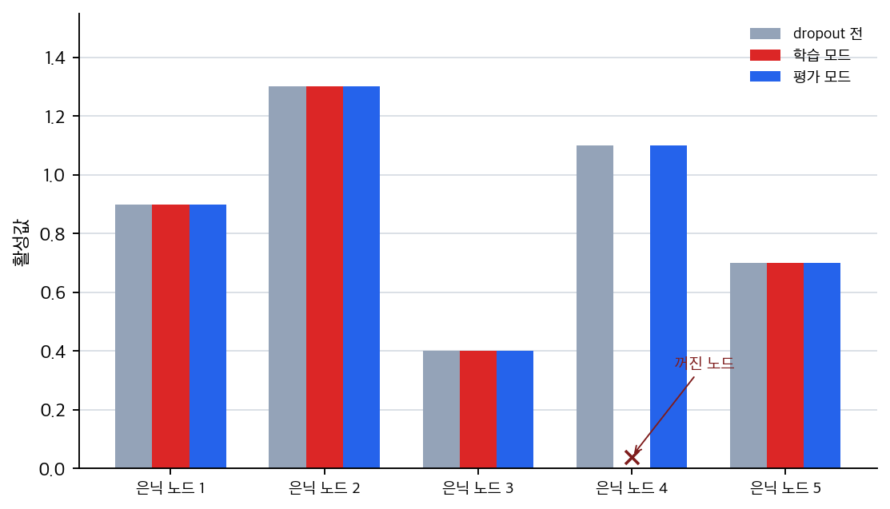
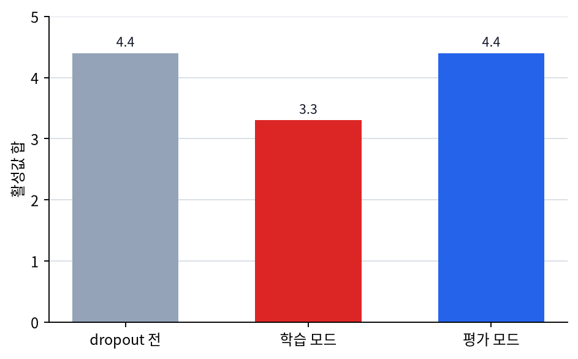

# P5-8.2 드롭아웃(dropout)

Section ID: `P5-8.2`
Version: `v2026.07.16`

P5-8.1에서는 정규화(regularization)를 `과적합을 줄이기 위한 제약과 설계 철학`으로 설명했습니다. 여기서 다음 질문이 자연스럽게 이어집니다.

가중치에 벌점을 주는 것 말고, 신경망 구조 자체를 흔들어 과적합을 줄이는 방법도 있는가?

이 질문에 답하는 대표적 방법이 드롭아웃(dropout)입니다.

드롭아웃은 학습 중 일부 노드 출력이나 연결을 무작위로 끄면서, 모델이 특정 경로에 과하게 의존하지 않도록 만드는 정규화 기법이다.

구조를 흔드는 regularization 사례라는 감각을 다시 짚어야 할 때는 개념사전의 [드롭아웃(dropout)](../../../reference/concept-glossary.md#dropout) 항목을 기준으로 다시 읽습니다.

## 이 절의 범위

- 드롭아웃은 왜 과적합 억제와 연결되는가?
- 학습 중 일부 연결을 끊는다는 말은 무엇을 뜻하는가?
- 왜 학습 모드와 평가 모드에서 동작이 달라지는가?
- 드롭아웃은 어떤 상황에서 직관적으로 도움이 되나?

이 절에서는 다음 내용을 깊게 다루지 않습니다.

- inverted dropout의 정확한 scaling 공식
- dropout 비율(rate) 튜닝 전략의 세밀한 경험칙
- variational dropout, Monte Carlo dropout 같은 확장 기법

inverted dropout 공식과 dropout 비율 조정 경험칙은 여기서 공식을 전개하지 않고 넘깁니다. 대신 학습 모드와 평가 모드의 차이는 P5-6.3에서 다시 연결하고, regularization의 큰 관점은 P5-8.1에서 이미 묶은 흐름 위에서 읽습니다. variational dropout, Monte Carlo dropout 같은 확장 기법은 이 책의 현재 본편 범위 밖에 둡니다.

여기서는 공식을 암기하기보다 `왜 무작위 제거가 일반화를 돕는가`를 먼저 설명합니다.

## 이 절의 목표

- 드롭아웃을 `특정 경로 의존을 줄이는 정규화 기법`으로 설명할 수 있습니다.
- 드롭아웃이 학습 중과 평가 중에 다르게 동작하는 이유를 말할 수 있습니다.
- 드롭아웃이 앙상블(ensemble) 비슷한 직관을 준다는 점을 입문 수준에서 이해할 수 있습니다.
- 실행 가능한 Python 예제로 드롭아웃 전후 값을 직접 확인할 수 있습니다.

## 드롭아웃은 왜 필요한가

딥러닝 모델은 어떤 특징 조합이나 특정 은닉 경로에 과하게 의존할 수 있습니다. 이런 상태에서는 훈련 데이터에서는 높은 성능이 나와도, 새로운 데이터에서는 쉽게 흔들릴 수 있습니다.

드롭아웃은 이 문제를 다음 방식으로 건드립니다.

- 학습 중 일부 노드 출력을 무작위로 끕니다
- 따라서 모델은 항상 같은 내부 경로만 믿고 학습할 수 없습니다
- 결과적으로 여러 경로와 표현을 더 고르게 사용하도록 압박받습니다

다음처럼 기억하면 충분합니다.

`드롭아웃은 학습할 때 네트워크 일부를 잠깐씩 비워 두어, 모델이 특정 연결 하나에만 기대지 않게 한다.`

## 일부 연결을 끊는다는 말은 무엇인가

드롭아웃을 처음 들으면 `정말로 네트워크 구조를 삭제하는가?`라는 질문이 생길 수 있습니다. 보통은 그렇지 않습니다.

학습 중에는:

- 일부 활성값을 0으로 만들거나
- 일부 노드 출력을 잠시 사용하지 않는 방식으로
- 현재 step에서만 경로를 쉬게 합니다

즉, 드롭아웃은 구조를 영구 삭제하는 것이 아니라 `학습 중 임시로 일부 경로를 빠지게 만드는 확률적 규칙`입니다.

이를 아주 단순하게 그리면 다음과 같습니다.

```mermaid
--8<-- "assets/part-05/chapter-08/dropout-path-flow-ko.mmd"
```

이 도식에서 `hidden unit 2`는 현재 학습 step에서 쉬고 있는 경로처럼 읽으면 됩니다.

## 왜 이런 무작위 제거가 도움이 되나

이 발상은 다소 역설적으로 들릴 수 있습니다.

`모델을 더 좋게 만들려면 더 많이 써야 할 것 같은데, 왜 일부를 일부러 끄는가?`

바로 여기서 확인해야 할 점은, 드롭아웃이 `항상 같은 경로만 믿는 학습`을 깨서 여러 경로에 걸친 더 견고한 표현을 만들게 한다는 것입니다.

예를 들어:

- 어떤 은닉 노드 하나가 훈련 데이터에서 매우 강한 지름길 역할을 하고 있다면
- 드롭아웃은 그 노드가 매 step마다 항상 존재한다고 가정하지 못하게 합니다

따라서 모델은 `하나의 쉬운 편법`보다, 더 여러 경로에서 견디는 표현을 배우도록 압박받습니다.

## 앙상블(ensemble)과 비슷한 직관

입문 설명에서 드롭아웃은 종종 `여러 부분 네트워크를 번갈아 학습하는 느낌`으로도 설명됩니다. 엄밀히 완전히 같은 것은 아니지만, 직관을 잡는 데는 유용합니다.

즉:

- 어떤 step에서는 어떤 노드가 켜지고
- 다음 step에서는 다른 조합이 켜지며
- 결과적으로 하나의 거대한 네트워크 안에서 여러 부분 구조가 번갈아 학습되는 느낌을 줄 수 있습니다

다음 정도로 정리하면 충분합니다.

`드롭아웃은 하나의 네트워크를 여러 부분 네트워크처럼 흔들어 가며 학습시키는 느낌을 준다.`

## 왜 평가 모드에서는 드롭아웃을 끄나

P5-6.3에서 이미 본 것처럼, 드롭아웃은 학습 모드(training mode)와 평가 모드(evaluation mode)에서 다르게 동작합니다. 이유는 간단합니다.

평가나 배포에서는:

- 현재 모델이 얼마나 잘하는지 안정적으로 재야 하고
- 같은 입력에 대해 불필요한 무작위 흔들림을 줄여야 하며
- 사용자가 받을 결과도 지나치게 들쭉날쭉하면 안 됩니다

즉, 드롭아웃은 `학습을 돕는 잡음`이지, 평가를 흔드는 잡음이 되어서는 안 됩니다.

## 어떤 상황에서 직관적으로 도움이 되나

dropout은 `모델이 특정 단서나 은닉 경로 하나에 과하게 기대는 것 같다`는 의심이 있을 때 가장 먼저 의미가 선명해집니다. 다음 사례는 dropout을 성능을 올리는 마법 도구가 아니라, 훈련 중 경로 의존을 흔들어 검증 데이터에서도 버티는 표현을 요구하는 장치로 읽기 위한 장면입니다.

## 사례 및 예시

### 사례. 리뷰 분류 모델이 쉬운 지름길에 기대는 경우

상품 리뷰 분류 모델이 `무료 배송`, `별점 5`, 특정 브랜드명처럼 훈련 데이터에서 자주 함께 나온 표현에 강하게 반응한다고 해 보겠습니다. 훈련 데이터에서는 이런 조합이 빠른 정답 지름길처럼 보일 수 있습니다. 하지만 새 리뷰에서는 같은 표현이 다른 맥락으로 등장하거나, 중요한 판단 단서가 다른 문장에 흩어져 있을 수 있습니다. 이때 모델이 특정 은닉 노드 하나의 강한 반응에만 기대면 훈련 점수는 높아져도 검증 데이터에서 쉽게 흔들립니다.

드롭아웃을 넣으면 학습 step마다 일부 은닉 출력이 임시로 꺼집니다. 이 말은 리뷰 문장에서 `무료 배송`이라는 단어를 지운다는 뜻이 아니라, 그 단서를 처리하던 내부 표현 경로 일부를 학습 중 잠시 쓰지 못하게 한다는 뜻입니다. 그러면 모델은 `무료 배송`에 강하게 반응하던 경로가 항상 살아 있다고 가정할 수 없습니다. 남아 있는 다른 단서와 경로도 함께 써야 하므로, 학습은 `훈련 데이터에서 잘 맞는 지름길`보다 `일부 경로가 빠져도 버티는 표현` 쪽으로 압박을 받습니다. 이 사례에서 확인해야 할 결과는 훈련 점수가 더 빨리 오르는지가 아니라, 훈련 점수와 검증 점수의 간극이 실제로 줄어드는가입니다.

```mermaid
--8<-- "assets/part-05/chapter-08/dropout-case-reading-flow-ko.mmd"
```

| 사람이 먼저 보기 쉬운 기준 | dropout 관점으로 다시 읽는 기준 |
| --- | --- |
| 강하게 반응하는 단서 하나가 있으면 좋은 모델처럼 보인다 | 그 단서가 훈련 데이터의 우연한 지름길인지 검증해야 한다 |
| 훈련 점수가 빨리 오르면 좋은 학습처럼 보인다 | 검증 간극이 줄어드는지도 같이 봐야 한다 |
| 중요한 노드는 항상 켜져 있는 편이 더 안전해 보인다 | 일부 노드가 쉬어도 버티는 표현이 더 견고할 수 있다 |

## 연습 및 예제

이번 예제의 목표는 학습 중 드롭아웃이 일부 활성값을 0으로 만들 수 있다는 점을 직접 확인하는 것입니다. 학습 모드와 평가 모드가 왜 다르게 읽혀야 하는지도 같은 입력으로 함께 보겠습니다.

입력:

- 활성값 목록
- dropout 비율

출력:

- 드롭아웃 전 활성값
- 학습 모드에서 드롭아웃 후 활성값
- 평가 모드에서 유지되는 활성값
- 같은 입력에 대해 train/eval이 얼마나 다르게 흔들리는지 비교

문제 상황:

- 드롭아웃은 활성값을 일부 꺼서 과적합을 줄이려는 장치이므로, 학습과 평가에서 출력이 어떻게 달라지는지 직접 확인하는 편이 좋다
- 어떤 경로가 꺼졌을 때 총합 반응이 어떻게 달라지는지도 같이 봐야 `특정 경로 의존`이 왜 줄어드는지 읽기 쉽다

확인할 개념:

- 학습 모드에서는 일부 노드가 꺼진다
- 평가 모드에서는 전체 활성값을 유지해 더 안정적인 추론을 한다
- 일부 노드가 빠져도 나머지 경로가 출력을 떠받쳐야 한다는 압박이 생긴다

입력(input):

위에 정리한 활성값 목록과 dropout 비율을 사용합니다.

코드를 보기 전에 먼저 어느 값이 train mode에서만 달라지고, 어느 값이 eval mode에서는 그대로 유지될지 예상해 보면 좋습니다.

| 비교 | 먼저 예상해 볼 비교 | 예상 이유 |
| --- | --- | --- |
| `train_mode_values` vs `before_dropout` | 일부 위치만 0으로 바뀔 가능성 | dropout은 학습 중 일부 경로만 임시로 끄기 때문입니다. |
| `eval_mode_values` vs `before_dropout` | 거의 같을 가능성 | 평가 모드에서는 같은 무작위 제거를 유지하지 않기 때문입니다. |
| 전체 합(`sum`) | train mode 쪽이 더 작을 가능성 | 일부 활성값이 실제로 빠지기 때문입니다. |

이 표의 목적은 `경로 제거`와 `안정적 평가`를 한 번에 읽는 것입니다.

```python
import random

activations = [0.9, 1.3, 0.4, 1.1, 0.7]
drop_rate = 0.4

def apply_dropout(values, drop_rate):
    result = []
    mask = []
    for v in values:
        if random.random() < drop_rate:
            result.append(0.0)
            mask.append(0)
        else:
            result.append(v)
            mask.append(1)
    return result, mask

random.seed(11)
train_values, train_mask = apply_dropout(activations, drop_rate)
eval_values = activations[:]

print("before_dropout =", activations)
print("before_sum =", round(sum(activations), 3))
print("train_mask =", train_mask)
print("train_mode_values =", train_values)
print("train_sum =", round(sum(train_values), 3))
print("eval_mode_values =", eval_values)
print("eval_sum =", round(sum(eval_values), 3))
```

출력에서는 before_dropout과 train_mask를 먼저 보고, train_mode_values와 eval_mode_values가 어떻게 갈라지는지 이어서 보면 됩니다.

```text
before_dropout = [0.9, 1.3, 0.4, 1.1, 0.7]
before_sum = 4.4
train_mask = [1, 1, 1, 0, 1]
train_mode_values = [0.9, 1.3, 0.4, 0.0, 0.7]
train_sum = 3.3
eval_mode_values = [0.9, 1.3, 0.4, 1.1, 0.7]
eval_sum = 4.4
```

- 어떤 활성값은 그대로 남고
- 어떤 활성값은 현재 학습 step에서는 0이 되며
- 평가 모드에서는 같은 입력이라도 이런 무작위 제거를 반복하지 않습니다
- 그 결과 네트워크가 모든 경로를 항상 믿고 학습할 수 없게 됩니다

이 예제에서 먼저 볼 산출물은 노드별 활성값입니다. `train_mask`가 `0`인 네 번째 노드만 학습 모드에서 꺼지고, 평가 모드에서는 원래 활성값이 그대로 유지됩니다.



두 번째 산출물은 활성값의 합입니다. 학습 모드에서는 일부 경로가 빠지면서 합이 `4.4 -> 3.3`으로 줄지만, 평가 모드에서는 같은 무작위 제거를 반복하지 않으므로 `4.4`가 유지됩니다.



| 비교 | 지금 읽어야 할 핵심 |
| --- | --- |
| `before` vs `train` | 특정 노드 하나가 실제로 빠지면서 합도 줄어듭니다. |
| `train` vs `eval` | train mode에서는 경로를 흔들지만 eval mode에서는 같은 입력을 안정적으로 유지합니다. |
| `train_sum` | 일부 경로가 쉬어도 나머지 경로가 출력을 떠받쳐야 한다는 압박을 줍니다. |

출력 숫자를 읽을 때도 `몇 개가 0이 되었는가`와 `그 결과 어떤 학습 압박이 생기는가`를 분리해서 봐야 합니다.

| 비교 | 출력에서 먼저 보이는 것 | 값만 보면 남기 쉬운 해석 | dropout까지 보면 바뀌는 해석 |
| --- | --- | --- | --- |
| `before` vs `train` | `1.1` 하나가 빠지며 합이 `4.4 -> 3.3`으로 줄었습니다. | 그냥 정보가 줄어 손해만 보는 것처럼 보일 수 있습니다. | 특정 경로 하나가 빠져도 나머지 경로가 출력을 떠받쳐야 하므로 지름길 의존을 줄이는 압박이 생깁니다. |
| `train` vs `eval` | 같은 입력인데 train에서는 흔들리고 eval에서는 원래 값을 유지합니다. | 구현이 일관되지 않거나 불안정한 것처럼 보일 수 있습니다. | 학습 때만 일부러 잡음을 넣고, 평가 때는 안정적으로 재도록 역할을 나눈 것입니다. |
| `train_sum` vs `eval_sum` | train 합은 더 작고 eval 합은 원래 수준을 유지합니다. | train 쪽 값이 작으니 그냥 성능이 나빠졌다고 보기 쉽습니다. | dropout의 목적은 합을 줄이는 것 자체가 아니라, 일부 경로가 비어도 견디는 표현을 배우게 하는 데 있습니다. |

즉, dropout을 읽을 때 독자가 붙잡아야 할 질문은 `몇 개가 0이 되었는가`만이 아니라, `특정 경로가 빠져도 모델이 여전히 버티도록 강요받는가`입니다.

이 예제는 scaling을 포함한 실제 프레임워크의 모든 세부를 구현한 것은 아닙니다. 여기서는 `무작위로 일부 경로를 쉬게 한다`는 핵심 직관만 확인하면 충분합니다.

드롭아웃은 2010년대 초반 딥러닝이 다시 확산되던 시기에 과적합 억제의 대표적 실용 기법으로 널리 주목받았습니다. 특히 큰 fully connected network에서 일반화를 돕는 간단하면서 강력한 도구로 받아들여졌습니다.

드롭아웃은 Part 5 초반부의 여러 개념을 한 번에 다시 묶습니다.

- 바로 앞의 P5-8.1 정규화를 `벌점 공식`으로만 이해하는 것을 막아 주고
- 학습 중 잡음을 일부러 넣어 일반화를 돕는 사고를 소개하며
- 앞서 P5-6.3에서 본 학습 모드와 평가 모드의 차이가 왜 실질적으로 필요한지 다시 확인시켜 주기 때문입니다

## 언제 dropout을 먼저 떠올리는가

정규화의 일반 관점을 잡은 뒤에는 `벌점만으로 설명되지 않는 과적합 억제 방식이 필요한가`를 보고 dropout을 꺼내는 편이 자연스럽습니다.

| 먼저 보이는 문제 장면 | dropout 관점이 먼저 유용한 이유 | 바로 다음에 이어질 곳 |
| --- | --- | --- |
| 특정 경로나 은닉 노드 하나에 과하게 기대는 느낌이 있다 | 구조 자체를 흔들어 여러 경로를 쓰게 만드는 regularization 감각을 보여 줍니다. | 학습 루프 안에서 mode 차이와 함께 다시 묶어야 합니다. |
| 데이터가 적거나 fully connected 층이 커서 외우기 쉬워 보인다 | 무작위 경로 제거가 과적합 억제에 왜 도움이 되는지 설명할 수 있습니다. | regularization 전반과 학습 루프 재정리로 이어집니다. |
| training/eval mode 차이가 왜 실질적인지 다시 보여 줄 필요가 있다 | dropout이 모드 차이를 가장 직관적으로 드러내는 사례이기 때문입니다. | P5-6.1의 학습 루프와 P5-8.3의 안정화 축을 함께 다시 봅니다. |
| 벌점 항만으로는 regularization 설명이 너무 좁게 느껴진다 | 정규화가 설계 철학이라는 점을 구체 사례로 확장할 수 있습니다. | 다른 regularization 기법들과 함께 비교할 준비가 됩니다. |

## 체크리스트

- 드롭아웃(dropout)이 특정 경로 의존을 줄이는 정규화 기법이라는 점을 설명할 수 있는가?
- 왜 드롭아웃이 학습 모드와 평가 모드에서 다르게 동작하는지 말할 수 있는가?
- 드롭아웃은 학습 중 일부 경로를 무작위로 쉬게 하는 정규화 기법이라는 점을 설명할 수 있는가?
- 목적이 특정 경로에 대한 과한 의존을 줄이고 일반화를 돕는 것이라는 점을 말할 수 있는가?
- dropout을 `일부 경로를 임시로 쉬게 해 특정 편법 경로 의존을 줄이는 regularization`으로 설명할 수 있는가?
- 평가 모드에서는 같은 무작위 제거를 유지하지 않는 것이 보통이라는 점을 설명할 수 있는가?
- training/eval mode 차이를 가장 직관적으로 다시 보여 줄 사례가 필요할 때, 무작위 경로 제거와 평가 모드 차이를 다시 꺼낼 수 있는가?
- 이 절 다음에는 손실, optimizer, mode, regularization을 한 번에 다시 묶는 학습 루프 절로 넘어간다는 흐름을 이해했는가?

## 출처와 참고 자료

- Nitish Srivastava et al., `Dropout: A Simple Way to Prevent Neural Networks from Overfitting`, JMLR, 2014, 확인 날짜: 2026-06-29.
- Ian Goodfellow, Yoshua Bengio, Aaron Courville, `Deep Learning`, MIT Press, 2016, 확인 날짜: 2026-06-29. [https://www.deeplearningbook.org/](https://www.deeplearningbook.org/){: target="_blank" rel="noopener noreferrer" }
- Aurélien Géron, `Hands-On Machine Learning with Scikit-Learn, Keras, and TensorFlow`, 3rd ed., O'Reilly, 2022, 확인 날짜: 2026-06-29.
