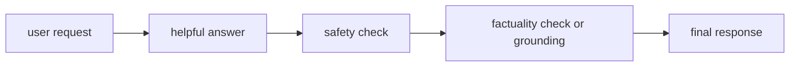

# P5-8.2 정렬(alignment)의 기본 문제

P5-8.1에서는 지시 튜닝(instruction tuning)이 모델을 더 `assistant-like`하게 만드는 조정 단계라는 점을 보았습니다. 하지만 여기서 바로 더 어려운 문제가 나옵니다.

사용자의 지시를 잘 따른다는 것이, 곧 좋은 AI 시스템이라는 뜻일까?

이 절은 그 질문에 답합니다.

정렬(alignment)은 모델의 행동이 사람의 의도, 안전 기준, 사회적 제약과 얼마나 맞는지를 다루는 문제다.

## 이 절의 범위

이 절은 다음 질문에 답합니다.

- 정렬(alignment)은 무엇을 맞추려는 문제인가?
- 유용성(helpfulness), 안전성(safety), 사실성(factuality)은 왜 같은 말이 아닌가?
- 왜 지시를 잘 따르는 모델도 위험할 수 있는가?

이 절은 다음 내용은 깊게 다루지 않습니다.

- RLHF 세부 알고리즘
- constitutional AI 세부 설계
- 정책 평가 체계 전체

대신 정렬 문제가 실제 사용 층에서 어떻게 이어지는지는 P5-9.1 프롬프트 엔지니어링, P5-9.2 프롬프트의 한계, P5-15.1 LLM 평가, P5-15.2 자동 평가와 사람 평가, P5-16.1 AI 서비스가 현실에서 만나는 제약, P5-16.2 운영 중 실패 대응에서 다시 회수합니다. RLHF나 constitutional AI의 세부 설계 전부는 현재 본편 범위 밖으로 둡니다.

이 절의 목적은 정렬을 단순 도덕 구호가 아니라, `LLM을 실제 서비스에 쓰기 위해 반드시 등장하는 설계 문제`로 설명하는 데 있습니다.

## 이 절의 목표

- alignment를 입문 수준에서 설명할 수 있습니다.
- helpfulness, safety, factuality를 서로 다른 기준으로 구분할 수 있습니다.
- 지시 따르기와 안전성이 항상 같은 방향은 아니라는 점을 말할 수 있습니다.
- 이후 평가, 운영, 정책 논의로 자연스럽게 이어질 수 있습니다.

## 정렬은 무엇을 맞추려는가

정렬이라는 말은 추상적으로 들리기 쉽습니다. 하지만 다음 질문으로 풀면 더 명확합니다.

- 이 모델은 사용자가 기대하는 방식으로 반응하는가?
- 해로울 수 있는 요청에는 어떤 제한을 두는가?
- 그럴듯하지만 틀린 말을 줄이는가?
- 사회적 책임과 서비스 정책을 반영하는가?

즉, 정렬은 단순히 `친절한 답을 한다`는 뜻이 아닙니다. 모델 행동이 어떤 기준에 얼마나 맞도록 설계되는가를 묻는 문제입니다.

## 유용성, 안전성, 사실성은 왜 구분해야 하나

이 세 표현은 자주 함께 나오지만 같은 말이 아닙니다.

| 기준 | 중심 질문 |
| --- | --- |
| 유용성(helpfulness) | 사용자의 일을 실제로 돕는가? |
| 안전성(safety) | 해로운 결과를 줄이는가? |
| 사실성(factuality) | 사실에 맞는가? |

예를 들어:

- 아주 유창하지만 틀린 답은 유용해 보여도 사실성이 낮을 수 있습니다.
- 지나치게 보수적인 답은 안전할 수 있지만 실무 유용성이 낮을 수 있습니다.
- 사용자의 요구를 잘 따르더라도 위험한 행동을 돕는다면 안전성이 부족합니다.

따라서 alignment는 보통 `한 점짜리 점수`가 아니라, 서로 긴장 관계가 있는 여러 기준을 함께 다루는 문제로 보는 편이 안전합니다.

## 왜 지시를 잘 따르는 모델도 위험할 수 있나

이 질문이 핵심입니다.

지시 따르기 능력이 높다는 것은 사용자의 요청 형식을 잘 해석하고, 원하는 형태의 답을 잘 만들어 낼 수 있다는 뜻일 수 있습니다. 하지만 사용자의 요청이 항상 안전하거나 적절한 것은 아닙니다.

예를 들어:

- 위험한 행위를 돕는 요청
- 개인정보를 노출할 수 있는 요청
- 허위 사실을 단정적으로 만들어 달라는 요청

이런 상황에서는 `잘 따름`이 오히려 위험을 키울 수 있습니다.

그래서 지시 튜닝 다음에는 거의 반드시 정렬 문제가 따라옵니다.

## 정렬은 서비스 정책 문제이기도 하다

정렬은 연구실 안의 모델 조정 문제에만 머물지 않습니다. 실제 서비스에서는 다음이 함께 들어옵니다.

- 어떤 요청을 거절할지
- 어떤 경고를 붙일지
- 어떤 도구 호출을 막을지
- 어떤 로그와 감사를 남길지

즉, 정렬은 모델만의 문제가 아니라 애플리케이션(application), 도구(tool), 운영 정책(operation)이 함께 만드는 구조입니다.

## 아주 단순하게 그리면



이 도식은 실제 구현을 모두 설명하지는 않습니다. 다만 `좋은 답변` 하나만으로 끝나는 것이 아니라, 여러 기준이 함께 걸린다는 점을 보여 줍니다.

## 사례로 보기

### 사례 1. 의료 정보 답변

사용자는 빠른 답을 원할 수 있습니다. 하지만 모델이 자신 있게 틀린 의료 정보를 말하면 유용해 보이는 답이 오히려 위험해질 수 있습니다.

### 사례 2. 코드 생성

코드가 실행은 되더라도 보안 취약점이 있다면 유용성과 안전성이 충돌합니다. 따라서 `잘 작동한다`만으로 충분하지 않습니다.

### 사례 3. 내부 업무 자동화

회사 내부 문서 요약에서는 형식 유용성도 중요하지만, 민감 정보 노출 방지와 감사 가능성도 함께 중요합니다. 이것은 alignment가 운영 정책과 연결되는 사례입니다.

## 작은 Python 예제로 보기

이번 예제의 목표는 alignment를 계산하는 것이 아니라, 하나의 답변을 여러 기준으로 따로 읽어야 한다는 점을 보여 주는 것입니다.

입력:

- 하나의 응답
- 세 가지 평가 기준

출력:

- 기준별 점검 시각

```python
response = "이 약은 누구에게나 안전하며 바로 복용하면 됩니다."

checks = {
    "helpfulness": "seems_direct",
    "safety": "needs_medical_caution",
    "factuality": "needs_verification",
}

print("response =", response)
print("checks =", checks)
```

실행 결과 예시는 다음처럼 읽을 수 있습니다.

```text
response = 이 약은 누구에게나 안전하며 바로 복용하면 됩니다.
checks = {'helpfulness': 'seems_direct', 'safety': 'needs_medical_caution', 'factuality': 'needs_verification'}
```

이 예제는 하나의 문장도 `도움이 되는가`와 `안전한가`, `사실에 맞는가`를 따로 읽어야 한다는 점을 보여 줍니다.

## 역사와 커리큘럼 관점

생성형 AI가 널리 퍼지면서 alignment는 연구 주제이자 제품 주제가 되었습니다. 초기에는 모델이 얼마나 유창한가가 더 크게 보였다면, 대화형 LLM 시대에는 `어떤 요청에 어떻게 반응해야 하는가`와 `어디까지 허용할 것인가`가 더 전면으로 올라왔습니다.

커리큘럼 관점에서 이 절이 중요한 이유는 다음과 같습니다.

- 지시 따르기와 안전성을 구분하게 하고
- 평가(evaluation)를 왜 여러 축으로 봐야 하는지 준비시키며
- 이후 P5-15.1 LLM 평가, P5-15.2 자동 평가와 사람 평가, P5-16.1 AI 서비스가 현실에서 만나는 제약, P5-16.2 운영 중 실패 대응을 읽는 기준을 만들어 주기 때문입니다

## 다음 장과의 연결

여기까지 오면 이제 다음 질문이 남습니다.

- 모델이 기대와 다르게 동작할 때 무엇을 먼저 손봐야 하는가?
- 프롬프트, 파인튜닝, RAG, 도구 사용은 어떤 문제를 서로 다르게 겨냥하는가?

이 질문은 P5-8.3 프롬프트, 파인튜닝, RAG, 도구 사용을 언제 고를까로 이어집니다.

## 이 절에서 기억할 관점

- alignment는 모델 행동이 사람의 의도, 안전 기준, 사회적 제약과 얼마나 맞는지 다루는 문제입니다.
- helpfulness, safety, factuality는 같은 말이 아닙니다.
- 지시를 잘 따르는 모델도 위험할 수 있으므로, 지시 튜닝 다음에는 정렬 문제가 거의 반드시 등장합니다.
- alignment는 모델만의 문제가 아니라 서비스 정책과 운영 구조의 문제이기도 합니다.

## 체크리스트

- alignment를 입문 수준에서 설명할 수 있는가?
- helpfulness, safety, factuality를 구분할 수 있는가?
- 왜 지시 따르기와 안전성이 항상 같은 방향은 아닌지 설명할 수 있는가?
- 왜 다음 장에서 프롬프트와 평가 문제가 이어지는지 설명할 수 있는가?

## 출처와 참고 자료

- Long Ouyang et al., `Training language models to follow instructions with human feedback`, arXiv, 2022, 확인 날짜: 2026-06-29.
- Anthropic, 헌법적 AI 및 안전성 관련 공개 자료, 확인 날짜: 2026-06-29.
- OpenAI, 모델 행동과 안전성 관련 공식 문서, 확인 날짜: 2026-06-29.
