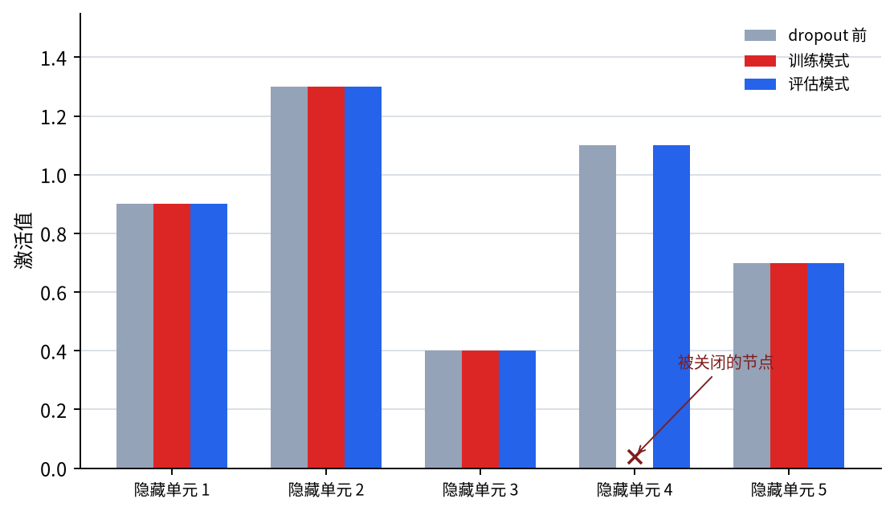
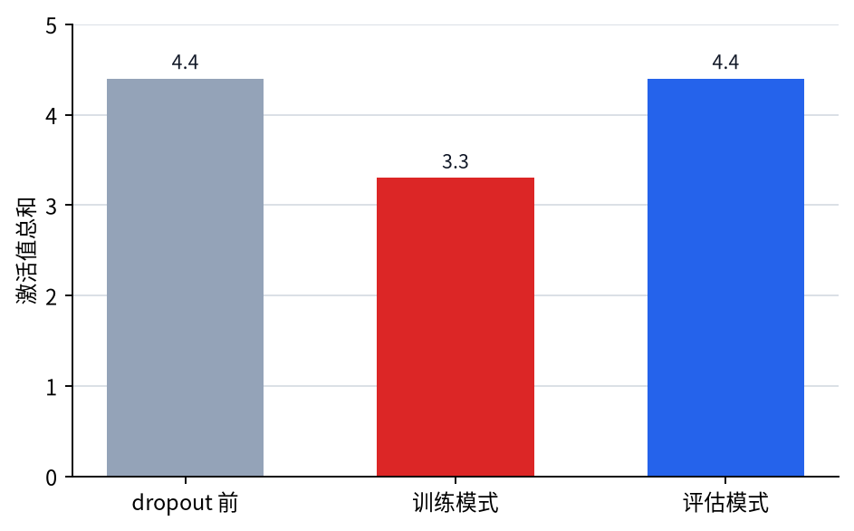

# P5-8.2 如何减少路径依赖：dropout

Section ID: `P5-8.2`
Version: `v2026.07.17`

在 P5-8.1 里，我们已经看到：可以把 regularization term 放在目标函数旁边，去调整学习循环本身的目标。现在顺着同一章的 흐름再往前走一步，看看除了在 loss 旁边加 penalty 之外，是否也能通过摇动神经网络内部路径本身来进行控制。接下来的问题会自然出现。

除了给权重加 penalty，还有没有办法通过摇动网络结构本身来减少过拟合？

回答这个问题的代表性方法，就是 dropout。也就是说，这一节在第 8 章中承担的是：从`目标函数控制`继续走到`结构层面的控制`。

dropout 是一种 regularization 技术，它会在训练中随机关闭一部分节点输出或连接，从而让模型不要过度依赖某些特定路径。

如果之后又想重新抓住：dropout 是一种通过摇动结构来起作用的 regularization，更适合回到[英文概念词汇表里的 dropout 条目](/AiBook/en/reference/concept-glossary/#dropout)，再按这个基准重读。

## 本节范围

- 为什么 dropout 会和过拟合抑制连在一起？
- 训练中切断部分连接，到底是什么意思？
- 为什么它在 training mode 和 evaluation mode 下的行为不同？
- dropout 应该被读成在学习循环里的哪个位置起作用？

training mode 与 evaluation mode 的差异，会在 P5-6.4 再次接回；regularization 的更大视角，则建立在前一节 P5-8.1 上。这里先不以记忆公式为目标，而是先说明：`为什么随机移除路径会帮助泛化，以及为什么这个技术必须和 training mode 一起读。`

## 本节目标

- 能把 dropout 解释成`降低对特定路径依赖的 regularization 技术`。
- 能说明 dropout 为什么在训练和评估时行为不同。
- 能在入门层面理解：dropout 会带来某种类似 ensemble 的直觉。
- 能说明 dropout 在第 8 章中承担的是`结构层面的控制装置`。
- 能通过可执行的 Python 例子直接确认 dropout 前后的数值变化。

## 为什么需要 dropout

深度学习模型可能会过度依赖某些特征组合，或者某几条隐藏路径。这样一来，即使训练数据上的表现很好，到了新数据上也可能很容易摇晃。

dropout 处理这个问题的方式如下。

- 在训练中随机关闭一些节点输出
- 因此模型不能总是只依赖同一条内部路径去学习
- 结果上，它会被迫更均匀地使用多条路径和多种表示

先记成下面这句话就够了。

`dropout 会在学习时暂时把网络的一部分留空，好让模型不要只依赖某一条特定连接。`

## 切断部分连接，到底是什么意思

第一次听到 dropout 时，很自然会冒出一个问题：`它真的会把网络结构删掉吗？` 通常不是这样。

在训练中：

- 某些 activation value 会被设成 0，或者
- 某些节点输出会被暂时不使用，因此
- 某条路径只在当前这个 step 里休息一下

也就是说，dropout 并不会永久删除结构。更合适的读法是：`训练过程中临时让一部分路径退出的概率性规则。`

把它画成非常简单的形式，就是下面这样。

```mermaid
--8<-- "assets/part-05/chapter-08/dropout-path-flow-zh.mmd"
```

在这张图里，`hidden unit 2` 可以读成：在当前训练 step 中正在休息的一条路径。

## 为什么这种随机移除会有帮助

这个想法乍看会有点反直觉。

`如果想让模型更好，不是应该尽量多用它吗？为什么还要故意关掉一部分？`

这里真正要确认的是：dropout 会打破`总是相信同一条路径的学习方式`，从而逼着模型建立一种分散在多条路径上的、更稳固的表示。

例如：

- 如果某个隐藏节点在训练数据上充当了非常强的捷径
- dropout 就会阻止模型假设：这个节点在每个 step 里都会一直存在

因此，模型就会被迫去学习：不是依赖`一条简单捷径`，而是依赖能够在多条路径上都撑得住的表示。

## 类似 ensemble 的直觉

在入门说明里，dropout 常会被描述成`像是在轮流训练许多部分网络`。严格说来它并不完全等同，但这个直觉很有帮助。

也就是说：

- 某个 step 里，一部分节点是开启的
- 下一个 step 里，开启的组合又会不同
- 结果上，一个大网络会给人一种像是在轮流训练多个部分结构的感觉

先记到这个程度就够了。

`dropout 会让一个网络呈现出像多张部分网络轮流被摇动着训练的感觉。`

## 为什么在 evaluation mode 里要关闭 dropout

正如 P5-6.4 已经看到的，dropout 在 training mode 和 evaluation mode 下的行为并不一样。原因很简单。

在评估或部署阶段：

- 我们需要稳定地测量当前模型到底表现如何
- 对同一输入，应该减少不必要的随机摇晃
- 用户最终拿到的结果，也不该过度忽上忽下

也就是说，dropout 是`帮助学习的噪声`，而不该变成`扰乱评估的噪声`。

把同一个输入在 train mode 和 eval mode 下怎样被不同处理，再压成一个小流程，会更容易读。

```mermaid
--8<-- "assets/part-05/chapter-08/dropout-mode-reading-flow-zh.mmd"
```

这张图里先要抓住的一点很简单。train mode 是让部分路径休息、从而摇动`对特定路径的依赖`的位置；eval mode 则是测量剩下来的模型究竟能否稳定站得住的位置。

## 案例与示例

### 案例. 评论分类模型依赖某条简单捷径时

当我们怀疑`模型似乎太依赖某一个线索或某一条隐藏路径`时，dropout 的意义就会变得最清楚。假设一个商品评论分类模型，会对 `free shipping`、`5 stars`、某个特定品牌名这类短语特别敏感，因为它们在训练数据里经常一起出现。在训练数据上，这些组合可能像是通往正确答案的快速捷径。但在新评论里，同样的短语可能出现在完全不同的语境中，或者真正重要的线索分散在别的句子里。如果模型只依赖某个隐藏节点的一次强烈反应，那么训练分数可能很高，验证数据却仍然很容易摇晃。

一旦加入 dropout，每个训练 step 里就会有一部分隐藏输出被暂时关掉。这并不意味着把评论句子里的 `free shipping` 这个词删掉，而是指：处理这条线索的某些内部表示路径，在训练中暂时不能使用。这样一来，模型就不能再假设：对 `free shipping` 反应很强的那条路径永远都会活着。它也必须去使用其他残存的线索和路径，因此学习就会从`在训练数据上特别好用的捷径`，被推向`即使部分路径缺失也依然站得住的表示`。在这个案例里，真正要检查的结果并不是训练分数是不是涨得更快，而是训练分数与验证分数之间的差距是否真的变小了。

```mermaid
--8<-- "assets/part-05/chapter-08/dropout-case-reading-flow-zh.mmd"
```

| 人最容易先看的标准 | 用 dropout 视角重新阅读的标准 |
| --- | --- |
| 只要有一个强烈反应的线索，模型就可能看起来很不错 | 需要确认这个线索是不是只是训练数据里的偶然捷径 |
| 训练分数上升得很快，学习就可能看起来很好 | 还要一起看验证间隙有没有缩小 |
| 重要节点似乎一直开着会更安全 | 即使部分节点休息也还能撑住的表示，反而可能更稳固 |

## 练习与例子

这个例子的目标，是直接确认：在训练中，dropout 确实可能把部分 activation value 变成 0。我们也会对着同一组输入一起看：为什么 training mode 和 evaluation mode 必须按不同方式阅读。

输入：

- 一组 activation value
- 一个 dropout rate

输出：

- dropout 之前的 activation value
- training mode 下 dropout 之后的 activation value
- evaluation mode 下保持不变的 activation value
- 同一输入在 train/eval 下到底会有多不一样的比较

问题场景：

- dropout 本来就是为了通过关闭部分 activation 来减少过拟合，因此直接确认训练与评估下的输出差异会更有帮助
- 也要一起看：哪些路径被关掉了，以及在 evaluation mode 里什么又重新固定下来，这样才更容易读出`对特定路径的依赖`为什么会下降

要确认的概念：

- training mode 里会有一部分节点被关掉
- evaluation mode 里不会反复进行同样的随机移除，所以输出会更稳定
- 即使某些节点缺席，剩下的路径也必须顶住输出，因此会产生额外学习压力

输入（input）：

我们使用上面整理好的 activation 列表和 dropout rate。

在看代码之前，可以先预测：哪些值只会在 train mode 改变，哪些值会在 eval mode 保持不变。

| 比较 | 可以先预测的比较 | 预测理由 |
| --- | --- | --- |
| `train_mode_values` vs `before_dropout` | 只有部分位置可能变成 0 | 因为 dropout 只会在训练中临时关闭一部分路径 |
| `eval_mode_values` vs `before_dropout` | 大致会几乎保持一致 | 因为 evaluation mode 不会继续重复相同的随机移除 |
| 这个玩具例子里的总和（`sum`） | train mode 一侧可能显得更小 | 因为这里把一部分 activation 置为 0，并且省略了额外缩放 |

这张表的目的，是把`路径移除`和`稳定评估`一起读出来。

有一点要先说清楚。真实框架里的 dropout，通常会在训练中对保留下来的 activation 再做缩放（inverted dropout），这样它们的平均规模就不会和 evaluation mode 偏离太多。下面这个例子，并不是为了把这些细节全部实现出来，而是为了先把`当前这个 step 里有些路径会缺席`的核心直觉直接 보여出来，所以故意做成简化的玩具实验。

```python
import random

activations = [0.9, 1.3, 0.4, 1.1, 0.7]
drop_rate = 0.4

def apply_dropout(values, drop_rate):
    result = []
    mask = []
    for v in values:
        if random.random() < drop_rate:
            result.append(0.0)
            mask.append(0)
        else:
            result.append(v)
            mask.append(1)
    return result, mask

random.seed(11)
train_values, train_mask = apply_dropout(activations, drop_rate)
eval_values = activations[:]

print("before_dropout =", activations)
print("before_sum =", round(sum(activations), 3))
print("train_mask =", train_mask)
print("train_mode_values =", train_values)
print("train_sum =", round(sum(train_values), 3))
print("eval_mode_values =", eval_values)
print("eval_sum =", round(sum(eval_values), 3))
```

读输出时，先看 `before_dropout` 和 `train_mask`，再接着看 `train_mode_values` 与 `eval_mode_values` 是怎样分开的。

```text
before_dropout = [0.9, 1.3, 0.4, 1.1, 0.7]
before_sum = 4.4
train_mask = [1, 1, 1, 0, 1]
train_mode_values = [0.9, 1.3, 0.4, 0.0, 0.7]
train_sum = 3.3
eval_mode_values = [0.9, 1.3, 0.4, 1.1, 0.7]
eval_sum = 4.4
```

- 有些 activation value 会保持原样
- 有些 activation value 会在当前训练 step 里变成 0
- 在 evaluation mode 下，同样输入不会再次经历这种随机移除
- 因此网络不能再假设：每条路径都会永远可用

这个例子里，首先要看的产物是各节点的 activation value。`train_mask` 为 `0` 的第四个节点，只在 training mode 里被关掉，而 evaluation mode 会保留原始 activation。



第二个产物，是这个玩具实验里的 activation 总和。在这里，因为 training mode 中有部分路径缺席，总和从 `4.4 -> 3.3` 下降了。但更安全的读法不是把这个数字当成 dropout 的一般规律，而是把它看成一个辅助观察值，用来说明`当前这个 step 究竟缺了哪条路径`。



| 比较 | 现在要读的核心 |
| --- | --- |
| `before` vs `train` | 某个节点真的缺席了，因此总和也跟着下降。 |
| `train` vs `eval` | train mode 会摇动路径，而 eval mode 会把同一输入更稳定地保持住。 |
| `train_sum` | 在这个玩具实验里，它只是辅助显示某条路径暂时休息了。核心不在总和本身，而在于打破路径依赖的那股压力。 |

即使在读取输出数字时，也要把`有多少项变成了 0`和`因此产生了什么样的学习压力`分开来看。

| 比较 | 输出里首先看到的 | 只看数值时容易留下的解读 | 把 dropout 一起算进去之后会改变的解读 |
| --- | --- | --- | --- |
| `before` vs `train` | 有一个 `1.1` 消失了，总和也从 `4.4 -> 3.3` 下降 | 容易觉得信息只是变少了，看起来只有损失 | 因为某条特定路径缺席了，其余路径必须一起顶住输出，因此会产生减少捷径依赖的压力 |
| `train` vs `eval` | 同样的输入，在 train 里会摇，在 eval 里会保留原值 | 容易看起来像实现不一致或不稳定 | 其实这是把角色分开了：只在学习时故意加噪声，而在评估时保持稳定 |
| `train_sum` vs `eval_sum` | 在这个玩具实验里，train 的总和更小，而 eval 保持原来的水平 | 容易觉得 train 值更小就等于性能更差 | 真正要看的不是总和本身，而是模型是否被逼着学会：即使某些路径空了，也还能撑住 |

也就是说，读 dropout 时，读者真正要抓住的不只是`有多少项变成了 0`，还要抓住`当某条特定路径缺席时，模型是不是被迫仍然要站得住。`

这个例子并没有把真实框架里 dropout 的全部细节都实现出来，例如缩放（scaling）就没有完整纳入。所以更安全的读法不是把`用了 dropout 之后 train 的总和一定更小`背成一般规律，而是先固定住核心直觉：`为什么让部分路径在学习中休息的规则，会打破对特定路径的依赖。`

dropout 也会把 Part 5 前面几个概念重新接在一起。

- 它阻止读者把 P5-8.1 里的 regularization 只理解成`penalty 公式`
- 它引入一种想法：在学习中故意加入噪声，也可以帮助泛化
- 它再次确认：为什么前面 P5-6.4 里看到的 training mode 与 evaluation mode 差异，在实务里是有必要的

## 在学习循环里应该把 dropout 放在哪里读

在已经抓住 regularization 的一般视角之后，自然就会继续问：`有没有一种过拟合抑制方式，不能只用 penalty 来解释？` 这时就适合把 dropout 拿出来。dropout 不该被读成 optimizer 后面附带的一项功能，而应该被读成：在 forward 计算里临时让部分路径休息，借此阻止学习只依赖某种固定捷径的一种装置。

| 首先出现的问题场景 | 为什么此时 dropout 视角更有用 | 接着会连到哪里 |
| --- | --- | --- |
| 感觉模型过度依赖某一条路径或某个隐藏节点 | 它能展示：通过摇动结构本身，让模型被迫使用多条路径的 regularization 直觉 | 会在 P5-8.3 里和计算稳定化条件分开后再重新并起来 |
| 数据有限，或者 fully connected 层很大，看起来很容易死记 | 它能说明为什么随机移除路径有助于抑制过拟合 | 会重新连回 regularization 的更大视角和学习循环的整理 |
| 需要再次说明 training/eval mode 差异为什么在实务里重要 | 因为 dropout 是最直观暴露 mode 差异的案例之一 | 可以和 P5-6.1 的学习循环、P5-8.3 的稳定化轴一起再重读 |
| 只用 penalty 项解释 regularization 显得太窄 | 它能通过具体案例，把 regularization 作为设计哲学的意思展开 | 也为后面和其他 regularization 技术比较做准备 |

## 检查清单

- 能说明 dropout 是一种减少对特定路径依赖的 regularization 技术吗？
- 能说明为什么 dropout 在 training mode 和 evaluation mode 下的行为不同吗？
- 能把 dropout 解释成`通过让部分路径临时休息，减少对捷径路径依赖的 regularization`吗？
- 能说明 evaluation mode 通常不会继续保持同样的随机移除吗？
- 当需要一个最直观重示 training/eval mode 差异的案例时，能重新调出随机路径移除和评估模式差异吗？
- 能理解这一节在第 8 章里承担的是`结构层面的控制`，下一节会转向`让深层计算本身真正站得住的条件`吗？

## 出处与参考资料

- Nitish Srivastava et al., `Dropout: A Simple Way to Prevent Neural Networks from Overfitting`, JMLR, 2014, 确认日期：2026-06-29。
- Ian Goodfellow, Yoshua Bengio, Aaron Courville, `Deep Learning`, MIT Press, 2016, 确认日期：2026-06-29。 [https://www.deeplearningbook.org/](https://www.deeplearningbook.org/){: target="_blank" rel="noopener noreferrer" }
- Aurélien Géron, `Hands-On Machine Learning with Scikit-Learn, Keras, and TensorFlow`, 3rd ed., O'Reilly, 2022, 确认日期：2026-06-29。
