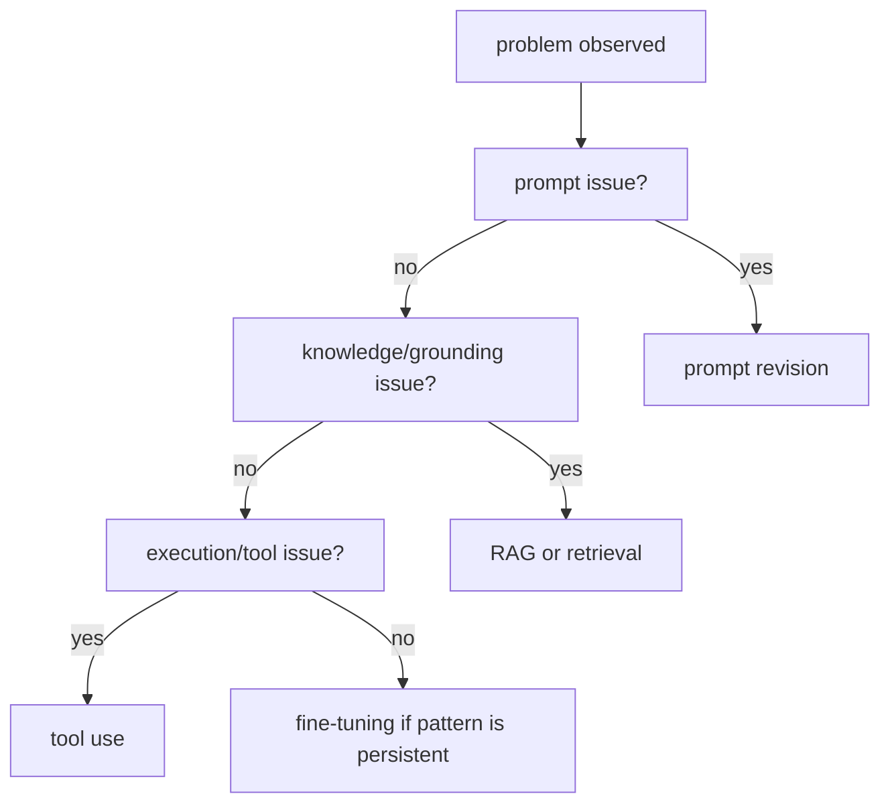

# P5-8.3 프롬프트, 파인튜닝, RAG, 도구 사용을 언제 고를까

P5-8.2까지 오면 지시 튜닝과 정렬 문제를 보게 됩니다. 그러면 실무 관점에서는 다음 질문이 바로 따라옵니다.

모델이 기대와 다르게 동작할 때, 무엇을 바꿔야 하는가?

이 절은 그 질문에 답합니다.

생성형 AI 기능을 개선할 때는 모든 문제를 한 방법으로 풀지 않고, `프롬프트 수정`, `파인튜닝`, `RAG`, `도구 사용`이 각각 어떤 문제를 겨냥하는지 구분해 선택하는 편이 안전하다.

## 이 절의 범위

이 절은 다음 질문에 답합니다.

- 프롬프트, 파인튜닝, RAG, 도구 사용은 각각 어떤 문제를 해결하려는가?
- 어떤 실패는 입력 설계로 고치고, 어떤 실패는 외부 근거나 실행 연결이 필요한가?
- 이 선택 기준이 P5-9의 프롬프트, P5-10과 P5-11의 RAG, P5-12와 P5-13의 tool use·agent 장을 읽는 데 왜 중요한가?

이 절에서는 다음 내용을 깊게 다루지 않습니다.

- 개별 모델의 비용 비교표
- 데이터셋 구축과 파인튜닝 파이프라인 전체
- 조직별 품질 운영 프로세스

개별 모델의 비용 비교표와 파인튜닝 파이프라인 전체는 여기서 다루지 않고, 각각의 선택 기준만 남깁니다. 대신 프롬프트 조정은 P5-9.1, P5-9.2에서, 근거 연결은 P5-10.1, P5-10.2와 P5-11.1, P5-11.2에서, 실행 연결은 P5-12.1, P5-12.2와 P5-13.1, P5-13.2에서 다시 구체화합니다. 조직별 품질 운영 프로세스의 세부 설계는 현재 본편 범위 밖으로 두고, 운영 판단의 큰 축은 P5-15.1, P5-15.2와 P5-16.1, P5-16.2에서 다시 회수합니다.

이 절의 목적은 후속 장의 세부 기술을 대신 설명하는 데 있지 않습니다. 오히려 `무엇을 어디서 먼저 손봐야 하는가`를 구분하는 판단 기준을 주는 데 있습니다.

## 이 절의 목표

- 프롬프트, 파인튜닝, RAG, 도구 사용의 역할 차이를 설명할 수 있습니다.
- 문제 유형에 따라 어느 축을 먼저 점검해야 하는지 말할 수 있습니다.
- P5-9의 프롬프트, P5-10과 P5-11의 RAG, P5-12와 P5-13의 tool use·agent 장을 하나의 선택 지도 안에서 읽을 수 있습니다.
- 통합 미니 실습에서 왜 여러 장치를 함께 쓰는지 더 쉽게 이해할 수 있습니다.

## 네 가지 선택지를 가장 짧게 구분하면

| 수단 | 먼저 겨냥하는 문제 |
| --- | --- |
| 프롬프트 수정 | 같은 모델 안에서 입력 지시와 출력 형식을 더 잘 유도하고 싶을 때 |
| 파인튜닝 | 특정 말투, 도메인 패턴, 반복 과업 적응이 꾸준히 필요할 때 |
| RAG | 최신 정보, 내부 문서, 근거 연결이 필요할 때 |
| 도구 사용 | 계산, 조회, 실행처럼 모델 밖의 기능이 필요할 때 |

이 네 가지는 비슷한 개선처럼 보여도 겨냥하는 실패 유형이 다릅니다.

## 무엇을 먼저 고르면 안 되는가

이 절에서 중요한 것은 `무엇이 맞는가`만이 아니라, `무엇으로는 잘 안 닫히는가`를 같이 보는 일입니다.

| 수단 | 먼저 잘 맞는 문제 | 이것만으로는 잘 안 닫히는 문제 |
| --- | --- | --- |
| 프롬프트 수정 | 형식 흔들림, 설명 순서, 말투 조정 | 최신 정보 부족, 외부 실행, 계산 정확도 보장 |
| 파인튜닝 | 반복되는 도메인 스타일, 지속적 과업 적응 | 자주 바뀌는 최신 문서 반영, 즉시 조회형 문제 |
| RAG | 최신성, 내부 문서 근거, 출처 연결 | 계산 실행, 상태 변경, 외부 시스템 동작 |
| 도구 사용 | 계산, 조회, 실제 실행 | 말투 일관성, 장기적 도메인 스타일 적응 |

즉, 선택 지도는 `네 가지 중 하나를 고른다`보다 `현재 실패가 어느 층위의 문제인가`를 먼저 분리하는 데 목적이 있습니다.

## 프롬프트를 먼저 볼 때

다음 문제는 프롬프트를 먼저 손보는 편이 자연스럽습니다.

- 답변 형식이 자주 흐트러진다
- 지시 순서를 잘못 따른다
- 같은 정보인데 더 요약되거나 더 구조화된 출력이 필요하다

이 경우에는 모델의 지식이 부족하다기보다, 현재 입력 설계가 목표를 충분히 드러내지 못할 수 있습니다.

## 파인튜닝을 고려할 때

다음 조건이 반복되면 파인튜닝을 검토할 수 있습니다.

- 특정 도메인 스타일이 계속 필요하다
- 같은 패턴의 작업을 대량으로 안정적으로 처리해야 한다
- 프롬프트만으로는 일관성이 잘 올라오지 않는다

즉, 파인튜닝은 `매번 입력을 길게 설계하는 문제`를 일부 학습층으로 옮기는 선택에 가깝습니다.

## RAG를 붙여야 할 때

다음 문제는 프롬프트보다 RAG 축을 먼저 봐야 합니다.

- 답변의 최신성이 중요하다
- 내부 문서 근거가 필요하다
- 모델 내부 기억만으로 답하게 두면 위험하다

이 경우 핵심 문제는 `어떻게 더 잘 말하게 만들까`보다 `무엇을 근거로 말하게 만들까`에 있습니다.

## 도구 사용이 필요한 때

다음 문제는 RAG만으로도 해결되지 않습니다.

- 계산을 직접 해야 한다
- 현재 상태를 조회해야 한다
- 외부 시스템에 실제 행동을 일으켜야 한다

예를 들어 일정 생성, 잔여 휴가 조회, 파일 읽기, 주문 상태 확인은 문서 근거만으로는 끝나지 않습니다. 이때는 도구 사용이 붙어야 합니다.

## 아주 단순하게 그리면



이 도식은 모든 선택을 기계적으로 자동화하려는 것이 아니라, 후속 장을 읽는 판단 순서를 주는 데 목적이 있습니다.

## 사례로 보기

### 사례 1. 답변 형식이 자주 흐트러진다

사용자가 `항상 세 줄 요약으로 답해 달라`고 요청했는데, 어떤 답은 길고 어떤 답은 짧게 나온다고 해 봅시다. 사람은 답이 흔들리면 먼저 모델이 똑똑하지 않다고 느끼기 쉽지만, 이때 최신 문서가 없어서 틀리는 것도 아니고, 계산 도구가 없어서 실패하는 것도 아닙니다. 핵심 문제는 `어떤 형식으로 답해야 하는가`가 흔들리는 것이므로, 근거나 도구를 붙이기 전에 프롬프트 구조와 예시를 먼저 손보는 편이 자연스럽습니다. 예를 들어 내용은 맞지만 불릿이 네 줄로 늘어나면, 최신성 문제나 계산 문제를 해결해도 여전히 사용 목적에는 맞지 않습니다. 그래서 이 사례에서 확인해야 할 결과는 RAG나 도구를 붙이기 전에 프롬프트 구조를 고쳤을 때 답변 형식 흔들림이 실제로 줄어드는가입니다.

### 사례 2. 사내 규정을 자주 틀린다

사내 휴가 규정이 자주 바뀌는데 모델이 지난 분기 기준으로 답한다고 해 봅시다. 사람은 답변 문장이 어색하지 않으면 일단 맞다고 넘어가기 쉽지만, 이 경우 답변 형식을 아무리 다듬어도 모델 내부 기억만으로는 최신 규정 반영이 어렵습니다. 핵심 문제는 `현재 문서 근거가 없다`는 점이므로, 프롬프트를 길게 쓰기보다 RAG로 최신 규정을 먼저 붙이는 편이 자연스럽습니다. 예를 들어 문장을 더 공손하게 바꾸거나 답변 길이를 조절해도, 최신 기준 숫자가 틀리면 문제는 그대로 남습니다. 그래서 이 사례에서 확인해야 할 결과는 프롬프트 수정만으로는 안 고쳐지던 최신성 오류가 최신 문서 근거를 붙였을 때 실제로 줄어드는가입니다.

### 사례 3. 숫자 계산을 자주 틀린다

모델이 할인율 계산이나 총액 합산을 자주 틀린다고 해 봅시다. 사람은 `천천히 생각해 봐` 같은 프롬프트를 더 길게 붙이면 해결될 것처럼 느끼기 쉽지만, 계산 자체를 정확하게 보장해 주지는 못합니다. 핵심이 실행 정확도라면 더 긴 프롬프트보다 계산 도구 연결이 더 직접적인 해결책일 수 있습니다. 예를 들어 설명은 더 길고 그럴듯해져도, 마지막 숫자 하나가 틀리면 업무상 실패는 그대로입니다. 그래서 이 사례에서 확인해야 할 결과는 설명 길이를 늘리는 것보다 계산 도구를 붙였을 때 최종 숫자 정확도가 실제로 더 안정되는가입니다.

### 사례 4. 같은 도메인 문체를 항상 일정하게 맞추고 싶다

법률 안내, 의료 상담 초안, 브랜드 공지처럼 같은 도메인 문체를 오래 일관되게 유지해야 하는 경우를 생각해 보겠습니다. 사람은 프롬프트에 말투 규칙을 길게 넣으면 충분하다고 느끼기 쉽지만, 요청이 많아질수록 표현이 조금씩 흔들릴 수 있습니다. 이때는 일회성 수정이 아니라 지속적인 스타일 조정 문제이므로, 파인튜닝이나 더 구조화된 조정층을 검토할 수 있습니다. 예를 들어 하루는 존댓말이 강하고 다른 날은 설명 순서가 바뀌면, 내용이 맞아도 브랜드나 도메인 톤은 쉽게 흔들릴 수 있습니다. 그래서 이 사례에서 확인해야 할 결과는 같은 스타일 문제가 반복해서 남을 때 입력 문장 수정보다 모델 조정층 보강이 더 일관된 문체로 이어지는가입니다.

## 작은 Python 예제로 보기

```python
issues = {
    "format drift": "prompt revision",
    "missing latest policy": "RAG",
    "needs calculator": "tool use",
    "persistent domain style": "fine-tuning",
}

for issue, action in issues.items():
    print(issue, "->", action)
```

실행 결과 예시는 다음처럼 읽을 수 있습니다.

```text
format drift -> prompt revision
missing latest policy -> RAG
needs calculator -> tool use
persistent domain style -> fine-tuning
```

그래서 이 예제에서 확인해야 할 결과는 비슷해 보이는 LLM 문제라도 원인 유형에 따라 먼저 선택해야 할 해결 수단이 실제로 달라진다는 점입니다.

## 다음 장과의 연결

여기까지 오면 뒤 장들의 역할이 더 분명해집니다.

- 입력 설계 자체를 다루는 문제는 P5-9 프롬프트 엔지니어링으로 이어집니다.
- 외부 근거 연결은 P5-10 RAG와 P5-11 벡터 검색으로 이어집니다.
- 실행과 호출은 P5-12 도구 사용과 P5-13 에이전트 구조로 이어집니다.

가까운 다음 본류는 P5-9.1 프롬프트 엔지니어링(prompt engineering)입니다.

즉, 이 절은 뒤 장을 대신하는 절이 아니라, 뒤 장을 어떤 질문으로 읽어야 하는지 정리하는 지도입니다.

## 이 절에서 기억할 관점

- 모든 생성형 AI 문제를 프롬프트 하나로 해결하려고 하면 구조가 흐려집니다.
- 프롬프트, 파인튜닝, RAG, 도구 사용은 겨냥하는 실패 유형이 다릅니다.
- 근거 부족 문제는 RAG 쪽, 실행 부족 문제는 도구 사용 쪽에서 먼저 봐야 합니다.
- 이 구분을 잡아 두면 뒤 절에서 문제를 만났을 때 `프롬프트를 더 길게 쓸 문제인가`, `근거를 붙일 문제인가`, `실행 도구를 연결할 문제인가`를 먼저 나눠 볼 수 있습니다.

## 체크리스트

- 프롬프트, 파인튜닝, RAG, 도구 사용의 역할 차이를 설명할 수 있는가?
- 문제 유형에 따라 어느 축을 먼저 점검해야 하는지 말할 수 있는가?
- 뒤 장들을 하나의 선택 지도 안에서 읽을 수 있는가?
- 통합 미니 실습에서 왜 여러 장치가 함께 등장하는지 설명할 수 있는가?

## 출처와 참고 자료

이 문서는 Part 5 내부 연결을 강화하기 위한 자체 구성 문서입니다. 외부 자료를 직접 인용하지 않았습니다.
