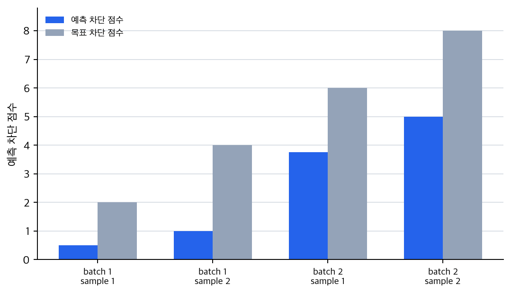
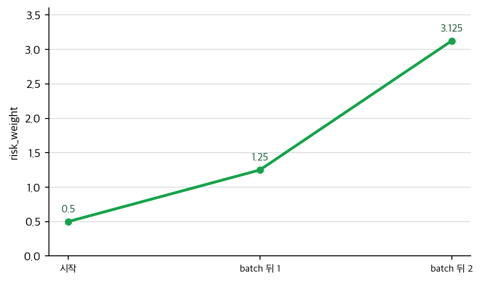

# P5-8.3 학습 루프를 한 번에 다시 묶기

Section ID: `P5-8.3`
Version: `v2026.07.14`

P5-6장에서는 학습과 모델 실행을 구분했고, P5-7장에서는 옵티마이저를, P5-8장에서는 정규화와 드롭아웃을 보았습니다. 여기까지 오면 다음 질문이 자연스럽게 남습니다.

이 요소들은 실제 학습 과정 안에서 어떤 순서와 역할로 함께 움직이는가?

딥러닝 학습 루프는 `forward -> loss -> backward -> optimizer step -> regularization/모드 제어`가 반복되는 구조로 읽는 편이 안전하다.

학습 루프 안에서 손실, 역전파, 업데이트, 모드 전환의 자리가 다시 섞이면 개념사전의 [학습(training)](../../../reference/concept-glossary.md#training), [역전파(backpropagation)](../../../reference/concept-glossary.md#backpropagation), [옵티마이저(optimizer)](../../../reference/concept-glossary.md#optimizer) 항목을 함께 다시 봅니다.

## 이 절의 범위

- 지금까지 본 손실, 역전파, 옵티마이저, 정규화는 하나의 학습 루프에서 어떻게 이어지는가?
- training mode와 evaluation mode는 왜 이 루프 안에서 같이 읽어야 하는가?
- 이 구분이 뒤의 CNN, RNN, Transformer 설명에 왜 중요한가?

이 절에서는 다음 내용을 깊게 다루지 않습니다.

- 분산 학습 루프 전체 구현
- mixed precision, gradient accumulation 세부 기법
- 프레임워크 내부 autograd 엔진 구현

분산 학습 루프, mixed precision, gradient accumulation은 이 책의 현재 본편 범위 밖으로 두고, 여기서는 단일 학습 루프의 공통 골격만 먼저 잡습니다. autograd 엔진의 내부 구현도 범위 밖으로 두되, gradient가 optimizer update로 이어지는 관점 자체는 앞선 P5-5.1, P5-5.2와 P5-7.1, P5-7.2에서 이미 회수한 흐름 위에서 다시 묶습니다. 여기서는 새 알고리즘을 더 추가하기보다, 이미 본 개념들을 `한 장면의 학습 흐름`으로 다시 묶습니다.

## 이 절의 목표

- 딥러닝 학습 루프를 한 번에 설명할 수 있습니다.
- forward, loss, backward, optimizer step의 순서를 말할 수 있습니다.
- regularization과 mode 전환이 왜 학습 루프와 함께 읽혀야 하는지 설명할 수 있습니다.
- 뒤 장의 구조 설명을 `학습 가능한 구조` 관점에서 읽을 수 있습니다.

## 가장 작은 학습 루프

딥러닝 모델을 학습시킬 때는 보통 다음 순서가 반복됩니다.

1. 입력을 넣고 출력값을 계산한다.
2. 출력과 정답 차이를 손실로 계산한다.
3. 손실이 각 가중치에 미친 영향을 뒤로 전달한다.
4. 옵티마이저가 그 영향을 바탕으로 가중치를 갱신한다.
5. 이 과정을 여러 배치(batch)에 대해 반복한다.

이 다섯 단계가 Part 5 초반부에서 따로 보았던 내용을 실제로 연결하는 가장 작은 골격입니다.

## 왜 모드 전환이 여기에 붙는가

training mode와 evaluation mode는 루프 바깥의 부가 설정이 아닙니다.

- training mode에서는 dropout이 켜질 수 있고
- batch normalization은 현재 배치 통계를 사용할 수 있으며
- optimizer step이 실제 업데이트를 일으킵니다

반대로 evaluation mode에서는:

- dropout은 꺼지고
- 평가용 동작이 고정되며
- 가중치 업데이트는 일어나지 않습니다

즉, `학습 루프가 언제 실제로 모델을 바꾸는가`를 읽으려면 모드 전환을 함께 봐야 합니다.

## 정규화는 어디에 들어가나

정규화(regularization)는 학습 루프 밖의 별도 철학이 아니라, 루프 안에서 `과하게 외우는 방향`을 제어하는 장치입니다.

예를 들어:

- 가중치 크기에 패널티를 주거나
- 일부 뉴런을 임시로 끄거나
- 데이터나 배치 통계를 다르게 읽게 하는 방식은

모두 `업데이트가 너무 특정 데이터에만 맞춰지는 것`을 줄이기 위한 장치입니다.

따라서 정규화는 손실과 optimizer 사이의 별도 주석이 아니라, 학습 루프 전체의 성격을 바꾸는 요소로 읽어야 합니다.

## 아주 단순하게 그리면

```mermaid
--8<-- "assets/part-05/chapter-08/training-loop-regularization-flow-ko.mmd"
```

이 도식의 핵심은 지금까지 따로 본 개념들이 실제로는 한 반복 안에 묶여 있다는 점입니다.

## 사례 및 예시

### 사례 1. 이미지 분류 학습

이미지를 넣고 분류 점수를 계산한 뒤 손실을 구하고, 역전파와 optimizer step으로 가중치를 갱신하는 흐름은 CNN에서도 그대로 유지됩니다. 사람은 CNN처럼 구조가 바뀌면 학습 방식도 완전히 새로 바뀐다고 느끼기 쉽습니다. 하지만 실제로 사람이 먼저 보던 기준이 `새 구조 이름이 붙었는가`였다면, 더 중요한 기준은 `그 구조가 forward 안에 어떤 계산 블록으로 들어가고 backward와 update는 그대로 이어지는가`입니다. 즉, 바뀌는 것은 합성곱 같은 내부 계산 블록이지 `forward -> loss -> backward -> update`라는 뼈대 자체는 아닙니다. 그래서 이 사례에서 확인해야 할 결과는 CNN이라는 이름을 외우는 것보다, 합성곱이 들어가도 학습 루프의 공통 골격은 유지된다는 점을 설명할 수 있는가입니다.

### 사례 2. 문장 분류 학습

입력을 텍스트로 바꾸고 구조를 RNN이나 Transformer로 바꿔도, 손실 계산과 backward, optimizer step이라는 루프는 그대로 남습니다. 사람은 텍스트 모델이 되면 완전히 다른 절차를 쓸 것처럼 느끼기 쉽습니다. 하지만 사람이 하던 단순 구분이 `이미지 모델`과 `텍스트 모델`처럼 입력 종류만 나누는 수준에 머물면, 토큰 길이, 임베딩, attention이 붙어도 공통으로 남는 학습 골격을 놓치기 쉽습니다. 실제로 바뀌는 것은 입력 구조와 내부 계산이고, 한 배치를 forward로 통과시키고 손실을 계산한 뒤 gradient를 되돌려 업데이트한다는 흐름은 같습니다. 그래서 이 사례에서 확인해야 할 결과는 모델 종류가 달라져도 `어디가 입력 표현 변화이고 어디가 공통 학습 단계인가`를 나눠 읽을 수 있는가입니다.

### 사례 3. 과적합 징후

학습 손실은 계속 내려가는데 검증 성능이 나빠진다면, 사람은 먼저 `모델 구조가 나쁘다`고 결론내리기 쉽습니다. 하지만 이런 경우에는 구조 자체보다 regularization이나 mode 설정을 다시 봐야 할 수 있습니다. 예를 들어 dropout이 학습에서는 켜지는데 평가에서는 꺼져야 하는데도 mode 전환이 잘못되어 있거나, 가중치가 훈련 데이터에만 과하게 맞춰지고 있을 수 있습니다. 학습 루프를 한 장면으로 묶어 보고 있으면 `구조 문제인가`, `업데이트 문제인가`, `평가 설정 문제인가`를 더 빨리 분리해 볼 수 있습니다. 그래서 이 사례에서 확인해야 할 결과는 구조 이름을 바꾸기 전에 regularization, mode, 평가 절차를 먼저 점검하는 순서가 실제 원인 분리에 더 도움이 되는가입니다.

| 사람이 먼저 보기 쉬운 기준 | 학습 루프 관점으로 다시 읽는 기준 |
| --- | --- |
| CNN, RNN, Transformer처럼 새 구조 이름이 붙으면 학습 절차도 완전히 바뀐다고 느끼기 쉽다 | 바뀌는 것은 내부 계산 블록이고, `forward -> loss -> backward -> optimizer step`이라는 공통 반복은 그대로 남는다 |
| 과적합 징후가 보이면 먼저 구조 이름부터 바꿔야 한다고 느끼기 쉽다 | regularization, mode, 평가 절차가 루프 안에서 어떻게 작동했는지 먼저 분리해 봐야 한다 |
| 이미지 모델과 텍스트 모델은 학습 방식도 완전히 다를 것처럼 느끼기 쉽다 | 입력 표현과 내부 구조는 달라도 batch 단위 forward, loss, backward, update라는 뼈대는 공통으로 유지된다 |
| mode나 regularization은 부가 설정이라고 보기 쉽다 | 이 요소들도 루프 안에서 손실 해석, 업데이트 경로, 평가 안정성에 직접 영향을 주는 구성 요소다 |

이 사례들에서 최종적으로 확인해야 할 결과는 분명합니다. 학습 루프의 핵심은 `새 구조 이름을 많이 아는가`가 아니라, 어떤 구조가 오더라도 공통 반복은 유지되고, 문제 원인은 그 반복 안의 손실·업데이트·mode·regularization 위치로 다시 분해해 읽어야 한다는 데 있습니다.

## 연습 및 예제

이번 예제의 목표는 실제 딥러닝 프레임워크를 다루는 것이 아니라, 학습 루프 안에서 `forward -> loss -> backward -> optimizer step`이 어떻게 한 운영 배치(batch)씩 반복되는지 확인하는 것입니다.

입력:

- 경보 수치를 두 개씩 묶은 batch 2개
- 각 batch의 목표 차단 점수
- 위험 가중치 하나 `risk_weight`

출력:

- batch별 예측 차단 점수 목록
- batch별 평균 loss
- batch별 평균 gradient
- step 이후 갱신된 위험 가중치

문제 상황:

- 배치 학습은 샘플 하나가 아니라 묶음 단위로 gradient를 계산하므로, batch별 평균 손실과 평균 gradient를 같이 보는 것이 중요하다

확인할 개념:

- 배치 단위 gradient는 여러 샘플의 오차를 모아 계산한 결과다
- 샘플별 계산을 평균한 뒤 한 번 업데이트하는 구조가 학습 루프의 기본 형태다

입력(input):

각 batch는 `alarm_count` 두 건과 그에 대응하는 `target_block_score` 두 건을 담고 있다고 가정합니다. 학습 루프는 현재 `risk_weight`로 batch 안 모든 예측 차단 점수를 먼저 계산한 뒤, 평균 손실과 평균 gradient를 모아 한 번만 업데이트합니다.

코드를 보기 전에 먼저 각 batch에서 무엇이 먼저 계산되고, 무엇이 마지막에 한 번만 바뀌는지 예상해 보면 학습 루프의 순서가 더 잘 고정됩니다.

| 비교 항목 | 먼저 예상해 볼 출력 | 예상 이유 |
| --- | --- | --- |
| `predictions` | 각 batch 안의 샘플마다 먼저 계산될 가능성이 큼 | forward 단계에서는 현재 `risk_weight`로 각 입력의 예측 차단 점수를 먼저 만듭니다. |
| `batch_loss`, `batch_gradient` | 샘플별 계산 뒤 평균으로 한 번 모일 가능성이 큼 | 손실과 gradient는 batch 안 여러 샘플 결과를 묶어 읽어야 하기 때문입니다. |
| `updated_risk_weight` | batch마다 한 번씩만 바뀔 가능성이 큼 | optimizer step은 샘플별로 즉시 바꾸지 않고 batch 평균 gradient 뒤에 한 번 적용됩니다. |
| 두 번째 batch의 `predictions` | 첫 번째 batch에서 갱신된 `risk_weight` 영향을 받을 가능성이 큼 | 학습 루프는 이전 update 결과를 다음 batch forward가 이어받는 반복 구조이기 때문입니다. |

이 표의 목적은 정확한 수치를 미리 외우는 데 있지 않습니다. 학습 루프를 읽을 때 `무엇이 샘플별 forward 결과인가`, `무엇이 batch 평균으로 모이는가`, `무엇이 step 끝에서 한 번 바뀌는가`를 코드 전에 붙잡는 데 있습니다.

```python
batches = [
    [
        {"alarm_count": 1.0, "target_block_score": 2.0},
        {"alarm_count": 2.0, "target_block_score": 4.0},
    ],
    [
        {"alarm_count": 3.0, "target_block_score": 6.0},
        {"alarm_count": 4.0, "target_block_score": 8.0},
    ],
]

risk_weight = 0.5
learning_rate = 0.1

for step, batch in enumerate(batches, start=1):
    predictions = []
    losses = []
    gradients = []

    for sample in batch:
        alarm_count = sample["alarm_count"]
        target_block_score = sample["target_block_score"]

        prediction = risk_weight * alarm_count
        loss = (prediction - target_block_score) ** 2
        gradient_risk_weight = 2 * (prediction - target_block_score) * alarm_count

        predictions.append(round(prediction, 3))
        losses.append(loss)
        gradients.append(gradient_risk_weight)

    batch_loss = sum(losses) / len(losses)
    batch_gradient = sum(gradients) / len(gradients)

    risk_weight = risk_weight - learning_rate * batch_gradient

    print(f"[batch {step}]")
    print("predictions =", predictions)
    print("batch_loss =", round(batch_loss, 3))
    print("batch_gradient =", round(batch_gradient, 3))
    print("updated_risk_weight =", round(risk_weight, 3))
    print("---")
```

출력에서는 각 batch마다 predictions가 먼저 계산되고, 그 뒤 평균 loss와 평균 gradient가 모인 다음 updated_risk_weight가 한 번 바뀌는 순서를 보면 됩니다.

```text
[batch 1]
predictions = [0.5, 1.0]
batch_loss = 5.625
batch_gradient = -7.5
updated_risk_weight = 1.25
---
[batch 2]
predictions = [3.75, 5.0]
batch_loss = 7.031
batch_gradient = -18.75
updated_risk_weight = 3.125
---
```

이 예제에서 핵심은 다음입니다.

- 딥러닝 학습은 한 번의 계산이 아니라 batch마다 반복되는 루프입니다
- 각 batch에서 forward, loss, backward, optimizer step이 같은 순서로 다시 등장합니다
- 구조 설명과 학습 설명은 이 루프 안에서 다시 만나야 합니다

이 흐름을 예제 산출물 기준으로 나누어 보면 먼저 forward 결과가 보입니다. 첫 번째 batch는 `risk_weight=0.5`로 예측하므로 목표보다 낮게 나오고, 두 번째 batch는 첫 업데이트 뒤 `risk_weight=1.25`가 반영된 상태에서 다시 예측됩니다.



다음 산출물은 batch 평균 loss입니다. loss는 각 batch 안의 샘플별 오차를 평균으로 묶은 값이므로, optimizer가 바로 보는 것은 개별 샘플 하나가 아니라 batch가 만든 평균 신호입니다.


그다음 산출물은 batch 평균 gradient입니다. 두 값이 모두 음수라는 점은 현재 `risk_weight`가 목표보다 낮은 예측을 만들고 있어서, update가 `risk_weight`를 키우는 방향으로 이어진다는 뜻입니다.


마지막 산출물은 optimizer step 뒤의 `risk_weight`입니다. 이 그래프는 학습 루프가 출력값을 한 번 계산하고 끝나는 절차가 아니라, batch 평균 gradient를 통해 다음 batch의 forward 조건 자체를 바꾸는 반복 구조라는 점을 보여 줍니다.



여기서 바로 다음 장으로 넘어가기 전에, `공통 학습 절차`와 `뒤에서 달라질 구조`를 짧게 다시 나누어 두면 읽기 축이 덜 섞입니다.

| 지금 절에서 고정할 것 | 뒤 구조 장에서 달라질 것 | 왜 지금 나눠 두는가 |
| --- | --- | --- |
| `forward -> loss -> backward -> optimizer step`이라는 공통 루프 | CNN의 지역 패턴 읽기, RNN의 순차 상태, attention의 선택적 참조, Transformer의 병렬 블록 | 뒤 장에서 새 이름이 나와도 `학습 절차가 바뀌는가`와 `내부 계산 구조가 바뀌는가`를 분리해 읽기 위해 |
| training/evaluation mode와 regularization이 업데이트에 어떤 영향을 주는가 | 각 구조가 어떤 데이터 문제를 더 자연스럽게 다루는가 | 과적합이나 평가 오류를 구조 탓으로만 오해하지 않기 위해 |

## 언제 학습 루프를 다시 한 번에 묶어 읽는가

이 절을 꺼내야 하는 시점은 손실, 역전파, optimizer, mode, regularization을 각각 따로는 이해했지만 하나의 반복 구조로는 아직 잘 안 보일 때입니다.

| 먼저 보이는 문제 장면 | 학습 루프 요약이 먼저 유용한 이유 | 바로 다음에 이어질 곳 |
| --- | --- | --- |
| 개념은 알겠는데 순서가 자꾸 섞인다 | forward, loss, backward, update의 공통 골격을 다시 고정할 수 있습니다. | GPU, 배치, 병렬 처리 같은 실행 효율 논의로 넘어갑니다. |
| 구조 장으로 넘어가기 전에 공통 학습 뼈대를 다시 확인하고 싶다 | CNN, RNN, Transformer도 결국 같은 루프 안에서 학습된다는 점을 정리할 수 있습니다. | P5-9 이후 계산 자원과 구조 장으로 이어집니다. |
| mode나 regularization이 부가 설정처럼 느껴진다 | 이 요소들이 루프 안에서 어떻게 작동하는지 다시 묶어 읽게 합니다. | 일반화와 실행 효율 문제를 더 잘 분리해 볼 수 있습니다. |
| 문제 원인을 구조 탓으로만 돌리기 시작한다 | 학습 절차 문제와 내부 구조 문제를 분리하는 기준선을 다시 세울 수 있습니다. | 뒤 장의 구조 비교와 디버깅 읽기로 이어집니다. |

## 체크리스트

- `forward -> loss -> backward -> optimizer step` 학습 루프를 한 번에 설명할 수 있는가?
- 정규화와 모드 제어가 이 루프 안에서 어디에 놓이는지 말할 수 있는가?
- 딥러닝 학습 루프는 forward, loss, backward, optimizer step의 반복이라는 점을 설명할 수 있는가?
- 손실, 역전파, optimizer, mode, regularization을 하나의 학습 루프로 다시 설명할 수 있는가?
- training/evaluation mode는 이 루프와 분리된 장식이 아니라는 점을 말할 수 있는가?
- regularization은 루프 전체의 일반화 성격을 바꾸는 장치라는 점을 설명할 수 있는가?
- 개념은 알겠는데 순서가 자꾸 섞일 때, forward -> loss -> backward -> update의 공통 학습 루프를 먼저 떠올릴 수 있는가?
- 뒤 장의 CNN, RNN, Transformer를 볼 때 `공통 학습 절차`와 `달라지는 내부 구조`를 분리해 읽어야 한다는 점을 말할 수 있는가?
- 이 절 다음에는 계산 자원과 병렬 처리 같은 실행 효율 논의로 넘어간다는 흐름을 알고 있는가?

## 출처와 참고 자료

- Ian Goodfellow, Yoshua Bengio, Aaron Courville, `Deep Learning`, MIT Press, 2016, 확인 날짜: 2026-06-29. [https://www.deeplearningbook.org/](https://www.deeplearningbook.org/){: target="_blank" rel="noopener noreferrer" }
- Aurélien Géron, `Hands-On Machine Learning with Scikit-Learn, Keras, and TensorFlow`, 3rd ed., O'Reilly, 2022, 확인 날짜: 2026-06-29.
