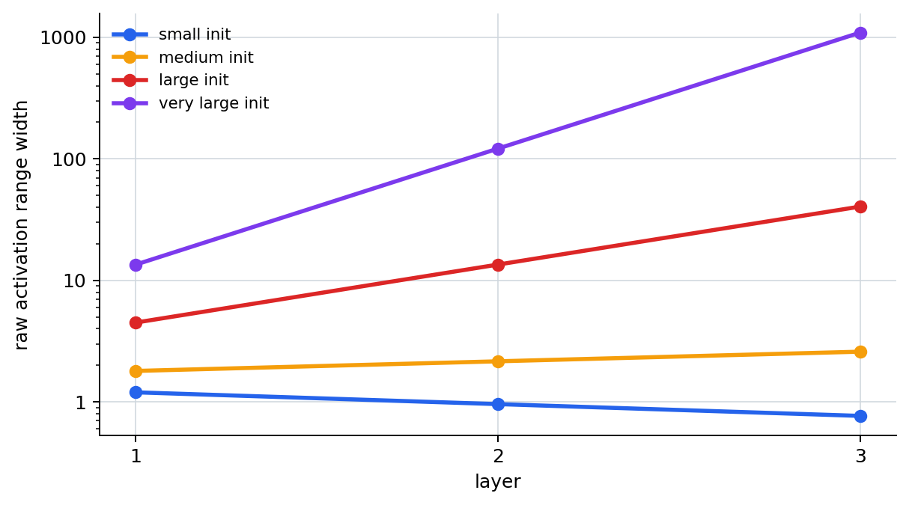
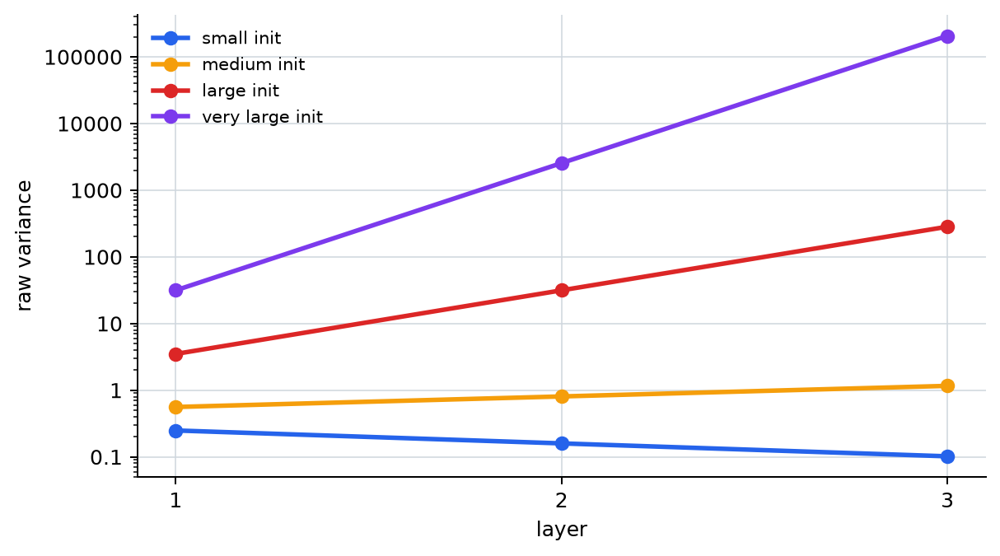
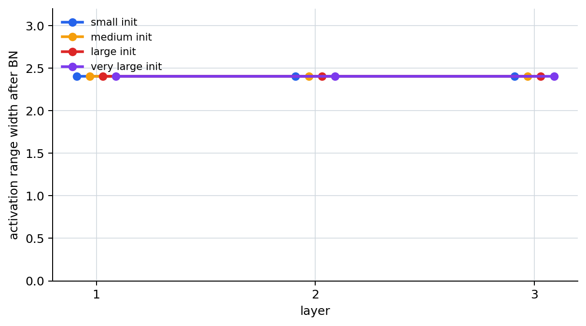

# P5-8.4 Supplementary Reading: How A Large Initialization Scale Shakes The Computation Range

Section ID: `P5-8.4`
Version: `v2026.07.17`

In P5-8.3, we grouped together the conditions that make deep computation actually shake less: initialization, numerical stability, and batch normalization. Now we confirm that claim with actual numbers.

The core question is simple.

When the same activations pass through several layers, how much does a large initialization scale actually amplify the values?

This section does not reproduce full learning. Instead, it assumes that the activation values coming from the previous layer pass through the same linear transform across three layers, and checks how a small scale and a large scale change the output range and variance at each layer. The single scalar multiplied at each layer is enough to read as `a toy experimental value that represents the weight scale of that layer in simplified form`. Then we also check how the output range is reorganized into an easier-to-handle form once batch normalization is applied after each layer.

## Scope Of This Section

- How does a large initialization scale increase the range and variance of raw activations during deep repeated computation?
- If batch normalization is applied after each layer, how does the same computational flow change?
- Even though this example does not stand in for a full neural network, how does it help us hold onto the intuition of computational stabilization?

As the final stage of Chapter 8, this section is the place where we confirm with numbers the `computation-stabilization devices` gathered in the previous section. That is also why we do not discuss optimizer updates, loss reduction, or actual dataset training performance here. Those topics are passed to the learning-loop explanation in P5-6.1 and the optimizer explanations in P5-7.1 and P5-7.2.

## How To Read The Example

The input in the example below is not an arbitrary table of numbers, but activation values assumed to have come from the previous layer for three samples.

| Sample | Activation from the previous layer |
| --- | ---: |
| A | 1.0 |
| B | 2.0 |
| C | 0.5 |

The weight scale is divided into four cases.

| Case | Value multiplied at each layer | Change to predict first |
| --- | ---: | --- |
| `small_init` | 0.8 | values shrink as they pass through layers |
| `medium_init` | 1.2 | values grow little by little |
| `large_init` | 3.0 | the value range and variance grow quickly |
| `very_large_init` | 9.0 | the values grow explosively in deep repeated computation |

The important point here is not `the large values mean richer representation`. It is that when the same pattern is repeated through deep layers, the range of values received by the next layer and the gradient path can shake together.

It is better not to run this example only once and stop, but to change the values below and see which outputs become sensitive first.

| Value to change first | Output to look at first | Question to interpret |
| --- | --- | --- |
| the scales in `weight_cases` | `raw_range`, `raw_variance` | as the starting scale grows, how quickly does repeated computation expand the range? |
| the number of `layer` repetitions | changes in each layer's `raw_range`, `raw_variance` | even with the same scale, how much more instability accumulates as the number of layers grows? |
| the input activation table | `raw_range`, `after_bn_range` | when the input distribution changes, how does the post-batch-normalization range change together? |
| `eps` | subtle changes in `after_bn_range` | how does it show that batch normalization organizes the distribution using the mean and variance as its standard? |

One more point should be fixed first here as well. The batch-normalization results below do not mean `it is fine even if initialization becomes arbitrarily large`. This toy experiment separates out only `what kind of distribution reorganization appears when we change only the scale while keeping the same sample shape`. So it is safer to read batch normalization as `a device that reorganizes a distribution that has already appeared into a range that is easier to handle`, not as something that replaces the starting-point problem handled by initialization.

## Python Example

```python
hidden_activations = [
    {"sample": "A", "activation": 1.0},
    {"sample": "B", "activation": 2.0},
    {"sample": "C", "activation": 0.5},
]

weight_cases = {
    "small_init": 0.8,
    "medium_init": 1.2,
    "large_init": 3.0,
    "very_large_init": 9.0,
}

def linear_layer(values, weight):
    return [value * weight for value in values]

def batch_norm(values, eps=1e-5):
    mean = sum(values) / len(values)
    variance = sum((v - mean) ** 2 for v in values) / len(values)
    normalized = [(v - mean) / ((variance + eps) ** 0.5) for v in values]
    return mean, variance, normalized

for case_name, weight in weight_cases.items():
    raw_values = [row["activation"] for row in hidden_activations]
    bn_values = [row["activation"] for row in hidden_activations]
    print(f"[{case_name}] weight = {weight}")

    for layer in range(1, 4):
        raw_values = linear_layer(raw_values, weight)
        _, raw_variance, _ = batch_norm(raw_values)

        before_bn = linear_layer(bn_values, weight)
        _, _, bn_values = batch_norm(before_bn)

        print(
            f"layer {layer}: "
            f"raw_range=({min(raw_values):.3f}, {max(raw_values):.3f}), "
            f"raw_variance={raw_variance:.3f}, "
            f"after_bn_range=({min(bn_values):.3f}, {max(bn_values):.3f})"
        )
    print("---")
```

This code does not implement an entire real neural-network layer. It is a compressed experiment that looks only at `where the weight scale pushes value range and variance as it passes through layers`. So what we should look at first is not exact training performance, but `the direction of repeated computation and scale accumulation`.

An example output looks like this.

```text
[small_init] weight = 0.8
layer 1: raw_range=(0.400, 1.600), raw_variance=0.249, after_bn_range=(-1.069, 1.336)
layer 2: raw_range=(0.320, 1.280), raw_variance=0.159, after_bn_range=(-1.069, 1.336)
layer 3: raw_range=(0.256, 1.024), raw_variance=0.102, after_bn_range=(-1.069, 1.336)
---
[medium_init] weight = 1.2
layer 1: raw_range=(0.600, 2.400), raw_variance=0.560, after_bn_range=(-1.069, 1.336)
layer 2: raw_range=(0.720, 2.880), raw_variance=0.806, after_bn_range=(-1.069, 1.336)
layer 3: raw_range=(0.864, 3.456), raw_variance=1.161, after_bn_range=(-1.069, 1.336)
---
[large_init] weight = 3.0
layer 1: raw_range=(1.500, 6.000), raw_variance=3.500, after_bn_range=(-1.069, 1.336)
layer 2: raw_range=(4.500, 18.000), raw_variance=31.500, after_bn_range=(-1.069, 1.336)
layer 3: raw_range=(13.500, 54.000), raw_variance=283.500, after_bn_range=(-1.069, 1.336)
---
[very_large_init] weight = 9.0
layer 1: raw_range=(4.500, 18.000), raw_variance=31.500, after_bn_range=(-1.069, 1.336)
layer 2: raw_range=(40.500, 162.000), raw_variance=2551.500, after_bn_range=(-1.069, 1.336)
layer 3: raw_range=(364.500, 1458.000), raw_variance=206671.500, after_bn_range=(-1.069, 1.336)
---
```

The first thing to look at in this output is the `very_large_init` numbers. In the first layer the raw range is `(4.500, 18.000)`, but by the third layer it has grown to `(364.500, 1458.000)`. The same input pattern was simply passed through repeatedly, yet with a large scale the value range truly widens dramatically as the network gets deeper.

For beginners, it is better not to leave the example output as a block of numbers, but to read it back through the following three lines.

| The line we see first in the output | The question we should ask right after | The concept to hold onto here |
| --- | --- | --- |
| the `raw_range` of `very_large_init` grows sharply at each layer | when the same pattern repeats, how quickly does the value range become unstable? | a large initialization scale can shake numerical stability in deep computation |
| `raw_variance` grows together | does the spread of inputs received by the next layer keep growing? | the larger this spread becomes, the more the next computation and gradient path can shake together |
| `after_bn_range` regathers into a comparable range | what exactly did batch normalization reorganize? | batch normalization does not erase the initialization problem, but reorganizes the intermediate distribution into a form that is easier to handle |

## Reading It Through Graphs

The first graph shows the raw activation range at each layer. `large_init` and `very_large_init` spread the value range widely between the same samples as the network becomes deeper.



The second graph compresses the same phenomenon into the variance. Because variance shows the spread of values as a single number, it becomes easier to read how quickly a large scale can create an unstable range in deep layers.



The third graph shows the output range after applying batch normalization behind each layer. Raw activations differ greatly by case, but after normalization the range is reorganized into `a similar scale that is easier for the next layer to handle`. The important point here is not `the numbers are always fixed to exactly the same values`, but rather `even if the input distribution differs greatly, the center and spread are brought back into a comparable range`. In this toy example, the ranges across cases look almost identical because the relative shape of the three samples is preserved while only the scale is changed, so it would be too strong to read this figure alone as saying `batch normalization almost erases the initialization problem`.



## The Conclusion We Should Read

| What appears in the output | Interpretation that is easy to leave as-is | Interpretation reread from the stabilization viewpoint |
| --- | --- | --- |
| the raw range and variance of `very_large_init` grow sharply at each layer | it is easy to feel that large values are a good sign because they mean stronger representation | in deep repeated computation, a large scale can become a numerical-stability problem that shakes the next layer and the gradient path |
| after batch normalization, the ranges are reorganized to similar scales across cases | it is easy to feel that batch normalization simply removed the large values | it re-centers and re-scales the intermediate distribution so the next layer receives inputs in a range it can handle more easily |
| with `small_init`, the raw variance instead decreases | it is easy to feel that smaller is always safer | too small a scale can also lead toward weaker signals and gradients in deep layers, so being small alone is not sufficient |

Therefore initialization and batch normalization are not devices that solve the same problem in the same place. Initialization sets the starting scale, and batch normalization reorganizes the activation distribution that has already appeared between layers. Numerical stability is the common question that explains why the two are discussed together in deep networks.

The conclusion this experiment should let us hold onto first is simple. Its role is to let us see with our own eyes `how quickly the raw activation range and variance become unstable as the weight scale grows`, and `why batch normalization pulls the scale received by the next layer back into a comparable range`.

## Checklist

- Can you explain that a large initialization scale can actually enlarge the raw activation range as values pass through layers?
- Can you explain that raw variance can serve as a simple observation value for reading instability in deep repeated computation?
- Can you explain that batch normalization is not removing large values, but a device for resetting the standard of the distribution?
- Can you distinguish that this example is not a full training process, but a small experiment for confirming the intuition of numerical stability?

## Sources And References

- Aston Zhang, Zachary C. Lipton, Mu Li, Alexander J. Smola, `Dive into Deep Learning`, `5.4 Numerical Stability and Initialization`, `8.5 Batch Normalization`, checked on 2026-07-14. [https://d2l.ai/](https://d2l.ai/){: target="_blank" rel="noopener noreferrer" }
- Ian Goodfellow, Yoshua Bengio, Aaron Courville, `Deep Learning`, Part II `Modern Practical Deep Networks`, checked on 2026-07-14. [https://www.deeplearningbook.org/](https://www.deeplearningbook.org/){: target="_blank" rel="noopener noreferrer" }
