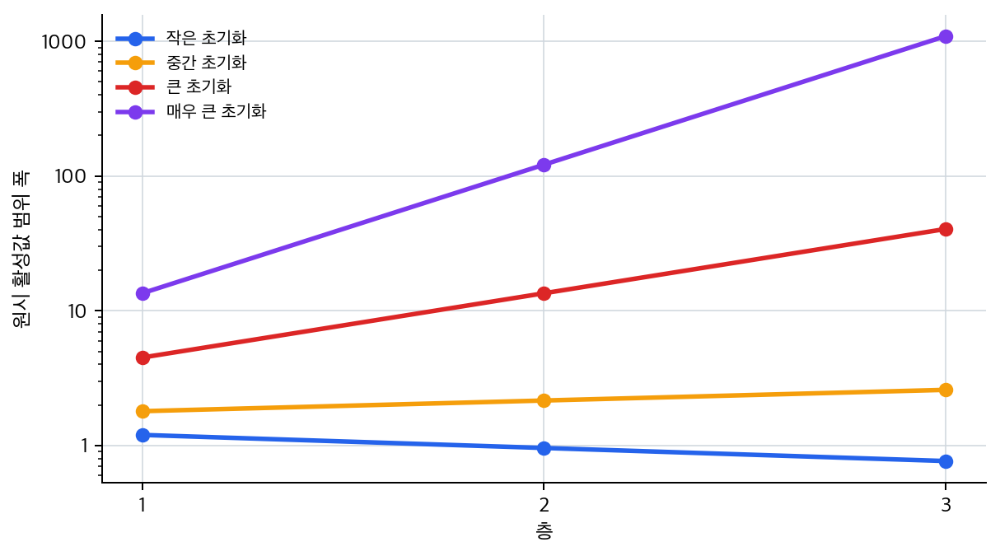
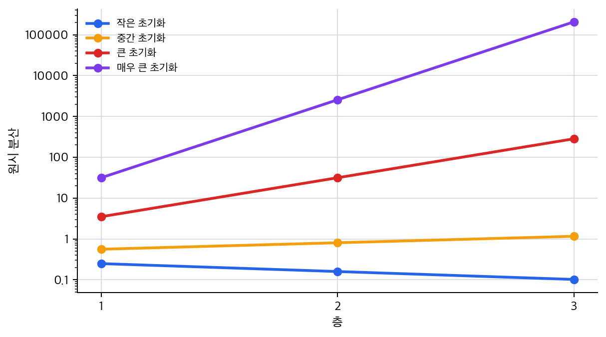
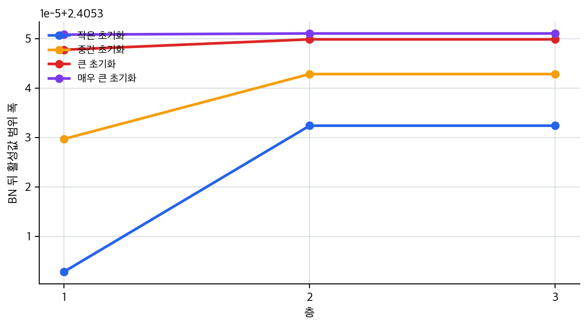

# P5-8.4 보충학습: 큰 초기화 스케일이 깊은 층에서 값을 어떻게 키우는가

Section ID: `P5-8.4`
Version: `v2026.07.16`

P5-8.3에서는 초기화(initialization), 수치 안정성(numerical stability), 배치 정규화(batch normalization)를 `깊은 네트워크를 덜 흔들리게 하는 조건`으로 묶어 읽었습니다. 이제 그 말을 실제 숫자로 확인합니다.

핵심 질문은 단순합니다.

같은 활성값이 여러 층을 지나갈 때, 큰 초기화 스케일은 값을 실제로 얼마나 키우는가?

이 절에서는 실제 학습 전체를 재현하지 않습니다. 대신 이전 층에서 넘어온 활성값(activation)이 같은 선형 변환을 3개 층 통과한다고 놓고, 작은 스케일과 큰 스케일이 층별 출력 범위와 분산을 어떻게 바꾸는지 확인합니다. 여기서 층마다 곱하는 하나의 스칼라 값은 `각 층 가중치 스케일을 단순화해 대표한 장난감 실험값`으로 읽으면 충분합니다. 그런 다음 각 층 뒤에 batch normalization을 적용하면 출력 범위가 어떻게 다시 다루기 쉬운 쪽으로 정리되는지도 함께 봅니다.

## 이 절의 범위

- 큰 초기화 스케일이 깊은 반복 계산에서 raw activation 범위와 분산을 어떻게 키우는가?
- batch normalization을 각 층 뒤에 적용하면 같은 계산 흐름이 어떻게 달라지는가?
- 이 예제가 실제 신경망 전체를 대신하지는 않지만, 수치 안정성 직관을 어떻게 붙잡아 주는가?

이 절에서는 optimizer update, loss 감소, 실제 데이터셋 학습 성능을 다루지 않습니다. 그 주제는 P5-6.1의 학습 루프 설명과 P5-7.1, P5-7.2의 optimizer 설명으로 넘깁니다.

## 예제의 읽기 기준

아래 예제의 입력은 임의의 숫자표가 아니라, 이전 층에서 세 샘플에 대해 넘어왔다고 가정한 활성값입니다.

| 샘플 | 이전 층 활성값 |
| --- | ---: |
| A | 1.0 |
| B | 2.0 |
| C | 0.5 |

가중치 스케일은 네 단계로 둡니다.

| 케이스 | 층마다 곱하는 값 | 먼저 예상할 변화 |
| --- | ---: | --- |
| `small_init` | 0.8 | 층을 지날수록 값이 줄어듭니다. |
| `medium_init` | 1.2 | 값이 조금씩 커집니다. |
| `large_init` | 3.0 | 값 범위와 분산이 빠르게 커집니다. |
| `very_large_init` | 9.0 | 깊은 반복 계산에서 폭발적으로 커집니다. |

여기서 중요한 점은 `큰 값이 나왔으니 표현이 풍부하다`가 아닙니다. 같은 패턴이 깊은 층에서 반복되면 다음 층이 받는 값의 범위와 gradient 경로가 함께 흔들릴 수 있다는 점입니다.

이 예제는 한 번 실행하고 끝내기보다, 아래 값을 직접 바꿔 보며 어떤 출력이 먼저 민감하게 흔들리는지 확인하는 편이 더 좋습니다.

| 먼저 바꿔 볼 값 | 먼저 볼 출력 | 해석할 질문 |
| --- | --- | --- |
| `weight_cases`의 스케일 | `raw_range`, `raw_variance` | 출발 스케일이 커질수록 반복 계산이 얼마나 빠르게 범위를 키우는가 |
| `layer` 반복 횟수 | 각 층의 `raw_range`, `raw_variance` 변화 | 같은 스케일도 층 수가 늘면 불안정성이 얼마나 누적되는가 |
| 입력 활성값 표 | `raw_range`, `after_bn_range` | 입력 분포가 달라지면 batch normalization 뒤 범위도 어떻게 함께 바뀌는가 |
| `eps` | `after_bn_range`의 미세 변화 | batch normalization이 평균과 분산을 기준으로 분포를 정리한다는 점이 어떻게 드러나는가 |

## Python 예제

```python
hidden_activations = [
    {"sample": "A", "activation": 1.0},
    {"sample": "B", "activation": 2.0},
    {"sample": "C", "activation": 0.5},
]

weight_cases = {
    "small_init": 0.8,
    "medium_init": 1.2,
    "large_init": 3.0,
    "very_large_init": 9.0,
}

def linear_layer(values, weight):
    return [value * weight for value in values]

def batch_norm(values, eps=1e-5):
    mean = sum(values) / len(values)
    variance = sum((v - mean) ** 2 for v in values) / len(values)
    normalized = [(v - mean) / ((variance + eps) ** 0.5) for v in values]
    return mean, variance, normalized

for case_name, weight in weight_cases.items():
    raw_values = [row["activation"] for row in hidden_activations]
    bn_values = [row["activation"] for row in hidden_activations]
    print(f"[{case_name}] weight = {weight}")

    for layer in range(1, 4):
        raw_values = linear_layer(raw_values, weight)
        _, raw_variance, _ = batch_norm(raw_values)

        before_bn = linear_layer(bn_values, weight)
        _, _, bn_values = batch_norm(before_bn)

        print(
            f"layer {layer}: "
            f"raw_range=({min(raw_values):.3f}, {max(raw_values):.3f}), "
            f"raw_variance={raw_variance:.3f}, "
            f"after_bn_range=({min(bn_values):.3f}, {max(bn_values):.3f})"
        )
    print("---")
```

이 코드는 `실제 신경망 층 전체`를 구현한 것이 아니라, `가중치 스케일이 층을 거치며 값 범위와 분산을 어디로 밀고 가는가`만 보려는 축약 실험입니다. 따라서 여기서 먼저 볼 것은 정확한 학습 성능이 아니라 `반복 계산과 스케일 누적 방향`입니다.

출력 예시는 다음과 같습니다.

```text
[small_init] weight = 0.8
layer 1: raw_range=(0.400, 1.600), raw_variance=0.249, after_bn_range=(-1.069, 1.336)
layer 2: raw_range=(0.320, 1.280), raw_variance=0.159, after_bn_range=(-1.069, 1.336)
layer 3: raw_range=(0.256, 1.024), raw_variance=0.102, after_bn_range=(-1.069, 1.336)
---
[medium_init] weight = 1.2
layer 1: raw_range=(0.600, 2.400), raw_variance=0.560, after_bn_range=(-1.069, 1.336)
layer 2: raw_range=(0.720, 2.880), raw_variance=0.806, after_bn_range=(-1.069, 1.336)
layer 3: raw_range=(0.864, 3.456), raw_variance=1.161, after_bn_range=(-1.069, 1.336)
---
[large_init] weight = 3.0
layer 1: raw_range=(1.500, 6.000), raw_variance=3.500, after_bn_range=(-1.069, 1.336)
layer 2: raw_range=(4.500, 18.000), raw_variance=31.500, after_bn_range=(-1.069, 1.336)
layer 3: raw_range=(13.500, 54.000), raw_variance=283.500, after_bn_range=(-1.069, 1.336)
---
[very_large_init] weight = 9.0
layer 1: raw_range=(4.500, 18.000), raw_variance=31.500, after_bn_range=(-1.069, 1.336)
layer 2: raw_range=(40.500, 162.000), raw_variance=2551.500, after_bn_range=(-1.069, 1.336)
layer 3: raw_range=(364.500, 1458.000), raw_variance=206671.500, after_bn_range=(-1.069, 1.336)
---
```

이 출력에서 먼저 볼 것은 `very_large_init`의 숫자입니다. 1층에서는 raw range가 `(4.500, 18.000)`이지만, 3층에서는 `(364.500, 1458.000)`까지 커집니다. 같은 입력 패턴을 반복해서 통과시켰을 뿐인데, 스케일이 큰 경우에는 층이 깊어질수록 값 범위가 실제로 크게 벌어집니다.

## 그래프로 나눠 읽기

첫 그래프는 층별 raw activation 범위를 보여 줍니다. `large_init`와 `very_large_init`는 층이 깊어질수록 같은 샘플 사이의 값 범위가 크게 벌어집니다.



둘째 그래프는 같은 현상을 분산(variance)으로 압축합니다. 분산은 값의 퍼짐을 하나의 숫자로 보여 주기 때문에, 깊은 층에서 큰 스케일이 얼마나 빠르게 불안정한 범위를 만들 수 있는지 읽기 쉽습니다.



셋째 그래프는 각 층 뒤에 batch normalization을 적용한 뒤의 출력 범위입니다. raw activation은 케이스마다 크게 달라지지만, normalization 뒤의 범위는 `다음 층이 다루기 쉬운 비슷한 규모`로 다시 정리됩니다. 여기서 중요한 점은 `항상 똑같은 숫자로 고정된다`가 아니라, `입력 분포가 크게 달라도 중심과 퍼짐이 다시 비교 가능한 범위로 맞춰진다`는 쪽입니다. 이 장난감 예제에서 케이스별 범위가 거의 같게 보이는 이유는 세 샘플의 상대적 모양은 유지한 채 스케일만 바꾸고 있기 때문입니다.



## 읽어야 할 결론

| 출력에서 보이는 것 | 그대로 두면 남기 쉬운 해석 | 안정화 관점에서 다시 읽는 해석 |
| --- | --- | --- |
| `very_large_init`의 raw range와 variance가 층마다 급격히 커진다 | 큰 값은 더 강한 표현이므로 좋은 신호라고 느끼기 쉽다 | 깊은 반복 계산에서는 큰 스케일이 다음 층과 gradient 경로를 흔드는 수치 안정성 문제가 될 수 있다 |
| batch normalization 뒤 range가 케이스별로 비슷한 규모로 정리된다 | batch normalization이 큰 값을 그냥 없애 버렸다고 느끼기 쉽다 | 중간 분포의 중심과 퍼짐을 다시 맞춰 다음 층이 다루기 쉬운 입력 범위로 바꾼 것이다 |
| `small_init`은 오히려 raw variance가 줄어든다 | 작으면 무조건 안전하다고 느끼기 쉽다 | 너무 작은 스케일은 깊은 층에서 신호와 gradient가 약해지는 방향으로 이어질 수 있어, 작기만 하다고 충분하지는 않다 |

따라서 초기화와 batch normalization은 같은 문제를 같은 위치에서 푸는 장치가 아닙니다. 초기화는 출발 스케일을 정하고, batch normalization은 층 사이에서 이미 생긴 활성값 분포를 다시 정리합니다. 수치 안정성은 이 둘이 왜 깊은 네트워크에서 함께 이야기되는지 설명하는 공통 질문입니다.

이 절에서 실험으로 먼저 붙잡아야 할 결론은 단순합니다. `가중치 스케일을 키우면 raw activation 범위와 분산이 층을 지날수록 얼마나 빨리 불안정해지는지`, 그리고 `batch normalization을 끼우면 다음 층이 받는 규모를 왜 다시 비교 가능한 범위로 돌려놓는지`를 눈으로 확인하는 데 이 예제의 역할이 있습니다.

## 체크리스트

- 큰 초기화 스케일이 층을 지날수록 raw activation 범위를 실제로 키울 수 있음을 설명할 수 있는가?
- raw variance가 깊은 반복 계산의 불안정성을 읽는 간단한 관찰값이 될 수 있음을 설명할 수 있는가?
- batch normalization이 큰 값을 없애는 것이 아니라 분포 기준을 다시 맞추는 장치임을 설명할 수 있는가?
- 이 예제가 실제 학습 전체가 아니라 수치 안정성 직관을 확인하는 작은 실험임을 구분할 수 있는가?

## 출처와 참고 자료

- Aston Zhang, Zachary C. Lipton, Mu Li, Alexander J. Smola, `Dive into Deep Learning`, `5.4 Numerical Stability and Initialization`, `8.5 Batch Normalization`, 확인 날짜: 2026-07-14. [https://d2l.ai/](https://d2l.ai/){: target="_blank" rel="noopener noreferrer" }
- Ian Goodfellow, Yoshua Bengio, Aaron Courville, `Deep Learning`, Part II `Modern Practical Deep Networks`, 확인 날짜: 2026-07-14. [https://www.deeplearningbook.org/](https://www.deeplearningbook.org/){: target="_blank" rel="noopener noreferrer" }
